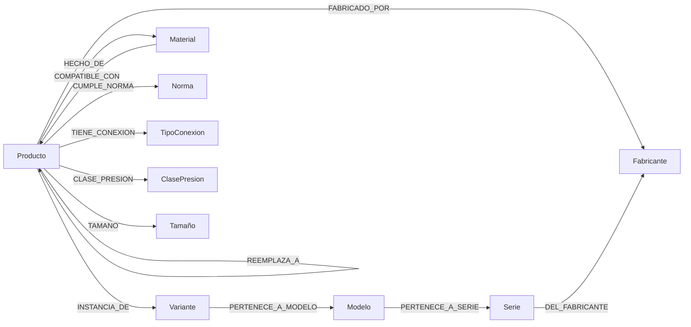

# ADR-039: Diseño de ontología del Knowledge Graph PVF

- Status: proposed (work no arranca hasta cierre Fase 1)
- Date: 2026-05-06
- Deciders: Pablo Sierra (BR), Christian (MT sponsor), Paula (MT validador), TI MT, Ontólogo PVF (TBD)
- Supersedes: —
- Relacionados: ADR-038 (roadmap), ADR-040 (seed materiales), ADR-041 (CDC)

## Contexto

Si Fase 2 introduce un knowledge graph para el comparador (decisión gateada en ADR-038), hace falta una **ontología explícita**: nodos, propiedades, edges, cardinalidades. Diseñar mal esta ontología en Fase 2 es caro: el modelo de datos se acopla a queries Cypher, embeddings, CDC y UI; refactorizar el grafo después implica reseed completo.

PVF (pipes / valves / fittings) es un dominio especializado de procurement industrial con vocabulario propio (DN, PN, NPT vs BSP, clases de presión, normas API/ASME/DIN/ASTM). Sin **ontólogo PVF** que lo curre, los nodos quedan demasiado genéricos (`Componente`) o demasiado finos (un nodo por subcomponente del actuador).

## Decisión

**Adoptar el siguiente esquema base como punto de partida de Fase 2.** Refinable por el ontólogo cuando se incorpore.

### Nodos

| Nodo | Propiedades clave | Origen del seed |
|------|-------------------|-----------------|
| `Producto` | `sku`, `nombre_canonico_en`, `descripcion`, `embedding_text`, `embedding_image`, `data_quality_score`, `created_at` | PIM (5 086 filas) + catálogo MT (4 182 filas) |
| `Fabricante` | `nombre`, `pais`, `dominio_canonico`, `whitelist_activo` | `manufacturers_whitelist` Fase 1 (Pegler, Arco, Giacomini, Apollo, Nibco, ...) |
| `Material` | `codigo`, `familia` (`Latón`/`Acero`/`Fundición`/`SS`/`Elastómero`/`PTFE`), `subtipo` (`CW604N`, `GG25`, `A316L`, `Vitón`, ...), `temp_min`, `temp_max` | `Copia de Compatibilidad de Materiales MT V4.xlsx` (657 filas, 12 materiales) |
| `Norma` | `codigo` (`API 598`, `ISO 7-1`, `UNE-EN 1074-3`, `ASME B16.34`), `emisor`, `version`, `alcance` | PDFs de estándares (`API_598`, `ISO 7-1_1994`, `UNE-EN_1074-3=2001`) |
| `TipoConexion` | `codigo` (`NPT`, `BSP`, `Flanged`, `Press`, `Threaded`), `familia`, `compatibilidades` | Fichas técnicas + extracción LLM |
| `ClasePresion` | `codigo` (`PN10`, `PN16`, `PN25`, `PN40`, `Class150`, `Class300`), `bar`, `psi` | Fichas técnicas |
| `Tamaño` | `dn` (mm), `inch`, `dn_canonico` | Fichas técnicas + tabla equivalencias `dn_unit_map` |
| `Serie` | `nombre`, `fabricante_id`, `descripcion` | Catálogo MT + catálogos fabricantes |
| `Modelo` | `nombre`, `serie_id` | Catálogo MT |
| `Variante` | `codigo`, `modelo_id`, `propiedades_diferenciales` (JSONB) | PIM + catálogo MT |

### Edges

| Edge | Origen → Destino | Cardinalidad | Origen del seed |
|------|------------------|--------------|-----------------|
| `FABRICADO_POR` | `Producto` → `Fabricante` | N:1 | PIM `manufacturer` |
| `CUMPLE_NORMA` | `Producto` → `Norma` | N:N | Fichas técnicas + LLM extraction sobre PDFs |
| `EQUIVALENTE_A` | `Producto` ↔ `Producto` | N:N | Cross-reference tables públicas (Crane / Apollo / Milwaukee) + curación humana |
| `REEMPLAZA_A` | `Producto` → `Producto` (descontinuado) | N:1 | Catálogos fabricante + boletines de obsolescencia |
| `COMPATIBLE_CON` | `Material` ↔ `Producto` (con prop `temp_max`) | N:N | `Copia de Compatibilidad de Materiales MT V4.xlsx` (seed directo, ver ADR-040) |
| `HECHO_DE` | `Producto` → `Material` | N:N | `Copia de Compatibilidad de Materiales MT V4.xlsx` + fichas técnicas |
| `TIENE_CONEXION` | `Producto` → `TipoConexion` | N:N | Fichas técnicas |
| `CLASE_PRESION` | `Producto` → `ClasePresion` | N:1 | Fichas técnicas |
| `TAMAÑO` | `Producto` → `Tamaño` | N:1 | PIM + ficha técnica |
| `PERTENECE_A_SERIE` | `Modelo` → `Serie` | N:1 | Catálogo |
| `PERTENECE_A_MODELO` | `Variante` → `Modelo` | N:1 | Catálogo |
| `INSTANCIA_DE` | `Producto` → `Variante` | N:1 | Catálogo + PIM |

### Diagrama Mermaid



### Constraints Cypher (DDL inicial)

```cypher
CREATE CONSTRAINT producto_sku_unique IF NOT EXISTS
  FOR (p:Producto) REQUIRE p.sku IS UNIQUE;
CREATE CONSTRAINT fabricante_nombre_unique IF NOT EXISTS
  FOR (f:Fabricante) REQUIRE f.nombre IS UNIQUE;
CREATE CONSTRAINT material_codigo_unique IF NOT EXISTS
  FOR (m:Material) REQUIRE m.codigo IS UNIQUE;
CREATE CONSTRAINT norma_codigo_unique IF NOT EXISTS
  FOR (n:Norma) REQUIRE n.codigo IS UNIQUE;
CREATE INDEX producto_embedding_text IF NOT EXISTS
  FOR (p:Producto) ON (p.embedding_text);
CREATE INDEX producto_dn IF NOT EXISTS
  FOR (p:Producto) ON (p.dn_canonico);
```

### Recurso requerido

**Ontólogo con experiencia PVF (procurement industrial / pipes-valves-fittings)**:

- Perfil: 5+ años en industria, conocimiento de normas ANSI/ASME/DIN/ASTM/API/ISO, experiencia en catálogos de fabricantes mayores (Crane, Apollo, Pegler, Giacomini), preferentemente con exposición a knowledge graphs / ontologías formales.
- Dónde encontrar: LinkedIn (filtros "valve engineer" + "ontology" / "data engineering"), consultoras de procurement industrial, universidades de ingeniería mecánica con líneas de research en industrial data.
- Compromiso: full-time o 60 % durante construcción del grafo (2-4 meses Fase 2); 20 % maintenance Fase 3.
- Responsabilidad de contratación: **MT** (no BR; flagged al programa).
- Trigger contratación: cierre de Fase 1 (G4).

## Alternativas evaluadas

- **Ontología minimal** (`Producto + Fabricante + Material` solamente): rechazada. Cubre solo ~30 % de los queries críticos; equivalencias entre marcas y compliance de normas no se modelan.
- **Ontología máxima** (incluye sub-componentes de válvula — vástago, asiento, prensaestopas, actuador, posicionador, transductores): rechazada para Fase 2. Apropiada para Fase 4+ cuando MT venda repuestos a nivel componente. Riesgo: explosion de nodos sin valor inmediato.
- **Reusar ontología existente** (PSL, ISO 15926, ECLASS): evaluado parcialmente. ISO 15926 es demasiado pesado; ECLASS no cubre edges de equivalencia inter-marca. Tomar ideas (campos canónicos) sin adoptar el estándar completo.

## Consecuencias positivas

- **Modelo de datos explícito** que sirve de contrato para el ontólogo PVF cuando se incorpore.
- **Seed concreto** de los archivos del cliente (ver ADR-040): 657 filas de compatibilidad materiales, 5 086 filas PIM, 4 182 filas catálogo, 5 fabricantes whitelist, 3 normas PDF.
- **Cardinalidades explícitas** ayudan al ontólogo a refinar sin reescribir desde cero.

## Consecuencias negativas / riesgos

- **Sin ontólogo, mal modelo de datos**: mitigación — congelar este ADR como `proposed` hasta que el ontólogo lo revise; iterar a `accepted` solo tras revisión.
- **Re-seed costoso si el ontólogo cambia el modelo**: mitigación — los archivos seed están en formato tabular y un re-load en Cypher es cuestión de horas, no de semanas.
- **Cross-references de marcas no son públicas para todas las marcas**: mitigación — empezar con las 5 marcas whitelist; ampliar oportunísticamente.

## Cuándo revisar

- **Antes de S1 Fase 2**: ontólogo PVF revisa y firma este ADR (status → `accepted`).
- **Tras seed inicial**: validar que las queries Cypher de los 5 deal breakers críticos (DN match, PN ≥, material compatible, conexión compatible, norma cumplida) responden en < 100 ms P95.
- **Cierre Fase 2**: evaluar si añadir nodos `Aplicación` (vapor / agua potable / gas / hidrocarburo) o `Sector` (HVAC / petroquímico / waterworks) aporta valor para Fase 3.
