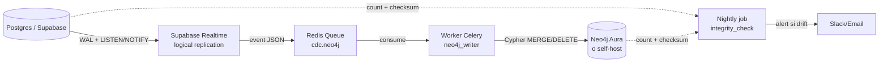

# ADR-041: CDC Postgres ↔ Neo4j (Fase 2+)

- Status: proposed
- Date: 2026-05-06
- Deciders: Pablo Sierra (BR), Christian (MT sponsor), Paula (MT validador), TI MT, Ontólogo PVF (TBD)
- Supersedes: —
- Relacionados: ADR-038 (roadmap), ADR-039 (ontología), ADR-040 (seed materiales), ADR-031 (Supabase Postgres)

## Contexto

En Fase 2 el knowledge graph en Neo4j es **proyección derivada** del PIM y del catálogo en Postgres (sistema de récord). Cada cambio en `products`, `competitor_listings`, `prices` o tablas de seed (compatibilidad materiales, fabricantes whitelist, normas) tiene que reflejarse en el grafo. Si no se replica, el grafo se vuelve stale y los queries devuelven resultados obsoletos — pérdida del valor del KG.

Hay tres patrones disponibles:

1. **Writes duales sincrónicos** desde el backend FastAPI: cada `INSERT/UPDATE` en Postgres dispara un write Cypher antes de retornar al cliente. Acopla performance del backend al de Neo4j; cualquier degradación de Neo4j cuelga los endpoints HTTP.
2. **CDC asíncrono** (Change Data Capture): un componente captura cambios de Postgres (WAL / triggers / Realtime) y los reenvía a un worker que escribe en Neo4j. Eventual consistency, desacoplado.
3. **Refresh batch nocturno**: dump completo del PIM y reload en Neo4j. Simple pero datos del comparador con staleness > 12 h.

## Decisión

**Adoptar CDC asíncrono basado en Supabase Realtime + worker Celery custom como solución default Fase 2. Debezium queda como alternativa si Realtime no escala. Eventual consistency aceptable; tests de integridad nightly.**

### Arquitectura

### Eventos cubiertos

| Origen Postgres | Operación | Cypher resultante |
|-----------------|-----------|--------------------|
| `products` INSERT | nuevo SKU | `MERGE (p:Producto {sku: $sku}) SET p += {...}` |
| `products` UPDATE | cambio de specs | `MATCH (p:Producto {sku: $sku}) SET p.* = $props` |
| `products` DELETE soft | retirado | `MATCH (p:Producto {sku: $sku}) SET p.active = false` |
| `manufacturers_whitelist` UPSERT | fabricante | `MERGE (f:Fabricante {nombre: $nombre})` + relinkear `FABRICADO_POR` |
| `match_decisions` INSERT confirmed | match humano | `MERGE (a)-[:EQUIVALENTE_A {confirmed_by: $user}]->(b)` |
| `competitor_listings` INSERT | listing competidor | `MERGE (l:Listing {id: $id}) - sin grafo crítico Fase 2; opcional Fase 3` |
| Tablas seed (`compat_materiales`) | carga inicial | one-shot loader (no streaming) |

### Tolerancia y consistencia

- **Lag aceptable**: P95 ≤ 30 s, P99 ≤ 5 min en condiciones normales.
- **Out-of-order events**: el worker idempotentiza por `event_id + version` y reintenta con backoff exponencial.
- **Dead-letter queue** (`cdc.neo4j.dlq`) para eventos que fallen 3 veces; alerta a TI MT.

### Tests de integridad

- **Nightly job**: para cada tabla relevante, contar filas en Postgres y nodos correspondientes en Neo4j; si delta > 0,1 % alertar.
- **Checksums por entidad**: hash de `(sku, updated_at)` por SKU; comparar lado-a-lado mensual.
- **Replay**: si drift detectado, posibilidad de re-ejecutar CDC desde un timestamp.

### Alternativa Debezium

- Si Supabase Realtime no escala (>1k eventos/min sostenidos) o tiene gaps de cobertura, Debezium directo sobre WAL es alternativa. Coste operativo + 1.
- Decisión final: medir en S1 Fase 2 con stress test.

## Alternativas evaluadas

- **Writes duales sincrónicos**: rechazada. Acopla SLO del backend al de Neo4j; un incidente Neo4j tumba endpoints HTTP del comparador.
- **Refresh batch nocturno**: rechazada. Staleness > 12 h inaceptable para comparador en producción donde un Comercial actualiza specs a las 9:00 y consulta a las 9:30.
- **Triggers Postgres → HTTP webhook a Neo4j**: rechazada por debugging y resilience inferior a Realtime + Celery.
- **Apache Kafka como bus de CDC**: descartada para Fase 2 por overhead operativo (ZooKeeper / KRaft + brokers). Reservada para Fase 3+ si volumen sube a > 10k eventos/min.

## Consecuencias positivas

- **Desacoplamiento**: el backend FastAPI no depende del up-time de Neo4j para responder.
- **Reutiliza stack existente**: Supabase Realtime ya está en operación; Celery + Redis idem (ADR-030).
- **Eventual consistency aceptable** para un sistema de comparación competitiva (no es transaccional).
- **Trazabilidad**: cada evento en queue Redis es auditable.

## Consecuencias negativas / riesgos

- **Eventual consistency confunde a usuarios**: mitigación — UI muestra `last_synced_at` cuando el dato del grafo difiere visualmente del PIM.
- **CDC roto = grafo stale silencioso**: mitigación — nightly integrity_check + alerta + dashboard.
- **Worker neo4j_writer es SPOF**: mitigación — Celery soporta múltiples workers; idempotencia por `event_id`.
- **Costo Neo4j adicional al de Postgres**: mitigación — Aura Free para PoC Fase 2 inicial; verificar pricing 2026 al planificar Fase 2 (TBD); fallback Apache AGE.

## Cuándo revisar

- **S1 Fase 2**: stress test con 10k eventos/min para validar Realtime; si falla, switchear a Debezium.
- **Tras 1 mes de operación Fase 2**: revisar lag P95 / P99 reales y % de eventos en DLQ.
- **Cierre Fase 2**: evaluar si Kafka justifica volumen para Fase 3.
- **Si Neo4j Aura sale de presupuesto**: evaluar Apache AGE en Postgres como destino del CDC (manteniendo el patrón).
