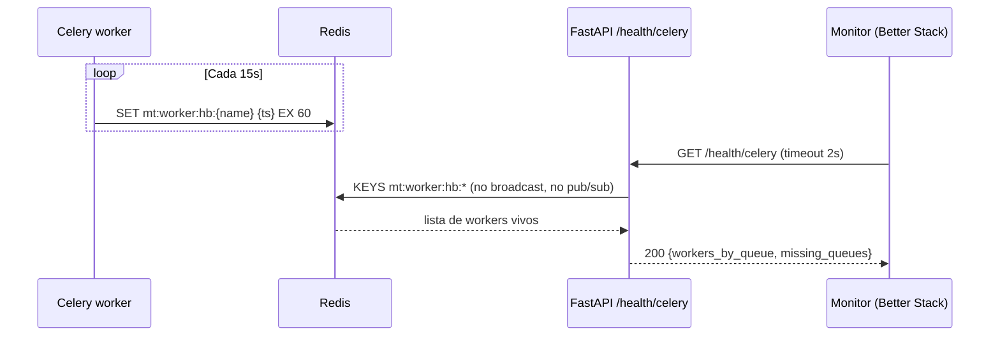

# ADR-048: Healthchecks endpoints — 6 backend + 1 frontend, Celery custom heartbeat

- Status: proposed
- Date: 2026-05-06
- Deciders: Pablo Sierra (BR), Christian (MT sponsor), TI MT
- Related: ADR-019 (superseded), ADR-047 (stack observabilidad), ADR-030 (Celery + Redis), ADR-035 (Caddy)

## Contexto

Healthchecks son la base de:
- Caddy/Hetzner uptime monitoring (decisiones de routing y restart).
- Status page (Better Stack — ADR-047).
- Docker `HEALTHCHECK` para autoreinicio de containers.
- Diagnóstico inicial cuando algo cae (TI MT, on-call).

`hppt-iom-review_1` tiene `/health` simple sin discriminar liveness/readiness y **el healthcheck nativo Celery (`celery inspect ping`) está deshabilitado en producción** porque cuelga bajo carga: el broadcast a workers vía pub/sub se queda sin ack y bloquea el endpoint > 30 s. Esto deja ciega a operación cuando workers están saturados.

MT necesita:
- Distinción liveness vs readiness (Kubernetes-style aunque no usemos k8s).
- Healthcheck Celery que **NUNCA** bloquee.
- Auth para checks profundos (TI MT, no exponer pool stats al mundo).
- Bypass rate-limit en Caddy para que monitors externos no se rate-limiteen.
- Códigos HTTP claros (200/503/504).

## Decisión

Implementar **6 endpoints en FastAPI + 1 en Next.js**:

| # | Endpoint | Tipo | Auth | Timeout | Comprueba | Códigos |
|---|----------|------|------|---------|-----------|---------|
| 1 | `GET /health/live` | liveness | público | 1 s | event loop responde | 200 |
| 2 | `GET /health/ready` | readiness | público | 3 s | DB pool + Redis ping + Supabase reachable | 200 / 503 |
| 3 | `GET /health/db` | deep | `X-Health-Token` | 5 s | query trivial + pool stats | 200 / 503 / 504 |
| 4 | `GET /health/redis` | deep | `X-Health-Token` | 2 s | PING + INFO server/memory | 200 / 503 / 504 |
| 5 | `GET /health/storage` | deep | `X-Health-Token` | 5 s | LIST 1 file Supabase Storage | 200 / 503 / 504 |
| 6 | `GET /health/celery` | deep custom | `X-Health-Token` | 2 s | heartbeat workers en Redis por queue | 200 / 503 / 504 |
| 7 | `GET /api/health` (Next.js) | proxy | público | 4 s | llama a backend `/health/ready` | 200 / 503 / 504 |

### Patrón clave: Celery heartbeat custom (NON-BLOCKING)



- Cada worker publica `SET mt:worker:hb:{hostname}@{queue} {epoch} EX 60` cada 15 s en thread daemon.
- TTL 60 s → si worker muere, su clave expira en ≤ 60 s.
- Endpoint `/health/celery` solo hace `KEYS` + `GET` → operación O(workers), nunca bloquea.
- Reporta `missing_queues` si alguna queue esperada (`default`, `imports`, `pricing`, `images`, `comparator`, `notifications`, `audit`) no tiene workers.

### Auth para deep checks

- Token estático rotable en `X-Health-Token` header.
- Almacenado en `.env` + secret manager (Hetzner secrets).
- TI MT y monitors (Better Stack) tienen el token; nadie más.
- Liveness/readiness son públicos para que Caddy y monitors externos puedan llamarlos sin coordinación.

### Caddy: bypass rate-limit + routing

```caddy
mtme-app.br-innovation.com {
    @health path /health/* /api/health
    handle @health {
        reverse_proxy /health/* api:8000
        reverse_proxy /api/health web:3000
    }

    rate_limit { zone api { key {remote_host}; events 60; window 1m } }

    handle /api/* { reverse_proxy api:8000 }
    handle      { reverse_proxy web:3000 }
}
```

### Docker `HEALTHCHECK`

```dockerfile
HEALTHCHECK --interval=30s --timeout=4s --start-period=20s --retries=3 \
  CMD curl -fsS http://localhost:8000/health/ready || exit 1
```

### Timeouts estrictos + circuit breaker

Cada check downstream usa `asyncio.wait_for(...)`. Si timeout → `504` (no `503`) para distinguir "downstream lento" de "downstream caído". Circuit breaker informal: si `/health/ready` falla 3 veces seguidas, Caddy `lb_try_duration` decide reroute (futuro multi-replica) o restart.

## Alternativas evaluadas

### Healthcheck nativo Celery (`celery inspect ping`)
- Pros: zero-code.
- Contras: bloquea bajo carga (probado hppt-iom). Deshabilitado en prod allá.
- Veredicto: descartado. Reemplazado por heartbeat Redis-based.

### Probe DB con `SELECT pg_sleep(0.1)`
- Pros: garantiza round-trip real.
- Contras: añade latencia innecesaria; `SELECT 1` es suficiente.
- Veredicto: descartado.

### Endpoint único `/health` con todo
- Pros: simple.
- Contras: ambiguo entre liveness y readiness; status page no puede distinguir "proceso vivo pero DB caída" de "proceso muerto".
- Veredicto: descartado, distinguimos live/ready/deep.

### Auth Supabase JWT en deep checks
- Pros: reutiliza auth existente.
- Contras: TI MT post-handoff puede no tener cuenta Supabase activa para debugging; agrega dependencia (auth Supabase down → no podemos probar healthchecks).
- Veredicto: descartado, token estático rotable.

### Healthcheck Celery via Flower
- Pros: Flower expone status.
- Contras: 1 contenedor adicional + Flower no hace SLO-grade health (UI tool).
- Veredicto: descartado, heartbeat Redis-based es 50 líneas de código.

## Consecuencias positivas

- Distinción clara liveness vs readiness vs deep.
- Healthcheck Celery confiable bajo carga (no más cuelgues).
- Status page Better Stack puede reflejar componente "Workers" con detalle por queue.
- TI MT puede debuggear con curl + token sin necesidad de Supabase login.
- Caddy bypass rate-limit garantiza que monitors externos no se rate-limiteen falseando el SLI uptime.

## Consecuencias negativas / riesgos

- Heartbeat añade ~3 escrituras Redis/min × N workers × 24 h (despreciable; ~4K writes/día).
- Token estático requiere rotación operativa periódica (incluir en runbook).
- Si Redis cae: `/health/celery` reporta degraded aunque workers sigan procesando — aceptable, Redis es dependencia.
- 6 endpoints + 1 frontend = más superficie a mantener; mitigado por código compartido en `app/routers/health.py`.

## Cuándo revisar

- **S0 cierre**: probar healthcheck Celery bajo carga sintética (saturar queue 1000+ tasks).
- **S5 cierre**: revisar timeouts si latencia base Hetzner ↔ Supabase varía.
- **Fase 2** (storefront live): añadir endpoint `/health/cdn` si CDN entra en stack.
- **Fase 3+**: convertir `/health/celery` en endpoint público (sin token) si status page es público.
