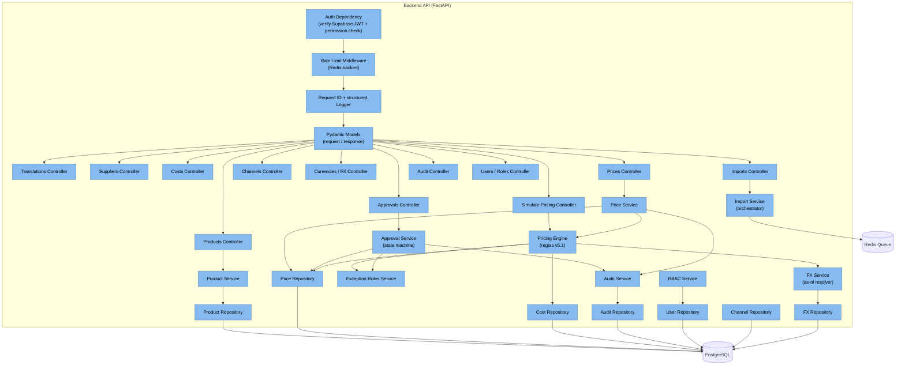
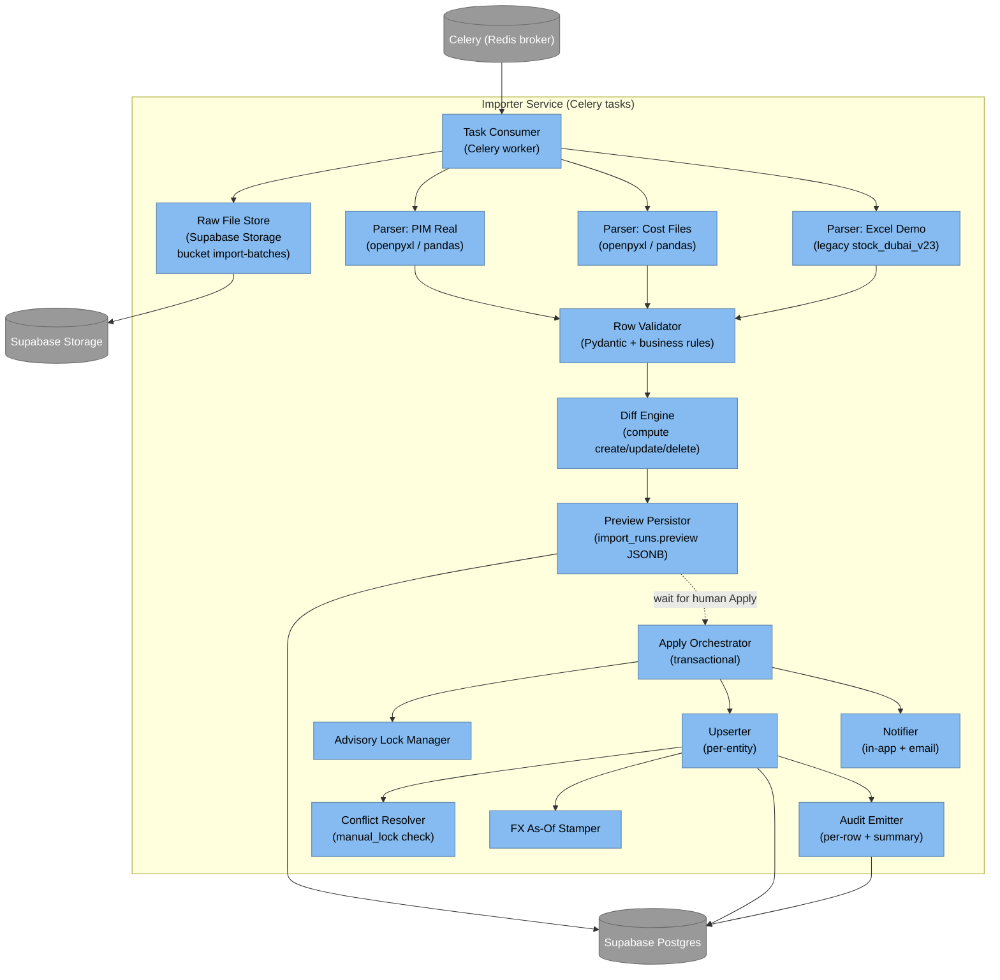
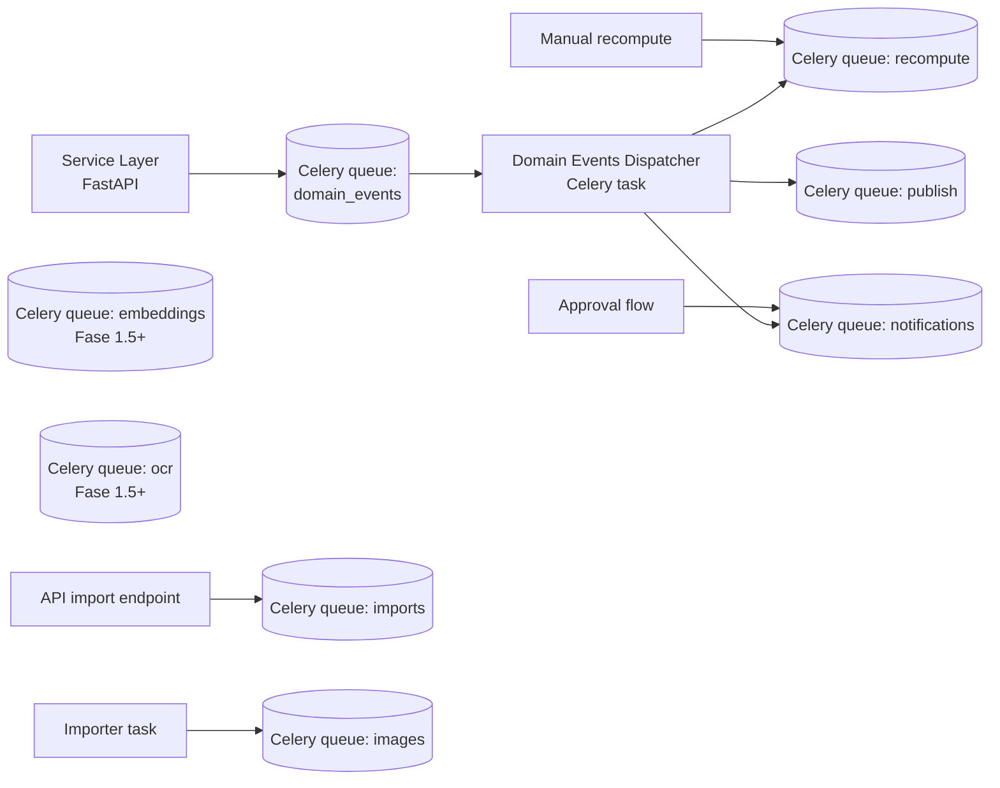
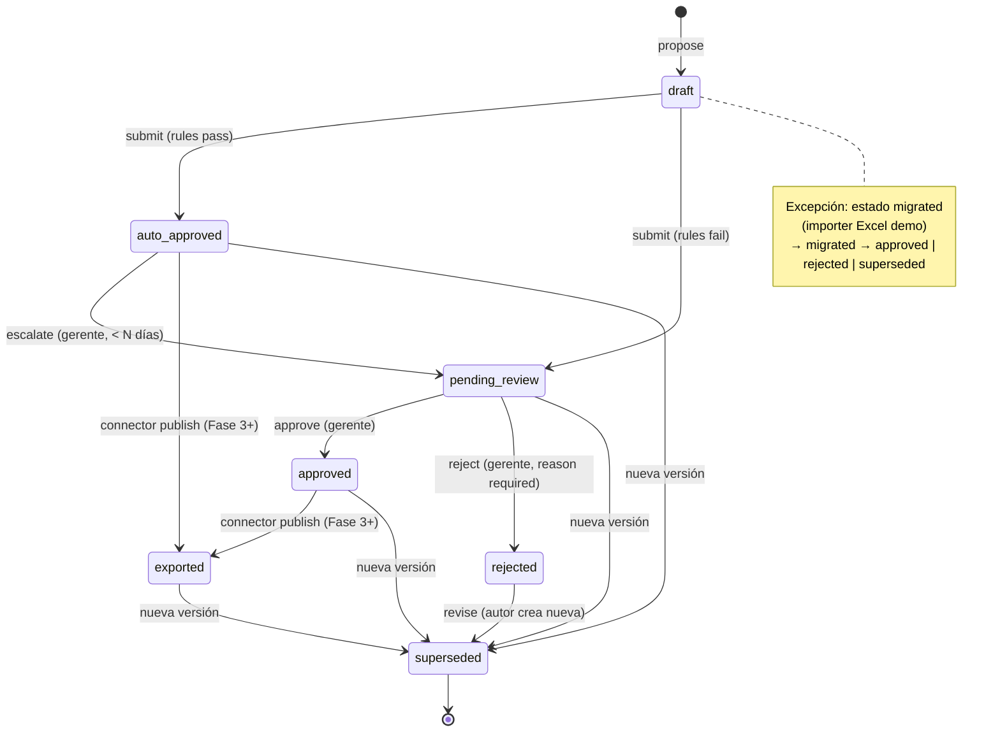
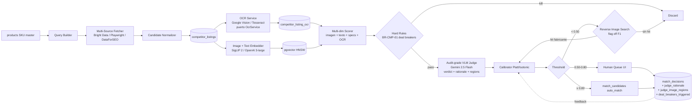
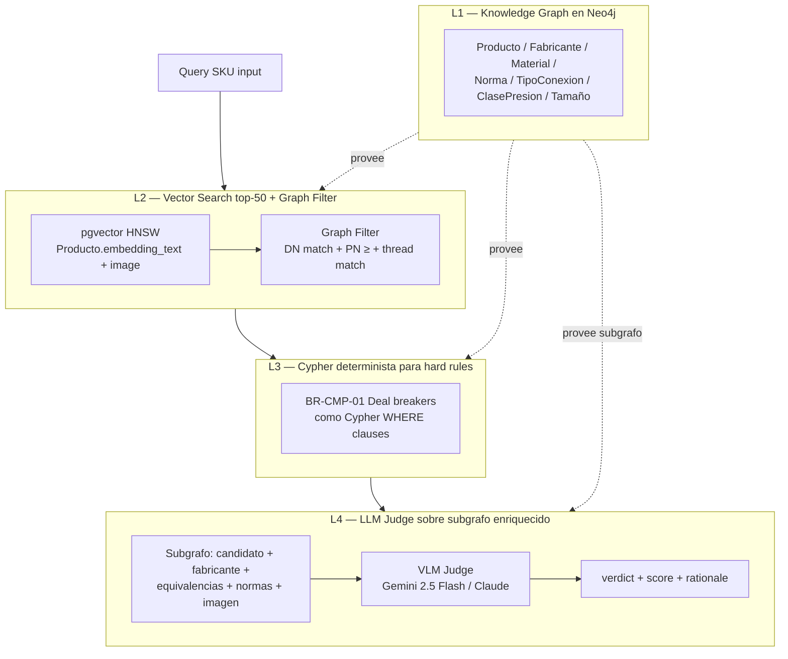
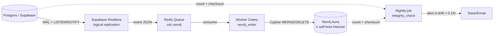

# Arquitectura — MT Middle East Master Data + Pricing (Fase 1)

> Documento de arquitectura completo para la **Fase 1 (1a + 1b)** del programa MT Middle East. Proyecto **single-tenant** desarrollado por BR Innovation para MT Middle East. Stack alineado con la **arquitectura de referencia BR Innovation `hppt-iom` (Hppt Dashboard)**: Next.js 16 + FastAPI + Supabase Postgres + Celery + Redis + Hetzner + Docker Compose + Caddy. **Sujeto a firma de TI MT en Sprint 0**.

## Tabla de contenidos

1. [Resumen ejecutivo](#1-resumen-ejecutivo)
2. [Contexto](#2-contexto)
3. [Drivers arquitectónicos](#3-drivers-arquitectonicos)
4. [Decisiones clave (ADRs)](#4-decisiones-clave-adrs)
5. [Diagrama de contexto C4 nivel 1](#5-diagrama-de-contexto-c4-nivel-1)
6. [Diagrama de contenedores C4 nivel 2](#6-diagrama-de-contenedores-c4-nivel-2)
7. [Diagrama de componentes C4 nivel 3](#7-diagrama-de-componentes-c4-nivel-3)
8. [Modelo de datos físico (DDL)](#8-modelo-de-datos-fisico-ddl)
9. [API REST detallada](#9-api-rest-detallada)
10. [Eventos y colas](#10-eventos-y-colas)
11. [Workflow de aprobación por excepción](#11-workflow-de-aprobacion-por-excepcion)
12. [Estrategia de monedas](#12-estrategia-de-monedas)
13. [Estrategia i18n](#13-estrategia-i18n)
14. [Audit trail](#14-audit-trail)
15. [Seguridad y RBAC](#15-seguridad-y-rbac)
16. [Importer architecture](#16-importer-architecture)
17. [Sistema de comparación de productos](#17-sistema-de-comparacion-de-productos)
18. [Connectors (Hexagonal)](#18-connectors-hexagonal)
19. [Observabilidad](#19-observabilidad)
20. [Despliegue y entornos](#20-despliegue-y-entornos)
21. [Performance](#21-performance)
22. [Patrones de código y estructura](#22-patrones-de-codigo-y-estructura)
23. [Riesgos arquitectónicos y mitigaciones](#23-riesgos-arquitectonicos-y-mitigaciones)
24. [Trade-offs declarados](#24-trade-offs-declarados)
25. [Open architecture questions](#25-open-architecture-questions)
26. [Asunciones](#26-asunciones)

---

## 1. Resumen ejecutivo

### Qué se construye

Una **plataforma web interna** para MT Middle East que reemplaza el Excel maestro `stock_dubai_v23` y consolida tres dominios:

1. **PIM** (Product Information Management) — catálogo, specs técnicas, imágenes, multi-idioma EN/ES/AR.
2. **Master de costes** — proveedores + costes desglosados por SKU × esquema de venta (FBA/FBM/Direct B2C/Direct B2B/Marketplace).
3. **Pricing engine** — multi-canal × multi-esquema, reglas paramétricas, workflow de aprobación por excepción, simulación what-if, audit-first.

### Forma técnica

Stack alineado con la **arquitectura de referencia BR Innovation `hppt-iom`** (Hppt Dashboard). Detalles a verificar contra el repo de referencia:

- **Frontend Next.js 16** (App Router) + **React 19 + React Compiler** + **TypeScript estricto** + **Tailwind v4** + **Shadcn/ui (estilo new-york)** + **Radix** + **Lucide** + **Zod**.
- **Backend API FastAPI 0.x** sobre **Python 3.11**, **Pydantic Settings**, **Gunicorn + Uvicorn workers**; **APScheduler** para schedule jobs ligeros (refresh FX, digest diario).
- **Worker async Celery** (broker Redis) — imports masivos, recálculos masivos de pricing, OCR pipeline (Fase 1.5+), embeddings (Fase 1.5+), fan-out del comparador.
- **DB Supabase Postgres** con **RLS + pgvector + uuidv7 + particionado**. Migrations bajo `supabase/migrations/` (estilo hppt-iom — alineado con hppt-iom (a verificar contra el repo de referencia)).
- **KB vectorial pgvector** — dim a definir según el modelo elegido en el research spike de comparación (hppt-iom usa 768 con Gemini; este proyecto puede usar otra dim).
- **Grafo Neo4j externo** — opcional Fase 1.5+ para relaciones SKU↔ficha técnica↔compatibilidades de material. **No bloqueante Fase 1.**
- **Cache / queue Redis** — rate-limit, Celery broker, FX cache, embeddings cache.
- **Storage Supabase Storage** — buckets `product-images`, `product-datasheets`, `import-batches`, `exports` con políticas de acceso por rol vía RLS.
- **Reverse proxy Caddy** — TLS automático, configuración simple.
- **Despliegue Hetzner** (servidor dedicado o cloud) + **Docker Compose prod** (`docker-compose.prod.yml`) + scripts `scripts/deploy.sh`. CI/CD GitHub Actions construye imágenes y hace pull en server.
- **Auth Supabase Auth** — JWT verificado en backend FastAPI; **RLS policies por rol** en BD; magic links / email/password / OAuth providers según necesidad.
- **ORM**: SQLAlchemy 2.0 + Alembic (alineado con hppt-iom — a verificar contra el repo de referencia).
- **Sentry** + structured logs (Loguru / structlog — a alinear con hppt-iom) + **Better Stack** para observabilidad.
- Healthchecks `/health/live` y `/health/ready` en FastAPI.

### Restricciones no negociables

- **Single-tenant** (ADR-014). No multi-tenant.
- **Build custom** (ADR-015). No Akeneo / Odoo / SAP.
- **Regla dura "no aprobado no integra"** (ADR-010) enforced en DB + runtime + UI.
- **Audit-first**: cada decisión de precio/coste auditada para VAT UAE 2026.
- **Moneda base AED** + FX versionado (ADR-003).
- **EN canónico** + traducciones ES/AR (ADR-004).
- **Excel `stock_dubai_v23` ≠ source operativa** (ADR-008). Sources reales = PIM file + cost files.
- **Sistema de comparación** = research workstream paralelo (ADR-012).

### Entregable Fase 1

Plataforma operable que:
- Reemplaza el Excel como herramienta de trabajo diario (PIM + costos + pricing + workflow).
- Soporta 4 canales × 5 esquemas con activación asincrónica.
- Maneja 224 SKUs hoy con visión a 5k-50k SKUs.
- Cumple compliance VAT UAE 2026 y deja hooks IA para Fase 1.5+.

---

## 2. Contexto

### 2.1 Sistema y entorno

- **Cliente final**: MT Middle East (`mtme.ae`, Dubái) — unidad GCC de MT Valves España (Pallejà). Distribuidor de hidrosanitario / válvulas industriales. ~224 SKUs hoy.
- **Operador / desarrollador**: BR Innovation (Pablo Sierra, `psierra@br-innovation.com`).
- **Sponsor MT**: Christian. **Validador técnico MT**: Paula. **TI MT**: firma stack en S0.
- **Modelo de relación**: BR vendor / MT cliente. Single-tenant. No multi-cliente, no white-label.
- **Programa multi-fase (4 fases)**:
  - **Fase 1** (este documento): Master Data + Pricing — uso interno MT.
  - **Fase 2** (T+6m): Inventarios, facturación, costos operativos, e-invoicing UAE-compliant, integración bidireccional con PIM/ERP MT España.
  - **Fase 3** (T+12m): Storefront B2C UAE en vivo + connectors activos a Amazon UAE (FBA + FBM) + Noon UAE.
  - **Fase 4** (T+18m): Portal B2B distribuidores GCC.
- **Working language interno**: Español. Catálogo canónico: Inglés.

### 2.2 Stakeholders y aprobadores

| Rol | Persona | Responsabilidad |
|------|---------|-----------------|
| Sponsor MT | Christian | Decisor final, firma scope y cutover |
| Validador técnico MT | Paula | Sign-off técnico antes de S1 |
| Operador BR | Pablo Sierra | Comunicación primaria con MT, lead BR |
| TI MT | TBD | Firma stack S0, gestiona usuarios/permisos, on-call post-handoff |
| Comercial Online & Marketplaces (MT) | TBD | Usuario primario, propone precios, mantiene catálogo |
| Gerente Comercial (MT) | TBD | Aprueba excepciones, define reglas |
| Champion del cambio (MT) | TBD | Persona Comercial con ≥30 % dedicación durante migración |

### 2.3 Restricciones de programa

- **VAT UAE 2026** + e-invoicing en marcha → audit trail no opcional.
- **Cronograma Fase 1**: ~14 sem (1a + 1b + S0).
- **Equipo MT operacional**: 3 personas (Comercial + Gerente + TI Integración). Equipo BR pequeño.
- **Catálogo Fase 1**: 224 SKUs reales (escala 2-3 años: 5k-50k).
- **No customer-facing** Fase 1. Todo es UI interno MT.

### 2.4 Programa más amplio (referencia, no Fase 1)

- Capa IA (Fase 2.5+): match semántico SKU↔competidor, recomendador canal/precio, anomaly detection.
- Agente de reabastecimiento (Fase 2.5-3): autónomo, monitorea stock + velocidad rotación, sugiere POs.
- Identidad digital `mtme.ae`: domain parked Sitebeat + SSL expirado. No bloquea Fase 1; gating Fase 3.

---

## 3. Drivers arquitectónicos

Derivados del PRD / brief, ordenados por prioridad:

### D1 — Aprobación por excepción (no obligatoria)

Equipo de 3 personas no puede aprobar manualmente cada cambio. Cambios dentro de tolerancia se auto-aprueban con audit; cambios fuera de tolerancia / críticos escalan al Gerente. **Reglas paramétricas**, no hard-coded. State machine de `prices` con 7 estados. Ver §11 + ADR-006.

### D2 — Multi-canal × multi-esquema, activación asincrónica

4 canales (Amazon UAE, Noon UAE, B2C directo, B2B directo) × 5 esquemas (FBA, FBM, Direct B2C, Direct B2B, Marketplace). Cada canal tiene state machine propia (`inactive` → `pre_launch` → `pilot` → `live` → `paused` → `deprecated`). Pricing engine debe poder simular what-if antes de go-live. Ver ADR-009.

### D3 — Multi-idioma EN canónico + ES/AR

EN NOT NULL en `products` (canónico). ES/AR en `product_translations` con estado por idioma (`pending`/`draft`/`approved`). UI interna ES + EN. Sin RTL Fase 1 (AR sólo contenido). Ver ADR-004.

### D4 — Moneda base AED + FX versionado + as-of stamping

Cada `cost` y `price` snapshotea el FX vigente al momento de aprobación. Tabla `fx_rates` versionada. Excepción FX > 3 % escala a aprobación. Reproducibilidad regulatoria. Ver ADR-003.

### D5 — Audit-first

Cada mutación DML + cada acción de workflow + cada login auditados. Tabla `audit_events` particionada por mes. Inmutabilidad por GRANT. Triggers Postgres + service-level audit. Retención 5 años (compliance UAE). Ver ADR-007.

### D6 — IA-ready hooks (sin uso Fase 1)

Columnas `embedding VECTOR(1536)` reservadas en `products` y `competitor_listings`. pgvector extension habilitada pero sin índices HNSW Fase 1. Plug-and-play Fase 1.5+. Ver ADR-011.

### D7 — Build custom single-tenant

Decisión adoptada en brief. Sin modelo multi-tenant. Sin lock-in vendor enterprise. Ver ADR-014, ADR-015.

### D8 — Reproducibilidad y regla dura "no aprobado no integra"

Defense in depth: DB constraint + runtime filter + UI gate + tests. Ningún record `draft`/`pending_review` puede salir vía connector / export. Ver ADR-010.

### D9 — Importer-first

PIM real + costos reales son las sources Fase 1 (Excel demo es fixture). Pipeline upload → parse → validate → diff preview → apply → audit. Idempotente, atómico, auditable. Ver ADR-008.

### D10 — Hexagonal connectors (Fase 3+ ready)

Puerto `ChannelPublisher` + adapters por marketplace. Fase 1 entrega base + MockPublisher. Filtro de estado aprobado en clase base. Ver ADR-016.

---

## 4. Decisiones clave (ADRs)

| ADR | Estado | Decisión | Rationale (1 línea) |
|-----|--------|----------|---------------------|
| [ADR-001](./adr/ADR-001-stack-tecnologico.md) | superseded by ADR-028..ADR-035 | Stack Next.js + Postgres (histórico) | Pivot a FastAPI + Supabase + Hetzner alineado con hppt-iom |
| [ADR-002](./adr/ADR-002-persistencia-postgres-single-db.md) | proposed | Single Postgres DB | JOINs cross-dominio + transacciones ACID + audit unificado |
| [ADR-003](./adr/ADR-003-estrategia-monedas.md) | proposed | Moneda base AED + FX versionado | Compliance UAE 2026 + reproducibilidad + no-recálculo retroactivo |
| [ADR-004](./adr/ADR-004-estrategia-i18n.md) | proposed | EN canónico + tabla traducciones | EN es lengua de mercado + estado por idioma + escalable |
| [ADR-005](./adr/ADR-005-rbac.md) | superseded parcialmente by ADR-032 | RBAC 3 roles + reglas paramétricas | Auth.js → Supabase Auth + RLS; matriz RBAC sigue vigente |
| [ADR-006](./adr/ADR-006-workflow-aprobacion-excepcion.md) | proposed | Aprobación por excepción | Lo importante escala, lo trivial fluye |
| [ADR-007](./adr/ADR-007-audit-trail.md) | proposed | `audit_events` + triggers Postgres | Defense in depth + compliance + particionado |
| [ADR-008](./adr/ADR-008-estrategia-imports.md) | proposed | 3 importers separados | PIM real + costos reales + Excel demo segregados |
| [ADR-009](./adr/ADR-009-estados-canal-simulacion.md) | proposed | 6 estados canal + simulación what-if | Go-live asincrónico Fase 3 representable |
| [ADR-010](./adr/ADR-010-regla-dura-no-aprobado-no-integra.md) | proposed | Defense in depth 4 capas | Imposible publicar precio no aprobado |
| [ADR-011](./adr/ADR-011-ia-ready-hooks.md) | proposed | Columnas `embedding` reservadas, sin uso F1 | Plug-and-play Fase 1.5+ sin migration |
| [ADR-012](./adr/ADR-012-comparacion-productos-research-workstream.md) | proposed | Comparador como research, no port v5.1 | v5.1 falla en 15 % catálogo |
| [ADR-013](./adr/ADR-013-storage-imagenes.md) | superseded by ADR-033 | Mirror S3-compatible (R2) (histórico) | Pivot a Supabase Storage |
| [ADR-014](./adr/ADR-014-single-tenant-mt.md) | accepted | Single-tenant explícito | BR vendor / MT cliente — no SaaS |
| [ADR-015](./adr/ADR-015-build-custom.md) | accepted | Build custom | Suites no encajan + diferenciación + control |
| [ADR-016](./adr/ADR-016-arquitectura-hexagonal-connectors.md) | proposed | Hexagonal: puerto + adapters | Fase 3+ ready, Fase 1 sólo MockPublisher |
| [ADR-017](./adr/ADR-017-secretos-vault.md) | proposed | Doppler como gestor de secretos | Setup mínimo + audit + rotación |
| [ADR-018](./adr/ADR-018-cola-jobs-bullmq.md) | superseded by ADR-030 | BullMQ + Redis (histórico) | Pivot a Celery (backend Python) |
| [ADR-019](./adr/ADR-019-observabilidad.md) | proposed | Sentry + Pino + Better Stack | Triángulo errores + logs + métricas |
| [ADR-020](./adr/ADR-020-cloud-residencia-uae.md) | open | Cloud + residencia UAE | OPEN — pendiente firma TI MT en S0 |
| [ADR-021](./adr/ADR-021-orm-prisma.md) | superseded by ADR-029/ADR-031 | Prisma 5 + SQL nativo (histórico) | Pivot a SQLAlchemy 2.0 + Alembic + Supabase migrations |
| [ADR-028](./adr/ADR-028-frontend-nextjs-react19.md) | proposed | Frontend Next.js 16 + React 19 + React Compiler | Stack BR estándar + Shadcn/ui new-york + Tailwind v4 + Zod |
| [ADR-029](./adr/ADR-029-backend-fastapi-python.md) | proposed | Backend FastAPI Python 3.11 | Tipado fuerte Pydantic + ecosistema IA/científico para comparador + OpenAPI auto-gen |
| [ADR-030](./adr/ADR-030-worker-celery-redis.md) | proposed | Worker async Celery + Redis | Imports masivos, OCR, embeddings, recálculos. Supersedes ADR-018 |
| [ADR-031](./adr/ADR-031-db-supabase-postgres.md) | proposed | Supabase Postgres + RLS + pgvector + uuidv7 | Managed Postgres + Auth + Storage; alineado con hppt-iom |
| [ADR-032](./adr/ADR-032-auth-supabase-auth.md) | proposed | Supabase Auth | JWT verificado en backend + RLS DB. Supersedes ADR-005 parcial |
| [ADR-033](./adr/ADR-033-storage-supabase.md) | proposed | Supabase Storage + buckets por dominio | Supersedes ADR-013 |
| [ADR-034](./adr/ADR-034-deploy-hetzner-docker-compose.md) | proposed | Hetzner + Docker Compose prod | Single-tenant, costo + control + alineación stack BR |
| [ADR-035](./adr/ADR-035-reverse-proxy-caddy.md) | proposed | Caddy TLS automático | Config simple + alineado con hppt-iom |
| [ADR-036](./adr/ADR-036-estructura-monorepo.md) | proposed | Repos separados estilo hppt-iom (frontend / backend) | Confirmar con TI MT |
| [ADR-037](./adr/ADR-037-neo4j-fase15.md) | proposed | Neo4j externo opcional Fase 1.5+ | Grafo SKU↔ficha↔compatibilidades, no bloqueante Fase 1 |
| [ADR-022](./adr/ADR-022-ocr-imagenes-competidores.md) | proposed | Google Vision OCR default + abstracción puerto | Accuracy en grabados industriales + AR + cambio de proveedor sin lock-in |
| [ADR-023](./adr/ADR-023-reverse-image-search-fallback.md) | proposed | Hooks listos, feature flag off Fase 1 | Activable cuando confidence < 0,50; coste contenido por flag |
| [ADR-024](./adr/ADR-024-vlm-judge-audit-grade.md) | proposed | Reasoning + image regions persistidos | Auditabilidad VAT 2026 + UI humana ve por qué |
| [ADR-025](./adr/ADR-025-capa-humana-permanente.md) | proposed | Validación humana es infraestructura permanente | Es lo que separa 92 % de 99 % (Centric / Intelligence Node) |
| [ADR-026](./adr/ADR-026-hybrid-search-fase1.5.md) | proposed | pgvector + tsvector Fase 1; Elasticsearch + RRF upgrade path | Operacionalmente más simple Fase 1 |
| [ADR-027](./adr/ADR-027-build-vs-buy-regla.md) | proposed | Build mínimo + demos comerciales paralelas; pivot por números | Cobertura industrial nicho; 224 SKUs no amortizan suite enterprise |
| [ADR-045](./adr/ADR-045-persistencia-hibrida.md) | proposed | Persistencia híbrida: SQLAlchemy 2.0 async + Alembic (core data) + supabase-py (Auth + Storage + admin) | Pricing engine, comparador y audit analytics necesitan ORM tipado y joins complejos; Auth/Storage se reusan 1:1 desde hppt-iom sin valor añadido en duplicar tooling. App conecta con rol Postgres `mt_app` (no `service_role` ni `anon`) que respeta RLS. Supersede parcialmente ADR-021. |
| [ADR-046](./adr/ADR-046-celery-beat-database-scheduler.md) | proposed | Celery Beat con DatabaseScheduler editable (tabla `job_definitions`) | Schedules editables sin redeploy desde UI admin `/admin/jobs`; Gerente Comercial puede ajustar horarios de digest/KPI sin TI. Audit trail automático via trigger. Librería `celery-sqlalchemy-scheduler` o scheduler custom (~150 líneas) si no encaja con SQLAlchemy 2.0 async — decisión Sprint 0. |

---

## 5. Diagrama de contexto C4 nivel 1

```mermaid
flowchart TB
    classDef person fill:#08427B,stroke:#073B6F,color:#fff
    classDef external fill:#999999,stroke:#6B6B6B,color:#fff
    classDef system fill:#1168BD,stroke:#0B4884,color:#fff

    Comercial["Comercial Canal Online &amp; Marketplaces<br/>(MT Middle East)"]:::person
    Gerente["Gerente Comercial<br/>(MT Middle East)"]:::person
    TI_MT["TI Integración<br/>(MT Middle East)"]:::person
    Admin["Admin / BR Innovation"]:::person

    System["MT ME Master Data + Pricing Platform<br/>(Fase 1 — interna single-tenant)"]:::system

    Email[("Email / SMTP<br/>(notificaciones)")]:::external
    SBStorage[("Supabase Storage<br/>buckets product-images,<br/>product-datasheets,<br/>import-batches, exports")]:::external
    SBAuth[("Supabase Auth<br/>(JWT + RLS)")]:::external
    PIM_ES[("PIM MT Valves España<br/>(fuente externa Fase 2+)")]:::external
    AmazonAE[("Amazon UAE<br/>(Fase 3+)")]:::external
    NoonAE[("Noon UAE<br/>(Fase 3+)")]:::external
    Sentry[("Sentry<br/>(error tracking)")]:::external
    BetterStack[("Better Stack<br/>(logs + metrics)")]:::external
    Neo4j[("Neo4j externo<br/>(grafo SKU↔ficha↔compat<br/>opcional Fase 1.5+)")]:::external
    FXFeed[("Feed FX<br/>(Fase 1.5+)")]:::external

    Comercial -->|propone precios, edita catálogo| System
    Gerente -->|aprueba excepciones, define reglas| System
    TI_MT -->|gestiona usuarios, configura connectors| System
    Admin -->|sysadmin, migraciones| System

    System -->|envía notificaciones| Email
    System <-->|imágenes, datasheets, exports| SBStorage
    System <-->|auth JWT + RLS| SBAuth
    System <-.->|imports XLSX/CSV manuales Fase 1| PIM_ES
    System -.->|publica precios y catálogo| AmazonAE
    System -.->|publica precios y catálogo| NoonAE
    System -->|errores| Sentry
    System -->|logs y métricas| BetterStack
    System -.->|grafo (Fase 1.5+)| Neo4j
    System <-.->|tasas FX| FXFeed
```

### Actores

- **Comercial Canal Online & Marketplaces** — usuario operativo principal.
- **Gerente Comercial** — aprueba excepciones, define reglas, accede a audit.
- **TI Integración** — configura connectors (Fase 3+), gestiona usuarios.
- **Admin / BR Innovation** — sysadmin durante desarrollo y handoff.

### Sistemas externos (Fase 1)

- **Email/SMTP** — notificaciones de aprobación, digest diario.
- **Supabase Storage** — buckets `product-images`, `product-datasheets`, `import-batches`, `exports`. Políticas de acceso por rol vía RLS.
- **Supabase Auth** — JWT + RLS, magic links / email/password / OAuth providers.
- **Sentry** — captura errores frontend + backend.
- **Better Stack** — logs y métricas.

### Sistemas externos (Fase 1.5+ / Fase 2+, no parte de Fase 1 pero dibujados)

- **PIM MT Valves España** — integración bidireccional Fase 2+.
- **Amazon UAE / Noon UAE** — connectors Fase 3+ (en Fase 1 sólo MockPublisher).
- **Feed FX** — automatización Fase 1.5+ (Fase 1 ingesta manual).
- **Neo4j externo** — grafo SKU↔ficha técnica↔compatibilidades de material. Opcional Fase 1.5+; hooks listos sin refactor.

---

## 6. Diagrama de contenedores C4 nivel 2

```mermaid
flowchart TB
    classDef person fill:#08427B,stroke:#073B6F,color:#fff
    classDef container fill:#438DD5,stroke:#2E6295,color:#fff
    classDef datastore fill:#438DD5,stroke:#2E6295,color:#fff,stroke-dasharray: 5 5
    classDef external fill:#999999,stroke:#6B6B6B,color:#fff

    User["Usuarios MT<br/>(Comercial / Gerente / TI / Admin)"]:::person

    subgraph System["MT ME Platform (Hetzner + Docker Compose)"]
      direction TB
      Caddy["Reverse Proxy<br/>Caddy<br/>(TLS automático)"]:::container
      Web["Frontend<br/>Next.js 16 (App Router)<br/>React 19 + React Compiler<br/>TypeScript estricto + Tailwind v4<br/>Shadcn/ui (new-york) + Radix + Zod"]:::container
      API["Backend API<br/>FastAPI 0.x (Python 3.11)<br/>Pydantic + APScheduler<br/>Gunicorn + Uvicorn workers"]:::container
      Worker["Worker async<br/>Celery (Python)<br/>imports masivos, OCR,<br/>embeddings, recálculos"]:::container
      Importer["Importer Service<br/>(módulo del Worker / FastAPI)<br/>openpyxl / pandas"]:::container

      Redis[("Redis<br/>Celery broker + rate-limit<br/>+ FX cache + embeddings cache")]:::datastore
    end

    subgraph Supabase["Supabase (managed)"]
      direction TB
      SBPg[("Supabase Postgres<br/>RLS + pgvector + uuidv7<br/>+ particionado<br/>migrations: supabase/migrations/")]:::datastore
      SBAuth[("Supabase Auth<br/>JWT + RLS policies por rol")]:::datastore
      SBStorage[("Supabase Storage<br/>product-images,<br/>product-datasheets,<br/>import-batches, exports")]:::datastore
    end

    Email[("SMTP")]:::external
    Sentry[("Sentry")]:::external
    BetterStack[("Better Stack")]:::external
    Neo4j[("Neo4j externo<br/>(opcional Fase 1.5+)")]:::external
    Marketplaces[("Amazon UAE / Noon UAE<br/>(Fase 3+)")]:::external

    User -->|HTTPS| Caddy
    Caddy --> Web
    Caddy -->|/api/*| API
    Web <-->|HTTP/JSON| API
    Web <-->|JWT login| SBAuth
    API <-->|verify JWT| SBAuth
    API <-->|SQL (RLS)| SBPg
    API <-->|enqueue| Redis
    API <-->|signed URLs| SBStorage
    Worker <-->|consume| Redis
    Worker <-->|SQL| SBPg
    Worker <-->|read/write objects| SBStorage
    Worker -->|SMTP| Email
    Worker -.->|publish<br/>(Fase 3+)| Marketplaces
    API -.->|grafo (Fase 1.5+)| Neo4j

    API -->|errors| Sentry
    Worker -->|errors| Sentry
    API -->|logs+metrics| BetterStack
    Worker -->|logs+metrics| BetterStack
```

### Contenedores

| Contenedor | Tecnología | Responsabilidad |
|------------|-----------|-----------------|
| **Reverse Proxy** | Caddy | TLS automático (Let's Encrypt), routing `/` → frontend, `/api/*` → backend, headers de seguridad |
| **Frontend** | Next.js 16 App Router + React 19 + React Compiler + TypeScript + Tailwind v4 + Shadcn/ui (new-york) + Radix + Lucide + Zod | UI server-rendered + client-side interactividad. i18n ES/EN. Consume API FastAPI vía fetch/RSC. |
| **Backend API** | FastAPI 0.x (Python 3.11) + Pydantic + APScheduler + Gunicorn + Uvicorn workers | REST API JSON con OpenAPI auto-gen. Validación request/response Pydantic. JWT verificado de Supabase Auth. RBAC enforce vía dependency injection + RLS DB. |
| **Worker async** | Celery (Python) + Redis broker | Proceso separado. Consume tareas. Jobs largos: imports masivos, recálculos masivos pricing, OCR pipeline, embeddings, fan-out comparador, publish marketplaces. Beat scheduler para retries y schedules pesados. |
| **Importer Service** | Sub-módulo Python (openpyxl / pandas) | Pipelines de import dedicados (PIM, costos, Excel demo, traducciones, FX). |
| **Supabase Postgres** | Postgres managed con `pgcrypto`, `pg_trgm`, `pgvector`, **`uuidv7`**, RLS, particionado | Single source of truth. Tablas + triggers + funciones + particionado (`audit_events`, `prices_history`). Migrations bajo `supabase/migrations/` (estilo hppt-iom — alineado con hppt-iom (a verificar contra el repo de referencia)). |
| **Supabase Auth** | Supabase Auth managed | Usuarios + sesiones + magic links / email/password / OAuth. JWT firmado verificado en backend FastAPI. |
| **Supabase Storage** | Supabase Storage managed | Buckets `product-images`, `product-datasheets`, `import-batches`, `exports`. Políticas por rol vía RLS. |
| **Redis** | Redis 7 (auto-hosted en Docker Compose) | Celery broker + cache (FX rates, exception rules, embeddings cache) + rate-limit. |
| **Neo4j externo** (Fase 1.5+) | Neo4j Aura o auto-hosted | Grafo SKU↔ficha↔compatibilidades de material. Opcional, hooks listos sin refactor. |

### Por qué ese límite

- **Frontend separado del backend** (vs co-localizado): alinea con hppt-iom; Python backend permite usar ecosistema científico/IA (numpy, scikit-learn, OpenCV, transformers) directamente para el comparador. Trade-off: deploy adicional, pagado con un Caddy que proxya ambos.
- **Worker Celery separado**: tareas largas no deben bloquear el request loop. Escalado horizontal independiente. Brokeer Redis compartido.
- **Importer dentro del Worker**: comparte cola + DB + auth. Sin justificación para deploy aparte Fase 1.
- **Supabase como BaaS**: ahorra construir Auth + Storage + Postgres tooling desde cero; alineado con hppt-iom.
- **Hetzner self-hosted**: single-tenant MT no necesita auto-scaling agresivo; rationale costo + control + alineación con stack BR.

---

## 7. Diagrama de componentes C4 nivel 3

### 7.1 API Layer



### Capas

- **Middleware / Dependencies (FastAPI)** — verificación JWT Supabase, RBAC dependency, rate limit (Redis), request id, logger estructurado, validación Pydantic.
- **Controllers (FastAPI routers)** — HTTP-facing, sin lógica de negocio. OpenAPI auto-gen.
- **Services** (`app/services/<dominio>/`) — lógica de dominio, orchestration entre repos, eventos a Celery.
- **Repositories** — acceso a DB vía SQLAlchemy 2.0 (alineado con hppt-iom — a verificar contra el repo de referencia); mapping repo → domain.
- **Domain core** — Pricing Engine, Approval Service (state machine), FX, Exception Rules.
- **Worker** (`app/worker.py` + tasks) — Celery tasks por dominio. Beat scheduler para schedules pesados; APScheduler in-process en backend para schedules ligeros.

### 7.2 Importer Service (componente del Worker)



### Pipeline conceptual (común a los 3 importers)

```
upload (multipart)
  → store raw in Supabase Storage (bucket import-batches)
  → enqueue ImportTask (Celery, idempotency_key = SHA256)
       ↓
ImportJob worker:
  fetch raw
  parse (per importer)
  validate (per row, fail-soft con report)
  diff vs existing (compute create/update/delete)
  persist preview in import_runs.preview JSONB
       ↓
   --- pause for human confirmation ---
       ↓
Apply (UI button):
  acquire advisory lock
  begin transaction (or chunked savepoints)
  per row: upsert + check manual_lock + FX as-of stamp + audit emit
  commit (or rollback on chunk failure with offer)
  release advisory lock
  notify (in-app + email)
```

---

## 8. Modelo de datos físico (DDL)

DDL completo en **Supabase Postgres** (versión gestionada). Las migrations viven bajo **`supabase/migrations/`** (estilo hppt-iom — alineado con hppt-iom (a verificar contra el repo de referencia); ~132 migrations en hppt-iom como orden de magnitud). Asume extensiones `pgcrypto`, `pg_trgm`, `pgvector`, `uuidv7` instaladas (Supabase las soporta nativamente o vía `pg_uuidv7`).

**Convenciones clave aplicadas en todas las tablas (alineado con hppt-iom)**:

- **PK**: `id UUID DEFAULT uuidv7()` — uuidv7 ofrece ordenamiento temporal natural (mejor locality que uuid v4) y compatibilidad de cursor para paginación.
- **RLS habilitada** en todas las tablas con datos de usuario; policies por rol referencian `auth.uid()` y `user_roles`.
- **Particionado** declarativo por mes en tablas grandes (`audit_events`, `prices_history`).
- **ORM**: SQLAlchemy 2.0 + Alembic en backend (alineado con hppt-iom — a verificar). Migrations principales escritas en SQL bajo `supabase/migrations/`; Alembic complementa para cambios de modelo en backend.

### 8.0 Capa de acceso a datos (ADR-045)

> **Decisión.** Persistencia **híbrida**: el backend FastAPI usa **dos clientes** según el dominio. No es alineamiento 1:1 con hppt-iom (que usa supabase-py puro), sino divergencia consciente justificada por la complejidad del motor de pricing, comparador y audit analytics de MT. Ver ADR-045.

#### 8.0.1 Split por dominio

| Dominio | Cliente | Justificación |
|---------|---------|---------------|
| **Core data** (CRUD complejo, motor pricing, comparador, audit analytics, FX engine, exception rules, importer diff/apply) | **SQLAlchemy 2.0 async + Alembic** | JOINs cross-dominio, transacciones ACID con savepoints, tipado fuerte de modelos relacionales, repositorios reutilizables, queries complejas con CTEs y window functions. Alembic gestiona migraciones de tablas aplicativas (`public.*`). |
| **Auth** (login, JWT verify, magic links, password reset, MFA) | **supabase-py + Supabase Auth nativa** | Reuso 1:1 del patrón `hppt-iom`. Verificación JWT en backend; RLS en DB es el segundo cordón. |
| **Storage** (imágenes, fichas, exports, imports raw files) | **supabase-py + Supabase Storage** | Buckets + signed URLs son operaciones simples; supabase-py es directo y suficiente. |
| **Admin de usuarios** (force-logout, reset password, role assignment, invite) | **supabase-py `auth.admin`** | API administrativa nativa de Supabase con `service_role`. Solo se invoca desde endpoints protegidos por `require_permissions(["users:manage"])`. |

#### 8.0.2 Patrón de dos clientes

```
mt-pricing-backend/app/core/
├── db.py            # SQLAlchemy 2.0 async engine + AsyncSessionLocal + get_session() dependency
└── supabase.py      # supabase-py client factory (anon, service_role, admin) + get_supabase_client() dependency
```

- **`app/core/db.py`** expone `engine` (async, asyncpg driver), `AsyncSessionLocal` y la dependency `get_session()` para inyectar sesiones en routers/services. Los repositorios (`app/repositories/`) reciben la sesión y exponen métodos tipados (`async def find_by_sku(...)`). Los servicios (`app/services/`) orquestan repositories dentro de transacciones explícitas.
- **`app/core/supabase.py`** expone factories diferenciadas: `get_supabase_client()` (anon, para flows de cliente final cuando aplique) y `get_supabase_admin()` (service_role, para `auth.admin.create_user`, `auth.admin.sign_out`, signed URLs de Storage, etc.).
- Servicios que cruzan capas (ej. `invite_user`) usan ambos clientes: primero `supabase.auth.admin.create_user()`, luego SQLAlchemy `INSERT INTO public.users` en una transacción. La consistencia se garantiza con compensación en caso de fallo (rollback SQLAlchemy + delete del auth.user si la inserción aplicativa falla).

#### 8.0.3 Rol Postgres aplicativo

- El backend SQLAlchemy se conecta a Postgres con un rol **`mt_app`** específico (creado en migración Supabase), **no** con `service_role` ni con `anon`.
- `mt_app` **respeta RLS** — las policies aplican igual que para clientes JWT-autenticados, excepto cuando el backend setea claims de sesión vía `set_config('request.jwt.claims', ...)` para impersonar el usuario actual en transacciones que requieren auth.uid().
- `service_role` queda reservado **solo** para operaciones administrativas vía supabase-py (`auth.admin.*`) y para migraciones Alembic.

```sql
-- supabase/migrations/<timestamp>_mt_app_role.sql
create role mt_app login password '<set en deploy>';
grant usage on schema public to mt_app;
grant select, insert, update, delete on all tables in schema public to mt_app;
grant usage, select on all sequences in schema public to mt_app;
alter default privileges in schema public grant select, insert, update, delete on tables to mt_app;
alter default privileges in schema public grant usage, select on sequences to mt_app;
-- mt_app NO tiene bypassrls — las policies aplican
```

#### 8.0.4 Migraciones — split por schema

| Schema | Tooling | Contenido |
|--------|---------|-----------|
| `public.*` | **Alembic** (`mt-pricing-backend/alembic/versions/`) | Tablas aplicativas (products, prices, costs, audit_events, job_definitions, …), funciones, triggers, vistas. |
| `auth.*`, `storage.*` | **Supabase migrations** (`supabase/migrations/`) | Configuración Auth providers, schemas Storage, RLS críticas que tocan `auth.uid()`/`auth.jwt()`. |
| RLS de tablas `public.*` | **Supabase migrations** (preferido) o Alembic con SQL plano | RLS policies se versionan junto al esquema Auth para mantener defense-in-depth coherente. |

> **Decisión Sprint 0.** Validar con TI MT que tener Alembic + Supabase migrations en paralelo no genera fricción; alternativa: todo a Supabase migrations escritas a mano (rechazada por pérdida de autogeneración de Alembic sobre modelos SQLAlchemy).

### 8.1 Extensiones y enums

```sql
CREATE EXTENSION IF NOT EXISTS pgcrypto;
CREATE EXTENSION IF NOT EXISTS pg_trgm;
CREATE EXTENSION IF NOT EXISTS vector;          -- pgvector activo (dim a definir en research spike)
CREATE EXTENSION IF NOT EXISTS pg_uuidv7;       -- uuidv7 (Supabase / pg_uuidv7)

-- Enums

CREATE TYPE data_quality_t AS ENUM ('complete','partial','blocked','migrated_demo');
CREATE TYPE translation_status_t AS ENUM ('pending','draft','approved');
CREATE TYPE channel_state_t AS ENUM ('inactive','pre_launch','pilot','live','paused','deprecated');
CREATE TYPE price_status_t AS ENUM ('draft','pending_review','auto_approved','approved','rejected','revised','exported','superseded','migrated');
CREATE TYPE cost_status_t AS ENUM ('draft','approved','superseded','migrated');
CREATE TYPE scheme_code_t AS ENUM ('FBA','FBM','DIRECT_B2C','DIRECT_B2B','MARKETPLACE');
CREATE TYPE fx_source_t AS ENUM ('manual','feed_xe','feed_oanda','feed_ecb','migrated_inferred');
CREATE TYPE import_type_t AS ENUM ('pim_real','costs_real','excel_demo','translations','fx');
CREATE TYPE import_status_t AS ENUM ('queued','parsing','validating','preview_ready','applying','completed','failed','cancelled');
CREATE TYPE match_status_t AS ENUM ('unmatched','candidate','confirmed','rejected');
```

### 8.2 Auth & RBAC

```sql
CREATE TABLE users (
  id              UUID PRIMARY KEY DEFAULT gen_random_uuid(),
  email           CITEXT UNIQUE NOT NULL,
  hashed_password TEXT,                              -- nullable si auth federado
  name            TEXT NOT NULL,
  locale_pref     TEXT NOT NULL DEFAULT 'es' CHECK (locale_pref IN ('es','en')),
  mfa_enabled     BOOLEAN NOT NULL DEFAULT false,
  mfa_secret_enc  BYTEA,                             -- pgcrypto cifrado
  active          BOOLEAN NOT NULL DEFAULT true,
  last_login_at   TIMESTAMPTZ,
  failed_logins   INT NOT NULL DEFAULT 0,
  locked_until    TIMESTAMPTZ,
  created_at      TIMESTAMPTZ NOT NULL DEFAULT now(),
  updated_at      TIMESTAMPTZ NOT NULL DEFAULT now()
);

CREATE TABLE roles (
  code        TEXT PRIMARY KEY,
  name        TEXT NOT NULL,
  description TEXT
);

INSERT INTO roles (code, name, description) VALUES
  ('comercial', 'Comercial Canal Online & Marketplaces', 'CRUD catálogo, propone precios'),
  ('gerente_comercial', 'Gerente Comercial', 'Aprueba excepciones, define reglas'),
  ('ti_integracion', 'TI Integración', 'Configura connectors, gestiona usuarios'),
  ('admin', 'Sysadmin', 'BR Innovation / TI MT inicial');

CREATE TABLE user_roles (
  user_id   UUID NOT NULL REFERENCES users(id) ON DELETE CASCADE,
  role_code TEXT NOT NULL REFERENCES roles(code),
  granted_by UUID REFERENCES users(id),
  granted_at TIMESTAMPTZ NOT NULL DEFAULT now(),
  PRIMARY KEY (user_id, role_code)
);

CREATE TABLE sessions (
  id          UUID PRIMARY KEY DEFAULT gen_random_uuid(),
  user_id     UUID NOT NULL REFERENCES users(id) ON DELETE CASCADE,
  expires_at  TIMESTAMPTZ NOT NULL,
  token_hash  TEXT NOT NULL UNIQUE,
  ip          INET,
  user_agent  TEXT,
  created_at  TIMESTAMPTZ NOT NULL DEFAULT now()
);

CREATE INDEX idx_sessions_user_id ON sessions(user_id);
CREATE INDEX idx_sessions_expires ON sessions(expires_at);
```

### 8.3 Currencies & FX

```sql
CREATE TABLE currencies (
  code      CHAR(3) PRIMARY KEY,        -- ISO 4217
  name      TEXT NOT NULL,
  symbol    TEXT,
  decimals  INT NOT NULL DEFAULT 2 CHECK (decimals BETWEEN 0 AND 8),
  is_base   BOOLEAN NOT NULL DEFAULT false,
  active    BOOLEAN NOT NULL DEFAULT true,
  created_at TIMESTAMPTZ NOT NULL DEFAULT now()
);

-- Solo una moneda base
CREATE UNIQUE INDEX uq_currencies_one_base ON currencies(is_base) WHERE is_base = true;

INSERT INTO currencies (code, name, symbol, decimals, is_base) VALUES
  ('AED','UAE Dirham','AED',2,true),
  ('EUR','Euro','€',2,false),
  ('USD','US Dollar','$',2,false),
  ('SAR','Saudi Riyal','SAR',2,false),
  ('GBP','British Pound','£',2,false);

CREATE TABLE fx_rates (
  id              BIGSERIAL PRIMARY KEY,
  from_currency   CHAR(3) NOT NULL REFERENCES currencies(code),
  to_currency     CHAR(3) NOT NULL REFERENCES currencies(code),
  rate            NUMERIC(18,8) NOT NULL CHECK (rate > 0),
  effective_from  TIMESTAMPTZ NOT NULL,
  effective_to    TIMESTAMPTZ,                       -- NULL = vigente
  source          fx_source_t NOT NULL DEFAULT 'manual',
  entered_by      UUID REFERENCES users(id),
  notes           TEXT,
  created_at      TIMESTAMPTZ NOT NULL DEFAULT now(),
  CHECK (from_currency <> to_currency),
  CHECK (effective_to IS NULL OR effective_to > effective_from)
);

CREATE INDEX idx_fx_pair_time ON fx_rates(from_currency, to_currency, effective_from DESC);
CREATE INDEX idx_fx_active ON fx_rates(from_currency, to_currency) WHERE effective_to IS NULL;

-- Función de FX as-of
CREATE OR REPLACE FUNCTION fx_rate_at(
  p_from CHAR(3),
  p_to CHAR(3),
  p_at TIMESTAMPTZ
) RETURNS NUMERIC LANGUAGE plpgsql STABLE AS $$
DECLARE
  v_rate NUMERIC;
BEGIN
  IF p_from = p_to THEN RETURN 1; END IF;

  SELECT rate INTO v_rate
  FROM fx_rates
  WHERE from_currency = p_from AND to_currency = p_to
    AND effective_from <= p_at
    AND (effective_to IS NULL OR effective_to > p_at)
  ORDER BY effective_from DESC
  LIMIT 1;

  IF v_rate IS NULL THEN
    -- Intentar inverso
    SELECT 1 / rate INTO v_rate
    FROM fx_rates
    WHERE from_currency = p_to AND to_currency = p_from
      AND effective_from <= p_at
      AND (effective_to IS NULL OR effective_to > p_at)
    ORDER BY effective_from DESC
    LIMIT 1;
  END IF;

  IF v_rate IS NULL THEN
    RAISE EXCEPTION 'No FX rate available % -> % at %', p_from, p_to, p_at;
  END IF;

  RETURN v_rate;
END $$;
```

### 8.4 PIM — Productos y Traducciones

```sql
CREATE TABLE products (
  sku                   TEXT PRIMARY KEY,
  internal_id           UUID NOT NULL DEFAULT gen_random_uuid() UNIQUE,
  name_en               TEXT NOT NULL,
  description_en        TEXT,
  marketing_copy_en     TEXT,

  family                TEXT NOT NULL,            -- vocabulario controlado
  subfamily             TEXT,
  type                  TEXT,                      -- valve type
  material              TEXT,                      -- brass, ss316, ss304
  dn                    TEXT,                      -- DN15, DN20, ...
  pn                    TEXT,                      -- PN10, PN16, ...
  connection            TEXT,
  brand                 TEXT,                      -- Pegler, Arco, Giacomini, ...
  specs                 JSONB NOT NULL DEFAULT '{}'::jsonb,

  data_quality          data_quality_t NOT NULL DEFAULT 'partial',
  manual_locked_fields  TEXT[] NOT NULL DEFAULT '{}',
  active                BOOLEAN NOT NULL DEFAULT true,

  -- Hooks IA Fase 1.5+ (ADR-011)
  embedding             VECTOR(1536),
  embedding_model       TEXT,
  embedding_at          TIMESTAMPTZ,

  created_at            TIMESTAMPTZ NOT NULL DEFAULT now(),
  created_by            UUID REFERENCES users(id),
  updated_at            TIMESTAMPTZ NOT NULL DEFAULT now(),
  updated_by            UUID REFERENCES users(id)
);

CREATE INDEX idx_products_family ON products(family);
CREATE INDEX idx_products_brand ON products(brand);
CREATE INDEX idx_products_active ON products(active) WHERE active = true;
CREATE INDEX idx_products_specs_gin ON products USING gin(specs);
CREATE INDEX idx_products_name_trgm ON products USING gin(name_en gin_trgm_ops);
-- HNSW reservado para Fase 1.5+ (no crear ahora):
-- CREATE INDEX idx_products_embedding ON products USING hnsw (embedding vector_cosine_ops);

CREATE TABLE product_translations (
  sku             TEXT NOT NULL REFERENCES products(sku) ON DELETE CASCADE,
  lang            CHAR(2) NOT NULL CHECK (lang IN ('es','ar')),
  name            TEXT,
  description     TEXT,
  marketing_copy  TEXT,
  status          translation_status_t NOT NULL DEFAULT 'pending',
  translated_by   UUID REFERENCES users(id),
  translated_at   TIMESTAMPTZ,
  reviewed_by     UUID REFERENCES users(id),
  reviewed_at     TIMESTAMPTZ,
  created_at      TIMESTAMPTZ NOT NULL DEFAULT now(),
  updated_at      TIMESTAMPTZ NOT NULL DEFAULT now(),
  PRIMARY KEY (sku, lang)
);

CREATE INDEX idx_translations_status ON product_translations(lang, status);

-- Imágenes
CREATE TABLE product_images (
  id              UUID PRIMARY KEY DEFAULT gen_random_uuid(),
  sku             TEXT NOT NULL REFERENCES products(sku) ON DELETE CASCADE,
  role            TEXT NOT NULL,           -- 'main' | 'gallery_1' | 'marketplace_amazon' | ...
  storage_path    TEXT NOT NULL UNIQUE,    -- s3://mtme-products/{sku}/...
  original_url    TEXT,
  content_type    TEXT,
  bytes           INT,
  width           INT,
  height          INT,
  hash_sha256     TEXT,
  status          TEXT NOT NULL DEFAULT 'active' CHECK (status IN ('active','archived','broken')),
  created_at      TIMESTAMPTZ NOT NULL DEFAULT now(),
  created_by      UUID REFERENCES users(id),
  UNIQUE (sku, role, storage_path)
);

CREATE INDEX idx_product_images_sku ON product_images(sku);
CREATE INDEX idx_product_images_hash ON product_images(hash_sha256);
```

### 8.5 Suppliers, Schemes, Channels

```sql
CREATE TABLE suppliers (
  code              TEXT PRIMARY KEY,
  name              TEXT NOT NULL,
  contact_email     CITEXT,
  contact_phone     TEXT,
  contract_currency CHAR(3) NOT NULL REFERENCES currencies(code),
  lead_time_days    INT,
  payment_terms     TEXT,
  notes             TEXT,
  active            BOOLEAN NOT NULL DEFAULT true,
  created_at        TIMESTAMPTZ NOT NULL DEFAULT now(),
  updated_at        TIMESTAMPTZ NOT NULL DEFAULT now()
);

CREATE TABLE schemes (
  code                       scheme_code_t PRIMARY KEY,
  name                       TEXT NOT NULL,
  description                TEXT,
  cost_components_template   JSONB NOT NULL DEFAULT '{}'::jsonb,
  active                     BOOLEAN NOT NULL DEFAULT true
);

INSERT INTO schemes (code, name) VALUES
  ('FBA','Amazon FBA'),
  ('FBM','Amazon FBM'),
  ('DIRECT_B2C','Direct B2C'),
  ('DIRECT_B2B','Direct B2B'),
  ('MARKETPLACE','Marketplace listed');

CREATE TABLE channels (
  code               TEXT PRIMARY KEY,
  name               TEXT NOT NULL,
  state              channel_state_t NOT NULL DEFAULT 'inactive',
  schemes_supported  scheme_code_t[] NOT NULL DEFAULT '{}',
  currency           CHAR(3) NOT NULL REFERENCES currencies(code) DEFAULT 'AED',
  requires_translations CHAR(2)[] NOT NULL DEFAULT '{}',  -- e.g. {'ar'} for Noon
  go_live_target     DATE,
  notes              TEXT,
  created_at         TIMESTAMPTZ NOT NULL DEFAULT now(),
  updated_at         TIMESTAMPTZ NOT NULL DEFAULT now()
);

INSERT INTO channels (code, name, schemes_supported, currency, requires_translations) VALUES
  ('amazon_uae', 'Amazon UAE', ARRAY['FBA','FBM']::scheme_code_t[], 'AED', ARRAY['ar']),
  ('noon_uae',   'Noon UAE',   ARRAY['MARKETPLACE']::scheme_code_t[], 'AED', ARRAY['ar']),
  ('b2c_direct', 'B2C Direct (mtme.ae)', ARRAY['DIRECT_B2C']::scheme_code_t[], 'AED', ARRAY['ar']),
  ('b2b_direct', 'B2B Direct',           ARRAY['DIRECT_B2B']::scheme_code_t[], 'AED', '{}');

CREATE TABLE channel_state_history (
  id            BIGSERIAL PRIMARY KEY,
  channel_code  TEXT NOT NULL REFERENCES channels(code),
  from_state    channel_state_t,
  to_state      channel_state_t NOT NULL,
  changed_by    UUID REFERENCES users(id),
  changed_at    TIMESTAMPTZ NOT NULL DEFAULT now(),
  reason        TEXT
);

CREATE INDEX idx_channel_state_history ON channel_state_history(channel_code, changed_at DESC);

CREATE TABLE channel_credentials (
  channel_code         TEXT PRIMARY KEY REFERENCES channels(code),
  credentials_encrypted BYTEA NOT NULL,
  rotated_at           TIMESTAMPTZ,
  rotated_by           UUID REFERENCES users(id)
);
```

### 8.6 Costs

```sql
CREATE TABLE costs (
  id               UUID PRIMARY KEY DEFAULT gen_random_uuid(),
  sku              TEXT NOT NULL REFERENCES products(sku),
  scheme           scheme_code_t NOT NULL,
  supplier_code    TEXT NOT NULL REFERENCES suppliers(code),

  -- Breakdown (todos en `currency`)
  fob              NUMERIC(18,4) NOT NULL DEFAULT 0,
  freight          NUMERIC(18,4) NOT NULL DEFAULT 0,
  customs          NUMERIC(18,4) NOT NULL DEFAULT 0,
  fba_fees         NUMERIC(18,4) NOT NULL DEFAULT 0,
  fbm_fees         NUMERIC(18,4) NOT NULL DEFAULT 0,
  payment_fees     NUMERIC(18,4) NOT NULL DEFAULT 0,
  marketing_fees   NUMERIC(18,4) NOT NULL DEFAULT 0,
  other_fees       JSONB NOT NULL DEFAULT '{}'::jsonb,
  total            NUMERIC(18,4) GENERATED ALWAYS AS
                     (fob + freight + customs + fba_fees + fbm_fees + payment_fees + marketing_fees) STORED,

  currency         CHAR(3) NOT NULL REFERENCES currencies(code),

  -- FX as-of (snapshot, ADR-003)
  fx_at            TIMESTAMPTZ NOT NULL,
  fx_rate_to_base  NUMERIC(18,8) NOT NULL,
  total_in_base    NUMERIC(18,4) NOT NULL,         -- materialized

  effective_from   TIMESTAMPTZ NOT NULL,
  effective_to     TIMESTAMPTZ,
  status           cost_status_t NOT NULL DEFAULT 'draft',

  created_at       TIMESTAMPTZ NOT NULL DEFAULT now(),
  created_by       UUID REFERENCES users(id),
  approved_at      TIMESTAMPTZ,
  approved_by      UUID REFERENCES users(id),

  CHECK (effective_to IS NULL OR effective_to > effective_from)
);

CREATE INDEX idx_costs_sku_scheme ON costs(sku, scheme);
CREATE INDEX idx_costs_supplier ON costs(supplier_code);
CREATE INDEX idx_costs_active ON costs(sku, scheme) WHERE status = 'approved' AND effective_to IS NULL;
```

### 8.7 Prices y Workflow

```sql
CREATE TABLE prices (
  id                 UUID PRIMARY KEY DEFAULT gen_random_uuid(),
  sku                TEXT NOT NULL REFERENCES products(sku),
  channel_code       TEXT NOT NULL REFERENCES channels(code),
  scheme             scheme_code_t NOT NULL,

  amount             NUMERIC(18,4) NOT NULL CHECK (amount >= 0),
  currency           CHAR(3) NOT NULL REFERENCES currencies(code),
  pvp_min            NUMERIC(18,4),
  margin_pct         NUMERIC(8,4),                    -- precomputed
  rule_applied       TEXT,                             -- e.g. 'FBA_TIER_1'
  formula            TEXT,
  breakdown          JSONB,                            -- snapshot of cost components
  alerts             JSONB,                            -- {critical: [...], warnings: [...]}

  -- FX as-of
  fx_at              TIMESTAMPTZ NOT NULL,
  fx_rate_to_base    NUMERIC(18,8) NOT NULL,
  amount_in_base     NUMERIC(18,4) NOT NULL,

  status             price_status_t NOT NULL DEFAULT 'draft',
  auto_approve_reason JSONB,                           -- rules evaluated
  rejection_reason   TEXT,

  proposed_by        UUID REFERENCES users(id),
  proposed_at        TIMESTAMPTZ,
  approved_by        UUID REFERENCES users(id),
  approved_at        TIMESTAMPTZ,
  exported_at        TIMESTAMPTZ,

  -- Versionado
  supersedes_id      UUID REFERENCES prices(id),
  supersedes_chain   INT NOT NULL DEFAULT 0,

  valid_from         TIMESTAMPTZ NOT NULL DEFAULT now(),
  valid_to           TIMESTAMPTZ,

  created_at         TIMESTAMPTZ NOT NULL DEFAULT now(),
  updated_at         TIMESTAMPTZ NOT NULL DEFAULT now(),

  CHECK (valid_to IS NULL OR valid_to > valid_from),
  CHECK (
    (status = 'approved'      AND approved_by IS NOT NULL AND approved_at IS NOT NULL)
    OR (status = 'auto_approved' AND auto_approve_reason IS NOT NULL)
    OR status NOT IN ('approved','auto_approved')
  )
);

CREATE UNIQUE INDEX uq_prices_active ON prices(sku, channel_code, scheme)
  WHERE status IN ('approved','auto_approved') AND valid_to IS NULL;
CREATE INDEX idx_prices_status ON prices(status);
CREATE INDEX idx_prices_sku ON prices(sku);
CREATE INDEX idx_prices_channel ON prices(channel_code, scheme);
CREATE INDEX idx_prices_pending ON prices(channel_code, status) WHERE status = 'pending_review';
CREATE INDEX idx_prices_proposed_by ON prices(proposed_by, created_at DESC);

-- Trigger: state transition validation
CREATE OR REPLACE FUNCTION price_status_transition_check() RETURNS TRIGGER AS $$
BEGIN
  IF TG_OP = 'UPDATE' AND OLD.status IS DISTINCT FROM NEW.status THEN
    -- Transiciones permitidas
    IF NOT (
      (OLD.status = 'draft' AND NEW.status IN ('auto_approved','pending_review','superseded'))
      OR (OLD.status = 'pending_review' AND NEW.status IN ('approved','rejected','superseded'))
      OR (OLD.status = 'auto_approved' AND NEW.status IN ('exported','pending_review','superseded'))
      OR (OLD.status = 'approved' AND NEW.status IN ('exported','superseded'))
      OR (OLD.status = 'rejected' AND NEW.status IN ('superseded'))
      OR (OLD.status = 'exported' AND NEW.status IN ('superseded'))
      OR (OLD.status = 'migrated' AND NEW.status IN ('approved','rejected','superseded'))
    ) THEN
      RAISE EXCEPTION 'Invalid price status transition: % -> %', OLD.status, NEW.status;
    END IF;
  END IF;
  NEW.updated_at = now();
  RETURN NEW;
END $$ LANGUAGE plpgsql;

CREATE TRIGGER trg_prices_status_check
  BEFORE UPDATE ON prices
  FOR EACH ROW EXECUTE FUNCTION price_status_transition_check();

-- Tracking de exports a connectors
CREATE TABLE price_exports (
  id            UUID PRIMARY KEY DEFAULT gen_random_uuid(),
  price_id      UUID NOT NULL REFERENCES prices(id),
  channel_code  TEXT NOT NULL REFERENCES channels(code),
  external_id   TEXT,
  status        TEXT NOT NULL CHECK (status IN ('queued','in_flight','success','failed')),
  attempted_at  TIMESTAMPTZ NOT NULL DEFAULT now(),
  completed_at  TIMESTAMPTZ,
  attempts      INT NOT NULL DEFAULT 0,
  last_error    TEXT
);

CREATE INDEX idx_price_exports_price ON price_exports(price_id);
CREATE INDEX idx_price_exports_status ON price_exports(status);

-- Trigger: regla dura ADR-010
CREATE OR REPLACE FUNCTION prevent_export_unapproved() RETURNS TRIGGER AS $$
DECLARE v_status price_status_t;
BEGIN
  SELECT status INTO v_status FROM prices WHERE id = NEW.price_id;
  IF v_status NOT IN ('approved','auto_approved','exported') THEN
    RAISE EXCEPTION 'Cannot export price % in status % (rule ADR-010)', NEW.price_id, v_status;
  END IF;
  RETURN NEW;
END $$ LANGUAGE plpgsql;

CREATE TRIGGER trg_prevent_export_unapproved
  BEFORE INSERT ON price_exports
  FOR EACH ROW EXECUTE FUNCTION prevent_export_unapproved();
```

### 8.8 Exception Rules

```sql
CREATE TABLE exception_rules (
  code      TEXT PRIMARY KEY,           -- 'MARGIN_TOLERANCE','FX_SWING','MIN_MARGIN_FLOOR','RULE_CHANGED','COST_DELTA','CRITICAL_ALERT','CHANNEL_STATE_CHANGE'
  name      TEXT NOT NULL,
  scope     TEXT NOT NULL CHECK (scope IN ('global','per_channel','per_scheme','per_channel_scheme')),
  channel_code TEXT REFERENCES channels(code),
  scheme    scheme_code_t,
  params    JSONB NOT NULL DEFAULT '{}'::jsonb,
  enabled   BOOLEAN NOT NULL DEFAULT true,
  updated_by UUID REFERENCES users(id),
  updated_at TIMESTAMPTZ NOT NULL DEFAULT now()
);

INSERT INTO exception_rules (code, name, scope, params) VALUES
  ('MARGIN_TOLERANCE','Tolerancia de variación de margen','global','{"threshold_pct":5}'),
  ('FX_SWING','FX swing trigger','global','{"threshold_pct":3}'),
  ('MIN_MARGIN_FLOOR','Margen mínimo absoluto','global','{"floor_pct":8}'),
  ('CRITICAL_ALERT','Alertas críticas siempre escalan','global','{}'),
  ('CHANNEL_STATE_CHANGE','Cambio de estado canal escala precios','global','{}'),
  ('COST_DELTA','Cambio de costes subyacentes','global','{"threshold_pct":10}'),
  ('RULE_CHANGED','Cambio de regla aplicada','global','{}');
```

### 8.9 Audit Trail (particionado)

```sql
CREATE TABLE audit_events (
    id              BIGSERIAL,
    occurred_at     TIMESTAMPTZ NOT NULL DEFAULT now(),
    actor_id        UUID,
    actor_email     TEXT,
    actor_role      TEXT,
    entity_type     TEXT NOT NULL,
    entity_id       TEXT NOT NULL,
    action          TEXT NOT NULL,
    before          JSONB,
    after           JSONB,
    diff            JSONB,
    reason          TEXT,
    rules_evaluated JSONB,
    request_id      UUID,
    ip              INET,
    user_agent      TEXT,
    PRIMARY KEY (id, occurred_at)
) PARTITION BY RANGE (occurred_at);

-- Particiones por mes (script crea próximas N particiones; pg_partman recomendado)
CREATE TABLE audit_events_2026_05 PARTITION OF audit_events
  FOR VALUES FROM ('2026-05-01') TO ('2026-06-01');
CREATE TABLE audit_events_2026_06 PARTITION OF audit_events
  FOR VALUES FROM ('2026-06-01') TO ('2026-07-01');
-- ... continuar mensual

CREATE INDEX idx_audit_entity ON audit_events (entity_type, entity_id, occurred_at DESC);
CREATE INDEX idx_audit_actor  ON audit_events (actor_id, occurred_at DESC);
CREATE INDEX idx_audit_action ON audit_events (action, occurred_at DESC);
CREATE INDEX idx_audit_request ON audit_events (request_id);

-- Función genérica de audit (trigger)
CREATE OR REPLACE FUNCTION audit_row_change() RETURNS TRIGGER AS $$
DECLARE
  v_actor_id UUID;
  v_action TEXT;
  v_before JSONB;
  v_after JSONB;
BEGIN
  v_actor_id := NULLIF(current_setting('app.current_actor_id', true), '')::UUID;
  v_action := lower(TG_OP);
  IF TG_OP = 'INSERT' THEN
    v_after := to_jsonb(NEW);
    v_before := NULL;
  ELSIF TG_OP = 'UPDATE' THEN
    v_after := to_jsonb(NEW);
    v_before := to_jsonb(OLD);
  ELSE -- DELETE
    v_after := NULL;
    v_before := to_jsonb(OLD);
  END IF;

  INSERT INTO audit_events (actor_id, entity_type, entity_id, action, before, after, request_id)
  VALUES (
    v_actor_id,
    TG_TABLE_NAME,
    COALESCE((v_after->>'id'), (v_before->>'id'), (v_after->>'sku'), (v_before->>'sku'), (v_after->>'code'), (v_before->>'code')),
    v_action,
    v_before,
    v_after,
    NULLIF(current_setting('app.request_id', true), '')::UUID
  );
  RETURN COALESCE(NEW, OLD);
END $$ LANGUAGE plpgsql;

-- Aplicar triggers a tablas críticas
CREATE TRIGGER audit_products      AFTER INSERT OR UPDATE OR DELETE ON products
  FOR EACH ROW EXECUTE FUNCTION audit_row_change();
CREATE TRIGGER audit_translations  AFTER INSERT OR UPDATE OR DELETE ON product_translations
  FOR EACH ROW EXECUTE FUNCTION audit_row_change();
CREATE TRIGGER audit_costs         AFTER INSERT OR UPDATE OR DELETE ON costs
  FOR EACH ROW EXECUTE FUNCTION audit_row_change();
CREATE TRIGGER audit_prices        AFTER INSERT OR UPDATE OR DELETE ON prices
  FOR EACH ROW EXECUTE FUNCTION audit_row_change();
CREATE TRIGGER audit_channels      AFTER INSERT OR UPDATE OR DELETE ON channels
  FOR EACH ROW EXECUTE FUNCTION audit_row_change();
CREATE TRIGGER audit_fx_rates      AFTER INSERT OR UPDATE OR DELETE ON fx_rates
  FOR EACH ROW EXECUTE FUNCTION audit_row_change();
CREATE TRIGGER audit_exception_rules AFTER INSERT OR UPDATE OR DELETE ON exception_rules
  FOR EACH ROW EXECUTE FUNCTION audit_row_change();
CREATE TRIGGER audit_users         AFTER INSERT OR UPDATE OR DELETE ON users
  FOR EACH ROW EXECUTE FUNCTION audit_row_change();
CREATE TRIGGER audit_user_roles    AFTER INSERT OR UPDATE OR DELETE ON user_roles
  FOR EACH ROW EXECUTE FUNCTION audit_row_change();

-- Inmutabilidad: revocar UPDATE/DELETE para rol app
-- (Ejecutar en migration tras crear rol):
-- REVOKE UPDATE, DELETE ON audit_events FROM mt_app_role;
-- GRANT INSERT, SELECT ON audit_events TO mt_app_role;
```

### 8.10 Imports

```sql
CREATE TABLE import_runs (
  id                UUID PRIMARY KEY DEFAULT gen_random_uuid(),
  type              import_type_t NOT NULL,
  file_url          TEXT NOT NULL,
  file_hash_sha256  TEXT NOT NULL,
  idempotency_key   TEXT NOT NULL UNIQUE,
  uploaded_by       UUID REFERENCES users(id),
  status            import_status_t NOT NULL DEFAULT 'queued',
  preview           JSONB,                     -- diff preview
  summary           JSONB,                     -- counts + warnings
  error_log         JSONB,
  applied_by        UUID REFERENCES users(id),
  started_at        TIMESTAMPTZ NOT NULL DEFAULT now(),
  preview_ready_at  TIMESTAMPTZ,
  applied_at        TIMESTAMPTZ,
  finished_at       TIMESTAMPTZ
);

CREATE INDEX idx_import_runs_type_status ON import_runs(type, status, started_at DESC);

CREATE TABLE import_run_rows (
  id           BIGSERIAL PRIMARY KEY,
  run_id       UUID NOT NULL REFERENCES import_runs(id) ON DELETE CASCADE,
  row_index    INT NOT NULL,
  entity_type  TEXT NOT NULL,
  entity_id    TEXT,
  action       TEXT NOT NULL,         -- 'create','update','skip_locked','error'
  status       TEXT NOT NULL,         -- 'pending','applied','failed'
  error        TEXT,
  data         JSONB
);

CREATE INDEX idx_import_run_rows_run ON import_run_rows(run_id, row_index);
```

### 8.11 Competitor Listings (reservada Fase 1.5+)

```sql
CREATE TABLE competitor_listings (
  id              UUID PRIMARY KEY DEFAULT gen_random_uuid(),
  channel         TEXT NOT NULL,         -- 'amazon_uae','noon_uae','supplier_x'
  external_id     TEXT NOT NULL,
  brand           TEXT,
  title           TEXT,
  price_aed       NUMERIC(18,4),
  image_url       TEXT,
  url             TEXT,
  raw             JSONB,
  matched_sku     TEXT REFERENCES products(sku),
  match_score     NUMERIC(5,4),
  match_method    TEXT,
  match_status    match_status_t NOT NULL DEFAULT 'unmatched',
  confidence_calibrated NUMERIC(5,4),
  embedding       VECTOR(1536),          -- ADR-011
  embedding_model TEXT,
  embedding_at    TIMESTAMPTZ,
  scraped_at      TIMESTAMPTZ NOT NULL,
  created_at      TIMESTAMPTZ NOT NULL DEFAULT now(),
  updated_at      TIMESTAMPTZ NOT NULL DEFAULT now(),
  UNIQUE (channel, external_id)
);

CREATE INDEX idx_comp_match_status ON competitor_listings(match_status);
CREATE INDEX idx_comp_matched_sku ON competitor_listings(matched_sku);
-- HNSW reservado para Fase 1.5+:
-- CREATE INDEX idx_comp_embedding ON competitor_listings USING hnsw (embedding vector_cosine_ops);
```

### 8.12 Settings y feature flags

```sql
CREATE TABLE settings (
  key         TEXT PRIMARY KEY,
  value       JSONB NOT NULL,
  updated_at  TIMESTAMPTZ NOT NULL DEFAULT now(),
  updated_by  UUID REFERENCES users(id)
);

INSERT INTO settings (key, value) VALUES
  ('feature.channel_recommendation_enabled', 'false'::jsonb),
  ('feature.shadow_publish_enabled', 'true'::jsonb),
  ('feature.translation_assist_llm_enabled', 'false'::jsonb),
  ('digest.daily_hour_uae', '8'::jsonb),
  ('approval.sla_hours', '24'::jsonb);
```

---

## 9. API REST detallada

### 9.1 Convenciones

- Implementación: **FastAPI 0.x** sobre Python 3.11. Routers por dominio, **OpenAPI auto-gen** servida en `/docs` (Swagger UI) y `/redoc`. Modelos request/response **Pydantic**.
- Base URL: `/api/v1` (proxy Caddy enruta `/api/*` al backend FastAPI).
- Auth: **Supabase JWT** (Bearer). El frontend obtiene la sesión vía Supabase Auth client; el backend FastAPI valida la firma JWT con la clave pública/JWKS de Supabase y carga el usuario + roles. Las RLS policies en BD también enforce.
- Content-Type: `application/json; charset=utf-8`.
- Errores: **RFC 7807 Problem Details** (mapper FastAPI exception → response).
- Paginación: cursor-based con uuidv7 (`?cursor=<uuidv7>&limit=50`, max 200). Respuesta incluye `next_cursor`. uuidv7 garantiza orden temporal natural sin necesitar `created_at` separado en el cursor.
- Idempotencia: header `Idempotency-Key` en POST que crean recursos.
- Versionado: prefijo `/v1`.
- Rate limit: 100 req/min por usuario; 1000 req/min global. Implementado con Redis (alineado con hppt-iom). Headers `RateLimit-*`.
- Audit: cada mutación inserta fila en `audit_events` (servicio `AuditEmitter` invocado desde la capa Service vía dependency injection).
- Healthchecks: `GET /health/live` (proceso vivo) y `GET /health/ready` (chequea DB + Redis + Supabase Auth reachable).

### 9.2 Formato de error (RFC 7807)

```json
{
  "type": "https://mtme-api/errors/validation-failed",
  "title": "Validation failed",
  "status": 400,
  "detail": "Field 'name_en' is required",
  "instance": "/api/v1/products",
  "request_id": "uuid",
  "errors": [
    { "field": "name_en", "code": "required" }
  ]
}
```

### 9.3 Recursos

#### 9.3.1 Products

| Método | Path | Descripción | Auth |
|--------|------|-------------|------|
| GET | `/products` | List con filtros (cursor pagination) | comercial+ |
| GET | `/products/:sku` | Detalle | comercial+ |
| POST | `/products` | Crear | comercial+ |
| PATCH | `/products/:sku` | Actualizar | comercial+ |
| DELETE | `/products/:sku` | Soft delete (set active=false) | gerente+ |
| GET | `/products/:sku/history` | Historial audit | gerente+ |
| POST | `/products/:sku/lock` | Lock manual de campos | comercial+ |

**GET /products** — query params: `family`, `brand`, `active`, `data_quality`, `q` (full-text en `name_en`), `cursor`, `limit`.

```json
// Response 200
{
  "items": [
    {
      "sku": "VLV-001",
      "name_en": "Brass Gate Valve",
      "family": "Gate Valves",
      "brand": "Pegler",
      "dn": "DN20",
      "pn": "PN16",
      "material": "brass",
      "active": true,
      "data_quality": "complete",
      "translations": {
        "es": { "status": "approved" },
        "ar": { "status": "draft" }
      },
      "created_at": "2026-05-01T10:00:00Z",
      "updated_at": "2026-05-04T14:00:00Z"
    }
  ],
  "next_cursor": "eyJpZCI6IlZMVi0xMDAifQ"
}
```

**POST /products**:
```json
// Request
{
  "sku": "VLV-002",
  "name_en": "Stainless Ball Valve",
  "family": "Ball Valves",
  "brand": "Apollo",
  "dn": "DN25",
  "pn": "PN40",
  "material": "ss316",
  "specs": { "connection": "threaded", "temp_max_c": 200 }
}

// Response 201
{ "sku": "VLV-002", "...": "..." }
```

#### 9.3.2 Translations

| Método | Path | Descripción |
|--------|------|-------------|
| GET | `/products/:sku/translations` | Lista todas las traducciones |
| GET | `/products/:sku/translations/:lang` | Una traducción |
| PUT | `/products/:sku/translations/:lang` | Crear/reemplazar |
| PATCH | `/products/:sku/translations/:lang` | Actualizar parcial |
| POST | `/products/:sku/translations/:lang/approve` | Aprobar |
| GET | `/translations/coverage?lang=ar` | Reporte cobertura |

#### 9.3.3 Suppliers

| Método | Path |
|--------|------|
| GET / POST | `/suppliers` |
| GET / PATCH / DELETE | `/suppliers/:code` |

#### 9.3.4 Costs

| Método | Path |
|--------|------|
| GET | `/costs?sku=&scheme=&supplier=&active=true` |
| POST | `/costs` (crea draft) |
| PATCH | `/costs/:id` |
| POST | `/costs/:id/approve` |

```json
// POST /costs
{
  "sku": "VLV-001",
  "scheme": "FBA",
  "supplier_code": "PEG-CN",
  "fob": 12.50,
  "freight": 1.20,
  "customs": 0.75,
  "fba_fees": 3.10,
  "payment_fees": 0.45,
  "currency": "USD",
  "fx_at": "2026-05-06T00:00:00Z",
  "effective_from": "2026-05-06T00:00:00Z"
}
```

#### 9.3.5 Prices

| Método | Path |
|--------|------|
| GET | `/prices?sku=&channel=&scheme=&status=&cursor=` |
| GET | `/prices/:id` |
| POST | `/prices` (propose, crea `draft` + auto-evaluate) |
| PATCH | `/prices/:id` (sólo `draft`) |
| GET | `/prices/:id/history` |

```json
// POST /prices
{
  "sku": "VLV-001",
  "channel_code": "amazon_uae",
  "scheme": "FBA",
  "amount": 99.99,
  "currency": "AED",
  "valid_from": "2026-05-10T00:00:00Z"
}

// Response 201
{
  "id": "uuid",
  "status": "auto_approved",        // o "pending_review"
  "auto_approve_reason": {
    "rules_evaluated": [
      { "code": "MARGIN_TOLERANCE", "passed": true, "value": 2.3, "threshold": 5 }
    ]
  },
  "...": "..."
}
```

#### 9.3.6 Approvals

| Método | Path | Descripción |
|--------|------|-------------|
| GET | `/approvals/inbox` | `pending_review` para Gerente |
| POST | `/approvals/:price_id/approve` | Aprobar uno |
| POST | `/approvals/:price_id/reject` | Rechazar (requiere `reason`) |
| POST | `/approvals/bulk-approve` | Batch (lista de IDs + reason) |
| POST | `/approvals/bulk-reject` | Batch + reason |
| GET | `/approvals/digest?date=YYYY-MM-DD` | Digest del día |

#### 9.3.7 Channels

| Método | Path |
|--------|------|
| GET / POST | `/channels` |
| GET / PATCH | `/channels/:code` |
| POST | `/channels/:code/transition` (body: `{ "to_state": "pilot", "reason": "..." }`) |
| GET | `/channels/:code/history` |

#### 9.3.8 Currencies / FX

| Método | Path |
|--------|------|
| GET | `/currencies` |
| GET | `/fx-rates?from=&to=&at=` |
| POST | `/fx-rates` (crea + cierra anterior, evalúa FX_SWING) |
| GET | `/fx-rates/active` |

#### 9.3.9 Imports

| Método | Path |
|--------|------|
| POST | `/imports` (multipart, body: `{ type: "pim_real" }`) |
| GET | `/imports/:id` |
| POST | `/imports/:id/apply` |
| POST | `/imports/:id/cancel` |
| GET | `/imports/:id/preview` |
| GET | `/imports/:id/rows?status=error` |

#### 9.3.10 Pricing Simulate (what-if)

```json
// POST /pricing/simulate
{
  "sku": "VLV-001",
  "scenarios": [
    { "channel": "amazon_uae", "scheme": "FBA", "as_of": "2026-06-01" },
    { "channel": "noon_uae",   "scheme": "MARKETPLACE" }
  ]
}

// Response 200
{
  "results": [
    {
      "channel": "amazon_uae",
      "scheme": "FBA",
      "amount": 99.99,
      "currency": "AED",
      "amount_in_base": 99.99,
      "margin_pct": 22.4,
      "rule_applied": "FBA_TIER_1",
      "breakdown": { "...": "..." },
      "alerts": []
    }
  ],
  "computed_at": "2026-05-06T12:00:00Z"
}
```

#### 9.3.11 Audit

| Método | Path |
|--------|------|
| GET | `/audit?entity_type=&entity_id=&actor=&from=&to=&cursor=` |
| GET | `/audit/:id` |
| GET | `/audit/exports?format=csv&from=&to=` |

#### 9.3.12 Users / Roles

| Método | Path |
|--------|------|
| GET / POST | `/users` |
| GET / PATCH | `/users/:id` |
| POST | `/users/:id/roles` (body: `{ "role_code": "..." }`) |
| DELETE | `/users/:id/roles/:role_code` |
| POST | `/users/:id/lock` / `/unlock` |

### 9.4 Códigos de respuesta estándar

| Código | Significado |
|--------|-------------|
| 200 | OK |
| 201 | Created |
| 202 | Accepted (job encolado) |
| 204 | No content |
| 400 | Validation failed |
| 401 | Unauthenticated |
| 403 | Permission denied |
| 404 | Not found |
| 409 | Conflict (e.g. transición de estado inválida) |
| 422 | Unprocessable (regla negocio fallida) |
| 429 | Rate limited |
| 500 | Server error |

---

## 10. Eventos y colas

### 10.1 Eventos de dominio

Patrón: el **Service Layer** emite eventos a la cola `domain_events` tras commit de la transacción. Listeners suscritos consumen y reaccionan.

| Evento | Payload | Listeners Fase 1 |
|--------|---------|------------------|
| `ProductCreated` | `{sku, by, at}` | `EmbeddingsBackfillJob` (Fase 1.5+) |
| `ProductUpdated` | `{sku, diff, by, at}` | `EmbeddingInvalidate` (1.5+) |
| `TranslationApproved` | `{sku, lang, by, at}` | `CoverageMetricsUpdate` |
| `CostProposed` | `{cost_id, sku, scheme, by, at}` | — |
| `CostApproved` | `{cost_id, sku, scheme, by, at}` | `RecomputePricesAfterCost` |
| `PriceProposed` | `{price_id, sku, channel, scheme, status, by, at}` | `NotifyGerenteIfPending` |
| `PriceAutoApproved` | `{price_id, sku, channel, rules_evaluated, by, at}` | `DigestAggregator` |
| `PriceApproved` | `{price_id, by, at}` | `DigestAggregator`, `ChannelPublishCheck` |
| `PriceRejected` | `{price_id, reason, by, at}` | `NotifyAuthor` |
| `FXRateUpdated` | `{from, to, rate, effective_from, by, at}` | `RecomputePricesAfterFX` |
| `ImportBatchStarted` | `{run_id, type, by, at}` | `LogStarted` |
| `ImportBatchPreviewReady` | `{run_id, summary, at}` | `NotifyUploader` |
| `ImportBatchCompleted` | `{run_id, summary, by, at}` | `MetricsUpdate` |
| `ImportBatchFailed` | `{run_id, error, at}` | `AlertOps` |
| `ChannelStateChanged` | `{channel, from, to, by, at}` | `RescopePricesForChannel`, `NotifyAffectedUsers` |
| `UserLoggedIn` | `{user_id, ip, ua, at}` | `AuditLog` |
| `UserLockedOut` | `{user_id, reason, at}` | `AlertSecurity` |

### 10.2 Mecanismo

**Celery + Redis** (ADR-030, supersedes ADR-018 BullMQ).

- **Broker**: Redis (compartido con cache + rate-limit; bases lógicas separadas).
- **Result backend**: Redis (TTL configurable) o Supabase Postgres (tabla `celery_results` para auditabilidad de tareas pesadas).
- **Beat scheduler**: tareas periódicas (refresh FX, digest diario 18:00 UAE, retención de jobs).
- **APScheduler in-process** en backend FastAPI para schedules ligeros (alineado con hppt-iom).
- **Domain events**: el Service Layer publica eventos a una queue `domain_events`; un dispatcher los enruta a las colas específicas.



### 10.3 Topología de colas

| Queue | Concurrency | Retries | Backoff | Purpose |
|-------|------------:|--------:|---------|---------|
| `domain_events` | 8 | 3 | exponential | Dispatcher |
| `imports` | 2 | 2 | linear (no retry on validation) | Imports PIM/costos/Excel |
| `recompute` | 4 | 3 | exponential | Recálculo masivo |
| `images` | 8 | 5 | exponential | Mirror imágenes |
| `notifications` | 16 | 3 | exponential | Email + in-app |
| `publish` | 4 | 5 | exponential | Connectors Fase 3+ |
| `embeddings` | 2 | 3 | exponential | Backfill 1.5+ |
| `ocr` | 2 | 3 | exponential | OCR pipeline (Fase 1.5+) |

### 10.4 Idempotencia y retención

- `task_id = SHA256(...)` derivado del input (usar `task_id` de Celery o headers de mensaje para deduplicar).
- Failed tasks van a DLQ tras `max_retries`. DLQ implementada como queue dedicada `dlq_*` consumida por un task que registra y notifica.
- Retención Celery results: completed tasks 7 días; failed 30 días.
- Alerta Sentry si DLQ > 10 items / hora.

### 10.5 Celery Beat con DatabaseScheduler editable (ADR-046)

> **Decisión.** Beat schedule **NO** vive en código. Se persiste en tabla `job_definitions` (Postgres) y es editable desde la UI admin `/admin/jobs` sin redeploy. Ver ADR-046 + diseño detallado en `mt-jobs-module-design.md`.

**Componentes:**

- **Tabla `job_definitions`** (esquema `public`, Alembic): `(code, task_name, schedule_type, cron_expression, interval_seconds, timezone, queue, args, kwargs, enabled, last_run_at, next_run_at, last_status, last_error, edited_by, edited_at)`. RLS limita edición a `ti_integracion` (full CRUD) y `gerente_comercial` (UPDATE limitado a `cron_expression`, `enabled`, `timezone` en jobs marcados business).
- **Scheduler**: librería `celery-sqlalchemy-scheduler` si encaja con SQLAlchemy 2.0 async, o **scheduler custom de ~150 líneas** que polea `job_definitions` cada N segundos y emite tasks vía `celery_app.send_task(...)`. Decisión final en Sprint 0 (S0-D11b).
- **Contenedor `beat`** separado en `docker-compose.prod.yml`, con `replicas: 1` (crítico — solo una instancia activa) y healthcheck que verifica que el scheduler esté leyendo la tabla.
- **Audit trail**: trigger Postgres `audit_job_definitions_changes` que registra cualquier UPDATE en `audit_events` con `entity='job_definitions'`, `field`, `payload_before`, `payload_after`, `actor_id`.
- **UI admin `/admin/jobs`**: lista con filtros + edit de cron + enable/disable + "Run now" (encola task con `trigger_source='MANUAL'`) + drawer de auditoría.
- **Seeds iniciales (Alembic)**: 6 jobs base — `daily_digest`, `weekly_kpi`, `nightly_audit_archival`, `nightly_image_orphan_cleanup`, `hourly_fx_recalc`, `daily_pim_diff_audit`.

**Mapping a §22.1**: scheduler custom o config de la librería viven en `mt-pricing-backend/app/scheduler/` (no en `app/celery_config.py:beat_schedule`).

> **Trade-off.** Hppt-iom mantiene beat en código; MT diverge para que el Gerente Comercial pueda ajustar horarios de digest/KPI sin ticket a TI. El coste es +1 contenedor, +1 tabla, +1 trigger de audit. ROI: cero redeploys por cambios de horario.

---

## 11. Workflow de aprobación por excepción

### 11.1 State machine de `prices`



### 11.2 Tabla de transiciones + reglas

| Estado actual | Acción | Quién | Reglas evaluadas | Estado siguiente | Side-effects |
|---------------|--------|-------|------------------|------------------|--------------|
| (none) | propose | comercial+ | — | `draft` | audit emit |
| `draft` | submit | comercial+ | MARGIN_TOLERANCE, FX_SWING, MIN_MARGIN_FLOOR, RULE_CHANGED, COST_DELTA, CRITICAL_ALERT | si todas pasan → `auto_approved`; si falla cualquiera → `pending_review` | audit emit; emit `PriceProposed` o `PriceAutoApproved`; encolar `notifications` si pending |
| `pending_review` | approve | gerente_comercial+ | n/a | `approved` | audit; emit `PriceApproved`; supersede prev |
| `pending_review` | reject | gerente_comercial+ | reason required | `rejected` | audit; emit `PriceRejected`; notify author |
| `auto_approved` | escalate | gerente_comercial+ (< N días) | — | `pending_review` | audit; emit |
| `auto_approved` o `approved` | export | connector worker | check status + channel.state IN ('pilot','live') | `exported` | audit; insert `price_exports` |
| `rejected` | revise | comercial+ | — | (nueva fila `draft`) | audit; old → `superseded` |
| cualquiera | (otro insert con misma key activa) | sistema | — | `superseded` | audit |

### 11.3 Pseudocódigo del evaluador

```typescript
// src/domain/pricing/ApprovalService.ts

async function submitPrice(priceDraft: PriceDraft, actor: User): Promise<Price> {
  return db.$transaction(async (tx) => {
    const previous = await priceRepo.findActive(priceDraft.sku, priceDraft.channel, priceDraft.scheme, tx);
    const rules = await exceptionRulesRepo.findApplicable(priceDraft.channel, priceDraft.scheme, tx);

    const evaluated = await Promise.all(rules.map(r => evaluateRule(r, priceDraft, previous)));

    const failed = evaluated.filter(e => !e.passed);
    const status = failed.length > 0 ? 'pending_review' : 'auto_approved';

    const created = await priceRepo.create({
      ...priceDraft,
      status,
      auto_approve_reason: status === 'auto_approved' ? { rules_evaluated: evaluated } : null,
      proposed_by: actor.id,
      proposed_at: new Date(),
      supersedes_id: previous?.id,
    }, tx);

    if (previous) {
      await priceRepo.markSuperseded(previous.id, tx);
    }

    await auditService.log({
      entity_type: 'prices', entity_id: created.id,
      action: 'submit', actor_id: actor.id,
      after: created, rules_evaluated: evaluated,
    }, tx);

    await emitDomainEvent(status === 'auto_approved' ? 'PriceAutoApproved' : 'PriceProposed', created, tx);

    return created;
  });
}
```

### 11.4 Bulk review UI

- `/approvals/inbox` lista paginada con filtros.
- Selección múltiple → "Aprobar seleccionados" o "Rechazar seleccionados (motivo)".
- Cada decisión bulk crea N filas `audit_events` (no batch silencioso).

### 11.5 Digest diario

- Celery beat scheduled `0 8 * * *` UAE timezone (alternativa: APScheduler in-process en backend FastAPI).
- Genera summary: count `auto_approved` día previo + count `pending_review` abiertos > 24h.
- Email + entrada in-app para Gerente Comercial.

---

## 12. Estrategia de monedas

### 12.1 Flujo de cálculo

```mermaid
flowchart LR
    Cost[Coste ingresado<br/>en moneda origen]
    FX[fx_rates table<br/>versionada]
    Effective[FX vigente<br/>al effective_from]
    Stamp[Stamp:<br/>fx_at, fx_rate_to_base]
    PersistCost[Persist costs<br/>con total_in_base]
    PricingEng[Pricing Engine<br/>v5.1 reglas]
    Price[Precio en moneda canal]
    StampPrice[Stamp:<br/>fx_at, fx_rate_to_base]
    PersistPrice[Persist prices<br/>con amount_in_base]

    Cost --> FX --> Effective --> Stamp --> PersistCost
    PersistCost --> PricingEng --> Price --> StampPrice --> PersistPrice
```



### 12.2 Reglas

- Moneda base = AED (configurable, ADR-003).
- Cada `cost.fx_at` y `price.fx_at` se setean al insert.
- `fx_rate_to_base` resuelta vía función `fx_rate_at(currency, base, fx_at)`.
- `total_in_base` y `amount_in_base` se materializan.
- **No se recalculan retroactivamente** cuando FX cambia.

### 12.3 Política Fase 1

- Ingreso manual de FX por `gerente_comercial` o `ti_integracion`.
- Cada nuevo FX cierra el anterior (`effective_to = now()`).
- Si la nueva tasa difiere > `FX_SWING.threshold_pct` (default 3 %), se dispara aprobación obligatoria + recálculo encolado.

### 12.4 Recálculo masivo tras nuevo FX

- Job `recompute_prices_after_fx`:
  - Identifica precios `draft` o `pending_review` afectados.
  - Recomputa con nuevo FX.
  - **No toca `approved`/`auto_approved` (se mantienen vigentes).**
  - Genera nuevos drafts en preview.
- Encola notificación al Gerente Comercial.

### 12.5 Política Fase 1.5+

- Feed externo (XE, OANDA, ECB) con cron diario.
- Misma regla de excepción.
- Manual sigue disponible como override.

---

## 13. Estrategia i18n

### 13.1 Datos canónicos

- **EN canónico** en `products.name_en`, `description_en`, `marketing_copy_en` (NOT NULL).
- ES y AR en `product_translations` (PK: `(sku, lang)`).
- `translation_status` por `(sku, lang)`: `pending` → `draft` → `approved`.

### 13.2 Workflow de traducción

```
Crear SKU (Comercial) → name_en NOT NULL
        ↓
Sistema crea automáticamente filas product_translations(sku, 'es', 'pending')
                                  product_translations(sku, 'ar', 'pending')
        ↓
Comercial llena ES (manual o import bulk)
        ↓
AR: manual / import bulk / LLM-asistido (Fase 1.5+)
        ↓
Estado pasa: pending → draft → approved
        ↓
Métricas:
- coverage_en = 100 % (canónico)
- coverage_es = approved_es / total_skus_publishable
- coverage_ar = approved_ar / total_skus_publishable
```

### 13.3 Reglas de publicación

- Channel `noon_uae` requiere `requires_translations = ['ar']`.
- Canal con requisito de traducción + SKU sin traducción `approved` en ese idioma → SKU no publicable en ese canal (filtro runtime).

### 13.4 UI interna

- next-intl con locales `es`, `en`. Default `es`.
- `src/messages/es.json`, `src/messages/en.json`.
- Sin RTL Fase 1.

### 13.5 Export por idioma

- `GET /api/v1/exports/products?lang=ar&channel=noon_uae`:
  - Filtra SKUs con `(sku,'ar').status='approved'`.
  - Devuelve XLSX/CSV con columnas localizadas.

### 13.6 Bulk import de traducciones

- Importer dedicado `translations`:
  - CSV/XLSX con columnas: SKU, name_ar, description_ar, marketing_copy_ar.
  - Status: `draft` por defecto; opción "marcar como approved" requiere rol `gerente_comercial`.
  - Diff preview antes de apply.

---

## 14. Audit trail

Ver §8.9 (DDL) y ADR-007.

### 14.1 Cobertura

- DML automático (triggers): `products`, `product_translations`, `costs`, `prices`, `channels`, `fx_rates`, `exception_rules`, `users`, `user_roles`.
- Service-level (audit explícito): logins/logouts, exports, recomputes, connector publishes, role assignments, feature flag changes.

### 14.2 Acceso

- `gerente_comercial` y `admin` pueden leer vía UI.
- Endpoint `/api/v1/audit/...`.
- TI MT y BR Innovation tienen acceso DB (read replica).

### 14.3 Inmutabilidad

```sql
-- En migration tras crear rol mt_app_role:
REVOKE UPDATE, DELETE ON audit_events FROM mt_app_role;
GRANT INSERT, SELECT ON audit_events TO mt_app_role;
```

### 14.4 Retención

- Hot: 24 meses online.
- Cold: > 24 meses → S3 parquet encriptado.
- Mínimo legal 5 años (VAT UAE).

### 14.5 Dashboard de audit (UI)

- Vista `Audit Browser` para Gerente:
  - Filtros: entity_type, entity_id, actor, action, range temporal.
  - Diff visual entre `before`/`after`.
  - Export CSV.

---

## 15. Seguridad y RBAC

### 15.1 Autenticación

- **Supabase Auth** (ADR-032). Auth.js queda descartado.
- Providers Fase 1: **email + password**, **magic link** (correo); OAuth providers (Google, Microsoft) habilitables si TI MT lo requiere.
- El frontend usa el cliente Supabase para login → recibe **JWT** (sesión gestionada por Supabase).
- El backend FastAPI verifica JWT con la **clave pública / JWKS** de Supabase (cache + rotación). De ahí extrae `auth.uid()` y joins con `user_roles` para construir el contexto del request.
- **MFA**: Supabase Auth soporta TOTP nativamente. Recomendado para `admin` y `gerente_comercial`.
- **RLS** en BD enforce que un usuario sólo accede a filas permitidas para sus roles (defense in depth — backend FastAPI no es la única barrera).

### 15.2 Política de password

- Mínimo 12 caracteres (configurable en Supabase Auth).
- Mix lower/upper/dígito/símbolo.
- Hashing gestionado por Supabase Auth (Argon2 / bcrypt managed).
- Reset vía Supabase magic link con TTL 30 min (configurable).

### 15.3 Lockout

- Configurable en Supabase Auth (rate limit por email + IP).
- 5 intentos fallidos consecutivos → lockout temporal.
- Notificación al usuario + registro en `audit_events` vía webhook de Supabase Auth.

### 15.4 Autorización (matriz RBAC)

Enforcement **a dos capas** (defense in depth):

1. **Backend (FastAPI dependencies)** — `Depends(require_permission("price.approve"))` rechaza con 403 antes de llegar a la lógica.
2. **DB (RLS policies)** — incluso si un bug skipea el dependency, las RLS bloquean SELECT/UPDATE/DELETE no autorizado.

Ver tabla de permisos en ADR-005 §"Matriz inicial" (sigue vigente; ADR-032 supersedes solo el mecanismo de auth).

```python
# app/auth/permissions.py
PERMISSIONS_BY_ROLE = {
    "comercial": ["product.read","product.create","product.update","translation.update","cost.read","cost.create","cost.update","price.read","price.propose","channel.read","currency.read","import.run"],
    "gerente_comercial": [..., "product.delete","supplier.create","supplier.update","supplier.delete","price.approve","price.reject","price.export","channel.update_state","currency.update_fx","audit.read","exception_rule.update"],
    "ti_integracion": ["product.read","channel.read","channel.update_state","currency.read","currency.update_fx","price.export","user.manage","connector.config","import.config"],
    "admin": ["*"],
}

# FastAPI dependency
def require_permission(perm: str):
    def _check(user: User = Depends(current_user)):
        if not has_permission(user.roles, perm):
            raise HTTPException(status_code=403, detail="Permission denied")
        return user
    return _check

# Uso
@router.post("/prices/{price_id}/approve")
async def approve_price(price_id: UUID, user: User = Depends(require_permission("price.approve"))):
    ...
```

```sql
-- Ejemplo RLS policy en supabase/migrations/...
ALTER TABLE prices ENABLE ROW LEVEL SECURITY;

CREATE POLICY prices_select ON prices FOR SELECT
  USING (auth.role() IN ('comercial','gerente_comercial','ti_integracion','admin'));

CREATE POLICY prices_approve ON prices FOR UPDATE
  USING (auth.role() IN ('gerente_comercial','admin'));
```

### 15.5 Rate limiting

- Por IP: 100 req/min.
- Por user: 200 req/min autenticado.
- Por endpoint sensitive (login, password reset): gestionado por Supabase Auth.
- Implementación backend: middleware FastAPI con Redis (token bucket / sliding window — alineado con hppt-iom).

### 15.6 OWASP Top 10 mitigations

| Riesgo | Mitigación |
|--------|------------|
| A01 Broken Access Control | RBAC matriz + `Depends(require_permission)` en cada router + RLS DB + tests e2e |
| A02 Cryptographic Failures | TLS 1.3 (Caddy); Supabase Auth maneja hashing; pgcrypto para channel_credentials; secrets en `.env` server-side + variables Hetzner |
| A03 Injection | SQLAlchemy parametrizado; Pydantic input validation; no string concat SQL |
| A04 Insecure Design | Threat modeling en S0; audit-first; defense in depth (FastAPI + RLS) |
| A05 Security Misconfiguration | Caddy headers de seguridad (HSTS, CSP); env por entorno |
| A06 Vulnerable Components | Dependabot + `pip-audit` (Python) + `npm audit` (frontend) en CI; renovate trimestral |
| A07 Auth Failures | Supabase Auth managed + lockout + MFA admin |
| A08 Data Integrity | Lock files + imágenes Docker firmadas + checksums en deploy |
| A09 Logging | Loguru/structlog estructurado + Sentry + `audit_events`; alertas |
| A10 SSRF | Whitelist de URLs externas en image mirror; no proxy genérico |

### 15.7 Gestión de secretos

- Variables de entorno en server Hetzner gestionadas vía **`.env.prod`** (cifrado en repo o vía sops/age — alinear con hppt-iom — a verificar contra el repo de referencia).
- Supabase service role key sólo en backend/worker, nunca en frontend.
- Loguru/structlog redaction + secret scanning en repo (gitleaks pre-commit).

### 15.8 Headers de seguridad

Configurados en **Caddyfile** (reverse proxy) — alineado con hppt-iom:

```
Strict-Transport-Security: max-age=63072000; includeSubDomains; preload
X-Content-Type-Options: nosniff
X-Frame-Options: DENY
Referrer-Policy: strict-origin-when-cross-origin
Content-Security-Policy: default-src 'self'; img-src 'self' https://*.supabase.co data:; ...
Permissions-Policy: camera=(), microphone=(), geolocation=()
```

### 15.9 Audit de seguridad pre-prod

- Pen test ligero en S7 (hardening).
- `npm audit --audit-level=high` clean.
- DAST opcional: OWASP ZAP automated.

---

## 16. Importer architecture

Ver §7.2 + ADR-008.

### 16.1 Tres importers

| Importer | Source | Tabla destino | Política upsert | Gating |
|----------|--------|---------------|-----------------|--------|
| **PIM real** | XLSX/CSV S0 | `products` + `product_translations` + `product_images` | upsert por SKU; `manual_lock` respect | Sólo `comercial+` |
| **Costos real** | XLSX/CSV S0 | `costs` | upsert por (SKU, scheme, supplier, effective_at) | Sólo `comercial+` |
| **Excel demo** | `stock_dubai_v23` | `products`, `costs`, `prices` (con flag `migrated_demo`) | overwrite si `data_quality='migrated_demo'` | Sólo `admin` |

### 16.2 Pipeline común (detallado)

```
1. Upload (multipart) → API endpoint POST /imports
2. Persist file in Supabase Storage bucket `import-batches`: {type}/{run_id}/raw.{ext}
3. Insert import_runs row (status=queued)
4. Enqueue ImportTask in Celery (task_id = idempotency_key)

5. ImportTask worker (Celery):
   a. Fetch raw from Supabase Storage
   b. Parse (per importer parser): produce array of typed rows
   c. Validate (per row, fail-soft): collect errors in import_run_rows
   d. Diff: compare each row vs DB current state
      → action ∈ {create, update, skip_locked, no_change, error}
   e. Persist preview in import_runs.preview JSONB
   f. Update status = preview_ready
   g. Notify uploader (in-app + email): "X creates, Y updates, Z errors"

6. Human reviews preview in UI → clicks "Apply" or "Cancel"

7. ApplyJob worker:
   a. Acquire pg_advisory_lock(hash('import:' || type))
   b. Update status = applying
   c. Begin transaction (or chunked savepoints if rows > 5000)
   d. For each row in preview:
      - Check manual_lock if PIM
      - Stamp FX as-of if costs/prices
      - INSERT/UPDATE
      - Audit emit (per row)
      - Update import_run_rows[i].status = applied (or failed)
   e. Commit (or rollback if fatal)
   f. Update status = completed (or failed)
   g. Release advisory lock
   h. Emit ImportBatchCompleted event
   i. Notify uploader
```

### 16.3 Reglas de upsert

#### PIM
- PK: `sku`.
- Si SKU existe → UPDATE only fields no en `manual_locked_fields`.
- Si SKU no existe → INSERT.
- Si row tiene `delete=true` flag → soft delete (`active=false`).

#### Costos
- PK natural: `(sku, scheme, supplier_code, effective_from)`.
- Si combinación existe en mismo `effective_from` → UPDATE.
- Si nueva `effective_from` → INSERT (versión nueva); cierra anterior si overlap.

#### FX as-of stamping
- Coste con `currency != AED`:
  - `fx_at = effective_from`.
  - `fx_rate_to_base = fx_rate_at(currency, 'AED', effective_from)`.
  - Si no hay FX para esa fecha → abort batch con error explícito.

### 16.4 Manejo de conflictos

- **manual_lock**: Comercial puede marcar campos individuales `manual_locked_fields = ['name_en']` para que importer no los toque. UI lo muestra claramente.
- **Excel demo overwrite**: si correr importer demo con datos reales ya en DB, abort + warning.
- **Orphans**: SKUs en archivo costos sin PIM equivalente → `import_run_rows.action = 'orphan'` + reporte; **no aborta**.

### 16.5 Reportes

- Cada `import_run` tiene endpoint para descargar:
  - Summary CSV (counts, warnings, errors).
  - Detail rows CSV (cada fila con su outcome).
- Audit_events filtra por `request_id = run_id`.

---

## 17. Sistema de comparación de productos

Ver ADR-012 (research workstream); v1.1 añade hooks para OCR (ADR-022), reverse image search (ADR-023), VLM judge audit-grade (ADR-024) y capa humana permanente (ADR-025). Detalle del subsistema en `_bmad-output/planning-artifacts/research-spike-product-comparison.md`.

### 17.0 Pipeline lógico (v1.1)



### 17.1 Hooks Fase 1

- Tabla `competitor_listings` creada (DDL §8.11), **vacía**.
- Service skeleton `ProductComparisonService` con métodos:
  ```typescript
  interface ProductComparisonService {
    findCandidates(sku: string): Promise<CandidateMatch[]>;       // stub: returns []
    confirmMatch(sku: string, listingId: string, by: User): Promise<void>;  // implementable
    rejectMatch(sku: string, listingId: string, by: User): Promise<void>;
    getStats(): Promise<ComparisonStats>;
  }
  ```
- UI placeholder: vista "Comparación" con mensaje "Sistema en investigación, contactar Gerente".

### 17.2 Si research entrega Fase 1

- Implementar `findCandidates` con scoring multi-dimensional (imagen + texto técnico + reglas duras).
- Activar pgvector HNSW index sobre `products.embedding` y `competitor_listings.embedding`.
- UI de validación humana asistida.

### 17.3 Si research no entrega Fase 1

- Diferir a Fase 1.5+.
- Sistema queda con stubs; tabla `competitor_listings` permanece sin uso.
- No bloquea el resto de Fase 1.

### 17.4 Integración con flujo de aprobación

- `match_status = candidate` en `competitor_listings` aparece en una bandeja para Gerente o Comercial.
- Validación humana confirma o rechaza el match.
- Match `confirmed` se usa por el Pricing Engine para reglas de pricing competitivo (Fase 1.5+).

### 17.5 Métricas objetivo

- false-positive < 2 %.
- false-negative < 10 %.
- Calibración: cuando dice 85 % → 85 % real (Brier score / calibration plot).
- Cobertura ≥ 90 % SKUs con candidato auditado.

### 17.6 OCR Service (puerto + adapter, v1.1)

> Añadido v1.1 a partir de la recomendación externa al sponsor (2026-05-06). Ver ADR-022.

**Puerto** (`packages/comparator/src/ports/ocr-service.ts`):

```typescript
export interface OcrService {
  extractText(input: { listingId: string; imageUrl: string }): Promise<{
    provider: 'google_vision' | 'tesseract' | 'aws_textract' | 'azure_cv';
    ocrText: string;                     // texto concatenado
    blocks: OcrBlock[];                  // bounding boxes + texto + confidence
    languagesDetected: string[];         // ['en','ar']
    extractedAt: Date;
  }>;
}

export interface OcrBlock {
  text: string;
  confidence: number;          // 0..1
  boundingBox: { x: number; y: number; w: number; h: number };
  language?: string;
}
```

**Adapters Fase 1**:
- `GoogleVisionOcrAdapter` (default; usa `DOCUMENT_TEXT_DETECTION`).
- `TesseractOcrAdapter` (fallback offline / residencia datos).

**Llamada**: invocada por el Worker tras inserción de `competitor_listings` (job `ocr.extract`); persiste resultado en `competitor_listing_ocr`. Sólo se ejecuta sobre top-10 candidatos shortlistados por embedding (no sobre 100 % candidatos) para acotar costo.

### 17.7 Reverse Image Search Adapter (puerto + adapter, v1.1)

> Añadido v1.1 a partir de la recomendación externa al sponsor (2026-05-06). Ver ADR-023.

**Puerto** (`packages/comparator/src/ports/reverse-image-search.ts`):

```typescript
export interface ReverseImageSearchService {
  search(input: { imageUrl: string; maxResults?: number }): Promise<{
    provider: 'tineye' | 'google_lens_serpapi' | 'bing_visual';
    hits: ReverseImageHit[];
    searchedAt: Date;
  }>;
}

export interface ReverseImageHit {
  url: string;
  domain: string;
  similarity: number;          // 0..1 si el proveedor lo da
  thumbnailUrl?: string;
  title?: string;
}
```

**Adapters Fase 1 (con stubs)**:
- `TinEyeAdapter` (oficial, recomendado por estabilidad).
- `GoogleLensSerpApiAdapter` (mejor cobertura, no oficial).
- `BingVisualAdapter` (alternativa).

**Activación**: feature flag `feature.reverse_image_search_enabled` (default `false`). Cuando flag = `true`, el orquestador del scorer invoca el adapter sólo si `calibrated_confidence < 0,50`. Resultado se persiste en `competitor_listings.reverse_image_hits` (JSONB) y puede re-disparar scoring si una URL hit pertenece al dominio del fabricante canónico (whitelist `manufacturers.canonical_domain`).

**Rate limiting**: configurable por proveedor; default 200 búsquedas / día.

### 17.8 Audit-grade VLM Judge (v1.1)

> Añadido v1.1 a partir de la recomendación externa al sponsor (2026-05-06). Ver ADR-024.

El servicio `VlmJudgeService` (`packages/comparator/src/services/vlm-judge.ts`) invoca al modelo de tie-break (Gemini 2.5 Flash por default) sólo en zona gris (2+ candidatos cercanos al threshold). Output obligatorio:

```typescript
export interface JudgeOutput {
  verdict: 'match' | 'no_match' | 'uncertain';
  rationale: string;                       // 1-3 frases natural language
  imageRegions: Array<{
    sku_or_candidate: 'sku' | 'candidate';
    description: string;                   // descripción textual de la región
    boundingBox?: { x: number; y: number; w: number; h: number };
  }>;
  dealBreakersTriggered: string[];          // ['material_mismatch', 'connection_family', ...]
  modelVersion: string;
  judgedAt: Date;
}
```

Estos campos se persisten en `match_decisions` (ver §17.9 DDL) y se exponen al UI de validación humana, donde el `rationale` se muestra como hipótesis de duda **antes de mostrar el score numérico** (anti-anchor bias).

### 17.9 Modelo de datos extendido (v1.1)

> DDL añadido v1.1; complementa §8.11.

```sql
-- OCR sobre listings (1:1 lógico con competitor_listings; 1:N físico si re-OCR)
CREATE TABLE competitor_listing_ocr (
  id              UUID PRIMARY KEY DEFAULT gen_random_uuid(),
  listing_id      UUID NOT NULL REFERENCES competitor_listings(id) ON DELETE CASCADE,
  ocr_provider    TEXT NOT NULL,                   -- 'google_vision'|'tesseract'|'aws_textract'|'azure_cv'
  ocr_text        TEXT NOT NULL,
  ocr_blocks      JSONB NOT NULL,                  -- array de OcrBlock (text, confidence, bbox, language)
  ocr_languages   TEXT[],                          -- ['en','ar']
  ocr_at          TIMESTAMPTZ NOT NULL DEFAULT now(),
  ocr_version     TEXT,                            -- versión del modelo / adapter
  cost_usd        NUMERIC(10,6),                   -- coste de la llamada para tracking
  UNIQUE (listing_id, ocr_provider, ocr_at)
);
CREATE INDEX idx_cl_ocr_listing ON competitor_listing_ocr(listing_id);
-- FTS sobre ocr_text para búsqueda lexical (RRF upgrade path)
CREATE INDEX idx_cl_ocr_text_fts ON competitor_listing_ocr USING GIN (to_tsvector('simple', ocr_text));

-- Reverse image search hits — guardados como JSONB en competitor_listings:
ALTER TABLE competitor_listings
  ADD COLUMN reverse_image_hits JSONB,             -- array ReverseImageHit
  ADD COLUMN reverse_image_searched_at TIMESTAMPTZ,
  ADD COLUMN reverse_image_provider TEXT;

-- match_decisions extendido para audit-grade reasoning
-- (la tabla base se define en §8.11 / spike §7.2)
ALTER TABLE match_decisions
  ADD COLUMN judge_rationale TEXT,                 -- texto natural-language del VLM
  ADD COLUMN judge_image_regions JSONB,            -- array de regiones con descripciones
  ADD COLUMN deal_breakers_triggered TEXT[],       -- ['material_mismatch', ...]
  ADD COLUMN judge_model_version TEXT,
  ADD COLUMN judge_at TIMESTAMPTZ;

-- Whitelist de fabricantes para reverse-image scoring boost
CREATE TABLE manufacturers_whitelist (
  id                UUID PRIMARY KEY DEFAULT gen_random_uuid(),
  brand             TEXT NOT NULL UNIQUE,
  canonical_domains TEXT[] NOT NULL,                -- ['pegler-yorkshire.co.uk', 'arco.es']
  notes             TEXT,
  active            BOOLEAN NOT NULL DEFAULT true,
  created_at        TIMESTAMPTZ NOT NULL DEFAULT now()
);
```

### 17.10 API endpoints añadidos (v1.1)

> Estos endpoints son **internos / admin-only**; no se exponen al public.

| Método | Ruta | Rol | Descripción |
|--------|------|-----|-------------|
| GET | `/comparator/ocr/{listing_id}` | admin (Gerente / TI) | Devuelve el OCR persistido para un listing concreto (auditoría / debugging). |
| POST | `/comparator/ocr/{listing_id}/reextract` | admin | Re-ejecuta OCR sobre el listing (cambio de proveedor / re-process). Idempotente por `(listing_id, provider)`. |
| POST | `/comparator/reverse-search` | interno (worker) | Body `{ listing_id }`. Ejecuta reverse image search; sujeto a feature flag y rate limit. |
| GET | `/comparator/match-decisions/{candidate_id}` | admin / Comercial | Devuelve la decisión + `judge_rationale` + `judge_image_regions` + `deal_breakers_triggered` para mostrar en UI o auditoría. |

### 17.11 Capa humana como infraestructura permanente (v1.1)

> Reframing v1.1. Ver ADR-025.

La cola humana del subsistema **NO es transitoria**. La arquitectura se diseña con la premisa de que esta cola **se mantiene operativa a perpetuidad** y que la inversión a futuro va en optimizar productividad por validador (atajos teclado, active learning ordering, mostrar `judge_rationale` antes que score, mostrar OCR extraído como contexto), no en eliminarla. Esta decisión **modifica el contrato de §17.2-17.3**: aún si el research entrega Fase 1, el `Human Queue` permanece como componente productivo.

### 17.12 Evolución arquitectónica RAG → Hybrid → GraphRAG (v1.3)

> Añadido v1.3 a partir de la recomendación externa (2026-05-06). Decisión: ADR-038. Esta sub-sección documenta cómo el subsistema evoluciona Fase 1 → Fase 2 → Fase 3 sin requerir refactor.

#### Arquitectura objetivo de 4 capas (Fase 3)



#### Mapping fases del proyecto → capas habilitadas

| Capa | Fase 1 (0-3 m) | Fase 1.5 / 2 (3-6 m) | Fase 2.5 / 3 (6-12 m) |
|------|----------------|------------------------|--------------------------|
| **L1 KG** | NO (no hay grafo) | **PARCIAL** — KG inicial con nodos core (`Producto`, `Fabricante`, `Material`, `Norma`, `Tamaño`); seeds desde compat. materiales + whitelist + estándares | **COMPLETO** — todos los nodos y edges, equivalencias entre marcas, sub-jerarquías serie/modelo/variante |
| **L2 Vector + Filter** | Vector search en pgvector + filtro mecánico **en código Python** sobre `products.specs` JSONB | Vector search en pgvector + filtro **mixto**: hard constraints traducidos a Cypher contra L1 | Igual que Fase 2 + reranking sobre subgrafo |
| **L3 Cypher hard rules** | **N/A** — reglas duras en código Python | **PARCIAL** — deal breakers críticos en Cypher; el resto en código | **COMPLETO** — todos los deal breakers como Cypher; ningún LLM en hard rules (BR-CMP-GRAPH-01) |
| **L4 LLM Judge** | VLM judge con contexto plano (imagen + specs JSONB) | VLM judge con contexto enriquecido por sub-query Cypher (fabricante + normas) | VLM judge con subgrafo completo (candidato + 1-2 hops: equivalencias, REEMPLAZA_A, normas, materiales) |

#### Hooks de abstracción preservados desde Fase 1

```python
# packages/comparator/src/ports/comparator_service.py (Fase 1)
from abc import ABC, abstractmethod

class ComparatorService(ABC):
    """Puerto del motor de comparación. Adapter intercambiable por fase."""

    @abstractmethod
    async def find_candidates(self, sku: str, top_k: int = 20) -> list[CandidateMatch]: ...

    @abstractmethod
    async def score_candidate(
        self, sku: str, candidate_id: str
    ) -> ScoredCandidate: ...

# Adapters por fase
class RagOnlyComparatorAdapter(ComparatorService):       # Fase 1
    """Vector search en pgvector + reglas duras en código + VLM judge."""
    ...

class HybridGraphRagComparatorAdapter(ComparatorService):  # Fase 2
    """Vector top-50 → graph filter Cypher + VLM judge sobre subgrafo parcial."""
    ...

class FullGraphRagComparatorAdapter(ComparatorService):    # Fase 3
    """Cypher determinista hard rules + LLM razonando sobre subgrafo completo."""
    ...
```

```python
# packages/comparator/src/ports/graph_repository.py (Fase 1)
class GraphRepository(ABC):
    """Acceso a relaciones (fabricante, material, norma, equivalencias)."""

    @abstractmethod
    async def find_compatible_materials(self, sku: str, temp_max: float) -> list[Material]: ...

    @abstractmethod
    async def find_equivalents(self, sku: str) -> list[Producto]: ...

class PostgresGraphRepository(GraphRepository):    # Fase 1
    """Joins + recursive CTEs sobre Postgres."""
    ...

class Neo4jGraphRepository(GraphRepository):       # Fase 2+
    """Cypher contra Neo4j Aura / self-host."""
    ...
```

**Selección del adapter** vía variable de entorno `COMPARATOR_ADAPTER` (default `rag_only` Fase 1, `hybrid_graph_rag` Fase 2, `full_graph_rag` Fase 3) en factory `ComparatorServiceFactory`. Sin cambios en el orquestador del Worker ni en los endpoints HTTP.

### 17.13 Diseño del knowledge graph (Fase 2+, v1.3)

> Añadido v1.3. Decisión: ADR-039. **No se construye en Fase 1**. Documentado aquí para que los hooks `GraphRepository` se diseñen alineados.

#### Nodos y propiedades

Ver ADR-039 §Nodos. Resumen: `Producto`, `Fabricante`, `Material`, `Norma`, `TipoConexion`, `ClasePresion`, `Tamaño`, `Serie`, `Modelo`, `Variante`. Cada `Producto` lleva `embedding_text` y `embedding_image` como vector properties (Neo4j 5+ soporta vectores nativos vía `db.create.setNodeVectorProperty`).

#### Edges con cardinalidad

Ver ADR-039 §Edges. Críticos: `FABRICADO_POR` (N:1), `CUMPLE_NORMA` (N:N), `EQUIVALENTE_A` (N:N bidireccional), `REEMPLAZA_A` (N:1), `COMPATIBLE_CON` con `temp_max` (N:N), `HECHO_DE` (N:N), `TIENE_CONEXION` (N:N), `CLASE_PRESION` (N:1), `TAMAÑO` (N:1).

#### DDL Cypher de constraints

```cypher
// Constraints (uniques)
CREATE CONSTRAINT producto_sku_unique IF NOT EXISTS
  FOR (p:Producto) REQUIRE p.sku IS UNIQUE;
CREATE CONSTRAINT fabricante_nombre_unique IF NOT EXISTS
  FOR (f:Fabricante) REQUIRE f.nombre IS UNIQUE;
CREATE CONSTRAINT material_codigo_unique IF NOT EXISTS
  FOR (m:Material) REQUIRE m.codigo IS UNIQUE;
CREATE CONSTRAINT norma_codigo_unique IF NOT EXISTS
  FOR (n:Norma) REQUIRE n.codigo IS UNIQUE;
CREATE CONSTRAINT conexion_codigo_unique IF NOT EXISTS
  FOR (tc:TipoConexion) REQUIRE tc.codigo IS UNIQUE;
CREATE CONSTRAINT tamano_dn_unique IF NOT EXISTS
  FOR (ta:Tamaño) REQUIRE ta.dn_canonico IS UNIQUE;

// Indexes
CREATE INDEX producto_dn IF NOT EXISTS
  FOR (p:Producto) ON (p.dn_canonico);
CREATE INDEX producto_data_quality IF NOT EXISTS
  FOR (p:Producto) ON (p.data_quality_score);

// Vector index (Neo4j 5.13+)
CREATE VECTOR INDEX producto_embedding_text_idx IF NOT EXISTS
  FOR (p:Producto) ON p.embedding_text
  OPTIONS {indexConfig: {
    `vector.dimensions`: 1024,
    `vector.similarity_function`: 'cosine'
  }};
```

#### Ejemplos de queries para deal breakers

```cypher
// (a) Match exacto DN + clase de presión ≥ input + conexión compatible
MATCH (p:Producto)-[:TAMANO]->(t:Tamaño {dn_canonico: 50})
MATCH (p)-[:CLASE_PRESION]->(c:ClasePresion) WHERE c.bar >= 16
MATCH (p)-[:TIENE_CONEXION]->(tc:TipoConexion {codigo: 'BSP'})
RETURN p.sku, c.codigo
ORDER BY c.bar ASC, p.data_quality_score DESC
LIMIT 20;

// (b) Material compatible con T máx + norma exigida + tamaño
MATCH (p:Producto)-[c:COMPATIBLE_CON]->(p2:Producto)
  WHERE c.temp_max >= 120 AND c.permitido = true
MATCH (p2)-[:CUMPLE_NORMA]->(n:Norma {codigo: 'API 598'})
MATCH (p2)-[:TAMANO]->(t:Tamaño {dn_canonico: 50})
RETURN DISTINCT p2.sku, p2.nombre_canonico_en
LIMIT 20;

// (c) Equivalentes inter-marca con filtro mecánico
MATCH (p:Producto {sku: $sku})-[:EQUIVALENTE_A]-(e:Producto)
MATCH (e)-[:FABRICADO_POR]->(f:Fabricante {whitelist_activo: true})
MATCH (e)-[:TAMANO]->(t:Tamaño)
MATCH (p)-[:TAMANO]->(t)
RETURN e.sku, f.nombre, e.nombre_canonico_en;
```

### 17.14 CDC desde Postgres a Neo4j (Fase 2+, v1.3)

> Añadido v1.3. Decisión: ADR-041. **No aplica Fase 1**.

#### Patrón



- **Source of truth**: Postgres / Supabase. Neo4j es proyección derivada.
- **Componentes nuevos Fase 2**:
  - Listener Supabase Realtime sobre tablas `products`, `manufacturers_whitelist`, `match_decisions`, `competitor_listings` (selectivo).
  - Worker Celery `neo4j_writer` (paquete `apps/worker/tasks/cdc/neo4j_writer.py`) idempotente por `(event_id, version)`.
  - Cola Redis dedicada `cdc.neo4j` + dead-letter `cdc.neo4j.dlq`.
  - Job Celery beat nightly `cdc.integrity_check` con alertas (Slack/email).

#### Tolerancia y consistencia

- Lag aceptable: P95 ≤ 30 s, P99 ≤ 5 min.
- Eventos out-of-order: idempotencia por `event_id` + `version`; backoff exponencial.
- DLQ tras 3 fallos.
- UI muestra `last_synced_at` cuando los datos del grafo difieren visualmente del PIM.

#### Alternativa Debezium

Si Supabase Realtime no escala (>1k eventos/min sostenidos), evaluar Debezium directo sobre WAL en S1 Fase 2.

#### Fallback Apache AGE

Si Neo4j Aura sale de presupuesto o residencia datos UAE no se cumple, el destino del CDC puede switchearse a Apache AGE (Postgres con extensión Cypher) preservando ~70-90 % de los queries.

---

## 18. Connectors (Hexagonal)

Ver ADR-016.

### 18.1 Puerto

```typescript
// src/domain/channel/ports/ChannelPublisher.ts

export interface ChannelPublisher {
  readonly channelCode: string;
  validate(records: PublishableRecord[]): ValidationResult;
  publish(records: PublishableRecord[]): Promise<PublishOutcome>;
  reconcile?(): Promise<ReconcileReport>;
}
```

### 18.2 Adapters

#### Fase 1
- `BaseChannelPublisher` (abstract, con filtros + audit + retry).
- `MockPublisher` — escribe a R2 / archivo / DB un "shadow publish" para validar formato.

#### Fase 3+
- `AmazonUaeFbaPublisher` — Amazon SP-API.
- `AmazonUaeFbmPublisher`.
- `NoonUaePublisher`.
- `ShopifyPublisher`.

### 18.3 Filtro por estado aprobado

```typescript
// BaseChannelPublisher
async publish(records: PublishableRecord[]) {
  const { eligible, rejected } = this.filterEligible(records);
  // eligible: status IN ('approved','auto_approved'), channel.state IN ('pilot','live')
  // rejected: { record, reason: 'unapproved' | 'channel_not_live' | ... }

  await this.auditEmit('publish_started', eligible);
  const outcome = await this.doPublish(eligible);   // hijo implementa transport
  await this.auditEmit('publish_completed', outcome);

  return {
    published: outcome.published,
    rejected: [...rejected, ...outcome.rejected],
  };
}
```

### 18.4 Configuración credenciales

- Tabla `channel_credentials` con `credentials_encrypted BYTEA` cifrado con `pgcrypto`.
- Key derivada de `DB_ENCRYPTION_KEY` (variable env del server, gestionada server-side).
- Sólo `ti_integracion` o `admin` configura.

### 18.5 Tracking

- Tabla `price_exports` (DDL §8.7).
- Trigger `prevent_export_unapproved` (regla dura ADR-010).

### 18.6 Shadow publish Fase 1

- Botón "Shadow publish" en UI por canal.
- Llama `MockPublisher.publish(records)`.
- Output: archivo XLSX/JSON en Supabase Storage bucket `exports` con el formato que el adapter real emitirá Fase 3+.
- TI MT puede inspeccionar para validar formato pre-go-live.

---

## 19. Observabilidad

Ver ADR-019.

### 19.1 Triángulo

| Capa | Tecnología | Endpoint |
|------|-----------|----------|
| Errores | Sentry SaaS | `sentry-sdk` (Python backend/worker) + `@sentry/nextjs` (frontend) |
| Logs | Loguru / structlog (alineado con hppt-iom — a verificar) → Better Stack | STDOUT JSON |
| Métricas | `prometheus_client` (Python) + Better Stack | `/metrics` |
| Healthchecks | FastAPI | `/health/live`, `/health/ready` |

### 19.2 Logs estructurados — campos obligatorios

```json
{
  "ts": "ISO8601",
  "level": "info|warn|error|debug",
  "service": "frontend|backend|worker",
  "request_id": "uuid",
  "user_id": "uuid|null",
  "user_role": "string|null",
  "msg": "human-readable",
  "ctx": { ... },
  "duration_ms": number,
  "err": { "type": "...", "message": "...", "stack": "..." }
}
```

Redaction: `password`, `token`, `secret`, `authorization`, `cookie`, `*.encrypted`, `service_role_key`.

### 19.3 Métricas técnicas

| Métrica | Tipo | Alerta |
|---------|------|--------|
| `http_requests_total{route,method,status}` | counter | rate 5xx > 1 % |
| `http_request_duration_ms{route}` | histogram | p95 > 500 ms |
| `db_query_duration_ms{query}` | histogram | p95 > 200 ms |
| `db_connections{state}` | gauge | > 80 % pool |
| `queue_size{queue}` | gauge | > 1000 sostenido |
| `job_duration_ms{queue,type}` | histogram | p95 > 5 min |
| `job_failed_total{queue,error}` | counter | rate > 5/min |

### 19.4 Métricas de negocio

| Métrica | Definición | Alerta |
|---------|------------|--------|
| `price_auto_approve_rate` | % submits → auto_approved | > 90 % o < 30 % por 1 día |
| `price_recompute_duration_ms` | duración recálculo masivo | p95 > 60 s |
| `translation_coverage_ratio{lang}` | % publicables con approved | < 95 % |
| `price_rejection_rate` | % pending → rejected | > 30 % |
| `import_run_success_rate` | % exitosos | < 95 % |
| `audit_events_per_day` | count diario | < 10 (anomalía) |
| `approval_latency_hours` | tiempo pending → approved | p95 > 24 h |
| `unmatched_skus_total` | SKUs sin match | > 15 % |

### 19.5 Dashboard

**Better Stack** Fase 1 (logs + metrics combinados, ~$25/mes). Paneles:
- Top: tráfico, errores, latencia.
- Mid: queue health, DB.
- Bottom: KPIs de negocio.

### 19.6 Alerting

- Sentry → Slack `#mtme-alerts`.
- On-call rotación BR (Fase 1) + TI MT post-handoff.
- P0: regla dura ADR-010 violada, sistema caído → SMS + llamada.

---

## 20. Despliegue y entornos

### 20.1 Entornos

| Env | Purpose | URL pattern |
|-----|---------|-------------|
| `dev` | desarrollo local + integración temprana | `dev.mtme-platform.local` |
| `staging` | UAT MT + parallel run | `staging.mtme-platform.com` |
| `prod` | producción | `app.mtme.ae` (TBD) |

### 20.2 CI/CD

**GitHub Actions** (alineado con hppt-iom — a verificar contra el repo de referencia).

```yaml
# .github/workflows/ci.yml (esquema)
on: [push, pull_request]
jobs:
  lint_frontend:
    - eslint + prettier check
    - tsc --noEmit
  lint_backend:
    - ruff check
    - mypy app/
  test_frontend:
    - vitest unit
    - playwright e2e
  test_backend:
    - pytest (con docker-compose: postgres, redis)
  build:
    - docker build (frontend + backend + worker)
    - docker push to GHCR (GitHub Container Registry)
  deploy_staging:
    if: branch == 'main'
    - ssh to staging Hetzner: pull images + alembic upgrade + supabase db push + docker compose up -d
  deploy_prod:
    if: tag matches v*
    - ssh to prod Hetzner: pull images + alembic upgrade + supabase db push + docker compose up -d
    - smoke tests
    - notify Slack
```

### 20.3 Infrastructure y servidores

**Hetzner** (ADR-034) — single-tenant MT, no necesita auto-scaling agresivo.

- **Servidor staging**: Hetzner Cloud CX/CCX (4-8 vCPU, 16-32 GB RAM) — alojamiento Frankfurt o Helsinki (latencia OK desde UAE; si se exige residencia UAE, ver ADR-020).
- **Servidor prod**: Hetzner dedicated o Cloud CCX (8-16 vCPU, 32-64 GB RAM).
- **Caddy** como reverse proxy con TLS automático (Let's Encrypt). `Caddyfile` versionado.
- **Docker Compose prod** (`docker-compose.prod.yml`) orquesta: `caddy`, `frontend`, `backend`, `worker`, `redis`. (Postgres + Auth + Storage = Supabase managed, fuera del compose).
- **Scripts** en `scripts/deploy.sh` automatizan SSH + pull images + migrate + restart (alineado con hppt-iom — a verificar).
- **Backups** Postgres: WAL streaming gestionado por Supabase (point-in-time recovery managed) + dumps lógicos diarios cifrados a Supabase Storage / S3 externo (compliance UAE 5 años).
- DNS gestionado por Cloudflare (recomendado).

### 20.4 Despliegue de aplicaciones

**Default Fase 1**:
- **Frontend Next.js 16**: imagen Docker, contenedor Hetzner.
- **Backend FastAPI**: imagen Docker (Python 3.11 + Gunicorn + Uvicorn), contenedor Hetzner.
- **Worker Celery**: imagen Docker (mismo base que backend), contenedor Hetzner. Beat scheduler en contenedor separado.
- **Redis**: contenedor Hetzner (volumen persistente).
- **Caddy**: contenedor Hetzner (volúmenes para certs y Caddyfile).
- **Supabase**: managed (Postgres + Auth + Storage).

**Opcional Fase 2+ (v1.3, no aplica Fase 1)**:
- **Neo4j**: hosting **Neo4j Aura cloud** (preferido si región EU/Frankfurt cumple residencia datos) o **self-host en Hetzner** (contenedor `neo4j:5-enterprise` con volumen persistente; back-up incremental a Supabase Storage). Trigger de despliegue: cierre Fase 1 (G4) + contratación ontólogo PVF (ver ADR-039). Pricing 2026 a verificar al planificar Fase 2 (TBD). Fallback: **Apache AGE** sobre el Postgres existente si Aura no es viable. Ver ADR-038, ADR-041.

### 20.5 Secretos

- Variables de entorno en server Hetzner (`.env.prod` con permisos 600), gestionadas vía sops/age o ansible-vault (alinear con hppt-iom — a verificar contra el repo de referencia).
- GitHub Actions inyecta via secrets de repo + SSH key dedicada al deploy.
- Supabase service role key sólo backend/worker.

### 20.6 Residencia de datos UAE (ADR-020 — open)

Pendiente firma TI MT en S0:
- Default: EU (Hetzner Falkenstein/Helsinki + Supabase EU region).
- Si exige UAE: evaluar Hetzner UAE-equivalente (TBD) + Supabase region UAE-cercana o self-host Postgres en UAE.

### 20.7 Backup + DR

- **RPO objetivo: 1 hora** (Supabase WAL streaming managed).
- **RTO objetivo: 4 horas**.
- Dumps lógicos diarios cifrados (pg_dump → Supabase Storage / S3 externo).
- Retención: 30 días hot + 5 años cold (compliance UAE).
- Test de restore trimestral en staging.

### 20.8 Migrations

> **Convención (ADR-045).** Split por schema entre Alembic y Supabase migrations.

- **Alembic** (`mt-pricing-backend/alembic/versions/`) gestiona **todas las tablas aplicativas en `public.*`** (products, prices, costs, audit_events, job_definitions, fx_rates, …) + funciones, triggers, índices y vistas relacionadas. Aplicación: `alembic upgrade head` en deploy step.
- **Supabase migrations** (`supabase/migrations/`) gestiona `auth.*`, `storage.*` y las **RLS policies críticas** que tocan `auth.uid()` / `auth.jwt()` (incluyen las RLS de tablas `public.*` críticas como `users`, `roles`, `prices`, `job_definitions`). Aplicación: `supabase db push` o equivalente.
- Orden de aplicación en deploy: Supabase migrations primero (schemas Auth/Storage + roles `mt_app`), luego Alembic (tablas aplicativas).
- Cada migration destructiva requiere approval Lead BR + ventana de mantenimiento.
- El rol Postgres `mt_app` (ver §8.0.3) se crea en Supabase migration; Alembic asume que ya existe.

---

## 21. Performance

### 21.1 Objetivos (criterios de éxito)

- Tiempo de actualización de precio por canal/esquema: **< 5 s para recálculo de un SKU en N canales**.
- Recálculo masivo del catálogo (224 × 5 × 4 = 4480) en **< 60 s**.
- p95 HTTP API < 500 ms.
- p95 page load (initial) < 2.5 s; subsequent < 800 ms.

### 21.2 Estrategias

#### Indexación
- Índices declarados en DDL (§8) — incluyen índices parciales para queries frecuentes (`active=true`, `status='pending_review'`).
- Índices BTREE para FKs y filtros frecuentes; GIN para `specs JSONB`; trigram para fuzzy search.
- HNSW reservado para Fase 1.5+.

#### Caching
- **Redis cache** (TTL configurable):
  - FX rates activas: TTL 5 min.
  - Exception rules: TTL 5 min con bust en update.
  - Channels metadata: TTL 1 min.
- **Next.js**: ISR / static + revalidation para vistas read-heavy.

#### Batching
- Importer en transacción única hasta 5000 filas; chunked savepoints más allá.
- Audit emit batch en imports (1 fila resumen + N filas con payload limitado).

#### Jobs en cola
- Recálculo masivo en Celery worker, no inline en HTTP request.
- Concurrency configurable por queue.

#### Database tuning
- Connection pool (Supabase pgbouncer / pool integrado de SQLAlchemy):
  - Web: 20 conexiones.
  - Worker: 10 conexiones.
- Postgres `work_mem`, `effective_cache_size`, `shared_buffers` ajustados al instance size.
- VACUUM + ANALYZE programado vía pg_cron o cron externo.

#### Read replicas (Fase 2+ si es necesario)
- Audit reads + reportes a réplica read-only.
- Fase 1: single instance suficiente para 224 SKUs.

### 21.3 Pricing Engine performance

- Recálculo SKU + N canales/esquemas: aprox 20 inserts + 100 reglas evaluation. Target < 1 s. Lograble con queries indexed + cache de reglas.
- Bulk recálculo 4480 combinaciones:
  - Workers paralelos (concurrency 4).
  - Batch INSERT (no row-by-row).
  - Target < 60 s con DB managed instance medium ($50-100/mes).

### 21.4 Frontend

- Next.js App Router server components por defecto (menos JS al cliente).
- Lazy loading rutas pesadas.
- Imágenes optimizadas (Next.js Image + R2 CDN).
- Tabla de catálogo: virtual scrolling (TanStack Virtual) para 50k+ SKUs.

---

## 22. Patrones de código y estructura

### 22.1 Estructura de carpetas (repos separados estilo hppt-iom)

Decisión preliminar (ADR-036, a confirmar con TI MT): **repos separados** alineado con hppt-iom (`mt-pricing-frontend/`, `mt-pricing-backend/`) + repo de infraestructura (o orquestador `docker-compose.prod.yml` en repo raíz). Estructura interna alineada con hppt-iom (a verificar contra el repo de referencia):

```
mt-pricing-frontend/                # repo Next.js 16
├── README.md
├── package.json
├── pnpm-lock.yaml
├── next.config.ts
├── tailwind.config.ts              # Tailwind v4
├── tsconfig.json
├── components.json                 # Shadcn/ui (estilo new-york)
├── .env.example
├── .github/workflows/
│   └── ci.yml
├── public/
├── src/
│   ├── app/
│   │   ├── [locale]/
│   │   │   ├── layout.tsx
│   │   │   ├── page.tsx
│   │   │   ├── catalog/
│   │   │   ├── pricing/
│   │   │   ├── approvals/
│   │   │   ├── imports/
│   │   │   ├── channels/
│   │   │   ├── currencies/
│   │   │   ├── audit/
│   │   │   └── settings/
│   ├── components/
│   │   ├── ui/                     # Shadcn/ui (new-york)
│   │   ├── forms/
│   │   ├── tables/
│   │   └── features/
│   ├── lib/
│   │   ├── api/                    # cliente HTTP del backend FastAPI (fetch wrapper)
│   │   ├── auth/                   # cliente Supabase Auth + helpers
│   │   ├── validation/             # Zod schemas compartidas con backend
│   │   └── i18n/                   # ES/EN
│   ├── messages/{es,en}.json
│   └── types/
├── tests/
└── Dockerfile

mt-pricing-backend/                 # repo FastAPI + Celery
├── README.md
├── pyproject.toml                  # poetry / uv
├── alembic.ini
├── .env.example
├── .github/workflows/
│   └── ci.yml
├── alembic/
│   └── versions/
├── supabase/
│   └── migrations/                 # ~N migrations SQL estilo hppt-iom
├── app/
│   ├── main.py                     # FastAPI entrypoint
│   ├── worker.py                   # Celery entrypoint
│   ├── celery_app.py
│   ├── config.py                   # Pydantic Settings
│   ├── deps.py                     # FastAPI dependencies (auth, db, current_user)
│   ├── core/                       # ADR-045: capa de acceso a datos + transversales
│   │   ├── db.py                   # SQLAlchemy 2.0 async engine + AsyncSessionLocal + get_session()
│   │   ├── supabase.py             # supabase-py client factories (anon, service_role, admin) + get_supabase_admin()
│   │   ├── auth.py                 # get_current_user + require_permissions (verify Supabase JWT)
│   │   ├── logger.py               # structlog/Loguru
│   │   ├── middleware.py           # RequestContext + Logging + SecurityHeaders + CORS
│   │   └── security.py             # encrypt/decrypt helpers (Fernet)
│   ├── db/
│   │   └── models/                 # SQLAlchemy 2.0 ORM models (DeclarativeBase async)
│   │       ├── product.py
│   │       ├── price.py
│   │       ├── cost.py
│   │       ├── audit.py
│   │       ├── job_definition.py   # ADR-046
│   │       └── ...
│   ├── repositories/               # ADR-045: pure data access sobre SQLAlchemy
│   │   ├── product_repo.py
│   │   ├── price_repo.py
│   │   ├── cost_repo.py
│   │   ├── audit_repo.py
│   │   ├── job_definition_repo.py
│   │   └── ...
│   ├── schemas/                    # Pydantic models (request/response)
│   ├── routers/                    # FastAPI routers
│   │   ├── products.py
│   │   ├── prices.py
│   │   ├── costs.py
│   │   ├── approvals.py
│   │   ├── imports.py
│   │   ├── channels.py
│   │   ├── currencies.py
│   │   ├── audit.py
│   │   ├── users.py
│   │   ├── pricing.py              # incluye /pricing/simulate
│   │   ├── admin_jobs.py           # ADR-046: CRUD job_definitions + run_now + audit
│   │   ├── exports.py
│   │   └── health.py               # /health/live, /health/ready, /health/celery
│   ├── services/                   # ADR-045: lógica de negocio que orquesta repositories
│   │   ├── product/
│   │   ├── price/
│   │   ├── approval/
│   │   ├── pricing_engine/         # motor v5.1 reescrito en Python
│   │   ├── fx/
│   │   ├── import_/
│   │   ├── audit/
│   │   ├── exception_rules/
│   │   ├── users/                  # invite_user, assign_role (orquesta supabase.auth.admin + SQLAlchemy)
│   │   ├── jobs/                   # ADR-046: CRUD + run_now + cron preview
│   │   ├── product_comparison/     # research workstream
│   │   └── ocr/                    # Fase 1.5+
│   ├── tasks/                      # Celery tasks
│   │   ├── imports/
│   │   │   ├── pim.py
│   │   │   ├── costs.py
│   │   │   └── excel_demo.py
│   │   ├── recompute/
│   │   ├── notifications/
│   │   ├── publish/                # Fase 3+
│   │   ├── ocr/                    # Fase 1.5+
│   │   ├── embeddings/             # Fase 1.5+
│   │   └── domain_events/
│   ├── connectors/                 # hexagonal adapters
│   │   ├── base.py                 # ChannelPublisher port
│   │   ├── mock.py
│   │   ├── amazon.py               # Fase 3+
│   │   └── noon.py                 # Fase 3+
│   ├── storage/                    # helpers Supabase Storage (sobre supabase-py)
│   ├── scheduler/                  # ADR-046: DatabaseScheduler config o scheduler custom (~150 líneas)
│   │   ├── database_scheduler.py   # poll job_definitions + dispatch via celery_app.send_task
│   │   └── cron_preview.py         # helper para UI: lista próximas N ejecuciones
│   └── metrics.py                  # prometheus_client
├── tests/
│   ├── unit/
│   ├── integration/
│   └── e2e/
└── Dockerfile

infra/                              # repo (o carpeta) de orquestación
├── docker-compose.prod.yml         # caddy + frontend + backend + worker + redis
├── docker-compose.staging.yml
├── docker-compose.dev.yml
├── Caddyfile
├── scripts/
│   ├── deploy.sh
│   ├── migrate.sh
│   └── backup.sh
└── docs/
    ├── runbook.md
    ├── adrs/                       # symlink _bmad-output/planning-artifacts/adr
    └── operator-manual-es.md
```

### 22.2 Convenciones de naming

- TypeScript: `camelCase` para vars/funcs, `PascalCase` para types/classes/components, `SCREAMING_SNAKE_CASE` para constantes.
- Archivos React: `PascalCase.tsx`.
- Archivos non-React: `kebab-case.ts` o `camelCase.ts` consistente con import.
- Tablas DB: `snake_case` plural (`products`, `audit_events`).
- Columnas DB: `snake_case`.
- API routes: `/kebab-case`.
- Branches Git: `feat/`, `fix/`, `chore/`, `docs/`, `refactor/`.

### 22.3 Manejo de errores

```typescript
// src/lib/errors/AppError.ts
export class AppError extends Error {
  constructor(
    public code: string,
    public status: number,
    public detail: string,
    public extra?: Record<string, unknown>
  ) {
    super(detail);
  }
}

export class ValidationError extends AppError { /* status 400 */ }
export class UnauthorizedError extends AppError { /* status 401 */ }
export class ForbiddenError extends AppError { /* status 403 */ }
export class NotFoundError extends AppError { /* status 404 */ }
export class ConflictError extends AppError { /* status 409 */ }
export class BusinessRuleError extends AppError { /* status 422 */ }

// Global handler en route handler:
function toProblemDetails(err: unknown): Response {
  if (err instanceof AppError) {
    return Response.json({
      type: `https://mtme-api/errors/${err.code}`,
      title: err.code,
      status: err.status,
      detail: err.detail,
      ...err.extra
    }, { status: err.status });
  }
  // Fallback
  Sentry.captureException(err);
  return Response.json({ type: '...', title: 'internal-error', status: 500, detail: 'unexpected error' }, { status: 500 });
}
```

### 22.4 Validación con Zod

```typescript
// src/lib/validation/product.ts
import { z } from 'zod';

export const ProductCreateSchema = z.object({
  sku: z.string().regex(/^[A-Z0-9-]{3,32}$/),
  name_en: z.string().min(2).max(255),
  family: z.string().min(2),
  brand: z.string().optional(),
  dn: z.string().regex(/^DN\d+$/).optional(),
  pn: z.string().regex(/^PN\d+$/).optional(),
  material: z.enum(['brass','ss316','ss304','copper','pp','pvc']).optional(),
  specs: z.record(z.unknown()).default({}),
});

export type ProductCreateInput = z.infer<typeof ProductCreateSchema>;
```

### 22.5 Patrón service / repository

```typescript
// Repository: pure data access
class ProductRepository {
  constructor(private session: AsyncSession) {}  # SQLAlchemy 2.0
  async findBySku(sku: string): Promise<Product | null> { /* ... */ }
  async create(data: ProductCreateInput): Promise<Product> { /* ... */ }
}

// Service: orchestration + business logic
class ProductService {
  constructor(
    private repo: ProductRepository,
    private auditService: AuditService,
    private translationsService: TranslationsService,
  ) {}

  async create(input: ProductCreateInput, actor: User): Promise<Product> {
    return prisma.$transaction(async (tx) => {
      const product = await this.repo.create(input, tx);
      await this.translationsService.scaffoldFor(product.sku, ['es','ar'], tx);
      await this.auditService.log({ entity_type: 'products', entity_id: product.sku, action: 'create', after: product }, tx);
      return product;
    });
  }
}

// Route handler: thin
export async function POST(req: Request) {
  const session = await requireSession(req);
  requirePermission(session.user, 'product.create');
  const data = ProductCreateSchema.parse(await req.json());
  const product = await productService.create(data, session.user);
  return Response.json(product, { status: 201 });
}
```

### 22.6 Testing

- **Unit Backend** (pytest): pricing engine, rules evaluator, FX resolver, services.
- **Integration Backend** (pytest + testcontainers Postgres + Redis): repos, services, importers, Celery tasks.
- **Unit Frontend** (Vitest): components, lib helpers.
- **E2E** (Playwright): flujos críticos:
  - login → crear SKU → proponer precio → aprobar → ver audit.
  - import file → preview → apply → verify.
  - cambio de FX → ver recálculo encolado.
  - cambio de canal a `live` → escala precios a review.

### 22.7 Convenciones React / UI

- Server components por defecto; `"use client"` sólo cuando necesario.
- Forms con `react-hook-form` + `zodResolver`.
- Tables con TanStack Table.
- Estado server-fetched con `swr` o `tanstack/query` (Fase 1: simple `swr`).
- Theming: shadcn/ui + Tailwind; sin temas oscuros Fase 1.

### 22.8 Lint + format

- **Frontend**: ESLint con config Next.js + custom rules (no direct fetch fuera de `lib/api`). Prettier.
- **Backend**: `ruff` (lint + format) + `mypy` strict (alineado con hppt-iom — a verificar).
- Husky + lint-staged pre-commit (frontend) / pre-commit hooks Python (`ruff`, `mypy`) en backend.
- `commitlint` con conventional commits.

---

## 23. Riesgos arquitectónicos y mitigaciones

| # | Riesgo | Probabilidad | Impacto | Mitigación |
|---|--------|--------------|---------|------------|
| R1 | TI MT rechaza stack en S0 → reescritura sección técnica | Media | Alto | ADR-001 marcado proposed; criterios documentados; alternativas listas (NestJS, .NET, Python) |
| R2 | Schema PIM real (S0) muy distinto al supuesto → re-trabajo importer | Media | Medio | Importer codeado contra schema real S1, con muestra revisada en S0 |
| R3 | Comparator research no entrega Fase 1 | Alta | Bajo | Diferido a Fase 1.5+ sin bloquear el resto (ADR-012); hooks reservados |
| R4 | FX feed manual → operador olvida actualizar | Media | Medio | Alerta si última tasa > 24-72 h; audit emite warning |
| R5 | Volumen audit_events crece (Fase 2+) y degrada DB | Baja | Medio | Particionado mensual desde día 1; archivado cold post 24m |
| R6 | Bug en regla de excepción → auto-aprueba lo que no debe | Media | Alto | Tests unitarios de cada regla; metric `auto_approve_rate` con alerta < 30 % o > 90 % |
| R7 | Excel demo se confunde como source operativa | Baja | Alto | Importer demo sólo `admin`; tabla flag `data_quality='migrated_demo'`; archivado tras carga real |
| R8 | Dependencia MT España para imágenes | Media | Medio | Mirror local R2 (ADR-013); acuerdo de derechos S0 |
| R9 | Single-DB single point of failure | Baja | Alto | Managed Postgres con HA; backups; RPO 1h / RTO 4h |
| R10 | Cambio regulatorio UAE durante desarrollo (e-invoicing, VAT) | Media | Medio | Audit-first design; cambios = más columnas, no refactor |
| R11 | Compliance UAE rechaza formato audit_events en auditoría externa | Baja | Alto | Diseño basado en buenas prácticas; revisar con auditor externo S6 |
| R12 | Equipo MT no adopta plataforma (resistencia al cambio) | Media | Alto | Champion + capacitación + parallel run + manual ES (gestión cambio brief) |
| R13 | Connector real Fase 3 no encaja en puerto hexagonal | Baja | Medio | Puerto pensado lowest common denominator; extensible sin breaking |
| R14 | pgvector dimensión incompatible con modelo elegido Fase 1.5+ | Baja | Bajo | ALTER COLUMN vector localizado; migration manejable |
| R15 | Gestor de secretos no cumple residency UAE | Baja | Medio | Variables env server-side + sops/age en repo o key vault del cloud |
| R16 | SQLAlchemy 2.0 performance en queries críticas | Media | Medio | `text()` + parámetros / Core API escape hatch en repositorio; benchmark Sprint S6 |
| R17 | Threshold reglas excepción mal calibrado | Alta | Bajo | Calibración con Gerente en S5; ajustable sin redespliegue (parametrizable) |
| R18 | Connector Mock no captura el formato real → re-trabajo Fase 3 | Media | Bajo | Validar formato con TI MT en S6; investigar Amazon SP-API doc en S6 |

---

## 24. Trade-offs declarados

### Lo que se sacrifica

- **Multi-tenant ready** → simplicidad single-tenant. Si BR Innovation quiere productizar, requiere producto nuevo. *Justificación: declarado en brief — BR vendor / MT cliente.*
- **Multi-region desde el día 1** → single region inicial. Si Fase 4 exige, multi-region se añade con coste. *Justificación: 3-10 usuarios internos, no necesario.*
- **APIs públicas / SDK público** → APIs internas-only Fase 1. *Justificación: uso interno MT.*
- **Real-time collaboration (websockets)** → polling / refresh. *Justificación: 3 usuarios concurrentes — no warranted.*
- **Comparator robusto día 1** → research workstream con riesgo de diferimiento. *Justificación: v5.1 falla en 15 %, mejor invertir en research que en port.*
- **GraphQL** → REST. *Justificación: cliente único (Web App propia), no hay consumers externos.*
- **Microservicios desde el día 1** → monolito modular. *Justificación: equipo BR pequeño + 224 SKUs no justifican overhead operativo.*
- **Auto-actualización FX** → manual Fase 1. *Justificación: riesgo de feed externo + presupuesto difiere a Fase 1.5+.*
- **MFA obligatorio para todos** → opcional con recomendación admin. *Justificación: 3-10 usuarios + UX friction Fase 1.*

### Lo que se gana

- **Velocidad de Fase 1** (~14 sem realista).
- **Control total del modelo de datos**.
- **Compliance UAE 2026** desde día 1.
- **Hooks IA Fase 1.5+** sin migración de stack.
- **Reglas paramétricas sin redespliegue** (excepciones, FX, idiomas).
- **Audit-first** preserva valor incluso si el sistema se reescribe Fase X.

---

## 25. Open architecture questions

Pendientes a resolver en S0/S1:

| # | Pregunta | Owner | Plazo | Decisión bloqueada |
|---|----------|-------|-------|---------------------|
| Q1 | ¿TI MT firma stack Next.js + Postgres? Si no, ¿cuál? | TI MT + Christian | S0 | ADR-001; todo el resto del documento técnico |
| Q2 | ¿Cloud target y residencia UAE? (AWS UAE / Azure UAE / EU) | TI MT + Christian | S0 | ADR-020 |
| Q3 | ¿Schema exacto del archivo PIM real entregado por MT? | TI MT + Comercial | S0 | Importer PIM (ADR-008); S1 |
| Q4 | ¿Schema exacto de los archivos de costos? | TI MT + Comercial | S0 | Importer Costos; S2 |
| Q5 | ¿Threshold defaults de reglas de excepción? (% margen, % FX swing) | Gerente Comercial | S0/S5 | ADR-006; calibración S5 |
| Q6 | ¿Acuerdo de derechos imágenes con MT España? | Christian + MT España | S0 | ADR-013; mirror imágenes S1 |
| Q7 | ¿Persona del rol TI Integración? (FTE / role-share / vendor) | Christian | S0 | RACI Fase 3+; on-call post-handoff |
| Q8 | ¿Persona Champion del cambio Comercial? | Christian | S0 | Migración + parallel run |
| Q9 | ¿Quién etiqueta dataset comparador (≥ 50 pares)? | Champion + Comercial | S0-S2 | ADR-012 |
| Q10 | ¿Sourcing competidores: scraping / API paga / partnership? | TI MT + Christian | S0-S2 | ADR-012; presupuesto |
| Q11 | ¿Gestor de secretos preferido? (env server-side + sops/age — alineado con hppt-iom — vs Doppler / 1Password / Vault) | TI MT | S0 | ADR-017 (a revisar) |
| Q12 | ¿Object storage: R2 / AWS S3 / Azure Blob? | TI MT | S0 | ADR-013 |
| Q13 | ¿Stack TI MT España alineado con Fase 2 integración? | TI MT España | Fase 2 | Conector PIM España |
| Q14 | ¿e-invoicing UAE certificado provider? | Christian + TI MT | Fase 2 | Fase 2 module |
| Q15 | ¿Identidad mtme.ae remediation timeline? | Christian | Fase 3 gating | Fase 3 storefront |
| Q16 | ¿Connector formato Amazon SP-API LWA setup? | TI MT | Fase 3 | ADR-016 adapters |
| Q17 | ¿Modelo de embedding final (OpenAI / abierto)? | BR + research | Fase 1.5+ | ADR-011 activación |
| Q18 | ¿Función objetivo de "canal óptimo"? (margen / ROI / rotación) | Gerente Comercial | Fase 3 | Feature flag activation |
| Q19 | ¿Política freeze del Excel demo (días post-cutover)? | Christian + Gerente | S6 | Migración |
| Q20 | ¿RLS Postgres requerido por TI MT? | TI MT | S0 | ADR-005 |

---

## 26. Asunciones

Asunciones tomadas autónomamente al generar este documento, declaradas para revisión:

1. **Stack Next.js + Postgres aceptable** — aunque ADR-001 lo marca proposed, todo el resto del doc asume este stack. Si TI MT pide alternativa, el doc se ajusta.
2. **Single-tenant** sigue vigente (declarado en brief).
3. **Build custom** sigue vigente.
4. **Equipo BR pequeño** (1-3 devs) — guía decisiones de simplicidad.
5. **Equipo MT pequeño** (3 personas internas + admin) — guía decisiones de RBAC y workflow.
6. **224 SKUs hoy / 5k-50k visión 2-3 años** — guía sizing de DB e índices (no necesita sharding Fase 1).
7. **Supabase Storage** para object storage (alineado con hppt-iom). Cambiable a Cloudflare R2 / AWS S3 / Azure Blob / MinIO self-host si TI MT lo exige (ver ADR-033).
8. **Better Stack default** para logs/metrics SaaS. Cambiable a Datadog / Grafana Cloud / self-hosted.
9. **Variables env server-side + sops/age** para secrets (alineado con hppt-iom — a verificar). Cambiable a Doppler / 1Password / Vault / cloud-native.
10. **Vercel + Railway** como plataformas de despliegue Fase 1 (Vercel para Next.js, Railway para worker). Cambiable a AWS ECS / Azure Container Apps / Fly.io / self-hosted.
11. **AED como moneda base** (declarado en brief; configurable).
12. **EN canónico** (declarado en brief).
13. **ES + EN UI**, sin RTL Fase 1 (declarado en brief).
14. **Reglas excepción defaults** (5 % margen, 3 % FX, 8 % min margen B2C, 5 % B2B) — defaults BR; calibrables con Gerente.
15. **24 meses retención hot audit** + 5 años cold — supuesto BR alineado con prácticas VAT UAE; revisar con asesor legal.
16. **Particionado mensual desde día 1** para `audit_events` — supuesto BR para no degradar performance al volumen real.
17. **Concurrency Celery** (imports 2, recompute 4, images 8, notifications 16, publish 4) — defaults BR; ajustables.
18. **Recálculo masivo objetivo < 60 s** — declarado en criterios de éxito; lograble con DB managed medium + 4 workers concurrentes paralelos.
19. **Mock connector Fase 1** — supuesto BR — no hay ningún canal `live` en Fase 1 → no hay adapters reales.
20. **`channel_recommendation_enabled = false` Fase 1** — derivado de "no canales live → no recomendar".
21. **Importer PIM y Costos: formato XLSX/CSV** — supuesto BR hasta recibir muestra S0.
22. **Migrations SQL bajo `supabase/migrations/` + Alembic** complementa para cambios de modelo backend (alineado con hppt-iom — a verificar contra el repo de referencia).
23. **No multi-region Fase 1** — supuesto BR para complexity.
24. **Embeddings 1536-dim** — supuesto BR para compatibilidad OpenAI text-embedding-3-small. Migrable.
25. **e-invoicing UAE NO Fase 1** (es Fase 2 según brief).
26. **Equipo BR responsable de operación Fase 1**, con handoff TI MT en S7.
27. **Paridad funcional con Excel** ≠ paridad de UI — la UI se rediseña, no se imita el Excel.

---

## Anexo A — Mapeo Sprint → Componentes

Mapeo del plan de ejecución del brief a los componentes arquitectónicos definidos:

| Sprint | Salida | Componentes / módulos / tablas |
|--------|--------|-------------------------------|
| S0 | Stack firmado, archivos PIM+costos recibidos, reglas v5.1 pseudocódigo | `packages/pricing-engine/` skeleton; ADRs aceptados |
| S1 | PIM CRUD + i18n + traducciones + importer PIM | `apps/web/src/app/[locale]/catalog`, `lib/services/ProductService`, `lib/services/TranslationsService`, `apps/worker/src/jobs/imports/pim`; tablas `products`, `product_translations`, `product_images`, `import_runs` |
| S2 | Suppliers + importer costos + validación cruzada PIM↔costos | `lib/services/SupplierService`, `lib/services/CostService`, `apps/worker/src/jobs/imports/costs`; tablas `suppliers`, `costs` |
| S3 | Sistema monedas + audit + RBAC + i18n UI | `lib/services/FXService`, `lib/services/AuditService`, `lib/auth`; tablas `currencies`, `fx_rates`, `audit_events`, `users`, `roles`, `user_roles` |
| **Cierre 1a** | Demo "puedo mantener catálogo y costos sin tocar Excel" | — |
| S4 | Pricing engine + simulación what-if | `packages/pricing-engine/`, `lib/services/PriceService`, `app/api/v1/pricing/simulate` |
| S5 | Workflow excepción + reglas paramétricas | `lib/services/ApprovalService` (state machine), `lib/services/ExceptionRulesService`, `app/[locale]/approvals`; tablas `prices`, `exception_rules` |
| S6 | Estados canal + connector base + shadow publish | `lib/services/ChannelService`, `apps/worker/src/jobs/publish/{base,mock}`; tablas `channels`, `channel_state_history`, `price_exports` |
| S7 | Hardening + parallel run + handoff | Tests e2e, runbook, manual operador ES, capacitación |

---

## Anexo B — Check de validación de coherencia

| Check | OK |
|-------|-----|
| Cada driver arquitectónico (D1-D10) está reflejado en al menos una ADR | ✓ |
| Cada estado de `prices` está cubierto en DDL CHECK + state machine + ADR-006 | ✓ |
| Regla dura ADR-010 está enforced en DB trigger + service + connector + UI | ✓ |
| Cada criterio de éxito tiene métrica observable (§19.4) | ✓ |
| Cada tabla crítica tiene trigger de audit (§14.1) | ✓ |
| FX as-of presente en `costs` y `prices` | ✓ |
| Hooks IA Fase 1.5+ reservados sin uso Fase 1 | ✓ |
| Importers tienen idempotencia + diff preview + audit denso | ✓ |
| RBAC matriz cubre los 3 roles + admin | ✓ |
| Open questions identificadas y owner asignado | ✓ |
| Asunciones declaradas para revisión | ✓ |
