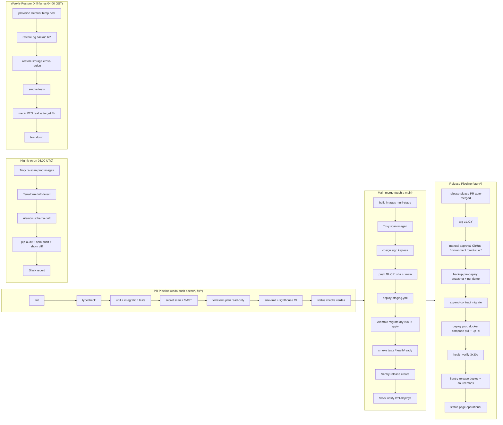

# CI/CD Pipeline + GitHub Actions Workflows — MT Middle East Fase 1

> Documento entregable de DevOps. Contiene la totalidad de workflows GitHub Actions, Dockerfiles, docker-compose, Caddyfile, scripts auxiliares y configuración de governance lista para copy-paste al monorepo `br-mt-ecommerce`. Prosa en español; YAML/Bash/Dockerfile en su forma original.

---

## 1. Overview de pipelines



| Pipeline | Trigger | Duración objetivo | Concurrency |
|---|---|---|---|
| PR | `pull_request` open/sync | <8 min p95 | `pr-${{ github.event.number }}` cancel-in-progress |
| Main merge | `push: branches: main` | <12 min | `main-deploy` no-cancel |
| Release prod | `push: tags: v*` | <15 min + approval | `prod-deploy` no-cancel |
| Nightly audit | `schedule: '0 3 * * *'` | <20 min | `nightly` skip-if-running |
| Weekly drill | `schedule: '0 0 * * 1'` (04 GST) | <60 min | `restore-drill` skip-if-running |

---

## 2. Branch strategy

- **`main`** protegido:
  - 2 reviewers requeridos (`PR review required`).
  - Status checks: `ci-backend`, `ci-frontend`, `ci-infra`, `pr-checks`.
  - **Linear history obligatoria** (squash o rebase merges; no merge commits).
  - **No force push**, no delete.
  - **Signed commits** requeridos (`CODEOWNERS` puede vetar).
  - Dismiss stale reviews on push.
- **Feature branches**: prefijos obligatorios validados por `pr-checks.yml`:
  - `feat/<scope>-<short>` — nueva funcionalidad.
  - `fix/<scope>-<short>` — bug fix.
  - `chore/<scope>-<short>` — tooling, deps, refactor mecánico.
  - `refactor/<scope>-<short>` — refactor sin cambio funcional.
  - `docs/<scope>-<short>` — sólo docs.
  - `infra/<scope>-<short>` — Terraform / Dockerfiles / workflows.
  - `hotfix/<scope>-<short>` — directo desde tag, merge fast-track.
- **Conventional Commits** obligatorio (`feat:`, `fix:`, `chore:`, `refactor:`, `docs:`, `test:`, `perf:`, `ci:`, `build:`, `revert:`). Validado por commitlint hook + `pr-checks.yml`.
- **Versionado semántico** automatizado con `release-please-action` v4 — genera PR con changelog basado en conventional commits, al merge crea tag `v1.X.Y` y dispara `deploy-prod.yml`.
- **Hotfix flow**: tag `vX.Y.Z` → branch `hotfix/...` → PR a `main` con label `hotfix` que skipea checks no críticos → merge → `release-please` patcha el tag.

---

## 3. Estructura de repo y workflows

```
br-mt-ecommerce/
├── .github/
│   ├── workflows/
│   │   ├── ci-backend.yml
│   │   ├── ci-frontend.yml
│   │   ├── ci-infra.yml
│   │   ├── pr-checks.yml
│   │   ├── deploy-staging.yml
│   │   ├── deploy-prod.yml
│   │   ├── nightly-audit.yml
│   │   ├── weekly-restore-drill.yml
│   │   ├── release-please.yml
│   │   ├── codeql.yml
│   │   └── dependabot-auto-merge.yml
│   ├── dependabot.yml
│   ├── CODEOWNERS
│   ├── pull_request_template.md
│   └── ISSUE_TEMPLATE/
│       ├── bug_report.yml
│       ├── feature_request.yml
│       └── postmortem.yml
├── mt-pricing-backend/
│   ├── Dockerfile
│   ├── pyproject.toml
│   └── ...
├── mt-pricing-frontend/
│   ├── Dockerfile
│   ├── package.json
│   └── ...
├── infra/
│   ├── terraform/
│   ├── caddy/Caddyfile
│   ├── docker-compose.dev.yml
│   └── docker-compose.prod.yml
├── scripts/
│   ├── deploy.sh
│   ├── migrate.sh
│   ├── backup.sh
│   ├── restore.sh
│   └── seed-roles.sh
├── .pre-commit-config.yaml
├── .gitignore
├── .editorconfig
├── .nvmrc
├── commitlint.config.js
└── release-please-config.json
```

---

## 4. Workflows completos (YAML copy-paste ready)

> Todas las actions están **pinneadas por SHA mayor** (mejor seguridad supply-chain). Si tu repo es público, considerar Renovate/Dependabot que actualice los SHAs preservando los comentarios `# v4.1.7`.

### 4.1 `.github/workflows/ci-backend.yml`

```yaml
# CI Backend (FastAPI + Celery) — lint, typecheck, test, scan, build, sign.
# Triggers: PRs y push a main que tocan mt-pricing-backend/ o workflows/ci-backend.yml.
name: ci-backend

on:
  pull_request:
    paths:
      - 'mt-pricing-backend/**'
      - '.github/workflows/ci-backend.yml'
  push:
    branches: [main]
    paths:
      - 'mt-pricing-backend/**'
      - '.github/workflows/ci-backend.yml'

# Cancelamos runs anteriores en el mismo PR para no quemar minutos.
concurrency:
  group: ci-backend-${{ github.ref }}
  cancel-in-progress: ${{ github.event_name == 'pull_request' }}

# Permisos mínimos por job (least privilege).
permissions:
  contents: read

jobs:
  lint-and-typecheck:
    name: Lint + Typecheck
    runs-on: ubuntu-22.04
    timeout-minutes: 10
    defaults:
      run:
        working-directory: mt-pricing-backend
    steps:
      - name: Checkout
        uses: actions/checkout@692973e3d937129bcbf40652eb9f2f61becf3332 # v4.1.7

      - name: Setup Python 3.11
        uses: actions/setup-python@39cd14951b08e74b54015e9e001cdefcf80e669f # v5.1.1
        with:
          python-version: '3.11.9'
          # Cache pip + uv lock automaticamente.
          cache: 'pip'
          cache-dependency-path: mt-pricing-backend/requirements*.txt

      - name: Install uv (fast resolver)
        run: pip install uv==0.4.18

      - name: Install dependencies (frozen)
        # uv pip sync respeta el lockfile y es 10x más rápido que pip-tools.
        run: uv pip sync --system requirements-dev.txt

      - name: Ruff lint (incluye isort + format check)
        run: ruff check . --output-format=github

      - name: Ruff format --check
        run: ruff format --check .

      - name: Mypy strict
        # mypy --strict; si emite warnings nuevos, falla el job.
        run: mypy --strict --no-incremental app/

  test:
    name: Tests + Coverage
    runs-on: ubuntu-22.04
    timeout-minutes: 15
    needs: lint-and-typecheck
    defaults:
      run:
        working-directory: mt-pricing-backend
    services:
      # Testcontainers también funciona pero levantar PG/Redis como service
      # ahorra ~30s al evitar pull en cada job.
      postgres:
        image: postgres:16.4-alpine
        env:
          POSTGRES_USER: mt
          POSTGRES_PASSWORD: mt
          POSTGRES_DB: mt_test
        options: >-
          --health-cmd "pg_isready -U mt"
          --health-interval 5s
          --health-timeout 3s
          --health-retries 10
        ports: ['5432:5432']
      redis:
        image: redis:7.4-alpine
        options: >-
          --health-cmd "redis-cli ping"
          --health-interval 5s
          --health-retries 10
        ports: ['6379:6379']
    env:
      DATABASE_URL: postgresql+psycopg://mt:mt@localhost:5432/mt_test
      REDIS_URL: redis://localhost:6379/0
      CELERY_TASK_ALWAYS_EAGER: 'true'
      SENTRY_DSN: ''
      DOPPLER_TOKEN: ''
    steps:
      - uses: actions/checkout@692973e3d937129bcbf40652eb9f2f61becf3332 # v4.1.7

      - uses: actions/setup-python@39cd14951b08e74b54015e9e001cdefcf80e669f # v5.1.1
        with:
          python-version: '3.11.9'
          cache: 'pip'
          cache-dependency-path: mt-pricing-backend/requirements*.txt

      - name: Install uv
        run: pip install uv==0.4.18

      - name: Install deps
        run: uv pip sync --system requirements-dev.txt

      - name: Apply Alembic migrations a Postgres test
        run: alembic upgrade head

      - name: Run pytest con cov
        # Falla si coverage <85% (target Fase 1).
        run: |
          pytest -q \
            --cov=app \
            --cov-report=xml \
            --cov-report=term-missing \
            --cov-fail-under=85 \
            --maxfail=1 \
            --durations=15

      - name: Upload coverage artifact
        uses: actions/upload-artifact@b4b15b8c7c6ac21ea08fcf65892d2ee8f75cf882 # v4.4.3
        if: always()
        with:
          name: coverage-backend-${{ github.sha }}
          path: mt-pricing-backend/coverage.xml
          retention-days: 14

  security-scans:
    name: Security Scans
    runs-on: ubuntu-22.04
    timeout-minutes: 12
    needs: lint-and-typecheck
    permissions:
      contents: read
      security-events: write  # para subir SARIF a Code Scanning
    steps:
      - uses: actions/checkout@692973e3d937129bcbf40652eb9f2f61becf3332 # v4.1.7
        with:
          fetch-depth: 0  # gitleaks necesita historia

      - name: Gitleaks (secret scan)
        uses: gitleaks/gitleaks-action@ff98106e4c7b2bc287b24eaf42907196329070c7 # v2.3.7
        env:
          GITHUB_TOKEN: ${{ secrets.GITHUB_TOKEN }}
          GITLEAKS_LICENSE: ${{ secrets.GITLEAKS_LICENSE }}  # opcional org

      - name: Semgrep SAST
        uses: semgrep/semgrep-action@8b5ea72f8a14da2ec8e1be6af6d5bc36996a4e0a # v1
        with:
          config: >-
            p/python
            p/owasp-top-ten
            p/security-audit
            p/secrets

      - name: Bandit
        run: |
          pip install bandit==1.7.10
          bandit -r mt-pricing-backend/app -lll -ii -f sarif -o bandit.sarif || true

      - name: Upload Bandit SARIF
        uses: github/codeql-action/upload-sarif@4f3212b61783c3c68e8309a0f18a699764811cda # v3.27.5
        if: always()
        with:
          sarif_file: bandit.sarif
          category: bandit

  build-image:
    name: Build + Sign Image
    runs-on: ubuntu-22.04
    # Solo en push a main; en PRs no construimos imagen para ahorrar minutos.
    if: github.event_name == 'push' && github.ref == 'refs/heads/main'
    needs: [test, security-scans]
    timeout-minutes: 20
    permissions:
      contents: read
      packages: write       # push a GHCR
      id-token: write       # cosign keyless (Fulcio)
    steps:
      - uses: actions/checkout@692973e3d937129bcbf40652eb9f2f61becf3332 # v4.1.7

      - name: Setup QEMU
        uses: docker/setup-qemu-action@49b3bc8e6bdd4a60e6116a5414239cba5943d3cf # v3.2.0

      - name: Setup Buildx
        uses: docker/setup-buildx-action@c47758b77c9736f4b2ef4073d4d51994fabfe349 # v3.7.1

      - name: Login GHCR
        uses: docker/login-action@9780b0c442fbb1117ed29e0efdff1e18412f7567 # v3.3.0
        with:
          registry: ghcr.io
          username: ${{ github.actor }}
          password: ${{ secrets.GITHUB_TOKEN }}

      - name: Extract metadata (tags, labels)
        id: meta
        uses: docker/metadata-action@8e5442c4ef9f78752691e2d8f8d19755c6f78e81 # v5.5.1
        with:
          images: ghcr.io/${{ github.repository_owner }}/mt-pricing-backend
          tags: |
            type=sha,prefix=sha-,format=short
            type=raw,value=main,enable={{is_default_branch}}
            type=raw,value=latest,enable={{is_default_branch}}
          labels: |
            org.opencontainers.image.title=mt-pricing-backend
            org.opencontainers.image.vendor=BR Innovation
            org.opencontainers.image.source=https://github.com/${{ github.repository }}

      - name: Build + push (cache GHA)
        id: build
        uses: docker/build-push-action@4f58ea79222b3b9dc2c8bbdd6debcef730109a75 # v6.9.0
        with:
          context: ./mt-pricing-backend
          file: ./mt-pricing-backend/Dockerfile
          push: true
          tags: ${{ steps.meta.outputs.tags }}
          labels: ${{ steps.meta.outputs.labels }}
          cache-from: type=gha,scope=backend
          cache-to: type=gha,mode=max,scope=backend
          provenance: true
          sbom: true

      - name: Trivy scan imagen recién construida
        uses: aquasecurity/trivy-action@18f2510ee396bbf400402947b394f2dd8c87dbb0 # 0.29.0
        with:
          image-ref: ghcr.io/${{ github.repository_owner }}/mt-pricing-backend@${{ steps.build.outputs.digest }}
          format: sarif
          output: trivy-backend.sarif
          severity: CRITICAL,HIGH
          exit-code: '1'        # falla el job si HIGH/CRITICAL
          ignore-unfixed: true

      - name: Upload Trivy SARIF
        if: always()
        uses: github/codeql-action/upload-sarif@4f3212b61783c3c68e8309a0f18a699764811cda # v3.27.5
        with:
          sarif_file: trivy-backend.sarif
          category: trivy-backend

      - name: Install cosign
        uses: sigstore/cosign-installer@4959ce089c160fddf62f7b42464195ba1a56d382 # v3.6.0
        with:
          cosign-release: 'v2.4.1'

      - name: Sign imagen (keyless via OIDC)
        env:
          DIGEST: ${{ steps.build.outputs.digest }}
          IMAGE: ghcr.io/${{ github.repository_owner }}/mt-pricing-backend
        run: cosign sign --yes "${IMAGE}@${DIGEST}"
```

### 4.2 `.github/workflows/ci-frontend.yml`

```yaml
# CI Frontend (Next.js 14 App Router) — lint, typecheck, test, e2e, build, lighthouse, sign.
name: ci-frontend

on:
  pull_request:
    paths:
      - 'mt-pricing-frontend/**'
      - '.github/workflows/ci-frontend.yml'
  push:
    branches: [main]
    paths:
      - 'mt-pricing-frontend/**'
      - '.github/workflows/ci-frontend.yml'

concurrency:
  group: ci-frontend-${{ github.ref }}
  cancel-in-progress: ${{ github.event_name == 'pull_request' }}

permissions:
  contents: read

jobs:
  lint-typecheck-test:
    name: Lint + Typecheck + Test + Build
    runs-on: ubuntu-22.04
    timeout-minutes: 18
    defaults:
      run:
        working-directory: mt-pricing-frontend
    steps:
      - uses: actions/checkout@692973e3d937129bcbf40652eb9f2f61becf3332 # v4.1.7

      - uses: pnpm/action-setup@fe02b34f77f8bc703788d5817da081398fad5dd2 # v4.0.0
        with:
          version: 9.12.3

      - uses: actions/setup-node@39370e3970a6d050c480ffad4ff0ed4d3fdee5af # v4.1.0
        with:
          node-version: '20.18.0'
          cache: 'pnpm'
          cache-dependency-path: mt-pricing-frontend/pnpm-lock.yaml

      - name: Install (frozen)
        run: pnpm install --frozen-lockfile

      - name: ESLint
        run: pnpm lint

      - name: Prettier check
        run: pnpm format:check

      - name: Typecheck (tsc --noEmit)
        run: pnpm typecheck

      - name: Vitest unit + integration
        run: pnpm test --coverage

      - name: Playwright install (cached)
        run: pnpm exec playwright install --with-deps chromium

      - name: Playwright e2e (mock backend con MSW)
        run: pnpm test:e2e
        env:
          NEXT_PUBLIC_API_BASE_URL: http://localhost:3001/mock
          PLAYWRIGHT_BROWSERS: chromium

      - name: Build Next.js (standalone output)
        run: pnpm build
        env:
          NEXT_TELEMETRY_DISABLED: '1'

      - name: Bundle size budget (size-limit)
        run: pnpm size

      - name: Lighthouse CI (homepage + 3 rutas críticas)
        uses: treosh/lighthouse-ci-action@1631d9a2d3f7d802faf9c772aac80fb74937b0bb # v12.1.0
        with:
          configPath: mt-pricing-frontend/.lighthouserc.json
          uploadArtifacts: true
          temporaryPublicStorage: true

  security-scans:
    name: Security Scans Frontend
    runs-on: ubuntu-22.04
    timeout-minutes: 10
    permissions:
      contents: read
      security-events: write
    steps:
      - uses: actions/checkout@692973e3d937129bcbf40652eb9f2f61becf3332 # v4.1.7
        with:
          fetch-depth: 0

      - name: Gitleaks
        uses: gitleaks/gitleaks-action@ff98106e4c7b2bc287b24eaf42907196329070c7 # v2.3.7
        env:
          GITHUB_TOKEN: ${{ secrets.GITHUB_TOKEN }}

      - name: Semgrep (Next.js + React rules)
        uses: semgrep/semgrep-action@8b5ea72f8a14da2ec8e1be6af6d5bc36996a4e0a # v1
        with:
          config: p/typescript p/react p/owasp-top-ten

  build-image:
    name: Build + Sign Frontend Image
    runs-on: ubuntu-22.04
    if: github.event_name == 'push' && github.ref == 'refs/heads/main'
    needs: [lint-typecheck-test, security-scans]
    timeout-minutes: 20
    permissions:
      contents: read
      packages: write
      id-token: write
    steps:
      - uses: actions/checkout@692973e3d937129bcbf40652eb9f2f61becf3332 # v4.1.7

      - uses: docker/setup-buildx-action@c47758b77c9736f4b2ef4073d4d51994fabfe349 # v3.7.1

      - uses: docker/login-action@9780b0c442fbb1117ed29e0efdff1e18412f7567 # v3.3.0
        with:
          registry: ghcr.io
          username: ${{ github.actor }}
          password: ${{ secrets.GITHUB_TOKEN }}

      - id: meta
        uses: docker/metadata-action@8e5442c4ef9f78752691e2d8f8d19755c6f78e81 # v5.5.1
        with:
          images: ghcr.io/${{ github.repository_owner }}/mt-pricing-frontend
          tags: |
            type=sha,prefix=sha-,format=short
            type=raw,value=main,enable={{is_default_branch}}
            type=raw,value=latest,enable={{is_default_branch}}

      - id: build
        uses: docker/build-push-action@4f58ea79222b3b9dc2c8bbdd6debcef730109a75 # v6.9.0
        with:
          context: ./mt-pricing-frontend
          push: true
          tags: ${{ steps.meta.outputs.tags }}
          labels: ${{ steps.meta.outputs.labels }}
          cache-from: type=gha,scope=frontend
          cache-to: type=gha,mode=max,scope=frontend
          provenance: true
          sbom: true

      - name: Trivy scan
        uses: aquasecurity/trivy-action@18f2510ee396bbf400402947b394f2dd8c87dbb0 # 0.29.0
        with:
          image-ref: ghcr.io/${{ github.repository_owner }}/mt-pricing-frontend@${{ steps.build.outputs.digest }}
          format: sarif
          output: trivy-frontend.sarif
          severity: CRITICAL,HIGH
          exit-code: '1'
          ignore-unfixed: true

      - uses: github/codeql-action/upload-sarif@4f3212b61783c3c68e8309a0f18a699764811cda # v3.27.5
        if: always()
        with:
          sarif_file: trivy-frontend.sarif
          category: trivy-frontend

      - uses: sigstore/cosign-installer@4959ce089c160fddf62f7b42464195ba1a56d382 # v3.6.0

      - name: Sign keyless
        env:
          DIGEST: ${{ steps.build.outputs.digest }}
          IMAGE: ghcr.io/${{ github.repository_owner }}/mt-pricing-frontend
        run: cosign sign --yes "${IMAGE}@${DIGEST}"
```

### 4.3 `.github/workflows/ci-infra.yml`

```yaml
# CI Infra — Terraform fmt/validate/plan + tflint + tfsec.
# Sólo corre en PRs/pushes que tocan infra/terraform/.
name: ci-infra

on:
  pull_request:
    paths:
      - 'infra/terraform/**'
      - '.github/workflows/ci-infra.yml'
  push:
    branches: [main]
    paths:
      - 'infra/terraform/**'

concurrency:
  group: ci-infra-${{ github.ref }}
  cancel-in-progress: true

permissions:
  contents: read
  pull-requests: write   # para comment del plan

jobs:
  terraform:
    name: Terraform Validate + Plan
    runs-on: ubuntu-22.04
    timeout-minutes: 12
    defaults:
      run:
        working-directory: infra/terraform
    env:
      TF_IN_AUTOMATION: '1'
      TF_INPUT: '0'
    steps:
      - uses: actions/checkout@692973e3d937129bcbf40652eb9f2f61becf3332 # v4.1.7

      - uses: hashicorp/setup-terraform@b9cd54a3c349d3f38e8881555d616ced269862dd # v3.1.2
        with:
          terraform_version: 1.9.8
          terraform_wrapper: false

      - name: terraform fmt --check
        run: terraform fmt -check -recursive

      - name: terraform init (backend remote)
        env:
          TF_TOKEN_app_terraform_io: ${{ secrets.TF_CLOUD_TOKEN }}
        run: terraform init -backend=true

      - name: terraform validate
        run: terraform validate -no-color

      - name: tflint
        uses: terraform-linters/setup-tflint@90f302c255ef959cbfb4bd10581afecdb7ece3e6 # v4.1.1
        with:
          tflint_version: v0.53.0

      - run: tflint --recursive -f compact

      - name: tfsec
        uses: aquasecurity/tfsec-action@b466648d6e39e7c75324f25d83891162a721f2d6 # v1.0.3
        with:
          working_directory: infra/terraform

      - name: terraform plan (read-only)
        if: github.event_name == 'pull_request'
        # OIDC opcional; aquí asumimos token Doppler-managed.
        env:
          DOPPLER_TOKEN: ${{ secrets.DOPPLER_INFRA_PLAN_TOKEN }}
        run: |
          terraform plan -no-color -out=tfplan.bin > plan.txt 2>&1 || true
          terraform show -no-color tfplan.bin > plan-readable.txt

      - name: Comment plan en PR
        if: github.event_name == 'pull_request'
        uses: marocchino/sticky-pull-request-comment@52423e01640425a022ef5fd42c6fb5f633a02728 # v2.9.1
        with:
          header: terraform-plan
          path: infra/terraform/plan-readable.txt
```

### 4.4 `.github/workflows/pr-checks.yml`

```yaml
# Umbrella checks para PRs: conventional commits, PR template, CHANGELOG, ADR review.
name: pr-checks

on:
  pull_request:
    types: [opened, edited, synchronize, reopened]

concurrency:
  group: pr-checks-${{ github.event.pull_request.number }}
  cancel-in-progress: true

permissions:
  contents: read
  pull-requests: read

jobs:
  conventional-commits:
    name: Conventional Commits
    runs-on: ubuntu-22.04
    timeout-minutes: 3
    steps:
      - uses: amannn/action-semantic-pull-request@0723387faaf9b38adef4775cd42cfd5155ed6017 # v5.5.3
        env:
          GITHUB_TOKEN: ${{ secrets.GITHUB_TOKEN }}
        with:
          types: |
            feat
            fix
            chore
            docs
            refactor
            test
            perf
            ci
            build
            revert
          requireScope: false
          subjectPattern: ^(?![A-Z]).+$
          subjectPatternError: |
            El subject del PR debe empezar en minúscula.

  pr-template-check:
    name: PR Template Completeness
    runs-on: ubuntu-22.04
    timeout-minutes: 3
    steps:
      - uses: actions/checkout@692973e3d937129bcbf40652eb9f2f61becf3332 # v4.1.7

      - name: Verifica que el PR body tenga las secciones requeridas
        env:
          BODY: ${{ github.event.pull_request.body }}
        run: |
          for marker in "## Resumen" "## Cambios" "## Riesgos" "## Plan de rollback"; do
            if ! echo "$BODY" | grep -qF "$marker"; then
              echo "::error::Falta sección obligatoria '$marker' en el PR body."
              exit 1
            fi
          done

  changelog-entry:
    name: CHANGELOG entry
    runs-on: ubuntu-22.04
    timeout-minutes: 3
    if: ${{ !contains(github.event.pull_request.labels.*.name, 'skip-changelog') }}
    steps:
      - uses: actions/checkout@692973e3d937129bcbf40652eb9f2f61becf3332 # v4.1.7
        with:
          fetch-depth: 0

      - name: Verifica que CHANGELOG.md o un .changeset/ se haya tocado
        run: |
          BASE=${{ github.event.pull_request.base.sha }}
          HEAD=${{ github.event.pull_request.head.sha }}
          if git diff --name-only "$BASE" "$HEAD" | grep -E '^(CHANGELOG\.md|\.changeset/)'; then
            echo "Changelog OK"
          else
            echo "::error::Añade entrada en CHANGELOG.md o .changeset/, o etiqueta el PR con 'skip-changelog'."
            exit 1
          fi

  adr-review:
    name: ADR review enforcement
    runs-on: ubuntu-22.04
    timeout-minutes: 3
    steps:
      - uses: actions/checkout@692973e3d937129bcbf40652eb9f2f61becf3332 # v4.1.7
        with:
          fetch-depth: 0

      - name: Si el PR toca _bmad-output/planning-artifacts/adr/, exige label 'arch-review'
        run: |
          BASE=${{ github.event.pull_request.base.sha }}
          HEAD=${{ github.event.pull_request.head.sha }}
          if git diff --name-only "$BASE" "$HEAD" | grep -q '^_bmad-output/planning-artifacts/adr/'; then
            LABELS='${{ toJson(github.event.pull_request.labels.*.name) }}'
            if ! echo "$LABELS" | grep -q 'arch-review'; then
              echo "::error::Cambios en ADRs requieren label 'arch-review' y aprobación del arquitecto."
              exit 1
            fi
          fi
```

### 4.5 `.github/workflows/deploy-staging.yml`

```yaml
# Deploy a staging Hetzner — auto en push a main si tocaron backend/frontend/infra.
name: deploy-staging

on:
  push:
    branches: [main]
    paths:
      - 'mt-pricing-backend/**'
      - 'mt-pricing-frontend/**'
      - 'infra/docker-compose.prod.yml'
      - 'infra/caddy/**'
      - '.github/workflows/deploy-staging.yml'
  workflow_dispatch: {}

concurrency:
  group: deploy-staging
  cancel-in-progress: false

permissions:
  contents: read
  packages: read
  id-token: write   # OIDC contra Doppler

jobs:
  deploy:
    name: Deploy staging
    runs-on: ubuntu-22.04
    timeout-minutes: 20
    environment:
      name: staging
      url: https://staging.mt.brinnovation.cloud
    steps:
      - uses: actions/checkout@692973e3d937129bcbf40652eb9f2f61becf3332 # v4.1.7

      # Doppler con token-auth (OIDC para Doppler aún en beta — usamos service token rotado mensualmente).
      - name: Install Doppler CLI
        uses: dopplerhq/cli-action@dca50cae16de4d9dffb831fe9bbed24c2e6b5b97 # v3.0.0

      - name: Doppler — pull staging secrets
        env:
          DOPPLER_TOKEN: ${{ secrets.DOPPLER_TOKEN_STAGING }}
        run: |
          doppler secrets download --no-file --format env > .env.staging
          chmod 600 .env.staging

      - name: Configure SSH a Hetzner staging (vía Tailscale)
        uses: tailscale/github-action@4e4c49acaa9818630ce0bd7a564372c17e33fb4d # v3.0.0
        with:
          oauth-client-id: ${{ secrets.TS_OAUTH_CLIENT_ID }}
          oauth-secret: ${{ secrets.TS_OAUTH_SECRET }}
          tags: tag:ci-deploy

      - name: Setup SSH key
        run: |
          mkdir -p ~/.ssh
          echo "${{ secrets.HETZNER_SSH_KEY }}" > ~/.ssh/id_ed25519
          chmod 600 ~/.ssh/id_ed25519
          ssh-keyscan -H staging.mt.internal >> ~/.ssh/known_hosts

      - name: Copy compose + .env al host
        run: |
          scp -i ~/.ssh/id_ed25519 \
            infra/docker-compose.prod.yml \
            infra/caddy/Caddyfile \
            .env.staging \
            scripts/deploy.sh \
            scripts/migrate.sh \
            deploy@staging.mt.internal:/opt/mt/

      - name: Pull imágenes nuevas + dry-run migrate
        env:
          IMAGE_SHA: sha-${{ github.sha }}
        run: |
          ssh -i ~/.ssh/id_ed25519 deploy@staging.mt.internal \
            "cd /opt/mt && IMAGE_SHA=$IMAGE_SHA bash deploy.sh pull && \
             bash migrate.sh dry-run"

      - name: Apply migraciones (Alembic + Supabase)
        run: |
          ssh -i ~/.ssh/id_ed25519 deploy@staging.mt.internal \
            "cd /opt/mt && bash migrate.sh apply"

      - name: docker compose up -d (rolling)
        env:
          IMAGE_SHA: sha-${{ github.sha }}
        run: |
          ssh -i ~/.ssh/id_ed25519 deploy@staging.mt.internal \
            "cd /opt/mt && IMAGE_SHA=$IMAGE_SHA bash deploy.sh up"

      - name: Smoke tests (3 attempts cada 30s)
        run: |
          for i in 1 2 3; do
            sleep 30
            curl -fsS https://staging.mt.brinnovation.cloud/health/ready && \
            curl -fsS https://staging.mt.brinnovation.cloud/api/health && break
            echo "Smoke test attempt $i fallido, reintentando..."
            if [ $i -eq 3 ]; then
              echo "::error::Smoke tests fallaron 3x. Investigar."
              exit 1
            fi
          done

      - name: Sentry release create + finalize
        uses: getsentry/action-release@586b62368d34c0b9112e35a0a0b8a51da4b50ff5 # v1.7.0
        env:
          SENTRY_AUTH_TOKEN: ${{ secrets.SENTRY_AUTH_TOKEN }}
          SENTRY_ORG: br-innovation
          SENTRY_PROJECT: mt-pricing
        with:
          environment: staging
          version: sha-${{ github.sha }}

      - name: Slack notify
        if: always()
        uses: slackapi/slack-github-action@485a9d42d3a73031f12ec201c457e2162c45d02d # v2.0.0
        with:
          webhook: ${{ secrets.SLACK_WEBHOOK_DEPLOYS }}
          webhook-type: incoming-webhook
          payload: |
            {
              "text": "Deploy staging *${{ job.status }}* — sha-${{ github.sha }} por ${{ github.actor }}"
            }
```

### 4.6 `.github/workflows/deploy-prod.yml`

```yaml
# Deploy a producción Hetzner — disparado por tag v* y con manual approval.
name: deploy-prod

on:
  push:
    tags:
      - 'v*.*.*'
  workflow_dispatch:
    inputs:
      tag:
        description: 'Tag a deployar (ej. v1.2.3)'
        required: true

concurrency:
  group: deploy-prod
  cancel-in-progress: false

permissions:
  contents: read
  packages: read
  id-token: write

jobs:
  pre-deploy-backup:
    name: Backup pre-deploy
    runs-on: ubuntu-22.04
    timeout-minutes: 15
    environment:
      name: production-prebackup
    steps:
      - uses: actions/checkout@692973e3d937129bcbf40652eb9f2f61becf3332 # v4.1.7

      - name: Doppler — pull prod
        uses: dopplerhq/cli-action@dca50cae16de4d9dffb831fe9bbed24c2e6b5b97 # v3.0.0

      - name: Trigger backup_pre_deploy task
        env:
          DOPPLER_TOKEN: ${{ secrets.DOPPLER_TOKEN_PROD_RO }}
          TAG: ${{ github.ref_name }}
        run: |
          doppler run -- bash scripts/backup.sh pre-deploy "$TAG"

  deploy:
    name: Deploy producción
    runs-on: ubuntu-22.04
    needs: pre-deploy-backup
    timeout-minutes: 25
    environment:
      # GitHub Environment con required reviewer = TI MT (psierra@br-innovation.com).
      name: production
      url: https://mt.brinnovation.cloud
    steps:
      - uses: actions/checkout@692973e3d937129bcbf40652eb9f2f61becf3332 # v4.1.7
        with:
          ref: ${{ github.ref }}

      - name: Install Doppler
        uses: dopplerhq/cli-action@dca50cae16de4d9dffb831fe9bbed24c2e6b5b97 # v3.0.0

      - name: Pull prod secrets
        env:
          DOPPLER_TOKEN: ${{ secrets.DOPPLER_TOKEN_PROD }}
        run: |
          doppler secrets download --no-file --format env > .env.prod
          chmod 600 .env.prod

      - name: Tailscale + SSH setup
        uses: tailscale/github-action@4e4c49acaa9818630ce0bd7a564372c17e33fb4d # v3.0.0
        with:
          oauth-client-id: ${{ secrets.TS_OAUTH_CLIENT_ID }}
          oauth-secret: ${{ secrets.TS_OAUTH_SECRET }}
          tags: tag:ci-deploy-prod

      - name: SSH key
        run: |
          mkdir -p ~/.ssh
          echo "${{ secrets.HETZNER_SSH_KEY_PROD }}" > ~/.ssh/id_ed25519
          chmod 600 ~/.ssh/id_ed25519
          ssh-keyscan -H prod.mt.internal >> ~/.ssh/known_hosts

      - name: Copy artefactos
        run: |
          scp -i ~/.ssh/id_ed25519 \
            infra/docker-compose.prod.yml \
            infra/caddy/Caddyfile \
            .env.prod \
            scripts/deploy.sh \
            scripts/migrate.sh \
            deploy@prod.mt.internal:/opt/mt/

      - name: Migrate dry-run + apply expand-contract
        env:
          TAG: ${{ github.ref_name }}
        run: |
          ssh -i ~/.ssh/id_ed25519 deploy@prod.mt.internal \
            "cd /opt/mt && bash migrate.sh dry-run && bash migrate.sh apply"

      - name: docker compose pull + up -d (rolling)
        env:
          IMAGE_TAG: ${{ github.ref_name }}
        run: |
          ssh -i ~/.ssh/id_ed25519 deploy@prod.mt.internal \
            "cd /opt/mt && IMAGE_TAG=$IMAGE_TAG bash deploy.sh up"

      - name: Health verify (3 intentos x 30s)
        run: |
          for i in 1 2 3; do
            sleep 30
            ok_be=$(curl -s -o /dev/null -w "%{http_code}" https://mt.brinnovation.cloud/health/ready)
            ok_fe=$(curl -s -o /dev/null -w "%{http_code}" https://mt.brinnovation.cloud/api/health)
            if [ "$ok_be" = "200" ] && [ "$ok_fe" = "200" ]; then
              echo "Healthy en intento $i"; exit 0
            fi
            echo "Intento $i fallido (be=$ok_be fe=$ok_fe)"
          done
          echo "::error::Health verify falló. Ejecutar runbook RB-02 (rollback)."
          exit 1

      - name: Sentry release deploy + sourcemaps
        uses: getsentry/action-release@586b62368d34c0b9112e35a0a0b8a51da4b50ff5 # v1.7.0
        env:
          SENTRY_AUTH_TOKEN: ${{ secrets.SENTRY_AUTH_TOKEN }}
          SENTRY_ORG: br-innovation
          SENTRY_PROJECT: mt-pricing
        with:
          environment: production
          version: ${{ github.ref_name }}
          sourcemaps: ./mt-pricing-frontend/.next

      - name: Status page → operational
        env:
          STATUSPAGE_TOKEN: ${{ secrets.STATUSPAGE_API_TOKEN }}
          PAGE_ID: ${{ secrets.STATUSPAGE_PAGE_ID }}
          COMPONENT_ID: ${{ secrets.STATUSPAGE_COMPONENT_MT }}
        run: |
          curl -X PATCH \
            -H "Authorization: OAuth $STATUSPAGE_TOKEN" \
            -H "Content-Type: application/json" \
            -d '{"component":{"status":"operational"}}' \
            "https://api.statuspage.io/v1/pages/$PAGE_ID/components/$COMPONENT_ID"

      - name: Slack notify
        if: always()
        uses: slackapi/slack-github-action@485a9d42d3a73031f12ec201c457e2162c45d02d # v2.0.0
        with:
          webhook: ${{ secrets.SLACK_WEBHOOK_DEPLOYS }}
          webhook-type: incoming-webhook
          payload: |
            {
              "text": "Deploy PROD *${{ job.status }}* — ${{ github.ref_name }} por ${{ github.actor }}. Runbook RB-02 en caso de issues."
            }
```

### 4.7 `.github/workflows/nightly-audit.yml`

```yaml
# Nightly audit cron 03:00 UTC.
name: nightly-audit

on:
  schedule:
    - cron: '0 3 * * *'
  workflow_dispatch: {}

concurrency:
  group: nightly-audit
  cancel-in-progress: false

permissions:
  contents: read
  security-events: write
  pull-requests: read

jobs:
  trivy-rescan-prod:
    name: Trivy re-scan imágenes prod
    runs-on: ubuntu-22.04
    timeout-minutes: 15
    steps:
      - uses: aquasecurity/trivy-action@18f2510ee396bbf400402947b394f2dd8c87dbb0 # 0.29.0
        with:
          image-ref: ghcr.io/${{ github.repository_owner }}/mt-pricing-backend:latest
          format: sarif
          output: trivy-be-nightly.sarif
          severity: CRITICAL,HIGH

      - uses: aquasecurity/trivy-action@18f2510ee396bbf400402947b394f2dd8c87dbb0 # 0.29.0
        with:
          image-ref: ghcr.io/${{ github.repository_owner }}/mt-pricing-frontend:latest
          format: sarif
          output: trivy-fe-nightly.sarif
          severity: CRITICAL,HIGH

      - uses: github/codeql-action/upload-sarif@4f3212b61783c3c68e8309a0f18a699764811cda # v3.27.5
        with:
          sarif_file: trivy-be-nightly.sarif
          category: trivy-be-nightly
      - uses: github/codeql-action/upload-sarif@4f3212b61783c3c68e8309a0f18a699764811cda # v3.27.5
        with:
          sarif_file: trivy-fe-nightly.sarif
          category: trivy-fe-nightly

  terraform-drift:
    name: Terraform drift detection
    runs-on: ubuntu-22.04
    timeout-minutes: 12
    steps:
      - uses: actions/checkout@692973e3d937129bcbf40652eb9f2f61becf3332 # v4.1.7

      - uses: hashicorp/setup-terraform@b9cd54a3c349d3f38e8881555d616ced269862dd # v3.1.2
        with:
          terraform_version: 1.9.8
          terraform_wrapper: false

      - name: terraform plan vs prod
        working-directory: infra/terraform
        env:
          TF_TOKEN_app_terraform_io: ${{ secrets.TF_CLOUD_TOKEN }}
        run: |
          terraform init
          terraform plan -detailed-exitcode -no-color -var-file=prod.tfvars > plan.txt 2>&1
          ec=$?
          if [ $ec -eq 2 ]; then
            echo "::warning::Drift detectado en producción"
            cat plan.txt | head -200
            exit 1
          fi

  schema-drift:
    name: Alembic schema drift
    runs-on: ubuntu-22.04
    timeout-minutes: 10
    steps:
      - uses: actions/checkout@692973e3d937129bcbf40652eb9f2f61becf3332 # v4.1.7
      - uses: actions/setup-python@39cd14951b08e74b54015e9e001cdefcf80e669f # v5.1.1
        with:
          python-version: '3.11.9'
      - name: Install + check
        working-directory: mt-pricing-backend
        env:
          DATABASE_URL: ${{ secrets.PROD_DB_RO_URL }}
        run: |
          pip install -r requirements.txt
          alembic check  # falla si head difiere del DB

  dependency-audit:
    name: pip-audit + npm audit + sbom diff
    runs-on: ubuntu-22.04
    timeout-minutes: 10
    steps:
      - uses: actions/checkout@692973e3d937129bcbf40652eb9f2f61becf3332 # v4.1.7
      - uses: actions/setup-python@39cd14951b08e74b54015e9e001cdefcf80e669f # v5.1.1
        with: { python-version: '3.11.9' }
      - run: pip install pip-audit==2.7.3
      - run: pip-audit -r mt-pricing-backend/requirements.txt --strict
        continue-on-error: true
      - uses: pnpm/action-setup@fe02b34f77f8bc703788d5817da081398fad5dd2 # v4.0.0
        with: { version: 9.12.3 }
      - uses: actions/setup-node@39370e3970a6d050c480ffad4ff0ed4d3fdee5af # v4.1.0
        with: { node-version: '20.18.0', cache: 'pnpm', cache-dependency-path: mt-pricing-frontend/pnpm-lock.yaml }
      - run: pnpm --filter mt-pricing-frontend audit --audit-level=high
        continue-on-error: true

  slack-report:
    name: Slack daily summary
    runs-on: ubuntu-22.04
    needs: [trivy-rescan-prod, terraform-drift, schema-drift, dependency-audit]
    if: always()
    timeout-minutes: 3
    steps:
      - uses: slackapi/slack-github-action@485a9d42d3a73031f12ec201c457e2162c45d02d # v2.0.0
        with:
          webhook: ${{ secrets.SLACK_WEBHOOK_OPS }}
          webhook-type: incoming-webhook
          payload: |
            {
              "text": "Nightly audit MT — Trivy=${{ needs.trivy-rescan-prod.result }}, Drift=${{ needs.terraform-drift.result }}, Schema=${{ needs.schema-drift.result }}, Deps=${{ needs.dependency-audit.result }}"
            }
```

### 4.8 `.github/workflows/weekly-restore-drill.yml`

```yaml
# Weekly restore drill — lunes 04:00 GST = 00:00 UTC. Mide RTO real.
name: weekly-restore-drill

on:
  schedule:
    - cron: '0 0 * * 1'
  workflow_dispatch: {}

concurrency:
  group: restore-drill
  cancel-in-progress: false

permissions:
  contents: read
  id-token: write

jobs:
  restore-drill:
    name: Restore drill
    runs-on: ubuntu-22.04
    timeout-minutes: 90
    steps:
      - uses: actions/checkout@692973e3d937129bcbf40652eb9f2f61becf3332 # v4.1.7

      - uses: dopplerhq/cli-action@dca50cae16de4d9dffb831fe9bbed24c2e6b5b97 # v3.0.0

      - name: Provision Hetzner Cloud temp host (Terraform)
        working-directory: infra/terraform/restore-drill
        env:
          DOPPLER_TOKEN: ${{ secrets.DOPPLER_TOKEN_DRILL }}
          TF_TOKEN_app_terraform_io: ${{ secrets.TF_CLOUD_TOKEN }}
        run: |
          terraform init
          terraform apply -auto-approve

      - name: Restore último backup Postgres desde R2
        env:
          DOPPLER_TOKEN: ${{ secrets.DOPPLER_TOKEN_DRILL }}
        run: |
          start=$(date +%s)
          doppler run -- bash scripts/restore.sh latest
          end=$(date +%s)
          rto_min=$(( (end - start) / 60 ))
          echo "RTO_MIN=$rto_min" >> $GITHUB_ENV
          echo "RTO real: ${rto_min} min — target 240 min."

      - name: Smoke tests sobre entorno restored
        run: |
          curl -fsS https://drill.mt.internal/health/ready
          curl -fsS https://drill.mt.internal/api/health

      - name: Tear down
        if: always()
        working-directory: infra/terraform/restore-drill
        env:
          TF_TOKEN_app_terraform_io: ${{ secrets.TF_CLOUD_TOKEN }}
        run: terraform destroy -auto-approve

      - name: Slack report con RTO
        if: always()
        uses: slackapi/slack-github-action@485a9d42d3a73031f12ec201c457e2162c45d02d # v2.0.0
        with:
          webhook: ${{ secrets.SLACK_WEBHOOK_OPS }}
          webhook-type: incoming-webhook
          payload: |
            {
              "text": "Weekly restore drill *${{ job.status }}* — RTO real ${{ env.RTO_MIN }} min (target 240)."
            }
```

### 4.9 `.github/workflows/release-please.yml`

```yaml
# Auto-genera PR de release con changelog basado en conventional commits.
name: release-please

on:
  push:
    branches: [main]

permissions:
  contents: write
  pull-requests: write

jobs:
  release:
    runs-on: ubuntu-22.04
    timeout-minutes: 5
    steps:
      - uses: googleapis/release-please-action@e4dc86ba9405554aeba3c6bb2d169500e7d3b4ee # v4.1.4
        with:
          config-file: release-please-config.json
          manifest-file: .release-please-manifest.json
          token: ${{ secrets.GITHUB_TOKEN }}
```

`release-please-config.json`:

```json
{
  "release-type": "node",
  "packages": {
    "mt-pricing-frontend": {
      "release-type": "node",
      "package-name": "mt-pricing-frontend",
      "changelog-path": "CHANGELOG.md"
    },
    "mt-pricing-backend": {
      "release-type": "python",
      "package-name": "mt-pricing-backend",
      "changelog-path": "CHANGELOG.md"
    }
  },
  "include-component-in-tag": true,
  "bump-minor-pre-major": true,
  "bump-patch-for-minor-pre-major": false
}
```

### 4.10 `.github/workflows/codeql.yml`

```yaml
# CodeQL semanal + en PRs que tocan paths críticos.
name: codeql

on:
  push:
    branches: [main]
  pull_request:
    branches: [main]
    paths:
      - 'mt-pricing-backend/app/**'
      - 'mt-pricing-frontend/src/**'
  schedule:
    - cron: '0 6 * * 1'

permissions:
  contents: read
  security-events: write
  actions: read

jobs:
  analyze:
    runs-on: ubuntu-22.04
    timeout-minutes: 30
    strategy:
      fail-fast: false
      matrix:
        language: [python, javascript-typescript]
    steps:
      - uses: actions/checkout@692973e3d937129bcbf40652eb9f2f61becf3332 # v4.1.7

      - uses: github/codeql-action/init@4f3212b61783c3c68e8309a0f18a699764811cda # v3.27.5
        with:
          languages: ${{ matrix.language }}
          queries: security-and-quality

      - uses: github/codeql-action/analyze@4f3212b61783c3c68e8309a0f18a699764811cda # v3.27.5
        with:
          category: '/language:${{ matrix.language }}'
```

### 4.11 `.github/workflows/dependabot-auto-merge.yml`

```yaml
# Auto-merge para Dependabot patch/minor que pasen CI.
name: dependabot-auto-merge

on:
  pull_request_target:
    types: [opened, synchronize, reopened]

permissions:
  contents: write
  pull-requests: write

jobs:
  auto-merge:
    if: github.actor == 'dependabot[bot]'
    runs-on: ubuntu-22.04
    timeout-minutes: 5
    steps:
      - name: Get metadata
        id: meta
        uses: dependabot/fetch-metadata@dbb049abf0d677abbd7f7eee0375145b417fdd34 # v2.2.0
        with:
          github-token: ${{ secrets.GITHUB_TOKEN }}

      - name: Enable auto-merge para patch/minor
        if: steps.meta.outputs.update-type == 'version-update:semver-patch' || steps.meta.outputs.update-type == 'version-update:semver-minor'
        run: gh pr merge --auto --squash "$PR_URL"
        env:
          PR_URL: ${{ github.event.pull_request.html_url }}
          GH_TOKEN: ${{ secrets.GITHUB_TOKEN }}
```

### 4.12 `.github/dependabot.yml`

```yaml
version: 2
updates:
  - package-ecosystem: pip
    directory: /mt-pricing-backend
    schedule:
      interval: weekly
      day: monday
      time: "06:00"
      timezone: "Asia/Dubai"
    open-pull-requests-limit: 5
    groups:
      python-minor:
        update-types: ["minor", "patch"]
    labels: [dependencies, backend]

  - package-ecosystem: npm
    directory: /mt-pricing-frontend
    schedule: { interval: weekly, day: monday }
    open-pull-requests-limit: 5
    groups:
      js-minor:
        update-types: ["minor", "patch"]
    labels: [dependencies, frontend]

  - package-ecosystem: docker
    directory: /mt-pricing-backend
    schedule: { interval: weekly }
    labels: [dependencies, docker]

  - package-ecosystem: docker
    directory: /mt-pricing-frontend
    schedule: { interval: weekly }
    labels: [dependencies, docker]

  - package-ecosystem: github-actions
    directory: /
    schedule: { interval: weekly }
    labels: [dependencies, ci]

  - package-ecosystem: terraform
    directory: /infra/terraform
    schedule: { interval: weekly }
    labels: [dependencies, infra]
```

---

## 5. Dockerfiles

### 5.1 `mt-pricing-backend/Dockerfile`

```dockerfile
# syntax=docker/dockerfile:1.10

# ---------- Stage 1: builder ----------
FROM python:3.11.9-slim-bookworm AS builder

# Variables que evitan cache de bytecode + buffers
ENV PYTHONDONTWRITEBYTECODE=1 \
    PYTHONUNBUFFERED=1 \
    PIP_NO_CACHE_DIR=1 \
    PIP_DISABLE_PIP_VERSION_CHECK=1 \
    UV_SYSTEM_PYTHON=1

# Build deps mínimas (libpq para psycopg, gcc para compilar wheels nativos)
RUN apt-get update && apt-get install -y --no-install-recommends \
        build-essential libpq-dev curl ca-certificates \
    && rm -rf /var/lib/apt/lists/*

# Instala uv (resolver Rust 10x más rápido que pip-tools)
RUN pip install --no-cache-dir uv==0.4.18

WORKDIR /build
COPY requirements.txt requirements.txt
# uv pip sync con --system instala a /usr/local/lib/python3.11/site-packages
RUN uv pip sync --system --no-cache requirements.txt

# ---------- Stage 2: runtime ----------
FROM python:3.11.9-slim-bookworm AS runtime

# Argumentos OCI labels (poblados desde CI)
ARG GIT_SHA=unknown
ARG BUILD_DATE=unknown

LABEL org.opencontainers.image.title="mt-pricing-backend" \
      org.opencontainers.image.vendor="BR Innovation" \
      org.opencontainers.image.source="https://github.com/br-innovation/br-mt-ecommerce" \
      org.opencontainers.image.revision="${GIT_SHA}" \
      org.opencontainers.image.created="${BUILD_DATE}" \
      org.opencontainers.image.licenses="Proprietary"

ENV PYTHONDONTWRITEBYTECODE=1 \
    PYTHONUNBUFFERED=1 \
    PYTHONPATH=/app \
    PORT=8000

# Runtime libs (libpq sin -dev) + tini + curl para healthcheck
RUN apt-get update && apt-get install -y --no-install-recommends \
        libpq5 tini curl ca-certificates \
    && rm -rf /var/lib/apt/lists/* \
    && groupadd -r mt --gid 1000 \
    && useradd -r -u 1000 -g mt -d /app -s /usr/sbin/nologin mt

# Copia paquetes ya resueltos desde builder
COPY --from=builder /usr/local/lib/python3.11/site-packages /usr/local/lib/python3.11/site-packages
COPY --from=builder /usr/local/bin /usr/local/bin

WORKDIR /app
COPY --chown=mt:mt . /app

# Doppler CLI (instalado como root, ejecutable por todos)
RUN curl -fsS https://cli.doppler.com/install.sh | sh

USER mt:mt

# Filesystem read-only se setea a nivel compose (read_only: true)
# pero permitimos /tmp via tmpfs en compose.

EXPOSE 8000

# Healthcheck Docker-level (Caddy/compose también valida)
HEALTHCHECK --interval=30s --timeout=5s --start-period=20s --retries=3 \
  CMD curl -fsS http://localhost:${PORT}/health/live || exit 1

# tini como PID 1 para reaping correcto de zombies
ENTRYPOINT ["/usr/bin/tini", "--"]

# Default CMD = API. El worker/beat overridean esto en compose.
CMD ["doppler", "run", "--", "gunicorn", \
     "app.main:app", \
     "--bind=0.0.0.0:8000", \
     "--worker-class=uvicorn.workers.UvicornWorker", \
     "--workers=${GUNICORN_WORKERS:-4}", \
     "--timeout=60", \
     "--graceful-timeout=30", \
     "--access-logfile=-", \
     "--error-logfile=-"]
```

### 5.2 `mt-pricing-frontend/Dockerfile`

```dockerfile
# syntax=docker/dockerfile:1.10

# ---------- Stage 1: deps ----------
FROM node:20.18.0-alpine AS deps
RUN apk add --no-cache libc6-compat
WORKDIR /app
COPY package.json pnpm-lock.yaml ./
RUN corepack enable && corepack prepare pnpm@9.12.3 --activate
RUN pnpm install --frozen-lockfile --prod=false

# ---------- Stage 2: builder ----------
FROM node:20.18.0-alpine AS builder
WORKDIR /app
RUN corepack enable && corepack prepare pnpm@9.12.3 --activate
COPY --from=deps /app/node_modules ./node_modules
COPY . .

# Next.js standalone output reduce ~80% tamaño imagen final
ENV NEXT_TELEMETRY_DISABLED=1 \
    NODE_ENV=production
RUN pnpm build

# ---------- Stage 3: runtime ----------
FROM node:20.18.0-alpine AS runtime

ARG GIT_SHA=unknown
ARG BUILD_DATE=unknown
LABEL org.opencontainers.image.title="mt-pricing-frontend" \
      org.opencontainers.image.vendor="BR Innovation" \
      org.opencontainers.image.source="https://github.com/br-innovation/br-mt-ecommerce" \
      org.opencontainers.image.revision="${GIT_SHA}" \
      org.opencontainers.image.created="${BUILD_DATE}"

# tini + curl
RUN apk add --no-cache tini curl ca-certificates \
    && addgroup -g 1001 -S nodejs \
    && adduser -S nextjs -u 1001 -G nodejs

WORKDIR /app

# Copiar standalone output y assets estáticos
COPY --from=builder --chown=nextjs:nodejs /app/.next/standalone ./
COPY --from=builder --chown=nextjs:nodejs /app/.next/static ./.next/static
COPY --from=builder --chown=nextjs:nodejs /app/public ./public

ENV NODE_ENV=production \
    PORT=3000 \
    HOSTNAME=0.0.0.0 \
    NEXT_TELEMETRY_DISABLED=1

USER nextjs

EXPOSE 3000

HEALTHCHECK --interval=30s --timeout=5s --start-period=15s --retries=3 \
  CMD curl -fsS http://localhost:${PORT}/api/health || exit 1

ENTRYPOINT ["/sbin/tini", "--"]
CMD ["node", "server.js"]
```

### 5.3 Worker Celery (reusa imagen backend)

```yaml
# En docker-compose.prod.yml:
worker:
  image: ghcr.io/br-innovation/mt-pricing-backend:${IMAGE_TAG}
  command: ["doppler", "run", "--", "celery", "-A", "app.worker", "worker",
            "--loglevel=info", "--concurrency=4", "--max-tasks-per-child=100"]
  # resto igual al backend
```

### 5.4 Beat Scheduler (reusa imagen backend)

```yaml
beat:
  image: ghcr.io/br-innovation/mt-pricing-backend:${IMAGE_TAG}
  command: ["doppler", "run", "--", "celery", "-A", "app.worker", "beat",
            "--scheduler=app.scheduler:DatabaseScheduler", "--loglevel=info"]
```

---

## 6. docker-compose.dev.yml + docker-compose.prod.yml

### 6.1 `infra/docker-compose.dev.yml`

```yaml
# Compose para desarrollo local — hot reload, bind mounts, Adminer expuesto.
name: mt-dev

services:
  postgres:
    image: postgres:16.4-alpine
    container_name: mt-postgres-dev
    environment:
      POSTGRES_USER: mt
      POSTGRES_PASSWORD: mt
      POSTGRES_DB: mt_dev
      PGDATA: /var/lib/postgresql/data/pgdata
    volumes:
      - mt-pgdata-dev:/var/lib/postgresql/data
    ports: ["5432:5432"]
    healthcheck:
      test: ["CMD", "pg_isready", "-U", "mt", "-d", "mt_dev"]
      interval: 5s
      timeout: 3s
      retries: 10

  redis:
    image: redis:7.4-alpine
    container_name: mt-redis-dev
    command: ["redis-server", "--appendonly", "yes"]
    volumes:
      - mt-redis-dev:/data
    ports: ["6379:6379"]
    healthcheck:
      test: ["CMD", "redis-cli", "ping"]
      interval: 5s
      retries: 10

  adminer:
    image: adminer:4.8.1-standalone
    container_name: mt-adminer
    ports: ["8080:8080"]
    depends_on:
      postgres: { condition: service_healthy }

  backend:
    build:
      context: ../mt-pricing-backend
      dockerfile: Dockerfile
      target: builder    # en dev usamos imagen builder con uv y deps dev
    container_name: mt-backend-dev
    command: ["uvicorn", "app.main:app", "--host=0.0.0.0", "--port=8000", "--reload"]
    env_file: ../.env.dev
    environment:
      DATABASE_URL: postgresql+psycopg://mt:mt@postgres:5432/mt_dev
      REDIS_URL: redis://redis:6379/0
      ENVIRONMENT: development
    volumes:
      - ../mt-pricing-backend:/app:cached
    ports: ["8000:8000"]
    depends_on:
      postgres: { condition: service_healthy }
      redis: { condition: service_healthy }
    healthcheck:
      test: ["CMD", "curl", "-fsS", "http://localhost:8000/health/live"]
      interval: 15s

  worker:
    build:
      context: ../mt-pricing-backend
      target: builder
    command: ["celery", "-A", "app.worker", "worker", "--loglevel=debug"]
    env_file: ../.env.dev
    environment:
      DATABASE_URL: postgresql+psycopg://mt:mt@postgres:5432/mt_dev
      REDIS_URL: redis://redis:6379/0
    volumes:
      - ../mt-pricing-backend:/app:cached
    depends_on:
      redis: { condition: service_healthy }
      postgres: { condition: service_healthy }

  frontend:
    image: node:20.18.0-alpine
    container_name: mt-frontend-dev
    working_dir: /app
    command: sh -c "corepack enable && corepack prepare pnpm@9.12.3 --activate && pnpm install && pnpm dev"
    env_file: ../.env.dev
    environment:
      NEXT_PUBLIC_API_BASE_URL: http://localhost:8000
    volumes:
      - ../mt-pricing-frontend:/app:cached
      - /app/node_modules
      - /app/.next
    ports: ["3000:3000"]
    depends_on:
      backend: { condition: service_healthy }

  caddy:
    image: caddy:2.8.4-alpine
    container_name: mt-caddy-dev
    ports: ["80:80", "443:443"]
    volumes:
      - ./caddy/Caddyfile.dev:/etc/caddy/Caddyfile:ro
      - mt-caddy-data-dev:/data
      - mt-caddy-config-dev:/config
    depends_on:
      backend: { condition: service_healthy }
      frontend: { condition: service_started }

volumes:
  mt-pgdata-dev:
  mt-redis-dev:
  mt-caddy-data-dev:
  mt-caddy-config-dev:
```

### 6.2 `infra/docker-compose.prod.yml`

```yaml
# Compose para staging/producción — imágenes pre-built, healthchecks estrictos, networks aisladas.
name: mt-prod

x-restart-policy: &restart-policy
  restart: unless-stopped

x-logging: &logging
  logging:
    driver: json-file
    options:
      max-size: "50m"
      max-file: "5"

services:
  caddy:
    <<: *restart-policy
    <<: *logging
    image: caddy:2.8.4-alpine
    container_name: mt-caddy
    ports:
      - "80:80"
      - "443:443"
    volumes:
      - ./Caddyfile:/etc/caddy/Caddyfile:ro
      - caddy-data:/data
      - caddy-config:/config
    networks: [edge, app-net]
    depends_on:
      backend: { condition: service_healthy }
      frontend: { condition: service_healthy }
    deploy:
      resources:
        limits: { cpus: "1.0", memory: 512M }

  backend:
    <<: *restart-policy
    <<: *logging
    image: ghcr.io/br-innovation/mt-pricing-backend:${IMAGE_TAG:-latest}
    container_name: mt-backend
    env_file: /opt/mt/.env.prod
    environment:
      GUNICORN_WORKERS: "4"
      ENVIRONMENT: production
    networks: [app-net, db-net]
    read_only: true
    tmpfs:
      - /tmp:size=128M
    healthcheck:
      test: ["CMD", "curl", "-fsS", "http://localhost:8000/health/ready"]
      interval: 15s
      timeout: 5s
      retries: 5
      start_period: 30s
    depends_on:
      redis: { condition: service_healthy }
    deploy:
      resources:
        limits: { cpus: "2.0", memory: 1024M }
        reservations: { cpus: "0.5", memory: 512M }

  worker:
    <<: *restart-policy
    <<: *logging
    image: ghcr.io/br-innovation/mt-pricing-backend:${IMAGE_TAG:-latest}
    container_name: mt-worker
    command: ["doppler", "run", "--", "celery", "-A", "app.worker", "worker",
              "--loglevel=info", "--concurrency=4", "--max-tasks-per-child=100"]
    env_file: /opt/mt/.env.prod
    networks: [app-net, db-net]
    read_only: true
    tmpfs:
      - /tmp:size=256M
    healthcheck:
      test: ["CMD", "celery", "-A", "app.worker", "inspect", "ping", "-d", "celery@$$HOSTNAME"]
      interval: 30s
      timeout: 10s
      retries: 3
      start_period: 30s
    depends_on:
      redis: { condition: service_healthy }
    deploy:
      resources:
        limits: { cpus: "2.0", memory: 1024M }

  beat:
    <<: *restart-policy
    <<: *logging
    image: ghcr.io/br-innovation/mt-pricing-backend:${IMAGE_TAG:-latest}
    container_name: mt-beat
    command: ["doppler", "run", "--", "celery", "-A", "app.worker", "beat",
              "--scheduler=app.scheduler:DatabaseScheduler", "--loglevel=info"]
    env_file: /opt/mt/.env.prod
    networks: [app-net, db-net]
    read_only: true
    tmpfs:
      - /tmp:size=64M
    depends_on:
      redis: { condition: service_healthy }
    deploy:
      resources:
        limits: { cpus: "0.5", memory: 256M }

  frontend:
    <<: *restart-policy
    <<: *logging
    image: ghcr.io/br-innovation/mt-pricing-frontend:${IMAGE_TAG:-latest}
    container_name: mt-frontend
    env_file: /opt/mt/.env.prod
    environment:
      NEXT_PUBLIC_API_BASE_URL: ${PUBLIC_API_URL}
    networks: [app-net]
    read_only: true
    tmpfs:
      - /tmp:size=64M
    healthcheck:
      test: ["CMD", "curl", "-fsS", "http://localhost:3000/api/health"]
      interval: 15s
      timeout: 5s
      retries: 5
      start_period: 30s
    deploy:
      resources:
        limits: { cpus: "1.0", memory: 512M }

  redis:
    <<: *restart-policy
    <<: *logging
    image: redis:7.4-alpine
    container_name: mt-redis
    command: ["redis-server", "--appendonly", "yes",
              "--maxmemory", "512mb", "--maxmemory-policy", "allkeys-lru"]
    volumes:
      - redis-data:/data
    networks: [app-net]
    healthcheck:
      test: ["CMD", "redis-cli", "ping"]
      interval: 10s
      retries: 10
    deploy:
      resources:
        limits: { cpus: "0.5", memory: 768M }

networks:
  edge:
    driver: bridge
  app-net:
    driver: bridge
    internal: false
  db-net:
    driver: bridge
    internal: true   # sin acceso al exterior

volumes:
  caddy-data:
  caddy-config:
  redis-data:
```

---

## 7. Caddyfile (`infra/caddy/Caddyfile`)

```caddyfile
# Caddy 2.8 — TLS automático Let's Encrypt + reverse proxy + security headers.
# Variables provistas por compose .env: PUBLIC_HOSTNAME, ACME_EMAIL.

{
    # Email para ACME (Let's Encrypt)
    email {$ACME_EMAIL}
    # Logs estructurados JSON a stdout (Loki los consume)
    log {
        output stdout
        format json
        level INFO
    }
    # Server-wide options
    servers {
        protocols h1 h2 h3
        max_header_size 16KB
    }
}

# Snippet reusable de headers de seguridad alineados a ADR-054.
(security_headers) {
    header {
        # HSTS 2 años incluyendo subdominios + preload
        Strict-Transport-Security "max-age=63072000; includeSubDomains; preload"
        # CSP estricta — ajusta connect-src si añades dominios externos
        Content-Security-Policy "default-src 'self'; script-src 'self' 'unsafe-inline' 'unsafe-eval' https://browser.sentry-cdn.com; style-src 'self' 'unsafe-inline'; img-src 'self' data: https:; connect-src 'self' https://*.sentry.io https://*.ingest.sentry.io; frame-ancestors 'none'; base-uri 'self'; form-action 'self'"
        X-Content-Type-Options "nosniff"
        X-Frame-Options "DENY"
        Referrer-Policy "strict-origin-when-cross-origin"
        Permissions-Policy "geolocation=(), microphone=(), camera=(), payment=()"
        Cross-Origin-Opener-Policy "same-origin"
        # Quita el header Server por defecto
        -Server
    }
}

# Rate limit snippet — alineado a ADR-054.
(rate_limit_api) {
    rate_limit {
        zone api_per_ip {
            key {remote_host}
            events 120
            window 1m
        }
    }
}

# ============================================================
# Frontend — root domain
# ============================================================
{$PUBLIC_HOSTNAME} {
    import security_headers

    # Compresión zstd > br > gzip
    encode zstd br gzip

    # Healthcheck público bypass logs
    handle /healthz {
        respond "ok" 200
    }

    # Static assets cacheables
    @static path *.js *.css *.png *.jpg *.svg *.woff2 *.ico
    handle @static {
        header Cache-Control "public, max-age=31536000, immutable"
        reverse_proxy frontend:3000
    }

    # API → backend
    handle_path /api/v1/* {
        import rate_limit_api
        reverse_proxy backend:8000 {
            header_up X-Real-IP {remote_host}
            header_up X-Forwarded-Proto {scheme}
            transport http {
                read_timeout 60s
                write_timeout 60s
            }
        }
    }

    # Resto → frontend Next.js
    handle {
        reverse_proxy frontend:3000 {
            header_up X-Real-IP {remote_host}
            header_up X-Forwarded-Proto {scheme}
        }
    }

    log {
        output stdout
        format json
    }
}

# ============================================================
# Backend directo (uso interno via Tailscale, no expuesto público).
# Si lo expones, descomenta y añade autenticación.
# ============================================================
# api.{$PUBLIC_HOSTNAME} {
#     import security_headers
#     import rate_limit_api
#     reverse_proxy backend:8000
# }
```

---

## 8. Scripts auxiliares

### 8.1 `scripts/deploy.sh`

```bash
#!/usr/bin/env bash
# deploy.sh — wrapper idempotente para SSH-deploy en Hetzner.
# Uso: bash deploy.sh {pull|up|down|status|rollback <tag>}
# Variables esperadas: IMAGE_TAG (default: latest), COMPOSE_FILE (default: docker-compose.prod.yml).
set -euo pipefail

IMAGE_TAG="${IMAGE_TAG:-latest}"
COMPOSE_FILE="${COMPOSE_FILE:-docker-compose.prod.yml}"
PROJECT_DIR="${PROJECT_DIR:-/opt/mt}"
LOG_PREFIX="[deploy.sh]"

cd "$PROJECT_DIR"
export IMAGE_TAG

log()  { echo "$LOG_PREFIX $(date -u +%FT%TZ) $*"; }
fail() { echo "$LOG_PREFIX ERROR: $*" >&2; exit 1; }

cmd="${1:-status}"

case "$cmd" in
  pull)
    log "Pull imágenes IMAGE_TAG=$IMAGE_TAG"
    docker compose -f "$COMPOSE_FILE" pull
    ;;
  up)
    log "Compose up -d (rolling) IMAGE_TAG=$IMAGE_TAG"
    docker compose -f "$COMPOSE_FILE" up -d --remove-orphans
    log "Esperando healthchecks..."
    sleep 10
    docker compose -f "$COMPOSE_FILE" ps
    ;;
  down)
    log "Compose down (sin volúmenes)"
    docker compose -f "$COMPOSE_FILE" down
    ;;
  status)
    docker compose -f "$COMPOSE_FILE" ps
    ;;
  rollback)
    prev_tag="${2:-}"
    [ -z "$prev_tag" ] && fail "Uso: deploy.sh rollback <tag>"
    log "Rollback a $prev_tag"
    IMAGE_TAG="$prev_tag" docker compose -f "$COMPOSE_FILE" pull
    IMAGE_TAG="$prev_tag" docker compose -f "$COMPOSE_FILE" up -d
    ;;
  *)
    fail "Comando desconocido: $cmd"
    ;;
esac

log "OK"
```

### 8.2 `scripts/migrate.sh`

```bash
#!/usr/bin/env bash
# migrate.sh — wrapper Alembic con safety checks y audit log.
# Uso: bash migrate.sh {dry-run|apply|history|current}
set -euo pipefail

PROJECT_DIR="${PROJECT_DIR:-/opt/mt}"
COMPOSE_FILE="${COMPOSE_FILE:-docker-compose.prod.yml}"
AUDIT_LOG="${AUDIT_LOG:-/var/log/mt/migrations.log}"

cd "$PROJECT_DIR"
mkdir -p "$(dirname "$AUDIT_LOG")"

log() {
  msg="[migrate.sh] $(date -u +%FT%TZ) $*"
  echo "$msg" | tee -a "$AUDIT_LOG"
}

run_alembic() {
  docker compose -f "$COMPOSE_FILE" run --rm --no-deps backend \
    doppler run -- alembic "$@"
}

cmd="${1:-current}"

case "$cmd" in
  dry-run)
    log "Generando SQL preview (alembic upgrade head --sql)"
    run_alembic upgrade head --sql > /tmp/migration-preview.sql
    log "Preview escrito en /tmp/migration-preview.sql ($(wc -l < /tmp/migration-preview.sql) líneas)"
    log "Verifica que no haya DROP COLUMN, DROP TABLE, ni ALTER ... DROP DEFAULT sin expand-contract."
    if grep -Ei '\bDROP\s+(COLUMN|TABLE|CONSTRAINT)\b' /tmp/migration-preview.sql; then
      log "WARN: detectadas operaciones destructivas. Revisa expand-contract antes de apply."
    fi
    ;;
  apply)
    log "Aplicando migraciones a head"
    log "Estado previo: $(run_alembic current 2>&1 | tail -1)"
    run_alembic upgrade head
    log "Estado posterior: $(run_alembic current 2>&1 | tail -1)"
    log "Migraciones aplicadas exitosamente"
    ;;
  history)
    run_alembic history --verbose
    ;;
  current)
    run_alembic current
    ;;
  downgrade)
    rev="${2:-}"
    [ -z "$rev" ] && { echo "Uso: migrate.sh downgrade <revision>"; exit 1; }
    log "DOWNGRADE a $rev — confirmación requerida en 5s..."
    sleep 5
    run_alembic downgrade "$rev"
    ;;
  *)
    echo "Uso: migrate.sh {dry-run|apply|history|current|downgrade <rev>}"
    exit 1
    ;;
esac
```

### 8.3 `scripts/backup.sh`

```bash
#!/usr/bin/env bash
# backup.sh — wrapper Celery task `backup_daily` o `backup_pre_deploy`.
# Uso: bash backup.sh {daily|pre-deploy <tag>}
set -euo pipefail

PROJECT_DIR="${PROJECT_DIR:-/opt/mt}"
COMPOSE_FILE="${COMPOSE_FILE:-docker-compose.prod.yml}"

cd "$PROJECT_DIR"

cmd="${1:-daily}"
case "$cmd" in
  daily)
    docker compose -f "$COMPOSE_FILE" exec -T worker \
      doppler run -- celery -A app.worker call app.tasks.backup.backup_daily
    ;;
  pre-deploy)
    tag="${2:-manual}"
    docker compose -f "$COMPOSE_FILE" exec -T worker \
      doppler run -- celery -A app.worker call app.tasks.backup.backup_pre_deploy \
        --kwargs="{\"tag\":\"$tag\"}"
    ;;
  *)
    echo "Uso: backup.sh {daily|pre-deploy <tag>}"
    exit 1
    ;;
esac

echo "Backup task encolada. Monitorear en Sentry/Slack."
```

### 8.4 `scripts/restore.sh`

```bash
#!/usr/bin/env bash
# restore.sh — restore desde R2 o B2.
# Uso: bash restore.sh {latest|<backup-key>}
# Variables esperadas: R2_BUCKET, R2_ACCESS_KEY, R2_SECRET, DATABASE_URL.
set -euo pipefail

PROJECT_DIR="${PROJECT_DIR:-/opt/mt}"
RESTORE_DIR="${RESTORE_DIR:-/var/restore}"
mkdir -p "$RESTORE_DIR"

cd "$PROJECT_DIR"

backup_key="${1:-latest}"
log() { echo "[restore.sh] $(date -u +%FT%TZ) $*"; }

if [ "$backup_key" = "latest" ]; then
  log "Detectando backup más reciente en bucket $R2_BUCKET"
  backup_key=$(aws s3 ls "s3://$R2_BUCKET/postgres/" \
    --endpoint-url "https://${R2_ACCOUNT_ID}.r2.cloudflarestorage.com" \
    | sort | tail -1 | awk '{print $4}')
  log "Backup elegido: $backup_key"
fi

log "Descargando backup $backup_key"
aws s3 cp "s3://$R2_BUCKET/postgres/$backup_key" "$RESTORE_DIR/dump.sql.gz" \
  --endpoint-url "https://${R2_ACCOUNT_ID}.r2.cloudflarestorage.com"

log "Verificando checksum SHA256..."
expected=$(aws s3api head-object --bucket "$R2_BUCKET" --key "postgres/$backup_key" \
  --endpoint-url "https://${R2_ACCOUNT_ID}.r2.cloudflarestorage.com" \
  --query 'Metadata.sha256' --output text)
actual=$(sha256sum "$RESTORE_DIR/dump.sql.gz" | awk '{print $1}')
if [ "$expected" != "$actual" ]; then
  log "FATAL: checksum mismatch. expected=$expected actual=$actual"
  exit 1
fi

log "Restaurando a DATABASE_URL..."
gunzip -c "$RESTORE_DIR/dump.sql.gz" | psql "$DATABASE_URL" -v ON_ERROR_STOP=1

log "Verificando integridad — count tablas críticas"
psql "$DATABASE_URL" -c "SELECT count(*) FROM mdm_products;" \
  -c "SELECT count(*) FROM pricing_rules;" \
  -c "SELECT count(*) FROM users;"

log "Restore completo"
```

### 8.5 `scripts/seed-roles.sh`

```bash
#!/usr/bin/env bash
# seed-roles.sh — bootstrap inicial de roles + admin user.
# Uso: bash seed-roles.sh <admin-email>
set -euo pipefail

PROJECT_DIR="${PROJECT_DIR:-/opt/mt}"
COMPOSE_FILE="${COMPOSE_FILE:-docker-compose.prod.yml}"

cd "$PROJECT_DIR"

admin_email="${1:-}"
if [ -z "$admin_email" ]; then
  echo "Uso: seed-roles.sh <admin-email>"
  exit 1
fi

echo "[seed-roles.sh] Sembrando roles base + admin=$admin_email"
docker compose -f "$COMPOSE_FILE" exec -T backend \
  doppler run -- python -m app.scripts.seed_roles --admin-email "$admin_email"

echo "[seed-roles.sh] OK. Email de bienvenida enviado a $admin_email."
```

---

## 9. CODEOWNERS, PR template, issue templates

### 9.1 `.github/CODEOWNERS`

```
# CODEOWNERS — auto-asigna reviewers.
# Sintaxis: path  @owner1 @owner2

*                                                   @br-innovation/mt-core

# Backend
mt-pricing-backend/                                 @br-innovation/mt-backend
mt-pricing-backend/app/security/                    @br-innovation/mt-security @br-innovation/mt-backend

# Frontend
mt-pricing-frontend/                                @br-innovation/mt-frontend

# Infra crítica — requiere arquitecto
infra/terraform/                                    @br-innovation/mt-architects @br-innovation/mt-devops
infra/docker-compose.prod.yml                       @br-innovation/mt-devops @br-innovation/mt-architects
infra/caddy/                                        @br-innovation/mt-devops

# CI/CD
.github/workflows/                                  @br-innovation/mt-devops
.github/CODEOWNERS                                  @br-innovation/mt-architects

# ADRs
_bmad-output/planning-artifacts/adr/                @br-innovation/mt-architects

# Migraciones
mt-pricing-backend/alembic/                         @br-innovation/mt-backend @br-innovation/mt-architects

# Secrets / security policies
.github/workflows/codeql.yml                        @br-innovation/mt-security
.gitleaks.toml                                      @br-innovation/mt-security
```

### 9.2 `.github/pull_request_template.md`

```markdown
## Resumen

<!-- 1-2 líneas: qué cambia y por qué. Linkea Jira/issue si aplica. -->

Closes #

## Cambios

<!-- Bullet list de cambios técnicos. -->

- [ ]
- [ ]

## Riesgos

<!-- Qué puede romper. Áreas afectadas. ¿Migración? ¿Breaking change API? -->

- Riesgo:
- Mitigación:

## Plan de rollback

<!-- Cómo deshacer si algo va mal en prod. Referencia a runbook si existe. -->

- [ ] Revert merge commit
- [ ] Ejecutar `migrate.sh downgrade <rev>` si hubo migración
- [ ] Otro:

## Checklist

- [ ] Tests añadidos/actualizados (cobertura backend ≥85%, frontend ≥70%).
- [ ] CHANGELOG.md o `.changeset/` actualizado.
- [ ] Docs/ADR actualizados si cambia arquitectura.
- [ ] Conventional commit en el título del PR.
- [ ] Variables nuevas en Doppler (staging + prod).
- [ ] Sin secretos en el diff (gitleaks pasa).

## Screenshots / curl examples

<!-- Si toca UI o API. -->
```

### 9.3 `.github/ISSUE_TEMPLATE/bug_report.yml`

```yaml
name: Bug report
description: Reporta un bug en MT Middle East.
title: "[bug] "
labels: ["bug", "needs-triage"]
body:
  - type: markdown
    attributes:
      value: "Gracias por reportar. Por favor completa todos los campos."
  - type: input
    id: env
    attributes:
      label: Entorno
      placeholder: "staging | production | dev local"
    validations: { required: true }
  - type: textarea
    id: repro
    attributes:
      label: Pasos para reproducir
      placeholder: |
        1. Voy a ...
        2. Hago click en ...
        3. Observo ...
    validations: { required: true }
  - type: textarea
    id: expected
    attributes:
      label: Comportamiento esperado
    validations: { required: true }
  - type: textarea
    id: actual
    attributes:
      label: Comportamiento actual
    validations: { required: true }
  - type: input
    id: sentry
    attributes:
      label: Sentry issue URL (si aplica)
  - type: input
    id: severity
    attributes:
      label: Severidad
      placeholder: "S1 (caída total) | S2 | S3 | S4"
    validations: { required: true }
```

### 9.4 `.github/ISSUE_TEMPLATE/feature_request.yml`

```yaml
name: Feature request
description: Propón una nueva funcionalidad.
title: "[feat] "
labels: ["enhancement", "needs-triage"]
body:
  - type: textarea
    id: problem
    attributes:
      label: Problema que resuelve
    validations: { required: true }
  - type: textarea
    id: proposal
    attributes:
      label: Propuesta
  - type: textarea
    id: alternatives
    attributes:
      label: Alternativas consideradas
  - type: input
    id: epic
    attributes:
      label: Epic relacionada (E-1A, E-1B, ...)
```

### 9.5 `.github/ISSUE_TEMPLATE/postmortem.yml`

```yaml
name: Post-mortem
description: Documenta un incidente. Sigue el template blameless.
title: "[postmortem] "
labels: ["postmortem", "ops"]
body:
  - type: input
    id: incident-id
    attributes:
      label: Incident ID
      placeholder: "INC-2026-05-06-001"
    validations: { required: true }
  - type: input
    id: severity
    attributes:
      label: Severidad
      placeholder: "S1 | S2 | S3"
    validations: { required: true }
  - type: input
    id: duration
    attributes:
      label: Duración (min)
    validations: { required: true }
  - type: textarea
    id: timeline
    attributes:
      label: Timeline (UTC)
      placeholder: |
        - 14:32 Detección por alerta Sentry ...
        - 14:35 On-call ack ...
        - 14:50 Root cause identificado ...
        - 15:05 Mitigación ...
        - 15:20 Resuelto.
    validations: { required: true }
  - type: textarea
    id: root-cause
    attributes:
      label: Root cause (5-whys)
    validations: { required: true }
  - type: textarea
    id: impact
    attributes:
      label: Impacto (usuarios, datos, dinero)
    validations: { required: true }
  - type: textarea
    id: actions
    attributes:
      label: Acciones correctivas (con due date + dueño)
    validations: { required: true }
  - type: checkboxes
    id: blameless
    attributes:
      label: Confirmación
      options:
        - label: "Este post-mortem es blameless (foco en sistemas, no personas)."
          required: true
```

---

## 10. Pre-commit hooks (`.pre-commit-config.yaml`)

```yaml
# pre-commit-config.yaml — corre en cada `git commit` localmente.
# Instalar: `pip install pre-commit && pre-commit install --install-hooks`.
default_language_version:
  python: python3.11
  node: 20.18.0

repos:
  - repo: https://github.com/pre-commit/pre-commit-hooks
    rev: v5.0.0
    hooks:
      - id: trailing-whitespace
      - id: end-of-file-fixer
      - id: check-yaml
        args: [--allow-multiple-documents]
      - id: check-json
      - id: check-toml
      - id: check-merge-conflict
      - id: check-added-large-files
        args: [--maxkb=512]
      - id: check-case-conflict
      - id: detect-private-key
      - id: mixed-line-ending
        args: [--fix=lf]

  - repo: https://github.com/astral-sh/ruff-pre-commit
    rev: v0.7.4
    hooks:
      - id: ruff
        args: [--fix, --exit-non-zero-on-fix]
      - id: ruff-format

  - repo: https://github.com/pre-commit/mirrors-mypy
    rev: v1.13.0
    hooks:
      - id: mypy
        args: [--strict, --ignore-missing-imports]
        additional_dependencies:
          - pydantic==2.9.2
          - sqlalchemy==2.0.36
        files: ^mt-pricing-backend/app/

  - repo: https://github.com/pre-commit/mirrors-prettier
    rev: v4.0.0-alpha.8
    hooks:
      - id: prettier
        types_or: [javascript, jsx, ts, tsx, json, css, scss, yaml, markdown]
        exclude: pnpm-lock\.yaml$|.next/

  - repo: https://github.com/gitleaks/gitleaks
    rev: v8.21.2
    hooks:
      - id: gitleaks

  - repo: https://github.com/commitizen-tools/commitizen
    rev: v3.31.0
    hooks:
      - id: commitizen
        stages: [commit-msg]

  - repo: https://github.com/shellcheck-py/shellcheck-py
    rev: v0.10.0.1
    hooks:
      - id: shellcheck
        args: [--severity=warning]

  - repo: https://github.com/adrienverge/yamllint
    rev: v1.35.1
    hooks:
      - id: yamllint
        args: [-c=.yamllint.yml]

  - repo: https://github.com/crate-ci/typos
    rev: v1.27.3
    hooks:
      - id: typos
```

`.yamllint.yml` mínimo:

```yaml
extends: default
rules:
  line-length:
    max: 160
    level: warning
  document-start: disable
  truthy:
    check-keys: false
ignore: |
  .next/
  node_modules/
  .venv/
```

---

## 11. .gitignore + .editorconfig + .nvmrc + pyproject.toml + package.json

### 11.1 `.gitignore`

```gitignore
# Python
__pycache__/
*.py[cod]
*.egg-info/
.venv/
.pytest_cache/
.mypy_cache/
.ruff_cache/
htmlcov/
.coverage
coverage.xml

# Node
node_modules/
.next/
.turbo/
.pnpm-store/
out/
build/
dist/
*.tsbuildinfo

# Env
.env
.env.*
!.env.example

# Doppler
.doppler.json
doppler.yaml

# IDEs
.vscode/
.idea/
*.swp
*.swo
.DS_Store

# Logs
*.log
logs/

# Terraform
.terraform/
*.tfstate
*.tfstate.*
.terraform.lock.hcl

# Misc
.cache/
tmp/
.serverless/
```

### 11.2 `.editorconfig`

```editorconfig
root = true

[*]
charset = utf-8
end_of_line = lf
insert_final_newline = true
trim_trailing_whitespace = true
indent_style = space
indent_size = 2

[*.{py,sh}]
indent_size = 4

[Makefile]
indent_style = tab

[*.md]
trim_trailing_whitespace = false
```

### 11.3 `.nvmrc`

```
20.18.0
```

### 11.4 `mt-pricing-backend/pyproject.toml` (mínimo)

```toml
[project]
name = "mt-pricing-backend"
version = "0.1.0"
requires-python = ">=3.11,<3.12"

[tool.ruff]
line-length = 100
target-version = "py311"
extend-exclude = ["alembic/versions"]

[tool.ruff.lint]
select = ["E", "F", "I", "N", "UP", "B", "S", "C4", "PT", "SIM", "RET", "ARG", "PL", "RUF"]
ignore = ["S101", "PLR0913"]
fixable = ["ALL"]

[tool.ruff.lint.per-file-ignores]
"tests/**" = ["S", "PLR2004", "ARG"]

[tool.mypy]
python_version = "3.11"
strict = true
plugins = ["pydantic.mypy", "sqlalchemy.ext.mypy.plugin"]
exclude = ["alembic/versions/", "tests/"]

[tool.pytest.ini_options]
testpaths = ["tests"]
asyncio_mode = "auto"
addopts = "-ra --strict-markers --strict-config"

[tool.coverage.run]
branch = true
source = ["app"]
omit = ["app/scripts/*", "app/main.py"]

[tool.coverage.report]
fail_under = 85
show_missing = true
```

### 11.5 `mt-pricing-frontend/package.json` (extracto relevante)

```json
{
  "name": "mt-pricing-frontend",
  "version": "0.1.0",
  "private": true,
  "engines": {
    "node": ">=20.18.0 <21",
    "pnpm": ">=9.12.0"
  },
  "packageManager": "pnpm@9.12.3",
  "scripts": {
    "dev": "next dev -p 3000",
    "build": "next build",
    "start": "next start -p 3000",
    "lint": "eslint . --max-warnings=0",
    "format": "prettier --write .",
    "format:check": "prettier --check .",
    "typecheck": "tsc --noEmit",
    "test": "vitest run",
    "test:watch": "vitest",
    "test:e2e": "playwright test",
    "size": "size-limit"
  },
  "size-limit": [
    { "path": ".next/static/chunks/main-*.js", "limit": "200 KB" },
    { "path": ".next/static/chunks/pages/_app-*.js", "limit": "150 KB" }
  ]
}
```

`commitlint.config.js`:

```js
module.exports = {
  extends: ['@commitlint/config-conventional'],
  rules: {
    'subject-case': [2, 'always', 'lower-case'],
    'header-max-length': [2, 'always', 100],
    'type-enum': [2, 'always', [
      'feat', 'fix', 'chore', 'docs', 'refactor',
      'test', 'perf', 'ci', 'build', 'revert'
    ]]
  }
};
```

---

## 12. Plan de implementación (Sprint 0)

Stories `US-1A-01-XX` ordenadas por dependencia técnica. Cada item es media jornada (~4h) salvo nota.

| # | Story | Descripción | Owner | Días |
|---|---|---|---|---|
| 01 | `US-1A-01-01` | Crear repo + branch protection en `main` (2 reviewers, linear, status checks). | DevOps | 0.25 |
| 02 | `US-1A-01-02` | Añadir `CODEOWNERS`, `pull_request_template.md`, issue templates. | DevOps | 0.25 |
| 03 | `US-1A-01-03` | Configurar `.pre-commit-config.yaml` + `commitlint.config.js` + `.editorconfig` + `.nvmrc`. | Backend lead | 0.5 |
| 04 | `US-1A-01-04` | Esqueleto FastAPI + pyproject.toml con ruff/mypy strict + dummy test. | Backend | 0.5 |
| 05 | `US-1A-01-05` | Esqueleto Next.js 14 (App Router) + tsconfig + ESLint + Prettier + dummy test. | Frontend | 0.5 |
| 06 | `US-1A-01-06` | Workflow `ci-backend.yml` corriendo verde con dummy test (lint + test + scan). | DevOps | 0.5 |
| 07 | `US-1A-01-07` | Workflow `ci-frontend.yml` corriendo verde con dummy test. | DevOps | 0.5 |
| 08 | `US-1A-01-08` | Dockerfile backend multi-stage non-root + Dockerfile frontend standalone. | DevOps | 0.5 |
| 09 | `US-1A-01-09` | `docker-compose.dev.yml` levantando todo el stack local + Adminer. | DevOps | 0.5 |
| 10 | `US-1A-01-10` | Caddyfile dev + reverse proxy local funcionando https://mt.local. | DevOps | 0.25 |
| 11 | `US-1A-01-11` | Doppler integration (CLI + tokens staging/prod creados + en GitHub Secrets). | DevOps + Sec | 0.5 |
| 12 | `US-1A-01-12` | Workflow `pr-checks.yml` (conv commits + PR template + CHANGELOG check). | DevOps | 0.25 |
| 13 | `US-1A-01-13` | Setup GitHub Environments `staging` y `production` (required reviewers TI MT). | DevOps + TI MT | 0.25 |
| 14 | `US-1A-01-14` | Workflow `deploy-staging.yml` end-to-end contra Hetzner staging. | DevOps | 1.0 |
| 15 | `US-1A-01-15` | Workflow `ci-infra.yml` con tflint/tfsec + plan-as-comment. | DevOps | 0.5 |
| 16 | `US-1A-01-16` | Workflow `deploy-prod.yml` con backup pre-deploy + manual approval. | DevOps | 1.0 |
| 17 | `US-1A-01-17` | Workflow `nightly-audit.yml` (Trivy + drift + schema + dep audit). | DevOps + Sec | 0.5 |
| 18 | `US-1A-01-18` | Workflow `weekly-restore-drill.yml` con métrica RTO. | DevOps | 1.0 |
| 19 | `US-1A-01-19` | Workflow `release-please.yml` + `release-please-config.json`. | DevOps | 0.25 |
| 20 | `US-1A-01-20` | Workflow `codeql.yml` + `dependabot.yml` + `dependabot-auto-merge.yml`. | DevOps + Sec | 0.5 |

Total estimado Sprint 0 = **~10 días-persona** (1 DevOps + 1 Backend + 1 Frontend trabajando en paralelo durante ~1 semana).

---

## 13. Costos GitHub Actions

GitHub Actions free tier para repos privados Free/Pro:

- **Free tier**: 2.000 min/mes Linux runners.
- **Team tier**: 3.000 min/mes — **recomendado** desde día 1.
- **Enterprise**: 50.000 min/mes.

Estimación de minutos/mes para MT Fase 1, asumiendo equipo de 4 dev + 1 DevOps + ~30 PRs/mes + 30 merges a main:

| Workflow | Frecuencia | Minutos/run | Total/mes |
|---|---|---|---|
| `ci-backend` | 60 runs (PR + main) | 8 | 480 |
| `ci-frontend` | 60 runs | 10 | 600 |
| `ci-infra` | 15 runs | 4 | 60 |
| `pr-checks` | 80 runs | 1 | 80 |
| `deploy-staging` | 30 runs | 8 | 240 |
| `deploy-prod` | 4 runs (semanales + hotfix) | 12 | 48 |
| `nightly-audit` | 30 runs (diarios) | 12 | 360 |
| `weekly-restore-drill` | 4 runs | 60 | 240 |
| `release-please` | 30 runs | 1 | 30 |
| `codeql` | 8 runs (PRs core + weekly) | 15 | 120 |
| `dependabot-auto-merge` | 20 runs | 1 | 20 |
| **Total** | | | **~2.280 min/mes** |

> **Recomendación**: pasar a **Team tier** ($4/usuario/mes) desde día 1. Con 5 seats = **$20/mes** + 3.000 min incluidos. Sobrepaso eventual: $0.008/min Linux = $6.40 si usamos 800 min extra. Costo total esperado **<$30/mes** muy por debajo del presupuesto Hetzner ($25-50).
>
> **Ahorros adicionales** explorables F2: self-hosted runner Hetzner pequeño ($4/mes) para builds Docker + e2e — recorta ~1.000 min GitHub-hosted/mes pero añade complejidad ops.

---

## 14. Consideraciones finales

- **OIDC**: Doppler aún no soporta OIDC desde GitHub Actions (al cierre 2026-05); usamos service tokens rotados mensualmente vía Terraform. Hetzner expone API token (no OIDC). Cuando Doppler lance OIDC GA, migrar `deploy-*` para eliminar service tokens long-lived.
- **Tailscale OAuth client**: usado para SSH a Hetzner sin exponer ports 22 público. Tags `tag:ci-deploy` y `tag:ci-deploy-prod` con ACLs separadas.
- **Cosign keyless**: firma vía Fulcio + Rekor — evita gestionar claves. La verificación se hace en deploy con `cosign verify --certificate-identity-regexp ...`.
- **Imágenes**: GHCR público para evitar costos extra. SBOM + provenance habilitados (`docker buildx --provenance=true --sbom=true`).
- **Rollback**: documentado en runbook RB-02 (`mt-dr-runbooks-sla-design.md`). Tag previo se mantiene en GHCR 90 días via retention policy.
- **Hotfix path**: branch `hotfix/<scope>-<short>` → PR con label `hotfix` que skipea `changelog-entry` check pero exige ADR si toca arquitectura.

---

## Apéndice A — Glosario rápido

| Término | Definición |
|---|---|
| OIDC | OpenID Connect — auth federada sin secrets long-lived. |
| SARIF | Static Analysis Results Interchange Format — formato estándar para subir hallazgos a GitHub Code Scanning. |
| SBOM | Software Bill of Materials — inventario de dependencias de una imagen/binario. |
| Cosign keyless | Firma vía OIDC + Fulcio CA + Rekor transparency log; sin claves persistentes. |
| Expand-contract | Patrón migración sin downtime: añade columna nueva → backfill → switch app → drop columna vieja. |
| RTO / RPO | Recovery Time Objective / Recovery Point Objective. |
| GHCR | GitHub Container Registry — `ghcr.io/<owner>/<image>`. |
