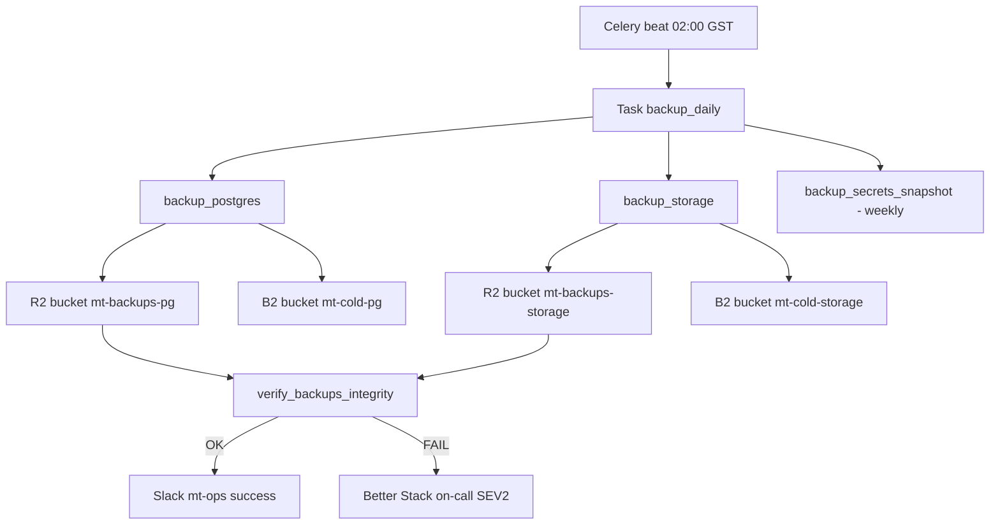
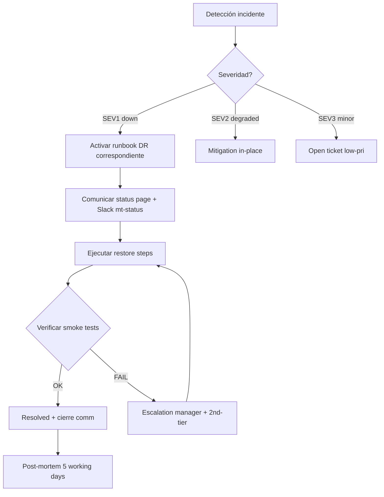

# Diseño de DR + Backups + Runbooks + SLAs — MT Middle East Fase 1

> **Documento operativo.** Diseñado para que un on-call recién despierto (a las 03:00 GST) pueda restaurar el servicio sin pensar. Idioma de trabajo interno: español. SLAs firmados con MT. Cubre Fase 1 (single-server Hetzner, single-tenant, 3 usuarios internos MT).

## Tabla de contenidos

1. [Resumen ejecutivo](#1-resumen-ejecutivo)
2. [Estrategia de Backups](#2-estrategia-de-backups)
3. [RTO / RPO / SLA](#3-rto--rpo--sla)
4. [Disaster Recovery Plan](#4-disaster-recovery-plan)
5. [Runbooks DR (DR-01..DR-06)](#5-runbooks-dr)
6. [Runbooks operativos (RB-01..RB-15)](#6-runbooks-operativos)
7. [SLI / SLO / Error budget](#7-sli--slo--error-budget)
8. [On-call rotation](#8-on-call-rotation)
9. [Incident management process](#9-incident-management-process)
10. [Implementation plan (épicas)](#10-implementation-plan)
11. [TODO / Open questions](#11-todo--open-questions)

---

## 1. Resumen ejecutivo

### Qué se construye aquí

Tres entregables operativos:

1. **Backup + DR**: estrategia 3-2-1 cross-provider (Supabase PITR + R2 + B2), RTO 4h / RPO 1h Fase 1, 6 runbooks DR.
2. **Runbooks operativos**: 15 runbooks "wake-up-proof" para incidentes del día a día (deploy, rollback, queue stuck, FX feed roto, etc.).
3. **SLI / SLO / error budget + on-call + incident management**: marco mínimo viable para no improvisar incidentes.

### Forma de ejecución

- **DR + backups**: épica EP-1A-17 (~13 SP).
- **Runbooks operativos**: épica EP-1A-18 (~8 SP).
- **Incident management + status page**: épica EP-1A-19 (~8 SP).

Total estimado: **~29 SP** (~3 sprints de 1 dev a 50 % capacidad).

### Decisiones firmadas

- ADR-053 (introducida) — estrategia de backup + DR.
- RTO 4h / RPO 1h Fase 1 (single-tenant interno).
- SLA 99.5 % horario GCC laboral; best-effort fuera.
- On-call: Pablo (BR) primario + 1–2 backups MT (TI integración + opcional Gerente Comercial para SEV1 funcional).

---

## 2. Estrategia de Backups

### 2.1 Postgres (Supabase)

| Capa | Mecanismo | Frecuencia | Retención | RPO |
|------|-----------|-----------|-----------|-----|
| L1 | Supabase PITR (plan tier ≥ Pro) | continuo | 7 días | < 5 min |
| L2 | `pg_dump --format=custom` cifrado age → R2 | diario 02:00 GST | 7 daily + 4 weekly + 12 monthly + **7 yearly** | 24 h |
| L3 | Réplica del dump a B2 cold (Glacier-class) | diario | igual L2 | 24 h |

**Schedule**: task Celery `backup_postgres_daily` registrada en `job_definitions` (ADR-046, editable por Gerente sin redeploy).

**Cifrado at-rest**:
- Algoritmo: **age** (Adam Langley's `age`, asymmetric).
- Key rotada anualmente.
- Custodia dual: copia BR (Pablo, vault 1Password) + copia MT (TI Integración, vault separado).
- Sin la llave → backups inrecuperables (esto es deliberado, no bug).

**Validation**:
- Task `backup_verify_weekly` cada domingo 04:00 GST.
- Crea instancia Postgres staging temporal (Docker container Hetzner), restaura último daily, ejecuta:
  ```sql
  SELECT count(*) FROM products;
  SELECT count(*) FROM prices WHERE state = 'approved';
  SELECT max(created_at) FROM audit_events;
  ```
- Compara con primario (delta esperado < 24 h). Si delta > 25 h → SEV2 alert.

**Yearly snapshot inmutable** (VAT UAE 2026, retención 5 años):
- R2 Object Lock = WORM (write-once-read-many).
- 1 enero cada año, snapshot 31-dic se "promueve" a yearly inmutable.

### 2.2 Supabase Storage

| Bucket | Backup | Retención |
|--------|--------|-----------|
| `master/` (imágenes producto críticas) | diario → R2 + B2 | 30 días + diff snapshots semanales 12 meses |
| `product-datasheets/` | diario → R2 + B2 | 30 días + diff snapshots semanales 12 meses |
| `import-batches/` | NO backup | regenerable |
| `exports/` | NO backup | regenerable |
| `thumbnails/` | NO backup | regenerable |

Task `backup_storage_daily` 02:30 GST. Usa `aws s3 sync --storage-class GLACIER_IR` para B2.

### 2.3 Redis

**No backup formal.** Justificación:
- Cache + queue, no source of truth.
- `job_definitions` (ADR-046) vive en Postgres → cubierto.
- Tasks Celery idempotentes con retry exponencial (ADR-030) → pérdida en restart aceptable.

Si se perdiese todo Redis: queue se reconstruye, FX cache se rehidrata desde feed externo (5 min), embeddings cache se reconstruye on-demand.

### 2.4 Application config

- IaC en Git (`docker-compose.prod.yml`, `Caddyfile`, migrations) → re-create infra en < 30 min.
- Doppler snapshot semanal read-only cifrado SOPS + age → rama privada `secrets-snapshot/` (offline fallback).
- Tag git `infra-stable-YYYYMMDD` cada cierre de sprint.

### 2.5 Backup orchestration



### 2.6 Coste estimado backup cross-region

Ver tabla en ADR-053. Resumen Fase 1: **~$1–2/mes** + plan Supabase Pro ($25/mes ya incluido).

---

## 3. RTO / RPO / SLA

### 3.1 Fase 1 (firmado)

| Concepto | Target |
|----------|--------|
| **RTO global** | 4 horas |
| **RPO global** | 1 hora |
| **SLA horario laboral GCC (08:00–18:00 GST L–V)** | 99.5 % |
| **SLA fuera de horario** | best-effort |

Justificación: 3 usuarios internos MT, no customer-facing, no 24/7, no marketplaces externos en vivo.

### 3.2 Fase 2-3 (proyectado)

| Concepto | Fase 2 | Fase 3 |
|----------|--------|--------|
| RTO | 2 h | 1 h |
| RPO | 30 min | 15 min |
| SLA | 99.7 % | 99.9 % |
| Modelo | Active-passive replica Postgres | HA + read-replica Redis + multi-region |

---

## 4. Disaster Recovery Plan

### 4.1 Escenarios cubiertos

| ID | Escenario | RTO | RPO |
|----|-----------|-----|-----|
| DR-01 | Servidor Hetzner caído (hardware fail) | 2 h | 1 h |
| DR-02 | Postgres data corruption (bug, mass delete) | 30 min | < 5 min |
| DR-03 | Storage bucket comprometido (ransomware) | 1 h | 24 h |
| DR-04 | Region Hetzner Frankfurt outage | 4 h | 1 h |
| DR-05 | Account compromise | 1 h | 1 h |
| DR-06 | Vendor outage Supabase | dependent on vendor | — |

### 4.2 Flujo DR genérico



### 4.3 DR drill

- **Frecuencia**: anual mínimo (recomendado semestral Fase 1).
- **Duración**: 1 día completo, ejecutado en staging sin afectar prod.
- **Output**:
  - Tiempo medido vs target.
  - Bugs en runbooks (steps faltantes, dependencias, contraseñas obsoletas).
  - Post-mortem mejoras.
- **Próximo drill planificado**: 2026-09-30 (cierre Fase 1b + 4 meses).
- **Owner**: Pablo Sierra (BR), validado por TI MT.

---

## 5. Runbooks DR

> Convención: cada runbook **auto-contained**. Comandos copy-paste. URLs reales (placeholders `[...]` para reemplazar en S0). Idioma 100 % español.

### DR-01 — Servidor Hetzner caído (hardware fail)

**Pre-condiciones / detección**:
- Better Stack uptime: ping `https://app.mtme.ae` falla > 5 min consecutivos.
- Sentry: cero eventos en 5 min (síntoma indirecto).
- SSH a `[hetzner-host]` falla.

**Severidad**: SEV1 si en horario laboral GCC; SEV2 fuera.

**Steps**:

1. Confirmar que NO es problema DNS/Caddy (probar IP directa: `curl -k https://[hetzner-ip]/health/live`).
2. Login Hetzner Cloud Console → ver estado servidor.
3. Si servidor "running" pero unreachable → forzar reboot vía consola (botón "Power"). Esperar 3 min.
4. Si reboot no resuelve → provisionar **servidor alternativo** (script `scripts/provision_dr_server.sh` en repo, target Helsinki si Frankfurt). Esto crea CX22 nuevo con cloud-init.
5. Apuntar DNS Cloudflare `app.mtme.ae` al nuevo IP (TTL 60 s pre-configurado).
6. Restaurar Postgres desde Supabase PITR (no requiere acción — Supabase es independiente).
7. Pull último `docker-compose.prod.yml` del repo (rama `main` o tag `infra-stable-*`).
8. Hidratar secretos: `doppler run -- docker compose -f docker-compose.prod.yml up -d`.
9. Esperar healthchecks: `curl https://app.mtme.ae/health/ready` → `{"status":"ready"}`.
10. Smoke test: login con cuenta test, ver lista de productos, ejecutar 1 búsqueda.

**Decision points**:
- Si Hetzner Cloud Console muestra región completa caída → escalar a DR-04.
- Si hardware reportado dañado → no reboot, ir directo a step 4.

**Communication template** (Slack `#mt-status`):
```
[SEV1] [DR-01] Servidor app.mtme.ae caído desde HH:MM GST.
Causa probable: hardware fail Hetzner.
ETA recuperación: 2h.
Workaround: ninguno por ahora.
Owner: @pablo
Próxima update: en 30 min.
```

**Post-incident**: post-mortem en 5 días hábiles (template §9.2).

---

### DR-02 — Postgres data corruption (bug, mass delete)

**Pre-condiciones / detección**:
- Usuario reporta "faltan productos" / "todos los precios desaparecieron".
- Sentry: spike de errores 5xx con stack `relation does not exist` o `null` inesperado.
- Audit log: detectar DELETE masivo:
  ```sql
  SELECT actor, count(*), min(occurred_at), max(occurred_at)
  FROM audit_events
  WHERE action = 'delete'
    AND occurred_at > now() - interval '1 hour'
  GROUP BY actor ORDER BY count DESC;
  ```

**Severidad**: SEV1.

**Steps**:

1. **CONGELAR escrituras inmediato**: `docker compose stop api worker` (sólo el frontend sigue mostrando lo que haya en cache).
2. Identificar timestamp T0 = momento previo al borrado/corruption (de audit log).
3. Confirmar T0 está dentro de ventana PITR Supabase (7 días).
4. Login Supabase Console → Project → Database → Backups → **Restore to point in time**.
5. Seleccionar T0 menos 1 minuto (margen seguridad).
6. **CRITICAL**: Supabase PITR restaura sobre **el mismo proyecto**. Para evitar pérdida adicional, primero crear **branch** del proyecto (Supabase branching) o snapshot manual.
7. Ejecutar restore en branch.
8. Validar branch: `psql [branch-conn-string] -c 'SELECT count(*) FROM products;'` debe coincidir con expected pre-incident.
9. Si OK → promote branch a main project (Supabase UI).
10. Reiniciar API + workers: `docker compose start api worker`.
11. Smoke test: 5 lecturas críticas.
12. Comunicar resolved.

**Decision points**:
- Si T0 > 7 días atrás → PITR no cubre, ir a backup L2 (R2 daily) — RPO 24 h, RTO 1 h adicional.
- Si la corruption es lógica subtil (no mass delete sino datos malformados), considerar restore selectivo por tabla en vez de full PITR.

**Communication template** (Slack `#mt-status` + email a Christian/Paula):
```
[SEV1] [DR-02] Detectada corrupción/borrado masivo en Postgres a las HH:MM.
Acción: writes congelados, ejecutando PITR a T0.
ETA: 30 min.
Datos afectados: [breve descripción].
Owner: @pablo
```

**Post-incident**: 5 whys obligatorio. Acción correctiva: feature flag para DELETE masivo (dry-run + confirmación 2-eyes).

---

### DR-03 — Storage bucket comprometido (ransomware / mass delete)

**Pre-condiciones / detección**:
- Reporte "imágenes producto rotas" en UI.
- Sentry: spike de 404 en `/storage/master/*`.
- Supabase audit log Storage: DELETE masivo o cambio de ACL.

**Severidad**: SEV1.

**Steps**:

1. Revocar inmediatamente la **service role key** Supabase Storage (Doppler → rotate).
2. Snapshot del estado actual del bucket (en caso de hash ransomware visible para forense).
3. Identificar timestamp T0 (último estado bueno) desde Supabase audit.
4. Crear bucket nuevo `master-restored-YYYYMMDD`.
5. Restaurar desde R2 backup más reciente (script `scripts/restore_storage.sh`):
   ```bash
   AWS_ACCESS_KEY_ID=$R2_KEY \
   AWS_SECRET_ACCESS_KEY=$R2_SECRET \
   aws s3 sync s3://mt-backups-storage/master/$(date -d 'yesterday' +%Y-%m-%d)/ \
     /tmp/master-restored/ --endpoint-url https://[r2-endpoint]
   ```
6. Subir a Supabase Storage:
   ```bash
   supabase storage upload --project [pid] master-restored-YYYYMMDD /tmp/master-restored/
   ```
7. Switch en código (env var `STORAGE_BUCKET_MASTER=master-restored-YYYYMMDD`) → redeploy.
8. Validar: 10 SKUs random tienen imágenes accesibles.
9. Investigar vector de ataque (account compromise → DR-05 paralelo).

**Decision points**:
- Si compromise > 24 h atrás → backup B2 cold (RPO 24 h, RTO +1 h por restore Glacier).

**Communication template**:
```
[SEV1] [DR-03] Storage master comprometido a las HH:MM.
Acción: bucket aislado, restaurando desde R2 backup.
Imágenes producto temporalmente no disponibles.
ETA: 1 h.
Owner: @pablo
```

---

### DR-04 — Region Hetzner Frankfurt outage

**Pre-condiciones / detección**:
- Hetzner status page reporta region down.
- Multiple Hetzner customers reportan outage en Twitter / r/Hetzner.

**Severidad**: SEV1.

**Steps**:

1. Confirmar outage en `https://status.hetzner.com`.
2. Provisionar servidor en **Helsinki** (HEL1):
   ```bash
   bash scripts/provision_dr_server.sh --region hel1 --type cx22
   ```
3. Esperar provisión (~3 min).
4. Postgres está en Supabase (multi-region en plan Pro+) → no requiere acción si Supabase región alternativa configurada. Si single-region Supabase y región caída → escalar a Supabase support paralelo.
5. Pull último `docker-compose.prod.yml`.
6. Restore Storage desde R2 (igual que DR-03 step 5–7).
7. DNS Cloudflare → IP nuevo Helsinki (TTL 60 s).
8. Smoke test full.
9. Comunicar.

**Decision points**:
- Si Supabase también afectado → escalar DR-06 paralelo.
- Si outage > 6 h confirmado → considerar comunicar a Christian sobre día de inactividad parcial.

---

### DR-05 — Account compromise (Hetzner / Supabase / Doppler)

**Pre-condiciones / detección**:
- Better Stack: alerta de login geo-anómalo.
- Hetzner / Supabase email "new device login".
- Comportamiento sospechoso: tasks no programadas, secrets cambiados sin PR.

**Severidad**: SEV1.

**Steps**:

1. **NO entrar en pánico, NO borrar**: capturar evidencia primero (screenshots dashboards, audit logs).
2. **Rotar TODOS los secrets**:
   - Supabase: regenerar service role key, anon key (UI Supabase → API → Reset).
   - Hetzner: rotar API token + cambiar password + enable MFA si no estaba.
   - Doppler: rotar service token.
   - Cloudflare: rotar API token.
   - GitHub: revocar PATs, rotar deploy keys.
3. **Force logout all users**:
   ```sql
   UPDATE auth.users SET raw_app_meta_data = raw_app_meta_data || '{"force_logout_at":"NOW"}';
   -- backend valida este flag y rechaza JWT más antiguos
   ```
4. Revisar audit_events últimas 72 h por actores no esperados.
5. Comparar último backup limpio (verify_backups_integrity passing) — si comprometido, restore desde backup pre-incident.
6. Smoke test full.
7. Forense: capturar logs Sentry + Better Stack para incident report.

**Communication template** (email Christian/Paula + Slack `#mt-status`):
```
[SEV1] [DR-05] Posible account compromise detectado a las HH:MM.
Acción: secrets rotados, force-logout all, restore desde backup limpio.
Datos potencialmente expuestos: [lista o "investigando"].
ETA recuperación: 1h.
Compliance: notificar UAE PDPL si confirmamos exfiltration.
Owner: @pablo + TI MT
```

**Post-incident**: notificación PDPL UAE 72 h si hay exfiltración confirmada de datos personales.

---

### DR-06 — Vendor outage Supabase

**Pre-condiciones / detección**:
- Supabase status page reporta outage.
- API FastAPI: errores `connection refused` masivos en logs.

**Severidad**: SEV1 si > 30 min.

**Steps**:

1. Confirmar outage en `https://status.supabase.com`.
2. **NO intentar failover prematuro**. Supabase típicamente recupera en < 1 h.
3. Activar **degraded mode**:
   - Frontend muestra banner "Lectura sólo, escrituras temporalmente deshabilitadas".
   - Feature flag `READ_ONLY_MODE=true` (evita errores de escritura confusos).
4. Comunicar a usuarios MT (Slack + email).
5. Si outage > 4 h:
   - Restore Postgres desde último backup R2 → Postgres self-hosted Hetzner temporal.
   - Switch connection string → redeploy.
   - Aceptar pérdida = RPO 24 h.
6. Cuando Supabase recupere → re-sync delta (audit log + manual reconciliation).

**Decision points**:
- Si Supabase outage anunciado > 8 h → activar plan failover self-hosted (step 5).

**Communication template**:
```
[SEV2] [DR-06] Supabase outage upstream desde HH:MM.
Status: https://status.supabase.com
App en modo lectura. Escrituras pausadas.
ETA: dependiente de Supabase.
Owner: @pablo (monitorizando)
```

---

## 6. Runbooks operativos

> Mismo formato auto-contained. Resumido por brevedad — versión expandida en wiki interna BR.

### RB-01 — Deploy a producción (CI/CD path normal)

**Trigger**: PR aprobado en `main`. CI verde.
**Pre-conditions**: tests pass, lint pass, migrations review aprobado.
**Steps**:
1. GitHub Actions workflow `deploy-prod.yml` se dispara automático en merge.
2. Build imagen Docker → push a GHCR.
3. SSH a Hetzner: `ssh deploy@app.mtme.ae`.
4. `cd /opt/mt && git pull && docker compose pull && docker compose up -d --no-deps api worker`.
5. Esperar healthcheck verde.
6. Smoke test post-deploy: `curl https://app.mtme.ae/health/ready`.
7. Notificar Slack `#mt-ops`: "Deploy [sha7] OK".
**Verification**: Sentry sin spike errores 5 min post-deploy.
**Rollback**: ver RB-02.

### RB-02 — Rollback de deploy fallido

**Trigger**: Sentry spike errores post-deploy / smoke test falla.
**Steps**:
1. SSH Hetzner.
2. Identificar SHA previo: `docker images ghcr.io/br/mt-api --format '{{.Tag}} {{.CreatedAt}}' | head -5`.
3. `MT_API_SHA=[sha-anterior] docker compose up -d --no-deps api worker`.
4. Esperar healthcheck verde.
5. Si rollback incluye reversión de migration: `alembic downgrade -1` (sólo si migration es reversible — verificar antes).
6. Notificar Slack: "Rolled back to [sha-prev]".
**Verification**: error rate vuelve a baseline.
**Rollback del rollback**: re-aplicar SHA original cuando fix esté listo.

### RB-03 — Database migration aplicada manualmente

**Trigger**: migration nueva en PR, requiere ventana de mantenimiento o lock largo.
**Pre-conditions**: backup pre-migration (`pg_dump` adicional just-in-case).
**Steps**:
1. Anunciar ventana en Slack `#mt-status` 30 min antes.
2. Activar `READ_ONLY_MODE=true`.
3. SSH Hetzner.
4. `docker compose exec api alembic upgrade head`.
5. Validar: `docker compose exec api alembic current` → muestra revision esperada.
6. Spot-check tabla afectada (count + 5 rows random).
7. Desactivar `READ_ONLY_MODE`.
8. Smoke test.
**Verification**: queries afectadas devuelven datos esperados.
**Rollback**: `alembic downgrade -1` (sólo si reversible). Si no reversible → restore PITR (DR-02).

### RB-04 — User locked out (reset password / unlock)

**Trigger**: usuario MT reporta no poder loguear.
**Steps**:
1. Verificar identidad (email corporativo + Slack).
2. Login Supabase Console → Auth → Users → buscar email.
3. Si "lockout" por failed attempts → click "Unlock".
4. Si forgot password → click "Send password reset".
5. Audit: registrar acción en ticket (no es PII sensible pero queda trazabilidad).
**Verification**: usuario confirma login OK.

### RB-05 — Reset MFA de usuario

**Trigger**: usuario perdió device MFA.
**Steps**:
1. Verificar identidad **fuera de banda** (videollamada + DNI o equivalente). NO sólo email — riesgo phishing.
2. Supabase Console → Auth → Users → usuario → "Disable MFA".
3. Forzar al usuario a re-enrolar MFA en próximo login (flag `require_mfa_enrollment=true` en user metadata).
4. Audit-log evento como `mfa_reset_admin` con justificación.
**Verification**: usuario completa enrolment + login OK.

### RB-06 — Worker Celery atascado

**Trigger**: queue size > 1000 sin descender (alerta Better Stack).
**Steps**:
1. SSH Hetzner.
2. `docker compose exec worker celery -A app.worker inspect active` → ver tasks corriendo.
3. Si una task hace > 30 min → identificar task_id.
4. Revoke + kill: `docker compose exec worker celery -A app.worker control revoke [task_id] --terminate --signal=SIGKILL`.
5. Si worker entero zombie: `docker compose restart worker`.
6. Verificar queue desciende: `redis-cli LLEN celery`.
**Verification**: queue size baseline (< 100) en 5 min.
**Rollback**: si la task era importante (ej. import batch grande), re-encolar manualmente.

### RB-07 — Queue Redis sobrecargada

**Trigger**: queue_size > 5000 sostenido > 10 min.
**Steps**:
1. Identificar fuente: `redis-cli LRANGE celery 0 5` → ver task names.
2. Si fuente es importer: pausar `celery beat` task scheduler temporal (`UPDATE job_definitions SET enabled=false WHERE code='import_*'`).
3. Scale workers: editar `docker-compose.prod.yml` → `worker: deploy: replicas: 4` → `docker compose up -d worker`.
4. Esperar drain.
5. Re-habilitar tasks paused.
**Verification**: queue baseline < 100.

### RB-08 — Importer batch huérfano (pending forever)

**Trigger**: import batch en estado `processing` > 2 h.
**Steps**:
1. Identificar batch: `SELECT id, started_at FROM import_batches WHERE state='processing' AND started_at < now() - interval '2 hours';`.
2. Verificar no hay worker activo procesándolo (RB-06 step 2).
3. Force-fail:
   ```sql
   UPDATE import_batches SET state='failed', error_msg='timeout — force-failed by ops', failed_at=now()
   WHERE id='[batch-id]';
   ```
4. Notificar usuario que subió el batch.
5. Investigar logs: `docker compose logs worker | grep [batch-id]`.
**Verification**: batch en estado `failed`, workers libres.

### RB-09 — Comparador costoso (LLM bursts)

**Trigger**: alerta coste OpenAI / Anthropic > $50/día.
**Steps**:
1. Activar throttle: `UPDATE feature_flags SET value='5' WHERE key='comparator.max_concurrent_llm_calls';` (default 20).
2. Activar circuit breaker si coste > $100/día: feature flag `comparator.enabled=false`.
3. Investigar fuente: query a `match_decisions` agrupado por user_id + hora.
4. Notificar Gerente Comercial si abuso confirmado.
**Verification**: coste estimado próximas 24 h vuelve a baseline.
**Rollback**: re-habilitar gradualmente (10 → 15 → 20 concurrent).

### RB-10 — FX feed roto

**Trigger**: alerta `fx_rate_age_hours > 25`.
**Steps**:
1. Verificar feed origen (ECB / OpenExchangeRates) accesible: `curl https://[fx-feed-url]`.
2. Si feed roto → fallback manual:
   ```sql
   INSERT INTO fx_rates (currency_pair, rate, valid_from, source, manual_override)
   VALUES ('USD_AED', 3.6725, now(), 'manual_central_bank_uae', true);
   ```
3. Notificar Christian que se está usando fallback manual (riesgo audit).
4. Crear ticket reparación feed.
**Verification**: tasks que dependen de FX no fallan.

### RB-11 — Sentry alert error rate spike

**Trigger**: error rate > 5x baseline 10 min.
**Steps**:
1. Identificar top error en Sentry → click issue.
2. Ver release asociado → si correlaciona con deploy reciente → RB-02 rollback.
3. Si no correlaciona con deploy → identificar feature/route afectado.
4. Activar feature flag off para ruta crítica:
   ```sql
   UPDATE feature_flags SET value='false' WHERE key='[feature-key]';
   ```
5. Comunicar Slack.
6. Investigar root cause + fix forward.
**Verification**: error rate vuelve a baseline.

### RB-12 — Disk full Hetzner

**Trigger**: alerta `disk_usage_percent > 85`.
**Steps**:
1. SSH Hetzner.
2. `df -h` → identificar mount lleno.
3. Cleanup quick wins:
   ```bash
   docker system prune -af --volumes
   journalctl --vacuum-time=7d
   rm -rf /var/log/*.gz
   ```
4. Si `/var/lib/docker` el grueso → revisar `docker volume ls` y eliminar volúmenes huérfanos.
5. Si > 95 % → SEV1, expandir disco vía Hetzner Cloud Console (resize volume).
6. Si imposible expandir > 24 h → escalar a infra change.
**Verification**: usage < 70 %.

### RB-13 — Postgres slow query

**Trigger**: alerta `db_query_duration_ms p95 > 200 ms`.
**Steps**:
1. Supabase Console → Database → Query Performance → top slowest.
2. Copiar query + run `EXPLAIN (ANALYZE, BUFFERS) [query]`.
3. Identificar Seq Scan inesperado o falta de índice.
4. Crear índice ad-hoc:
   ```sql
   CREATE INDEX CONCURRENTLY idx_[table]_[col] ON [table] ([col]) WHERE [pred];
   ```
5. Validar query mejora.
6. Add migration en Alembic para hacer permanente.
**Verification**: p95 vuelve baseline.

### RB-14 — Auditoría detecta drift schema

**Trigger**: weekly check `pg_dump --schema-only` actual vs Alembic head difiere.
**Steps**:
1. Identificar diff: `git diff schema-snapshot.sql`.
2. Si diff = índice ad-hoc no commiteado (RB-13) → crear migration retroactiva.
3. Si diff = columna añadida manualmente fuera de migration → SEV2, identificar autor en audit_events DDL.
4. Reconciliar: `alembic revision --autogenerate -m "reconcile drift YYYYMMDD"` + review + apply.
**Verification**: `alembic check` clean.

### RB-15 — New env setup (dev → staging → prod)

**Trigger**: necesidad de levantar entorno nuevo (DR drill, branch staging, etc).
**Steps**:
1. Provisionar Hetzner cx22.
2. Cloud-init script (en repo `infra/cloud-init.yaml`) instala Docker + Caddy + agente Better Stack.
3. Crear proyecto Supabase nuevo (o branch).
4. Copiar Doppler config: `doppler config clone -p mt -c prd -d [new-env]`.
5. Aplicar migrations: `alembic upgrade head`.
6. Seed data si dev/staging: `python scripts/seed_dev.py`.
7. Smoke test full.
**Verification**: healthcheck verde, login test OK.

---

## 7. SLI / SLO / Error budget

### 7.1 Cinco SLIs principales (user-perceivable)

| SLI | Definición | Medición |
|-----|------------|----------|
| **SLI-1 Disponibilidad API** | % de requests HTTP a `/api/*` con status 2xx/3xx | Better Stack uptime + métricas Prometheus |
| **SLI-2 Latencia API p95** | latencia p95 endpoints críticos (login, lista productos, save price) | Histograma `http_request_duration_ms` |
| **SLI-3 Recálculo masivo** | duración recálculo masivo pricing | Métrica `price_recompute_duration_ms` |
| **SLI-4 Approval latency** | tiempo desde `pending_review` a `approved` (p95) | Métrica `approval_latency_hours` |
| **SLI-5 Backup integrity** | % backups verificados OK / backups intentados | Task `verify_backups_integrity` weekly |

### 7.2 SLOs (target numérico)

| SLI | SLO | Ventana |
|-----|-----|---------|
| SLI-1 Disponibilidad | **99.5 %** | mensual horario laboral GCC |
| SLI-2 Latencia API p95 | **< 500 ms** | mensual |
| SLI-3 Recálculo | **p95 < 60 s** | por ejecución |
| SLI-4 Approval latency | **p95 < 24 h** | mensual |
| SLI-5 Backup integrity | **100 %** weekly | mensual (4 verifies/mes) |

### 7.3 Error budget

| SLI | Budget mensual |
|-----|----------------|
| SLI-1 (99.5 % horario laboral GCC ≈ 200 h/mes) | **1 h downtime/mes** |
| SLI-2 (5 % requests > 500 ms permitido) | ~5 % requests |
| SLI-3 (p95 < 60 s) | ≤ 5 % ejecuciones > 60 s |
| SLI-4 (p95 < 24 h) | ≤ 5 % aprobaciones > 24 h |
| SLI-5 | 0 — cero tolerancia backup integrity |

### 7.4 Política error budget

- **50 % budget consumido mid-month** → freeze de features no críticas. Sólo bug fixes y stability work.
- **100 % budget consumido** → SEV1 retrospectiva con Christian. Sprint siguiente focused 100 % en stability.
- **3 meses consecutivos OK** → considerar subir SLO (ej. 99.5 % → 99.7 %).

---

## 8. On-call rotation

### 8.1 Rotación

| Rol | Persona | Disponibilidad |
|-----|---------|----------------|
| Primary on-call | Pablo Sierra (BR) | Horario laboral GCC L–V |
| Secondary on-call | TI MT (Integración) | Horario laboral GCC, backup primary |
| Tertiary / Escalation manager | Christian (sponsor MT) | SEV1 only |
| Domain expert (opcional, SEV1 funcional) | Gerente Comercial (Paula) | Decisiones de negocio en incident |

**Fase 1**: business hours GCC, **no 24/7**. Fuera de horario = best-effort, sin SLA.

### 8.2 Tools

- **Better Stack On-call** (recomendado, mismo proveedor que observability ya en ADR-019).
- Alternativa: PagerDuty free tier (5 usuarios).
- Channel Slack: `#mt-oncall` (privado on-call rotation), `#mt-status` (público interno MT), `#mt-ops` (logs operativos).

### 8.3 Escalation

```
Alert → Primary (5 min ack window) →
        ↓ no ack
        Secondary (10 min ack window) →
        ↓ no ack
        Escalation manager (Christian)
```

### 8.4 Severity levels

| Sev | Definición | Response time | Comm |
|-----|------------|---------------|------|
| **SEV1** | Sistema down / pérdida datos / regla dura ADR-010 violada / compliance breach | **5 min ack**, 1 h status update cadence | Slack + email + status page |
| **SEV2** | Funcionalidad crítica degraded (importer roto, comparador down, FX feed roto > 24 h) | 30 min ack, 4 h cadence | Slack + status page |
| **SEV3** | Bug menor, no bloqueante | next business day | ticket |

---

## 9. Incident management process

### 9.1 Lifecycle

```
1. DETECT      → Sentry / Better Stack alert / user report
2. TRIAGE      → assign sev, page on-call
3. MITIGATE    → ejecutar runbook, restore service
4. COMMUNICATE → status page + Slack mt-status + email stakeholders (SEV1/2)
5. RESOLVE     → confirmar smoke tests, cerrar incidente
6. POST-MORTEM → 5 working days, blameless
```

### 9.2 Post-mortem template

```markdown
# Post-mortem [INC-YYYY-NNN] — [Título]

**Fecha incidente**: YYYY-MM-DD HH:MM GST
**Duración**: HH:MM
**Severidad**: SEV1/2/3
**Owner**: @pablo
**Status**: open / closed

## Resumen ejecutivo (3 líneas)
[Qué pasó, impacto, qué hicimos.]

## Timeline
| Hora GST | Evento |
|----------|--------|
| HH:MM | Detección [fuente] |
| HH:MM | Triage SEV[X] |
| HH:MM | Acción 1 |
| HH:MM | Acción 2 |
| HH:MM | Resolved |

## Impact
- Usuarios afectados: [N / 3]
- Duración degraded: HH:MM
- Datos perdidos: [sí/no, descripción]
- Revenue impacto: N/A Fase 1

## Root cause (5 whys)
- ¿Por qué falló X? Porque Y.
- ¿Por qué Y? Porque Z.
- ... (mínimo 5 niveles)

## Acciones correctivas
| ID | Acción | Owner | Due date |
|----|--------|-------|----------|
| AC-1 | ... | @persona | YYYY-MM-DD |
| AC-2 | ... | @persona | YYYY-MM-DD |

## Lessons learned
- ...

## Blameless statement
Este post-mortem es blameless. El objetivo es entender qué falló en el sistema, no culpar a personas. Las decisiones se tomaron con la información disponible en el momento.
```

### 9.3 Status page

- **Better Stack Status** (alineado con observability stack ADR-019).
- URL: `status.mtme.ae` (subdomain Cloudflare).
- Componentes monitorizados:
  - Backend API
  - Frontend
  - Job queue (Celery + Redis)
  - Comparador (LLM service)
  - Importer
- Subscriber notifications: usuarios MT optan in (email).
- **Audiencia Fase 1**: interno MT (3 usuarios). **Pública Fase 3+** cuando haya marketplaces externos.

---

## 10. Implementation plan

### Épicas

#### EP-1A-17 — DR + Backups (~13 SP)

| Story | SP | Descripción |
|-------|----|-----|
| DR-17.1 | 2 | Provisioning R2 + B2 buckets + IAM policies |
| DR-17.2 | 3 | Task `backup_postgres_daily` con cifrado age + R2 + B2 |
| DR-17.3 | 2 | Task `backup_storage_daily` (master + datasheets) |
| DR-17.4 | 2 | Task `verify_backups_integrity` weekly + restore test staging |
| DR-17.5 | 2 | DR scripts: `provision_dr_server.sh`, `restore_storage.sh` |
| DR-17.6 | 1 | Yearly snapshot inmutable R2 Object Lock |
| DR-17.7 | 1 | Doppler SOPS snapshot semanal |

#### EP-1A-18 — Runbooks operativos (~8 SP)

| Story | SP | Descripción |
|-------|----|-----|
| RB-18.1 | 2 | RB-01..RB-05 (deploy + auth) |
| RB-18.2 | 2 | RB-06..RB-09 (workers + comparador) |
| RB-18.3 | 2 | RB-10..RB-13 (FX, errores, disk, slow query) |
| RB-18.4 | 2 | RB-14..RB-15 (drift schema, new env setup) |

#### EP-1A-19 — Incident management + status page (~8 SP)

| Story | SP | Descripción |
|-------|----|-----|
| IM-19.1 | 2 | Better Stack on-call + escalation policy |
| IM-19.2 | 2 | Status page Better Stack + componentes |
| IM-19.3 | 2 | Post-mortem template + blameless culture docs |
| IM-19.4 | 2 | Primer DR drill (anual) — planificación + ejecución |

**Total**: 29 SP.

---

## 11. TODO / Open questions

1. **Plan tier Supabase**: ¿plan Pro ($25/mes) cubre PITR 7 días o requiere plan Team? Verificar en pricing actualizado a 2026-05-06 — afecta directamente a si el RPO 1 h es real o aspiracional.
2. **Custodia llave age**: definir proceso operativo concreto para custodia dual BR + MT de la llave privada `age`. ¿Vault físico? ¿Shamir secret sharing 2-de-3? ¿Quién la usa en un DR a las 03:00 GST si Pablo está incomunicado? Sin proceso firmado, los backups cifrados son riesgo en sí mismos.
3. **Status page público vs interno Fase 1**: el documento dice "interno MT Fase 1, pública Fase 3+", pero TI MT puede preferir mantenerla pública desde día 1 para profesionalizar la comunicación con stakeholders externos (auditoría VAT, partners). Confirmar con Christian.
