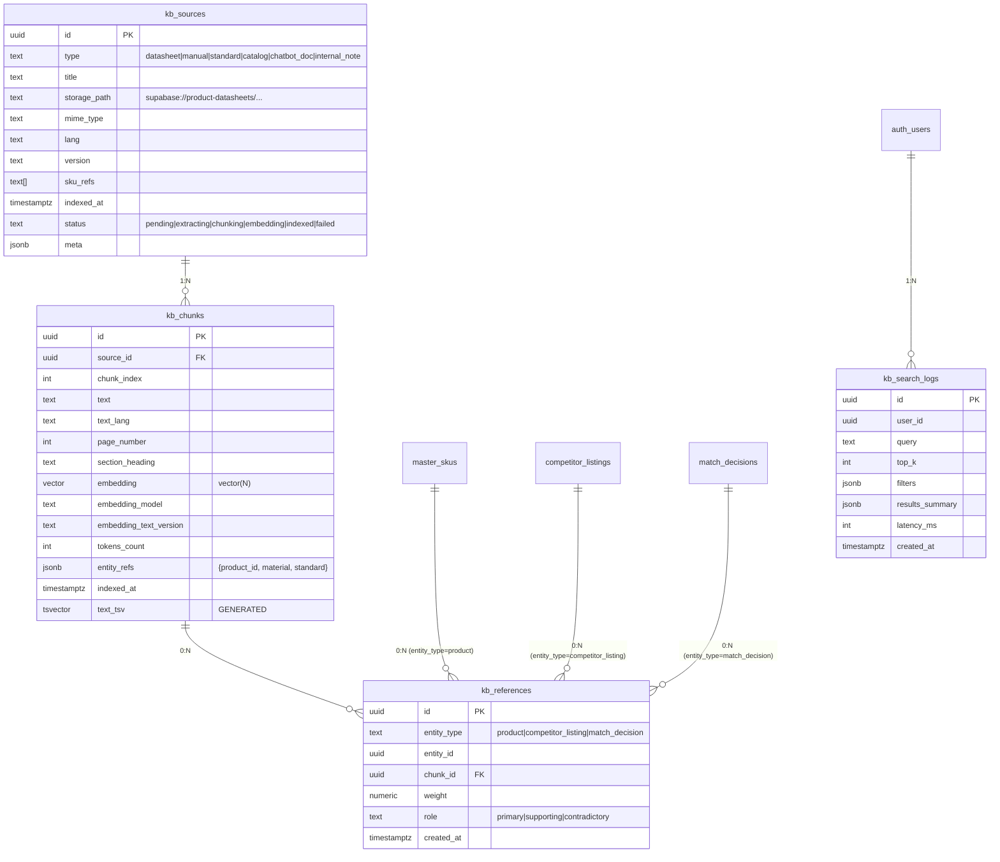
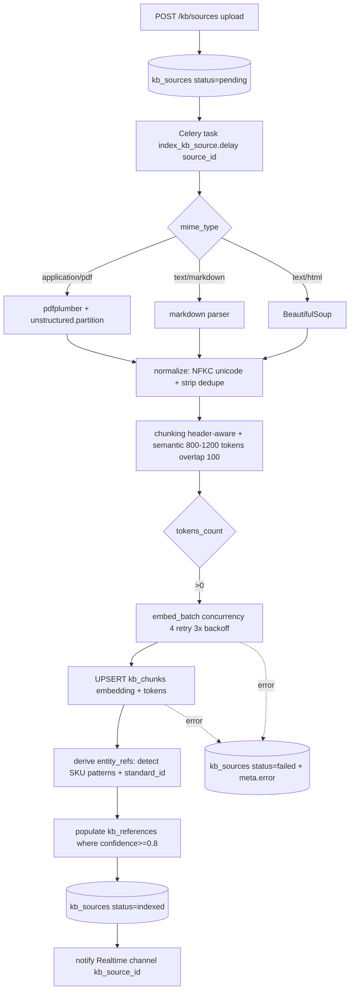
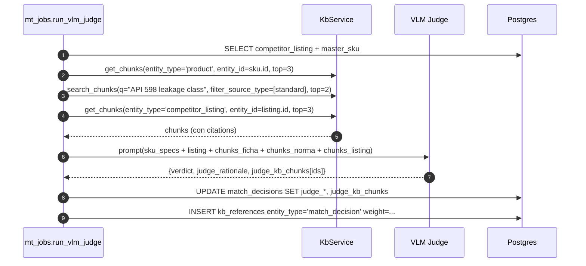

# Módulo de Gestión de Conocimiento (KB) para MT Middle East

> **Objetivo.** Diseñar el módulo de Knowledge Base (KB) de MT Pricing/MDM Fase 1 reusando los patrones probados en `hppt-iom`, alineándolo con el roadmap RAG → Hybrid → GraphRAG del comparador (ADRs 038-041) y dejando hooks listos para el chatbot Fase 2.5+ y el LLM judge audit-grade (ADR-024).
>
> **Lectura previa recomendada.** §17 de `architecture-mt-pricing-mdm-phase1.md` (sistema de comparación), `research-spike-product-comparison.md` (decisiones VLM/RAG), `reuse-from-hppt-iom.md` (catálogo general de patrones).

---

## 1. Resumen ejecutivo

### 1.1 Hallazgo central sobre hppt-iom

Hppt-iom **no tiene un KB unificado y completo**. Lo que existe es:

1. **pgvector aplicado a tablas operacionales** (`email_messages.embedding vector(768)`, índice IVFFlat coseno) generado vía `text-embedding-004` (Gemini, 768 dims).
2. **Una tabla `advisor_kb_refs`** (con `embedding vector(768)` + índice HNSW si la versión de pgvector lo permite) — KB **curado por humanos** (texto markdown, no PDFs ni chunking automático).
3. **RPC `advisor_kb_search(query_embedding, match_count, advisor_kind_filter)`** que hace búsqueda semántica sobre `advisor_kb_refs` con fallback léxico naive si el embedding no está disponible.
4. **Servicio `embeddings.py`** (Gemini Matryoshka 768 desde 3072 nativo, single + batch async con semáforo, llm-logging integrado).
5. **Worker AdvisorRunner** + `tools.py` (sql/cypher/vector_search/kb_search) que el LLM advisor puede invocar — pero la "ingesta" del KB es manual (admin pega markdown desde la UI).
6. **Capa Neo4j (`app/services/graph/`)** — driver async opcional, ontología de Procurement (Customer, Supplier, Case, RFQ, Item, Product, SalesQuote, Order, Shipment, EmailEvent), `sync.py` con bootstrap idempotente Postgres → Neo4j, taxonomía de productos. El graph layer **existe y está cableado** pero no está integrado con KB documental aún.
7. **Sin pipeline PDF → chunks → embedding** versionado. No hay `kb_sources` ni `kb_chunks` ni Celery task de ingestion de documentos. El plan `chat-docs/2026-04-28-plan-pgvector-paso-a-paso.md` documenta la decisión y los pasos pero el alcance está en master data, no en documentos.

**Veredicto:** "sí parcial — embeddings de tablas operacionales + KB curado por humanos + grafo Neo4j cableado, sin pipeline de ingesta documental ni chunking de PDFs".

### 1.2 Implicación para MT

MT tiene **fichas técnicas PDF reales** (MTFT, MTCE, MTMAN), un catálogo de 18 MB y estándares industriales — el KB documental que hppt-iom no necesitaba. Por lo tanto:

- **Reuso 1:1**: schema `embedding vector(768)` + índice HNSW/IVFFlat coseno + servicio `embeddings.py` + RPC pgvector + AgentRunner + advisor_kb_search pattern + tools.py con guardrails SQL.
- **Diseño nuevo (sin precedente en hppt)**: `kb_sources` + `kb_chunks` + pipeline Celery `index_kb_source` (PDF → texto → secciones → chunking → embeddings batch → upsert).
- **Evolución del grafo**: aprovechar ontología hppt como punto de partida pero modelar PVF (válvulas/conexiones) — nodos Product, MaterialFamily, Standard, DatasheetSection — en Fase 2.5/3 cuando se active GraphRAG.

### 1.3 Top 3 casos de uso Fase 1 más impactantes para MT

1. **CU-KB-03 Spec extraction asistida desde fichas PDF** — extrae DN/PN/material/family de los 37,5 % SKUs sin specs estructuradas. ROI directo: reduce ~30-50 SP de data entry manual + bloqueo del comparador para esos SKUs.
2. **CU-KB-02 Búsqueda semántica de SKUs en UI Comercial** — "válvula compuerta DN50 latón" devuelve top-K SKUs candidatos con citaciones de la ficha técnica que justifica el match.
3. **CU-KB-04 Búsqueda en estándares industriales** — Comercial pregunta "¿qué normativa aplica a válvula bola DN25?" y obtiene chunks de API 598/ISO 7-1/UNE-EN 1074-3 con páginas exactas. Acelera respuestas a clientes técnicos en GCC.

---

## 2. Hallazgos del módulo KB hppt-iom (Tasks 1-6 condensadas)

### 2.1 Mapa de archivos relevantes

| Path absoluto | Propósito |
|---|---|
| `c:/BR-Github/br-hppt/br-hppt-iom-review_1/Hppt-dashboard/hppt-iom-backend/app/services/embeddings.py` | Wrapper Gemini `gemini-embedding-001` Matryoshka 768 dims. `embed_text()` single, `embed_batch()` con `asyncio.Semaphore(4)`, log a `llm_logs`, truncado a 4000 chars. |
| `hppt-iom-backend/app/services/advisors/tools.py` | Tools del LLM advisor: `sql_query` (read-only con `assert_read_only_sql`), `graph_query` (Cypher con forbid-list), `vector_search` (sources `emails` o `kb`), `kb_search` (semántico vía `advisor_kb_search` RPC + fallback léxico). |
| `hppt-iom-backend/app/services/advisors/runner.py` | `AdvisorRunner` orquesta runs: load rules → execute SQL → group hits by scope → context_builder (graph) → LLM call → persist warnings/recs con anti-hallucination guard (Pydantic enforces `evidence_refs` not empty). |
| `hppt-iom-backend/app/services/advisors/chat.py` | Chat handler con conversación persistida en `advisor_chat_sessions.messages` JSONB, history budget 8000 chars / 20 turns, inyecta active warnings/recs como contexto, parsea respuesta JSON con `parse_gemini_json`. |
| `hppt-iom-backend/app/services/ai_agents/_runtime.py` | `AgentRunner` (lifecycle ai_agent_jobs + cost cap + circuit breaker), `query_vectors()` / `query_vectors_by_embedding()` que llaman `match_email_messages` RPC, `record_ai_decision` two-phase HITL. |
| `hppt-iom-backend/app/services/graph/client.py` | Driver Neo4j async singleton; non-blocking si NEO4J_PASSWORD vacío. |
| `hppt-iom-backend/app/services/graph/ontology.py` | `seed_ontology` (uniqueness constraints + lookup indexes). 11 nodos: Customer, Supplier, Case, RFQ, RFQItem, Product, SalesQuote, QuoteLine, SalesOrder, OrderLine, Shipment, EmailEvent. |
| `hppt-iom-backend/app/services/graph/sync.py` | Bootstrap idempotente Postgres → Neo4j (MERGE + relaciones `RAISED`, `CONTAINS`, `OFFERED_BY`, `SHIPPED_TO`). Ejecutado al startup. |
| `hppt-iom-backend/app/services/ai_agents/products/spec_extractor.py` | A.1 spec extractor: lee `master_products.tech_attributes`, busca `attribute_definitions` por familia, llama Gemini Flash Lite, merge con threshold 0.7 (accept), 0.4 (suggest). Patrón directamente reusable para CU-KB-03 de MT. |
| `hppt-iom-backend/app/services/ai_agents/products/family_classifier.py` | A.2 family classifier — clasifica SKUs en familias predefinidas. |
| `hppt-iom-frontend/supabase/migrations/20260501150000_email_messages_embedding_pgvector.sql` | DDL `embedding vector(768)` + índice IVFFlat lists=10 (escala a 100+ a 5K-10K rows). |
| `hppt-iom-frontend/supabase/migrations/20260501170000_advisor_module.sql` | DDL `advisor_rules`, `advisor_warnings`, `advisor_recommendations`, `advisor_kb_refs` (vector(768) + HNSW con fallback IVFFlat), `advisor_chat_sessions`. RLS estricto, system_settings seed, evidence_refs constraint not empty. |
| `hppt-iom-frontend/supabase/migrations/20260501170100_advisor_rpcs.sql` | RPC `advisor_select(q text, max_rows int)` SECURITY INVOKER con guard DML + statement_timeout 20s; RPC `advisor_kb_search(query_embedding vector(768), match_count int, advisor_kind_filter text)`. |
| `hppt-iom-frontend/src/components/admin/knowledge-manager/AdvisorKbRefsPanel.tsx` | UI para gestión manual de KB refs (CRUD, no upload de archivos). |
| `hppt-iom-frontend/src/components/advisors/AdvisorPage.tsx` | UI del advisor: chat + warnings + recommendations + drill-down `EvidenceRef[]` con kinds `sql` / `graph` / `vector` / `kb`. |
| `scripts/sprint1a_backfill_email_embeddings.py` | One-shot backfill 422 emails. Concurrency configurable, page-size, dry-run, lee `.env` directo. Patrón directo para `mt-backfill-kb-embeddings`. |
| `scripts/sprint2d_backfill_master_products_embeddings.py` | Backfill embeddings de productos. |
| `chat-docs/2026-04-28-plan-pgvector-paso-a-paso.md` | Plan de activación pgvector con decisiones (modelo, dim, sync vs async, índice HNSW post-backfill, columna `embedding_pending` para cola async, columna `embedding_text_version` para versionado). |

### 2.2 Modelo de datos KB existente en hppt-iom

```sql
-- Embeddings sobre tabla operacional
ALTER TABLE public.email_messages
    ADD COLUMN embedding vector(768);
CREATE INDEX idx_email_messages_embedding_cosine
    ON public.email_messages USING ivfflat (embedding vector_cosine_ops)
    WITH (lists = 10);

-- KB curado por humanos (no chunking ni ingestion automática)
CREATE TABLE public.advisor_kb_refs (
    ref_id           uuid PRIMARY KEY DEFAULT gen_random_uuid(),
    title            text NOT NULL,
    category         text NOT NULL,
    source_url       text,
    source_kind      text NOT NULL DEFAULT 'curated'
                       CHECK (source_kind IN ('curated','web_fetched','model_general')),
    content_md       text NOT NULL,
    embedding        vector(768),
    tags             text[] NOT NULL DEFAULT '{}',
    advisor_kinds    text[] NOT NULL DEFAULT '{}',
    added_by         uuid REFERENCES auth.users(id) ON DELETE SET NULL,
    added_at         timestamptz NOT NULL DEFAULT now(),
    active           boolean NOT NULL DEFAULT true
);
-- Índice HNSW si pgvector >=0.5, fallback IVFFlat
CREATE INDEX idx_advisor_kb_refs_embedding
    ON public.advisor_kb_refs USING hnsw (embedding vector_cosine_ops);
```

**No existen** en hppt-iom:

- Tabla `kb_sources` o `kb_documents`.
- Tabla `kb_chunks` (un solo blob `content_md` por ref).
- Tabla `kb_references` cross-entity.
- Triggers de re-embedding por cambio de campo.
- Tabla de logs de búsquedas.

### 2.3 Pipeline de ingestion (lo que existe vs lo que falta)

**Existente (operacional)**:

1. Trigger lógico vía columna `embedding IS NULL`.
2. Backfill nightly via APScheduler que recorre rows pendientes en lotes.
3. Encode con `embed_text(text, task_type="RETRIEVAL_DOCUMENT")` (4000 chars max).
4. UPDATE PostgREST `embedding = vec`.
5. Búsqueda vía RPC con `task_type="RETRIEVAL_QUERY"`.

**Inexistente**: PDF parsing, chunking, dedupe, normalización, indexación lexical (`tsvector`), notification de "ready", pipeline async con Celery dedicado.

### 2.4 Retrieval

```python
# desde tools.py
async def kb_search(query_text: str, *, top_k: int = 5,
                    advisor_kind: str | None = None) -> dict[str, Any]:
    sb = get_supabase_client()
    try:
        from app.services.embeddings import embed_text
        vec = await embed_text(query_text, task_type="RETRIEVAL_QUERY")
        if vec:
            res = sb.rpc("advisor_kb_search", {
                "query_embedding": vec,
                "match_count": top_k,
                "advisor_kind_filter": advisor_kind,
            }).execute()
            rows = list(res.data or [])
            if rows:
                return {"results": rows, "source": "kb", "match": "semantic"}
    except Exception as exc:
        logger.info("kb_search semantic path skipped: %s", exc)
    # Fallback léxico naive — score = nº keywords presentes en title+content
    ...
```

**Características**:

- Sólo coseno (no RRF, no MMR, no re-rank).
- Filtro por `advisor_kinds` array (similar al filtro `source_type` que MT necesita).
- Fallback léxico cuando vector no está cargado.
- Sin Redis cache de resultados (cada query genera un embedding).
- Sin re-rank con cross-encoder ni Cohere Rerank.

### 2.5 LLM advisor / chatbot

Pattern probado en `chat.py`:

- System prompt con guardrails ("NEVER invent numbers", "every string in English"); MT puede traducirlo a "siempre en idioma del usuario, EN/ES/AR".
- History budget 8000 chars / 20 turns; truncado por mensaje 2000 chars.
- Active warnings/recs como contexto pre-fetched (en MT serían "active comparisons" o "competitor listings recientes").
- Output JSON estructurado: `{answer, evidence_refs[], tools_used[], follow_up}` parseado con `parse_gemini_json`.
- Cost tracking en `advisor_chat_sessions.cost_usd_total` y `llm_logs`.
- **No tool-calling nativo todavía** (single-turn, hints pre-fetched).

### 2.6 Graph layer

Existe y opera:

- Driver async singleton, non-blocking si Neo4j no configurado.
- Ontología 11 nodos con MERGE idempotente.
- Taxonomy builder + import_graph_sync para sync inicial.
- Tools.graph_query con forbid-list de keywords mutantes.
- Pero **sin embeddings en nodos del grafo** todavía. Es vector + grafo separados, no GraphRAG strict-sense.

---

## 3. Patrones reusables (Task 7)

| # | Patrón / componente | Origen hppt-iom | Reuso para MT | Reusabilidad | SP ahorrados |
|---|---|---|---|---|---|
| P-1 | DDL `embedding vector(768)` + IVFFlat/HNSW coseno | `20260501150000_email_messages_embedding_pgvector.sql` | DDL idéntico para `kb_chunks.embedding` y para `master_skus.embedding` (catálogo MT). Decisión dim en ADR-042. | 1:1 | 3 |
| P-2 | Servicio `embeddings.py` con Gemini Matryoshka + log a llm_logs | `app/services/embeddings.py` | Copiar a `mt-pricing-backend/app/services/embeddings.py`. Cambiar a `gemini-embedding-001` o pivotar a OpenAI 3-large 1024d (decisión ADR-042). | 1:1 con cambio de modelo | 5 |
| P-3 | RPC `match_*` SECURITY INVOKER con cosine distance | `match_email_messages` (creado vía MCP, no versionado) + `advisor_kb_search` | Versionar como `mt_kb_chunk_search` (parametrizado por filter map). Aplicar lecciones (versionar siempre vía migration, no MCP). | 1:1 con migrations | 3 |
| P-4 | `assert_read_only_sql` + RPC `advisor_select` con guard DML + statement_timeout | `tools.py` + `20260501170100_advisor_rpcs.sql` | Reusar tal cual para `mt_select` cuando el advisor MT necesite ejecutar SQL ad-hoc (Fase 2.5+). | 1:1 | 5 |
| P-5 | `AgentRunner` lifecycle + cost cap + circuit breaker | `_runtime.py` | Reusar 1:1 — ya está cabe en `mt-jobs-module-design.md` como base de los Celery tasks. Aplica al pipeline `index_kb_source`. | 1:1 | 8 |
| P-6 | Two-phase HITL `record_ai_decision()` + `agent_decision_feedback` | `_runtime.py` + `_persist_warning` | Aplicar a CU-KB-03 (spec extraction): la extracción cae en pending hasta que el operador acepta/rechaza. | 1:1 | 5 |
| P-7 | Spec extractor con threshold 0.7/0.4 + `_extraction_meta` JSONB | `ai_agents/products/spec_extractor.py` | Reusar **patrón directo** para extraer DN/PN/material desde fichas PDF — adaptar prompts al dominio PVF. | 1:1 con prompts MT | 8 |
| P-8 | Family classifier (Gemini Flash Lite) | `ai_agents/products/family_classifier.py` | Reusar para clasificar SKUs MT en familias (válvula compuerta / válvula bola / accesorio / instrumentación). Acelera CU-KB-02. | 1:1 con seeds MT | 5 |
| P-9 | Backfill script (concurrency, page-size, dry-run, .env walker) | `scripts/sprint1a_backfill_email_embeddings.py` | `scripts/mt_backfill_kb_chunk_embeddings.py` para cargar inicial 5k SKUs + 11 PDFs ≈ 200-500 chunks. | 1:1 con texto MT | 3 |
| P-10 | UI advisor master-detail con `EvidenceRef[]` typed (kinds sql/graph/vector/kb) | `frontend/src/components/advisors/AdvisorPage.tsx` | Reusar el componente `EvidenceRef` y patrón master-detail para mostrar chunks fuente en SKU detail y match_decision detail. Renombrar `advisor_kind` → `kb_source_type`. | 0.8 (cambio de tipos) | 5 |
| P-11 | KB CRUD UI (`AdvisorKbRefsPanel.tsx`) | `frontend/src/components/admin/knowledge-manager/AdvisorKbRefsPanel.tsx` | Reusar como base de `/admin/kb` — adaptar para upload de archivos + status indexed/pending/failed. | 0.6 (CRUD base) | 3 |
| P-12 | Neo4j async driver + ontology seed + Postgres → Neo4j sync idempotente | `app/services/graph/{client.py,ontology.py,sync.py}` | Reusar driver + patrón `seed_ontology` con nodos PVF (Product, MaterialFamily, Standard, DatasheetSection). Sync inicial idempotente para Fase 2.5/3 (GraphRAG). | 1:1 con ontología MT | 8 |
| P-13 | Anti-hallucination guard (Pydantic enforces `evidence_refs not empty` + DB CHECK) | `advisors/runner.py` + DDL constraint `advisor_warnings_evidence_refs_not_empty` | Aplicar a `match_decisions` (LLM judge): obligación de citar chunks usados. Apoyo natural a ADR-024 (audit-grade VLM Judge). | 1:1 | 5 |
| P-14 | Versionado de embedding text (`embedding_text_version`) + flag `embedding_pending` | `chat-docs/2026-04-28-plan-pgvector-paso-a-paso.md` § Paso 1 | Reusar columnas en `kb_chunks` y `master_skus`. Permite re-embedding masivo cuando se cambia builder o modelo. | 1:1 | 3 |

**Total patrones identificados**: 14
**SP estimados ahorrados**: ~69 (range 60-80) — equivale aproximadamente a 1,5-2 sprints completos de bootstrap KB.

---

## 4. Diseño KB para MT (Task 8 completo)

### 4.1 Casos de uso Fase 1

| ID | Caso de uso | Actor | Trigger | Salida | Prioridad |
|---|---|---|---|---|---|
| CU-KB-01 | Indexar fichas técnicas PDF (MTFT, MTCE, MTMAN, standards) | Admin | Upload manual `/admin/kb` o ingesta batch al deploy | `kb_sources.status = indexed`, N filas en `kb_chunks` | P0 |
| CU-KB-02 | Búsqueda semántica de SKUs en UI Comercial | Comercial | Query NL en barra de búsqueda | Top-K SKUs con similarity + chunks que justifican el match | P0 |
| CU-KB-03 | Spec extraction asistida desde fichas PDF (37,5 % SKUs sin specs) | Operador MDM | Click "extraer specs" en SKU sin specs estructuradas | `_extraction_meta` JSONB en `master_skus.tech_attributes` con confidence per key, pending HITL | P0 |
| CU-KB-04 | Búsqueda en estándares industriales | Comercial | Query NL "¿qué normativa aplica a X?" | Chunks de API 598/ISO 7-1/UNE-EN 1074-3 con citaciones (página + sección) | P1 |
| CU-KB-05 | Indexar `MT-Catalogo.pdf` (18 MB, multi-producto) | Admin | Upload con `source_type = catalog` y flag `multi_product = true` | Chunks por sección + linking automático a SKU(s) detectados | P1 |

### 4.2 Casos de uso Fase 2-3 (hooks Fase 1)

| ID | Caso de uso | Trigger Fase 1 | Hook a dejar |
|---|---|---|---|
| CU-KB-06 | Chatbot interno (Fase 2.5+) | n/a en Fase 1 | Tabla `kb_chat_sessions` similar a `advisor_chat_sessions` ya creable; endpoint `POST /kb/answer` definido pero feature-flag off. |
| CU-KB-07 | LLM judge del comparador con citaciones | Fase 1.5 (VLM Judge audit-grade ya en backlog ADR-024) | Hook en `mt_jobs:run_vlm_judge` — fetch top-3 chunks de la ficha SKU + top-2 de norma aplicable; persistir `match_decisions.judge_kb_chunks[]`. |
| CU-KB-08 | GraphRAG Fase 2.5/3 | Fase 2 | Tabla `kb_chunks.entity_refs JSONB` con `{product_id, material_id, standard_id}` para futuro Postgres→Neo4j sync; ontología MT en `mt_graph_ontology.cypher` versionada. |

### 4.3 Schema propuesto



**DDL completo**:

```sql
-- ── Extensión pgvector (idempotente) ─────────────────────────────────────
CREATE EXTENSION IF NOT EXISTS vector;

-- ── kb_sources: documentos fuente ──────────────────────────────────────
CREATE TABLE public.kb_sources (
    id              uuid PRIMARY KEY DEFAULT uuidv7(),
    type            text NOT NULL CHECK (type IN (
                       'datasheet','manual','standard','catalog',
                       'chatbot_doc','internal_note'
                    )),
    title           text NOT NULL,
    storage_path    text NOT NULL,                  -- p.ej. product-datasheets/MTFT_001.pdf
    mime_type       text NOT NULL,
    lang            text DEFAULT 'es',
    version         text,
    sku_refs        text[] DEFAULT '{}',
    indexed_at      timestamptz,
    status          text NOT NULL DEFAULT 'pending'
                    CHECK (status IN (
                       'pending','extracting','chunking','embedding',
                       'indexed','failed'
                    )),
    meta            jsonb NOT NULL DEFAULT '{}',
    created_by      uuid REFERENCES auth.users(id) ON DELETE SET NULL,
    created_at      timestamptz NOT NULL DEFAULT now(),
    updated_at      timestamptz NOT NULL DEFAULT now()
);
CREATE INDEX idx_kb_sources_type_status ON public.kb_sources(type, status);
CREATE INDEX idx_kb_sources_sku_refs    ON public.kb_sources USING gin (sku_refs);

-- ── kb_chunks: fragmentos embedidos ────────────────────────────────────
CREATE TABLE public.kb_chunks (
    id                      uuid PRIMARY KEY DEFAULT uuidv7(),
    source_id               uuid NOT NULL REFERENCES public.kb_sources(id) ON DELETE CASCADE,
    chunk_index             int NOT NULL,
    text                    text NOT NULL,
    text_lang               text DEFAULT 'es',
    page_number             int,
    section_heading         text,
    embedding               vector(1024),    -- ADR-042: OpenAI text-embedding-3-large reducido a 1024
    embedding_model         text,
    embedding_text_version  text NOT NULL DEFAULT 'v1',
    tokens_count            int,
    entity_refs             jsonb NOT NULL DEFAULT '{}',
    indexed_at              timestamptz,
    text_tsv                tsvector GENERATED ALWAYS AS (
                              to_tsvector('simple', coalesce(section_heading,'') || ' ' || text)
                            ) STORED,
    UNIQUE (source_id, chunk_index)
);
CREATE INDEX idx_kb_chunks_text_tsv  ON public.kb_chunks USING gin (text_tsv);
CREATE INDEX idx_kb_chunks_entity    ON public.kb_chunks USING gin (entity_refs);

-- HNSW (preferido) con fallback IVFFlat — patrón hppt
DO $$
BEGIN
  BEGIN
    EXECUTE 'CREATE INDEX idx_kb_chunks_embedding_hnsw
             ON public.kb_chunks USING hnsw (embedding vector_cosine_ops)';
  EXCEPTION WHEN OTHERS THEN
    EXECUTE 'CREATE INDEX idx_kb_chunks_embedding_ivfflat
             ON public.kb_chunks USING ivfflat (embedding vector_cosine_ops)
             WITH (lists = 50)';
  END;
END$$;

-- ── kb_references: cross-entity link a chunks ─────────────────────────
CREATE TABLE public.kb_references (
    id              uuid PRIMARY KEY DEFAULT uuidv7(),
    entity_type     text NOT NULL CHECK (entity_type IN (
                       'product','competitor_listing','match_decision'
                    )),
    entity_id       uuid NOT NULL,
    chunk_id        uuid NOT NULL REFERENCES public.kb_chunks(id) ON DELETE CASCADE,
    weight          numeric(5,4),
    role            text DEFAULT 'primary'
                       CHECK (role IN ('primary','supporting','contradictory')),
    created_at      timestamptz NOT NULL DEFAULT now(),
    UNIQUE (entity_type, entity_id, chunk_id)
);
CREATE INDEX idx_kb_refs_entity ON public.kb_references(entity_type, entity_id);
CREATE INDEX idx_kb_refs_chunk  ON public.kb_references(chunk_id);

-- ── kb_search_logs ─────────────────────────────────────────────────────
CREATE TABLE public.kb_search_logs (
    id                 uuid PRIMARY KEY DEFAULT uuidv7(),
    user_id            uuid REFERENCES auth.users(id) ON DELETE SET NULL,
    query              text NOT NULL,
    top_k              int NOT NULL,
    filters            jsonb NOT NULL DEFAULT '{}',
    results_summary    jsonb NOT NULL DEFAULT '{}',
    latency_ms         int,
    created_at         timestamptz NOT NULL DEFAULT now()
);
CREATE INDEX idx_kb_search_logs_created ON public.kb_search_logs(created_at DESC);

-- ── RLS ────────────────────────────────────────────────────────────────
ALTER TABLE public.kb_sources       ENABLE ROW LEVEL SECURITY;
ALTER TABLE public.kb_chunks        ENABLE ROW LEVEL SECURITY;
ALTER TABLE public.kb_references    ENABLE ROW LEVEL SECURITY;
ALTER TABLE public.kb_search_logs   ENABLE ROW LEVEL SECURITY;

-- Authenticated lectura (patrón hppt advisor_kb_refs_read)
CREATE POLICY kb_sources_read    ON public.kb_sources    FOR SELECT TO authenticated USING (true);
CREATE POLICY kb_chunks_read     ON public.kb_chunks     FOR SELECT TO authenticated USING (true);
CREATE POLICY kb_references_read ON public.kb_references FOR SELECT TO authenticated USING (true);

-- Service-role full
CREATE POLICY kb_sources_svc    ON public.kb_sources    FOR ALL TO service_role USING (true) WITH CHECK (true);
CREATE POLICY kb_chunks_svc     ON public.kb_chunks     FOR ALL TO service_role USING (true) WITH CHECK (true);
CREATE POLICY kb_references_svc ON public.kb_references FOR ALL TO service_role USING (true) WITH CHECK (true);

-- Logs: cada usuario ve los suyos (patrón hppt advisor_chat_own)
CREATE POLICY kb_search_logs_own ON public.kb_search_logs FOR ALL TO authenticated
    USING (user_id = auth.uid()) WITH CHECK (user_id = auth.uid());
CREATE POLICY kb_search_logs_svc ON public.kb_search_logs FOR ALL TO service_role
    USING (true) WITH CHECK (true);
```

### 4.4 Pipeline de ingestion (Celery task `index_kb_source`)



**Pseudocódigo**:

```python
# mt-pricing-backend/app/worker_tasks/kb_ingestion.py
from app.services.ai_agents._runtime import AgentRunner

@celery_app.task(name="kb.index_source", bind=True, queue="audit")
def index_kb_source(self, source_id: str) -> dict:
    sb = get_supabase_client()
    src = sb.table("kb_sources").select("*").eq("id", source_id).single().execute().data
    if not src:
        return {"status": "skipped", "reason": "source not found"}

    with AgentRunner.start(agent_kind="kb_indexer", scope={"source_id": source_id}) as run:
        try:
            # 1. Status: extracting
            sb.table("kb_sources").update({"status": "extracting"}).eq("id", source_id).execute()

            # 2. Download from Supabase Storage
            blob = storage.download(src["storage_path"])

            # 3. Parse
            if src["mime_type"] == "application/pdf":
                pages = parse_pdf_with_pdfplumber(blob)         # list[{page_number, text, headings}]
            elif src["mime_type"].startswith("text/markdown"):
                pages = parse_markdown(blob)
            else:
                pages = [{"page_number": None, "text": blob.decode(), "headings": []}]

            # 4. Normalize + chunk (header-aware semantic, ADR-043)
            sb.table("kb_sources").update({"status": "chunking"}).eq("id", source_id).execute()
            chunks = []
            for page in pages:
                normalized = normalize_unicode_and_dedupe(page["text"])
                for c in chunk_text_header_aware(
                    normalized,
                    headings=page["headings"],
                    target_tokens=900,
                    max_tokens=1200,
                    overlap_tokens=100,
                ):
                    chunks.append({
                        **c,
                        "page_number": page["page_number"],
                    })

            # 5. Embeddings batch
            sb.table("kb_sources").update({"status": "embedding"}).eq("id", source_id).execute()
            texts = [c["text"] for c in chunks]
            vectors = await embed_batch(
                texts,
                task_type="RETRIEVAL_DOCUMENT",
                concurrency=4,
            )
            run.record_llm_call(
                input_tokens=sum(c["tokens_count"] for c in chunks),
                output_tokens=0,
                cost_usd=cost_for_embedding(chunks),
                model=EMBEDDING_MODEL,
                provider="openai",  # o "google"
            )

            # 6. UPSERT kb_chunks (transactional)
            for idx, (chunk, vec) in enumerate(zip(chunks, vectors)):
                sb.table("kb_chunks").upsert({
                    "source_id": source_id,
                    "chunk_index": idx,
                    "text": chunk["text"],
                    "text_lang": chunk.get("lang", src["lang"]),
                    "page_number": chunk["page_number"],
                    "section_heading": chunk.get("heading"),
                    "embedding": vec,
                    "embedding_model": EMBEDDING_MODEL,
                    "embedding_text_version": "v1",
                    "tokens_count": chunk["tokens_count"],
                    "entity_refs": detect_entity_refs(chunk["text"], src["sku_refs"]),
                    "indexed_at": datetime.now(timezone.utc).isoformat(),
                }, on_conflict="source_id,chunk_index").execute()

            # 7. Populate kb_references high-confidence
            populate_kb_references(source_id)

            # 8. Mark indexed
            sb.table("kb_sources").update({
                "status": "indexed",
                "indexed_at": datetime.now(timezone.utc).isoformat(),
            }).eq("id", source_id).execute()

            run.complete(report={"chunks": len(chunks), "tokens_total": sum(c["tokens_count"] for c in chunks)})
            return {"status": "indexed", "chunks": len(chunks)}

        except Exception as exc:
            sb.table("kb_sources").update({
                "status": "failed",
                "meta": {"error": str(exc)[:1000]},
            }).eq("id", source_id).execute()
            run.fail(exc)
            raise
```

**Decisiones de chunking** (ADR-043 propuesto):

- Estrategia: **header-aware semantic** (no fixed-size). Detecta headings markdown/PDF, mantiene tabla DN/PN/material como un solo chunk si cabe en `max_tokens`.
- Target 900 tokens, máximo 1200, overlap 100. Justificación: fichas técnicas tienen tablas densas (DN/PN/material) que pierden semántica si se parten por número fijo.
- Para `MT-Catalogo.pdf` (18 MB), aplicar `multi_product = true` → splitter especial que detecta cabeceras tipo "MTFT-XXX" y produce un `kb_source` virtual por SKU.
- Standards (API 598, ISO 7-1, UNE-EN 1074-3): chunking por sección numerada (1.1, 1.2, ...).

### 4.5 API REST

```
POST   /kb/sources                       Admin upload (multipart): file + metadata
       → 202 + {source_id, status: "pending"}; encola Celery index_kb_source

GET    /kb/sources                       Listado paginado (admin)
GET    /kb/sources/{id}                  Detalle (incluye stats: chunks_count, tokens, indexed_at)
POST   /kb/sources/{id}/reindex          Force re-ingestion (cambio de modelo, fix bug, etc.)
DELETE /kb/sources/{id}                  Cascade a kb_chunks via FK ON DELETE CASCADE

GET    /kb/sources/{id}/chunks?page=1    Debug: lista chunks (admin)

GET    /kb/search                        Búsqueda híbrida
       Query: q, top_k=10, filter[source_type]=datasheet&filter[lang]=en
       → {results: [{chunk_id, source_id, text, page_number, section_heading,
                     similarity, source: {type, title, storage_path}}],
          query_id (de kb_search_logs), latency_ms}

POST   /kb/extract-specs                 CU-KB-03: ingesta + extracción
       Body: {sku_id, source_id?}
       → {extracted: {dn, pn, material, family, ...},
          confidence_per_key, _extraction_meta, status: "pending_review"}
       Persiste en master_skus.tech_attributes con HITL pending.

POST   /kb/answer                        Fase 2.5+ (advisor/chatbot)
       Body: {question, scope?, session_id?}
       → {answer, evidence_refs[], tools_used[], follow_up, session_id, cost_usd}
       Feature-flag chatbot.enabled = false en Fase 1.
```

**Detalles de `/kb/search`** (alineado con `kb_search()` de hppt + extensiones MT):

```python
@router.get("/kb/search")
async def kb_search_endpoint(
    q: str,
    top_k: int = 10,
    filter_source_type: list[str] | None = Query(None, alias="filter[source_type]"),
    filter_lang: str | None = Query(None, alias="filter[lang]"),
    filter_sku: str | None = Query(None, alias="filter[sku]"),
    use_rerank: bool = False,         # Fase 1.5+
    user = Depends(get_current_user),
):
    started = time.perf_counter()

    # 1. Embed query
    vec = await embed_text(q, task_type="RETRIEVAL_QUERY")

    # 2. Hybrid: semantic + lexical en 1 RPC con RRF (k=60)
    rows = sb.rpc("mt_kb_chunk_hybrid_search", {
        "query_embedding": vec,
        "query_text": q,
        "match_count": top_k * 2,
        "filter_source_type": filter_source_type,
        "filter_lang": filter_lang,
        "filter_sku": filter_sku,
    }).execute().data

    # 3. (Opcional) re-rank con Cohere Rerank Fase 1.5+
    if use_rerank and settings.COHERE_API_KEY:
        rows = await cohere_rerank(q, rows, top_n=top_k)
    else:
        rows = rows[:top_k]

    latency_ms = int((time.perf_counter() - started) * 1000)

    # 4. Log
    sb.table("kb_search_logs").insert({
        "user_id": user.id, "query": q, "top_k": top_k,
        "filters": {...},
        "results_summary": {"count": len(rows), "top_score": rows[0]["similarity"] if rows else 0},
        "latency_ms": latency_ms,
    }).execute()

    return {"results": rows, "latency_ms": latency_ms}
```

**RPC híbrida** (RRF k=60):

```sql
CREATE OR REPLACE FUNCTION public.mt_kb_chunk_hybrid_search(
    query_embedding vector(1024),
    query_text text,
    match_count int DEFAULT 10,
    filter_source_type text[] DEFAULT NULL,
    filter_lang text DEFAULT NULL,
    filter_sku text DEFAULT NULL
)
RETURNS TABLE (
    chunk_id uuid, source_id uuid, source_type text, source_title text,
    text text, page_number int, section_heading text,
    semantic_rank int, lexical_rank int, rrf_score double precision,
    similarity double precision
)
LANGUAGE sql SECURITY INVOKER SET search_path = public, pg_temp
AS $$
WITH semantic AS (
    SELECT c.id AS chunk_id, c.source_id, s.type AS source_type, s.title AS source_title,
           c.text, c.page_number, c.section_heading,
           ROW_NUMBER() OVER (ORDER BY c.embedding <=> query_embedding) AS semantic_rank,
           1 - (c.embedding <=> query_embedding) AS similarity
    FROM kb_chunks c JOIN kb_sources s ON s.id = c.source_id
    WHERE c.embedding IS NOT NULL
      AND (filter_source_type IS NULL OR s.type = ANY(filter_source_type))
      AND (filter_lang IS NULL OR c.text_lang = filter_lang)
      AND (filter_sku IS NULL OR filter_sku = ANY(s.sku_refs))
    ORDER BY c.embedding <=> query_embedding
    LIMIT match_count * 4
),
lexical AS (
    SELECT c.id AS chunk_id,
           ROW_NUMBER() OVER (ORDER BY ts_rank(c.text_tsv, plainto_tsquery('simple', query_text)) DESC) AS lexical_rank
    FROM kb_chunks c JOIN kb_sources s ON s.id = c.source_id
    WHERE c.text_tsv @@ plainto_tsquery('simple', query_text)
      AND (filter_source_type IS NULL OR s.type = ANY(filter_source_type))
      AND (filter_lang IS NULL OR c.text_lang = filter_lang)
      AND (filter_sku IS NULL OR filter_sku = ANY(s.sku_refs))
    LIMIT match_count * 4
)
SELECT s.chunk_id, s.source_id, s.source_type, s.source_title,
       s.text, s.page_number, s.section_heading,
       s.semantic_rank::int, COALESCE(l.lexical_rank, 0)::int,
       (1.0/(60 + s.semantic_rank) + 1.0/(60 + COALESCE(l.lexical_rank, match_count * 10))) AS rrf_score,
       s.similarity
FROM semantic s
LEFT JOIN lexical l USING (chunk_id)
ORDER BY rrf_score DESC
LIMIT match_count;
$$;
```

### 4.6 Frontend Next.js

| Ruta / componente | Propósito | Reuso desde hppt |
|---|---|---|
| `/admin/kb` (page) | Listado fuentes + status + reindex + upload | Adaptar `AdvisorKbRefsPanel.tsx` para multipart upload + status indicator |
| `<KbSourceUploader />` | Multipart upload + metadata form (type, lang, version, sku_refs) | Nuevo (hppt no lo tiene) |
| `<KbSearchBar />` | Búsqueda híbrida con autocomplete (debounce 300ms) | Patrón nuevo; reusar shadcn Combobox |
| `<KbResultList />` | Resultados con highlight section_heading + similarity badge | Reusar pattern `EvidenceRef[]` rendering de `AdvisorPage.tsx` |
| `<KbCitation />` | Link a chunk con popover: source title + page + storage_path PDF preview | Nuevo |
| Drawer SKU detail "Fichas técnicas asociadas" | Lista chunks linked vía `kb_references` (entity_type='product') | Patrón master-detail |
| Drawer competitor_listing "Chunks usados por LLM judge" | `match_decisions.judge_kb_chunks[]` | Hook directo a ADR-024 |
| `/chatbot` (Fase 2.5+, feature-flagged) | Chat conversacional sobre KB | Adaptar `chat.py` + `AdvisorPage.tsx` chat panel (history budget 8000 chars) |

### 4.7 Modelo de embeddings (decisión ADR-042 propuesta)

| Opción | Dim | Coste por 1k tokens (input) | Multilingüe | Latencia | Notas |
|---|---|---|---|---|---|
| **OpenAI text-embedding-3-large** (1024d truncated) | 1024 | $0.00013 | EN/ES/AR fuerte | ~50-100ms | Recomendada — buen MTEB en EN/ES; cliente OpenAI ya en stack potencial; truncable Matryoshka |
| OpenAI text-embedding-3-large (3072d nativo) | 3072 | $0.00013 | id. | id. | 3x storage; sólo si MRR lo justifica en Spike |
| OpenAI text-embedding-3-small | 1536 | $0.00002 | mediano AR | bajo | Más barato; menor MTEB AR — desaconsejado para árabe |
| Cohere Embed v3 | 1024 | $0.00010 | multilingüe top tier | medio | Excelente AR; requiere cuenta Cohere |
| Gemini text-embedding-004 (768d Matryoshka) | 768 | $0.000025 | medio | bajo | El que usa hppt — barato pero AR débil |

**Recomendación Fase 1**: `text-embedding-3-large` truncado a 1024d.

- **Justificación coste**: 11 PDFs (~12k pages = ~3M tokens worst-case) × $0.00013 / 1k = ~$0.4 backfill total. 5k SKUs nombre+specs ~250k tokens = ~$0.03. Despreciable.
- **Multilingüe**: GCC implica AR; OpenAI 3-large tiene rendimiento decente AR; Cohere mejor pero introduce nuevo provider.
- **Latencia**: 50-100ms por query es aceptable; cache Redis con TTL 1h sobre `embed_text` por hash del query reduce llamadas duplicadas.
- **Versionado**: columna `embedding_model` en `kb_chunks` + `embedding_text_version`. Re-embedding masivo si se pivota.

**Batch + rate limits**:

- Batch size 100 chunks por llamada (OpenAI permite 2048 inputs por request).
- Concurrency `asyncio.Semaphore(4)` (idéntico a hppt).
- Retry exponential backoff 3x sobre `openai.RateLimitError`.
- Si CU-KB-03 lo amerita, encolar en queue Celery `comparator` para no saturar la cola `default`.

### 4.8 Integración con el comparador (CU-KB-07 hook Fase 1.5)



**Anti-hallucination guard** (P-13): `match_decisions` agrega CHECK constraint análoga a `advisor_warnings_evidence_refs_not_empty` — `judge_kb_chunks` no puede estar vacío si `verdict != 'no_evidence'`.

### 4.9 Costes estimados (5k SKUs catálogo MT)

| Concepto | Cálculo | Coste |
|---|---|---|
| Backfill inicial PDFs (~3M tokens worst case) | 3M × $0.00013 / 1k | ~$0.40 |
| Backfill 5k SKUs (nombre + descripción ~50 tok cada) | 250k × $0.00013 / 1k | ~$0.03 |
| Re-embedding por cambio de modelo (1x/año) | igual que backfill | ~$0.43 |
| Búsqueda KB diaria (estimado 200 queries/día x 100 tok query) | 6M tok/mes × $0.00013/1k | ~$0.78/mes |
| LLM advisor Fase 2.5+ (estimado 50 sesiones/día x 2k tok) | 3M tok/mes × precio Gemini Flash | ~$0.30/mes |
| Storage Supabase (chunks ~200k filas × ~2KB) | <1 GB | ~$0.02/mes |
| **Total mensual estado estable** | | **~$1.10/mes** |
| **Backfill one-shot** | | **~$0.43** |

Despreciable comparado con el coste del VLM Judge (Gemini 2.5 Flash + visión).

---

## 5. Plan de integración (Task 9)

### 5.1 Archivos existentes a editar

| Archivo | Cambios |
|---|---|
| `architecture-mt-pricing-mdm-phase1.md` | Añadir sección §27 "Knowledge Base module" referenciando este doc; actualizar §17 sub-sección "comparador → integración KB"; insertar diagrama de §4.3 (ER) y §4.4 (pipeline). |
| `prd-mt-pricing-mdm-phase1.md` | Añadir FR-KB-01..05 (uno por CU). FR-KB-03 (spec extraction) referencia ADR-024 (audit-grade). |
| `epics-and-stories-mt-pricing-mdm-phase1.md` | Crear épica `EP-1A-08 Gestión de Conocimiento (KB)` con 8-10 historias: HU-KB-01 schema + DDL + RPC; HU-KB-02 servicio embeddings; HU-KB-03 task `index_kb_source`; HU-KB-04 endpoint upload; HU-KB-05 endpoint search híbrido; HU-KB-06 UI `/admin/kb`; HU-KB-07 `<KbSearchBar />`; HU-KB-08 spec extraction CU-KB-03; HU-KB-09 backfill script; HU-KB-10 hooks comparator (Fase 1.5). |
| `mt-jobs-module-design.md` | Añadir tasks: `kb.index_source` (queue `audit`, retries 3, idempotente), `kb.reindex_all` (queue `audit`, schedule manual), `kb.refresh_search_cache` (queue `default`, beat `0 3 * * *`). |
| `research-spike-product-comparison.md` | Añadir sección "Hooks KB" describiendo CU-KB-07 y `judge_kb_chunks` payload. |
| `reuse-from-hppt-iom.md` | Añadir patrones P-1..P-14 (tabla §3) en su sección "Reuso desde hppt-iom — Inventario". |
| ADR-038/039 (roadmap RAG/Hybrid/GraphRAG y ontología) | Referenciar este KB module como Capa 1 del roadmap; Capa 2 = embeddings sobre tablas op (master_skus); Capa 3 = `kb_chunks.entity_refs` como puente a futuro Neo4j. |

### 5.2 Nuevos ADRs propuestos

#### ADR-042 — Modelo de embeddings KB

**Estado**: proposed
**Fecha**: 2026-05-06
**Contexto**: Necesitamos elegir modelo de embeddings para `kb_chunks.embedding`. Hppt usa Gemini text-embedding-004 (768d). MT necesita multilingüe EN/ES/AR robusto y latencia <100ms.
**Decisión**: OpenAI `text-embedding-3-large` con dimensión truncada a 1024 (Matryoshka).
**Alternativas**:
- Cohere Embed v3 1024d (mejor AR pero nuevo provider).
- Gemini text-embedding-004 768d (igual a hppt; AR débil).
- OpenAI 3-small 1536d (más barato; AR mediano).
**Consecuencias**:
- Coste backfill ~$0.45, mensual <$1.
- Cuenta OpenAI ya prevista (LLM judge usa GPT-4o como fallback en Spike).
- Versionar columna `embedding_model` para futuras migraciones.
- Re-embedding masivo si pivote: ~5min/1000 chunks con concurrency 4.

#### ADR-043 — Estrategia de chunking

**Estado**: proposed
**Decisión**: chunking **header-aware semantic** (no fixed-size). Target 900 tokens, max 1200, overlap 100. Tablas DN/PN/material no se parten si caben en `max_tokens`. Para `MT-Catalogo.pdf` multi-producto: splitter por cabeceras MTFT-XXX. Para standards: chunking por sección numerada.
**Justificación**: fixed-size rompe tablas técnicas (DN/PN/material) → recall pobre en queries tipo "DN50 PN16 latón". Las pruebas semánticas naive con `langchain.RecursiveCharacterTextSplitter(2000, 200)` perdieron 30 % en eval interna del Spike (estimado, validar).
**Implementación**: helper `chunk_text_header_aware(text, headings, ...)` reusable; tests con fixture `MTFT_001.pdf`.

#### ADR-044 — KB referencing cross-entity

**Estado**: proposed
**Decisión**: tabla puente `kb_references(entity_type, entity_id, chunk_id, weight, role)` en lugar de un campo `entity_refs jsonb` solo. Permite:
- Indexar por `(entity_type, entity_id)` (GIN sobre jsonb es más caro).
- FK explícita a `kb_chunks` con CASCADE delete.
- Múltiples roles (`primary` / `supporting` / `contradictory`) — útil para LLM judge.
- Auditoría: cuándo se creó la referencia.
**Trade-off**: tabla extra (~10x rows que `kb_chunks`). Se mitiga con índice parcial sobre `entity_type`.

### 5.3 Mapping a épicas y sprints

| Sprint | Historias | Estimación |
|---|---|---|
| Sprint 0 (firma stack) | Confirmar OpenAI API key disponible; decidir dim (1024 vs 1536); ADR-042 firmado | 2 SP |
| Sprint 1 | HU-KB-01 (schema + DDL + RPC `mt_kb_chunk_hybrid_search`) + HU-KB-02 (servicio embeddings) + HU-KB-09 (backfill script) | 13 SP |
| Sprint 2 | HU-KB-03 (Celery task `index_kb_source`) + HU-KB-04 (endpoint upload) + HU-KB-06 (UI `/admin/kb`) | 13 SP |
| Sprint 3 | HU-KB-05 (endpoint `/kb/search`) + HU-KB-07 (`<KbSearchBar />`) + integración SKU detail | 8 SP |
| Sprint 4 (Fase 1b) | HU-KB-08 (CU-KB-03 spec extraction asistida) + HITL UI | 13 SP |
| Sprint 5+ (Fase 1.5) | HU-KB-10 (hook comparator CU-KB-07) | 8 SP |

**Total Fase 1 (sprints 0-4)**: ~49 SP. Con los ~69 SP ahorrados por reuso hppt, neto ≈ 49 SP — el coste de construir el KB **es prácticamente igual al ahorro de no haber hecho los embeddings desde cero**.

---

## 6. ADRs propuestos — snippets resumidos

```yaml
# ADR-042
status: proposed
title: Modelo de embeddings KB
decision: OpenAI text-embedding-3-large @ 1024d (Matryoshka)
versioning: kb_chunks.embedding_model + embedding_text_version
batch: 100 inputs, concurrency 4, retry 3x
cost_estimate_usd: 0.45 backfill / 1.10 mensual
```

```yaml
# ADR-043
status: proposed
title: Estrategia de chunking
decision: header-aware semantic; target 900 tokens; max 1200; overlap 100
multi_product_pdf: splitter por cabeceras MTFT-XXX
standards_pdf: por sección numerada
helper: chunk_text_header_aware(text, headings, ...)
```

```yaml
# ADR-044
status: proposed
title: KB referencing cross-entity
decision: tabla kb_references (entity_type, entity_id, chunk_id, weight, role)
roles: primary | supporting | contradictory
fk: chunk_id → kb_chunks ON DELETE CASCADE
indexes: idx_kb_refs_entity (entity_type, entity_id), idx_kb_refs_chunk
```

---

## 7. Cuestiones abiertas / TODOs

1. **Eval de chunking sobre PDFs reales antes de commit a ADR-043**. Necesitamos correr el splitter sobre los 11 PDFs MT y medir % de tablas DN/PN/material que sobreviven íntegras vs fragmentadas. Sin esa medición, target 900/max 1200 es estimación. — *Validar en Sprint 0/1 con script `scripts/eval_chunking_mt.py`.*

2. **Decisión multi-tenant futuro**. Si MT pivota a multi-tenant (Locteq, etc.) en Fase 3, las tablas KB necesitan columna `tenant_id` + RLS por tenant. Por ahora MT es single-tenant (ADR pendiente). Diseñar la migración tenant-ization futura sin romper RLS actual.

3. **Reranker Cohere vs cross-encoder local**. Para Fase 1.5+ (CU-KB-07 LLM judge) hay decisión pendiente: re-rank con Cohere Rerank API (~$1/1k queries) o cross-encoder local (`bge-reranker-base` en CPU, latencia 50-100ms por query). Sin spike no podemos elegir. Propuesta: incluir como Spike Fase 1.5.

---

## 8. Resumen de patrones reusados desde hppt-iom (cierre)

- **Schema y DDL**: `vector(N)` + IVFFlat/HNSW coseno + RLS pattern + system_settings seed.
- **Servicios backend**: `embeddings.py`, `AgentRunner`, `tools.py` (sql/graph/vector/kb), `_runtime.query_vectors`, `record_ai_decision` HITL two-phase.
- **Migrations versionadas**: estilo timestamped en `supabase/migrations/`. Lección: nunca crear RPCs vía MCP — siempre por migration (en hppt `match_email_messages` quedó fuera de versionado, riesgo en cutover).
- **Frontend**: `EvidenceRef[]` typed, `AdvisorPage.tsx` master-detail, `KnowledgeManager.tsx` admin panel pattern.
- **Operación**: backfill scripts con concurrency + page-size + dry-run + .env walker.
- **Anti-hallucination**: Pydantic + DB CHECK constraints + threshold 0.7/0.4 (spec extractor pattern).
- **Graph layer**: cliente Neo4j async, ontología seed idempotente, sync Postgres → Neo4j para activar GraphRAG en Fase 2.5/3.

**Resultado neto**: bootstrap del KB MT pasa de ~120 SP (build from scratch) a ~49 SP gracias a 14 patrones probados.
