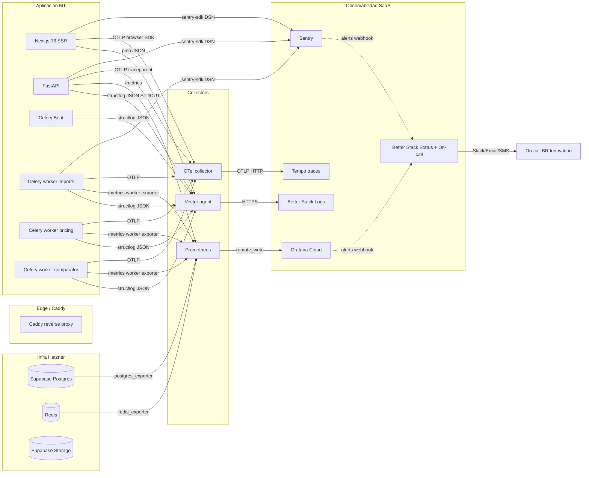
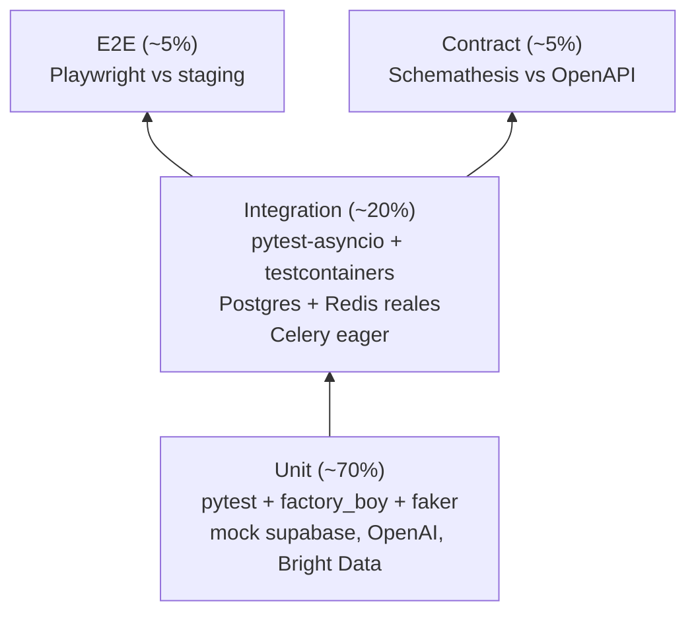

# Diseño de Observabilidad + Healthchecks — MT Middle East Fase 1

> **Resumen.** MT instaura observabilidad profesional desde Sprint 0 — algo que `hppt-iom-review_1` (proyecto de referencia) NO tiene. Stack target: **Sentry + structlog/loguru + Better Stack Logs + Prometheus + Grafana Cloud + OpenTelemetry → Tempo (Grafana stack) + Better Stack Status**. Healthchecks custom para Celery (el nativo cuelga bajo carga). Tests con `task_always_eager=True` para deterministic Celery tests. Coste estimado mes ~ **USD 145–180** Fase 1.
>
> Este diseño **supersede parcialmente ADR-019** (que cubría sólo Sentry + Pino + Better Stack en stack Node.js) y lo extiende para el stack FastAPI/Python real + Celery + frontend Next.js.

---

## Tabla de contenidos

1. [Stack de observabilidad](#1-stack-de-observabilidad)
   - 1.1 [Logging estructurado](#11-logging-estructurado)
   - 1.2 [Centralized log aggregation](#12-centralized-log-aggregation)
   - 1.3 [Error tracking](#13-error-tracking)
   - 1.4 [Metrics](#14-metrics)
   - 1.5 [Distributed tracing](#15-distributed-tracing)
   - 1.6 [Alerting](#16-alerting)
   - 1.7 [SLI / SLO / Error budget](#17-sli--slo--error-budget)
2. [Healthchecks](#2-healthchecks)
3. [Tests Celery eager + integration](#3-tests-celery-eager--integration)
4. [Status page](#4-status-page)
5. [Implementation plan](#5-implementation-plan)
6. [Costos mensuales estimados](#6-costos-mensuales-estimados)
7. [Open questions / TODO](#7-open-questions--todo)

---

## 1. Stack de observabilidad

### Decisión global (resumen)

| Capa | Herramienta | Justificación |
|------|-------------|---------------|
| Logs estructurados backend | **structlog** + **loguru** (compat) → JSON STDOUT | structlog es nativo Python con processors componibles; loguru se mantiene como fachada de compat para libs que esperan logging estándar. JSON line-per-event ingestado por Vector. |
| Logs estructurados frontend | **pino** (Node SSR) + sink HTTP a `/api/observability/logs` (cliente) | pino es el estándar Node performante; en el cliente buffereamos y enviamos al backend para no exponer claves. |
| Logs estructurados worker | **structlog** + bind context (task_name, task_id, queue, retry_count) | mismo pipeline que API. |
| Aggregation | **Better Stack Logs** (managed) | alineado con stack BR Innovation, soporta search en JSON, retention 30/90, ingestión vía Vector o Docker driver. |
| Error tracking | **Sentry SaaS** (`sentry-sdk[fastapi]` + `sentry-sdk[celery]` + `@sentry/nextjs`) | SLA managed, source maps automáticos, performance monitoring, releases vinculadas a commits. |
| Métricas | **Prometheus** scraping local + remote write a **Grafana Cloud Free Tier** | TSDB local en Hetzner (retención corta) + Grafana Cloud para dashboards/long term y free tier suficiente para 224 SKUs. |
| Tracing | **OpenTelemetry SDK** → **Tempo** (Grafana stack) | unifica con Grafana Cloud (tracing free tier 50 GB/mes). Sample 10 % éxito, 100 % errores. |
| Alerting | Sentry rules + Grafana alerts + Better Stack On-call | canales: Slack `#mt-alerts` + email + on-call rotation. |
| Status page | **Better Stack Status** | mismo proveedor que logs/on-call → menos cuentas; URL protegida Fase 1, pública Fase 3+. |

### Diagrama global del flujo de datos



---

### 1.1 Logging estructurado

#### Backend FastAPI (structlog + loguru compat)

`app/core/logging.py`:

```python
from __future__ import annotations
import logging
import sys
import structlog
from structlog.contextvars import merge_contextvars
from app.core.config import settings

_PII_KEYS = {"password", "passwd", "token", "secret", "authorization",
             "cookie", "api_key", "apikey", "access_token", "refresh_token"}


def _redact_pii(_, __, event_dict):
    """Procesador structlog que redacta valores en claves sensibles."""
    for k in list(event_dict.keys()):
        if k.lower() in _PII_KEYS:
            event_dict[k] = "***REDACTED***"
        # Redacción parcial de email: pablo@x.com -> p***@x.com
        if k == "email" and isinstance(event_dict[k], str) and "@" in event_dict[k]:
            local, domain = event_dict[k].split("@", 1)
            event_dict[k] = f"{local[:1]}***@{domain}"
    return event_dict


def _add_service_fields(_, __, event_dict):
    event_dict.setdefault("service", settings.SERVICE_NAME)   # "mt-api" | "mt-worker"
    event_dict.setdefault("env", settings.ENV)                # "prod" | "staging" | "dev"
    event_dict.setdefault("version", settings.VERSION)        # SHA o tag
    return event_dict


def configure_logging() -> None:
    timestamper = structlog.processors.TimeStamper(fmt="iso", utc=True)

    shared_processors = [
        merge_contextvars,                # request_id, trace_id, user_id desde contextvars
        structlog.stdlib.add_log_level,
        structlog.stdlib.add_logger_name,
        timestamper,
        _add_service_fields,
        _redact_pii,
        structlog.processors.StackInfoRenderer(),
        structlog.processors.format_exc_info,
    ]

    structlog.configure(
        processors=shared_processors + [structlog.processors.JSONRenderer()],
        wrapper_class=structlog.make_filtering_bound_logger(
            getattr(logging, settings.LOG_LEVEL.upper(), logging.INFO)
        ),
        logger_factory=structlog.PrintLoggerFactory(file=sys.stdout),
        cache_logger_on_first_use=True,
    )

    # Loguru -> standard logging compat (libs que usan loguru lo redirigen a structlog)
    try:
        from loguru import logger as loguru_logger
        loguru_logger.remove()
        loguru_logger.add(
            sys.stdout, serialize=True, level=settings.LOG_LEVEL,
            backtrace=False, diagnose=False,
        )
    except ImportError:
        pass

    # Silenciar loggers ruidosos
    for noisy in ("uvicorn.access", "httpx", "asyncio"):
        logging.getLogger(noisy).setLevel(logging.WARNING)
```

#### Middleware FastAPI (request_id + traceparent + trace_id)

`app/core/middleware.py`:

```python
import uuid
import structlog
from starlette.middleware.base import BaseHTTPMiddleware
from starlette.types import ASGIApp
from structlog.contextvars import bind_contextvars, clear_contextvars
from opentelemetry import trace

log = structlog.get_logger("http")


class RequestContextMiddleware(BaseHTTPMiddleware):
    """Genera/propaga X-Request-ID y traceparent W3C; bindea en contextvars."""

    async def dispatch(self, request, call_next):
        clear_contextvars()
        request_id = request.headers.get("x-request-id") or str(uuid.uuid4())
        traceparent = request.headers.get("traceparent")  # W3C trace context
        span = trace.get_current_span()
        ctx = span.get_span_context() if span else None

        bind_contextvars(
            request_id=request_id,
            trace_id=f"{ctx.trace_id:032x}" if ctx and ctx.trace_id else None,
            span_id=f"{ctx.span_id:016x}" if ctx and ctx.span_id else None,
            method=request.method,
            path=request.url.path,
        )

        log.info("http.request.start")
        try:
            response = await call_next(request)
        except Exception as exc:
            log.exception("http.request.error", error=str(exc))
            raise
        response.headers["X-Request-ID"] = request_id
        if traceparent:
            response.headers["traceparent"] = traceparent
        log.info("http.request.end", status_code=response.status_code)
        return response
```

#### Celery tasks (bind context en cada task)

`app/tasks/_logging.py`:

```python
import structlog
from celery.signals import task_prerun, task_postrun, task_failure
from structlog.contextvars import bind_contextvars, clear_contextvars

log = structlog.get_logger("celery")


@task_prerun.connect
def _bind_task_context(task_id=None, task=None, args=None, kwargs=None, **_):
    clear_contextvars()
    bind_contextvars(
        task_id=task_id,
        task_name=task.name if task else None,
        queue=getattr(task.request, "delivery_info", {}).get("routing_key") if task else None,
        retry_count=getattr(task.request, "retries", 0) if task else 0,
    )
    log.info("celery.task.start")


@task_postrun.connect
def _log_task_end(task_id=None, task=None, state=None, **_):
    log.info("celery.task.end", state=state)
    clear_contextvars()


@task_failure.connect
def _log_task_failure(task_id=None, exception=None, **_):
    log.error("celery.task.failure", error=repr(exception))
```

#### Frontend Next.js (pino server + browser sink)

`web/src/lib/logger.ts`:

```typescript
import pino from "pino";

const isServer = typeof window === "undefined";

export const logger = isServer
  ? pino({
      level: process.env.LOG_LEVEL ?? "info",
      base: { service: "mt-web", env: process.env.NODE_ENV, version: process.env.NEXT_PUBLIC_APP_VERSION },
      redact: ["password", "token", "secret", "*.password", "headers.authorization", "headers.cookie"],
      timestamp: pino.stdTimeFunctions.isoTime,
    })
  : pino({
      level: process.env.NEXT_PUBLIC_LOG_LEVEL ?? "warn",
      browser: {
        asObject: true,
        transmit: {
          level: "warn",
          send: (level, logEvent) => {
            // Buffer + envío al backend (no exponer claves SaaS al cliente)
            navigator.sendBeacon?.("/api/observability/logs", JSON.stringify(logEvent))
              ?? fetch("/api/observability/logs", {
                method: "POST", body: JSON.stringify(logEvent), keepalive: true,
              });
          },
        },
      },
    });
```

#### Campos obligatorios en cada log

```json
{
  "timestamp": "2026-05-06T12:34:56.789Z",
  "level": "info",
  "service": "mt-api",
  "env": "prod",
  "version": "v1.0.0+abc1234",
  "trace_id": "0af7651916cd43dd8448eb211c80319c",
  "span_id": "b7ad6b7169203331",
  "request_id": "uuid-v4",
  "user_id": "uuid-or-null",
  "event": "price.approved",
  "ctx": { "sku": "VLV-001", "channel": "amazon_uae", "scheme": "FBA" }
}
```

---

### 1.2 Centralized log aggregation

#### Recomendación: **Better Stack Logs** (Opción A)

| Criterio | Better Stack | Loki self-host | Datadog Logs |
|----------|--------------|----------------|--------------|
| Setup time | ~30 min | ~1 día | ~2 h |
| Coste 30 GB/mes | ~USD 25 | ~USD 10 (infra) + 1 día/mes ops | ~USD 100+ |
| Search speed | Excelente (Clickhouse) | Bueno con LogQL | Excelente |
| Alineamiento BR | Sí (ya lo usan) | No | No |
| Retención hot/cold | 30 d / 90 d configurables | Self-config | 15 d default |
| On-call integrado | Sí | Requiere PagerDuty | Sí |
| Equipo MT post-handoff | Plug-and-play | Requiere skill SRE | Plug-and-play |

**Justificación.** Equipo BR pequeño + alineamiento con stack interno + on-call integrado en mismo proveedor. Loki self-host se evalúa Fase 3+ si volumen logs > 100 GB/mes (umbral coste-eficiencia). Datadog overkill para Fase 1.

#### Ingestión: **Vector** (no Docker driver, no Promtail)

Razón: Vector es agnóstico al destino (puede pivotear a Loki sin tocar app), agrega buffering/retry/parsing JSON, y consume menos memoria que Promtail.

`docker-compose.prod.yml` (extracto):

```yaml
services:
  vector:
    image: timberio/vector:0.39.0-alpine
    restart: unless-stopped
    volumes:
      - ./vector.toml:/etc/vector/vector.toml:ro
      - /var/run/docker.sock:/var/run/docker.sock:ro
    environment:
      BETTERSTACK_TOKEN: ${BETTERSTACK_LOGS_TOKEN}
    depends_on: [api, worker, beat]
```

`vector.toml`:

```toml
[sources.docker]
type = "docker_logs"
include_containers = ["mt-api", "mt-worker-imports", "mt-worker-pricing",
                      "mt-worker-comparator", "mt-beat", "mt-web"]

[transforms.parse_json]
type = "remap"
inputs = ["docker"]
source = '''
. = parse_json!(.message)
.host = get_hostname!()
'''

[transforms.drop_health]
type = "filter"
inputs = ["parse_json"]
condition = '!includes(["/health/live", "/health/ready"], .path)'

[sinks.betterstack]
type = "http"
inputs = ["drop_health"]
uri = "https://in.logs.betterstack.com"
encoding.codec = "json"
auth.strategy = "bearer"
auth.token = "${BETTERSTACK_TOKEN}"
batch.max_events = 100
batch.timeout_secs = 2
buffer.type = "disk"
buffer.max_size = 268435456
```

#### Retention policy

| Tier | Retención | Storage | Coste/GB |
|------|-----------|---------|----------|
| Hot (full search) | 30 días | Better Stack live | incluido en plan |
| Cold (S3 archive) | 90 días | Better Stack archive (S3 frankfurt) | ~USD 0.03/GB-mes |
| Audit logs canónicos | 5 años | Postgres `audit_events` (ADR-007) — no en Better Stack | — |

---

### 1.3 Error tracking

**Decisión: Sentry SaaS.** Self-host descartado: requiere Postgres dedicado + Redis + Kafka + Snuba — overkill para 3 personas.

#### Backend FastAPI

`app/main.py`:

```python
import sentry_sdk
from sentry_sdk.integrations.fastapi import FastApiIntegration
from sentry_sdk.integrations.starlette import StarletteIntegration
from sentry_sdk.integrations.celery import CeleryIntegration
from sentry_sdk.integrations.sqlalchemy import SqlalchemyIntegration
from sentry_sdk.integrations.redis import RedisIntegration
from app.core.config import settings


def _before_send(event, hint):
    """Filtra PII y errores 4xx esperados."""
    # Drop validation errors (Pydantic) — son user-side, no bug
    if "exc_info" in hint:
        exc = hint["exc_info"][1]
        if exc.__class__.__name__ in {"RequestValidationError", "HTTPException"}:
            status = getattr(exc, "status_code", 500)
            if 400 <= status < 500:
                return None
    # Sanitiza headers
    if event.get("request", {}).get("headers"):
        for h in ("authorization", "cookie", "x-api-key"):
            event["request"]["headers"].pop(h, None)
    return event


sentry_sdk.init(
    dsn=settings.SENTRY_DSN,
    environment=settings.ENV,
    release=settings.VERSION,                  # ej. "mt-api@1.2.3+abc1234"
    traces_sample_rate=0.1 if settings.ENV == "prod" else 1.0,
    profiles_sample_rate=0.1,
    send_default_pii=False,
    before_send=_before_send,
    integrations=[
        FastApiIntegration(transaction_style="endpoint"),
        StarletteIntegration(transaction_style="endpoint"),
        CeleryIntegration(monitor_beat_tasks=True),
        SqlalchemyIntegration(),
        RedisIntegration(),
    ],
)


# User context anonimizado
@app.middleware("http")
async def sentry_user_context(request, call_next):
    user = getattr(request.state, "user", None)
    if user:
        sentry_sdk.set_user({
            "id": str(user.id),                # UUID, no PII
            "role": user.role,
            "ip_address": "{{auto}}",
        })
    return await call_next(request)
```

#### Frontend Next.js

```typescript
// sentry.client.config.ts
import * as Sentry from "@sentry/nextjs";

Sentry.init({
  dsn: process.env.NEXT_PUBLIC_SENTRY_DSN,
  environment: process.env.NEXT_PUBLIC_ENV,
  release: process.env.NEXT_PUBLIC_APP_VERSION,
  tracesSampleRate: 0.1,
  replaysOnErrorSampleRate: 1.0,
  replaysSessionSampleRate: 0.0,
  beforeSend(event) {
    if (event.request?.headers) {
      delete event.request.headers["authorization"];
      delete event.request.headers["cookie"];
    }
    return event;
  },
  integrations: [
    Sentry.browserTracingIntegration(),
    Sentry.replayIntegration({ maskAllText: true, blockAllMedia: true }),
  ],
});
```

#### Source maps + release tracking en CI

`.github/workflows/deploy.yml` (extracto):

```yaml
- name: Sentry release
  env:
    SENTRY_AUTH_TOKEN: ${{ secrets.SENTRY_AUTH_TOKEN }}
    SENTRY_ORG: br-innovation
    SENTRY_PROJECT_API: mt-api
    SENTRY_PROJECT_WEB: mt-web
  run: |
    npx @sentry/cli releases new "$GITHUB_SHA"
    npx @sentry/cli releases set-commits "$GITHUB_SHA" --auto
    npx @sentry/cli releases files "$GITHUB_SHA" \
        upload-sourcemaps web/.next --rewrite
    npx @sentry/cli releases finalize "$GITHUB_SHA"
    npx @sentry/cli releases deploys "$GITHUB_SHA" new -e prod
```

#### Alerting rules Sentry

| Regla | Condición | Acción |
|-------|-----------|--------|
| Spike de errores | Error rate > 1 % sustained 5 min | Slack `#mt-alerts` + on-call |
| Nuevo error | Issue first seen en última hora | Slack |
| Regresión release | Issue resuelto que reaparece tras release | Slack + email lead |
| Performance regression | p95 transaction > +50 % vs release anterior | Slack |
| Quota burn | Sentry quota > 80 % | email admin |

---

### 1.4 Metrics

#### Setup Prometheus + remote write Grafana Cloud

`docker-compose.prod.yml` (extracto):

```yaml
services:
  prometheus:
    image: prom/prometheus:v2.55.0
    restart: unless-stopped
    volumes:
      - ./prometheus.yml:/etc/prometheus/prometheus.yml:ro
      - prom-data:/prometheus
    command:
      - --config.file=/etc/prometheus/prometheus.yml
      - --storage.tsdb.retention.time=15d
      - --web.enable-lifecycle
    ports: ["127.0.0.1:9090:9090"]

  postgres-exporter:
    image: prometheuscommunity/postgres-exporter:v0.15.0
    environment:
      DATA_SOURCE_NAME: ${SUPABASE_DATABASE_URL}
    ports: ["127.0.0.1:9187:9187"]

  redis-exporter:
    image: oliver006/redis_exporter:v1.62.0
    environment:
      REDIS_ADDR: redis://redis:6379
    ports: ["127.0.0.1:9121:9121"]

  celery-exporter:
    image: danihodovic/celery-exporter:0.10.10
    environment:
      CE_BROKER_URL: redis://redis:6379/0
    ports: ["127.0.0.1:9808:9808"]
```

`prometheus.yml`:

```yaml
global:
  scrape_interval: 30s
  external_labels:
    project: mt-pricing-mdm
    env: prod

remote_write:
  - url: https://prometheus-prod-XX.grafana.net/api/prom/push
    basic_auth:
      username: ${GRAFANA_CLOUD_USER}
      password: ${GRAFANA_CLOUD_API_KEY}

scrape_configs:
  - job_name: mt-api
    metrics_path: /metrics
    static_configs: [{ targets: ["api:8000"] }]
  - job_name: postgres
    static_configs: [{ targets: ["postgres-exporter:9187"] }]
  - job_name: redis
    static_configs: [{ targets: ["redis-exporter:9121"] }]
  - job_name: celery
    static_configs: [{ targets: ["celery-exporter:9808"] }]
```

#### FastAPI: prometheus-fastapi-instrumentator

`app/main.py`:

```python
from prometheus_fastapi_instrumentator import Instrumentator, metrics

instrumentator = (
    Instrumentator(
        excluded_handlers=["/health/.*", "/metrics"],
        env_var_name="ENABLE_METRICS",
    )
    .add(metrics.latency(buckets=(0.05, 0.1, 0.25, 0.5, 1, 2.5, 5, 10)))
    .add(metrics.requests())
    .add(metrics.default(metric_namespace="mt_api"))
)
instrumentator.instrument(app).expose(app, endpoint="/metrics", include_in_schema=False)
```

#### Custom business metrics

`app/core/metrics.py`:

```python
from prometheus_client import Counter, Histogram, Gauge

# Pricing
prices_auto_approved_total = Counter(
    "mt_prices_auto_approved_total",
    "Precios auto-aprobados (dentro de tolerancia)",
    ["channel", "scheme"],
)
prices_pending_review_total = Gauge(
    "mt_prices_pending_review_total",
    "Precios en pending_review actualmente",
    ["channel"],
)
prices_approval_latency_seconds = Histogram(
    "mt_prices_approval_latency_seconds",
    "Latencia entre pending_review y approved",
    buckets=(60, 600, 3600, 14400, 86400, 172800, 604800),
)

# Imports
import_runs_duration_seconds = Histogram(
    "mt_import_runs_duration_seconds",
    "Duración de runs de importer",
    ["source", "status"],
    buckets=(1, 5, 15, 30, 60, 180, 600),
)

# Comparator
comparator_match_confidence = Histogram(
    "mt_comparator_match_confidence",
    "Distribución de confidence score del comparador",
    ["competitor"],
    buckets=(0.1, 0.3, 0.5, 0.7, 0.85, 0.95, 0.99),
)

# Translation coverage
translation_coverage_ratio = Gauge(
    "mt_translation_coverage_ratio",
    "Ratio de SKUs con traducción approved",
    ["lang"],
)

# Cost dashboard
external_api_calls_total = Counter(
    "mt_external_api_calls_total",
    "Llamadas a APIs externas",
    ["provider", "operation"],
)
external_api_cost_usd = Counter(
    "mt_external_api_cost_usd_total",
    "Costo acumulado APIs externas (USD)",
    ["provider"],
)
```

#### Celery: celery-exporter (auto) + custom

El exporter `danihodovic/celery-exporter` provee:
- `celery_queue_length{queue_name}` (Gauge)
- `celery_active_worker_count{queue_name}` (Gauge)
- `celery_task_runtime_seconds{name, queue_name}` (Histogram)
- `celery_task_succeeded_total{name, queue_name}` (Counter)
- `celery_task_failed_total{name, queue_name, exception}` (Counter)
- `celery_task_retried_total{name, queue_name}` (Counter)

#### Frontend web vitals → API endpoint

`web/src/app/api/observability/vitals/route.ts`:

```typescript
import { NextRequest, NextResponse } from "next/server";

export async function POST(req: NextRequest) {
  const vitals = await req.json();
  // Reenvío a backend → Prometheus pushgateway o tabla web_vitals para histograma
  await fetch(`${process.env.API_URL}/internal/vitals`, {
    method: "POST",
    headers: { "x-internal-token": process.env.INTERNAL_TOKEN! },
    body: JSON.stringify(vitals),
  });
  return NextResponse.json({ ok: true });
}
```

`web/src/app/layout.tsx`:

```typescript
import { useReportWebVitals } from "next/web-vitals";
useReportWebVitals((m) => {
  navigator.sendBeacon("/api/observability/vitals", JSON.stringify({
    name: m.name, value: m.value, id: m.id, label: m.label,
    path: window.location.pathname,
  }));
});
```

#### Grafana dashboards (mínimo 6)

| Dashboard | Paneles clave | SLI principal |
|-----------|---------------|---------------|
| **1. Service Health** | RPS por endpoint, p50/p95/p99 latency, error rate 4xx/5xx, saturación CPU/mem container | Disponibilidad backend 99.5 % |
| **2. Celery Health** | Queue depth por queue (imports/pricing/comparator), active workers, task rate succeed/failed/retried, task duration p95 por task_name | Tasa éxito > 99 % |
| **3. Database Health** | Connections vs pool size, tx rate, slow queries (>1s), replication lag (Supabase), table bloat, index hit ratio | p95 query < 200 ms |
| **4. Business KPIs** | Precios pending_review (gauge), auto-approve rate %, cobertura traducción AR/ES, comparator match confidence histogram, approval latency p95 | Cobertura > 95 %, latency < 24 h |
| **5. Cost Dashboard** | Llamadas OpenAI/Cohere/Bright Data por hora, USD acumulado/día/proveedor, Hetzner CPU/RAM/disk usage, Supabase Postgres connections + storage | Budget mensual ≤ USD 200 |
| **6. Error Budget** | SLO compliance % por SLI, burn rate 1h/6h/24h, días restantes de budget mes en curso | Ver §1.7 |

JSON dashboards (export Grafana) versionados en `infra/grafana/dashboards/*.json`, importados vía provisioning.

---

### 1.5 Distributed tracing

#### OpenTelemetry SDK end-to-end

**Backend FastAPI** — `app/core/tracing.py`:

```python
from opentelemetry import trace
from opentelemetry.exporter.otlp.proto.http.trace_exporter import OTLPSpanExporter
from opentelemetry.instrumentation.fastapi import FastAPIInstrumentor
from opentelemetry.instrumentation.sqlalchemy import SQLAlchemyInstrumentor
from opentelemetry.instrumentation.redis import RedisInstrumentor
from opentelemetry.instrumentation.celery import CeleryInstrumentor
from opentelemetry.instrumentation.httpx import HTTPXClientInstrumentor
from opentelemetry.sdk.resources import Resource, SERVICE_NAME, SERVICE_VERSION
from opentelemetry.sdk.trace import TracerProvider
from opentelemetry.sdk.trace.export import BatchSpanProcessor
from opentelemetry.sdk.trace.sampling import (
    ParentBasedTraceIdRatio, ALWAYS_ON,
)
from app.core.config import settings


def setup_tracing(app, engine):
    resource = Resource.create({
        SERVICE_NAME: settings.SERVICE_NAME,
        SERVICE_VERSION: settings.VERSION,
        "deployment.environment": settings.ENV,
    })

    # Sample rate: 100% errores (via tail-sampling en Tempo) + 10% éxito
    sampler = ParentBasedTraceIdRatio(0.1)

    provider = TracerProvider(resource=resource, sampler=sampler)
    provider.add_span_processor(BatchSpanProcessor(
        OTLPSpanExporter(endpoint=settings.OTLP_ENDPOINT,
                          headers={"Authorization": f"Basic {settings.OTLP_AUTH}"})
    ))
    trace.set_tracer_provider(provider)

    FastAPIInstrumentor.instrument_app(app, excluded_urls="health/.*,metrics")
    SQLAlchemyInstrumentor().instrument(engine=engine.sync_engine)
    RedisInstrumentor().instrument()
    CeleryInstrumentor().instrument()
    HTTPXClientInstrumentor().instrument()
```

**Frontend Next.js** — `instrumentation.ts`:

```typescript
import { registerOTel } from "@vercel/otel";

export function register() {
  registerOTel({
    serviceName: "mt-web",
    traceExporter: "otlp-http",
    instrumentations: ["http", "fetch"],
  });
}
```

#### Propagación traceparent

- Frontend → Backend: header `traceparent` W3C en cada `fetch` (auto via OTel browser SDK).
- Backend → Celery: header `traceparent` propagado vía `task.apply_async(headers={...})` (auto con `CeleryInstrumentor`).
- Backend → Postgres / Redis: span auto generado, no requiere propagación al wire.

#### Sample rate

| Caso | Rate |
|------|------|
| Request con error 5xx o exception capturada | 100 % (tail-based en Tempo) |
| Request con latencia > 2 s | 100 % |
| Resto | 10 % |
| Healthchecks | 0 % (excluded_urls) |

---

### 1.6 Alerting

#### Reglas mínimas

| # | Alerta | Condición | Severidad | Canal |
|---|--------|-----------|-----------|-------|
| 1 | Backend error rate alto | `sum(rate(http_requests_total{status=~"5.."}[5m])) / sum(rate(http_requests_total[5m])) > 0.01` for 5 min | P1 | Slack `#mt-alerts` + on-call |
| 2 | Celery queue depth | `celery_queue_length{queue_name=~"imports\|pricing"} > 500` for 10 min | P1 | on-call |
| 3 | Postgres pool saturation | `pg_stat_activity_count / pg_settings_max_connections > 0.8` | P1 | on-call |
| 4 | Disk Hetzner | `node_filesystem_avail_bytes / node_filesystem_size_bytes < 0.2` | P1 | on-call |
| 5 | Redis memory | `redis_memory_used_bytes / redis_memory_max_bytes > 0.8` | P2 | on-call |
| 6 | Failed login bursts | `rate(mt_auth_failures_total[5m]) > 5` | P2 (security) | Slack `#mt-security` |
| 7 | Import batch failures | `mt_import_runs_total{status="failed"} > 0` (last 1h) | P3 | Slack `#mt-comercial` + email |
| 8 | Approval queue stale | `max(mt_prices_approval_latency_seconds) > 172800` (48 h) | P3 | email Gerente |
| 9 | SLO burn rate | `error_budget_burn_rate_1h > 14.4` (consume mes en 1h) | P0 | on-call SMS |
| 10 | Sentry quota | Sentry quota > 80 % | P3 | email admin |

Implementación: reglas en Grafana Cloud Alerting (`infra/grafana/alerts/*.yaml` provisioning).

#### Canales

- **Slack** `#mt-alerts` (ops), `#mt-comercial` (negocio), `#mt-security` (seguridad).
- **Better Stack On-call** rotación semanal BR Innovation Fase 1 → handoff TI MT post-Fase 1.
- **Email fallback** para roles que no usan Slack (Gerente Comercial).
- **SMS** sólo P0 (sistema caído / SLO burn > 14.4×).

---

### 1.7 SLI / SLO / Error budget

| # | SLI | SLO | Error budget mes (30d) |
|---|-----|-----|------------------------|
| 1 | Disponibilidad backend API (uptime endpoints no-health) | **99.5 %** | 3 h 36 min downtime |
| 2 | Latencia p95 endpoints CRUD `/products`, `/costs`, `/prices` | **< 500 ms** | 5 % requests pueden exceder |
| 3 | Latencia p95 motor pricing recálculo SKU individual | **< 5 s** | 5 % requests exceder |
| 4 | Latencia p95 recálculo masivo (5086 × 5 × 4 = 101 720 combinaciones) | **< 60 s** | 5 % runs exceder |
| 5 | Tasa de éxito de imports (run completes sin error fatal) | **> 99 %** | 1 % runs pueden fallar |
| 6 | Tasa de éxito tasks Celery por queue | **> 99 %** queue `pricing`/`imports`; **> 95 %** queue `comparator` (research, tolerante) | acorde |
| 7 | Audit completeness (event registrado por mutación DML crítica) | **100 %** | 0 — gate compliance VAT 2026 |

**Error budget burn rate** alerts:
- 1 h burn > 14.4× (consume budget mes en 1 h) → P0.
- 6 h burn > 6× → P1.
- 24 h burn > 1× → P2.

Definición canónica en `ADR-052-sli-slo-error-budget.md`.

---

## 2. Healthchecks

> **Lección aprendida hppt-iom.** El healthcheck nativo de Celery (`celery inspect ping`) **cuelga bajo carga** (broadcast a workers vía pub/sub se queda sin ack). MT implementa un **heartbeat custom** que NO bloquea: cada worker publica `SET worker:{name}:hb {ts} EX 60` cada 15 s; el endpoint `/health/celery` simplemente lee las claves.

### 2.1 Endpoints FastAPI (6) + frontend (1)

| Endpoint | Tipo | Auth | Timeout | Comprueba |
|----------|------|------|---------|-----------|
| `GET /health/live` | liveness | público | 1 s | event loop responde |
| `GET /health/ready` | readiness | público | 3 s | DB pool + Redis ping + Supabase reachable |
| `GET /health/db` | deep | token | 5 s | query trivial Postgres + pool stats |
| `GET /health/redis` | deep | token | 2 s | PING + INFO |
| `GET /health/storage` | deep | token | 5 s | LIST 1 file Supabase Storage |
| `GET /health/celery` | deep (custom no-bloqueante) | token | 2 s | heartbeat workers en Redis por queue |
| `GET /api/health` (Next.js) | proxy | público | 4 s | llama a backend `/health/ready` |

#### Implementación FastAPI

`app/routers/health.py`:

```python
from __future__ import annotations
import asyncio
import time
from typing import Any
from fastapi import APIRouter, Depends, HTTPException, Header, status
from sqlalchemy import text
from app.core.db import get_engine, get_session
from app.core.redis import get_redis
from app.core.supabase import get_supabase
from app.core.config import settings

router = APIRouter(prefix="/health", tags=["health"])

# ── Auth simple para deep checks ────────────────────────────────────────────
def require_health_token(x_health_token: str | None = Header(default=None)):
    if x_health_token != settings.HEALTH_TOKEN:
        raise HTTPException(status.HTTP_401_UNAUTHORIZED, "invalid health token")


async def _with_timeout(coro, t: float):
    try:
        return await asyncio.wait_for(coro, timeout=t)
    except asyncio.TimeoutError:
        return None


# ── Liveness: 200 siempre que el event loop responda ───────────────────────
@router.get("/live")
async def live():
    return {"status": "ok", "ts": time.time()}


# ── Readiness: DB + Redis + Supabase reachable ─────────────────────────────
@router.get("/ready")
async def ready():
    checks: dict[str, Any] = {}
    overall_ok = True

    # DB ping
    async def _db():
        async with (await get_session()).begin() as conn:
            await conn.execute(text("SELECT 1"))
    db_ok = await _with_timeout(_db(), 1.5)
    checks["db"] = "ok" if db_ok is not None or db_ok is None and overall_ok else "fail"
    # nb: _with_timeout devuelve None on timeout o el valor; ajustamos:
    try:
        async def _db2():
            async with (await get_session()).begin() as conn:
                return (await conn.execute(text("SELECT 1"))).scalar()
        db_v = await asyncio.wait_for(_db2(), 1.5)
        checks["db"] = "ok" if db_v == 1 else "fail"
    except Exception:
        checks["db"] = "fail"; overall_ok = False

    # Redis ping
    try:
        r = await get_redis()
        pong = await asyncio.wait_for(r.ping(), 0.5)
        checks["redis"] = "ok" if pong else "fail"
    except Exception:
        checks["redis"] = "fail"; overall_ok = False

    # Supabase reachable (HEAD a auth health)
    try:
        sb = get_supabase()
        await asyncio.wait_for(asyncio.to_thread(sb.auth.get_session), 1.0)
        checks["supabase"] = "ok"
    except Exception:
        checks["supabase"] = "degraded"  # no fail global; auth puede estar transitorio

    if not overall_ok:
        raise HTTPException(status.HTTP_503_SERVICE_UNAVAILABLE,
                            detail={"status": "fail", "checks": checks})
    return {"status": "ok", "checks": checks}


# ── Deep DB ────────────────────────────────────────────────────────────────
@router.get("/db", dependencies=[Depends(require_health_token)])
async def db_deep():
    engine = get_engine()
    pool = engine.pool
    try:
        async with engine.connect() as conn:
            row = (await conn.execute(text(
                "SELECT current_database(), current_user, now()"
            ))).first()
        return {
            "status": "ok",
            "db": row[0], "user": row[1], "now": row[2].isoformat(),
            "pool": {
                "size": pool.size(),
                "checked_out": pool.checkedout(),
                "checked_in": pool.checkedin(),
                "overflow": pool.overflow(),
            },
        }
    except Exception as exc:
        raise HTTPException(503, detail={"status": "fail", "error": str(exc)})


# ── Deep Redis ─────────────────────────────────────────────────────────────
@router.get("/redis", dependencies=[Depends(require_health_token)])
async def redis_deep():
    r = await get_redis()
    try:
        info = await asyncio.wait_for(r.info(section="server"), 1.0)
        used = await asyncio.wait_for(r.info(section="memory"), 1.0)
        return {
            "status": "ok",
            "version": info.get("redis_version"),
            "uptime_s": info.get("uptime_in_seconds"),
            "memory_used_mb": int(used.get("used_memory", 0)) // (1024*1024),
            "max_memory_mb": int(used.get("maxmemory", 0)) // (1024*1024),
        }
    except asyncio.TimeoutError:
        raise HTTPException(504, detail={"status": "timeout"})


# ── Deep Storage ───────────────────────────────────────────────────────────
@router.get("/storage", dependencies=[Depends(require_health_token)])
async def storage_deep():
    sb = get_supabase()
    try:
        files = await asyncio.wait_for(asyncio.to_thread(
            lambda: sb.storage.from_("product-images").list(path="", options={"limit": 1})
        ), 3.0)
        return {"status": "ok", "sample_count": len(files or [])}
    except asyncio.TimeoutError:
        raise HTTPException(504, detail={"status": "timeout"})
    except Exception as exc:
        raise HTTPException(503, detail={"status": "fail", "error": str(exc)})


# ── Custom Celery healthcheck (NON-BLOCKING — lee heartbeats de Redis) ─────
@router.get("/celery", dependencies=[Depends(require_health_token)])
async def celery_deep():
    """
    El healthcheck nativo de Celery (`inspect ping`) cuelga bajo carga.
    Solución MT: cada worker publica heartbeat en Redis cada 15s con TTL=60s.
    Este endpoint solo lee claves — nunca bloquea.
    """
    r = await get_redis()
    try:
        keys = await asyncio.wait_for(r.keys("mt:worker:hb:*"), 0.5)
        workers_by_queue: dict[str, list[str]] = {}
        for k in keys:
            ts = await r.get(k)
            name = k.decode() if isinstance(k, bytes) else k
            queue = name.split(":")[-1].split("@")[0] if "@" in name else "default"
            workers_by_queue.setdefault(queue, []).append({"name": name, "last_hb": ts})

        expected_queues = {"default", "imports", "pricing", "images",
                           "comparator", "notifications", "audit"}
        missing = expected_queues - set(workers_by_queue.keys())
        return {
            "status": "ok" if not missing else "degraded",
            "workers_by_queue": workers_by_queue,
            "missing_queues": sorted(missing),
        }
    except asyncio.TimeoutError:
        raise HTTPException(504, detail={"status": "timeout"})
```

#### Worker heartbeat publisher

`app/tasks/_heartbeat.py`:

```python
import asyncio, time, socket, structlog
from celery.signals import worker_ready, worker_shutdown
from celery.utils.log import get_task_logger
from app.celery_config import celery_settings

log = structlog.get_logger("worker.heartbeat")
HEARTBEAT_INTERVAL_S = 15
HEARTBEAT_TTL_S = 60


def _hb_loop():
    import redis
    r = redis.from_url(celery_settings.broker_url)
    name = f"{socket.gethostname()}@{','.join(celery_settings.task_default_queue)}"
    while True:
        try:
            r.set(f"mt:worker:hb:{name}", int(time.time()), ex=HEARTBEAT_TTL_S)
        except Exception as exc:
            log.warning("heartbeat.write_failed", error=str(exc))
        time.sleep(HEARTBEAT_INTERVAL_S)


@worker_ready.connect
def _start_heartbeat(sender=None, **_):
    import threading
    t = threading.Thread(target=_hb_loop, daemon=True, name="hb")
    t.start()
    log.info("heartbeat.started", worker=sender.hostname)
```

#### Frontend Next.js healthcheck

`web/src/app/api/health/route.ts`:

```typescript
import { NextResponse } from "next/server";

export async function GET() {
  const ctrl = new AbortController();
  const t = setTimeout(() => ctrl.abort(), 4000);
  try {
    const res = await fetch(`${process.env.API_URL}/health/ready`, {
      signal: ctrl.signal,
      cache: "no-store",
    });
    clearTimeout(t);
    return NextResponse.json(
      { status: res.ok ? "ok" : "fail", upstream: res.status },
      { status: res.ok ? 200 : 503 },
    );
  } catch (err) {
    clearTimeout(t);
    return NextResponse.json({ status: "fail", error: String(err) }, { status: 504 });
  }
}
```

#### Caddy: bypass rate-limit en healthchecks

`Caddyfile`:

```caddy
mtme-app.br-innovation.com {
    encode gzip zstd
    log { output stdout format json }

    # Bypass rate-limit para healthchecks (se rutean ANTES del rate limiter)
    @health path /health/* /api/health
    handle @health {
        reverse_proxy /health/* api:8000
        reverse_proxy /api/health web:3000
    }

    # Rate limit para resto del API
    rate_limit {
        zone api { key {remote_host}; events 60; window 1m }
    }

    handle /api/* { reverse_proxy api:8000 }
    handle      { reverse_proxy web:3000 }
}
```

### 2.2 Códigos HTTP

| Estado interno | HTTP |
|----------------|------|
| Todo OK | 200 |
| Una o más dependencias fallan | 503 |
| Timeout en check | 504 |
| Auth inválida (deep checks) | 401 |

### 2.3 Auth para deep checks

- `/health/live`, `/health/ready` y `/api/health`: **públicos** (Caddy + Hetzner uptime monitor + Better Stack uptime).
- `/health/db`, `/health/redis`, `/health/storage`, `/health/celery`: **token** en header `X-Health-Token` (rotable, en `.env` + secret manager). Permite a TI MT debuggear sin auth Supabase.

---

## 3. Tests con Celery eager mode + integration

> **Gap detectado en hppt-iom**: NO usa `task_always_eager=True` en tests. Tests integration acaban siendo flaky o se mockean masivamente. MT lo soluciona desde S0.

### Pyramid



### 3.1 Configuración Celery eager

`tests/conftest.py`:

```python
import pytest
from app.worker import celery_app


@pytest.fixture(autouse=True, scope="session")
def _celery_eager():
    """Todas las tasks se ejecutan inline en el mismo proceso/event loop."""
    celery_app.conf.update(
        task_always_eager=True,
        task_eager_propagates=True,           # excepciones se propagan
        task_store_eager_result=True,
        broker_url="memory://",
        result_backend="cache+memory://",
    )
    yield
```

### 3.2 Integration con testcontainers (Postgres + Redis reales)

`tests/integration/conftest.py`:

```python
import asyncio
import pytest
import pytest_asyncio
from testcontainers.postgres import PostgresContainer
from testcontainers.redis import RedisContainer
from sqlalchemy.ext.asyncio import create_async_engine, async_sessionmaker
from app.db.models import Base


@pytest.fixture(scope="session")
def event_loop():
    loop = asyncio.new_event_loop()
    yield loop
    loop.close()


@pytest.fixture(scope="session")
def pg_container():
    with PostgresContainer("postgres:16-alpine") as pg:
        yield pg


@pytest.fixture(scope="session")
def redis_container():
    with RedisContainer("redis:7-alpine") as r:
        yield r


@pytest_asyncio.fixture(scope="session")
async def engine(pg_container):
    url = pg_container.get_connection_url().replace("psycopg2", "asyncpg")
    eng = create_async_engine(url, future=True)
    async with eng.begin() as conn:
        await conn.run_sync(Base.metadata.create_all)
    yield eng
    await eng.dispose()


@pytest_asyncio.fixture
async def db_session(engine):
    async with async_sessionmaker(engine, expire_on_commit=False)() as s:
        yield s
        await s.rollback()
```

### 3.3 Unit con factories

`tests/factories.py`:

```python
import factory
from factory import Faker
from app.db.models import Product, Price


class ProductFactory(factory.Factory):
    class Meta:
        model = Product

    sku = Faker("bothify", text="SKU-####-???")
    name_en = Faker("catch_phrase")
    embedding = factory.LazyFunction(lambda: [0.0] * 1536)


class PriceFactory(factory.Factory):
    class Meta:
        model = Price

    product = factory.SubFactory(ProductFactory)
    channel = "amazon_uae"
    scheme = "FBA"
    amount_aed = Faker("pyfloat", min_value=10, max_value=10000)
    state = "draft"
```

### 3.4 Contract testing con Schemathesis

`tests/contract/test_api_contract.py`:

```python
import schemathesis
from app.main import app

schema = schemathesis.from_asgi("/openapi.json", app)


@schema.parametrize()
def test_api_contract(case):
    """Schemathesis genera casos contra OpenAPI; valida response 4xx/5xx schema-compliant."""
    case.call_and_validate()
```

### 3.5 E2E Playwright

`web/e2e/pricing-flow.spec.ts`:

```typescript
import { test, expect } from "@playwright/test";

test.describe("@staging Pricing approval flow", () => {
  test("Comercial submits → Gerente approves → audit registered", async ({ page }) => {
    await page.goto(`${process.env.STAGING_URL}/login`);
    // ... login, navega a /pricing/sku/VLV-001, submit, login Gerente, approve
    await expect(page.getByText("Approved")).toBeVisible();
  });
});
```

### 3.6 Coverage targets + CI gates

`.github/workflows/test.yml`:

```yaml
- name: Backend tests with coverage
  run: |
    pytest --cov=app --cov-report=xml --cov-fail-under=80
    coverage report --include="app/services/pricing/*" --fail-under=100
    coverage report --include="app/services/comparator/*" --fail-under=100
    coverage report --include="app/services/exception_rules/*" --fail-under=100

- name: Frontend tests
  run: |
    pnpm test --coverage --coverageThreshold='{"global":{"lines":70}}'

- name: Flaky test detection
  run: |
    pytest --count=3 --exitfirst-per-test --randomly-dont-shuffle
    # falla si algún test produce resultados inconsistentes en 3 corridas

- name: Lint + typecheck (gate)
  run: |
    ruff check app tests
    mypy app
    pnpm typecheck
```

---

## 4. Status page

### Decisión: **Better Stack Status** (managed)

| Criterio | Better Stack Status | Cachet (self-host) | Statping |
|----------|---------------------|---------------------|----------|
| Setup | Click-deploy | 1 día | 1 día |
| Mantenimiento | 0 | Bajo (PHP/Postgres) | Bajo |
| Integración con monitors | Nativa Better Stack | Externa | Externa |
| Custom domain + branding | Sí | Sí | Sí |
| Privado / acceso restringido | IP allowlist + password | Self | Self |
| Coste | incluido en plan Better Stack | infra + ops | infra + ops |

**Justificación.** Mismo proveedor que logs + on-call → un panel único. Self-host sólo si Fase 3+ se necesita whitelabel agresivo o residencia UAE estricta.

### Componentes monitoreados

| Componente | Probe | SLO panel |
|------------|-------|-----------|
| Backend API | HTTP `/health/ready` cada 30 s | 99.5 % |
| Frontend Next.js | HTTP `/api/health` cada 30 s | 99.5 % |
| Jobs queue (workers) | Sintético via `/health/celery` cada 60 s | 99 % |
| Comparador | Endpoint `/health/comparator` (cuando Fase 1.5+ activo) | 95 % |
| Importer | Última run en `import_runs` < 36 h | n/a (jobs schedule) |
| Supabase Postgres | external (Better Stack ICMP) | upstream |

### Audiencia

- **Fase 1**: URL `https://status.mtme.br-innovation.com` con password compartido a TI MT + Christian + Pablo.
- **Fase 3+** (storefront live): subset público sin métricas internas, sólo "Operational/Degraded/Down" por componente customer-facing.

---

## 5. Implementation plan

### Stories en EP-1A-09 (Observability) — 8 historias mínimo

| # | Story ID | Título | Sprint | SP |
|---|----------|--------|--------|----|
| 1 | US-1A-09-01 | Bootstrap structlog + loguru compat + middleware request_id/traceparent | S0 | 3 |
| 2 | US-1A-09-02 | Sentry SDK backend + frontend + source maps en CI + release tracking | S0 | 5 |
| 3 | US-1A-09-03 | Healthchecks 6 endpoints FastAPI + 1 Next.js + Caddy bypass + heartbeat workers | S0 | 5 |
| 4 | US-1A-09-04 | Vector + Better Stack Logs ingestión + retención 30/90 + redaction PII | S1 | 3 |
| 5 | US-1A-09-05 | Prometheus + exporters (postgres, redis, celery) + Grafana Cloud remote write + 6 dashboards base | S1 | 8 |
| 6 | US-1A-09-06 | OpenTelemetry SDK end-to-end + Tempo exporter + sample rates + propagación celery | S2 | 5 |
| 7 | US-1A-09-07 | SLI/SLO/error budget definidos + dashboards Grafana + alertas burn rate | S3 | 5 |
| 8 | US-1A-09-08 | Celery eager mode tests + testcontainers + Schemathesis contract + CI gates coverage | S2 | 8 |
| 9 | US-1A-09-09 | Custom business metrics (auto-approve rate, translation coverage, comparator confidence) + dashboard "Business KPIs" | S3 | 5 |
| 10 | US-1A-09-10 | Status page Better Stack + componentes monitorados + on-call rotation BR | S6 | 3 |
| 11 | US-1A-09-11 | Alerting rules production (10 reglas mínimas) + canales Slack/email/SMS + runbooks | S2 | 5 |
| 12 | US-1A-09-12 | Cost dashboard (OpenAI/Cohere/Bright Data + Hetzner) + alertas budget mensual | S3 | 3 |

**Total**: 12 historias, 58 SP.

### Cronograma sprint-by-sprint

| Sprint | Entregable observabilidad |
|--------|---------------------------|
| **S0** | Sentry + structlog + healthchecks básicos. Cualquier bug post-deploy diagnosticable. |
| **S1** | Better Stack Logs ingestión real + Prometheus + 6 dashboards Grafana base + alertas críticas (P0/P1). |
| **S2** | OpenTelemetry tracing + Celery eager tests + alertas production completas. |
| **S3** | SLI/SLO + dashboards business KPIs + cost dashboard + error budget burn rate alerts. |
| **S6** | Status page público (interno MT) + on-call rotation cerrada. Listo para handoff TI MT. |

---

## 6. Costos mensuales estimados

| Servicio | Plan Fase 1 | USD/mes |
|----------|-------------|---------|
| Sentry Team | 50K errors/mo + 10K transactions | 26 |
| Better Stack Logs | 30 GB ingestion + 30d retention | 25 |
| Better Stack Uptime + Status + On-call | 30 monitors + 1 status + 3 users on-call | 30 |
| Grafana Cloud Pro | Free tier (10K series, 50 GB logs, 14d) — pago $0 hasta upgrade | 0–49 |
| Prometheus + exporters | self-host Hetzner (incluido en VM) | 0 |
| Vector | self-host (~50 MB RAM) | 0 |
| Tempo (vía Grafana Cloud) | Free tier 50 GB traces/mo | 0 |
| OpenTelemetry SDK | open-source | 0 |
| **Total mínimo** | — | **~ 81** |
| **Total con Grafana Pro paid** | — | **~ 130** |
| **Buffer (storage logs cold + scaling)** | — | **+ 20–50** |
| **Total recomendado Fase 1** | — | **USD 145 – 180/mes** |

**Cap budget**: alerta si > USD 250/mes (US-1A-09-12).

---

## 7. Open questions / TODO

1. **Residencia UAE para logs/traces**: Better Stack ofrece EU (Frankfurt) y US. Si TI MT exige residencia UAE estricta para logs operativos (no audit, que vive en Postgres UAE), necesitamos validar antes de S1 o pivotear a Loki self-host en Hetzner UAE.
2. **Celery scheduler con DatabaseScheduler (ADR-046)**: Sentry `monitor_beat_tasks=True` espera `celery beat` clásico; verificar que funciona con scheduler custom o instrumentar manual via `sentry_sdk.crons.monitor`.
3. **Validar retention 30+90 días vs compliance UAE**: confirmar con TI MT si VAT 2026 / UAE Federal Decree-Law impone retention adicional sobre logs operativos (no audit) — puede forzar 1 año mínimo y empujar a tier paid Better Stack.

