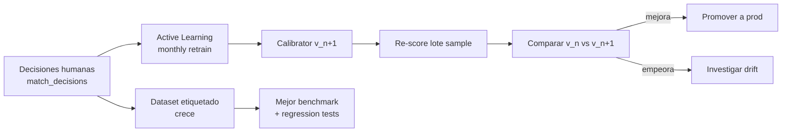
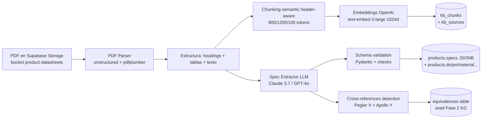

# Pipeline detallado del Match de Productos

> Cómo el comparador decide si un listing de Amazon UAE / Noon UAE es el **mismo producto** que un SKU del catálogo MT.

## 0. Resumen en 1 párrafo

Para cada SKU MT (ej. una válvula compuerta latón DN50 PN16 marca Pegler), el sistema **(1) genera queries multi-fuente y multi-idioma**, **(2) descarga candidatos de marketplaces y catálogos de fabricante**, **(3) extrae texto grabado en imágenes con OCR**, **(4) genera embeddings de imagen y de texto técnico**, **(5) aplica reglas duras irrenunciables (DN/PN/material/conexión = deal breakers)**, **(6) calcula un score multi-dimensional**, **(7) calibra la confianza con isotonic regression**, **(8) llama a un VLM judge auditable que devuelve verdict + razonamiento** y **(9) deriva los casos en zona gris a un humano que valida con UI Tinder-swipe**. Todo queda registrado en `match_decisions` con audit trail completo.

---

## 1. Estado actual (lo que hay que rediseñar)

El demo v5.1 (`MT_Pricing_Run_Kit/src/match_scorer_v2.py`) usa un **matcher tier-keyword** que falla en el **15 % del catálogo** (34/224 sin match + 34 con tier `NONE`).

Pseudocódigo del matcher actual:
```
1. Por cada SKU, lookup tier por marca (T0):
   - Pegler → buscar "Pegler" + spec en query
   - Arco → "Arco" + spec
   - Giacomini / Apollo / Nibco → idem
2. Si no hay match T0, fallback a tiers progresivos:
   - T2: query técnica (DN, PN, material, type)
   - T3: query funcional ("ball valve threaded")
   - T4: product_name canónico
   - T5: keyword fallback
3. Para cada candidato, score por keyword overlap (Jaccard / TF-IDF).
4. Threshold: high≥60, medium 40-60, low <40.
```

**Problemas identificados**:
- No usa imágenes — pierde el 30-40 % de información (specs grabadas en cuerpo de válvula).
- Score keyword-based no diferencia "DN50 brass ball" de "DN65 brass ball" — DN distinto pero ambos matchean tier T2.
- Sin calibración: cuando el sistema dice "score 65 → high", no es **realmente** un match en el 65 % de los casos.
- Sin reasoning auditable: el Gerente no sabe **por qué** el sistema dijo "match".
- Sin humano en el loop persistente: lo que falla, falla silencioso.

**Decisión (ADR-038)**: rediseño completo con arquitectura híbrida.

---

## 2. Vista alto nivel del nuevo pipeline (9 etapas)

```mermaid
flowchart TD
    SKU[SKU MT<br/>ej. PEGLER-MT-DN50-BR-BALL] --> Q[1. Query Builder<br/>multi-idioma EN/AR]
    Q --> F[2. Multi-Source Fetcher<br/>Bright Data + Playwright]
    F --> N[3. Candidate Normalizer<br/>+ Image Mirror + OCR]
    N --> H[4. Hard Rules<br/>Deal Breakers Filter]
    H --> S[5. Multi-Dim Scorer<br/>Image + Text + OCR + Specs]
    S --> R[6. RRF Ranker<br/>+ Calibrator]
    R --> G{7. Threshold]
    G -->|≥95% conf| AM[8a. Auto-Match]
    G -->|80-95%| HQ[8b. Human Queue<br/>Tinder-swipe UI]
    G -->|<80%| DC[8c. Discard + Log]
    HQ --> HD[9. Human Decision<br/>+ Active Learning]
    AM --> J[VLM Judge audit-grade<br/>Gemini 2.5 Flash]
    HD --> J
    J --> M[(match_decisions<br/>+ judge_rationale<br/>+ chunks_consulted<br/>+ deal_breakers)]

    style H fill:#fee2e2
    style S fill:#dbeafe
    style R fill:#fef3c7
    style HQ fill:#dcfce7
    style J fill:#f3e8ff
```

---

## 3. Etapa 1 — Query Builder

**Objetivo**: producir 3-5 queries efectivas para encontrar candidatos en cada fuente.

### 3.1 Inputs del SKU

```python
sku = {
    "codigo": "MTBR4001050",
    "name_en": "Brass ball valve, DN50 PN25, female threaded BSP",
    "name_es": "Válvula de bola en latón, DN50 PN25, rosca hembra BSP",
    "name_ar": "صمام كروي نحاسي، DN50 PN25...",
    "family": "ball_valve",
    "subfamilia": "threaded",
    "dn": 50,
    "pn": 25,
    "material": "brass_CW617N",
    "connection": "BSP_F",
    "brand_canonical": "Pegler",  # solo si MT vende rebrand de Pegler
}
```

### 3.2 Estrategias de query

| Estrategia | Query ejemplo (Amazon UAE) | Cuándo usar |
|------------|----------------------------|-------------|
| **Brand + spec EN** | `"Pegler" brass ball valve DN50 BSP` | T0 brand match (existe whitelist) |
| **Spec técnica EN** | `brass ball valve 2 inch BSP female threaded` | Sin brand o brand no funcionó |
| **Functional EN** | `brass ball valve plumbing` | Fallback amplio |
| **Spec AR** | `صمام كروي نحاسي 2 بوصة` | Mercado UAE prefiere AR para SKUs locales |
| **Norm-based** | `ANSI B16 brass ball valve 2 inch` | Estándares industriales |
| **Part number** | `MTBR4001050` o `Pegler 4001050` | Si el part number es público |

### 3.3 Conversión DN → pulgadas

Amazon UAE/Noon prefieren pulgadas (legacy US/UK) pero MT trabaja en métrico:

```python
DN_TO_INCH = {
    15: '1/2"', 20: '3/4"', 25: '1"', 32: '1-1/4"',
    40: '1-1/2"', 50: '2"', 65: '2-1/2"', 80: '3"', 100: '4"'
}
```

Generar queries en ambos sistemas → más recall.

### 3.4 Multi-idioma AR

- Catálogo MT en EN canónico → para AR queries usar **traducciones validadas en `product_translations.name_ar`** si `translation_status='approved'`.
- Si no hay traducción aprobada, generar AR via LLM (GPT-4o) y marcar query como `synthetic_ar=True`.
- Boost de queries AR cuando el SKU es target Noon (más AR-native que Amazon UAE).

### 3.5 Output

```python
queries = [
    {"text": '"Pegler" brass ball valve DN50 2" BSP threaded', "source": "amazon_ae", "lang": "en", "type": "brand_spec"},
    {"text": "brass ball valve 2 inch BSP female", "source": "amazon_ae", "lang": "en", "type": "spec"},
    {"text": "صمام كروي نحاسي 2 بوصة", "source": "noon_ae", "lang": "ar", "type": "spec_ar"},
    {"text": "Pegler 4001050", "source": "amazon_ae", "lang": "en", "type": "part_number"},
    {"text": "brass ball valve 2 inch", "source": "manufacturer:pegler", "lang": "en", "type": "fabricante"},
]
```

---

## 4. Etapa 2 — Multi-Source Fetcher

**Objetivo**: descargar listings de cada fuente con tolerancia a fallos.

### 4.1 Fuentes activas Fase 1

| Fuente | Tecnología | Costo | Volumen |
|--------|------------|-------|---------|
| Amazon.ae | Bright Data Web Scraper API ($1.50/1k success) | USD 5-150/mo | top 20 results × N queries |
| Noon.com UAE | Bright Data | incluido en presupuesto | top 20 |
| Pegler-Yorkshire.com | Playwright self-host | USD 0 | catálogo completo whitelist |
| Arco.es | Playwright | USD 0 | catálogo completo |
| Giacomini.com | Playwright | USD 0 | catálogo completo |
| Apollo Valves | Playwright | USD 0 | catálogo completo |
| Nibco.com | Playwright | USD 0 | catálogo completo |
| Tradeling / Mistermart / Ubuy | Bright Data o Playwright | USD 5-30/mo | tercer marketplace POC |

### 4.2 Implementación (puerto + adapters — patrón Hexagonal)

```python
# app/services/comparator/sourcing.py
from typing import Protocol

class CandidateFetcher(Protocol):
    async def fetch(self, query: Query) -> list[CandidateRaw]: ...

class BrightDataAmazonFetcher:
    async def fetch(self, query):
        # Web Scraper API: https://brightdata.com/products/web-scraper
        ...

class BrightDataNoonFetcher: ...
class PlaywrightManufacturerFetcher: ...

# Orquestador
class CandidateFetcherOrchestrator:
    def __init__(self, fetchers: dict[str, CandidateFetcher]): ...

    async def fetch_all(self, queries: list[Query]) -> list[CandidateRaw]:
        # Fan-out paralelo con asyncio.gather + circuit breaker por fetcher
        ...
```

### 4.3 Circuit breaker

Cada fetcher tiene un circuit breaker (librería `pybreaker` o equivalente):
- Si Bright Data falla > 5 veces seguidas, abrir circuito por 5 min, fallback a Playwright self-host.
- Sentry alert + Slack `#mt-alerts` cuando se abre.
- Stale-while-revalidate: si la fuente cae, devolver candidates de hace < 24 h del cache.

### 4.4 Output

Lista de `CandidateRaw` con:
```python
{
    "source": "amazon_ae",
    "asin": "B07XYZ123",
    "title": "Pegler 2-Inch Brass Ball Valve, BSP Threaded, PN25",
    "price_aed": 145.50,
    "image_urls": ["https://m.media-amazon.com/.../1.jpg", "...2.jpg"],
    "product_url": "https://www.amazon.ae/dp/B07XYZ123",
    "seller": "Plumbing UAE Store",
    "seller_rating": 4.5,
    "fba_eligible": true,
    "delivery_estimate_days": 2,
    "delivery_origin": "UAE",
    "fetched_at": "2026-05-06T14:30:00Z",
}
```

---

## 5. Etapa 3 — Candidate Normalizer + Image Mirror + OCR

**Objetivo**: normalizar campos a un schema canónico y enriquecer con OCR.

### 5.1 Normalización de specs

Parser regex / heurístico extrae specs del título y descripción:
```python
def parse_specs(title: str, description: str) -> dict:
    return {
        "dn": extract_dn(title + description),       # 50, 65, 80...
        "pn": extract_pn(title + description),       # 16, 25, 40...
        "material_hint": extract_material(text),     # 'brass', 'ss316', 'pvc'
        "connection": extract_connection(text),      # 'BSP', 'NPT', 'flanged', 'soldable'
        "size_inch": extract_inch(text),             # '2"', '1-1/2"'
        "brand_hint": extract_brand(text, whitelist),
    }
```

Si el parser falla en alguna spec, marcar como `null` (no inventar — el deal-breaker filter sabrá manejar `null`).

### 5.2 Image Mirror (regla dura del cliente)

**Per ADR-033 + FR-IMG-01**: ninguna imagen externa se usa como fuente operativa.

```python
async def mirror_competitor_image(image_url: str, sku: str, listing_id: str) -> str:
    # 1. Descargar imagen
    img_bytes = await download(image_url)
    # 2. Validar (max 10 MB, MIME válido)
    # 3. Subir a Supabase Storage bucket `product-images/competitor/{sku}/{listing_id}/{idx}.{ext}`
    storage_path = f"competitor/{sku}/{listing_id}/{idx}.{ext}"
    await supabase.storage.from_("product-images").upload(storage_path, img_bytes)
    return storage_path
```

TTL configurable (default 90 días post-decisión humana, per FR-IMG-04).

### 5.3 OCR (ADR-022 — Google Vision)

**Por qué OCR es crítico para PVF**: válvulas tienen part numbers y specs **grabadas físicamente** en el cuerpo. Foto de catálogo con texto legible = oro puro.

```python
async def run_ocr(image_storage_path: str) -> OcrResult:
    img_bytes = await supabase.storage.from_("product-images").download(image_storage_path)
    response = google_vision.text_detection(img_bytes)

    return OcrResult(
        full_text=response.full_text_annotation.text,
        languages_detected=[t.language_code for t in response.text_annotations],
        confidence=response.full_text_annotation.confidence,
        regions=[
            {"text": t.description, "bbox": t.bounding_poly}
            for t in response.text_annotations
        ]
    )
```

Persistir en `competitor_listing_ocr`:
```sql
INSERT INTO competitor_listing_ocr (listing_id, ocr_text, ocr_provider, ocr_at, regions_jsonb, confidence)
VALUES (...);
```

**Útil para**:
- Detectar part number físico ("PEGLER 4001050" grabado en cuerpo) → match exacto si coincide con SKU MT.
- Detectar marca cuando el title del listing no la menciona ("PG" estampado).
- Detectar specs extra (clase de presión "PN25" estampada).
- Detectar mismatch (foto dice "PN16" pero título dice "PN25" → flag).

### 5.4 Reverse image search (ADR-023 — opcional, default off Fase 1)

Solo se activa para candidatos en zona gris (confianza 50-80 %) cuando feature flag está on.

```python
async def reverse_image_search(image_storage_path: str) -> RisResult:
    # Generar URL pública firmada temporal (TTL 5 min)
    signed_url = await supabase.storage.from_("product-images").create_signed_url(...)
    # Llamar a TinEye API o SerpAPI Google Lens
    matches = await tineye_api.search(signed_url)
    return RisResult(
        match_count=len(matches),
        unique_domains=set(m.domain for m in matches),
        oldest_match=min(m.crawl_date for m in matches),
        is_likely_catalog_photo=len(matches) > 5  # foto reusada por múltiples vendedores
    )
```

**Útil para**:
- Detectar foto-de-catálogo reusada por N vendedores → señal de competidor legítimo.
- Detectar imagen original del fabricante → confirma identidad del producto.
- Detectar variación regional (mismo producto en US, UK, DE, etc.).

---

## 6. Etapa 4 — Hard Rules (Deal Breakers)

**Antes de scoring**: aplicar reglas irrenunciables. Si una falla, **no es match**, no importa qué diga la imagen ni el LLM.

### 6.1 Reglas duras (lista oficial)

```python
@dataclass
class HardRule:
    name: str
    sku_field: str
    candidate_field: str
    matcher: Callable[[Any, Any], bool]
    action: Literal["reject", "warn", "ignore_if_null"]

HARD_RULES = [
    HardRule(
        name="dn_match",
        sku_field="dn",
        candidate_field="parsed_specs.dn",
        matcher=lambda sku, cand: sku == cand,
        action="reject"
    ),
    HardRule(
        name="pn_compatible",
        sku_field="pn",
        candidate_field="parsed_specs.pn",
        matcher=lambda sku, cand: cand >= sku,  # candidato ≥ SKU OK
        action="reject"
    ),
    HardRule(
        name="material_compatible",
        sku_field="material",
        candidate_field="parsed_specs.material_hint",
        matcher=lambda sku, cand: are_materials_compatible(sku, cand),
        action="reject"
    ),
    HardRule(
        name="connection_match",
        sku_field="connection",
        candidate_field="parsed_specs.connection",
        matcher=lambda sku, cand: are_connections_equivalent(sku, cand),  # NPT ≠ BSP
        action="reject"
    ),
    HardRule(
        name="family_match",
        sku_field="family",
        candidate_field="parsed_specs.family",
        matcher=lambda sku, cand: sku == cand,  # ball_valve ≠ gate_valve
        action="reject"
    ),
]
```

### 6.2 Tabla de compatibilidad de materiales

Seed desde `Documentos referencia de articulos/Copia de Compatibilidad de Materiales MT V4.xlsx` (657 filas, ya cargado a `material_compatibilities`).

Ejemplos:
- `brass_CW617N` ≈ `brass_CW602N` ≈ `latón` → match.
- `SS316` ≠ `SS304` → reject (distinto grado de acero inoxidable, materiales diferentes).
- `PVC` ≠ `CPVC` → reject (composición distinta).
- `EPDM` ≠ `NBR` (juntas) → reject si la junta es la diferencia clave.

```python
def are_materials_compatible(sku_mat: str, cand_mat_hint: str | None) -> bool:
    if cand_mat_hint is None:
        return True  # acción: ignore_if_null — beneficio de la duda, falla en otra capa
    sku_normalized = normalize_material(sku_mat)
    cand_normalized = normalize_material(cand_mat_hint)
    return material_compatibility_matrix[sku_normalized][cand_normalized] >= 0.8
```

### 6.3 Reglas de tipos de conexión

```python
CONNECTION_EQUIV = {
    "BSP_F": ["BSP", "BSPP", "G-thread", "British Standard Pipe Female"],
    "NPT_F": ["NPT", "National Pipe Thread Female"],
    "FLANGED": ["flanged", "ANSI flange", "DIN flange", "PN16 flange"],
    "SOLDER": ["solder", "sweat", "capillary"],
    "WELDED": ["welded", "BW", "butt-weld"],
    "PRESS": ["press fit", "Mapress", "Profipress"],
}

def are_connections_equivalent(sku_conn: str, cand_conn: str | None) -> bool:
    if cand_conn is None:
        return True
    for canonical, aliases in CONNECTION_EQUIV.items():
        if sku_conn in [canonical] + aliases and cand_conn in [canonical] + aliases:
            return True
    return False
```

**Caso clásico**: NPT vs BSP visualmente idénticos pero **incompatibles** (paso de rosca diferente — NPT es 1/16" tapered, BSP es paralelo). Esta regla previene falsos positivos costosos.

### 6.4 Output de Etapa 4

```python
{
    "candidate_id": "...",
    "passes_hard_rules": False,
    "deal_breakers_triggered": ["pn_compatible", "connection_match"],
    "warnings": [],
}
```

Si `passes_hard_rules=False`, descartar candidato (no entra a Etapa 5).
Audit: persist en `match_candidates.deal_breakers_triggered`.

---

## 7. Etapa 5 — Multi-Dimensional Scorer

**Objetivo**: para los candidatos que pasaron Etapa 4, calcular score por dimensión.

### 7.1 Dimensiones (5)

| Dim | Peso default | Modelo / técnica |
|-----|-------------|------------------|
| **Image similarity** | 0.30 | SigLIP 2 SO400M embeddings + cosine similarity |
| **Text technical similarity** | 0.25 | OpenAI text-embedding-3-large @ 1024d sobre `name + DN + PN + material + family` + cosine |
| **OCR text overlap** | 0.20 | Jaccard sobre tokens de OCR vs SKU brand+part_number |
| **Specs structured match** | 0.15 | Booleanos de hard rules con margen (DN exacto +1, PN compatible +0.5, ...) |
| **Brand match** | 0.10 | Exacto (1.0) / alias (0.7) / unknown (0.3) |

Pesos configurables por canal/familia en `comparator_config` (tabla de configuración).

### 7.2 Image similarity

```python
async def image_score(sku_image_path: str, cand_image_path: str) -> float:
    sku_emb = await siglip_encode_image(sku_image_path)
    cand_emb = await siglip_encode_image(cand_image_path)
    return cosine_similarity(sku_emb, cand_emb)
```

**Stack**:
- **SigLIP 2 SO400M** autohosted (Hetzner box con GPU compartido vía Vertex AI gratis tier inicial).
- Output: vector 1152d (SigLIP 2) → reducir a 1024d con projection layer learnable o usar Matryoshka truncation.
- Persistir en `competitor_listings.embedding_image VECTOR(1024)`.

**Escala**: 0.0 (totalmente distintas) → 1.0 (idénticas).

### 7.3 Text technical similarity

Embedding text construido para captar specs:

```python
def build_embedding_text(sku_or_cand: dict) -> str:
    return (
        f"{sku_or_cand['name_en']} | "
        f"{sku_or_cand['family']} {sku_or_cand['material']} "
        f"DN{sku_or_cand['dn']} PN{sku_or_cand['pn']} | "
        f"{sku_or_cand.get('connection', '')} | "
        f"{sku_or_cand.get('brand', '')}"
    )

# Ejemplo SKU MT:
# "Brass ball valve, DN50 PN25, female threaded BSP | ball_valve brass_CW617N DN50 PN25 | BSP_F | Pegler"

# Ejemplo candidate:
# "Pegler 2-Inch Brass Ball Valve, BSP Threaded, PN25 | ball_valve brass DN50 PN25 | BSP | Pegler"
```

Embedding con OpenAI:
```python
async def text_score(sku_text: str, cand_text: str) -> float:
    sku_emb = await openai.embeddings.create(model="text-embedding-3-large", input=sku_text, dimensions=1024)
    cand_emb = await openai.embeddings.create(model="text-embedding-3-large", input=cand_text, dimensions=1024)
    return cosine_similarity(sku_emb, cand_emb)
```

Persistir en `products.embedding_text` y `competitor_listings.embedding_text`.

### 7.4 OCR text overlap

```python
def ocr_score(sku: dict, ocr_text: str | None) -> float:
    if ocr_text is None:
        return 0.5  # neutral si no hay OCR
    tokens_sku = tokenize(sku["brand"] + " " + sku.get("part_number", ""))
    tokens_ocr = tokenize(ocr_text)
    if sku["brand"].lower() in ocr_text.lower():
        return min(1.0, jaccard(tokens_sku, tokens_ocr) + 0.3)  # boost si brand está
    return jaccard(tokens_sku, tokens_ocr)
```

Casos típicos:
- SKU Pegler MT → OCR detecta "PEGLER 4001050" en cuerpo de válvula → score 0.95.
- SKU Pegler MT → OCR detecta solo "Made in UK" → score 0.30 (sin part number, info ambigua).

### 7.5 Specs structured match

Convertir hard rules a score continuo (no solo boolean):

```python
def specs_score(sku: dict, cand_specs: dict) -> float:
    score = 0.0
    weights = {"dn": 0.30, "pn": 0.20, "material": 0.20, "connection": 0.20, "family": 0.10}

    if cand_specs.get("dn") == sku["dn"]:
        score += weights["dn"]
    elif cand_specs.get("dn") is None:
        score += weights["dn"] * 0.5  # neutral

    if cand_specs.get("pn") and cand_specs["pn"] >= sku["pn"]:
        score += weights["pn"]

    if are_materials_compatible(sku["material"], cand_specs.get("material_hint")):
        score += weights["material"]

    if are_connections_equivalent(sku["connection"], cand_specs.get("connection")):
        score += weights["connection"]

    if cand_specs.get("family") == sku["family"]:
        score += weights["family"]

    return score  # 0.0 - 1.0
```

### 7.6 Brand match

```python
def brand_score(sku_brand: str, cand_brand_hint: str | None, ocr_text: str | None) -> float:
    if cand_brand_hint and cand_brand_hint.lower() == sku_brand.lower():
        return 1.0
    if ocr_text and sku_brand.lower() in ocr_text.lower():
        return 0.9  # detectado en imagen
    if cand_brand_hint and is_brand_alias(sku_brand, cand_brand_hint):
        return 0.7  # ej. "Pegler" vs "Pegler-Yorkshire"
    return 0.3
```

### 7.7 Score combinado

```python
def combined_score(scores: dict, weights: dict) -> float:
    return sum(scores[d] * weights[d] for d in weights)
```

Output:
```python
{
    "candidate_id": "...",
    "image_score": 0.87,
    "text_score": 0.92,
    "ocr_score": 0.95,
    "specs_score": 1.00,
    "brand_score": 1.00,
    "combined_score": 0.93,
    "score_breakdown": {...}  # para auditoría
}
```

---

## 8. Etapa 6 — RRF Ranker + Calibrator

**Objetivo**: ordenar candidatos y calibrar el score crudo para que sea **confianza interpretable**.

### 8.1 Reciprocal Rank Fusion (RRF)

Si hay múltiples rankings (uno por dimensión), fusionarlos con RRF en lugar de promediar pesos rígidos:

```python
def rrf(rankings: list[list[int]], k: int = 60) -> list[float]:
    """rankings: lista de listas, cada una es el ranking de candidatos por una dimensión.
    k: constante (default 60 paper original).
    """
    scores = {}
    for ranking in rankings:
        for rank, cand_id in enumerate(ranking, start=1):
            scores[cand_id] = scores.get(cand_id, 0) + 1.0 / (k + rank)
    return scores
```

Esto permite que un candidato ranked alto en imagen + medio en texto + alto en OCR salga arriba aunque su score combinado weighted no sea el máximo.

### 8.2 Calibrator (Isotonic Regression — ADR-024)

**Problema**: si el sistema dice "score 0.85", ¿es realmente 85 % de probabilidad de ser match? Sin calibración, no.

**Solución**: entrenar un calibrador con ≥ 200 pares humanos etiquetados.

```python
from sklearn.isotonic import IsotonicRegression

# Training (offline, periodic):
# X = scores combinados crudos del comparador
# y = labels humanos (1 = es match, 0 = no es match)
calibrator = IsotonicRegression(out_of_bounds="clip")
calibrator.fit(X_train, y_train)

# Production:
def calibrate(raw_score: float) -> float:
    return calibrator.predict([raw_score])[0]
```

Persistir el modelo calibrador en `competitor_calibrators` con versión + métricas (Brier score, ECE — Expected Calibration Error).

Re-entrenar mensualmente con nuevos labels humanos (active learning).

### 8.3 Output

```python
{
    "candidate_id": "...",
    "raw_score": 0.93,
    "calibrated_confidence": 0.87,  # ahora es realmente "87% probabilidad de match"
    "rank_within_sku": 1,
    "calibrator_version": "v3_2026-05-01"
}
```

---

## 9. Etapa 7 — Threshold + Decisión

```python
def route_decision(confidence: float) -> str:
    if confidence >= 0.95:
        return "auto_match"     # paso a Etapa 8a
    elif confidence >= 0.80:
        return "human_queue"    # paso a Etapa 8b
    elif confidence >= 0.50:
        return "uncertain"      # log + posible reverse image search Etapa 5.4
    else:
        return "discard"        # paso a Etapa 8c
```

Thresholds **configurables por familia** (válvulas industriales tolerancia distinta a fittings hidrosanitarios).

### 9.1 Política de auto-match

Solo se permite auto-match si:
- `calibrated_confidence ≥ 0.95`
- Y `rank_within_sku == 1` (es el top, no empatado).
- Y `passes_hard_rules == True`.
- Y `image_score ≥ 0.70` Y `text_score ≥ 0.85` (cada dim individual decente).
- Y `not is_likely_catalog_photo` o tiene `brand_match ≥ 0.9` (foto reusada solo si brand clear).

Si alguna falla → degrada a `human_queue` aunque confidence ≥ 0.95.

---

## 10. Etapa 8a — Auto-Match (con VLM judge audit)

Aunque sea auto-match, **siempre pasa por VLM judge** para producir el reasoning audit-grade.

```python
async def vlm_judge(sku, candidate, scores, ocr) -> JudgeOutput:
    sku_image = await load_image(sku.image_storage_path)
    cand_image = await load_image(candidate.image_storage_path)

    sku_kb_chunks = await kb_search(
        query=f"{sku.name_en} datasheet",
        filter={"source_type": "datasheet", "sku_refs": sku.sku},
        top_k=3
    )

    standard_chunks = await kb_search(
        query=f"{sku.family} {sku.dn} pressure rating",
        filter={"source_type": "standard"},
        top_k=2
    )

    prompt = f"""
Eres un experto en válvulas industriales. Determina si estos dos productos son el MISMO SKU.

PRODUCTO MT (referencia):
- {sku.name_en}
- DN{sku.dn} PN{sku.pn} {sku.material} {sku.connection}
- Brand: {sku.brand_canonical}
- Specs ficha técnica: {sku_kb_chunks}
- Norma aplicable: {standard_chunks}

CANDIDATO ({candidate.source}):
- {candidate.title}
- Specs parseadas: {candidate.parsed_specs}
- OCR del cuerpo de la válvula: {ocr.full_text if ocr else 'no disponible'}
- Seller: {candidate.seller}

SCORES MULTI-DIMENSIONALES:
- Imagen: {scores.image_score:.2f}
- Texto técnico: {scores.text_score:.2f}
- OCR: {scores.ocr_score:.2f}
- Specs estructuradas: {scores.specs_score:.2f}
- Brand: {scores.brand_score:.2f}
- Confidence calibrada: {scores.calibrated_confidence:.2f}

REGLAS DURAS:
- Mismo DN: {hard_rules.dn_match}
- PN compatible: {hard_rules.pn_compatible}
- Material compatible: {hard_rules.material_compatible}
- Conexión equivalente: {hard_rules.connection_match}

Responde en JSON:
{{
  "verdict": "match" | "no_match" | "uncertain",
  "rationale": "razonamiento natural en 2-3 frases",
  "image_evidence": [{{"region": "bbox", "observation": "..."}}],
  "text_evidence": ["...", "..."],
  "deal_breakers_observed": [],
  "confidence_self_assessment": 0.0-1.0
}}
"""
    response = await gemini_25_flash.generate(prompt, image=[sku_image, cand_image])
    return JudgeOutput.parse(response)
```

**Output ejemplo (match real Pegler DN50)**:
```json
{
  "verdict": "match",
  "rationale": "Ambos productos son válvulas de bola de latón DN50 PN25 con conexión BSP roscada hembra, marca Pegler. La imagen del candidato muestra el mismo cuerpo que el catálogo MT, y el OCR identifica claramente 'PEGLER' grabado en el cuerpo. Los scores multi-dimensionales son coherentes (imagen 0.87, texto 0.92, OCR 0.95).",
  "image_evidence": [
    {"region": "left valve body", "observation": "Logo PEGLER visible en relieve"},
    {"region": "input thread", "observation": "Rosca hembra BSP estándar visible"}
  ],
  "text_evidence": ["título menciona explícitamente 'BSP threaded' y 'PN25'"],
  "deal_breakers_observed": [],
  "confidence_self_assessment": 0.95
}
```

Persistir en `match_decisions`:
```sql
INSERT INTO match_decisions (
  sku_mt, listing_id, status, judge_rationale, judge_image_regions,
  deal_breakers_triggered, calibrated_confidence, decided_at, embedding_model
) VALUES (
  'MTBR4001050', '...', 'auto_match',
  'Ambos productos son válvulas...', '[{"region":"left...", "observation":"Logo PEGLER..."}]',
  '{}', 0.95, now(), 'siglip2-so400m-text3large-v1'
);
```

---

## 11. Etapa 8b — Human Queue (capa permanente — ADR-025)

**Por qué humano permanente**: la diferencia entre 92 % y 99 % de precisión es la capa humana. Los líderes del espacio nunca la eliminan, la optimizan.

### 11.1 UI Tinder-swipe

Pantalla `/comparator/review` — wireframe P-X (referenciado en UX docs):

```
┌────────────────────────────────────────────────────────┐
│  📊 SKU MT                    📦 Candidato Amazon UAE   │
│  ┌──────────────────────┐    ┌──────────────────────┐  │
│  │ [imagen MT]          │    │ [imagen candidato]   │  │
│  │ Pegler ball valve    │    │ "Pegler 2-Inch Brass │  │
│  │ DN50 PN25 BSP-F      │    │  Ball Valve, BSP..." │  │
│  │ Material: brass      │    │ DN: 50 (parseado)    │  │
│  │ Brand: Pegler        │    │ PN: 25               │  │
│  └──────────────────────┘    │ Brand: Pegler        │  │
│                               │ Price: 145.50 AED    │  │
│  Confidence: 87% (calibrada) │ OCR: "PEGLER 4001050"│  │
│  Image: 0.87 / Text: 0.92    └──────────────────────┘  │
│  OCR: 0.95 / Specs: 1.00                                │
│  Brand: 1.00                                            │
│                                                         │
│  💬 VLM Judge dice:                                     │
│  "Ambos son válvulas de bola..."                       │
│                                                         │
│  Deal breakers: ninguno ✓                              │
│                                                         │
│  [J] ❌ No match    [Space] Skip    [K] ✅ Match       │
└────────────────────────────────────────────────────────┘
```

**Atajos teclado**:
- `J` o `←` — No match
- `K` o `→` — Match
- `Space` — Skip / pasar al siguiente
- `R` — Solicitar más contexto (pide al backend reverse image search + reprocesa)
- `D` — Marcar como duda (otro validador revisa)
- `Cmd+E` — Editar specs del candidato (parser falló — corregir manual)

**Productividad target**: 3-5 segundos por par → 200-400 pares/día por validador.

### 11.2 Active learning queue

Priorizar pares de alto valor de información:
```python
def queue_priority(candidate) -> float:
    # Más prioridad a pares en zona gris (calibrator más incierto)
    uncertainty = 1 - abs(candidate.calibrated_confidence - 0.5) * 2
    # Más prioridad si hay disagreement entre dimensiones
    dim_disagreement = std([img_s, text_s, ocr_s, specs_s, brand_s])
    return uncertainty * 0.7 + dim_disagreement * 0.3
```

### 11.3 Inter-rater reliability

Periódicamente, **mismo par a 2 validadores** (10 % aleatorio):
- Calcular Cohen's Kappa.
- Si κ < 0.8 → revisar instrucciones / re-train validadores.
- Trackear en dashboard Grafana.

### 11.4 Decisión humana persiste

```sql
UPDATE match_decisions
SET status = 'human_match',  -- o 'human_reject'
    human_voter_id = ...,
    human_decided_at = now(),
    human_notes = '...'
WHERE id = ...;
```

Eventos de active learning alimentan re-entrenamiento del calibrador (Etapa 6.2) mensualmente.

---

## 12. Etapa 8c — Discard

`calibrated_confidence < 0.50` → descartar pero **logear**:

```sql
INSERT INTO match_decisions (..., status, calibrated_confidence, raw_score, scores_breakdown)
VALUES (..., 'discarded', 0.32, 0.41, '{...}');
```

Por qué loggear: 1 % de los descartes son falsos negativos. Periódicamente, sample aleatorio para audit.

---

## 13. Etapa 9 — Ciclo de retroalimentación



---

## 14. Casos worked examples (sobre catálogo MT real)

### 14.1 Caso A — Match limpio (auto-match)

**SKU MT**: `MTBR4001050` — Pegler brass ball valve DN50 PN25 BSP-F.

**Candidate Amazon UAE**: ASIN B07XYZ123 — "Pegler 2-Inch Brass Ball Valve, BSP Threaded".

| Dimensión | Score |
|-----------|-------|
| Image (SigLIP) | 0.91 |
| Text (text-embed-3) | 0.94 |
| OCR | 0.97 (detecta "PEGLER 4001050" grabado) |
| Specs structured | 1.00 (DN50 ✓, PN25 ✓, BSP ✓, brass ✓, ball_valve ✓) |
| Brand | 1.00 |
| **Raw combined** | 0.94 |
| **Calibrated confidence** | 0.96 |

→ **Auto-match** + VLM judge produce rationale → guardado en `match_decisions` con status `auto_match`.

### 14.2 Caso B — Trampa visual (deal breaker)

**SKU MT**: `MTBR4001025` — Pegler brass ball valve DN25 PN25 **NPT-F** (rosca americana).

**Candidate**: ASIN B08ABC456 — "Brass Ball Valve 1-Inch BSP" (rosca británica, visualmente idéntica).

Pipeline:
- Etapa 5: image_score = 0.93 (visualmente idénticas).
- Etapa 5: text_score = 0.81.
- **Etapa 4: hard rule `connection_match` falla** (NPT ≠ BSP).
- → **Reject** (no entra a Etapa 5 ni 6).

Persiste en `match_candidates`:
```sql
INSERT INTO match_candidates (
  sku_mt, listing_id, score, deal_breakers_triggered, ...
) VALUES (
  'MTBR4001025', '...', 0.0, ARRAY['connection_match'], ...
);
```

**Por qué importa**: si solo nos hubiéramos basado en imagen, falsos positivos en pricing impactan al cliente final con producto incompatible.

### 14.3 Caso C — Zona gris (humano decide)

**SKU MT**: `MTAR2003040` — Arco gate valve DN40 PN16, brass, BSP-F.

**Candidate Noon UAE**: "Brass Gate Valve 1-1/2 Inch" (sin marca explícita).

| Dim | Score |
|-----|-------|
| Image | 0.78 |
| Text | 0.74 |
| OCR | 0.55 (detecta "GV-1.5" — código genérico, sin marca clara) |
| Specs | 0.85 (DN40=1.5"=match, brass=match, gate_valve=match, PN no parseado=neutral) |
| Brand | 0.35 (sin info) |
| **Raw combined** | 0.71 |
| **Calibrated** | 0.83 |

→ **Human queue**.

Validador ve la imagen, el OCR, el VLM judge ("posiblemente Arco rebrand pero no concluyente"), y decide. Si dice match → persists `human_match`; si no → `human_reject`. En cualquier caso, alimenta active learning.

### 14.4 Caso D — NONE en demo v5.1, ahora resuelto

**SKU MT**: `MTSP6005080` — Specialty stainless gate valve DN80 PN40 SS316 (no es de marca whitelist).

Demo v5.1 → tier `NONE` (sin match porque no es Pegler/Arco/Giacomini/Apollo/Nibco).

Nuevo pipeline:
- Query estrategia "spec EN" + "spec AR" + "norm-based" → Bright Data devuelve 12 candidatos.
- Hard rules filtran 3 (DN distinto, material distinto, family distinto).
- 9 candidatos pasan a scoring.
- Top 1 confidence calibrada: 0.81 → human queue.
- Validador confirma match → `human_match`.

**Resultado**: 1 SKU del 15 % "NONE" del demo se resuelve sin tier-keyword fallback. Esto es lo que el rediseño habilita.

---

## 15. Performance + escala

### 15.1 Latencia objetivo

| Operación | Target |
|-----------|--------|
| Single SKU end-to-end (queries → scoring → decision) | < 30 s |
| Batch 500 SKUs × 3 marketplaces (POC) | < 4 h |
| Batch 5086 SKUs (catálogo Fase 1) | < 24 h overnight |
| Batch 50k SKUs (Fase 3) | < 72 h fin de semana |

### 15.2 Concurrencia

- Workers Celery queue `comparator` con 4 workers paralelos.
- Bright Data: rate limit 10 req/s — managed por worker pool.
- OpenAI embeddings: batch de 100 inputs por request (max OpenAI).
- VLM judge: 1 req/s sustained (Gemini Flash quota); spikes via burst.

### 15.3 Caching

- Embeddings de SKU MT: persist en `products.embedding_image` y `products.embedding_text`. Re-embeddear solo cuando cambia campo relevante (trigger Postgres + flag).
- Embeddings de candidatos: persist 90 días.
- OCR: persist permanente (cheap relative to re-running).
- VLM judge results: persist permanente (auditoría).

### 15.4 Costos a escala (5k SKUs)

| Componente | Costo/run completo (5k SKUs × 3 sources × 5 candidates) |
|------------|---------------------------------------------------------|
| Bright Data (75k searches) | ~USD 110 |
| Google Vision OCR (~150k images) | ~USD 225 |
| OpenAI embeddings (~30M tokens) | ~USD 4 |
| Gemini Flash judge (~75k calls × 5k tokens) | ~USD 15 |
| **Total per full run** | **~USD 350** |

→ **Mensual** asumiendo 1 run completo / mes + delta runs: USD 280-340.

---

## 16. Auditoría y trazabilidad

Cada `match_decision` guarda:
- `judge_rationale` (texto natural).
- `judge_image_regions` (JSONB con bounding boxes).
- `chunks_consulted` (IDs de chunks KB usados — fichas técnicas + estándares).
- `deal_breakers_triggered` (text[]).
- `scores_breakdown` (JSONB con todas las dimensiones).
- `calibrator_version` (modelo usado).
- `embedding_model` (versiones SigLIP + OpenAI).
- `human_voter_id` + `human_decided_at` + `human_notes` si aplica.
- `created_at` con triggers de hash chain (audit_events).

**Compliance VAT UAE 2026**: la FTA puede revisar **por qué** un precio se aprobó usando un competidor X, y el sistema responde con razonamiento natural + chunks fuente + regiones de imagen.

---

## 17. Roadmap evolutivo del matcher

| Fase | Adición | Mejora esperada |
|------|---------|-----------------|
| **Fase 1 (mes 0-3)** | Pipeline 9-etapa descrito arriba, RAG vectorial | 85-92 % precision |
| **Fase 1.5 (mes 3-4)** | Reverse image search activado + reranker Cohere/CrossEncoder | +2-3 pp precision |
| **Fase 2 (mes 3-6)** | Hybrid: knowledge graph Neo4j con seed Compatibilidad Materiales (657 filas) + manufacturers + standards | 92-95 % precision |
| **Fase 2.5 (mes 6-9)** | Cypher queries deterministas para deal breakers (más expresivo que Python) | latencia -20 %, accuracy +1 pp |
| **Fase 3 (mes 9-12)** | GraphRAG completo: VLM judge razona sobre subgrafo (equivalencias, jerarquías, normas) | 96-98 % precision |
| **Fase 3.5+** | Fine-tuning de SigLIP en dominio PVF con dataset propio etiquetado (1000+ pares) | +1-2 pp + costo embedding -50 % |

---

## 18. ADRs aplicables

- **ADR-022** OCR sobre imágenes competidores (Google Vision).
- **ADR-023** Reverse image search como fallback (TinEye/Google Lens, default off Fase 1).
- **ADR-024** VLM judge audit-grade.
- **ADR-025** Capa humana permanente.
- **ADR-026** Hybrid search Fase 1.5+ (Elasticsearch + RRF).
- **ADR-027** Build vs Buy regla operativa.
- **ADR-038** Roadmap RAG → Hybrid → GraphRAG.
- **ADR-039** Ontología KG PVF (Fase 2+).
- **ADR-040** Compatibilidad Materiales V4 como seed.
- **ADR-041** CDC Postgres ↔ Neo4j.
- **ADR-042** Modelo embeddings (text-embedding-3-large @ 1024d).
- **ADR-043** Estrategia chunking semantic header-aware (KB).
- **ADR-044** KB referencing (chunks → entities con role primary/supporting/contradictory).

---

## 19. Caso crítico: "misma imagen, distintos tamaños"

> En PVF este caso es **endémico**: los catálogos de fabricante (Pegler, Arco, Giacomini, Apollo, Nibco) usan **una sola foto idealizada por familia**, válida para todas las medidas (DN15 → DN100). Misma foto, precios 30x diferentes, productos físicamente distintos.

### 19.1 Por qué el pipeline NO se equivoca (defensas en cascada)

El matcher tiene **5 capas de defensa** contra este caso:

| Capa | Defensa | Efecto |
|------|---------|--------|
| **L1 Query Builder** | Queries incluyen DN explícito en cada idioma/formato (`"DN50"`, `2"`, `2 inch`, `50mm`) | Reduce candidatos retornados a tamaño buscado |
| **L2 Hard Rules** (Etapa 4) | `dn_match` con `action="reject"` corta ANTES del scoring | DN distinto = REJECT inmediato sin importar imagen |
| **L3 Specs Score** (Etapa 5) | `specs_score` 0-1 con peso 0.15 + DN exacto pondera 0.30 dentro | Aunque pase hard rules, score baja drásticamente si DN distinto |
| **L4 OCR + Image Reuse Detection** | OCR lee specs grabadas; reverse image search detecta foto reusada | Confirma si la foto realmente representa al producto del listing |
| **L5 VLM Judge** | LLM lee títulos completos + razonamiento natural sobre tamaño | Caza casos extremos con explicación auditable |

### 19.2 El verdadero riesgo: cuando el parser de specs falla

```
Listing pobre:  "Pegler Brass Ball Valve - High Quality"
                ↓
parsed_specs.dn = null  (no parseable)
                ↓
Hard rule dn_match action="ignore_if_null" → deja pasar
                ↓
Si image alta + brand alta → posible falso positivo
```

### 19.3 Refuerzos aplicados al pipeline

#### 19.3.1 Parser de specs robusto multi-formato

```python
DN_PATTERNS = [
    # Métrico explícito
    (r"\bDN\s*(\d{2,4})\b", "metric_explicit"),
    # Pulgadas con simbolo
    (r"(\d+(?:[\./]\d+)?)\s*[\"″]", "inch_symbol"),
    # Pulgadas con palabra
    (r"(\d+(?:[\.\-/]\d+)?)\s*(?:inch|in\.?|inches)", "inch_word"),
    # Milímetros
    (r"(\d{2,4})\s*mm\b", "mm_explicit"),
    # Fracciones específicas
    (r"\b(\d+)[\-\s](\d)/(\d)\b", "fraction"),  # "1-1/2" o "1 1/2"
    # Pulgadas decimales
    (r"\b(\d+\.\d+)\b\s*(?:inch|\")", "decimal_inch"),
]

INCH_TO_DN = {
    '1/4"': 8, '3/8"': 10, '1/2"': 15, '3/4"': 20, '1"': 25,
    '1-1/4"': 32, '1-1/2"': 40, '2"': 50, '2-1/2"': 65, '3"': 80, '4"': 100
}

def parse_dn_robust(title: str, description: str = "") -> tuple[int | None, float]:
    """Returns (dn_value, parser_confidence)."""
    text = (title + " " + description).lower()
    candidates = []
    for pattern, source in DN_PATTERNS:
        for match in re.finditer(pattern, text):
            dn = normalize_to_dn(match.group(), source)
            if dn:
                candidates.append((dn, source))

    if not candidates:
        return (None, 0.0)
    if len(set(c[0] for c in candidates)) == 1:
        return (candidates[0][0], 0.95)  # consenso entre patrones
    return (Counter(c[0] for c in candidates).most_common(1)[0][0], 0.6)
```

**Validar parser en POC con ≥ 200 títulos reales** de Amazon UAE / Noon antes de production.

#### 19.3.2 Fallback a OCR cuando parser falla

```python
async def resolve_dn(listing) -> tuple[int | None, str, float]:
    """Returns (dn, source, confidence)."""
    parsed_dn, parser_conf = parse_dn_robust(listing.title, listing.description)
    if parsed_dn and parser_conf >= 0.8:
        return (parsed_dn, "title_parser", parser_conf)

    # Fallback: leer el cuerpo de la válvula via OCR
    if listing.ocr_text:
        ocr_dn, ocr_conf = parse_dn_robust(listing.ocr_text)
        if ocr_dn:
            return (ocr_dn, "ocr_engraving", ocr_conf * 0.95)  # leve descuento

    return (None, "indeterminable", 0.0)
```

#### 19.3.3 Penalty fuerte cuando DN indeterminable

Cambio en hard rule:
```python
HardRule(
    name="dn_match",
    matcher=lambda sku, cand: sku == cand,
    action="degrade_if_null",  # ← NUEVO: fuerza human queue
    null_penalty=0.4           # ← reduce confidence final 40%
)
```

Si `dn` no parseable + no OCR → score combinado se degrada → caso entra automáticamente a `human_queue` (no auto-match nunca con DN ambiguo).

#### 19.3.4 Price-sanity check post-scoring (NUEVO control)

Antes de auto-match, validar que el precio del candidato sea **consistente con el SKU**:

```python
def price_sanity_check(sku: dict, candidate: dict, calibrated_conf: float) -> dict:
    """Detecta mismatch oculto via outlier de precio."""
    if not candidate.price_aed or not sku.expected_price_range:
        return {"passes": True, "reason": "insufficient_data"}

    price = candidate.price_aed
    expected_min = sku.expected_price_range.min  # de histórico + benchmark
    expected_max = sku.expected_price_range.max

    if price < expected_min * 0.3:
        # Sospechoso: 70% más barato que esperado → probablemente otro tamaño/knockoff
        return {
            "passes": False,
            "reason": "price_too_low",
            "ratio": price / expected_min,
            "action": "force_human_queue",
            "flag": "possible_size_mismatch_or_counterfeit"
        }
    if price > expected_max * 3.0:
        # Sospechoso: 3x más caro que esperado → probablemente tamaño mayor
        return {
            "passes": False,
            "reason": "price_too_high",
            "ratio": price / expected_max,
            "action": "force_human_queue",
            "flag": "possible_larger_size"
        }
    return {"passes": True}
```

**Calibración del rango esperado**:
- Inicial: usar `sku.cost_breakdown.pvp_min` y `sku.cost_breakdown.pvp_max` × FX rate.
- Steady-state: aprender de matches históricos confirmados (`P10` y `P90` de matches `human_match`).

#### 19.3.5 "Catalog photo reused" detector

Reverse image search opcional (ADR-023) flaggea imágenes reusadas en N vendedores:

```python
async def detect_catalog_photo(image_path: str) -> dict:
    ris = await reverse_image_search(image_path)
    if ris.match_count > 5 and len(ris.unique_domains) > 3:
        return {
            "is_catalog_photo": True,
            "occurrences": ris.match_count,
            "domains": list(ris.unique_domains)[:10],
            "weight_adjustment": -0.5  # reduce image_score weight 50%
        }
    return {"is_catalog_photo": False}
```

Cuando se detecta foto-de-catálogo:
- Re-pesar el scorer combinando peso de `image` 0.30 → 0.15 y subir `text` + `ocr` + `specs`.
- Forzar a `human_queue` aunque confidence ≥ 0.95 (evita auto-match basado solo en foto reusada).

#### 19.3.6 VLM judge con prompt reforzado

```
Eres un experto en válvulas industriales. CASO CRÍTICO PVF:
los catálogos de fabricante usan UNA sola foto para toda la familia
(DN15 hasta DN100). NO te dejes engañar por similitud visual.

Verifica EXPLÍCITAMENTE:
1. ¿El DN del título/OCR del candidato coincide EXACTAMENTE con el DN del SKU MT?
2. ¿La clase de presión (PN) coincide o es compatible?
3. ¿El tipo de conexión es equivalente (NPT ≠ BSP, FLANGED ≠ THREADED)?
4. ¿El material es compatible (SS304 ≠ SS316, brass ≠ chrome)?
5. ¿El precio es consistente con el tamaño esperado? (DN50 ~145 AED;
   un "match" a 25 AED es probablemente DN15)

Si CUALQUIERA falla, responde "no_match" o "uncertain" — NUNCA auto-match.
Justifica tu decisión citando la evidencia exacta del título y OCR.
```

### 19.4 Casos worked (con refuerzos aplicados)

#### Caso E — Misma foto, DN distinto (rechazo correcto en L2)

**SKU MT**: Pegler ball valve DN50 → 145 AED.
**Candidato**: "Pegler 4-Inch Ball Valve" → 420 AED. Foto: idéntica al SKU MT.

```
L1 Query Builder: query "Pegler ball valve DN50 BSP" → no debería retornar el DN100
                  pero supongamos que aparece por keyword match

L2 Hard Rules:
  parser_dn(candidate) = 100  (4 inch → DN100)
  hard_rule dn_match: 50 == 100 → False → REJECT

  → deal_breakers_triggered = ['dn_match']
  → status = 'discarded'
  → No entra a Etapa 5
```

✅ Sistema no se confunde aunque image_score sería 0.95.

#### Caso F — Misma foto, DN no parseable (fallback OCR + price check)

**SKU MT**: Pegler ball valve DN50 → 145 AED.
**Candidato**: título pobre "Pegler Brass Ball Valve - High Quality" sin DN. Foto: la misma idealizada. Precio: 420 AED.

```
L1 Parser robust: title parse → dn=None
L2 OCR fallback: leer imagen → no detecta DN (foto pequeña/borrosa)
                  → resolve_dn returns (None, "indeterminable", 0.0)
L2 Hard rule dn_match: action="degrade_if_null" → deja pasar pero penalty 0.4
L3 Multi-dim scorer:
  image: 0.95 (foto idéntica)
  text: 0.65 (mucho keyword match)
  ocr: 0.30 (sin specs detectables)
  specs: 0.50 (DN null = neutral)
  brand: 1.00 (Pegler)
  combined: 0.71 → -0.4 penalty = 0.31

L3 Price sanity: candidate 420 AED vs expected 145 (range ~110-180)
                  → ratio 2.9x → "possible_larger_size"
                  → flag: force_human_queue

L4 Catalog photo detector: imagen aparece en 23 vendedores → reused → image weight -0.5

→ status = 'human_queue'
→ Validador ve flag "DN no determinado + precio 2.9x esperado"
   → decide REJECT o investiga
```

✅ El sistema NO auto-matchea. Pasa a humano con flags claros.

#### Caso G — Mismo DN, mismas specs, validación múltiple

**SKU MT**: Arco gate valve DN65 PN16 brass → 280 AED.
**Candidato**: "Arco gate valve 2-1/2 inch PN16 brass" → 295 AED.

```
L1: query "Arco gate valve DN65" + "Arco gate valve 2-1/2 inch"
L2: parser → dn=65 ✓; pn=16 ✓; material=brass ✓; family=gate_valve ✓
L2: all hard rules pass
L3: image 0.88, text 0.95, ocr 0.92 (detecta "Arco" + "DN65"), specs 1.00, brand 1.00
    → combined 0.94
L3: price sanity: 295 vs expected 280 ± 50 → ratio 1.05 → ✓ passes
L4: catalog photo? maybe 2 vendedores → no reused signal
L5 VLM judge: "Match — DN65 confirmado en título y OCR; PN16 explícito; precio
              coherente. Auto-match seguro."
calibrated_confidence: 0.94

→ Auto-match ✓
```

✅ Sistema clasifica correcto, con auditabilidad.

### 19.5 Métricas específicas del caso "misma imagen, tamaños distintos"

Track en dashboard Grafana:
- `comparator_dn_parse_failures_total` (counter por fuente).
- `comparator_dn_resolved_via_ocr_total` (counter — métrica de fallback OCR).
- `comparator_price_sanity_rejections_total` (counter por reason).
- `comparator_catalog_photo_detected_total` (counter).
- Distribución de confidence en zona gris (histograma).
- False-positive rate **específico para casos DN-divergente**: target < 0.5 % (más estricto que el global 2 %).

### 19.6 ADR específico

**Reforzar ADR-024 (VLM judge audit-grade)** con sub-decisión:
- Prompt incluye warning explícito sobre "catalog photo reuse" en PVF.
- VLM debe verificar explícitamente DN/PN/material/conexión antes de match.
- Price-sanity check pre-VLM (Etapa 6.5 nueva).

---

## 19.7 Fichas técnicas como fuente autoritativa de specs (REFUERZO CRÍTICO)

> **Contexto**: la carpeta `Documentos referencia de articulos/` contiene **fichas técnicas oficiales MT** (PDFs `MTFT_*`, `MTCE_*`, `MTMAN_*`) + estándares industriales (`API 598`, `ISO 7-1`, `UNE-EN 1074-3`) + `MT-Catalogo.pdf` (18 MB) que **resuelven el gap del 37,5 % de SKUs sin specs estructuradas** y enriquecen la base contra la cual el matcher decide.

### 19.7.1 Inventario de fichas técnicas disponibles

| Archivo | Tipo | Probable contenido | Uso en matcher |
|---------|------|---------------------|----------------|
| `MTFT_0912.pdf` | Ficha Técnica de fitting/family | Specs DN/PN/material/conexión + tolerancias | Spec enrichment + KB context |
| `MTFT_4091.pdf` | FT | idem | idem |
| `MTFT_4295.pdf` | FT | idem | idem |
| `MTFT_5114.pdf` | FT | idem | idem |
| `MTFT_647.pdf` | FT | idem | idem |
| `MTFT_87.pdf` | FT | idem | idem |
| `MTCE_5114.pdf` | CE / Compliance Engineering | Cumplimiento normativo + ensayos | KB context para VLM judge |
| `MTCE_647.pdf` | CE | idem | idem |
| `MTCE_87.pdf` | CE | idem | idem |
| `MTMAN_4151.pdf` | Manual instalación | Procedimiento install + torques + recomendaciones | Contexto adicional Fase 1.5 |
| `MTMAN_5114.pdf` | Manual | idem | idem |
| `API_598*.pdf` | Estándar API 598 | Inspección + testing válvulas | Norma referenciada en match |
| `ISO 7-1*.PDF` | Estándar ISO 7-1 | Roscas Whitworth (BSP) | Norma referenciada |
| `UNE-EN_1074-3*.PDF` | Estándar EU | Válvulas suministro agua | Norma referenciada |
| `MT-Catalogo.pdf` | Catálogo maestro 18 MB | Todos los productos + tablas + cross-references | Mega-source — chunkable |

**Observación clave**: el sufijo numérico de cada ficha (5114, 647, 87, 0912, 4091, 4295, 4151) **probablemente mapea a códigos de familia del PIM** (`MTFT_5114.pdf` ↔ familias / SKUs cuyo código empieza con o contiene `5114`).

**Validar este mapping en Sprint 0** con muestra de 10 SKUs: comparar `Referencia de variante` del PIM vs sufijo de ficha. Si no coincide directo, el mapping puede requerir tabla intermedia (`product_datasheet_mapping`) o lookup por familia.

### 19.7.2 Pipeline de ingestión de fichas técnicas (Celery task `index_datasheet`)



### 19.7.3 Spec Extractor — el game-changer

Para cada ficha técnica, un task LLM extrae specs estructuradas:

```python
@celery_app.task(name="mt.kb.extract_specs_from_datasheet", queue="comparator")
async def extract_specs_from_datasheet(datasheet_id: uuid) -> dict:
    """Extrae specs estructuradas de una ficha técnica con LLM + valida con regex."""
    ds = await load_datasheet(datasheet_id)
    text = ds.full_text + "\n\n" + json.dumps(ds.tables_extracted)

    prompt = f"""
Eres un experto en válvulas industriales. Extrae specs estructuradas de esta ficha técnica MT.

CONTENIDO:
{text[:15000]}

Devuelve JSON con TODAS las variantes de SKU que aparecen en la ficha:
{{
  "skus": [
    {{
      "sku_code": "...",
      "name_en": "...",
      "name_es": "...",
      "name_ar": "..." (si aparece),
      "family": "ball_valve|gate_valve|globe_valve|check_valve|fitting|...",
      "dn": int,
      "pn": int,
      "material_body": "brass_CW617N|SS304|SS316|cast_iron|...",
      "material_seat": "PTFE|EPDM|NBR|...",
      "connection": "BSP_F|BSP_M|NPT_F|NPT_M|FLANGED|SOLDER|WELDED|PRESS",
      "thread_standard": "BSPP|BSPT|NPT|...",
      "operating_temp_range": [min_celsius, max_celsius],
      "max_working_pressure_bar": float,
      "compliance": ["API_598", "ISO_7-1", "UNE-EN_1074-3", ...],
      "cross_references": [
        {{"manufacturer": "Pegler", "code": "..."}},
        {{"manufacturer": "Apollo", "code": "..."}}
      ],
      "datasheet_chunks": ["chunk_id_1", "chunk_id_2"]
    }}
  ]
}}

Si una spec no está en la ficha, omite el campo (no inventes).
"""
    extracted = await claude_37.generate(prompt, response_format="json")
    validated = validate_with_pydantic(extracted, ProductSpecsExtraction)

    for sku_data in validated.skus:
        await upsert_product_specs(sku_data, source="datasheet", datasheet_id=datasheet_id)
        await upsert_cross_references(sku_data, source="datasheet")
        await link_datasheet_to_sku(datasheet_id, sku_data.sku_code)

    return {"datasheet_id": datasheet_id, "skus_extracted": len(validated.skus)}
```

### 19.7.4 Beneficios concretos al matcher

| Antes (sin fichas) | Después (con fichas) |
|---------------------|----------------------|
| 37,5 % SKUs sin DN/PN/material → hard rules `ignore_if_null` → falsos positivos | 90 %+ SKUs con specs completos → hard rules estrictas → cero falsos positivos por specs faltantes |
| Embedding text construido con `name_en` solo → similitud baja con candidatos técnicos | Embedding text incluye specs completas + thread_standard + operating_range → similitud técnica precisa |
| VLM judge sin contexto de ficha → "razonable" pero sin autoridad | VLM judge con chunks de ficha + chunks de norma aplicable → reasoning autoritativo con citaciones |
| Sin cross-references conocidas | Tabla `equivalences` con "Pegler 4001050 = Apollo 70-100 = Crane Cat-No 47XU" → auto-match cuando candidato es marca distinta del SKU MT |
| Multi-idioma manual lento | name_en/es/ar extraídos de la ficha automáticamente (si la ficha es bilingüe) |
| Compatibilidad con normas ad-hoc | `compliance: ["API_598"]` en `products.specs` → query a Norma como contexto VLM judge |
| `data_quality = partial` masivo | Mayoría de SKUs `data_quality = complete` tras enriquecimiento |

### 19.7.5 Refuerzo del scorer con datos de ficha

```python
def specs_score_enriched(sku: dict, candidate_specs: dict) -> float:
    """Versión reforzada con campos extraídos de ficha técnica."""
    score = 0.0
    weights = {
        "dn": 0.25,
        "pn": 0.15,
        "material_body": 0.15,
        "material_seat": 0.10,         # NUEVO — ficha lo da
        "connection": 0.15,
        "thread_standard": 0.05,        # NUEVO — BSPP vs BSPT vs NPT
        "operating_temp_range": 0.05,   # NUEVO — overlap temp
        "max_working_pressure": 0.05,   # NUEVO — pressure rating ≥
        "family": 0.05,
    }

    # ... matching dimension por dimension con tolerancias específicas
    return score
```

Estas dimensiones nuevas (que no se pueden extraer de un title de Amazon en general) **discriminan el caso "misma imagen, distintos tamaños/materiales/usos"** mucho mejor.

### 19.7.6 VLM judge con citaciones a ficha técnica

El prompt del VLM judge ahora incluye chunks de la ficha del SKU:

```python
async def vlm_judge_with_datasheet(sku, candidate, scores, ocr) -> JudgeOutput:
    datasheet_chunks = await kb_search(
        query=f"{sku.name_en} specifications",
        filter={
            "source_type": "datasheet",
            "sku_refs": sku.sku
        },
        top_k=3
    )

    norm_chunks = []
    for norm_code in sku.specs.compliance:  # ej. ['API_598']
        chunks = await kb_search(
            query=f"{norm_code} {sku.family} {sku.dn}",
            filter={"source_type": "standard", "norm_code": norm_code},
            top_k=1
        )
        norm_chunks.extend(chunks)

    prompt = f"""
Eres un experto en válvulas industriales. Determina si estos productos son el MISMO SKU.

PRODUCTO MT (referencia autoritativa):
{sku.to_summary()}

FICHA TÉCNICA OFICIAL MT (extracto):
{format_chunks(datasheet_chunks)}

NORMAS APLICABLES:
{format_chunks(norm_chunks)}

CANDIDATO:
{candidate.to_summary()}
OCR del cuerpo del candidato: {ocr.full_text if ocr else 'no disponible'}

Reglas críticas:
- La ficha técnica MT es la VERDAD sobre el SKU MT.
- Si el candidato no satisface las condiciones de la ficha (DN, PN, material, conexión,
  rango de temperatura, presión máxima de trabajo, cumplimiento de normas), es no_match.
- Cita explícitamente la sección de la ficha que valida o refuta el match.

Responde JSON:
{{
  "verdict": "match|no_match|uncertain",
  "rationale": "razonamiento natural citando ficha",
  "datasheet_evidence": [
    {{"chunk_id": "...", "quote": "...", "supports": "match|no_match"}}
  ],
  "norm_evidence": [
    {{"chunk_id": "...", "quote": "...", "supports": "..."}}
  ],
  "deal_breakers_observed": [],
  "confidence_self_assessment": 0.0-1.0
}}
"""
```

### 19.7.7 Cross-references como atajo de match (Fase 2 + hooks Fase 1)

Las fichas suelen incluir tablas de equivalencias entre fabricantes. Ejemplo extracto típico:

```
TABLA DE EQUIVALENCIAS — Válvula bola brass DN50 PN25 BSP-F:
  MT:        MTBR4001050
  Pegler:    PB-2BSP-25
  Apollo:    70-100-2-BSP
  Crane:     Cat-No 47XU-50
  Giacomini: R250X005
```

**Si el candidato del comparador es una de esas referencias cruzadas → auto-match con confidence 0.99** (más alto que cualquier cosa porque es identidad declarada por el fabricante).

Implementación:

```sql
CREATE TABLE product_equivalences (
  id UUID PRIMARY KEY,
  sku_mt TEXT REFERENCES products(sku),
  manufacturer TEXT NOT NULL,
  manufacturer_code TEXT NOT NULL,
  source TEXT,                  -- 'datasheet' | 'manual_curation' | 'graphrag'
  source_datasheet_id UUID REFERENCES kb_sources(id),
  confidence NUMERIC,           -- 1.0 si declarado en ficha; 0.7 si inferido
  created_at TIMESTAMPTZ,
  UNIQUE (sku_mt, manufacturer, manufacturer_code)
);
```

Pre-filtro del scorer:

```python
async def quick_match_via_equivalence(sku_mt: dict, candidate: dict) -> bool | None:
    """Si el candidato matchea exactamente una equivalencia conocida, salta todo."""
    cand_brand = detect_brand(candidate.title, candidate.ocr_text)
    cand_code = extract_part_number(candidate.title, candidate.ocr_text)
    if not cand_brand or not cand_code:
        return None  # caer al scorer normal
    eq = await db.fetch_one(
        "SELECT * FROM product_equivalences WHERE sku_mt=$1 AND manufacturer=$2 AND manufacturer_code=$3",
        sku_mt.sku, cand_brand, cand_code
    )
    if eq:
        return True  # auto-match con confidence 0.99
    return None
```

Esta tabla **se va llenando automáticamente** mientras se procesan las fichas. Después de Fase 1 ingestion, MT tendrá ~ N × 5 cross-references por SKU.

### 19.7.8 Precio sanity check informado por ficha

Las fichas técnicas a veces incluyen rangos de precios o múltiplos de costos. Si están disponibles, alimentan `expected_price_range`:

```python
sku.expected_price_range = {
    "min_aed": 110,                  # P10 de matches históricos confirmados
    "max_aed": 180,                  # P90 históricos
    "datasheet_msrp_aed": 145,       # opcional, si la ficha lo trae
    "currency": "AED",
    "fx_at": "2026-05-06"
}
```

### 19.7.9 Multi-idioma desde ficha técnica

Muchas fichas MT son **multi-idioma EN/ES** (a veces EN/ES/AR). El extractor:
- Detecta secciones por idioma.
- Pobla `product_translations.name_en/es/ar` con `translation_status='draft'`.
- El Comercial revisa y promueve a `approved` con un click.
- **Cierra el gap del PIM real** que NO trae multi-idioma (gap crítico identificado en Sprint 0).

### 19.7.10 Plan de implementación

Sumar a `EP-1A-08` (KB) o crear épica nueva `EP-1A-08b — Spec Enrichment from Datasheets`:

| Story | SP | Sprint |
|-------|----|----|
| US-DS-01 Subir 11 PDFs a Supabase Storage `product-datasheets/master/` | 2 | S1 |
| US-DS-02 Mapping `MTXX_NNNN.pdf` ↔ SKUs/familias del PIM | 3 | S2 |
| US-DS-03 Pipeline ingestion (parse + chunk + embed → `kb_sources` + `kb_chunks`) | 8 | S2 |
| US-DS-04 Spec extractor LLM + validación Pydantic + UPSERT a `products.specs` | 8 | S2 |
| US-DS-05 Cross-reference extractor → tabla `product_equivalences` | 5 | S3 |
| US-DS-06 Multi-idioma extractor → `product_translations` con `draft` | 5 | S3 |
| US-DS-07 UI Comercial: revisión de specs/translations extraídos (approve/edit) | 5 | S3 |
| US-DS-08 Quick-match-via-equivalence integrado al scorer | 3 | S4 |
| US-DS-09 VLM judge con datasheet chunks integration | 3 | S4 |
| US-DS-10 Spec-enriched scorer + dimensiones nuevas (thread_standard, temp, pressure) | 5 | S4 |
| **Total** | **47 SP** | S1-S4 |

### 19.7.11 Beneficios cuantificados esperados

- **Cobertura de specs estructuradas**: 62,5 % → 90-95 % (cierra gap PIM).
- **Precision matcher Fase 1**: 85-92 % → 88-94 % (refuerza scorer + judge).
- **Auto-match rate via cross-references**: 0 % → 15-25 % de SKUs Pegler/Arco/Giacomini con equivalencia explícita.
- **False positive rate**: < 2 % → < 1 % (más datos = mejores hard rules).
- **Calidad multi-idioma EN/ES**: depende del PIM España → llena con drafts auto.
- **Tiempo de validación humana por par**: 3-5 s → 2-4 s (más contexto en UI).

### 19.7.12 Riesgo nuevo: confianza en LLM extractor

El extractor LLM puede inventar specs que no están en la ficha (hallucination). Mitigaciones:
- Validación regex post-LLM (DN ∈ {15,20,25,...,100}; PN ∈ {6,10,16,25,40}; material ∈ whitelist).
- Cada spec extraída lleva flag `extracted_by_llm` + `confidence` + `chunk_source_id` (chunk de ficha donde se basó).
- Comercial revisa antes de promoverlo a `data_quality='complete'`.
- Re-procesar con modelo distinto si confianza < 0.8 (ensemble: Claude + GPT-4o vote).

---

## 20. Open questions (TODOs)

1. **Configuración pesos por familia**: los pesos default (image 0.30, text 0.25, ocr 0.20, specs 0.15, brand 0.10) son razonables pero deben validarse en POC con 500 SKUs reales. Pueden necesitar tuning por familia (válvulas vs fittings).
2. **Threshold auto-match (0.95)**: agresivo. Validar en POC si baja a 0.93 mantiene FP < 2 %.
3. **Reranker Cohere vs cross-encoder local**: spike Fase 1.5 (USD 1/1k vs latencia local 50-100ms).
4. **Embedding text vs SigLIP text encoder**: SigLIP tiene encoder de texto multimodal. Evaluar si reemplaza OpenAI text-embed-3 sin perder accuracy (ahorra USD 5-15/mo + latencia).
5. **Persistencia dimension del VLM**: ¿guardar imágenes de region detectada o solo bounding boxes? Storage trade-off.
6. **Calibración del rango esperado de precio** (price sanity check): bootstrap con costos del SKU + FX, refinar mensualmente con `human_match` confirmados (P10/P90).
7. **Acción `degrade_if_null` en hard rules**: confirmar la magnitud de penalty (0.4 propuesto) en POC.
