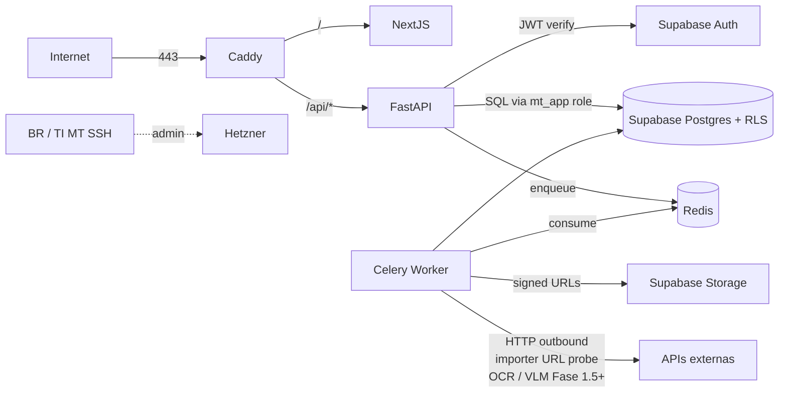
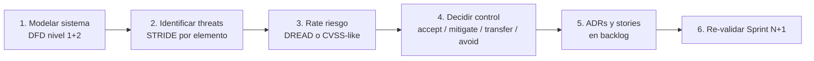
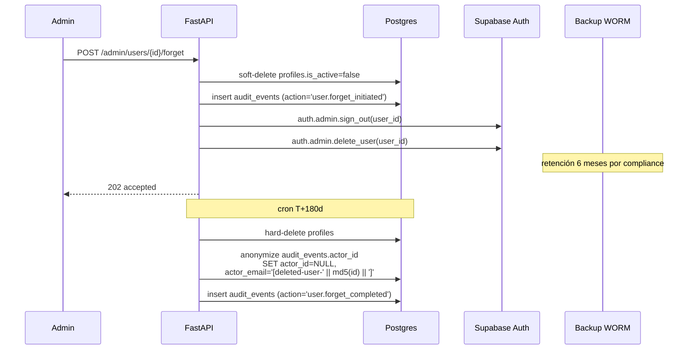

# Diseño de Security + Compliance — MT Middle East Fase 1

> Documento técnico-normativo. Cubre **hardening** (OWASP Top 10 + API Top 10 + headers + CORS + rate limit + input/SQLi/XSS/CSRF + secrets + AuthN/Z + RBAC + RLS + audit chain + dependencies + containers + network + threat modeling) y **compliance UAE** (VAT 2026, PDPL, retención, derecho al olvido) para la Fase 1 del proyecto MT Middle East MDM + Pricing.
>
> Working language: **Español**. Catálogo y normativa citados en idioma original.

---

## Tabla de contenidos

1. [Modelo de amenazas y alcance](#1-modelo-de-amenazas-y-alcance)
2. [OWASP Top 10 (2021) — mitigaciones](#2-owasp-top-10-2021--mitigaciones)
3. [OWASP API Security Top 10 (2023)](#3-owasp-api-security-top-10-2023)
4. [HTTP security headers (Caddy)](#4-http-security-headers-caddy)
5. [CORS](#5-cors)
6. [Rate limiting](#6-rate-limiting)
7. [Input validation](#7-input-validation)
8. [SQL injection prevention](#8-sql-injection-prevention)
9. [XSS prevention](#9-xss-prevention)
10. [CSRF prevention](#10-csrf-prevention)
11. [Secrets en logs](#11-secrets-en-logs)
12. [Authn / Authz](#12-authn--authz)
13. [RBAC](#13-rbac)
14. [RLS audit](#14-rls-audit)
15. [Audit log integrity (hash chain)](#15-audit-log-integrity-hash-chain)
16. [Dependency security](#16-dependency-security)
17. [Container security](#17-container-security)
18. [Network security](#18-network-security)
19. [Threat modeling — STRIDE Sprint 0](#19-threat-modeling--stride-sprint-0)
20. [Compliance — VAT UAE 2026](#20-compliance--vat-uae-2026)
21. [Compliance — PDPL UAE](#21-compliance--pdpl-uae)
22. [Compliance — GDPR equivalence (Hetzner Frankfurt)](#22-compliance--gdpr-equivalence-hetzner-frankfurt)
23. [Data retention policy](#23-data-retention-policy)
24. [Right to be forgotten flow](#24-right-to-be-forgotten-flow)
25. [Plan de implementación (épicas y stories)](#25-plan-de-implementacion-epicas-y-stories)
26. [Top 10 threats Fase 1 — análisis](#26-top-10-threats-fase-1--analisis)
27. [Open security questions](#27-open-security-questions)

---

## 1. Modelo de amenazas y alcance

### 1.1 Sistema bajo análisis

- Plataforma web interna **single-tenant** MT Middle East.
- Stack: Next.js 16 (frontend) + FastAPI (backend) + Supabase Postgres + Supabase Auth + Supabase Storage + Redis + Celery worker + Caddy reverse proxy + Hetzner Cloud (Frankfurt o Helsinki, decisión TI MT en S0 — ADR-020).
- Datos sensibles:
  - **Catálogo** (224 SKUs hoy, escala 5k–50k).
  - **Costes** y **márgenes** (info comercial sensible — ventaja competitiva).
  - **Decisiones de pricing** (auditable VAT UAE 2026).
  - **Reglas de excepción** y **tolerancias**.
  - **Datos personales mínimos** de empleados MT (3 usuarios + Admin BR).

### 1.2 Surface de ataque



### 1.3 Asunciones

- Confianza alta en la red privada Hetzner (Postgres, Redis, Worker, FastAPI hablan por private network).
- Confianza media en red pública (sólo Caddy expuesto, 80/443).
- Confianza baja en input de usuario (incluye importer XLSX, formularios y URL probes).
- 3 usuarios principales son empleados internos MT con relación laboral (no se aplica consentimiento PDPL).

### 1.4 Riesgos fuera de alcance Fase 1

- Storefront B2C (Fase 3) — fuera de scope.
- Connectors marketplaces reales (Fase 3) — sólo MockPublisher en Fase 1.
- Multi-tenant isolation — no aplica (single-tenant ADR-014).

---

## 2. OWASP Top 10 (2021) — mitigaciones

| ID | Riesgo | Status | Control concreto |
|----|--------|--------|------------------|
| **A01** | Broken Access Control | **Mitigado** | (1) RBAC backend `Depends(require_permissions(...))`; (2) RLS Postgres en TODAS las tablas `public.*`; (3) Frontend `<RbacGuard>`; (4) Tests pgTAP por policy + tests Pytest e2e por endpoint × rol. Defense in depth (§13). |
| **A02** | Cryptographic Failures | **Mitigado** | (1) TLS 1.3 forzado en Caddy (ALPN h2/h3, HSTS preload); (2) Postgres at-rest encryption gestionado por Supabase; (3) Storage at-rest gestionado por Supabase; (4) Secrets en **Doppler** (ADR-017) — nunca en repo, nunca en imágenes Docker; (5) `pgcrypto` para `channel_credentials`. |
| **A03** | Injection | **Mitigado** | (1) SQLAlchemy 2.0 con queries **siempre parametrizadas**; (2) Pydantic V2 valida cada request body / query / path; (3) Prohibido `text()` con f-strings — gate CI con regex; (4) RLS como red de seguridad. (§7, §8). |
| **A04** | Insecure Design | **Mitigado** | (1) Threat modeling STRIDE en Sprint 0 con TI MT (§19); (2) Audit-first by design (cada decisión de pricing auditada); (3) Defense in depth en cuatro capas (DB constraint + RLS + backend + UI) por ADR-010. |
| **A05** | Security Misconfiguration | **Mitigado** | (1) Hardened defaults: `DEBUG=false`, `ALLOWED_HOSTS` explícito, Pydantic Settings con `env_file=".env.prod"`; (2) Caddy emite headers de seguridad por defecto (§4); (3) Postgres `pg_hba.conf` solo private network; (4) Imágenes Docker `distroless` (§17). |
| **A06** | Vulnerable & Outdated Components | **Mitigado** | (1) **Dependabot** GitHub o **Renovate** para PRs de actualización; (2) `pip-audit` en CI Python; (3) `npm audit` + `socket.dev` en CI JS/TS; (4) **Trivy** scan de imágenes Docker en CI; (5) Política: critical CVE fix < 7 días, high < 30 días. (§16). |
| **A07** | Identification & Authentication Failures | **Mitigado** | (1) Supabase Auth (provider managed) con magic-link primario + email/password fallback; (2) Password ≥12 chars + check HaveIBeenPwned; (3) MFA TOTP **opcional Fase 1** — recomendado para `gerente_comercial` y `ti_integracion`; (4) Lockout configurado en Supabase Auth (5 fallos / IP); (5) JWT validation en backend (`aud`, `iss`, `exp`, signature contra JWKS Supabase con cache + rotación). (§12). |
| **A08** | Software & Data Integrity Failures | **Mitigado** | (1) Lockfiles (`uv.lock`, `pnpm-lock.yaml`) versionados; (2) Imágenes Docker firmadas con **cosign** + verificación en deploy; (3) **SBOM** generado por Trivy en cada release; (4) Audit log con **hash chain** tamper-evident (§15); (5) Backups WORM. |
| **A09** | Security Logging & Monitoring Failures | **Mitigado** | (1) **structlog** con request_id + user_id + trace_id; (2) **Sentry** errores frontend/backend con `beforeSend` que escruba PII; (3) **Better Stack** logs+métricas; (4) `audit_events` particionado mensual + hash chain; (5) Alertas: spike 5xx, spike 429, login fallidos, RLS bypass attempt. |
| **A10** | Server-Side Request Forgery (SSRF) | **Mitigado** | (1) Allowlist de dominios para el importer URL probe + reverse image search adapter (`competitor_images_allowlist`); (2) Resolver DNS validado, **bloqueo de RFC1918 / 169.254.169.254 / loopback**; (3) Timeouts agresivos (3 s); (4) Cliente HTTP separado (`httpx.AsyncClient(transport=SSRFGuardedTransport())`). |

---

## 3. OWASP API Security Top 10 (2023)

| ID | Riesgo | Status | Control concreto |
|----|--------|--------|------------------|
| **API1** | Broken Object Level Authorization (BOLA) | **Mitigado** | RLS con `auth.uid()` en cada tabla; backend nunca confía en `entity_id` del path sin re-check; tests automáticos por endpoint × rol verifican que rol A no lee fila de rol B. |
| **API2** | Broken Authentication | **Mitigado** | Supabase Auth + verificación JWKS server-side + rotación de claves; `force_logout(user_id)` al revocar rol (ya implementado en `mt-users-module-design` v1.1). |
| **API3** | Broken Object Property Level Authorization (BOPLA) | **Mitigado** | Pydantic `response_model` con `model_config = ConfigDict(extra="ignore")` filtra propiedades; campos sensibles (`cost_breakdown`, `margin_pct`) sólo serializados si `permission_check`; tests verifican que `comercial` no recibe campos de `gerente`. |
| **API4** | Unrestricted Resource Consumption | **Mitigado** | Rate limit slowapi por tier (§6); `MAX_UPLOAD_SIZE=50MB` en importer; query pagination obligatoria (`limit ≤ 100`); Celery worker con `task_time_limit`; Redis maxmemory + LRU. |
| **API5** | Broken Function Level Authorization | **Mitigado** | `Depends(require_permissions("prices:approve"))` en cada endpoint state-changing; tests automáticos por permiso × rol. |
| **API6** | Unrestricted Access to Sensitive Business Flows | **Mitigado** | Importer 10 batches/h por user; bulk price approve requiere reauth (re-emit JWT) si > 50 SKUs; webhook a Slack/email cuando se aprueba bulk. |
| **API7** | SSRF | **Mitigado** | Ver A10 OWASP Top 10. |
| **API8** | Security Misconfiguration | **Mitigado** | Caddy + Pydantic Settings + Trivy + GitGuardian (gitleaks pre-commit). |
| **API9** | Improper Inventory Management | **Mitigado** | OpenAPI auto-gen con FastAPI sólo expuesto en dev/staging; en prod `/docs` y `/openapi.json` requieren rol `admin`; staging y prod **dominios separados**. |
| **API10** | Unsafe Consumption of APIs (3rd party) | **Mitigado** | Cliente httpx con timeouts + circuit breaker (`tenacity`); validación de respuesta con Pydantic; allowlist de hosts; signed URLs Supabase Storage TTL ≤ 1 h. |

---

## 4. HTTP security headers (Caddy)

### 4.1 Política

- **CSP** nonce-based para scripts inline (Next.js 16 lo soporta vía `next.config.js`).
- **HSTS** max-age 1 año + `includeSubDomains` + `preload`.
- **X-Frame-Options: DENY** + **frame-ancestors 'none'** en CSP (defensa en profundidad).
- **X-Content-Type-Options: nosniff**.
- **Referrer-Policy: strict-origin-when-cross-origin**.
- **Permissions-Policy** deshabilita capabilities que no usamos.
- **COOP / COEP / CORP** para aislamiento cross-origin.

### 4.2 Caddyfile completo (snippet)

```caddyfile
{
  # global options
  email security@br-innovation.com
  servers {
    protocols h1 h2 h3
  }
}

(security_headers) {
  header {
    Strict-Transport-Security "max-age=31536000; includeSubDomains; preload"
    X-Content-Type-Options "nosniff"
    X-Frame-Options "DENY"
    Referrer-Policy "strict-origin-when-cross-origin"
    Permissions-Policy "camera=(), microphone=(), geolocation=(), payment=(), usb=(), accelerometer=(), gyroscope=(), magnetometer=(), midi=(), interest-cohort=()"
    Cross-Origin-Opener-Policy "same-origin"
    Cross-Origin-Embedder-Policy "require-corp"
    Cross-Origin-Resource-Policy "same-origin"
    # Borrar headers que filtran info de stack
    -Server
    -X-Powered-By
  }
}

(csp_app) {
  # Next.js 16 setea CSP via middleware con nonce dinámico.
  # Caddy fija un fallback si la app no manda CSP propia.
  @no_csp not header_regexp Content-Security-Policy ".+"
  header @no_csp Content-Security-Policy "default-src 'self'; script-src 'self' 'strict-dynamic' 'nonce-PLACEHOLDER' https:; style-src 'self' 'unsafe-inline'; img-src 'self' data: blob: https://*.supabase.co; font-src 'self' data:; connect-src 'self' https://*.supabase.co wss://*.supabase.co https://api.sentry.io; frame-ancestors 'none'; base-uri 'self'; form-action 'self'; object-src 'none'; upgrade-insecure-requests"
}

# ----- frontend -----
app.mtme.ae {
  import security_headers
  import csp_app
  encode zstd gzip
  reverse_proxy frontend:3000 {
    header_up X-Real-IP {remote_host}
    header_up X-Forwarded-Proto {scheme}
  }
}

# ----- backend API -----
api.mtme.ae {
  import security_headers
  encode zstd gzip
  rate_limit {
    zone anon_global { key {remote_host} events 30 window 1m }
    zone auth_endpoints {
      match { path /api/v1/auth/* }
      key {remote_host} events 5 window 1m
    }
  }
  reverse_proxy api:8000 {
    header_up X-Real-IP {remote_host}
    header_up X-Forwarded-Proto {scheme}
  }
}
```

### 4.3 Verificación

- Test automatizado en CI (`pytest -k headers`) hace request a Caddy y valida cada header.
- Mozilla Observatory + securityheaders.com pre-prod (target: A o A+).

---

## 5. CORS

### 5.1 Política

- **No** `Access-Control-Allow-Origin: *`.
- Allowlist explícita por entorno.
- `allow_credentials=True` (cookies Supabase Auth + sessions).
- Preflight cache 1 h.

### 5.2 FastAPI snippet

```python
# app/main.py
from fastapi.middleware.cors import CORSMiddleware
from app.core.config import settings

# settings.CORS_ALLOW_ORIGINS por entorno (Doppler):
# prod:    ["https://app.mtme.ae"]
# staging: ["https://staging-app.mtme.ae"]
# dev:     ["http://localhost:3000", "http://localhost:3001"]

app.add_middleware(
    CORSMiddleware,
    allow_origins=settings.CORS_ALLOW_ORIGINS,
    allow_credentials=True,
    allow_methods=["GET", "POST", "PATCH", "PUT", "DELETE", "OPTIONS"],
    allow_headers=["Authorization", "Content-Type", "X-Request-ID", "X-Idempotency-Key"],
    expose_headers=["X-RateLimit-Limit", "X-RateLimit-Remaining", "X-RateLimit-Reset"],
    max_age=3600,
)
```

### 5.3 Tests

- Pytest: request con `Origin: https://evil.com` debe fallar preflight.
- Pytest: request con `Origin: https://app.mtme.ae` debe pasar y devolver `Access-Control-Allow-Credentials: true`.

---

## 6. Rate limiting

Ver **ADR-054** para decisión arquitectónica completa. Resumen operativo:

| Tier | Cuota | Endpoints | Key |
|---|---|---|---|
| Anónimo global | 30 req/min | default sin JWT | IP |
| Autenticado global | 300 req/min | default con JWT | `auth.uid()` |
| Login / password reset / magic-link | 5 req/min | `/api/v1/auth/*` | IP |
| Importer | 10 batches/h | `POST /imports` | user |
| LLM / Embeddings / OCR / VLM | 100 req/h | comparador F1.5+ | user |
| Health checks | sin límite | `/health/*` | (whitelist) |

### 6.1 slowapi config (snippet completo)

```python
# app/middleware/rate_limit.py
from slowapi import Limiter
from slowapi.errors import RateLimitExceeded
from slowapi.util import get_remote_address
from fastapi import Request
from app.core.config import settings
from app.core.auth import current_user_id_from_jwt_or_none

def _key_user_or_ip(request: Request) -> str:
    uid = current_user_id_from_jwt_or_none(request)
    return f"user:{uid}" if uid else f"ip:{get_remote_address(request)}"

limiter = Limiter(
    key_func=_key_user_or_ip,
    storage_uri=settings.RATE_LIMIT_REDIS_URI,   # redis://redis:6379/2
    strategy="moving-window",
    default_limits=["300/minute"],
    headers_enabled=True,
    swallow_errors=False,                         # fail-closed en /auth
)

# Decoradores
@router.post("/auth/password-reset")
@limiter.limit("5/minute", key_func=lambda r: f"ip:{get_remote_address(r)}")
async def password_reset(request: Request, ...): ...

@router.post("/imports")
@limiter.limit("10/hour")
async def create_import(request: Request, ...): ...

@router.post("/comparator/ocr/{listing_id}")
@limiter.limit("100/hour")
async def ocr_listing(...): ...
```

### 6.2 Headers de respuesta

- `X-RateLimit-Limit`, `X-RateLimit-Remaining`, `X-RateLimit-Reset`, `Retry-After` (en 429).

### 6.3 Monitoreo

- Métrica `ratelimit_429_total{endpoint, tier}`.
- Alerta Better Stack si pico > 10× baseline.
- Dashboard `/admin/security` con top IPs / users por 429s en 24 h.

---

## 7. Input validation

### 7.1 Pydantic V2 models por endpoint

```python
# app/schemas/products.py
from typing import Annotated
from pydantic import BaseModel, ConfigDict, Field, AfterValidator
from decimal import Decimal
import bleach

def _sanitize_html(v: str) -> str:
    return bleach.clean(
        v,
        tags=["b", "i", "u", "em", "strong", "br", "p", "ul", "ol", "li"],
        attributes={},
        strip=True,
    )

SafeText = Annotated[str, AfterValidator(_sanitize_html)]

class ProductCreate(BaseModel):
    model_config = ConfigDict(extra="forbid", str_strip_whitespace=True)

    sku: Annotated[str, Field(pattern=r"^[A-Z0-9\-]{3,32}$")]
    name_en: Annotated[str, Field(min_length=1, max_length=255)]
    description_en: Annotated[SafeText, Field(max_length=8000)] = ""
    cost_price_aed: Annotated[Decimal, Field(ge=Decimal("0"), le=Decimal("9999999.99"), max_digits=11, decimal_places=2)]
    margin_pct: Annotated[float, Field(ge=0.0, le=500.0)]
```

### 7.2 File uploads (importer)

- Validación MIME real con **magic bytes** (`python-magic`), no fiarse de `Content-Type`.
- Whitelist: `application/vnd.ms-excel`, `application/vnd.openxmlformats-officedocument.spreadsheetml.sheet`, `text/csv`.
- `max_size = 50 MB`.
- Anti-virus opcional **ClamAV** (Fase 2; en F1 sólo log).
- Filename sanitization: `werkzeug.utils.secure_filename` + UUID prefix.

### 7.3 Pricing inputs

- Decimales con `max_digits` + `decimal_places` definidos.
- Bounds duros (no `1e308` que rompe DB).
- Validador cruzado: `proposed_price >= floor_price * 0.95` (defense pricing) en Pydantic V2 `model_validator`.

### 7.4 URL probe (importer)

```python
import ipaddress, socket
from urllib.parse import urlparse

ALLOWLIST_HOSTS = {"images.mtme.ae", "cdn.amazon.com", "noon.com"}

def validate_external_url(url: str) -> str:
    p = urlparse(url)
    if p.scheme not in ("https",):
        raise ValueError("solo https")
    if p.hostname not in ALLOWLIST_HOSTS:
        raise ValueError("host no permitido")
    # Resolver DNS y bloquear privadas
    for ai in socket.getaddrinfo(p.hostname, 443):
        ip = ipaddress.ip_address(ai[4][0])
        if ip.is_private or ip.is_loopback or ip.is_link_local or ip.is_reserved:
            raise ValueError("ip privada bloqueada")
    return url
```

---

## 8. SQL injection prevention

### 8.1 Reglas duras

- SQLAlchemy 2.0 con queries parametrizadas (default seguro).
- **Prohibido** `text()` con f-strings o `.format()`. Si se usa `text()`, debe ser con bindparams: `text("WHERE id = :id").bindparams(id=...)`.
- **Prohibido** `pd.read_sql(f"SELECT ... {x}")`.

### 8.2 Gate CI (regex)

```bash
# scripts/lint/no_sql_concat.sh
set -e
if grep -RInE "text\(\s*[fF]\"|text\(\s*['\"][^'\"]*\{" app/ ; then
  echo "BLOCKED: text() con f-string detectado"
  exit 1
fi
```

Hook en GitHub Actions:

```yaml
- name: Lint SQL concatenation
  run: bash scripts/lint/no_sql_concat.sh
```

### 8.3 Defense in depth

- RLS Postgres re-valida que el `auth.uid()` es legítimo aunque la query SQL sea explotable.
- Rol `mt_app` tiene solo `SELECT/INSERT/UPDATE/DELETE` en `public.*`. No `CREATE/DROP`. No `pg_read_server_files`.

---

## 9. XSS prevention

### 9.1 React por default

- Next.js 16 + React 19 escapan HTML automáticamente.
- **Prohibido** `dangerouslySetInnerHTML` excepto componentes auditados que sanitizan con **DOMPurify**:

```tsx
import DOMPurify from "isomorphic-dompurify";

export function MarkdownPreview({ html }: { html: string }) {
  const safe = DOMPurify.sanitize(html, {
    ALLOWED_TAGS: ["p", "br", "ul", "ol", "li", "b", "i", "em", "strong", "a"],
    ALLOWED_ATTR: ["href"],
    ALLOWED_URI_REGEXP: /^https:/,
  });
  return <div dangerouslySetInnerHTML={{ __html: safe }} />;
}
```

### 9.2 CSP nonce-based

Next.js 16 middleware:

```ts
// middleware.ts
import { NextResponse } from "next/server";
import crypto from "crypto";

export function middleware(req: Request) {
  const nonce = crypto.randomBytes(16).toString("base64");
  const csp = `default-src 'self'; script-src 'self' 'nonce-${nonce}' 'strict-dynamic'; style-src 'self' 'unsafe-inline'; img-src 'self' data: https://*.supabase.co; connect-src 'self' https://*.supabase.co; frame-ancestors 'none';`;
  const res = NextResponse.next();
  res.headers.set("Content-Security-Policy", csp);
  res.headers.set("x-nonce", nonce);
  return res;
}
```

### 9.3 Cookies

- Cookies de sesión Supabase: `HttpOnly` + `Secure` + `SameSite=Lax`.
- No hay JWT en `localStorage` para reducir XSS impact.

---

## 10. CSRF prevention

### 10.1 Mitigaciones combinadas

- **SameSite=Lax** en cookies Supabase mitiga la mayoría de CSRF clásico.
- Endpoints state-changing requieren `Authorization: Bearer <jwt>` (header, no solo cookie). Un atacante CSRF no puede setear este header cross-origin.
- Para forms server-rendered: **double-submit cookie pattern** con token CSRF:

```python
# app/middleware/csrf.py
import secrets
from fastapi import Request, HTTPException

CSRF_HEADER = "X-CSRF-Token"
CSRF_COOKIE = "csrf_token"

def csrf_protect(request: Request):
    if request.method in ("GET", "HEAD", "OPTIONS"):
        return
    cookie = request.cookies.get(CSRF_COOKIE)
    header = request.headers.get(CSRF_HEADER)
    if not cookie or not header or not secrets.compare_digest(cookie, header):
        raise HTTPException(403, "CSRF token inválido")
```

### 10.2 GET endpoints

- Nunca tienen efectos colaterales (idempotentes y safe).

---

## 11. Secrets en logs

### 11.1 structlog filter

```python
# app/core/logging.py
import structlog
import re

REDACT_KEYS = {"password", "token", "api_key", "authorization", "secret", "supabase_service_role_key", "x-csrf-token", "set-cookie", "cookie"}
REDACT_PATTERNS = [
    re.compile(r"(eyJ[A-Za-z0-9_\-\.]{20,})"),         # JWT
    re.compile(r"(sk-[A-Za-z0-9]{20,})"),              # OpenAI / similar
    re.compile(r"([A-Za-z0-9+/]{40,}={0,2})"),         # base64 long
]

def redact_processor(_, __, event_dict):
    for k in list(event_dict.keys()):
        if k.lower() in REDACT_KEYS:
            event_dict[k] = "[REDACTED]"
    # redact in any string value
    for k, v in list(event_dict.items()):
        if isinstance(v, str):
            for pat in REDACT_PATTERNS:
                v = pat.sub("[REDACTED]", v)
            event_dict[k] = v
    return event_dict

structlog.configure(processors=[
    structlog.contextvars.merge_contextvars,
    redact_processor,
    structlog.processors.add_log_level,
    structlog.processors.TimeStamper(fmt="iso"),
    structlog.processors.JSONRenderer(),
])
```

### 11.2 Sentry beforeSend

```ts
// frontend/sentry.client.config.ts
Sentry.init({
  beforeSend(event, hint) {
    if (event.request?.headers) delete event.request.headers["Authorization"];
    if (event.request?.cookies) event.request.cookies = "[REDACTED]";
    return event;
  },
});
```

```python
# backend/app/core/sentry.py
def before_send(event, hint):
    if "request" in event:
        event["request"]["headers"] = {k: ("[REDACTED]" if k.lower() in REDACT_KEYS else v) for k, v in event["request"].get("headers", {}).items()}
    return event

sentry_sdk.init(dsn=..., before_send=before_send)
```

### 11.3 Tests

- Pytest verifica que un log con `password="x"` aparece como `[REDACTED]` en stdout.

---

## 12. Authn / Authz

### 12.1 AuthN

- **Magic link primario** (email), TTL 30 min, single-use.
- **Email + password fallback**:
  - Mínimo **12 chars** (configurable Supabase).
  - Mix lower/upper/dígito/símbolo.
  - Check **HaveIBeenPwned** k-anonymity API en signup y password change (`pwnedpasswords.com/range/{prefijo_5_sha1}`).
  - Hashing Argon2 / bcrypt managed por Supabase.
- **MFA opcional Fase 1**: Supabase TOTP nativo. Recomendado / sugerido para `gerente_comercial` y `ti_integracion`. Obligatorio para `admin`.

### 12.2 Sesiones

- TTL access token: **1 h** (refresh automático).
- TTL refresh token: **7 días**.
- **Force logout en revocación de rol** — `supabase.auth.admin.sign_out(user_id)` en endpoint admin (ya implementado en `mt-users-module-design` v1.1).
- **Force logout en cambio de password** — Supabase lo hace nativamente.

### 12.3 JWT validation backend

```python
# app/core/auth.py
import httpx
from cachetools import TTLCache
from jose import jwt
from app.core.config import settings

_jwks_cache = TTLCache(maxsize=1, ttl=3600)

async def _get_jwks():
    if "jwks" not in _jwks_cache:
        async with httpx.AsyncClient(timeout=5) as c:
            r = await c.get(f"{settings.SUPABASE_URL}/auth/v1/.well-known/jwks.json")
            r.raise_for_status()
            _jwks_cache["jwks"] = r.json()
    return _jwks_cache["jwks"]

async def verify_jwt(token: str) -> dict:
    jwks = await _get_jwks()
    claims = jwt.decode(
        token,
        jwks,
        algorithms=["RS256", "ES256"],
        audience="authenticated",
        issuer=f"{settings.SUPABASE_URL}/auth/v1",
        options={"require_aud": True, "require_iss": True, "require_exp": True},
    )
    return claims
```

---

## 13. RBAC

### 13.1 Permisos granulares

Ver `mt-users-module-design.md` y ADR-005. No basta con roles — usamos **permisos** en JWT (`app_metadata.permissions`) firmados al cambiar `role_id`. Ejemplos:

```
prices:read, prices:propose, prices:approve, prices:reject, prices:export
costs:read, costs:create, costs:update
products:read, products:create, products:update, products:delete
translations:update, translations:approve
channels:read, channels:update_state
currencies:read, currencies:update_fx
imports:run, imports:config
audit:read
users:invite, users:assign_role, users:revoke
exception_rules:update
admin:*
```

### 13.2 Backend dependency

```python
def require_permissions(*perms: str):
    def _check(user = Depends(current_user)):
        granted = set(user.permissions)
        if "admin:*" in granted:
            return user
        missing = set(perms) - granted
        if missing:
            raise HTTPException(403, f"missing permissions: {sorted(missing)}")
        return user
    return _check

@router.post("/prices/{price_id}/approve")
async def approve(price_id: UUID, user = Depends(require_permissions("prices:approve"))):
    ...
```

### 13.3 Frontend guard

```tsx
// components/auth/RbacGuard.tsx
export function RbacGuard({ permissions, children, fallback = null }: Props) {
  const { perms } = useSession();
  const ok = permissions.every(p => perms.has(p) || perms.has("admin:*"));
  return ok ? children : fallback;
}

// uso
<RbacGuard permissions={["prices:approve"]}>
  <Button onClick={onApprove}>Aprobar</Button>
</RbacGuard>
```

### 13.4 RLS en BD: defense in depth

Aunque el backend filtra por permisos, **toda tabla** `public.*` tiene RLS. Si un bug skipea el `Depends`, la RLS bloquea.

---

## 14. RLS audit

### 14.1 Cobertura

Por cada tabla `public.*` declarar:

| Tabla | RLS habilitado | Policies SELECT | Policies INSERT | Policies UPDATE | Policies DELETE | Tests pgTAP |
|---|---|---|---|---|---|---|
| `profiles` | sí | self + gerente + admin | service_role only | self (subset cols) + admin | admin | sí |
| `roles` | sí | autenticado | admin | admin | admin (system=false) | sí |
| `permissions` | sí | autenticado | admin | admin | admin | sí |
| `role_permissions` | sí | autenticado | admin | admin | admin | sí |
| `user_role_audit` | sí | gerente + admin | service_role | revoked all | revoked all | sí |
| `products` | sí | comercial+gerente+ti+admin | comercial+gerente+admin | idem (own_or_admin) | gerente+admin | sí |
| `product_translations` | sí | autenticado | comercial+ | comercial+ | gerente+admin | sí |
| `product_images` | sí | autenticado | comercial+ | comercial+ | gerente+admin | sí |
| `suppliers` | sí | comercial+ | gerente+admin | gerente+admin | gerente+admin | sí |
| `costs` | sí | comercial+ | comercial+ | comercial+ | gerente+admin | sí |
| `prices` | sí | comercial+ | comercial+ (status=draft) | gerente+admin (approve) | revoked all | sí |
| `prices_history` | sí | gerente+admin | service_role | revoked all | revoked all | sí |
| `channels` | sí | autenticado | gerente+admin | ti+gerente+admin | admin | sí |
| `fx_rates` | sí | autenticado | ti+gerente+admin | revoked all (insert-only) | revoked all | sí |
| `exception_rules` | sí | autenticado | gerente+admin | gerente+admin | admin | sí |
| `import_runs` | sí | uploader+gerente+admin | comercial+ | service_role | admin | sí |
| `audit_events` | sí | gerente+admin | service_role | revoked all | revoked all | sí |
| `competitor_listings` | sí | autenticado | comercial+ | comercial+ | gerente+admin | sí |
| `competitor_listing_ocr` | sí | autenticado | service_role | service_role | admin | sí |
| `match_decisions` | sí | autenticado | comercial+ | comercial+ | gerente+admin | sí |
| `job_definitions` | sí | autenticado | gerente+ti+admin | gerente+ti+admin | admin | sí |

### 14.2 Plantilla de policies por rol

```sql
-- Plantilla genérica para tablas de catálogo (read-all autenticado, write-comercial+)
CREATE OR REPLACE FUNCTION public.has_permission(perm text) RETURNS boolean
LANGUAGE sql STABLE AS $$
  SELECT (auth.jwt() -> 'app_metadata' -> 'permissions') ? perm
$$;

ALTER TABLE public.products ENABLE ROW LEVEL SECURITY;

CREATE POLICY products_read ON public.products
  FOR SELECT TO authenticated
  USING (public.has_permission('products:read'));

CREATE POLICY products_insert ON public.products
  FOR INSERT TO authenticated
  WITH CHECK (public.has_permission('products:create'));

CREATE POLICY products_update ON public.products
  FOR UPDATE TO authenticated
  USING (public.has_permission('products:update'))
  WITH CHECK (public.has_permission('products:update'));

CREATE POLICY products_delete ON public.products
  FOR DELETE TO authenticated
  USING (public.has_permission('products:delete'));
```

### 14.3 Tests pgTAP

```sql
-- supabase/tests/rls/products.sql
BEGIN;
SELECT plan(6);

-- setup: crear usuario comercial y gerente con JWT mockeado
SELECT tests.authenticate_as_role('comercial');
SELECT lives_ok($$ INSERT INTO products (sku, name_en) VALUES ('SKU-1','Test') $$, 'comercial puede crear');
SELECT lives_ok($$ UPDATE products SET name_en='Test2' WHERE sku='SKU-1' $$, 'comercial puede editar');
SELECT throws_ok($$ DELETE FROM products WHERE sku='SKU-1' $$, '42501', NULL, 'comercial NO puede borrar');

SELECT tests.authenticate_as_role('gerente_comercial');
SELECT lives_ok($$ DELETE FROM products WHERE sku='SKU-1' $$, 'gerente puede borrar');

SELECT tests.authenticate_as_role('anon');
SELECT throws_ok($$ SELECT * FROM products $$, '42501', NULL, 'anon NO puede leer');

SELECT * FROM finish();
ROLLBACK;
```

---

## 15. Audit log integrity (hash chain)

### 15.1 Diseño

```sql
CREATE TABLE public.audit_events (
    id            uuid PRIMARY KEY DEFAULT gen_random_uuid(),
    occurred_at   timestamptz NOT NULL DEFAULT now(),
    actor_id      uuid REFERENCES auth.users(id),
    actor_email   text,                       -- redundante para evitar perder trazabilidad si user borrado
    action        text NOT NULL,              -- p.ej. 'price.approve'
    entity_type   text NOT NULL,
    entity_id     uuid,
    before        jsonb,
    after         jsonb,
    metadata      jsonb,
    prev_hash     bytea,                      -- hash de la fila anterior (mismo mes)
    current_hash  bytea NOT NULL              -- sha256(prev_hash || canonical_row_json)
) PARTITION BY RANGE (occurred_at);

-- particiones mensuales auto-creadas por job APScheduler
CREATE TABLE audit_events_2026_05 PARTITION OF audit_events
  FOR VALUES FROM ('2026-05-01') TO ('2026-06-01');
```

### 15.2 Trigger de hash chain

```sql
CREATE OR REPLACE FUNCTION public.audit_events_chain()
RETURNS trigger LANGUAGE plpgsql AS $$
DECLARE
  v_prev bytea;
  v_canon text;
BEGIN
  SELECT current_hash INTO v_prev
    FROM public.audit_events
    WHERE date_trunc('month', occurred_at) = date_trunc('month', NEW.occurred_at)
    ORDER BY occurred_at DESC, id DESC
    LIMIT 1;

  v_canon := jsonb_build_object(
    'occurred_at', NEW.occurred_at,
    'actor_id',    NEW.actor_id,
    'action',      NEW.action,
    'entity_type', NEW.entity_type,
    'entity_id',   NEW.entity_id,
    'before',      NEW.before,
    'after',       NEW.after,
    'metadata',    NEW.metadata
  )::text;

  NEW.prev_hash    := v_prev;
  NEW.current_hash := digest(coalesce(v_prev, ''::bytea) || convert_to(v_canon, 'UTF8'), 'sha256');
  RETURN NEW;
END;
$$;

CREATE TRIGGER trg_audit_events_chain
BEFORE INSERT ON public.audit_events
FOR EACH ROW EXECUTE FUNCTION public.audit_events_chain();
```

### 15.3 Append-only enforcement

```sql
REVOKE UPDATE, DELETE ON public.audit_events FROM mt_app, authenticated, anon;
GRANT  INSERT, SELECT  ON public.audit_events TO mt_app;
-- Solo service_role puede UPDATE/DELETE — uso restringido a anonimización PDPL.
```

### 15.4 Verificación periódica

- Job nightly recalcula la cadena por mes y compara con `current_hash`. Si discrepa: alerta crítica.
- Sello externo opcional Fase 2: snapshot `current_hash` mensual a un timestamping service (RFC 3161) o blockchain anchor (no obligatorio FTA pero refuerza prueba).

### 15.5 Backups WORM

- Bucket S3-compatible **separado** (Supabase Storage o bucket Hetzner) con **Object Lock** (mode=GOVERNANCE, retention=7 años).
- Dump diario de `audit_events` particiones cerradas.

---

## 16. Dependency security

### 16.1 Pipeline

| Herramienta | Lenguaje | Dónde | Acción |
|---|---|---|---|
| **Dependabot** (GitHub) | py + js | repo | PRs auto de updates |
| **Renovate** (alternativa) | py + js | repo | PRs auto, agrupados |
| **pip-audit** | py | CI | falla si CVE high+ |
| **npm audit** | js | CI | falla si CVE high+ |
| **socket.dev** | js | CI | detecta paquetes maliciosos |
| **Trivy** | docker + filesystem | CI + nightly | escaneo imágenes y deps |
| **Snyk** (opcional) | py + js + IaC | CI | SAST + license scan |
| **gitleaks** | repo | pre-commit + CI | detecta secrets |

### 16.2 Política CVEs

| Severidad | SLA fix |
|---|---|
| Critical | < 7 días |
| High | < 30 días |
| Medium | next sprint |
| Low | next quarter |

### 16.3 Lockfiles

- `uv.lock` (backend Python) y `pnpm-lock.yaml` (frontend) versionados.
- CI verifica `uv pip compile --check` y `pnpm install --frozen-lockfile`.

---

## 17. Container security

### 17.1 Base images

- Backend FastAPI / Worker: `python:3.11-slim` o `gcr.io/distroless/python3` para runtime final.
- Frontend Next.js: build con `node:22-alpine`, runtime con `gcr.io/distroless/nodejs22`.
- Multi-stage para reducir surface.

### 17.2 Hardening

- **Non-root user** (`USER 10001:10001`).
- **Read-only root filesystem** (`docker run --read-only` + `tmpfs:/tmp`).
- **No secrets en layers** — secretos vía `--mount=type=secret` en buildx, o env vars en runtime (Doppler).
- **Minimal capabilities** — `--cap-drop=ALL --cap-add=NET_BIND_SERVICE` solo si bind <1024.
- **`.dockerignore`** estricto para no leakear `.env`, `.git`, `node_modules`.

### 17.3 Image signing

```bash
# CI tras build
cosign sign --key env://COSIGN_KEY ghcr.io/br-innovation/mt-pricing-backend:${TAG}

# En deploy.sh
cosign verify --key cosign.pub ghcr.io/br-innovation/mt-pricing-backend:${TAG} || exit 1
```

### 17.4 SBOM

```bash
trivy image --format cyclonedx --output sbom.json ghcr.io/.../mt-pricing-backend:${TAG}
# adjunto al release GitHub
```

---

## 18. Network security

### 18.1 Topología Hetzner

```
┌──────────── Internet ─────────────┐
                  │ 80/443
                  ▼
        ┌──────────────────┐
        │ Caddy (public IP) │  expone solo 80/443
        └─────────┬─────────┘
                  │ private network (10.0.0.0/16)
        ┌─────────┴────────────┐
        ▼                       ▼
   ┌─────────┐             ┌─────────┐
   │ FastAPI │             │ Frontend│
   └────┬────┘             └─────────┘
        │
   ┌────┴──────────┐
   ▼               ▼
┌────────┐   ┌────────┐
│ Redis  │   │ Worker │
└────────┘   └───┬────┘
                 │
         (Supabase managed externo)
              ▼
        ┌─────────────┐
        │ Postgres    │
        │ Storage     │
        │ Auth        │
        └─────────────┘
```

### 18.2 Reglas firewall (Hetzner Cloud Firewall)

- `caddy`: ingress 80/443 from `0.0.0.0/0`; egress all.
- `api`, `frontend`, `worker`, `redis`: ingress solo desde private network.
- SSH: ingress 22 only from BR Innovation jumpbox + TI MT VPN allowlist.

### 18.3 WAF

- **Caddy + plugin caddy-ratelimit** + reglas de path matcher.
- **Cloudflare opcional** (decisión TI MT en S0; ver ADR-054 §1).

### 18.4 Egress

- Worker hace HTTP outbound (importer URL probe, OCR Vision API, VLM, FX feed). Allowlist de hosts (§7.4 SSRF).

---

## 19. Threat modeling — STRIDE Sprint 0

### 19.1 Sesión

- 90 min con TI MT + Pablo Sierra + Christian (sponsor opcional).
- Output: lista de threats + controles + risk residual + decisión accept/mitigate/transfer.

### 19.2 Flow



### 19.3 STRIDE checklist por elemento

| Elemento | Spoofing | Tampering | Repudiation | Info disclosure | DoS | EoP |
|---|---|---|---|---|---|---|
| Caddy | TLS + cert pinning opcional | header validation | logs request_id | CSP / headers | rate limit | --- |
| Frontend | Supabase JWT | CSP + SRI | --- | no PII en localStorage | --- | --- |
| FastAPI | JWT verify JWKS | Pydantic | structlog + audit_events | RBAC + RLS | slowapi | RBAC |
| Postgres | psql cert | RLS | hash chain audit | RLS | conn pool limit | rol mt_app no superuser |
| Redis | password + private net | --- | --- | private net | maxmemory | --- |
| Worker | --- | --- | task logs | --- | task_time_limit | --- |
| Storage | signed URLs TTL | object versioning | access logs | RLS bucket | quota | --- |

---

## 20. Compliance — VAT UAE 2026

### 20.1 Normativas aplicables

- **Federal Decree-Law No. 8 of 2017** on Value Added Tax (UAE) y modificaciones **Federal Decree-Law No. 18 of 2022**.
- **Federal Tax Authority (FTA)** Executive Regulation (Cabinet Decision No. 52 of 2017, modificada).
- **VAT 2026 amendments** (en publicación) — endurecen requisitos de audit trail digital y e-invoicing.
- **E-invoicing UAE Phase 1** (rollout 2026) — formato **Peppol BIS Billing 3.0** previsto.
- **Article 78** (Record Keeping): conservación mínima **5 años** de tax records (15 años para inmuebles).

### 20.2 Controles del sistema

| Requisito | Control |
|---|---|
| Audit trail completo de cambios de precio | `audit_events` con `before`/`after`/`actor`/`occurred_at`/`metadata.rule_applied`/`metadata.cost_breakdown` |
| Inmutabilidad | hash chain SHA-256 (§15) + revoke UPDATE/DELETE + backup WORM 7 años |
| Retención ≥ 5 años | política `audit_events`: hot 24m → cold parquet S3 7 años (margen sobre el mínimo legal) |
| Reproducibilidad de cálculo | FX as-of stamping + `prices_history` + `costs_history` |
| E-invoicing readiness Fase 2 | Peppol-compatible: tabla `invoices` con campos UBL 2.1 reservados; service `PeppolPublisher` puerto + adapter mock Fase 1 |
| DPA con sub-procesadores | DPA con Supabase firmado antes de go-live |

### 20.3 Reportes

- Endpoint `/admin/audit/vat-export?from=...&to=...` genera CSV con `entity`, `actor`, `before/after`, `hash`, `prev_hash`. Acceso: `gerente_comercial` + `admin`.

---

## 21. Compliance — PDPL UAE

### 21.1 Normativa

- **Federal Decree-Law No. 45 of 2021** on the Protection of Personal Data ("PDPL").
- **UAE Data Office** como autoridad supervisora.
- Executive Regulation pendiente (a 2026) — algunas provisiones aún en transición.

### 21.2 Aplicabilidad Fase 1

- 3 usuarios principales son **empleados internos MT** con relación laboral. Por **Art. 4(1)(b)** y Art. 6, el procesamiento es necesario para la ejecución del contrato laboral → **consentimiento explícito no aplica**.
- Datos personales tratados Fase 1: nombre, email, role, `last_login_at`, audit de acciones. **No** se trata "special category data" (Art. 15).
- Catálogo y costes son datos de la entidad MT, no datos personales.

### 21.3 Controles obligatorios PDPL (aplican a todo procesador, Art. 19–28)

| Derecho / obligación | Control implementado |
|---|---|
| Acceso (Art. 13) | `GET /admin/users/{id}/export-data` → ZIP con JSON de `profiles`, `user_role_audit`, `audit_events.actor_id={id}` |
| Rectificación (Art. 14) | UI `Mi perfil` permite editar `full_name`, `locale`; admin edita `role_id` |
| Eliminación / olvido (Art. 15) | `POST /admin/users/{id}/forget` → soft delete + anonimización audit (§24) |
| Portabilidad (Art. 16) | Export-data en formato JSON estructurado |
| Restricción del procesamiento (Art. 17) | `is_active=false` + Supabase admin sign_out |
| Notificación de breach (Art. 9) | < 72 h al UAE Data Office; runbook `docs/runbooks/breach-notification.md` |
| DPO designado | **TODO programa MT** — flagged como decisión externa Fase 1 |
| Registro de actividades de tratamiento (Art. 25) | `docs/processing-activities.md` mantenido por BR Innovation |
| Sub-procesadores | `docs/sub-processors.md` (Supabase, OpenAI/Cohere F1.5+, Hetzner, Sentry, Better Stack) |

### 21.4 Endpoints admin

```python
@router.get("/admin/users/{user_id}/export-data")
async def export_data(user_id: UUID, _ = Depends(require_permissions("users:export_pdpl"))):
    # devuelve ZIP con profiles, user_role_audit, eventos donde actor=user_id
    ...

@router.post("/admin/users/{user_id}/forget")
async def forget(user_id: UUID, _ = Depends(require_permissions("users:forget_pdpl"))):
    # soft-delete + anonymize audit user_id → '[deleted-user-{hash}]'
    ...
```

---

## 22. Compliance — GDPR equivalence (Hetzner Frankfurt)

Si Hetzner Frankfurt → datos en **EU** → **GDPR (Regulation 2016/679)** aplica.

| Requisito GDPR | Control |
|---|---|
| Art. 28 DPA con processor | DPA Supabase firmado |
| Art. 28 DPA sub-processors | DPA con Supabase, Hetzner, Sentry, Better Stack, OpenAI/Cohere (F1.5+); lista pública en `docs/sub-processors.md` |
| Art. 30 records of processing | mantenido en `docs/processing-activities.md` |
| Art. 32 security measures | este documento + ADR-054 |
| Art. 33 breach notification | < 72 h a la autoridad supervisora competente |
| Art. 35 DPIA | requerido si procesamiento high-risk; Fase 1 no aplica (datos no sensibles) — re-evaluar Fase 1.5 con LLM |

---

## 23. Data retention policy

| Categoría | Retención | Almacenamiento |
|---|---|---|
| `audit_events` | **7 años** (margen sobre VAT 5 años) | hot 24m + cold parquet WORM 7y |
| `import_runs` raw files | 1 año | bucket `import-batches/` con lifecycle 365d |
| `import_runs` metadata | permanente | tabla `import_runs` |
| `product_images` master | permanente | bucket `product-images/` |
| `competitor_listings` raw | 90 días post-decisión humana | bucket `competitor-images/` con lifecycle |
| User accounts inactivos (sin login >12m) | 1 año + soft-delete + 6 meses backup → hard delete | `profiles.is_active=false` + cron mensual |
| `prices_history`, `costs_history` | permanente | tabla particionada |
| Sentry events | 90 días | gestionado Sentry plan |
| Logs Better Stack | 30 días hot + 1 año cold | gestionado plan |

Cron `prune_retention` (Celery Beat semanal) revisa cada categoría y aplica la política.

---

## 24. Right to be forgotten flow

### 24.1 Diagrama



### 24.2 Anonimización vs eliminación

- **No** se borran las filas de `audit_events` con `actor_id = forgotten_user`. Eso rompería:
  - El hash chain (§15).
  - El audit trail VAT (§20).
- **Sí** se reemplaza:
  - `actor_id` → `NULL`.
  - `actor_email` → `'[deleted-user-{md5}]'` (hash determinístico para correlación, pero no PII).
  - Cualquier `metadata.user_email` u otros campos PII → redactado.
- Esta anonimización **preserva la integridad del hash chain** porque el hash se calculó al `INSERT`; un `UPDATE` posterior sólo modifica los campos PII pero no los `current_hash` ya calculados (los nuevos eventos sí parten del último `current_hash`).
- Excepción al revoke UPDATE: `service_role` ejecuta `UPDATE` solo en función `pdpl_anonymize(user_id)` con audit propio.

```sql
CREATE OR REPLACE FUNCTION public.pdpl_anonymize(p_user uuid)
RETURNS int LANGUAGE plpgsql SECURITY DEFINER AS $$
DECLARE n int;
BEGIN
  UPDATE public.audit_events
     SET actor_id = NULL,
         actor_email = '[deleted-user-' || encode(digest(p_user::text, 'sha256'), 'hex') || ']',
         metadata = (metadata - 'user_email' - 'user_phone')
   WHERE actor_id = p_user;
  GET DIAGNOSTICS n = ROW_COUNT;
  INSERT INTO public.audit_events(actor_id, action, entity_type, entity_id, metadata)
    VALUES (NULL, 'user.forget_completed', 'profiles', p_user, jsonb_build_object('rows_anonymized', n));
  RETURN n;
END;
$$;
REVOKE EXECUTE ON FUNCTION public.pdpl_anonymize(uuid) FROM PUBLIC;
GRANT  EXECUTE ON FUNCTION public.pdpl_anonymize(uuid) TO service_role;
```

---

## 25. Plan de implementación (épicas y stories)

### 25.1 EP-1A-15 — Security hardening (~21 SP)

| Story | Descripción | SP | Sprint |
|---|---|---|---|
| SEC-01 | Rate limiting slowapi + caddy-ratelimit + tiers + 429 dashboard | 3 | 1 |
| SEC-02 | Caddy security headers (CSP nonce + HSTS preload + COOP/COEP/CORP) + tests | 2 | 1 |
| SEC-03 | CORS allowlist + tests cross-origin | 1 | 1 |
| SEC-04 | Pydantic V2 validators + bleach sanitization + magic-byte file upload | 3 | 1 |
| SEC-05 | structlog redaction + Sentry beforeSend + tests | 2 | 1 |
| SEC-06 | RLS policies + pgTAP tests para todas tablas `public.*` | 5 | 1–2 |
| SEC-07 | audit_events hash chain + verify nightly job + WORM backup | 3 | 2 |
| SEC-08 | Dependabot + pip-audit + npm audit + Trivy en CI | 1 | 0–1 |
| SEC-09 | cosign image signing + SBOM en release | 1 | 2 |

### 25.2 EP-1A-16 — Compliance & legal (~13 SP)

| Story | Descripción | SP | Sprint |
|---|---|---|---|
| COM-01 | Threat modeling STRIDE Sprint 0 + ADR de top threats | 2 | 0 |
| COM-02 | Endpoints `/admin/users/{id}/export-data` y `/forget` + anonymize fn | 3 | 2 |
| COM-03 | `docs/processing-activities.md` + `docs/sub-processors.md` + `docs/runbooks/breach-notification.md` | 2 | 1 |
| COM-04 | Política retención + cron `prune_retention` | 2 | 2 |
| COM-05 | DPA Supabase + DPAs sub-procesadores firmados | 1 | 0 |
| COM-06 | Audit VAT export endpoint + tests integridad hash chain | 2 | 2 |
| COM-07 | DPO designation flag + escalado a programa MT | 1 | 0 |

---

## 26. Top 10 threats Fase 1 — análisis

| # | Threat | STRIDE | Vector | Impact | Likelihood | Risk | Control | Residual |
|---|---|---|---|---|---|---|---|---|
| 1 | Compromiso credenciales `gerente_comercial` → aprobación masiva precios falsos | S+T+E | Phishing email | Alto (margen + reputación) | Med | **Alto** | MFA TOTP + audit chain + alerta bulk approve >50 SKUs + reauth | Bajo |
| 2 | SQL injection en importer XLSX | T+I | celda con payload | Alto (RCE potencial / data leak) | Bajo | Med | SQLAlchemy parametrizado + lint CI + RLS | Muy bajo |
| 3 | SSRF via importer URL probe → metadata IMDS Hetzner | I | URL maliciosa | Alto (token cloud) | Med | **Alto** | Allowlist + bloqueo RFC1918 + IMDSv2 | Bajo |
| 4 | RLS bypass por bug en backend que usa `service_role` indebidamente | I+E | code bug | Alto | Bajo | Med | Conn pool con `mt_app` rol; `service_role` solo en jobs admin; tests | Bajo |
| 5 | Tampering de `audit_events` (insider TI MT) | T+R | UPDATE directo en DB | Crítico (VAT compliance) | Bajo | **Alto** | hash chain + REVOKE UPDATE + WORM backup + nightly verify | Muy bajo |
| 6 | Brute force login Comercial | S | botnet | Med | Med | Med | Supabase rate limit + slowapi 5/min + lockout | Bajo |
| 7 | Dependency con CVE crítica (eg. supply chain) | T | malicious npm | Alto | Med | **Alto** | Trivy + socket.dev + cosign + SBOM | Bajo |
| 8 | Leak de costes vía signed URL Storage compartida | I | URL forwarded | Med | Med | Med | TTL ≤ 1 h + RLS bucket + audit access logs | Bajo |
| 9 | DoS volumétrico endpoint `/api/v1/auth/magic-link` | D | botnet | Med | Med | Med | Caddy rate limit IP + Cloudflare opcional | Bajo |
| 10 | Olvido de revocar acceso a empleado MT que sale | E | proceso humano | Alto | Med | **Alto** | Cron mensual review accounts inactivos + integración con HR (TODO Fase 2) + force_logout en revoke role | Med |

---

## 27. Open security questions

| # | Pregunta | Owner | Plazo |
|---|---|---|---|
| Q1 | ¿TI MT acepta Cloudflare en frente de Caddy? Implicaciones residencia datos PDPL | TI MT | S0 |
| Q2 | ¿MFA obligatoria Fase 1 para `gerente_comercial`? (recomendado, no impuesto) | Christian + TI MT | S0 |
| Q3 | ¿Quién es DPO designado en MT bajo PDPL Art. 11? Decisión jurídica MT | MT legal | S0 |
| Q4 | ¿Hetzner Frankfurt (EU/GDPR) o Helsinki (EU/GDPR) o region UAE (PDPL local)? | TI MT + ADR-020 | S0 |
| Q5 | ¿DPIA formal requerida Fase 1.5 cuando entren LLM/Vision APIs? | BR Innovation + MT | F1.5 |

---

## TODOs marcados como dudas (alineado a §27)

1. **DPO designation (PDPL Art. 11).** No está claro si MT Middle East ya tiene un DPO oficial registrado. Si no, hay que decidir: (a) MT designa interno, (b) BR Innovation ofrece DPO compartido, (c) DPO externo contratado. Decisión legal MT, **flagged a programa MT** y bloquea go-live regulatorio. Revisar texto exacto de Executive Regulation cuando se publique.
2. **Aplicabilidad PDPL al consentimiento.** El razonamiento de "empleados internos = no consentimiento explícito" se apoya en Art. 4(1)(b) y la analogía GDPR. Falta validación con abogado UAE — el Executive Regulation aún no está publicado en su forma final a 2026-05 y podría endurecer requisitos. Tratar como **interpretación jurídica preliminar**, no opinión legal.
3. **Residencia de datos UAE vs EU.** Si TI MT exige residencia en UAE para PDPL, Supabase no tiene region UAE (a confirmar Sprint 0); habría que evaluar self-host Postgres en Hetzner UAE o cambiar provider. Decisión cruzada con ADR-020 (residencia cloud). Impacta DPA.
