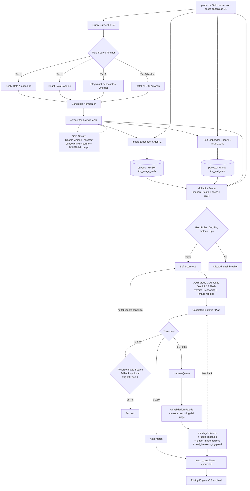
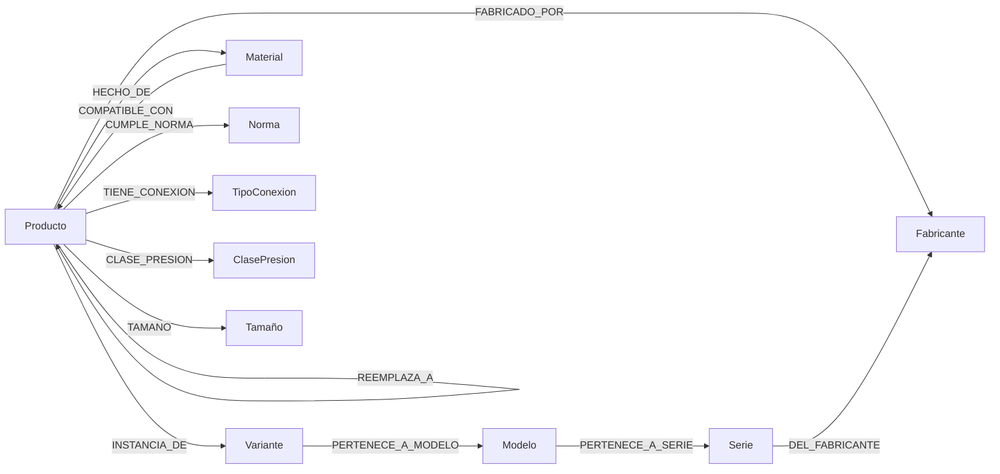
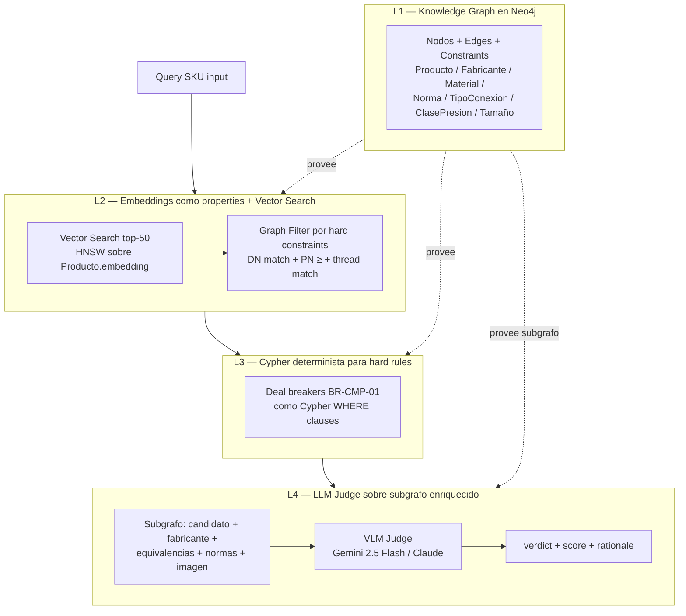

# Research Spike — Sistema de Comparación de Productos (MT Middle East)

## Changelog

| Versión | Fecha | Cambios |
|---------|-------|---------|
| 1.0 | 2026-05-06 | Versión inicial del spike (sourcing, embeddings, scoring multi-dim, calibración, UI humana, arquitectura, riesgos, recomendación). |
| 1.1 | 2026-05-06 | Integra recomendación externa al sponsor (2026-05-06): nueva capa OCR sobre imágenes de competidores (Tarea 3.5), reverse image search como fallback (Tarea 6.5), VLM como audit-grade judge con razonamiento natural-language, perfiles ampliados de proveedores comerciales (Centric, DataWeave, Price.com, Profitmind, Skuuudle), regla operativa build-vs-buy, POC explícito de 500 SKUs × 3 marketplaces, capa humana reframeada como infraestructura permanente, Elasticsearch+RRF como upgrade path Fase 1.5/2, sección nueva de frameworks de orquestación (LangChain / LlamaIndex / Cohere). Fuente: recomendación externa al sponsor (2026-05-06).|
| 1.2 | 2026-05-06 | Añade Tarea 11 — Roadmap evolutivo RAG → Hybrid → GraphRAG: por qué GraphRAG es potente para PVF, diseño del knowledge graph (nodos / edges / Cypher), arquitectura de 4 capas, stack práctico (Neo4j + neo4j-graphrag + LlamaIndex / Microsoft GraphRAG), roadmap por fases con targets escalonados (85-92 % → 92-95 % → 96-98 %), recursos requeridos (ontólogo PVF), seeds disponibles (`Compatibilidad Materiales V4`, PIM, catálogo, whitelist fabricantes, normas), riesgos y mitigaciones. Documentado en ADR-038, ADR-039, ADR-040, ADR-041; supersede ADR-037. |

> **Workstream R&D paralelo a Fase 1a/1b**. Decisión gate en S0–S2: si el subsistema no alcanza umbrales (false-positive < 2 %, false-negative < 10 %, calibración ≥ 85 %), se difiere a Fase 1.5 sin bloquear el resto del Fase 1. Output del demo actual: `match_scorer_v2.py` falla en 15 % del catálogo (34/224 sin match + 34 NONE). Este spike rediseña el subsistema, no lo porta.

## 0. TL;DR (Recomendación final priorizada)

**Stack mínimo viable Fase 1b (cierre S6)** — arrancar mañana:

| Capa | Componente | Por qué |
|------|------------|---------|
| Sourcing primario candidatos | **Bright Data Web Scraper API (Amazon UAE + Noon UAE)** pay-per-success $1.50/1K | Costo bajo, sin proxies propios, legalidad cubierta por proveedor, cobertura .ae nativa. |
| Sourcing secundario (specs) | **Scraping whitelist fabricantes** (Pegler, Arco, Giacomini, Apollo, Nibco) con Playwright propio | Specs estructuradas DN/PN/material, baja frecuencia (mensual), bajo riesgo. |
| Embeddings imagen | **SigLIP 2 SO400M** self-hosted (HuggingFace) o **Vertex AI multimodal** | Top en clasificación + multilingüe + texto-imagen alineados. Tradeoff vs DINOv3: SigLIP gana en retrieval con texto, DINOv3 gana en dense prediction. |
| Embeddings texto técnico | **OpenAI text-embedding-3-large** ($0.13/1M tokens, 3072d → truncar a 1024d) | Multilingüe (EN/AR), Matryoshka, MIRACL 54.9 %. |
| LLM tie-break premium | **Gemini 2.5 Flash** ($0.039/imagen approx) o **Claude Sonnet 4.6** vision | Cascada: solo se llama cuando shortlist tiene 2+ candidatos cercanos. |
| Reglas duras | Code (Python/TS) sobre `products.specs` JSONB | DN/PN/material/tipo = "deal breakers" antes del scoring blando. |
| Calibración | **Isotonic regression** (sklearn) sobre dataset etiquetado ≥ 200 pares | > 1000 muestras eventualmente; arrancar con isotonic fallback Platt si N < 200. |
| Vector store | **pgvector + HNSW** sobre Postgres existente | < 1M filas, evita lock-in, integrado con `competitor_listings`. |
| UI validación | **Tinder-style swipe** (match / no-match / dudoso) + filtros por tier confianza | Triage rápido; estimado 5-8 s/par para validador entrenado. |

**Costo mensual estimado del stack mínimo para 5 000 SKUs** (1 ciclo/semana, ~5 candidatos/SKU, refresh imágenes + texto mensual):

| Item | Volumen | Coste |
|------|---------|-------|
| Bright Data Amazon.ae + Noon (5k SKU × 4 sem × 5 candidatos = 100k requests/mes) | 100k | **$150/mes** |
| Scraping fabricantes whitelist (~5k pages/mes vía proxy compartido) | 5k | **$10-20/mes** |
| OpenAI text-embedding-3-large (5k SKU + 100k candidatos × ~80 tokens × 1 refresh/mes) | ~8.4M tokens | **~$1/mes** |
| SigLIP 2 self-hosted en T4 GPU (Hetzner / Lambda) — o Vertex AI multimodal $0.0002/img × 100k = $20 | 100k imgs | **$50-150/mes** (autohost) o **$20/mes** (Vertex) |
| Gemini 2.5 Flash tie-break (~10 % candidatos en zona gris × 100k = 10k llamadas × $0.001 prompt) | 10k | **$10/mes** |
| pgvector — sin coste incremental (corre en Postgres existente) | — | $0 |
| Validador humano (1 freelance UAE 10h/sem × $15/h × 4 sem) | 40h/mes | **$600/mes** |
| **Total stack tecnológico** | | **~$240-340/mes** |
| **Total con humano** | | **~$840-940/mes** |

A 50 000 SKUs el coste tecnológico escala ~10× (≈ $2 400-3 400/mes); el humano se satura y se requieren 3-5 validadores o triage agresivo por confianza.

---

## 1. Tarea 1 — Estrategia de búsqueda y sourcing de candidatos competitivos

### 1.1 Tabla comparativa de fuentes

| Fuente | Cobertura UAE / Amazon.ae | Coste mensual estimado para 5k SKUs (5 cand/SKU semanal = 100k req) | Frecuencia razonable | Estabilidad legal | Latencia | Mantenimiento |
|---|---|---|---|---|---|---|
| **Scraping Selenium/Playwright propio + ProtonVPN** (status quo demo) | Amazon.ae sí; Noon sí | $0 infra + $5-20/mes VPN + 5-10 h/mes mantenimiento (≈ $250-500 dev) | Diaria si infra aguanta | Riesgo TOS Amazon (ToS clickwrap explícitamente prohíbe scraping); civil, no penal | 90 min para 224 SKU según runbook v4 → escalado lineal = > 30 h/100k → infra colapsa | **Alto**: CAPTCHA, IP bans, cambios DOM, Selenium maintenance. Demo ya pidió ProtonVPN UAE. |
| **Bright Data Web Scraper API (Amazon)** | Amazon.ae sí (24 dominios soportados) — pay-per-success | 100k req × $1.50/1K = **$150/mes** | Diaria | Cubierto por proveedor (compliance contractual) | < 5 s P95 | **Bajo**: endpoint REST, JSON estructurado |
| **Oxylabs Amazon Scraper API** | Amazon.ae sí | $49/mes 17 500 results → necesario plan superior; ~$200-400/mes | Diaria | Cubierto por proveedor | < 5 s | Bajo |
| **Keepa API** | **Amazon.ae NO listado** (cubre .com .co.uk .de .co.jp .fr .ca .it .es .in .mx) | €49-€53 500/mes plan | — | Acuerdo formal con Amazon (data partner) | < 1 s | Bajo, pero **sin UAE descarta** la mayor parte del use-case |
| **DataForSEO Amazon API** | Amazon.ae sí | $0.01/task setup + $0.0001/item; 100k items ≈ **$10-15/mes** | Bajo demand | Compliance proveedor | 5-30 s queue mode (Standard $0.0006) | Bajo, pero data fields menos rica que Bright Data |
| **SerpApi Amazon** | Amazon.ae NO confirmado en docs (22 dominios — listado restringe a US/UK/CA/AU/DE...) | $75/mes 5 000 búsquedas; plan Big $475/mes 75 000 | Limitada por plan | Compliance proveedor; no rollover | < 3 s | Bajo, pero coste por búsqueda alto |
| **RapidAPI / OpenWebNinja Real-Time Amazon Data** | 24 países incluido AE | Plan Mega ~$100-300/mes (no transparente; varía); marketplace fee adicional | Diaria | Riesgo proveedor third-party | 1-3 s | Medio: dependes de mantenimiento del third-party |
| **Amazon Product Advertising API 5 (PA-API) UAE** | UAE sí (en_AE) | Gratis pero **PA-API se deprecia 30-Abr-2026 / 15-May-2026** y "no longer accepting new customers" | N/A | **Inviable Fase 1**: dejará de funcionar | < 1 s | N/A |
| **Amazon Creators API (sucesor PA-API)** | UAE TBD | Gratis pero requiere **cuenta Associate aprobada + 10 qualifying sales/30 días** + nuevas credenciales | TBD | Oficial pero gating estricto; orientado a affiliate, no a price intelligence | < 1 s | **Bloqueador**: MT no es Associate y no genera sales en Amazon UAE en Fase 1 |
| **Noon UAE — sin API oficial** | Sí vía scrapers third-party (Apify, Crawlbase, Promptcloud, Retailgators) | $50-300/mes según tier Apify; Crawlbase pay-as-you-go | Diaria | Mismo TOS-risk que Amazon; menos enforced | 3-10 s | Medio |
| **Tradeling.com** | Marketplace B2B MENA Dubái | Sin API pública; scraping + posible partnership futuro Fase 4 | Mensual | TOS estándar | — | Bajo prioridad Fase 1 |
| **Mistermart, Ubuy UAE** | Sub-mercados consumer; cobertura técnica baja para válvulas | Scraping propio | — | TOS estándar | — | Bajo prioridad Fase 1; útil para outliers |
| **Catálogos fabricantes whitelist** (Pegler, Arco, Giacomini, Apollo, Nibco) | Cobertura **specs canónicas** (ficha técnica DN/PN/material/PDF) — no precio | $10-20/mes proxy compartido + Playwright propio | Mensual (catálogo cambia poco) | Sin TOS de marketplace; sólo robots.txt | 1-3 s | **Medio** (un scraper por marca) pero **alta fidelidad** |

### 1.2 Recomendación priorizada (mix de fuentes)

1. **Tier 1 — primario, datos vivos de mercado**: **Bright Data Web Scraper API** para Amazon.ae + Noon UAE (vía endpoint genérico o adapter custom). Razón: pay-per-success ($1.50/1K), cobertura nativa UAE, sin gestión de proxies, contractualmente blindado contra el riesgo TOS. Coste predecible.
2. **Tier 2 — refuerzo de specs canónicas**: Scraping propio Playwright sobre **catálogos fabricantes whitelist** (mensual, baja frecuencia). Razón: las hojas de fabricante traen DN/PN/material como datos estructurados (PDF técnicos / fichas product), justo lo que falta a Amazon.ae para "deal breakers". 5 marcas → 5 scrapers; mantenimiento acotado.
3. **Tier 3 — refresh barato y backup**: **DataForSEO Amazon API** ($10-15/mes a 100k items) como fallback si Bright Data falla y como fuente de **batch nocturno** redundante. Coste insignificante.
4. **Descartado Fase 1**:
   - **Keepa**: sin Amazon.ae.
   - **PA-API / Creators API**: deprecación + gating Associate.
   - **Scraping Selenium propio**: insostenible operativamente (ya lo demostró el demo a 95 min/run).
   - **SerpApi**: cobertura UAE sin confirmar oficialmente + sin rollover encarece.
5. **Reservado Fase 2+**: Tradeling.com partnership formal (B2B MENA, MT puede listar como vendor — palanca dual).

### 1.4 Hybrid search lexical + semántico (Elasticsearch + RRF) — upgrade path

> Añadido v1.1 a partir de la recomendación externa al sponsor (2026-05-06).

- **Patrón**: combinar búsqueda lexical (BM25 — Elasticsearch o Postgres `tsvector`) con búsqueda semántica (vector / embeddings) y fusionar con **Reciprocal Rank Fusion (RRF)**. Referencia: Elastic blog *"Hybrid search using Reciprocal Rank Fusion"*.
- **Por qué importa**: lexical captura matches exactos (códigos `DN50`, `PN16`, part numbers `PVF-1234`) que el vector puede diluir; semántico captura sinónimos. RRF combina rankings sin necesidad de calibrar pesos.
- **Trade-off**:
  - **pgvector + tsvector** (Fase 1): "todo en Postgres", una sola dependencia, RRF se implementa en SQL o en aplicación.
  - **Elasticsearch + RRF**: añade contenedor de operación, pero ofrece analizador árabe nativo (`arabic` analyzer con stemming + normalización), mejor BM25 multilingüe, y RRF nativo desde 8.9.
- **Recomendación Fase 1**: mantener pgvector + tsvector lexical simple; aplicar RRF en código (función SQL CTE union ranking).
- **Trigger upgrade Fase 1.5/2 → Elasticsearch**: catálogo > 100 000 entidades activas, o necesidad de búsqueda lexical multilingüe AR rica (cuando AR pase a expansión default), o requerimiento de cross-language retrieval.
- Decisión documentada en **ADR-026**.

### 1.5 Perfiles ampliados de soluciones comerciales (multimodal product matching)

> Añadido v1.1 a partir de la recomendación externa al sponsor (2026-05-06). Para cada uno: **pedir demo con 50-100 fotos reales de válvulas MT contra catálogos de competidores; medir falsos positivos antes de comprometer**.

| Vendor | Propuesta de valor | Fortaleza para MT | Coste indicativo | Riesgo |
|--------|--------------------|-------------------|------------------|--------|
| **Centric Software** (Centric Pricing & Inventory + Centric AI Match) | Reconocimiento de imagen que claim 99 % precisión y matching across color variations; orígenes en fashion/PLM con expansión a retail amplio. | Match across variations es relevante para válvulas con acabados diferentes (cromado / latón / pintado) del mismo SKU lógico. | Enterprise; pedir cotización. | Optimización fashion-first; falta evidencia industrial PVF. |
| **DataWeave** | Pipeline multimodal retrained para retail; maneja diferencias de pose / fondo / iluminación / orientación; equipo QA humano valida matches. | QA humano alineado con principio "capa humana permanente". Robustez a fotos heterogéneas de marketplaces UAE. | SaaS por volumen; pedir demo. | Cobertura UAE + B2B industrial sin evidencia pública; verificar. |
| **Price.com Visual Search API** | API pre-construida con ~2 mil millones de relaciones de producto precomputadas; integración como servicio. | Time-to-value mínimo si la cobertura UAE existe. | Pay-per-call. | Cobertura industrial PVF en MENA muy probablemente baja; verificar. |
| **Profitmind** | AI agéntica que analiza apariencia + descripciones + specs + atributos auto-generados simultáneamente. | Multi-señal nativo; coincide con la arquitectura del spike. | SaaS; pedir cotización. | Vendor joven; revisar madurez + roadmap. |
| **Skuuudle** | Servicio establecido de competitor matching; ofrece trials gratis con catálogos reales. | Trial gratis = ideal para POC ("pedir que matcheen 200 válvulas específicas"). | Trial libre + SaaS. | Foco histórico retail consumer; falta evidencia industrial. |
| **Intelligence Node** | Competitive intelligence con refresh de datos a 10 segundos y capa QA humano. | Refresh casi-real-time + QA humano alineado con dirección del spike. | Enterprise; pedir cotización. | Caro; orientado a mercados grandes. |
| **XPLN** | Multimodal-native; fuerte en mercados europeos. | Tecnología afín; equipo EU puede dar soporte horario compatible UAE. | Enterprise; pedir cotización. | Cobertura .ae a verificar. |

**Acción concreta S0**: lanzar 2-3 demos en paralelo (Intelligence Node + Skuuudle como mínimo, opcional Centric o DataWeave) con un set fijo de 200 SKUs MT representativos. Esta demo NO sustituye al build mínimo; corre **en paralelo** y alimenta la decisión build-vs-buy del Gate G2/G4.

### 1.3 Cobertura esperada para 5 000 SKUs

- **Amazon.ae**: sub-cobertura conocida en válvulas industriales (sólo 224/224 actuales tienen ~85 % de cobertura). A 5k SKUs se estima 60-75 % de cobertura.
- **Noon UAE**: cobertura más débil en industrial; complementaria.
- **Fabricantes whitelist**: cubre 95 %+ de specs canónicas para SKUs de marca (Pegler, Arco, Giacomini, Apollo, Nibco) que es ~73 % del catálogo demo (165/224).
- **Cobertura combinada esperada** ≥ 90 % SKUs con ≥ 1 candidato auditable (cumple métrica brief).

---

## 2. Tarea 2 — Estrategia de queries multi-idioma (EN/AR)

### 2.1 Construcción de queries

Modelo de query por SKU sigue 4 niveles (ladder), reformulación automática si "no result":

| Nivel | Plantilla | Ejemplo SKU `PEGLER-VG-DN50-PN16` |
|---|---|---|
| L0 | `{brand} {product_name}` | `Pegler gate valve` |
| L1 | `{brand} {type} DN{dn} PN{pn}` | `Pegler gate valve DN50 PN16` |
| L2 | `{type} {material} DN{dn}` | `gate valve brass DN50` |
| L3 | `{family_en} {dn}` (descriptivo genérico) | `industrial valve 2 inch` |
| L4 | `{name_en}` palabras clave fragmentadas | `gate valve 2"` |

- **Disparo**: arranca en L1 (mejor para SKUs con marca conocida); si `< 3 candidatos` con score técnico ≥ 50, sube a L2; si `0 candidatos`, baja a L3/L4.
- **SKUs OEM/genéricos** (sin marca whitelisted): arrancan en L2.

### 2.2 ¿AR vs EN para Amazon.ae / Noon UAE?

- **Recomendación: EN canónico primario, AR como expansión condicional** (no traducción default).
- Justificación:
  - Amazon UAE listings de hardware industrial son **predominantemente EN** (catálogos B2B internacionales). AR aparece más en consumer/retail.
  - Noon UAE: catálogos mixtos, AR más presente en consumer.
  - Traducir a AR técnico requiere glosario específico (válvulas: صمام بوابة، صمام كروي، نحاس، فولاذ...). Riesgo: traducción pobre genera ruido de candidatos.
- **Cuando sí AR**: para SKUs con `< 3 candidatos en EN` después de L0-L2, expandir con LLM-translation contextual (Gemini Flash $0.001/llamada) hacia AR técnico, glosario curado por término.
- Costo expansión AR: < $5/mes a 5k SKUs (sólo 10-20 % cae a expansión).

### 2.3 Query expansion / sinónimos técnicos

- Diccionario controlado `tech_synonyms.yaml` (vivo, mantenido por Comercial):
  - `gate valve = válvula de compuerta = صمام بوابة`
  - `ball valve = válvula de bola`
  - `check valve = válvula de retención = clapet anti-retorno`
  - `brass = latón = نحاس`
  - `DN50 = 2" = 2 inch`
- Multi-query: por SKU se lanzan 1 query primaria + 1-2 expansiones; los candidatos se deduplican por ASIN/URL antes de scoring.

### 2.4 Manejo de "no result" + reformulación automática

- Si `n_candidates == 0` después de L4, marcar SKU `data_quality.competitor_search = empty` y enviarlo a cola humana de **investigación manual** (task: validar nombre canónico, sugerir keywords nuevos al diccionario).
- KPI: % de SKUs en `empty` < 8 % al cierre Fase 1b.

---

## 3. Tarea 3 — LLM/Modelos para comparación de imágenes

### 3.1 Tabla comparativa (12 modelos evaluados)

| Modelo | Modo | Coste/imagen (input) | Latencia | Fortaleza válvulas industriales | Debilidad | Benchmark relevante |
|---|---|---|---|---|---|---|
| **GPT-4o vision** | API OpenAI | ~$0.005-0.01/img (token-based, $2.50/1M input) | 1-3 s | Razonamiento textual + imagen; excelente para "explicar la diferencia" | No es embedding-friendly; cada llamada cuesta. No retrieval. | General; no específico industrial |
| **GPT-5 vision** (oct-2025) | API OpenAI | $10/1M input → ~$0.01-0.05/img complejo | 2-5 s | Mejor razonamiento que 4o | Caro a escala 100k+ | General |
| **Claude 4.7 Opus vision** | API Anthropic | $5/1M input + nuevo tokenizer 35 % más tokens → ~$0.01-0.03/img | 1-3 s | 98.5 % visual-acuity, hasta 3.75 MP | Más caro que Sonnet; overkill para shortlist | Visual acuity Anthropic |
| **Claude Sonnet 4.6 vision** | API Anthropic | $3/1M input → ~$0.005-0.015/img | 1-2 s | 40 % más barato que Opus, calidad cercana | — | General |
| **Gemini 2.5 Pro vision** | API Google | $1.25/1M input (≤200k) → ~$0.003-0.008/img | 1-2 s | Multimodal nativo; razonamiento técnico fuerte | Output a 1024×1024 cuesta $0.039 (output) | General |
| **Gemini 2.5 Flash vision** | API Google | ~$0.001/img input + $0.039/img output 1024px | <1 s | **Mejor coste/latencia**; bueno para tie-break en cascada | Menos preciso en razonamiento abstracto | General |
| **Gemini 3 Flash vision** (preview) | API Google | $0.045-0.151/img output según resolución | <1 s | Calidad superior a 2.5 Flash | Más caro; preview status | General |
| **CLIP ViT-L/14** (OpenAI 2021) | Self-hosted | ~$0.0001/img (GPU compartida) | 50-100 ms | Embeddings 512d/768d alineados imagen-texto | Datado; underperforma SigLIP/DINOv3 en industrial | ImageNet baseline |
| **OpenCLIP** (LAION) | Self-hosted | Igual CLIP | Igual | Variantes ViT-H, ViT-G | Igual CLIP | Mejor que CLIP base en zero-shot |
| **SigLIP 2 SO400M** (Google) | Self-hosted (HF) o Vertex | ~$0.0002/img (Vertex multimodal) o GPU autohost | 50-100 ms | **89.1 % ImageNet**; sigmoid loss más estable; ranking general top en clasificación | Underperforma DINOv3 en dense prediction y segmentación | ImageNet 89.1 %, Furniture v1 R@1 57.4 |
| **DINOv3 ViT-L/16** (Meta 2025) | Self-hosted (HF, licencia comercial OK) | ~$0.0001/img GPU autohost | 80-120 ms | **88.4 % ImageNet, 86.6 mIoU PASCAL**; instance-level retrieval en industrial out-of-distribution; **ILIAS 36.1 mAP@1000 (top open-source)** | Solo imagen (no alineado a texto); requires text encoder separado | DINOv3 paper 2508.10104; ILIAS benchmark |
| **GEM v5.1** (proprietario) | API/closed | TBD | TBD | **63.4 R@1 Clips-and-Connectors v1** (vs DINOv3 26.4); diseñado para industrial | Closed-source; vendor lock-in; pricing TBD | arxiv 2603.17186 — Visual Product Search Benchmark |
| **AWS Rekognition Custom Labels** | API AWS | $4/h inference + $X training | 200-500 ms | Custom labels entrenable con dataset propio | Modelo cerrado; requiere etiquetar dataset (cost humano) | N/A (specific domain) |
| **Azure Custom Vision** | API Azure | $10/h training + $2/1k predictions + $0.70/1k storage | 100-300 ms | Custom training accesible | Performance < SigLIP/DINOv3 | N/A |
| **Vertex AI Vision (multimodal embedding)** | API Google | $0.0002/img embedding | 50-100 ms | Imagen + texto alineados; gestión gestionada | Menor control vs autohost | Comparable SigLIP |

**Hallazgo clave 2026**: el paper *Visual Product Search Benchmark* (arxiv 2603.17186, marzo 2026) confirma que **modelos generalistas top (DINOv3 ViT-L/16, SigLIP 2 SO400M) sub-rinden en industrial fine-grained instance retrieval** comparado con modelos especializados (GEM v5.1: 63.4 R@1 vs DINOv3 26.4 R@1 en Clips-and-Connectors). Para válvulas (objeto técnico fine-grained con variantes muy similares), esto **valida la hipótesis del brief**: visión general no rinde sin fine-tuning o sin specs estructuradas como contexto.

### 3.2 Recomendación stack en cascada

```
[Imagen SKU master] + [Imagen candidato]
     ↓
[Etapa 1 — Embedding shortlist]
   SigLIP 2 SO400M autohosted (o Vertex AI multimodal)
   Coseno similarity contra todos los candidatos
   → top-K = 5 candidatos por SKU
     ↓
[Etapa 2 — Reglas duras filtro] (Tarea 4)
   DN, PN, material, tipo, conexión
   "Deal breaker": si discrepa una sola regla crítica → no-match
     ↓
[Etapa 3 — LLM tie-break (solo si quedan 2+ candidatos cercanos)]
   Gemini 2.5 Flash con prompt: "¿Estas dos válvulas son el mismo producto?
   Justifica con DN, PN, material, tipo, conexión."
   Coste: $0.001-0.005 por par
     ↓
[Score final calibrado] → cola humana / auto-match según threshold
```

- **¿Por qué no DINOv3 puro?** Mejor en tareas dense (segmentación) pero **menos retrieval-friendly sin texto alineado** y sin proyector text-aware. SigLIP 2 gana en retrieval con texto y multilingual coverage.
- **¿Por qué no GEM v5.1?** Vendor closed; pricing/disponibilidad MENA TBD; reservar evaluación a Fase 1.5.
- **¿Por qué no GPT-5/Claude Opus de entrada?** No es embedding-shortable; cada llamada cuesta; no escala a 100k pares mensuales.
- **¿Por qué Gemini Flash en tie-break y no Sonnet/4o-mini?** Latencia + coste similar; Gemini Flash tiene throughput superior y mejor i/o multimodal.

### 3.3 Modelos especializados industriales (research arXiv 2024-2026)

- **GEM v5.1** (paper 2603.17186, 2026): top en industrial visual product search.
- **AdaptCLIP** (arxiv 2505.09926): adapter universal para anomaly detection en visual; relevante para detectar variantes de un mismo producto.
- **Fine-Tuning CLIP's Last Visual Projector** (arxiv 2410.05270): few-shot fine-tuning de CLIP con muy poca data (decenas de pares) — útil si MT etiqueta 50-200 pares en Fase 1.5.

### 3.4 VLM como audit-grade judge (no sólo scoring)

> Añadido v1.1 a partir de la recomendación externa al sponsor (2026-05-06).

El paso de tie-break por VLM (Gemini 2.5 Flash en cascada) deja de tratarse como "un modelo más que da un score" y pasa a ser **el generador de razonamiento auditable** del sistema. La auditabilidad es output de primera clase, alineado con el driver D5 de la arquitectura (audit-first) y con los requisitos VAT UAE 2026.

**Output obligatorio del VLM judge** por cada par evaluado en zona gris:

- **Verdict**: `match` | `no_match` | `uncertain`.
- **Reasoning natural-language** (1-3 frases en español o inglés). Ejemplo real esperado:
  > "Ambas son válvulas de bola bridadas de 2 pulgadas, pero la primera muestra un sello PTFE y la segunda metal-metal — no es el mismo producto."
- **Image-region pointers**: regiones / crops de las imágenes que motivaron la decisión (bounding boxes en JSON cuando el modelo lo soporte; descripción textual de la región cuando no).
- **Deal breakers triggered**: lista de reglas duras que se activaron, si alguna (ej. `["material_mismatch","connection_family"]`).

**Almacenamiento**: el razonamiento se persiste junto con la decisión de match (campos `match_decisions.judge_rationale`, `match_decisions.judge_image_regions`, `match_decisions.deal_breakers_triggered`; ver arquitectura §17).

**Uso aguas abajo**:
1. **UI de validación humana** muestra el razonamiento al validador (anti-anchor: el score numérico se oculta, pero el reasoning sí se muestra como hipótesis de por qué hay duda).
2. **Auditoría**: el reasoning se incluye en exports de auditoría VAT y en review trimestral con sponsor.
3. **Training set para el calibrator**: el reasoning permite identificar patrones de error (ej. el VLM siempre confunde "ball" con "globe" en cierto modelo de cámara) y refinar el dataset etiquetado.

**Coste incremental**: ~+30 % output tokens por llamada (era 1 token verdict, ahora 50-150 tokens reasoning + JSON regiones). Coste total tie-break Fase 1: ~$13/mes vs $10/mes proyectado en el TL;DR. Asumible.

Decisión documentada en **ADR-024**.

---

## 3.5 Tarea 3.5 — Capa OCR sobre imágenes de competidores

> Añadido v1.1 a partir de la recomendación externa al sponsor (2026-05-06). Posición en pipeline: **entre el candidate normalizer y el scorer multi-dimensional**, ejecutada en paralelo al embedder de imagen.

### 3.5.1 Por qué OCR es alta prioridad para PVF

En válvulas, fittings y conexiones (PVF), la información crítica está **físicamente grabada / impresa sobre el cuerpo** del producto: marca, número de parte, DN, PN, material (`SS316`, `DZR`), clase de presión, certificaciones (`WRAS`, `ACS`), país de origen. Una proporción alta de los catálogos de Amazon UAE / Noon / fabricantes muestra fotos donde ese texto es legible.

Aplicar OCR al cuerpo de la imagen extrae texto que es **gold para matching** porque:
1. Pasa por encima del título del listing (que puede ser engañoso o genérico).
2. Confirma marca real (anti-counterfeit signal cuando título dice "Pegler" pero el cuerpo dice marca genérica).
3. Confirma part-number exacto.
4. Permite reconciliar con `products.specs` aún cuando el listing no parsee specs.

### 3.5.2 Tabla comparativa de proveedores OCR

| Proveedor | Modelo | Coste/imagen | Latencia | Fortalezas válvulas industriales | Debilidades | Idiomas |
|-----------|--------|--------------|----------|----------------------------------|-------------|---------|
| **Tesseract OCR** (open source) | Self-hosted | $0 (sólo compute) | 0,5-2 s CPU | Gratis; offline; controlable | Accuracy baja en grabados pequeños / superficies curvas / metal reflectante; pésimo con texto rotado | 100+ idiomas (EN OK; AR aceptable) |
| **Google Vision OCR** (Cloud Vision API) | Managed | ~$1,50 / 1 000 imgs (DOCUMENT_TEXT_DETECTION); ~$1,00 / 1 000 imgs (TEXT_DETECTION) | 0,3-1 s | **Mejor accuracy** en texto curvo / pequeño / metal; soporte 50+ idiomas incluido árabe; detecta orientación auto | Vendor (Google); residencia datos | EN + AR + 50+ |
| **AWS Textract** | Managed | ~$1,50 / 1 000 imgs (DetectDocumentText) | 0,5-2 s | Bueno para documentos; integra con resto AWS | Optimizado documentos (formularios / tablas), no fotos producto. AR limitado. | EN principal; AR limitado |
| **Azure Computer Vision OCR** | Managed | ~$1,00-1,50 / 1 000 imgs | 0,4-1,5 s | Buena calidad en fotos producto; AR completo | Vendor lock Azure | EN + AR + 70+ |
| **Mistral OCR** / **Anthropic Claude vision** como OCR | LLM-based | ~$0,005-0,015 / img (token-based) | 1-3 s | Combina OCR + reasoning ("este texto es part number") | 5-10× más caro que vision OCR puro | EN + AR |

**Recomendación Fase 1**: **Google Vision OCR (DOCUMENT_TEXT_DETECTION)** como default por accuracy en superficies industriales (grabados curvos, metal reflectante) y soporte AR nativo. Tesseract self-host queda como fallback offline si TI MT exige no enviar imágenes a Google (residencia). Abstracción de proveedor mediante puerto `OcrService` (ver arquitectura §17).

A 100k imágenes/mes (5k SKUs × 5 candidatos × 4 sem) → **~$150/mes** Google Vision, asumible y proporcional al stack.

### 3.5.3 Pipeline detallado

```
[Imagen competidor descargada] 
    ↓
[OCR Service (Google Vision OCR async)]
    ├─→ ocr_text: full text concatenado
    ├─→ ocr_blocks: bounding boxes + texto por bloque
    └─→ ocr_languages_detected: ['en', 'ar']
    ↓
[Heurística post-OCR]
    ├─→ regex part-number patterns por marca (ej. Pegler `^PG[0-9]{4}$`, Apollo `^7-\d+`, etc.)
    ├─→ regex DN/PN (`DN\d+`, `PN\d+`, `\d+(\.\d+)?\s*(in|inch|"|mm)`)
    ├─→ extracción marca: match contra `tech_synonyms.brand_aliases`
    └─→ flags: `ocr_has_brand_match`, `ocr_has_partno_pattern`, `ocr_has_dn_pn`
    ↓
[Scorer multi-dim — nueva dimensión]
    score += peso_ocr × score_ocr
    donde:
      score_ocr =
         0.4 si ocr_has_brand_match coincide con SKU.brand
       + 0.4 si ocr_has_partno_pattern coincide con SKU.partno o brand pattern
       + 0.2 si ocr_has_dn_pn coincide con SKU.dn / SKU.pn
    peso_ocr = 0.15  (re-balancea otros pesos: imagen 0.25 / texto 0.20 / specs 0.10 / conexión 0.10 / ocr 0.15 / marca 0.10 / familia 0.10)
```

### 3.5.4 Ejemplo: SKU `PEGLER-VG-DN50-PN16-BRASS`

Imagen Amazon.ae candidato muestra grabado en cuerpo: `PEGLER  PG2050  DN50  PN16  BSP`.

| Campo | Valor extraído | Match contra SKU |
|-------|----------------|------------------|
| `ocr_text` | "PEGLER PG2050 DN50 PN16 BSP" | — |
| `ocr_brand_match` | `Pegler` ✓ | brand match |
| `ocr_partno_pattern` | `PG2050` ✓ (pattern Pegler) | partno pattern hit |
| `ocr_dn` | `DN50` ✓ | DN match |
| `ocr_pn` | `PN16` ✓ | PN match |
| `score_ocr` | 0.4 + 0.4 + 0.2 = **1.0** | aporte 0.15 al score total |

Esto pasa al SKU de zona dudosa (0.65) a zona auto-match (0.80) y puede evitar una llamada al VLM judge → ahorro de coste.

### 3.5.5 Riesgos y mitigaciones OCR

| Riesgo | Mitigación |
|--------|------------|
| Imagen sin texto legible (foto de catálogo limpia) | OCR retorna vacío → dimensión sin contribución; el resto del scorer compensa. |
| Falsos positivos (OCR lee mal y "encuentra" marca incorrecta) | Confidence threshold de OCR > 0,7 por bloque; rechazar bloques de baja confianza. |
| Costo escala con N candidatos | OCR sólo se ejecuta sobre **imágenes de candidatos shortlistados por embedding** (top-10 / SKU), no sobre todo. Reduce volumen 5×. |
| Residencia datos (TI MT exige no Google Cloud) | Fallback Tesseract self-host; documentado en ADR-022. |
| OCR confunde texto del fondo (etiquetas pegadas, packaging) con texto del producto | Bounding boxes + heurística de área central; validador humano puede flagger casos donde OCR contamina. |

Decisión de proveedor por defecto + fallback documentada en **ADR-022**.

---

## 4. Tarea 4 — Comparación de datos técnicos estructurados

### 4.1 Esquema de comparación multi-dimensional

| Dimensión | Tipo de regla | Tolerancia | Peso en score blando | "Deal breaker"? |
|---|---|---|---|---|
| **DN (diámetro nominal)** | Hard rule (numérico) | 0 (igualdad estricta) | — | **Sí** — DN distinto = no-match |
| **PN (presión nominal)** | Hard rule (numérico) | ±1 step de la serie estándar (PN10/PN16/PN25/PN40); cross-step = no-match | — | **Sí** parcial: sólo no-match si discrepa más de 1 step. PN16 vs PN25 = warning, no kill |
| **Material** | Hard rule (categorical) | Equivalencias declaradas (`brass ≡ latón ≡ نحاس`; `ss316 ≠ ss304`) | — | **Sí** si grupos distintos (brass vs ss316 = kill); equivalencias sí pasan |
| **Tipo de válvula** | Hard rule (categorical) | Equivalencias en glosario (gate≡compuerta), no cross-type | — | **Sí**: gate vs ball = kill |
| **Conexión** | Soft rule | Threaded BSP/NPT vs flanged vs press: kill cross-family; misma familia con sub-tipo distinto = score parcial | 0.15 | Parcial |
| **Marca** | Soft rule | Misma marca = +score; otra marca whitelisted = neutral; marca desconocida = -score | 0.10 | No |
| **Familia / sub-familia** | Soft rule | Match exacto = +score; familia padre = parcial | 0.10 | No |
| **Nombre EN (texto)** | Cosine similarity de embedding | ≥ 0.75 = +score; 0.5-0.75 = neutral; < 0.5 = -score | 0.20 | No |
| **Imagen** | Cosine similarity SigLIP 2 | ≥ 0.85 = +score fuerte; 0.7-0.85 = neutral; < 0.7 = -score | 0.30 | No |
| **Specs JSONB residuales** | Field-by-field overlap | Jaccard overlap de pares clave-valor | 0.15 | No |

**Regla maestra**: el motor primero ejecuta hard rules (deal breakers); si pasa, compone score = Σ peso_i × dim_i. Score ∈ [0, 1].

### 4.2 Pesos justificados

- **Imagen 0.30**: máximo peso individual; SigLIP 2 valida visualmente la pieza.
- **Texto técnico 0.20**: complemento; embedding multilingüe ya ataja sinonimia.
- **Specs JSONB 0.15** + **conexión 0.15**: granularidad técnica que no entra en deal-breakers.
- **Marca 0.10** + **familia 0.10**: contexto débil pero útil para desambiguar.
- Total = 1.00 sobre dimensiones blandas. Hard rules son binarias: pasa o no pasa.

### 4.3 Ejemplo concreto: SKU `PEGLER-VG-DN50-PN16-BRASS`

Supongamos candidato Amazon.ae: ASIN B0XXX `Pegler 2" Gate Valve PN16 Brass Threaded`

| Dimensión | SKU master | Candidato | Resultado hard | Score blando |
|---|---|---|---|---|
| DN | 50 | 50 (2" → 50mm, equivalencia tabla) | PASS | — |
| PN | 16 | 16 | PASS | — |
| Material | brass | brass | PASS | — |
| Tipo | gate | gate | PASS | — |
| Conexión | threaded BSP | threaded (no especifica BSP/NPT) | partial pass | 0.15 × 0.7 = 0.105 |
| Marca | Pegler | Pegler | — | 0.10 × 1.0 = 0.10 |
| Familia | industrial valve | industrial valve | — | 0.10 × 1.0 = 0.10 |
| Texto EN | "Pegler gate valve DN50 PN16 brass" | "Pegler 2" Gate Valve PN16 Brass Threaded" | embedding cosine = 0.88 | 0.20 × 0.88 = 0.176 |
| Imagen | (PIM) | (Amazon.ae) | SigLIP cosine = 0.92 | 0.30 × 0.92 = 0.276 |
| Specs JSONB | {ends: "BSP threaded", body: "DZR brass"} | {} (no parsed) | overlap = 0.3 | 0.15 × 0.3 = 0.045 |
| **Score blando total** | | | | **0.802** |

→ Score 0.802 > threshold operativo 0.75 → auto-match candidato (sujeto a confianza calibrada).

**Contraejemplo "deal breaker"**: si candidato fuera `Pegler 2" Ball Valve PN16 Brass`:
- Tipo: gate vs ball → **KILL**. Score final 0 sin importar imagen.

### 4.4 Implementación

```python
# Pseudocodigo
def score_match(sku, candidate):
    # Hard rules
    if sku.dn != candidate.dn: return 0, "deal_breaker:dn"
    if abs(pn_step(sku.pn) - pn_step(candidate.pn)) > 1: return 0, "deal_breaker:pn"
    if not material_compatible(sku.material, candidate.material): return 0, "deal_breaker:material"
    if not type_compatible(sku.type, candidate.type): return 0, "deal_breaker:type"
    if not connection_family_compatible(sku.connection, candidate.connection): return 0, "deal_breaker:connection_family"

    # Soft rules
    score = 0
    score += 0.30 * cosine(sku.image_emb, candidate.image_emb)
    score += 0.20 * cosine(sku.text_emb, candidate.text_emb)
    score += 0.15 * jaccard(sku.specs, candidate.specs)
    score += 0.15 * connection_subtype_score(sku.connection, candidate.connection)
    score += 0.10 * brand_score(sku.brand, candidate.brand)
    score += 0.10 * family_score(sku.family, candidate.family)
    return score, "scored"
```

---

## 5. Tarea 5 — Calibración de confianza

### 5.1 Comparación métodos

| Método | Datos requeridos | Pros | Contras | Cuándo aplica |
|---|---|---|---|---|
| **Platt scaling** | < 1 000 muestras | Simple (logistic regression sobre score raw); rápido entrenar | Asume forma sigmoide; underfitting si data sigue otra forma | Bootstrap inicial Fase 1 con dataset pequeño (≥ 50 pares) |
| **Isotonic regression** | ≥ 1 000 muestras (ideal); funciona desde 200 | No-paramétrico; mejor que Platt cuando hay data | Stepwise, no-suave; overfitting con N pequeño | Cuando dataset llegue a 200-500+ pares |
| **Conformal prediction** (Mapie) | Cualquier tamaño calibration set | **Garantías estadísticas distribution-free**: cobertura ≥ 1-α por construcción | Da intervalos / set predictions, no probabilidades calibradas single-point; aprendizaje | Para garantizar coverage en zona crítica (p.ej., asegurar < 2 % FP) |
| **Temperature scaling** | Modelo neural con logits | Simple, 1 parámetro | Sólo aplica a modelos con softmax/logits (no aplica a score compuesto multi-dim) | No aplica directo aquí |
| **Ensemble + uncertainty (MC dropout, deep ensembles)** | Modelo neural + reentrenamiento múltiples veces | Estima uncertainty; útil OOD detection | Coste computacional alto; overkill para scorer compuesto | No prioritario Fase 1 |
| **Venn-Abers** | Calibration set | Calibración + cobertura conformal en uno; isotonic doble | Más complejo de explicar a stakeholders | Fase 1.5 si quieren ir más lejos |

### 5.2 Recomendación

**Pipeline calibración Fase 1b**:

1. **Bootstrap (N < 200 pares etiquetados)**: Platt scaling con `sklearn.calibration.CalibratedClassifierCV(method='sigmoid', cv=3)`.
2. **Cuando N ≥ 200 (S5-S6)**: switch a **isotonic regression** (`method='isotonic'`).
3. **Capa adicional opcional Fase 1.5**: **Mapie conformal** sobre los scores calibrados para garantizar coverage por construcción (importante para SLA de FP < 2 %).
4. **Métrica de validación**:
   - **Brier score** (mide error cuadrado de probabilidades).
   - **Reliability diagram** (calibration plot): bins de score predicho vs frecuencia observada de match real.
   - **Expected Calibration Error (ECE)** < 5 %.

### 5.3 Plan de bootstrapping del dataset etiquetado

- **S0-S1**: Champion del cambio + Comercial etiquetan **50 pares true-match + 50 pares true-mismatch** sobre catálogo MT real (no demo). Selección estratificada por familia (gate, ball, check), marca (Pegler, Arco, otros), DN bins.
- **S2**: primera curva calibración + decisión threshold operativo (recomendado inicial = 0.80 auto-match, 0.55-0.80 cola humana, < 0.55 descarte).
- **S3-S5**: dataset crece a ≥ 500 pares vía UI de validación humana → re-entrenar isotonic mensual.
- **Threshold operativo**: ajustar para alcanzar SLA simultáneo (FP < 2 %, FN < 10 %); típicamente requiere `optimum F-beta` o `precision-recall curve` sobre validation hold-out.

---

## 6. Tarea 6 — UI de validación humana asistida (infraestructura permanente)

> **Reframing v1.1 — recomendación externa al sponsor (2026-05-06)**: la cola de validación humana **NO es un placeholder Fase 1.5+**. Es **infraestructura permanente** del subsistema. La frase guía: *"los líderes en este espacio (Centric, Intelligence Node, DataWeave) usan revisión humana como parte permanente del proceso. Es lo que separa el 92 % del 99 %."* Por tanto:
>
> - El objetivo a largo plazo **no es eliminar la cola humana** mediante automatización pura.
> - El objetivo es **optimizar productividad por validador**: tiempo por par, accuracy de validador, tasa de re-trabajo.
> - El threshold de auto-match no se sube indefinidamente; se mantiene en una zona de "alto coste de error" donde el humano es net-positivo.
>
> Esta decisión queda documentada en **ADR-025**.


### 6.1 Patrones UX de triage rápido

| Patrón | Inspiración | Tiempo/par esperado | Apto MT? |
|---|---|---|---|
| **Tinder-style swipe** (match / no-match / dudoso) | Mechanical Turk speed UI; CAPTCHA-style | 4-8 s | **Sí, recomendado** — único accionable simple |
| **Side-by-side compare** (imágenes + specs en columnas) | Recogito; Scale AI | 10-20 s | Sí para "dudoso" tier |
| **Bulk grid review** (matriz N candidatos × 1 SKU) | Pinterest visual search | 15-30 s para top-5 | Sí cuando hay shortlist large |
| **Voice/keyboard shortcuts** (J = match, K = no-match, L = dudoso) | Vim-bindings; Linear app | -2-3 s | Sí complemento |
| **Active learning queue** (orden por uncertainty descendente) | Snorkel; Prodigy | — | **Sí**, prioriza pares que más mejoran calibración |

### 6.2 UI propuesta para MT

**Vista "Validación rápida"**:
- Cabecera: imagen + name_en + specs (DN, PN, material, tipo) del SKU master.
- Pareja: imagen + title + price + seller + delivery del candidato.
- 3 botones grandes: ✓ MATCH / ✗ NO MATCH / ? DUDOSO.
- Atajos teclado: J / K / L.
- Score sistema mostrado discreto (no influencia el humano hasta validar — anti-anchor bias).
- Botón "ver detalle" expande side-by-side.
- Cola priorizada por uncertainty (scores en zona 0.55-0.80).

### 6.3 Métricas de productividad

- **Validador entrenado**: 5-8 s/par confidente, 15-25 s/par dudoso. Mix 70/30 → ~10 s/par promedio.
- **Capacidad por hora**: ~360 pares/h teórico, ~250 pares/h sostenible.
- **Carga semanal Fase 1**:
  - 5k SKUs × 3-5 candidatos = 15-25k pares totales.
  - 60 % auto-resueltos por hard rules + threshold alto / bajo → ~6-10k pares humanos.
  - 1 validador 10h/sem = ~2 500 pares/sem → carga inicial ~3-4 semanas; luego solo deltas.
- **Accuracy validador**: humanos en este tipo de tasks logran 92-96 % accuracy; **rotación obligatoria** + consenso de 2 validadores en pares críticos (zona ECE alta) reduce sesgo.

### 6.4 Integración con flujo de aprobación

- Validador (Comercial Champion + 1 freelance UAE) etiqueta pares.
- Pares validados → alimentan calibrator (re-entrenamiento semanal).
- Decisiones de match approved → tabla `match_decisions` → enriquecen `competitor_listings.matched_sku_id`.
- Gerente Comercial **no valida pares** (overhead). Sólo aprueba precios resultantes (workflow pricing). Si % FP supera 2 % en sample QA, escala a Gerente y se baja threshold auto-match.

---

## 6.5 Tarea 6.5 — Reverse image search como fallback (confidence < 50 %)

> Añadido v1.1 a partir de la recomendación externa al sponsor (2026-05-06). Posición en pipeline: **fallback opcional cuando el scorer + VLM judge devuelven calibrated_confidence < 0,50**.

### 6.5.1 Por qué reverse image search

Cuando todo el resto falla (embedding bajo, OCR vacío, VLM judge "uncertain"), la pregunta útil es: *¿dónde más aparece esta foto en internet?* Esto sirve para:

1. **Detectar foto de catálogo reutilizada por múltiples vendors** → señal de competidor legítimo o de counterfeit.
2. **Encontrar el producto original** cuando un SKU desconocido aparece en un marketplace.
3. **Cross-reference para enforcement MAP / MSRP** — fase posterior (Fase 4+).

### 6.5.2 Tabla comparativa de proveedores reverse image search

| Proveedor | Cobertura | Coste indicativo | API oficial | Notas |
|-----------|-----------|------------------|-------------|-------|
| **Google Lens (vía SerpAPI unofficial)** | La más amplia de la web | ~$1,50 / 1 000 búsquedas vía SerpAPI | No oficial | Mejor cobertura pero canal no contractual con Google. |
| **TinEye API** | Especializada en duplicados / fingerprint visual | ~$300/mes por 50 000 búsquedas | Sí oficial | Especialidad en match exacto / variantes; weak en variants visuales. |
| **Bing Visual Search API** | Buena cobertura web | Pricing Azure por transacción | Sí oficial | Aceptable; menor cobertura que Google Lens. |
| **Pinterest visual search API** | Lifestyle / consumer; débil en industrial | Limitado | Sí | Descartado para PVF. |

### 6.5.3 Activación y operación

- **Trigger**: `match_candidates.calibrated_confidence < 0.50` y `decision_state IN ('discarded','human_pending')`. El fallback se ejecuta **antes** de descartar, para intentar rescatar el caso.
- **Feature flag**: `feature.reverse_image_search_enabled = false` por defecto en Fase 1; se activa por toggle cuando el operador valide coste real.
- **Rate limiting**: máximo N llamadas / día configurable (default 200) para acotar coste.
- **Salida**: lista de URLs donde aparece la imagen + score de similitud + dominio. Se persiste en `competitor_listings.reverse_image_hits` (JSONB).
- **Uso aguas abajo**: si una de las URLs encontradas pertenece al **fabricante canónico del SKU** (whitelist), se sube fuertemente la confianza; si pertenece a un **vendor distinto del candidato analizado**, se considera evidencia adicional.

### 6.5.4 Costo y volumen esperado

A 5k SKUs y 10 % de candidatos en zona < 0,50 (≈ 2 500 fallbacks/mes con 5 candidatos / SKU), TinEye sale ~$15-20 incremental al plan base; Google Lens vía SerpAPI ~$4/mes a esa escala. **Insignificante** vs valor potencial.

Decisión proveedor + activación documentada en **ADR-023**.

---

## 7. Tarea 7 — Arquitectura propuesta del subsistema

### 7.1 Diagrama Mermaid



### 7.2 Modelo de datos (extensión PRD)

```sql
-- Listings de competidores (raw + normalizado)
CREATE TABLE competitor_listings (
  id UUID PRIMARY KEY,
  source TEXT NOT NULL CHECK (source IN ('amazon_ae','noon_ae','manufacturer','dataforseo')),
  source_id TEXT NOT NULL,         -- ASIN, Noon SKU, URL hash
  title TEXT NOT NULL,
  brand TEXT,
  price_aed NUMERIC(12,2),
  seller TEXT,
  url TEXT NOT NULL,
  image_url TEXT,
  pdp_specs JSONB,                  -- DN, PN, material, etc. parsed
  delivery_estimate JSONB,
  raw_payload JSONB,                -- backup
  fetched_at TIMESTAMPTZ NOT NULL,
  text_embedding VECTOR(1024),
  image_embedding VECTOR(1024),     -- SigLIP 2 SO400M
  UNIQUE (source, source_id)
);
CREATE INDEX idx_cl_text ON competitor_listings USING hnsw (text_embedding vector_cosine_ops);
CREATE INDEX idx_cl_image ON competitor_listings USING hnsw (image_embedding vector_cosine_ops);

-- Candidatos con score (1 SKU × N candidatos)
CREATE TABLE match_candidates (
  id UUID PRIMARY KEY,
  sku_id UUID NOT NULL REFERENCES products(id),
  listing_id UUID NOT NULL REFERENCES competitor_listings(id),
  hard_rules_pass BOOL NOT NULL,
  hard_rules_killed_by TEXT,        -- 'dn', 'pn', etc.
  soft_score NUMERIC(5,4),          -- 0..1
  calibrated_confidence NUMERIC(5,4),
  scoring_breakdown JSONB,           -- por-dimensión
  decision_state TEXT NOT NULL CHECK (decision_state IN
     ('auto_match','human_pending','human_approved','human_rejected','discarded')),
  scored_at TIMESTAMPTZ,
  UNIQUE (sku_id, listing_id)
);
CREATE INDEX idx_mc_state ON match_candidates (decision_state, calibrated_confidence DESC);

-- Decisiones humanas
CREATE TABLE match_decisions (
  id UUID PRIMARY KEY,
  candidate_id UUID NOT NULL REFERENCES match_candidates(id),
  validator_id UUID NOT NULL REFERENCES users(id),
  decision TEXT NOT NULL CHECK (decision IN ('match','no_match','unsure')),
  decided_at TIMESTAMPTZ NOT NULL,
  ms_to_decide INT,
  notes TEXT
);

-- Calibrator state (versionado)
CREATE TABLE calibrator_versions (
  id SERIAL PRIMARY KEY,
  model_type TEXT,                   -- 'platt'|'isotonic'|'conformal'
  trained_at TIMESTAMPTZ,
  trained_on_n INT,
  metrics JSONB,                     -- brier, ece, fp_rate, fn_rate
  artifact_url TEXT                  -- pickle en S3
);
```

### 7.3 Embeddings: dimensión + index

- **Imagen**: SigLIP 2 SO400M → 1152d nativo; truncar/projection a **1024d** para HNSW.
- **Texto**: OpenAI `text-embedding-3-large` → 3072d Matryoshka → truncar a **1024d** vía `dimensions=1024` param API.
- **Justificación 1024d**: suficiente para < 1M filas (catálogo 5k SKUs × 5-20 candidatos = 25-100k filas), trade-off recall/latencia óptimo en pgvector HNSW.
- **Index params**: `hnsw (... vector_cosine_ops) WITH (m=16, ef_construction=64)`; query `ef_search=40-80` según latencia objetivo.
- **Alternativa cloud**: si TI MT prefiere managed → **Qdrant Cloud** (Rust, P50 2-5 ms a 1M vectores) o Vertex AI Vector Search. Pinecone Serverless tiene mayor latencia (P99 20-30 ms) y peor coste-control.

---

## 8. Tarea 8 — Métricas de éxito y plan de calibración

### 8.1 SLA del subsistema

| Métrica | Target | Medición |
|---|---|---|
| False-positive rate | < 2 % | Sobre golden set humano (≥ 200 pares estratificados) |
| False-negative rate | < 10 % | Idem |
| Calibración (ECE) | ≤ 5 %; sub-bins ≥ 85 % cuando dice 85 % | Reliability diagram, bins de 10 % |
| Cobertura SKUs | ≥ 90 % con ≥ 1 candidato auditado | Sobre catálogo total Fase 1 |
| Latencia P95 score por SKU | < 5 s end-to-end | Pipeline excluding human queue |
| Latencia humana P95 par dudoso | < 24 h SLA cola | UI metrics |

### 8.2 Plan accionable S0-S6

| Sprint | Hito | Owner | Output |
|---|---|---|---|
| **S0** | Bootstrap dataset etiquetado v0: 50 pares true-match + 50 true-mismatch sobre catálogo MT real | Champion + Comercial | `golden_v0.csv` |
| **S0** | Decisión sourcing firmada (Bright Data como Tier 1) + setup cuenta + dry-run 224 SKUs | Pablo + TI MT | Recibo Bright Data + 224 SKU candidatos |
| **S1** | Implementar Query Builder L0-L4 + diccionario de sinónimos + Multi-Source Fetcher + tabla `competitor_listings` | Dev backend | Pipeline ingest funciona |
| **S2** | Embedders self-hosted SigLIP 2 + OpenAI text-embedding-3-large + pgvector HNSW indexes | Dev backend + DevOps | Embeddings poblados; benchmark cold |
| **S2** | Hard rules engine + scoring blando + scoring contra `golden_v0` | Dev backend | FP/FN baseline reportado |
| **S3** | Calibrator Platt v0 + reliability diagram | Dev/MLE | `calibrator_v0.pkl` |
| **S3** | UI Validación Rápida (Tinder-style) | Dev frontend | Funciona sobre 100 pares |
| **S4** | Dataset crece a ≥ 200 pares vía UI; switch isotonic | Champion + freelance | `calibrator_v1.pkl` |
| **S5** | Iteración thresholds + sample QA del Gerente sobre 50 auto-matches | Champion + Gerente | Threshold finalizado |
| **S6** | Cierre o decisión diferimiento Fase 1.5 | Pablo + Christian | Gate firmado |

### 8.3 Decisión gate

- **Cierre Fase 1b ON** si en S6: FP < 2 % y FN < 10 % y ECE < 5 % sobre golden v1 (≥ 200 pares) y cobertura ≥ 90 %.
- **Diferir a Fase 1.5** si NO se cumple cualquiera de los anteriores: el subsistema queda en estado *experimental*; el motor de pricing v5.1 evolucionado opera **sin recomendación de canal basada en match competitivo** y sigue las demás reglas (margen mínimo, bundling, alertas).

---

## 9. Tarea 9 — Riesgos

| Riesgo | Impacto | Probabilidad | Mitigación |
|---|---|---|---|
| **Cambios TOS Amazon / Noon → scraping deprecation** | Alto (sin candidatos vivos) | Media | Bright Data como capa intermediaria absorbe TOS-risk; redundancia con DataForSEO; fallback a fabricantes whitelist preserva specs canónicas |
| **PA-API deprecación 30-Abr-2026** | Confirmado | 100 % | **Ya descartado**; no usar PA-API ni Creators API en Fase 1 |
| **Costos LLM premium escalan** (5k → 50k SKUs × N candidatos) | Alto si stack mal diseñado | Alta | Cascada estricta: SigLIP autohost (90 % volumen), Gemini Flash sólo tie-break (10 %). Coste sub-lineal vs catálogo |
| **Sesgo dataset etiquetado** (sólo MT, distribución estrecha) | Medio (calibración sesgada) | Alta | Estratificación por familia/marca/DN; injection de ejemplos negativos diversos (diferentes-marcas / cross-type); revalidación trimestral con nuevos batches |
| **Calibración drifta** cuando cambia distribución candidatos (nueva marca, nuevo merchant) | Medio | Media | Re-entreno mensual del calibrator; alerta automática si ECE > 8 % en sample QA semanal |
| **Latencia humana** = cuello de botella | Medio | Media | Active learning prioriza pares que más mejoran calibración; threshold conservador inicial baja volumen humano; freelance UAE escala lineal $15/h |
| **Anti-bot Amazon UAE bloquea Bright Data** | Medio | Baja | Pay-per-success no cobra fallos; rotación residential IPs gestionada por Bright; redundancia Tier 3 DataForSEO |
| **Specs JSONB de fabricantes incompletas / formato heterogéneo** | Medio | Alta | Parser tolerante + LLM-extraction (Gemini Flash) sobre PDFs técnicos; flag `data_quality.specs_extracted` |
| **Mapeo unidades inconsistente** (DN50 vs 2" vs 50mm) | Medio | Alta | Tabla de equivalencias canónica `dn_unit_map`; normalización al ingestar |
| **Vendor lock-in de Bright Data** | Bajo | Baja | API estándar REST; fácil swap a Oxylabs / DataForSEO si pricing cambia |
| **Cambio precio API LLM** (OpenAI/Anthropic/Google) | Bajo | Media | Embedder text es fungible (intercambiar 3-large → SigLIP-text es 1 sprint); cascada hace independiente al modelo de tie-break |

---

## 10. Tarea 10 — Recomendación final

### 10.1 Stack mínimo viable Fase 1b (arrancar mañana)

**Sourcing**:
- Bright Data Web Scraper API (Amazon.ae + Noon.ae) — Tier 1.
- Playwright propio sobre 5 fabricantes whitelist — Tier 2.

**Embeddings**:
- SigLIP 2 SO400M autohosted en GPU T4 compartida (Hetzner GEX44 ~$160/mes con T4 share, o Lambda GPU on-demand ~$0.40/h).
- OpenAI text-embedding-3-large @ 1024d.

**Tie-break**:
- Gemini 2.5 Flash sólo en zona ECE alta (~10 % candidatos).

**Vector store**:
- pgvector + HNSW en Postgres existente.

**Calibrador**:
- Platt → Isotonic (sklearn) según N dataset.

**UI**:
- Tinder-style + active learning queue.

**Coste mensual a 5 000 SKUs**: ~$240-340/mes tecnológico + ~$600/mes humano = **~$840-940/mes**.

### 10.2 Stack ideal Fase 1b (si presupuesto + tiempo alcanzan)

Sumar al MVP:
- **Vertex AI Vision multimodal embedding** managed (substituye autohost SigLIP) — reduce ops, +$20-50/mes.
- **Mapie conformal prediction layer** sobre el isotonic — garantiza FP < 2 % por construcción.
- **Active learning con Snorkel-style weak supervision** para acelerar etiquetado.
- **Few-shot fine-tune de SigLIP-projector** (paper 2410.05270) sobre 200-500 pares MT — gana 3-8 puntos R@1 según el paper.
- **Glosario AR técnico curado** + LLM-translation queries para 10-20 % SKUs sin candidatos EN.

### 10.3 Stack diferido a Fase 1.5+ (si tiempo no alcanza)

- Evaluación **GEM v5.1** o modelo industrial proprietary.
- **Conformal prediction Venn-Abers**.
- **Embedding fine-tune full** sobre dataset MT etiquetado ≥ 1k pares.
- **Anomaly detection** sobre listings (precio absurdo, seller fraud).
- **Tradeling partnership** API B2B oficial.
- **Reentrenamiento periódico CI** con MLOps formal (MLflow / DVC).

### 10.4 Regla operativa build-vs-buy

> Añadido v1.1 a partir de la recomendación externa al sponsor (2026-05-06). Documentada en **ADR-027**.

| Situación del catálogo | Recomendación |
|------------------------|---------------|
| **< 10 000 SKUs + competidores estables** | **Comprar** (Centric / Intelligence Node / DataWeave). Más barato a largo plazo; el coste fijo del build no se amortiza. |
| **> 50 000 SKUs + alta especificación técnica** | **Construir**. La precisión a largo plazo es mayor (puedes codificar reglas del dominio: deal breakers PVF, glosarios de marcas, equivalencias DN ↔ inch); los vendors genéricos sub-rinden en industrial fine-grained (ver §3.1, paper 2603.17186). |
| **Caso MT actual: 224 SKUs curados con visión a crecer** | **Build mínimo viable + demos comerciales en paralelo**. No son mutuamente excluyentes. Si la demo comercial supera al build mínimo en accuracy + costo total al cierre del POC, **pivotar**. |

### 10.5 POC concreto pre-Gate G2 / G4

> Añadido v1.1 a partir de la recomendación externa al sponsor (2026-05-06). Refina y reemplaza el plan de calibración de §5.3 / §8.2.

| Aspecto | Valor |
|---------|-------|
| **Tamaño del POC** | **500 SKUs representativos** del catálogo MT (estratificado por familia, marca, DN bin), no los 50-200 mínimos del plan original. |
| **Marketplaces evaluados** | **3 marketplaces simultáneos**: Amazon UAE + Noon UAE + uno de (Tradeling / Mistermart / Ubuy / fabricante directo). |
| **Métricas reales (no proxy)** | Precisión y recall medidos contra etiquetado humano del POC; ECE; coste tecnológico real; tiempo humano por par. |
| **Demos comerciales en paralelo** | Mismo set de 200-500 SKUs enviados a Intelligence Node + Skuuudle (mínimo 2; ideal 3 con Centric o DataWeave). Tiempo objetivo: respuesta en 4 semanas. |
| **Decision gate post-POC** | Build-vs-buy con números reales: comparar accuracy del build mínimo vs demos comerciales; coste total a 12 meses; complejidad operativa. |
| **Timing** | POC build mínimo: S1-S3 de Fase 1a. Demos comerciales: arrancan **ya en S0** (proceso comercial + NDAs largos). |

### 10.6 Decisión gateada en S0 / S1 / S2

| Gate | Cuándo | Decisión | Criterio |
|---|---|---|---|
| **G0** | Fin S0 | Sourcing primario firmado (Bright Data vs alternativa) | Recibo cuenta + dry-run 224 SKU OK |
| **G1** | Fin S1 | Stack embeddings firmado (SigLIP autohost vs Vertex managed) | Latencia P95 < 5 s + benchmark cold OK |
| **G2** | Fin S2 | Calibrator v0 + threshold operativo provisional | FP/FN baseline sobre golden_v0 dentro de targets |
| **G3** | Fin S5 | Auto-match en producción vs cola humana 100 % | ≥ 80 % de candidatos auditados sin manual review |
| **G4** | Fin S6 | Cierre Fase 1b vs diferimiento Fase 1.5 | FP < 2 %, FN < 10 %, ECE < 5 %, cobertura ≥ 90 % |

Si **G0 no pasa** → escalar a Christian, evaluar Oxylabs / DataForSEO; si ninguno cumple, plan B = scraping limitado propio + LLM-extraction.
Si **G1 no pasa** → revertir a managed (Vertex AI) y absorber +$40/mes.
Si **G2 no pasa** → ampliar dataset a 200 pares antes de continuar.
Si **G4 no pasa** → diferir a Fase 1.5; Fase 1b cierra sin recomendación competitiva.

---

## 11. Tarea 11 — Roadmap evolutivo: RAG → Hybrid → GraphRAG

> Añadido v1.2 a partir de la recomendación externa (2026-05-06). Esta sección **NO modifica el alcance de Fase 1**: GraphRAG queda **explícitamente vetado en Fase 1**. Documenta la trayectoria evolutiva del comparador para que las abstracciones de Fase 1 absorban el cambio sin refactor. Decisiones formalizadas en ADR-038 (roadmap), ADR-039 (ontología), ADR-040 (seed materiales) y ADR-041 (CDC).

### 11.1 Por qué GraphRAG es particularmente potente para PVF

El dominio PVF (pipes / valves / fittings) es **estructuralmente grafo**:

- **Equivalencias entre marcas**: cross-references públicas (`Crane ↔ Apollo ↔ Milwaukee`) son edges naturales, no propiedades de un nodo.
- **Cumplimiento de normas**: un mismo producto cumple 3-7 normas (`API 598`, `ISO 7-1`, `UNE-EN 1074-3`, `ASME B16.34`); la búsqueda "dame productos que cumplan ASME B16.34 + DN50 + PN16" es una multi-edge query.
- **Compatibilidad mecánica**: DN, PN, conexión y material × temperatura definen un espacio de compatibilidades difícil de codificar en embeddings sin pérdida.
- **Jerarquías de material**: `Latón CW604N` ⊂ `Latón` ⊂ `Aleación de cobre`; los queries "compatible con cualquier latón a 120 °C" requieren navegación jerárquica.

**Vector noise vs matching exacto**: embeddings sobreescogen candidatos visualmente similares pero mecánicamente incompatibles (válvula bola DN50 PN16 brass vs válvula bola DN50 PN40 SS316: similares en imagen, no intercambiables). El KG resuelve estos casos con `WHERE` cláusula determinista.

### 11.2 Diseño del grafo (propuesto)

#### Nodos y propiedades

| Nodo | Propiedades | Origen del seed |
|------|-------------|-----------------|
| `Producto` | `sku`, `nombre_canonico_en`, `descripcion`, `embedding_text` (vector), `embedding_image` (vector), `dn_canonico`, `pn`, `data_quality_score` | PIM (5 086) + catálogo MT (4 182) |
| `Fabricante` | `nombre`, `pais`, `dominio_canonico`, `whitelist_activo` | `manufacturers_whitelist` Fase 1 |
| `Material` | `codigo`, `familia`, `subtipo`, `temp_min`, `temp_max` | `Copia de Compatibilidad de Materiales MT V4.xlsx` |
| `Norma` | `codigo`, `emisor`, `version`, `alcance` | PDFs `API_598`, `ISO 7-1`, `UNE-EN 1074-3` |
| `TipoConexion` | `codigo`, `familia`, `compatibilidades` | Fichas técnicas + LLM |
| `ClasePresion` | `codigo`, `bar`, `psi` | Fichas técnicas |
| `Tamaño` | `dn`, `inch`, `dn_canonico` | Fichas técnicas + `dn_unit_map` |
| `Serie` / `Modelo` / `Variante` | `nombre`, parents | Catálogo MT + catálogos fabricante |

#### Edges y cardinalidades

| Edge | Origen → Destino | Card | Seed |
|------|------------------|------|------|
| `FABRICADO_POR` | `Producto` → `Fabricante` | N:1 | PIM |
| `CUMPLE_NORMA` | `Producto` → `Norma` | N:N | Fichas + LLM extraction PDFs |
| `EQUIVALENTE_A` | `Producto` ↔ `Producto` | N:N | Cross-ref públicas + curación |
| `REEMPLAZA_A` | `Producto` → `Producto` | N:1 | Catálogo + boletines obsolescencia |
| `HECHO_DE` | `Producto` → `Material` | N:N | Compat. Materiales V4 |
| `COMPATIBLE_CON` | `Material` ↔ `Producto` (con `temp_max`) | N:N | Compat. Materiales V4 |
| `TIENE_CONEXION` | `Producto` → `TipoConexion` | N:N | Fichas |
| `CLASE_PRESION` | `Producto` → `ClasePresion` | N:1 | Fichas |
| `TAMAÑO` | `Producto` → `Tamaño` | N:1 | PIM + ficha |
| `INSTANCIA_DE` / `PERTENECE_A_MODELO` / `PERTENECE_A_SERIE` | jerarquía | N:1 | Catálogo |

#### Diagrama Mermaid del esquema



#### Cypher queries para deal breakers críticos

**(a) Match exacto DN + clase de presión ≥ input + conexión compatible:**

```cypher
// Input: sku candidato $sku_input con DN=50, PN_min=16, conexion='BSP'
MATCH (p:Producto)-[:TAMANO]->(t:Tamaño {dn_canonico: 50})
MATCH (p)-[:CLASE_PRESION]->(c:ClasePresion)
  WHERE c.bar >= 16
MATCH (p)-[:TIENE_CONEXION]->(tc:TipoConexion {codigo: 'BSP'})
RETURN p.sku, p.nombre_canonico_en, c.codigo
ORDER BY c.bar ASC, p.data_quality_score DESC
LIMIT 20;
```

**(b) Material compatible con la aplicación (T máx) y norma exigida:**

```cypher
// Input: temperatura operación 120 °C, norma exigida API 598, DN=50
MATCH (p:Producto)-[c:COMPATIBLE_CON]->(p2:Producto)
  WHERE c.temp_max >= 120 AND c.permitido = true
MATCH (p2)-[:CUMPLE_NORMA]->(n:Norma {codigo: 'API 598'})
MATCH (p2)-[:TAMANO]->(t:Tamaño {dn_canonico: 50})
RETURN DISTINCT p2.sku, p2.nombre_canonico_en
LIMIT 20;
```

**(c) Equivalentes conocidos de marca + filtro mecánico:**

```cypher
// Input: sku Pegler-VG-DN50-PN16, encontrar equivalentes de otras marcas
MATCH (p:Producto {sku: $sku})-[:EQUIVALENTE_A]-(e:Producto)
MATCH (e)-[:FABRICADO_POR]->(f:Fabricante)
  WHERE f.whitelist_activo = true
MATCH (e)-[:TAMANO]->(t:Tamaño)
MATCH (p)-[:TAMANO]->(t)  // mismo tamaño obligatorio
RETURN e.sku, f.nombre, e.nombre_canonico_en
ORDER BY e.data_quality_score DESC;
```

### 11.3 Arquitectura de 4 capas



| Capa | Responsable de | Determinismo |
|------|----------------|--------------|
| **L1 KG** | datos canónicos: nodos, edges, propiedades | Total |
| **L2 Vector + Filter** | retrieval inicial top-50 → filtro mecánico | Embeddings stochastic, filter determinista |
| **L3 Cypher hard rules** | deal breakers (DN, PN, material, conexión, norma) | Total — sin LLM en este paso |
| **L4 LLM Judge** | desempate y razonamiento natural-language | Stochastic pero acotado por prompt + subgrafo |

### 11.4 Stack práctico

| Componente | Recomendación | Alternativa |
|------------|---------------|-------------|
| **Graph DB** | **Neo4j** (Aura managed o self-host Hetzner). Mayor madurez; package `neo4j-graphrag` oficial; integración LlamaIndex / LangChain | Apache AGE en Postgres (fallback open-source, evita lock-in); PuppyGraph si data lake |
| **Vector store** | pgvector + HNSW (mantenido desde Fase 1) | Pinecone / Weaviate / Qdrant si multi-region |
| **Orquestación** | LlamaIndex (retrieval-first, hybrid BM25+vector+RRF nativo) o LangChain (LangGraph para state machines complejas) | Código directo TypeScript/Python si pipeline simple |
| **Entity extraction** sobre PDFs | Microsoft GraphRAG (framework open-source) o Claude/GPT-5 con prompting custom | Tesseract + regex (insuficiente para entidades técnicas) |
| **CDC** | Supabase Realtime → Celery worker → Cypher writes (ver ADR-041) | Debezium si Realtime no escala |

**Costos**: verificar pricing 2026 al planificar Fase 2. Neo4j Aura tier de producción (TBD residencia datos UAE / Frankfurt); confirmar región disponible al cierre Fase 1. Apache AGE como opción cero-coste si presupuesto Fase 2 es ajustado.

### 11.5 Roadmap por fases (targets explícitos)

| Fase | Ventana | Stack | Qué se construye | Target precisión |
|------|---------|-------|------------------|------------------|
| **Fase 1** (este spike, 0-3 m) | actual | RAG vectorial + reglas duras + VLM judge | pgvector HNSW + scorer multi-dim + deal breakers + UI humana | **85-92 %** |
| **Fase 1.5 / 2** (3-6 m) | tras G4 | Hybrid Graph + RAG | KG inicial Neo4j con `Producto`, `Fabricante`, `Material`, `Norma`, `Tamaño`. Seed desde Compat. Materiales V4 (657) + whitelist + estándares + catálogo | **92-95 %** |
| **Fase 2.5 / 3** (6-12 m) | tras Fase 2 | GraphRAG completo | LLM razona sobre subgrafo (candidato + fabricante + equivalencias + normas + imagen). Cypher determinista para deal breakers | **96-98 %** |

### 11.6 Recursos requeridos (warning honesto)

| Recurso | Cuándo | Quién | Notas |
|---------|--------|-------|-------|
| **Ontólogo con experiencia PVF** (procurement industrial / pipes-valves-fittings) | contratar al cierre Fase 1, arrancar S1 Fase 2 | Responsabilidad **MT** (no BR) | Perfil: 5+ años industria, normas ANSI/ASME/DIN/ASTM/API/ISO, catálogos Crane / Apollo / Pegler / Giacomini, exposición a knowledge graphs. Encontrar en LinkedIn (filtros "valve engineer" + "ontology"), consultoras procurement, universidades de ingeniería mecánica. Compromiso: 60-100 % durante 2-4 m de construcción del grafo; 20 % maintenance Fase 3. |
| **Equipo dedicado construcción del grafo** | Fase 2 S1-S8 (2-4 m) | BR | 1 backend senior (Cypher / Python) + 1 data engineer (ETL desde PIM/Excel/PDFs) + ontólogo PVF MT |
| **CDC Postgres → Neo4j** | Fase 2 S2 | BR | Supabase Realtime → Celery worker → Cypher writes; Debezium si Realtime no escala. Detalle ADR-041 |
| **Mantenimiento cross-references** | Fase 2 ongoing | MT (Comercial / Operaciones) + BR (LLM extraction nightly) | Híbrido humano + LLM extraction sobre nuevos catálogos fabricantes |

### 11.7 Seeds disponibles ya

| Archivo cliente | Filas / Tamaño | Tipo de seed | Nodo / Edge alimentado |
|-----------------|----------------|--------------|-------------------------|
| `Documentos referencia de articulos/Copia de Compatibilidad de Materiales MT V4.xlsx` | **657 filas × 14 cols** | Matriz `Producto × Temp × Material` (12 materiales) + link tecno-products.com | `Material` nodos + `HECHO_DE` y `COMPATIBLE_CON` edges con `temp_max`. Detalle ADR-040 |
| `MT-Catalogo.pdf` (18 MB) + `catalogo_mt_productos.xlsx` | **4 182 filas** | Catálogo formal MT | `Producto`, `Serie`, `Modelo`, `Variante`, `Tamaño` nodos |
| `PIM completo.xlsx` | **5 086 filas × 17 cols** | Logística + EAN | `Producto` nodos + dimensiones |
| Whitelist fabricantes (Pegler, Arco, Giacomini, Apollo, Nibco) | **5 marcas** | Tabla curada Fase 1 (`manufacturers_whitelist`) | `Fabricante` nodos + `dominio_canonico` |
| PDFs `API_598`, `ISO 7-1_1994 Threads`, `UNE-EN_1074-3=2001` | **3 normas** | Estándares oficiales | `Norma` nodos + `CUMPLE_NORMA` edges (vía LLM extraction sobre fichas técnicas) |

### 11.8 Riesgos y mitigaciones del GraphRAG

| Riesgo | Impacto | Probabilidad | Mitigación |
|--------|---------|--------------|------------|
| **Sobre-ingeniería en Fase 1** (alguien empuja Neo4j ya) | Alto — bloquea cierre Fase 1 | Media | **Vetado explícitamente en ADR-038**; pgvector HNSW es el único almacén Fase 1 |
| **Sin ontólogo PVF, mal modelo de datos** | Alto — re-seed costoso | Media | Contratar antes de S1 Fase 2; ADR-039 status `proposed` hasta firma del ontólogo; iterar antes de tocar código de carga |
| **CDC roto = grafo stale silencioso** | Alto — comparador devuelve datos viejos | Baja-Media | Tests integridad nightly + alerta + dashboard `last_synced_at` (ADR-041) |
| **Costo Neo4j Aura excede presupuesto Fase 2** | Medio | Baja-Media | Aura Free tier para PoC; verificar pricing 2026 al planificar Fase 2 (TBD); Apache AGE como fallback |
| **Lock-in Cypher** | Medio | Media | Apache AGE soporta Cypher en Postgres → portabilidad 70-90 % de los queries |
| **Cross-references entre marcas no son públicas para todas** | Medio | Alta | Empezar con whitelist de 5 marcas; ampliar oportunísticamente; LLM extraction sobre catálogos PDF |
| **Residencia de datos UAE no satisfecha por Aura** | Medio | TBD (S0 cuestión abierta general) | Verificar regiones EU (Frankfurt) en S0; self-host en Hetzner con replicación a UAE Fase 3 si compliance lo exige |

---

## 12. Sources / referencias web consultadas (mayo 2026)

- Keepa pricing & coverage — https://www.saasworthy.com/product/keepa-dev/pricing  https://revenuegeeks.com/keepa-pricing/  https://keepa.com/
- DataForSEO Amazon API — https://dataforseo.com/pricing/merchant/amazon-api  https://nextgrowth.ai/dataforseo-review/
- SerpApi — https://serpapi.com/pricing  https://serpapi.com/amazon-domains
- Amazon PA-API 5 / Creators API — https://webservices.amazon.com/paapi5/documentation/locale-reference/united-arab-emirates.html  https://affiliate-program.amazon.com/creatorsapi  https://logie.ai/news/amazons-2026-creator-api-guide/
- Bright Data Amazon Scraper API — https://brightdata.com/products/web-scraper/amazon  https://brightdata.com/pricing/web-scraper  https://costbench.com/software/web-scraping/bright-data/
- Oxylabs vs Bright Data — https://brightdata.com/blog/comparison/bright-data-vs-oxylabs  https://use-apify.com/blog/bright-data-vs-oxylabs-2026
- ScrapingBee / ScrapingAnt — https://www.scrapingbee.com/pricing/  https://prospeo.io/s/scrapingant-pricing-reviews-pros-and-cons
- RapidAPI Real-Time Amazon — https://rapidapi.com/letscrape-6bRBa3QguO5/api/real-time-amazon-data  https://www.openwebninja.com/api/real-time-amazon-data
- Noon UAE scraping — https://crawlbase.com/blog/how-to-scrape-noon-data/  https://apify.com/buseta/noon-advanced-scraper  https://www.promptcloud.com/blog/noon-com-uae-data-scraping/
- Tradeling — https://www.tradeling.com/ae-en  https://channelpostmea.com/2026/03/13/schneider-electric-to-distribute-its-electrical-and-industrial-automation-products-on-the-tradeling-platform/
- GPT-4o / GPT-5 — https://openai.com/api/pricing/  https://pricepertoken.com/pricing-page/model/openai-gpt-4o  https://pricepertoken.com/pricing-page/model/openai-gpt-5
- Claude 4.7 — https://platform.claude.com/docs/en/about-claude/pricing  https://www.cloudzero.com/blog/claude-opus-4-7-pricing/
- Gemini 2.5/3 — https://ai.google.dev/gemini-api/docs/pricing  https://invertedstone.com/calculators/gemini-pricing  https://www.tldl.io/resources/google-gemini-api-pricing
- SigLIP 2 vs CLIP vs DINOv3 — https://arxiv.org/html/2508.10104v1  https://aipapersacademy.com/dinov3/  https://www.lightly.ai/blog/dinov3
- Visual Product Search Benchmark (industrial) — https://arxiv.org/html/2603.17186v1
- AdaptCLIP / CLIP fine-tuning — https://arxiv.org/abs/2505.09926  https://arxiv.org/abs/2410.05270
- AWS Rekognition Custom Labels — https://aws.amazon.com/rekognition/pricing/  https://aws.amazon.com/rekognition/custom-labels-features/
- Azure Custom Vision — https://azure.microsoft.com/en-us/pricing/details/cognitive-services/custom-vision-service/
- OpenAI text-embedding-3-large — https://openai.com/index/new-embedding-models-and-api-updates/  https://developers.openai.com/api/docs/models/text-embedding-3-large
- pgvector vs Pinecone vs Qdrant — https://nirantk.com/writing/pgvector-vs-qdrant/  https://huggingface.co/blog/ImranzamanML/pgvector-vs-elasticsearch-vs-qdrant-vs-pinecone-vs  https://www.tigerdata.com/blog/pgvector-vs-qdrant
- Calibration (Platt / isotonic / conformal / Mapie) — https://scikit-learn.org/stable/modules/calibration.html  https://algotrading101.com/learn/conformal-prediction-guide/  https://valeman.medium.com/how-to-calibrate-your-classifier-in-an-intelligent-way-a996a2faf718
- Scraping Amazon legality — https://www.scrapehero.com/is-scraping-amazon-legal/  https://crawlix.cloud/blog/scraping-amazon-product-data-guide/
- Google Cloud Vision OCR — https://cloud.google.com/vision/pricing  https://cloud.google.com/vision/docs/ocr
- AWS Textract — https://aws.amazon.com/textract/pricing/
- Azure Computer Vision OCR — https://azure.microsoft.com/en-us/pricing/details/cognitive-services/computer-vision/
- Tesseract OCR — https://github.com/tesseract-ocr/tesseract
- TinEye API — https://services.tineye.com/  https://services.tineye.com/TinEyeAPI
- Google Lens via SerpAPI — https://serpapi.com/google-lens-api
- Bing Visual Search — https://learn.microsoft.com/en-us/bing/search-apis/bing-visual-search/overview
- Elastic Hybrid Search RRF — https://www.elastic.co/blog/whats-new-elasticsearch-platform-8-9-0  https://www.elastic.co/guide/en/elasticsearch/reference/current/rrf.html
- LangChain — https://python.langchain.com/  https://js.langchain.com/
- LlamaIndex — https://docs.llamaindex.ai/
- Cohere Embed v3 — https://cohere.com/embed
- Centric Software AI Match — https://www.centricsoftware.com/
- DataWeave — https://dataweave.com/
- Price.com Visual Search — https://www.price.com/business
- Profitmind — https://profitmind.ai/
- Skuuudle — https://skuuudle.com/
- Intelligence Node — https://www.intelligencenode.com/
- XPLN — https://xpln.io/

---

## 13. Frameworks de orquestación (referencia, sin compromiso Fase 1)

> Añadido v1.1 a partir de la recomendación externa al sponsor (2026-05-06). Esta sección **NO compromete una decisión Fase 1**; documenta opciones para cuando el pipeline crezca o requiera composición programática.

El pipeline de comparación es esencialmente un workflow secuencial con ramificaciones: SKU → query builder → fetch → OCR → embed → score → judge → human-queue → decisión. Hoy se implementa como código TypeScript/Python directo en el Worker (BullMQ + servicios). Frameworks de orquestación pueden aportar valor cuando se quiera **componer** estos pasos sin recodificarlos.

### 12.1 LangChain / LangGraph

- Pros: ecosistema enorme; integración nativa con OpenAI / Anthropic / Google / Cohere / Vertex; primitivas para retries, fallback, parallel, branching; LangGraph para state machines complejas.
- Contras: overhead de abstracción; APIs cambian rápido; performance no es prioridad.
- Cuándo: si el pipeline empieza a tener > 8 pasos con ramificaciones complejas y branching condicional, o cuando se quiera A/B-testear sub-pipelines distintos sin redeploy.

### 12.2 LlamaIndex

- Pros: enfoque RAG / retrieval-first muy alineado con product matching; primitivas para multi-modal indexes; soporte hybrid retrieval (BM25 + vector + RRF) out-of-the-box.
- Contras: menos primitivas para orquestación general que LangGraph.
- Cuándo: si se decide cambiar a Elasticsearch hybrid search (§1.4) y se quiere capa de retrieval estándar.

### 12.3 Cohere Embed v3 — alternativa al embedder de texto

- Pros: accuracy comparable a OpenAI text-embedding-3-large en MIRACL multilingüe; pricing competitivo (~$0.10/1M tokens); soporte AR sólido; binary embeddings (1 bit / dim) con calidad alta para reducir storage 32×.
- Contras: dependencia adicional; necesita evaluación side-by-side sobre `golden_v1` antes de switchear.
- Cuándo: si OpenAI sufre incidente o sube precio, o si TI MT prefiere no enviar texto a OpenAI por residencia.

### 12.4 Vector stores managed (alternativas a pgvector)

- **Pinecone** (Serverless): managed; latencia P99 20-30 ms; coste ~$0,33 / 1M vectores almacenados / mes + queries.
- **Qdrant Cloud**: Rust-native; latencia P50 2-5 ms; hybrid search nativo (sparse + dense + RRF); free tier 1 GB.
- **Weaviate Cloud**: hybrid search nativo (BM25 + vector); GraphQL API; clusters multi-region.

**Decisión Fase 1**: pgvector se mantiene (decisión actual ADR-002). Pinecone / Weaviate / Qdrant se documentan como alternativas viables si Fase 1.5+ requiere multi-region o si pgvector escala mal a > 1M filas.
