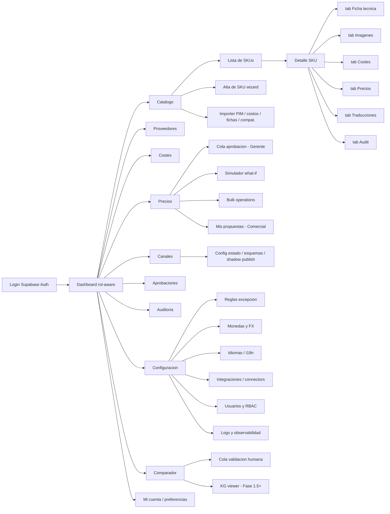

# UX Mockups — MT Middle East MDM + Pricing (Fase 1)

> Documento de wireframes textuales y descripción detallada de pantallas y flujos para la plataforma MDM + Pricing de MT Middle East. Idioma de trabajo: español. UI primaria español con toggle EN.
> Vinculado a: `prd-mt-pricing-mdm-phase1.md` §12 (UX por rol), §6-7 (FRs), `architecture-mt-pricing-mdm-phase1.md` §1 (stack), §22.1 (estructura frontend).

---

## 1. Principios de diseño

1. **Density-first / no waste UI**. El usuario es un Comercial que pasa horas en pantalla; tablas densas con `text-xs` tabulares, padding compacto (`px-2 py-1.5`), sin hero gigante en pantallas operativas. La densidad gana sobre la "elegancia" cuando el ojo necesita escanear 224 SKUs.
2. **Atajos de teclado ricos para CRUD masivo**. `Cmd-K` global (command palette), `j/k` navegar tabla, `e` editar fila, `Shift+Click` seleccionar rango, `Cmd-Enter` aprobar, `Esc` cerrar drawer. Cada tabla expone su shortcut sheet con tecla `?`.
3. **Búsqueda Cmd-K omnipresente**. Scope-switcher: productos / proveedores / propuestas / configuración / audit. Resultados con highlight, jump-to-row, "abrir en drawer" vs "abrir en página".
4. **Spanish primario UI con toggle EN**. Selector en topbar persistente por usuario. Datos canónicos siempre EN; los `name_en` aparecen en cualquier contexto incluso si UI=ES (con traducción ES de fondo si existe).
5. **Dark mode opcional** (Fase 1.5+; off por default Fase 1 — la arquitectura §21.4 lo declara explícitamente).
6. **Accesibilidad WCAG AA mínimo**: contraste 4.5:1 en texto normal, focus rings visibles, skip links, aria-live para toasts, labels asociados a inputs.
7. **Componentes Shadcn (new-york style)** disponibles: Button, Input, Select, Combobox, Table, DataTable (TanStack Table + Virtual), Sheet, Dialog, Drawer, Tabs, Form, Toast (sonner), Tooltip, Popover, Card, Badge, Avatar, Calendar, Command (Cmd-K), Resizable, ScrollArea, Separator, Skeleton, Switch, Checkbox, RadioGroup, Slider, DropdownMenu, ContextMenu, Hover-Card, Progress, Alert, AlertDialog.
8. **Layout estándar de la app**:
   - **Sidebar izquierdo** (240 px colapsable a 56 px): nav primaria con iconos Lucide + label.
   - **Topbar** (48 px): `Cmd-K` search-trigger (centrado), bell (notificaciones), selector idioma, avatar user-menu.
   - **Main area**: contenido de la ruta. Padding `p-6` por defecto, `p-0` para tablas full-bleed.
   - **Drawer derecho contextual** (380-560 px, resizable): detalle, audit, comentarios. Persistente `Cmd-/`.

---

## 2. Information Architecture (sitemap)



---

## 3. Wireframes por pantalla

### Convenciones del documento

- Todas las rutas incluyen segmento `[locale]` (`es` por default, `en` por toggle). Se omite por brevedad.
- Tablas grandes: virtual scrolling (TanStack Virtual) — el alto por fila visible es 36 px.
- "Drawer" = panel deslizable derecho, no oculta la página de abajo.
- Datos de ejemplo del dominio: válvulas industriales, DN, PN, AED, EUR.

---

### Pantalla 1 — Dashboard Comercial

**Pantalla**: Dashboard del Comercial Canal Online & Marketplaces.
**Ruta**: `/dashboard`.
**Roles que acceden**: Comercial, Backup operator, Champion (vista colaborativa), Gerente (read-only resumen), TI (read-only).
**Propósito**: vista de "qué hago hoy". KPIs accionables del catálogo + propuestas en revisión + cobertura de traducción. Vinculado a FR-1a-01..FR-1a-13, FR-1b-01..FR-1b-03.
**Layout**: shell global (sidebar + topbar) + main 12-col grid. Hero string compacto arriba; row de 4 KPI cards; 2 columnas grandes (tabla "SKUs que requieren atención" + stream "Últimas decisiones").

**Componentes visibles**:
- Hero: `"Hola Pablo — 12 SKUs partial, 3 blocked, 8 propuestas pending con tu Gerente"` (mismo string del PRD §12.1).
- 4 KPI Card: `Cobertura traducción ES` (94 %, badge verde), `Cobertura traducción AR` (71 %, badge ámbar), `SKUs partial/blocked` (15, link a tabla filtrada), `Propuestas en revisión` (8, link a Mis propuestas).
- Botones rápidos: `Importar PIM`, `Importar costos`, `Disparar recálculo`, `Alta de SKU`.
- Tabla "SKUs que requieren atención" con filtros por `data_quality`, `image_status`, `translation_status`, family, channel state. Acciones inline (editar, asignar owner).
- Stream "Últimas decisiones" (audit_events propios cronológicos, últimos 10).

**Acciones primarias**: `Cmd-K` → buscar / saltar; `n` → nuevo SKU; `i` → abrir Importer; `r` → disparar recálculo.
**Acciones secundarias**: kebab por fila de tabla → editar / asignar owner / ver historia / archivar.
**Estados**: loading → 4 skeletons KPI + tabla skeleton 8 filas; empty (raro) → "Catálogo limpio, nada pendiente"; error → Alert destructive con retry.
**Validaciones / mensajes**: ninguna (solo lectura).
**Navegación desde aquí**: tabla → Detalle SKU; KPI propuestas → /pricing/my-proposals; botones → wizards correspondientes.

```
┌───────────────────────────────────────────────────────────────────────────────────┐
│ MT  [⌕ Cmd-K buscar SKU, propuesta, config…]               🔔 3   ES▾   PS  ▾    │  topbar
├──────────┬────────────────────────────────────────────────────────────────────────┤
│ ◰ Inicio │  Hola Pablo — 12 SKUs partial · 3 blocked · 8 propuestas pendientes    │  hero
│ ▤ Catálo │ ─────────────────────────────────────────────────────────────────────  │
│ ⚙ Provee │ ┌──────────────┐┌──────────────┐┌──────────────┐┌──────────────┐       │
│ $ Costes │ │ Trad ES 94%  ││ Trad AR 71%  ││ Calidad 15   ││ Pendientes 8 │       │
│ ⌗ Precio │ │ ●            ││ ▲            ││ → ver        ││ → cola       │       │
│ ⇄ Canale │ └──────────────┘└──────────────┘└──────────────┘└──────────────┘       │
│ ✓ Aprob. │                                                                        │
│ ⌖ Audit  │ [Importar PIM] [Importar costos] [Recalcular] [+ Alta SKU]             │
│ ⚙ Config │                                                                        │
│ ◇ Compar │ SKUs que requieren atención                                  [⇩ filtros]│
│          │ ┌──────────┬────────────┬────────┬─────┬────────┬────────────┬───────┐ │
│ — — —    │ │ SKU      │ name_en    │ family │ DN  │ qual.  │ trad ES/AR │ acc.  │ │
│ ◷ Mi cta │ ├──────────┼────────────┼────────┼─────┼────────┼────────────┼───────┤ │
│          │ │ MTV-1004 │ Ball valve │ valves │ 25  │ partial│ ● ▲        │ … ▾   │ │
│          │ │ MTV-1011 │ Gate valve │ valves │ 50  │ blocked│ ○ ○        │ … ▾   │ │
│          │ │ MTV-1023 │ Check va.. │ valves │ 80  │ partial│ ● ●        │ … ▾   │ │
│          │ │ MTV-1101 │ Strainer   │ access │ 32  │ partial│ ● ▲        │ … ▾   │ │
│          │ │ MTV-1109 │ Y-strainer │ access │ 40  │ partial│ ● ○        │ … ▾   │ │
│          │ └──────────┴────────────┴────────┴─────┴────────┴────────────┴───────┘ │
│          │                                                                        │
│          │ Últimas decisiones (tú)                                                │
│          │  18:42  Aprobaste traducción AR de MTV-1004                            │
│          │  18:38  Propusiste precio Amazon UAE FBA 142 AED para MTV-1011         │
│          │  18:21  Importaste batch costos 2026-05-06 (1 014 filas, 0 errores)    │
│          │  17:55  Editaste DN de MTV-1023 (32 → 80) — pendiente revisión         │
└──────────┴────────────────────────────────────────────────────────────────────────┘
```

---

### Pantalla 2 — Lista de SKUs

**Pantalla**: lista del catálogo.
**Ruta**: `/catalog`.
**Roles**: Comercial (full CRUD), Gerente (read + comentar), TI (read).
**Propósito**: navegación primaria del catálogo, filtrado, acción masiva. Vinculado a FR-1a-01, FR-1a-02, FR-1a-03, NFR-18 (50 k SKUs sin re-arquitectura).
**Layout**: full-bleed table; filtros sticky a la izquierda colapsables (Drawer), toolbar superior con buscador + bulk actions sticky cuando hay selección.

**Componentes visibles**:
- Toolbar: input search local (`Cmd-F`) + chips de filtro activos + botón `Filtros (3)` que abre Drawer + `+ Alta SKU` + botón `Exportar CSV`.
- DataTable virtual: columnas configurables (gear icon): SKU, name_en, name_es, family, DN, PN, type, material, image (thumb 28 px), data_quality (Badge), translation status (3 dots EN/ES/AR), channel state (badges múltiples), updated_at, owner.
- Bulk actions sticky bar (aparece al seleccionar): `Asignar owner`, `Cambiar data_quality`, `Disparar recálculo selección`, `Probe + Mirror imágenes`, `Exportar selección`.
- Drawer filtros: family (multi), channel state, data_quality, translation status (per language), image_status, owner, updated_at range, has_cost, has_price.

**Acciones primarias**: `n` nuevo, `/` foco buscar, `f` toggle filtros drawer, `Shift+Click` rango, `Space` toggle row, `Cmd-A` select all visible, `e` editar fila activa, `Enter` abrir detalle.
**Acciones secundarias**: kebab por fila → Editar / Duplicar / Archivar / Ver audit / Probe imágenes / Disparar recálculo / Exportar.
**Estados**: loading skeletons 20 filas; empty state ilustrado "Sin SKUs todavía. Empieza con Importer PIM"; error con retry; filtered-empty "Sin coincidencias para tus filtros".
**Validaciones**: ninguna en la pantalla; al editar inline (DN, PN, family) → Zod validation toast on error.
**Navegación**: fila → `/catalog/:sku`; bulk action → confirm dialog; +Alta SKU → wizard.

```
┌───────────────────────────────────────────────────────────────────────────────────────┐
│ MT  [⌕ Cmd-K]                                            🔔   ES▾  PS▾                │
├──────────┬────────────────────────────────────────────────────────────────────────────┤
│ ◰        │ Catálogo › SKUs                                              [+ Alta SKU]  │
│ ▤ ◀acti  │ ┌─────────────────────┬──────────────────────────────────────┐ [Filtros 3]│
│ ⚙        │ │ ⌕ buscar SKU/nombre │ [family: valves×] [qual: partial×]   │ [Export ▾] │
│ $        │ └─────────────────────┴──────────────────────────────────────┘             │
│ ⌗        │ ▤ 224 SKUs · 18 seleccionados                                              │
│ ⇄        │ ─────────────────────────────────────────────────────────────────────────  │
│ ✓        │ [ Asignar owner ▾ ]  [ Cambiar calidad ▾ ]  [ Recalcular ]  [ … ]   ✕      │
│ ⌖        │ ─────────────────────────────────────────────────────────────────────────  │
│ ⚙        │ ☐  SKU      img name_en          family   DN   PN  mat. EN ES AR  qual.   │
│ ◇        │ ☑ MTV-1004 [▦] Ball valve PN16   valves   25   16  CW6 ● ● ▲   partial    │
│          │ ☑ MTV-1011 [▦] Gate valve PN16   valves   50   16  CW6 ● ● ○   blocked    │
│ — — —    │ ☐ MTV-1012 [▦] Gate valve PN25   valves   50   25  SS3 ● ● ●   complete   │
│ ◷        │ ☑ MTV-1023 [▦] Check valve       valves   80   16  CW6 ● ● ●   partial    │
│          │ ☐ MTV-1024 [▦] Check valve PN25  valves   80   25  SS3 ● ● ●   complete   │
│          │ ☐ MTV-1101 [▦] Strainer Y-type   access   32   16  SS3 ● ● ▲   partial    │
│          │ ☐ MTV-1102 [▦] Strainer Y-type   access   40   16  SS3 ● ● ●   complete   │
│          │ ☐ MTV-1103 [▦] Strainer Y-type   access   50   16  SS3 ● ● ●   complete   │
│          │ ☐ MTV-1109 [▦] Strainer basket   access   40   16  CW6 ● ▲ ○   partial    │
│          │ ☐ MTV-1201 [▦] Butterfly valve   valves  100   16  GG2 ● ● ●   complete   │
│          │ ☐ MTV-1202 [▦] Butterfly valve   valves  150   16  GG2 ● ● ●   complete   │
│          │ ☐ MTV-1305 [▦] Brass coupling    fitting  20    -  CW6 ● ● ▲   partial    │
│          │ … (virtual scroll, 224 filas)                                              │
│          │                                                                            │
│          │ ◀ ◁  pág 1 de 9   ▷ ▶                          [25 ▾] filas / página      │
└──────────┴────────────────────────────────────────────────────────────────────────────┘
  Leyenda dots: ● aprobado  ▲ borrador  ○ ausente
```

---

### Pantalla 3 — Detalle SKU · tab Ficha técnica

**Pantalla**: detalle de SKU, tab Ficha técnica.
**Ruta**: `/catalog/:sku/spec` (default tab).
**Roles**: Comercial (write), Gerente (read + comentario), TI (read).
**Propósito**: editar identidad y specs de un SKU (FR-1a-01).
**Layout**: header sticky con SKU + name_en + acciones; row de Tabs; main 2 columnas (form izquierda + summary card derecha con thumbnails imagen y badges).

**Componentes visibles**:
- Header: Avatar/thumb principal, `MTV-1023` (read-only mono), `name_en` editable inline, badges (`partial` data quality, `EN● ES● AR▲`, `B2B B2C`), kebab.
- Tabs: `Ficha técnica` (activo) · `Imágenes` · `Costes` · `Precios` · `Traducciones` · `Audit`.
- Form (Shadcn Form + Zod):
  - Fila 1: `family` (Select), `type` (Select), `material` (Select).
  - Fila 2: `DN` (NumberInput, `mm`), `PN` (NumberInput, bar), `connection` (Select).
  - Fila 3: `weight_kg` (Number), `length_mm`, `width_mm`, `height_mm`.
  - Fila 4: `EAN_individual`, `EAN_box`, `qty_per_box`, `MOQ_inner`, `qty_per_pallet`.
  - Specs JSONB editor (Monaco-style minimal, con schema Zod hint).
- Sidebar derecha: thumbnail imagen primaria + acceso "Imágenes →"; lista de fichas técnicas asociadas (FR-DOC-01) con descarga PDF.

**Acciones primarias**: `Cmd-S` guardar, `Esc` descartar, `Cmd-/` abrir audit drawer, botón `Guardar`, botón `Guardar y siguiente`.
**Acciones secundarias**: kebab → Duplicar, Archivar, Ver en JSON, Exportar.
**Estados**: dirty (badge "cambios sin guardar" + warning al navegar fuera), saving (spinner inline), saved (toast verde), error de validación (inline rojo bajo cada campo).
**Validaciones**: `name_en` NOT NULL, `DN > 0`, `PN > 0`, `weight_kg ≥ 0`, EAN-13 checksum, JSONB `specs` debe parsear (mensaje de error de parser).
**Navegación**: tabs cambian sub-ruta; back → /catalog.

```
┌───────────────────────────────────────────────────────────────────────────────────┐
│ MT  [⌕ Cmd-K]                                                  🔔  ES▾  PS▾       │
├──────────┬────────────────────────────────────────────────────────────────────────┤
│          │ ◀ Catálogo  /  MTV-1023                                       … ▾      │
│          │ ┌─[▦]──MTV-1023 — Check valve PN16 DN80────────────────────────────┐  │
│          │ │ Badges:  partial   EN● ES● AR●   B2B B2C   actualizado hace 2 d │  │
│          │ └─────────────────────────────────────────────────────────────────┘  │
│          │ [Ficha técnica][Imágenes][Costes][Precios][Traducciones][Audit]      │
│          │ ───────────────────────────────────────────────────────────────────  │
│          │ Identidad                                                            │
│          │ name_en *  [Check valve PN16 DN80                              ]    │
│          │ family     [valves         ▾]   type [check         ▾]              │
│          │ material   [Latón CW617N   ▾]   connection [BSP threaded ▾]         │
│          │                                                                      │
│          │ Dimensiones técnicas                                                 │
│          │ DN *       [   80] mm    PN *  [  16] bar   peso [  3.4] kg          │
│          │ largo      [  120] mm    ancho [  90] mm    alto [  85] mm           │
│          │                                                                      │
│          │ Logística                                                            │
│          │ EAN ind.   [8401234567890]   EAN caja [8401234999990]                │
│          │ qty/caja   [   12]   MOQ inner [  6]   qty/pallet [  240]            │
│          │                                                                      │
│          │ Specs JSONB                                                          │
│          │ ┌─────────────────────────────────────────────────────────────────┐ │
│          │ │ {                                                                │ │
│          │ │   "test_pressure_bar": 24,                                       │ │
│          │ │   "max_temp_c": 90,                                              │ │
│          │ │   "standards": ["API-598", "ISO 7-1"],                           │ │
│          │ │   "country_of_origin": "ES"                                      │ │
│          │ │ }                                                                │ │
│          │ └─────────────────────────────────────────────────────────────────┘ │
│          │                                                                      │
│          │ [Cancelar]  [Guardar]  [Guardar y siguiente →]                       │
└──────────┴──────────────────────────────────────────────────────────────────────┘
  Sidebar derecha (340 px) muestra:
   - Imagen primaria + "Ver galería →"
   - Fichas asociadas: MTFT_5114.pdf, MTCE_5114.pdf
   - Norma: API-598 (chip)
```

---

### Pantalla 4 — Detalle SKU · tab Imágenes

**Pantalla**: gestión de imágenes del SKU.
**Ruta**: `/catalog/:sku/images`.
**Roles**: Comercial (write), TI (write para probe + mirror), Gerente (read).
**Propósito**: subir, marcar imagen primaria, lanzar probe + mirror a Supabase Storage (FR-1a-03, UC-1a-10).
**Layout**: grid de cards 4 columnas (responsive), drag-drop area arriba, status panel a la derecha.

**Componentes visibles**:
- Drop zone: `Arrastrá imágenes aquí o clic para seleccionar (PNG/JPG/WEBP, ≤ 5 MB)`.
- Galería: cards 240×240 px, badge primary star, badge mirror status (`origin` ámbar / `mirrored` verde / `failed` rojo), botón set primary, botón delete (con confirm), botón download.
- Panel derecho: `Probe + Mirror` button (lanza job Celery), última fecha probe, lista errores recientes.
- Origin URL field (read-only) + `Replace origin URL`.

**Acciones primarias**: `Cmd-U` upload, click thumb → lightbox preview; star icon → set primary.
**Acciones secundarias**: kebab por imagen → renombrar, definir alt-text (i18n EN/ES/AR), copiar URL, descargar.
**Estados**: subiendo (progress bar por imagen), mirror in flight (skeleton + spinner), mirror failed (Alert destructive en card), no images (empty state CTA).
**Validaciones**: tipo MIME, tamaño ≤ 5 MB, máximo 12 imágenes por SKU, una y solo una `is_primary`.

```
┌──────────────────────────────────────────────────────────────────────────┐
│ MTV-1023 / Imágenes        Probe & Mirror status: ✓ 4 mirrored, 0 failed │
├──────────────────────────────────────────────────────────────────────────┤
│  ┌─ drop zone ─────────────────────────────────────────────────┐        │
│  │  ⬆ Arrastrá imágenes aquí (PNG/JPG/WEBP ≤ 5 MB · máx. 12)   │        │
│  └────────────────────────────────────────────────────────────┘        │
│                                                                          │
│  ┌────────┐ ┌────────┐ ┌────────┐ ┌────────┐                             │
│  │  [▦]★  │ │  [▦]   │ │  [▦]   │ │  [▦]   │                             │
│  │ primary│ │ mirror✓│ │ mirror✓│ │ origin▲│                             │
│  │ 1024×.. │ │ 1024×..│ │ 800×.. │ │ 600×.. │                             │
│  │  … ▾   │ │  … ▾   │ │  … ▾   │ │  … ▾   │                             │
│  └────────┘ └────────┘ └────────┘ └────────┘                             │
│                                                                          │
│  Acciones: [ Set primary ] [ Probe + Mirror seleccionadas ] [ Eliminar ] │
└──────────────────────────────────────────────────────────────────────────┘
```

---

### Pantalla 5 — Detalle SKU · tab Costes

**Pantalla**: matriz de costes SKU × esquema × proveedor.
**Ruta**: `/catalog/:sku/costs`.
**Roles**: Comercial (write), Gerente (read), TI (read).
**Propósito**: ver y editar el coste desglosado por esquema (FBA, FBM, Direct B2C, Direct B2B, Marketplace) con FX as-of (FR-1a-05).
**Layout**: sub-tabs por proveedor (chips horizontales) + tabla matriz esquema × componentes.

**Componentes visibles**:
- Chips proveedor: `MT Valves España (EUR)`, `+ Añadir proveedor`.
- Para el proveedor activo:
  - Tabla con esquemas como filas, componentes como columnas:
    | Esquema | FOB | Freight | Customs | FBA fees | FBM fees | Payment fees | Marketing | TOTAL coste | FX as-of | Total AED |
    |---------|-----|---------|---------|----------|----------|--------------|-----------|-------------|----------|-----------|
    | FBA Amazon UAE | 12.40 € | 1.20 € | 0.85 € | 3.40 € | — | 0.20 € | 0.50 € | 18.55 € | 1 EUR=4,29 AED · 2026-04-30 | 79.58 AED |
    | FBM Amazon UAE | 12.40 € | 1.20 € | 0.85 € | — | 1.50 € | 0.20 € | 0.50 € | 16.65 € | 1 EUR=4,29 AED | 71.43 AED |
    | Direct B2C    | 12.40 € | 1.20 € | 0.85 € | — | — | 0.30 € | 0.80 € | 15.55 € | 1 EUR=4,29 AED | 66.71 AED |
    | Direct B2B    | 12.40 € | 0.80 € | 0.85 € | — | — | 0.10 € | — | 14.15 € | 1 EUR=4,29 AED | 60.70 AED |
    | Marketplace Noon | 12.40 € | 1.20 € | 0.85 € | — | 1.80 € | 0.25 € | 0.60 € | 17.10 € | 1 EUR=4,29 AED | 73.36 AED |
- Inline edit por celda; click en `FX as-of` abre Popover con histórico.
- Audit drawer toggle.

**Acciones primarias**: `e` edit row, `Tab/Shift-Tab` mover, `Cmd-S` guardar.
**Acciones secundarias**: duplicar fila, eliminar esquema, override FX explícito (con razón obligatoria).
**Estados**: dirty cell highlight, validation error inline, recalc preview (recalcula precio si hay precio dependiente — toast informativo "esto disparará 12 propuestas").
**Validaciones**: cada componente ≥ 0; suma > 0; FX requerido; moneda origen del proveedor coincide con la registrada.

---

### Pantalla 6 — Detalle SKU · tab Precios (CORE — mockup extendido)

**Pantalla**: matriz de precios SKU × canal × esquema con estados y propuesta nueva.
**Ruta**: `/catalog/:sku/prices`.
**Roles**: Comercial (proponer), Gerente (aprobar), TI (read).
**Propósito**: visualizar precio actual aprobado, alertas, estado de propuesta vigente, lanzar nueva propuesta inline (FR-1b-01..FR-1b-03, FR-1b-12).
**Layout**: full-bleed; matriz como tabla pivotada con filas = canal, columnas = esquema. Cada celda es un mini-panel (precio, margen %, badge estado). Sticky toolbar con simulador rápido.

**Componentes visibles**:
- Toolbar: chips canal activos (filtro), botón `+ Proponer precio`, botón `Simular what-if`, botón `Exportar matriz`.
- Matriz (custom component `price-matrix`): cada celda muestra precio (bold tabular-nums), moneda canal, margen % (color-coded), badge estado (`approved` / `auto_approved` / `pending_review` / `draft` / `rejected` / `revised` / `exported`), alerta icon si aplica.
- Click en celda → Drawer derecho con detalle completo de propuesta (breakdown, regla aplicada, FX, audit, comentarios).
- Estados de canal indicados en header de columna (chip: `live`, `pre_launch`, `paused`, etc.).

**Acciones primarias**: `Cmd-K` jump; `n` nueva propuesta para celda activa; `Enter` abrir drawer; `a` aprobar (Gerente); `r` rechazar.
**Acciones secundarias**: kebab por celda → Ver historia, Duplicar a otro canal, Forzar revisión, Exportar fila.
**Estados**: celda vacía (sin precio), celda con propuesta `pending_review` (badge amarillo + edge-glow), celda exportada (badge azul), celda con alerta crítica (icon rojo).
**Validaciones**: al proponer precio < pvp_min → alerta crítica; margen % < threshold mínimo regla → bloquea o eleva a `pending_review`.

```
┌──────────────────────────────────────────────────────────────────────────────────────┐
│ MTV-1023 / Precios       [+ Proponer precio]  [⚡ Simular what-if]  [⇩ Exportar]    │
├──────────────────────────────────────────────────────────────────────────────────────┤
│ Canal \\ Esquema    │ FBA Amazon UAE  │ FBM Amazon UAE  │ Direct B2C   │ Direct B2B │
│ live ●            │  pre_launch ▲   │  inactive ○     │              │            │
│ ─────────────────┼─────────────────┼─────────────────┼──────────────┼────────────  │
│ Amazon UAE       │ 142.00 AED       │ 128.50 AED       │  —           │  —         │
│ live             │ margen 32 % ✓   │ margen 28 % ✓   │              │            │
│                  │ approved         │ pending_review ⚠│              │            │
│                  │ 2026-05-01       │ FX swing >5 %    │              │            │
│ ─────────────────┼─────────────────┼─────────────────┼──────────────┼────────────  │
│ Noon UAE         │  —              │ 132.00 AED       │  —           │  —         │
│ pre_launch       │                 │ margen 30 % ✓   │              │            │
│                  │                 │ draft            │              │            │
│ ─────────────────┼─────────────────┼─────────────────┼──────────────┼────────────  │
│ mtme.ae          │  —              │  —              │ 169.00 AED   │  —         │
│ inactive         │                 │                 │ margen 41 %✓ │            │
│                  │                 │                 │ auto_approved│            │
│ ─────────────────┼─────────────────┼─────────────────┼──────────────┼────────────  │
│ B2B Direct       │  —              │  —              │  —           │ 110.00 AED  │
│ inactive         │                 │                 │              │ margen 22 %▲│
│                  │                 │                 │              │ rejected ✕  │
│                  │                 │                 │              │ "margen <25%"│
└──────────────────────────────────────────────────────────────────────────────────────┘

Drawer derecho (al click en celda Amazon UAE × FBA, 142.00 AED, approved):
┌────────────────────────────────────────────────────────────┐
│ ✕  MTV-1023 — Amazon UAE × FBA — 142.00 AED                │
├────────────────────────────────────────────────────────────┤
│ Estado:  approved                                           │
│ Aprobado: Christian (Gerente) · 2026-05-01 14:22 UAE       │
│ Propuesto: Pablo Sierra · 2026-04-30 09:11 UAE             │
│ Rule applied: rule_v3 — margen objetivo FBA UAE 30 %        │
│ FX as-of:  1 EUR = 4.29 AED  (2026-04-30, source: ECB)      │
│                                                             │
│ Breakdown:                                                  │
│   Coste total                       79.58 AED               │
│   Margen objetivo                  +28.62 AED  (35 %)       │
│   Listing fee Amazon                +7.10 AED               │
│   Buffer FX swing 5 %               +5.30 AED               │
│   Marketing reserve                 +5.00 AED               │
│   Round-up                         +16.40 AED               │
│   Precio final                     142.00 AED               │
│                                                             │
│ Alertas: ninguna                                            │
│ pvp_min:  120.00 AED  ✓ por encima                          │
│                                                             │
│ Historia de estado:                                         │
│   draft → auto_approved → pending_review → approved         │
│                                                             │
│ [ Duplicar a otro canal ]  [ Forzar revisión ]  [ Audit ]   │
└────────────────────────────────────────────────────────────┘
```

---

### Pantalla 7 — Detalle SKU · tab Traducciones

**Pantalla**: tabla EN canónico + ES + AR con `translation_status` por idioma.
**Ruta**: `/catalog/:sku/translations`.
**Roles**: Comercial (write), Gerente (aprobar AR), TI (read).
**Propósito**: gestionar copy multilenguaje (FR-1a-02, NFR-22, NFR-23).
**Layout**: tabla 3 columnas EN | ES | AR; campos rows (`name`, `short_description`, `long_description`, `marketing_bullets`, `seo_title`, `seo_description`).

**Componentes visibles**:
- Header EN (canónico, NOT NULL), ES, AR con badge translation_status (`pending` / `draft` / `approved`).
- Cada celda Textarea / Input según campo. Campo AR usa `dir="rtl"` y font-AR (Inter cubre lat; usar IBM Plex Sans Arabic o Noto Sans Arabic para AR — flag para validación de marca).
- Botón "Aprobar idioma" por columna (sólo Gerente o usuarios con permiso).
- Botón "Sugerir traducción IA" (Fase 1.5+, deshabilitado en Fase 1 con tooltip "Disponible Fase 1.5").

**Acciones primarias**: `Cmd-S` guardar, `Cmd-Shift-A` aprobar columna activa.
**Acciones secundarias**: copiar EN→ES como starting point; ver diff vs versión anterior.
**Estados**: dirty per cell, mismatched approved status (warning si EN cambia y ES/AR estaban approved → vuelven a `draft` automáticamente con toast informativo).
**Validaciones**: EN NOT NULL; longitud máxima por campo (SEO title ≤ 70, etc.); XSS sanitization.

```
┌────────────────────────────────────────────────────────────────────────────────────┐
│ MTV-1023 / Traducciones                                                             │
├────────────────────────────────────────────────────────────────────────────────────┤
│ Campo            │ EN (canónico) ●     │ ES ●               │ AR ▲              ⤷rtl│
│ ─────────────────┼─────────────────────┼────────────────────┼─────────────────────  │
│ name             │ Check valve PN16 …  │ Válvula antirreto..│ صمام عدم رجوع...   │
│ short_descr.     │ One-way flow valve  │ Válvula de paso… │ صمام تدفق أحادي…   │
│ long_descr.      │ [textarea]          │ [textarea]         │ [textarea rtl]      │
│ marketing_bullets│ • Brass body        │ • Cuerpo latón    │ • جسم نحاسي         │
│                  │ • PN16 / DN80       │ • PN16 / DN80     │ • PN16 / DN80       │
│ seo_title        │ Brass check valve…  │ Válvula antirre... │ صمام عدم رجوع …    │
│ seo_descr.       │ MT Middle East …    │ MT Middle East …   │ MT الشرق الأوسط...  │
│                  │                     │                    │                     │
│                  │ status: approved    │ status: approved   │ status: draft       │
│                  │                     │ [Aprobar columna]  │ [Aprobar columna]  │
└────────────────────────────────────────────────────────────────────────────────────┘
```

---

### Pantalla 8 — Detalle SKU · tab Audit

**Pantalla**: timeline cronológico de cambios sobre un SKU.
**Ruta**: `/catalog/:sku/audit`.
**Roles**: Comercial (read), Gerente (read), TI (read + export).
**Propósito**: trazabilidad VAT UAE 2026 (FR-1a-11, NFR-08).
**Layout**: stream vertical con cards por evento; filtros lateral (entity, action, actor, fecha).

**Componentes visibles**: card por `audit_events` con icon de acción, actor + avatar, timestamp, entity affected, diff (antes/después colapsable), comment, ver-más link.
- Filtros: entity (products, costs, prices, translations), action (create/update/approve/reject), actor (Combobox usuarios), rango fecha.
- Botón `Exportar JSON` (TI only).

**Acciones primarias**: scroll, `f` filtros, click "ver diff" expande.
**Acciones secundarias**: copiar event_id, link directo al recurso afectado.
**Estados**: empty (raro), virtual scroll para 10 k+ eventos.
**Validaciones**: ninguna (read-only).

```
┌──────────────────────────────────────────────────────────────────────┐
│ MTV-1023 / Audit                                       [⇩ Filtros 0] │
├──────────────────────────────────────────────────────────────────────┤
│ ●─ 2026-05-06 12:14 UAE   Pablo Sierra   ✎ update_translation         │
│   campo: name_es · "Válvula check" → "Válvula antirretorno"           │
│   status_es: approved → draft                            [ver diff]   │
│                                                                       │
│ ●─ 2026-05-06 09:42 UAE   Christian      ✓ approve_price              │
│   prices.id 8c12 · channel=amazon_uae scheme=fba                       │
│   142.00 AED · rule=v3 · fx=1EUR=4.29AED                              │
│   comment: "OK margen 32%"                                            │
│                                                                       │
│ ●─ 2026-05-05 18:11 UAE   Pablo Sierra   ✎ propose_price              │
│   prices.id 8c12 · 138.50 AED → 142.00 AED                            │
│   alert: FX swing >5%                                    [ver diff]   │
│                                                                       │
│ ●─ 2026-05-04 14:55 UAE   Sistema        ↻ recalculate_mass_fx        │
│   batch=8821 · rule_version=v3 · fx_rate_id=4571                      │
│                                                                       │
│ ●─ 2026-05-01 11:00 UAE   Pablo Sierra   ✎ update_spec                │
│   DN: 65 → 80 · weight_kg: 3.1 → 3.4                  [ver diff]      │
└──────────────────────────────────────────────────────────────────────┘
```

---

### Pantalla 9 — Alta de SKU (wizard 4 pasos)

**Pantalla**: wizard de creación SKU.
**Ruta**: `/catalog/new`.
**Roles**: Comercial.
**Propósito**: alta guiada para reducir SKUs `partial` por omisión de campos (FR-1a-01, BR data_quality).
**Layout**: stepper horizontal arriba (4 pasos) + contenido del paso + footer con `Atrás / Siguiente / Guardar borrador`.

**Pasos**:
1. **Identidad**: SKU code (con validación uniqueness async), name_en, family, type, material.
2. **Especificaciones técnicas**: DN, PN, dimensiones, peso, EAN, packaging.
3. **Imágenes** (opcional): upload o pegar URL origen. CTA "Probe & Mirror más tarde".
4. **Traducciones (opcional)**: ES + AR — puede dejarse en blanco con `status=pending`.

**Acciones primarias**: `Enter` siguiente, `Cmd-S` guardar borrador, botón final `Crear SKU`.
**Acciones secundarias**: cancelar (vuelve a /catalog).
**Estados**: SKU code en uso (error inline), required field missing (botón Siguiente disabled), draft saved (toast).
**Validaciones**: SKU regex (`^[A-Z0-9-]{3,32}$`), name_en NOT NULL, DN > 0, PN > 0, EAN-13 checksum opcional.

```
┌──────────────────────────────────────────────────────────────┐
│ + Alta de SKU                                                │
│                                                              │
│  ●  ─────  ○  ─────  ○  ─────  ○                             │
│  Identidad   Specs   Imágenes  Traducciones                  │
│ ──────────────────────────────────────────────────────────── │
│  SKU code  *  [MTV-                          ] (único async) │
│  name_en   *  [Check valve PN25 DN100        ]               │
│  family    *  [valves                  ▾]                    │
│  type         [check                   ▾]                    │
│  material     [Latón CW617N            ▾]                    │
│                                                              │
│  [Cancelar]                  [Guardar borrador] [Siguiente →]│
└──────────────────────────────────────────────────────────────┘
```

---

### Pantalla 10 — Importer wizard (PIM / costos / fichas / compatibilidades)

**Pantalla**: wizard de importación de archivos.
**Ruta**: `/imports/new` (con query `?type=pim|costs|datasheets|compat`).
**Roles**: Comercial / TI.
**Propósito**: cargar archivos reales del cliente con preview-diff antes de aplicar (FR-1a-06, FR-1a-07, FR-1a-08, FR-1a-13, FR-DOC-01, FR-MAT-01).
**Layout**: stepper 4 pasos: 1) Selección archivo + tipo · 2) Mapeo de columnas · 3) Preview diff + validación · 4) Confirmación apply.

**Componentes visibles**:
- Paso 1: tipo (radio: PIM, Costos, Compatibilidades materiales, Fichas técnicas), drop zone, batch_label opcional.
- Paso 2: tabla mapping (col origen → campo destino) con auto-detect basado en headers (e.g. `Referencia de variante` → `sku`, `Nombre ERP - AX` → `name_en`).
- Paso 3: preview-diff:
  - Resumen: `5086 filas detectadas · 4112 nuevas · 974 actualizables · 0 huérfanas (FR-1a-13)`.
  - Tabla preview con tabs: `Nuevos`, `Modificados (con diff)`, `Errores de validación`, `Huérfanos (cross-ref)`.
- Paso 4: confirmación (mensaje "Esto creará 4112 SKUs y modificará 974"), botón `Apply` (con `Are you sure?` AlertDialog), checkbox "Notificar al Gerente".

**Acciones primarias**: `Cmd-Enter` siguiente, `Apply` final.
**Acciones secundarias**: descargar reporte de validación CSV, cancelar batch (rollback).
**Estados**: parsing (progress), validating (progress), applying (progress + ETA), success (toast + link a batch report), partial (algunas filas fallaron — modal con detalle).
**Validaciones**: archivo MIME (xlsx, csv); tamaño ≤ 50 MB; columnas mínimas presentes.

```
┌─────────────────────────────────────────────────────────────────────────┐
│ Imports / Nuevo                                                          │
│  ●─────●─────●─────○                                                     │
│  Archivo  Mapeo  Preview  Confirmar                                      │
│ ────────────────────────────────────────────────────────────────────────│
│ Preview de PIM completo.xlsx                                             │
│ 5086 filas · 4112 nuevas · 974 modificadas · 0 huérfanas · 12 errores    │
│                                                                          │
│ [Nuevos 4112] [Modificados 974] [Errores 12] [Huérfanos 0]               │
│ ────────────────────────────────────────────────────────────────────────│
│  SKU       │ campo        │ valor actual    │ valor nuevo                │
│  MTV-1004  │ DN           │ 25              │ 32                         │
│  MTV-1011  │ weight_kg    │ 1.20            │ 1.35                       │
│  MTV-1023  │ name_en      │ Check valve PN16│ Check valve PN16 DN80      │
│  …                                                                      │
│                                                                          │
│ ◀ Atrás                                       [Cancelar] [Apply →]       │
└─────────────────────────────────────────────────────────────────────────┘
```

---

### Pantalla 11 — Simulador what-if multi-canal/esquema

**Pantalla**: calculadora de escenario (FR-1b-02, NFR-01).
**Ruta**: `/pricing/simulate`.
**Roles**: Comercial, Gerente.
**Propósito**: introducir SKU + variables hipotéticas (nuevo coste, FX nuevo, regla nueva) y ver el precio sugerido por canal/esquema con breakdown y alertas, sin persistir.
**Layout**: 2 columnas — izquierda inputs (SKU + variables) + chips canal/esquema; derecha resultado (matriz como en P6 pero etiquetada "SIMULACIÓN").

**Componentes visibles**:
- SKU search Combobox.
- Toggles: `Coste personalizado`, `FX personalizado`, `Regla personalizada`. Al activar, muestra inputs.
- Botón `Calcular`. Resultado matriz aparece con badges "simulación" en gris + diff vs precio actual.
- Botón `Persistir como propuesta` (solo si Comercial y al menos 1 celda seleccionada).

**Acciones primarias**: `Cmd-Enter` calcular, `Cmd-S` persistir como propuesta.
**Acciones secundarias**: guardar escenario nombrado, cargar escenario.
**Estados**: vacío (CTA "Empezá eligiendo un SKU"), calculando (skeleton), error de regla (Alert).
**Validaciones**: SKU debe existir; FX > 0; coste > 0.

```
┌─────────────────────────────────────────────────────────────────────────────────┐
│ Simulador what-if                                                                │
├──────────────────────────────┬──────────────────────────────────────────────────│
│ SKU [MTV-1023 ▾ ✓]            │ SIMULACIÓN — no persiste                         │
│                               │                                                  │
│ □ Coste personalizado         │ Canal\\Esq.   FBA UAE     FBM UAE     B2C       │
│ ☑ FX personalizado            │ Amazon UAE   148.20 AED  133.10 AED  —          │
│   1 EUR = [4.18] AED          │              vs 142 (+4)  vs 128 (+5)            │
│ ☑ Regla personalizada         │              margen 33%  margen 29%             │
│   margen objetivo [35] %      │ Noon UAE     —          136.50 AED  —          │
│                               │              vs 132 (+4)                         │
│ Canales: ☑Amazon ☑Noon ☑mtme  │ mtme.ae      —          —          175.20 AED  │
│ Esquemas: ☑FBA ☑FBM ☑B2C      │                                    vs 169 (+6)  │
│                               │                                                  │
│ [ ⚡ Calcular ]                │ [Guardar escenario] [Persistir como propuesta] │
└──────────────────────────────┴──────────────────────────────────────────────────┘
```

---

### Pantalla 12 — Mis propuestas (Comercial)

**Pantalla**: cola personal de propuestas que el Comercial ha lanzado.
**Ruta**: `/pricing/my-proposals`.
**Roles**: Comercial (write/revise), Gerente (read).
**Propósito**: ver propuestas en curso por estado (pending_review, rejected/revised, auto_approved, approved, exported).
**Layout**: Tabs por estado + DataTable.

**Componentes visibles**:
- Tabs: `Pendientes (8)` · `Aprobadas hoy (12)` · `Rechazadas (2)` · `Revisar (2)` · `Histórico`.
- DataTable: SKU, canal, esquema, precio anterior, precio propuesto, delta margen, alerta, propuesto el, edad, estado, comentario Gerente (si rejected).
- Para `rejected/revised`: botón `Editar` (vuelve a draft con cambios pendientes).

**Acciones primarias**: `Enter` abrir drawer, `e` editar (si rejected), `r` retirar propuesta.
**Acciones secundarias**: bulk retirar.
**Estados**: empty per tab.

---

### Pantalla 13 — Dashboard Gerente

**Pantalla**: vista del Gerente Comercial.
**Ruta**: `/dashboard` (rol-aware).
**Roles**: Gerente.
**Propósito**: digest diario rápido + accesos a colas (FR-1b-05, NFR-27).
**Layout**: hero digest + 4 KPI + 2 columnas (cola + alertas críticas).

**Componentes visibles**:
- Hero: "Hola Christian — 142 auto-aprobadas hoy · 45 pendientes · 3 escaladas".
- KPI: lag mediano aprobación esta semana (5.2 h), % auto-aprobado (76 %), top razón excepción (FX swing), aprobaciones esta semana (89).
- Cola pendientes (preview top 10) con shortcut "Ver todo".
- Alertas críticas (margen < mínimo, FX swing > umbral).
- Historia firmas: "Última firma: ayer 17:42 — 28 aprobaciones, 1 rechazo".

**Acciones primarias**: `Cmd-K`, `g` go to cola, `d` configurar digest.
**Estados**: ver patrón general.

---

### Pantalla 14 — Cola de aprobación (CORE — mockup extendido)

**Pantalla**: panel de aprobación del Gerente.
**Ruta**: `/approvals/queue`.
**Roles**: Gerente (write), Comercial (read), TI (read).
**Propósito**: revisar y aprobar/rechazar propuestas de precio (FR-1b-03, FR-1b-04, FR-1b-05).
**Layout**: 2 paneles — tabla principal + drawer derecho con detalle del item seleccionado. Sticky header con resumen del día + filtros rápidos. Bulk-action bar sticky cuando hay selección.

**Componentes visibles**:
- Sticky header: "142 auto / 45 pendientes / 3 escaladas. Top razones: FX swing 32, margen mínimo 8, regla cambiada 5".
- Filtros rápidos: `Hoy` · `Esta semana` · `Pendientes` · `Escaladas` · canal · esquema · razón excepción.
- DataTable: checkbox, SKU, name_en, canal, esquema, precio antes, precio nuevo, margen antes → margen nuevo, delta %, alerta, razón excepción, propuesto por, edad (h), estado.
- Bulk-action bar: `Aprobar (n)`, `Rechazar (n) con comentario`, `Aprobar todos los "FX swing"`.
- Drawer derecho: detalle de propuesta = mismo formato que P6 drawer (breakdown, regla, FX, audit, comentarios). + botones `Approve / Reject / Revise` + textarea comentario.

**Acciones primarias**: `j/k` navegar, `Space` seleccionar, `Cmd-Enter` aprobar, `Cmd-Shift-Enter` aprobar bulk, `r` rechazar, `Cmd-/` toggle drawer.
**Acciones secundarias**: kebab → ver historia, contactar al proponente, postergar 24 h.
**Estados**: empty ("Sin pendientes — buen trabajo"), bulk action en curso (progress bar), conflict (otra sesión actuó sobre el mismo item — toast + refresh).
**Validaciones**: rechazo requiere comentario ≥ 10 chars; bulk approve > 50 items requiere comentario.

```
┌─────────────────────────────────────────────────────────────────────────────────────────┐
│ MT  [⌕ Cmd-K]                                                          🔔  ES▾  CN▾    │
├──────────┬──────────────────────────────────────────────────────────────────────────────┤
│ ◰        │ Cola de aprobación                                                            │
│ ▤        │ ─────────────────────────────────────────────────────────────────────────────│
│ ⚙        │ 142 auto · 45 pendientes · 3 escaladas                                        │
│ $        │ Top razones: FX swing 32 · margen mínimo 8 · regla cambiada 5                 │
│ ⌗        │                                                                               │
│ ⇄        │ Filtros: [Hoy ▼] [Pendientes ✓] [Canal: todos ▼] [Razón: todas ▼] [Edad >24h]│
│ ✓ ◀active│ ─────────────────────────────────────────────────────────────────────────────│
│ ⌖        │ ☐  SKU      canal       esq.  antes  nuevo Δmgn% razón          edad estado  │
│ ⚙        │ ☑ MTV-1011 Amazon UAE   FBA   135.0  142.0  +4   FX swing >5%   12h pending  │
│ ◇        │ ☑ MTV-1011 Noon UAE     FBM   128.0  132.5  +5   FX swing >5%   12h pending  │
│          │ ☑ MTV-1023 Amazon UAE   FBA   138.5  142.0  +5   FX swing >5%   18h pending  │
│ — — —    │ ☐ MTV-1101 Amazon UAE   FBA    98.0  118.0 +12   regla v3→v4    24h pending  │
│ ◷        │ ☐ MTV-1102 Noon UAE     FBM    78.0   75.0  -3   margen <25%   30h pending  │
│          │ ☐ MTV-1109 Amazon UAE   FBA    52.0   60.0 +14   regla v3→v4    36h pending  │
│          │ ☐ MTV-1305 mtme.ae      B2C    14.0   12.5  -8   margen <25%   42h pending  │
│          │ ☐ MTV-1201 Amazon UAE   FBA   320.0  340.0  +6   FX swing >5%   48h ESCALADA│
│          │ ☐ MTV-1202 Amazon UAE   FBA   470.0  500.0  +5   FX swing >5%   50h ESCALADA│
│          │ ☐ MTV-1038 B2B Direct   B2B   210.0  198.0  -8   margen <25%   56h ESCALADA│
│          │ … (45 filas total, virtual scroll)                                            │
│          │                                                                               │
│          │ ─ 4 seleccionadas ─                                                           │
│          │ [Aprobar (4)]  [Rechazar (4) con comentario]  [Aprobar todos "FX swing" (32)] │
└──────────┴──────────────────────────────────────────────────────────────────────────────┘

Drawer derecho (al click en MTV-1011 Amazon UAE FBA):
┌─────────────────────────────────────────────────────────────────────┐
│ ✕  MTV-1011 — Amazon UAE × FBA                                       │
├─────────────────────────────────────────────────────────────────────┤
│ Anterior:   135.00 AED   margen 28 %                                 │
│ Propuesto:  142.00 AED   margen 32 %    Δmgn +4pp                     │
│                                                                       │
│ Razón excepción:  FX swing > 5 %  (4.29 → 4.18 EUR/AED)               │
│ Regla aplicada:   rule_v3 (margen objetivo FBA UAE 30 %)              │
│ FX as-of:         1 EUR = 4.18 AED · 2026-05-06 · ECB                 │
│                                                                       │
│ Breakdown:                                                           │
│   Coste total                  77.20 AED  (+1.50 vs anterior)        │
│   Margen objetivo             +27.84 AED                             │
│   Listing fee Amazon           +7.10 AED                             │
│   Buffer FX swing 5 %          +5.10 AED                             │
│   Round-up                    +24.76 AED                             │
│   Precio final                142.00 AED                             │
│                                                                       │
│ Alertas: ninguna                                                     │
│ pvp_min: 120.00 AED ✓                                                │
│                                                                       │
│ Propuesto: Pablo Sierra · 2026-05-06 09:11 UAE                       │
│ Comentario propuesta: "FX swing al alza, mantengo margen 32 %"        │
│                                                                       │
│ Comentario aprobación:                                               │
│ ┌─────────────────────────────────────────────────────┐              │
│ │                                                     │              │
│ └─────────────────────────────────────────────────────┘              │
│                                                                       │
│ [✓ Aprobar (Cmd-Enter)]  [✕ Rechazar]  [✎ Pedir revisión]            │
└─────────────────────────────────────────────────────────────────────┘
```

---

### Pantalla 15 — Detalle de propuesta de precio (modal/drawer ampliado)

**Pantalla**: detalle full-page (alternativa a drawer cuando se viene desde digest email link).
**Ruta**: `/approvals/:proposal_id`.
**Roles**: Gerente (write), Comercial (read), TI (read).
**Propósito**: revisar diff anterior↔propuesto, breakdown, regla aplicada, alertas, comentarios, historial; firmar (FR-1b-12).
**Layout**: 3 secciones — diff visual, breakdown table, comentarios y firma.

**Componentes visibles**:
- DiffViewer (custom): tabla con columnas `antes | propuesto | delta` por componente.
- BreakdownTable.
- Comentarios (timeline tipo audit).
- Footer sticky: `Approve` (verde primary), `Reject` (destructive), `Revise` (outline), textarea comentario, checkbox "Notificar al proponente".

**Acciones primarias**: `Cmd-Enter` aprobar; `Cmd-Shift-R` rechazar.
**Validaciones**: rechazar requiere comentario ≥ 10 chars; revisar requiere indicar campo a revisar.

---

### Pantalla 16 — Configuración de reglas de excepción

**Pantalla**: editor paramétrico de reglas de excepción.
**Ruta**: `/settings/exception-rules`.
**Roles**: Gerente (write), TI (read).
**Propósito**: definir thresholds que disparan `pending_review` (FR-1b-04).
**Layout**: 2 columnas — izquierda lista de reglas (canal × esquema), derecha editor de la regla seleccionada.

**Componentes visibles**:
- Lista: regla por (canal, esquema) con badge "default" si es la genérica.
- Editor: campos
  - `delta_margen_max_%` (default 5)
  - `fx_swing_max_%` (default 5)
  - `coste_swing_max_%` (default 10)
  - `pvp_min_buffer_%` (default 0)
  - `margen_min_%` (default 25)
  - `delta_regla_aplicada` (boolean — cualquier cambio de regla → review)
- Histórico de versiones (BR-1b vinculada a FR-1b-14).
- Botón `Guardar nueva versión` (las propuestas pasadas mantienen su versión).

**Validaciones**: thresholds entre 0 y 100; sólo Gerente puede editar.

---

### Pantalla 17 — Reportes (margen / alertas / calidad)

**Pantalla**: vistas analíticas para Gerente.
**Ruta**: `/reports`.
**Roles**: Gerente, TI.
**Propósito**: KPIs ejecutivos (NFR-27).
**Layout**: filtros arriba (rango fecha, canal) + 3 secciones (margen consolidado, alertas críticas, calidad de dato).

**Componentes visibles**:
- Sección margen: bar chart por canal × esquema (Recharts), tabla SKUs top/bottom margen.
- Sección alertas: lista de alertas activas con link.
- Sección calidad de dato: distribución `complete/partial/blocked` por family, evolución temporal.

---

### Pantalla 18 — Console de integraciones (TI)

**Pantalla**: lista de connectors y su estado.
**Ruta**: `/settings/integrations`.
**Roles**: TI.
**Propósito**: monitoreo de conectores futuros + base para Fase 3 (FR-1b-09, ADR D10).
**Layout**: tabla de connectors + drawer detalle al click.

**Componentes visibles**:
- Tabla: connector (Amazon UAE, Noon UAE, mtme.ae, B2B Direct, ERP MT España futuro), tipo (PIM-pull / Pricing-push / Order-pull), estado (`inactive` / `pre_launch` / `pilot` / `live` / `paused` / `deprecated`), último sync, errores 24 h, latencia mediana.
- Botón `Ejecutar sync ahora` (TI only, con confirm).
- Botón `Ver logs` link a Sentry/Better Stack.

---

### Pantalla 19 — Configuración de canal

**Pantalla**: detalle de canal.
**Ruta**: `/channels/:code`.
**Roles**: TI.
**Propósito**: configurar estado, esquemas habilitados, credenciales, shadow publish (FR-1b-06, FR-1b-09).
**Layout**: 2 columnas — izquierda info + estado, derecha credenciales + flags.

**Componentes visibles**:
- Header con `name`, `code`, badge estado actual.
- State machine widget: muestra los 6 estados y la transición permitida (con confirm dialog).
- Esquemas habilitados (multi-select FBA/FBM/B2C/B2B/Marketplace).
- Credenciales (secrets — TI only, masked).
- Shadow publish toggle (envía exports a sandbox sin afectar producción).
- Histórico de transiciones de estado.

**Acciones primarias**: `Transición de estado` (botón con AlertDialog), `Guardar credenciales`.
**Validaciones**: pre-launch → pilot requiere "subset_skus aprobados" lista; live → paused permitido siempre; deprecated es terminal.

---

### Pantalla 20 — Configuración de FX

**Pantalla**: gestión de tipos de cambio.
**Ruta**: `/settings/fx`.
**Roles**: TI (write), Comercial (read), Gerente (read).
**Propósito**: registrar nuevas tasas FX, ver histórico (FR-1a-09, NFR §12 arquitectura).
**Layout**: tabla histórica + form alta nueva tasa.

**Componentes visibles**:
- Configuración proveedor automático (ECB, Open Exchange Rates) con frecuencia (diaria, on-demand).
- Botón `Registrar nueva tasa manual` (override).
- Tabla `fx_rates` versionada: from, to, rate, effective_from, effective_to, source, registered_by.
- Indicador "vigente": fila destacada.

**Acciones primarias**: registrar nueva tasa (form: from/to/rate/effective_from/source).
**Validaciones**: rate > 0; effective_from no en el futuro lejano (>30 días) sin warning; pares from→to sin solapamientos.

---

### Pantalla 21 — Gestión de usuarios y roles

**Pantalla**: CRUD usuarios + RBAC.
**Ruta**: `/settings/users`.
**Roles**: TI.
**Propósito**: gestión de identidades (FR-1a-10, NFR-11).
**Layout**: tabla usuarios con columnas Email, Nombre, Rol (`comercial` / `gerente_comercial` / `ti_integracion`), Estado (`active` / `disabled`), Last login, MFA.

**Componentes visibles**:
- Botón `+ Invitar usuario` (envía magic link Supabase).
- Tabla usuarios.
- Drawer detalle: rol asignado, MFA opcional/obligatorio, delegación (link a config), audit de acceso.
- Botón `Forzar logout` (revoca JWT activo).

**Validaciones**: email único; al menos 1 Gerente activo siempre; al menos 1 TI activo siempre.

---

### Pantalla 22 — Logs y observabilidad

**Pantalla**: vista de logs runtime.
**Ruta**: `/settings/logs`.
**Roles**: TI.
**Propósito**: troubleshooting (NFR-25, NFR-26, NFR-28).
**Layout**: filtros + stream con virtualización.

**Componentes visibles**:
- Filtros: service (frontend / backend / worker), level (debug/info/warn/error), entity, actor, request_id, rango.
- Stream JSON pretty-printed con highlighting.
- Botones link externos: `Abrir en Sentry`, `Abrir en Better Stack`, `Healthchecks /health/live` y `/health/ready` (status badges en topbar de pantalla).

---

### Pantalla 23 — Login

**Pantalla**: login Supabase Auth.
**Ruta**: `/login`.
**Roles**: público.
**Propósito**: autenticación (NFR-11).
**Layout**: centrada, single-column, max-width 360 px. Logo MT arriba.

**Componentes visibles**:
- Tabs: `Email + Password`, `Magic link`, `OAuth (futuro Fase 1.5+, deshabilitado)`.
- Form: email, password (con toggle visibility), botón `Entrar`.
- Link `Olvidé mi contraseña`.
- Footer: selector idioma ES/EN; versión app + commit hash (read-only chip).

**Acciones primarias**: `Enter` enviar.
**Estados**: error credenciales (Alert), MFA prompt si TOTP activo, lockout (NFR-15.3 cuenta bloqueada por 15 min tras N fallos).
**Validaciones**: email format, password min length 12 chars (NFR-15.2).

```
┌──────────────────────────────────────────────┐
│                                              │
│              ▦ MT Middle East                │
│             MDM + Pricing — Fase 1           │
│                                              │
│   [Email + Password] [Magic link] [OAuth ◌]  │
│   ──────────────────────────────────────     │
│   email     [psierra@br-innovation.com   ]   │
│   password  [••••••••••••              ◉ ]   │
│                                              │
│              [    Entrar →    ]              │
│                                              │
│   Olvidé mi contraseña                       │
│   ──────────────────────────────────────     │
│   ES ▾   v1.0.0 · a3f2c1                     │
└──────────────────────────────────────────────┘
```

---

### Pantalla 24 — Cmd-K búsqueda global

**Pantalla**: command palette omnipresente.
**Trigger**: `Cmd-K` (mac) / `Ctrl-K` (Windows).
**Roles**: todos.
**Propósito**: búsqueda + acciones + navegación rápida.
**Layout**: Dialog Shadcn Command, centrado top-25 %, ancho 640 px, results virtualizados.

**Componentes visibles**:
- Input de búsqueda con scope-switcher pills: `Todo` · `Productos` · `Proveedores` · `Propuestas` · `Configuración` · `Audit`.
- Grupos de resultado: `Acciones` (e.g. "Importar PIM", "Disparar recálculo", "Alta SKU"), `Productos` (matches por SKU/name_en/name_es/EAN), `Propuestas` (matches por id/SKU/canal), `Audit events`, `Configuración`.
- Cada resultado tiene icon Lucide + label + path + keyboard hint (`↵ abrir`, `⌘↵ abrir en drawer`).

**Acciones**: `↑/↓` navegar, `Enter` abrir, `Cmd-Enter` abrir en drawer, `Esc` cerrar.
**Estados**: vacío con sugerencias top 5 acciones recientes; loading skeleton.

```
┌──────────────────────────────────────────────────────────┐
│ ⌕ MTV-10                                       Esc       │
│ [Todo] Productos  Proveedores  Propuestas  Config        │
├──────────────────────────────────────────────────────────┤
│ ACCIONES                                                  │
│   + Alta de SKU                                  ↵ abrir  │
│   ⇩ Importar PIM                                  ↵        │
│ PRODUCTOS                                                 │
│   ▦ MTV-1004  Ball valve PN16 DN25     valves    ↵        │
│   ▦ MTV-1011  Gate valve PN16 DN50     valves    ↵        │
│   ▦ MTV-1023  Check valve PN16 DN80    valves    ↵        │
│   ▦ MTV-1101  Strainer Y-type DN32     access    ↵        │
│ PROPUESTAS                                                │
│   ⌗ #8c12  MTV-1011 / Amazon UAE / FBA · pending  ↵       │
│ AUDIT                                                     │
│   ⌖ approve_price MTV-1023 · 2026-05-06 09:42      ↵      │
└──────────────────────────────────────────────────────────┘
```

---

### Pantalla 25 — Drawer de notificaciones

**Pantalla**: panel deslizable de notificaciones (bell icon en topbar).
**Trigger**: click bell o `Cmd-Shift-N`.
**Roles**: todos.
**Propósito**: avisos de aprobación pendiente, error de import, escalado, digest listo.
**Layout**: Drawer derecho 400 px, lista cronológica.

**Componentes visibles**:
- Tabs: `Todas` · `No leídas` · `Menciones`.
- Card por notificación: icon (color por severidad), texto, timestamp relativo, CTA inline (`Ver`, `Aprobar inline`, `Marcar leída`).
- Botón `Marcar todas como leídas`, `Configurar notificaciones`.

**Estados**: empty, loading, error.

---

### Pantalla 26 — Audit Trail global

**Pantalla**: vista global de eventos de auditoría.
**Ruta**: `/audit`.
**Roles**: Gerente, TI.
**Propósito**: trazabilidad consolidada (NFR-08, FR-1a-11, FR-1b-12).
**Layout**: filtros sticky arriba + DataTable virtual.

**Componentes visibles**:
- Filtros: entity, action, actor, rango fecha, request_id, severity.
- DataTable: timestamp, actor, entity, entity_id (link), action, summary, request_id (chip copiable).
- Botón `Exportar JSON` (TI), botón `Exportar CSV` (Gerente).
- Click fila → drawer con payload completo (before/after JSON pretty).

**Validaciones**: retention ≥ 30 días (NFR-17).

---

### Pantalla 27 — Errores 404 / 403 / 500

**Pantalla**: error pages.
**Rutas**: `/_404`, `/_403`, `/_500`.
**Roles**: todos.
**Propósito**: humor amable + acciones de recuperación.
**Layout**: centrado, illustration + texto + botones.

**Componentes visibles**:
- 404: "Esta válvula se rompió. La página no existe." [Volver al inicio] [Reportar].
- 403: "No tenés permiso. Hablá con tu Gerente o TI." [Volver al inicio] [Solicitar acceso].
- 500: "Algo se atascó del lado del servidor. Ya avisamos a TI." [Reintentar] [Volver].
- Error reference id (Sentry event id) en footer.

---

## 4. Flujos clave (user journeys)

### F-01 — Alta de SKU completo (de cero a aprobado)

Actor: Comercial. Tiempo objetivo: < 8 minutos.

1. Comercial abre `Cmd-K` → "Alta de SKU" → wizard.
2. **Paso 1 Identidad**: completa SKU code `MTV-1024`, name_en `Check valve PN25 DN100`, family `valves`, type `check`, material `SS316`. Click Siguiente.
3. **Paso 2 Specs**: completa DN 100, PN 25, weight 5.6, dimensiones, EAN, packaging. Click Siguiente.
4. **Paso 3 Imágenes**: pega URL origen del proveedor (`https://mtvalves.es/...jpg`). Click Siguiente. Sistema agenda job Probe + Mirror.
5. **Paso 4 Traducciones**: completa name_es; deja AR vacío con `status=pending`. Click `Crear SKU`.
6. Sistema persiste `products` (`data_quality=partial` porque AR está pending). Audit event `create`. Notificación al Comercial: "SKU MTV-1024 creado".
7. Comercial navega a `/catalog/MTV-1024/costs`. Añade proveedor "MT Valves España (EUR)". Inserta filas por esquema FBA/FBM/B2C/B2B/Marketplace con breakdown. Guarda. Audit `create_costs`.
8. Comercial navega al tab Precios. Click `+ Proponer precio` → drawer. Selecciona canal Amazon UAE × FBA. Sistema sugiere precio basado en regla v3. Comercial ajusta a 178 AED. Click Persistir.
9. Sistema evalúa regla → delta margen +3 % → estado `auto_approved`. Audit `propose_price` + `auto_approve_price`.
10. Comercial repite para otros canal × esquema. Las propuestas con delta > 5 % entran a `pending_review`.
11. Las pending_review aparecen en la cola del Gerente, quien aprueba o rechaza durante el día.
12. Cuando AR tiene traducción aprobada, `data_quality` pasa a `complete`.

### F-02 — Cambio de coste y recálculo masivo

Actor: Comercial dispara, Gerente bulk-approves.

1. Comercial recibe nuevo archivo de costos del proveedor (`costos_2026-06-01.xlsx`).
2. Va a `/imports/new?type=costs`. Sube archivo.
3. Sistema parsea, mapea columnas, muestra preview: `1014 filas · 956 modificadas · 58 nuevas · 0 errores`.
4. Comercial revisa diff de costos. Click `Apply`.
5. Sistema persiste costs nuevos. Trigger evento de dominio `costs.updated.bulk`.
6. Worker Celery agarra el evento → recalcula precios para 956 SKUs × N canales × M esquemas → genera ~3500 propuestas.
7. Reglas de excepción evalúan cada propuesta. ~2800 → `auto_approved`. ~700 → `pending_review` (delta margen > 5 %).
8. Comercial ve toast: "Recálculo completo. 2800 auto-aprobadas, 700 pendientes con Gerente."
9. **18:00 UAE**: digest diario se dispara al Gerente.
10. Gerente abre `/approvals/queue` desde digest. Aplica filtro "razón = coste_swing > 10 %". Selecciona 200 con `Cmd-A`. Click `Aprobar bulk` con comentario "OK por nuevo proveedor — junio 2026". Las 200 pasan a `approved`. Audit per-row.
11. Continúa con razones restantes. En 30 min limpia la cola.

### F-03 — Importer del PIM completo.xlsx

Actor: TI sube, Comercial valida y aprueba apply.

1. TI recibe archivo `PIM completo.xlsx` (5086 filas, 17 columnas) de MT España.
2. TI abre `/imports/new?type=pim`. Sube archivo (drag-drop). Indica `batch_label=PIM_2026-05-S0`.
3. **Paso 2 Mapeo**: sistema auto-detecta `Referencia de variante`→`sku`, `Nombre ERP - AX`→`name_en`, `INDIVIDUAL EAN CODE`→`ean_individual`, etc. TI corrige `Cod.Intrastat - AX`→`intrastat_code` (custom JSONB).
4. **Paso 3 Preview**: `5086 filas · 4112 nuevas · 974 modificadas · 0 huérfanas (FR-1a-13) · 12 errores de validación` (filas con DN no numérico).
5. TI descarga reporte CSV de errores, lo envía a MT España, recibe correcciones.
6. TI re-sube archivo corregido. Preview limpio: `5086 · 4112 nuevas · 974 modificadas · 0 errores`.
7. TI marca checkbox "Notificar al Comercial al completar".
8. Comercial recibe notificación + revisa muestra (50 SKUs random) en tab Ficha técnica.
9. Comercial OK. TI vuelve al import, click `Apply`. Worker procesa.
10. Tras ~3 min, batch reporta: `4112 inserts · 974 updates · 0 errors · audit_events emitidos: 5086`. Toast verde.
11. Comercial valida cobertura en dashboard; data_quality distribución: 80 % `partial` (faltan traducciones AR), 15 % `complete`, 5 % `blocked` (sin imagen).

### F-04 — Aprobación con escalado

Actor: Gerente ausente, sistema escala.

1. Comercial propone precio de MTV-1201 Amazon UAE FBA 340 AED. Estado `pending_review`.
2. Notificación al Gerente. Gerente está de viaje y no responde.
3. **48 h después**: job Celery `escalate_stale_proposals` corre.
4. Detecta propuesta con `now - proposed_at > 48 h` y `status=pending_review`.
5. Marca `escalated=true`. Notifica al delegado configurado (en `/settings/users` Gerente había definido delegate=Christian.backup).
6. Delegado recibe notificación + email "Aprobación urgente: MTV-1201 escalada (56 h)".
7. Delegado revisa, aprueba con comentario "Aprobado por delegación durante ausencia del Gerente Comercial". Audit registra `approver=delegate, escalated=true`.
8. Comercial es notificado de aprobación. Estado `approved`.

### F-05 — Activación de canal Noon UAE

Actor: TI.

1. TI va a `/channels/noon_uae`. Estado actual: `inactive`.
2. Click `Transición → pre_launch`. Confirm dialog: "Esto habilita propuestas para este canal. Continuar?". OK.
3. Estado pasa a `pre_launch`. Audit + state_history.
4. Comercial empieza a proponer precios para Noon × FBM. Propuestas se acumulan.
5. TI espera que un subset (top 50 SKUs) esté `approved`. Verifica en dashboard: ✓.
6. TI vuelve a `/channels/noon_uae`. Click `Transición → pilot`. Selecciona subset SKUs. Sistema valida que todos tengan precio aprobado. Aprueba transición.
7. TI activa shadow publish: el sistema empieza a generar exports a sandbox de Noon UAE sin afectar producción.
8. TI valida exports en sandbox por 1 semana.
9. Click `Transición → live`. Connector activo (Fase 3, hoy mock).
10. (Fase 3) Recomendador de canal queda habilitado para SKUs con ≥ 2 canales `live`.

### F-06 — Validación de match en comparador

Actor: humano (Comercial o validador dedicado).

1. Validador abre `/comparator/queue` (Fase 1 placeholder; capa permanente per ADR-025).
2. Sistema muestra par MT-SKU vs candidato competidor (Amazon UAE listing).
3. Card con: imagen MT + imagen competidor lado-a-lado, specs MT vs specs competidor (DN, PN, material, marca), confidence score IA (0.78), VLM judge verdict + reasoning + image-region pointers.
4. Validador swipe right (`a` keyboard) → "Match" / swipe left (`r`) → "No match" / `s` → "Skip / necesita más info".
5. Decisión persistida en `comparator_decisions` (read-only audit). Retroalimenta dataset etiquetado.
6. Próximo par aparece. Validador procesa 30-50 pares en 15 min.
7. Métrica de carga: < 30 min/día por validador para mantener cobertura ≥ 90 %.

---

## 5. Componentes Shadcn customizados a desarrollar

Componentes derivados (`src/components/features/`) que extienden los Shadcn base:

1. **`<PriceCell>`**: muestra precio + moneda + margen color-coded + badge estado + alerta icon. Inline-edit on dblclick. Optimistic UI con rollback.
2. **`<CurrencyInput>`**: NumberInput Shadcn + dropdown moneda. Tabular-nums. Locale-aware.
3. **`<FxDisplay>`**: chip "1 EUR = 4.29 AED · 2026-04-30 · ECB" con popover histórico.
4. **`<ChannelStateBadge>`**: 6 variantes (inactive/pre_launch/pilot/live/paused/deprecated) con color y icon Lucide.
5. **`<TranslationStatusPill>`**: dot + label per language (EN/ES/AR), 3 estados (pending/draft/approved).
6. **`<AlertSeverityIcon>`**: critical/warning/info con tooltip explicativo.
7. **`<BreakdownTable>`**: tabla de componentes coste/precio con totales y delta vs versión previa.
8. **`<AuditTimeline>`**: stream de `audit_events` con virtualización + diff colapsable.
9. **`<DiffViewer>`**: visualizador antes/después side-by-side de cualquier entidad (JSONB, string, number).
10. **`<ImageUploaderWithMirror>`**: drop zone + galería + probe/mirror status badges + lightbox.
11. **`<ImportPreviewTable>`**: tabla con tabs Nuevos/Modificados/Errores/Huérfanos + filtros + descarga CSV.
12. **`<PriceMatrix>`**: matriz canal × esquema con celdas `<PriceCell>` y header con `<ChannelStateBadge>`.
13. **`<DataQualityBadge>`**: complete/partial/blocked con icon + tooltip explicativo de qué falta.
14. **`<RuleVersionPicker>`**: dropdown con versiones de reglas + diff entre versiones.
15. **`<SchemeChip>`**: FBA/FBM/B2C/B2B/Marketplace con icon distintivo.
16. **`<RbacGuard>`**: HOC que oculta/deshabilita acciones según rol.
17. **`<ScopedCommandPalette>`**: extensión de Shadcn `<Command>` con scope-switcher + grupos por entity type.
18. **`<DigestCard>`**: card resumen del digest diario para dashboard del Gerente.
19. **`<EscalatedBadge>`**: variante de Badge destructive para propuestas escaladas (>48 h).
20. **`<KeyboardHint>`**: chip que muestra atajo (`Cmd+K`) — usado en Cmd-K palette y tooltips.

---

## 6. Sistema de tipografía y color

### Tipografía
- **Font primaria**: Inter (default Shadcn new-york). Para AR: IBM Plex Sans Arabic o Noto Sans Arabic (cargada como fallback en campos `dir="rtl"`). Sin uso de Geist en Fase 1 para reducir dependencias.
- **Tabular-nums**: `font-feature-settings: 'tnum'` en celdas de precio, coste, margen y FX.
- **Escalas Tailwind v4**: `text-xs` (12 px) para tablas densas, `text-sm` (14 px) para body, `text-base` (16 px) para forms y headings menores, `text-lg` (18 px) headers de pantalla, `text-2xl` (24 px) hero.
- **Pesos**: `font-medium` (500) labels, `font-semibold` (600) headers, `font-bold` (700) reservado a hero y precios destacados.

### Color
- **Paleta base**: `neutral-*` (Tailwind v4) con tokens Shadcn — `--background`, `--foreground`, `--card`, `--border`.
- **Primario MT**: **flag para validación con MT** — MT no tiene brand kit definido en los inputs. Propuesta neutral: azul corporativo `#1F4E79` (azul industrial técnico, asociable al sector hidrosanitario / válvulas), con escala derivada `mt-blue-50..950`. Si MT confirma brand alternativo, swap en `tailwind.config.ts` tokens `--primary`.
- **Estados (no negociables)**:
  - Verde aprobado: `green-600` (Tailwind).
  - Ámbar pending/warning: `amber-500`.
  - Rojo rejected/critical: `red-600`.
  - Azul informativo (live, exported, info): `mt-blue-600`.
- **Spacing**: 4-based (Tailwind default): `p-1, p-2, p-3, p-4, p-6, p-8`.
- **Radius**: `rounded-md` (6 px) por default Shadcn new-york; `rounded-lg` para cards.
- **Iconografía**: **Lucide** (default Shadcn). Tamaños: `w-4 h-4` inline en texto, `w-5 h-5` en botones, `w-6 h-6` en headers de card, `w-8 h-8` en hero.

---

## 7. Patrones de interacción

1. **Inline edit** para celdas de precio/coste: dblclick activa, `Enter` confirma, `Esc` revierte. Optimistic UI con rollback en error de servidor (toast destructive con `Undo`).
2. **Optimistic UI con rollback**: mutaciones cliente → render inmediato → request → si error, revertir + toast.
3. **Toasts (sonner)** para confirmaciones (`approved`, `import completed`, `recalc done`). Severities: success/info/warning/destructive.
4. **Dialogs (AlertDialog)** para acciones destructivas (`delete SKU`, `reset cost`, `archive`).
5. **Drawers** para context expandido sin perder la página (detalle propuesta, audit, comentarios).
6. **Multi-select** con checkbox header + bulk-action bar sticky inferior.
7. **Cmd-K** con scope-switching (productos / proveedores / propuestas / configuración / audit).
8. **Keyboard-first**: cada pantalla tiene shortcut sheet accesible con tecla `?`.
9. **Sticky toolbars y filtros** en tablas largas.
10. **Auto-save** en wizards (cada 30 s) con badge "Guardado" / "Cambios sin guardar".
11. **Empty states** con CTA claro + ilustración minimal Lucide.
12. **Server-driven validation messages** (Pydantic errors traducidos por backend en ES/EN según locale del usuario).

---

## 8. RTL y AR (Fase 1)

- **AR es content-only en Fase 1** (alineado con NFR-23 / brief).
- La UI completa permanece **LTR**.
- Los campos `name_ar`, `description_ar`, `marketing_bullets_ar`, `seo_title_ar`, `seo_description_ar` se renderizan en `<Input>` / `<Textarea>` con atributo `dir="rtl"` automático cuando son editados.
- Font fallback Arabic: `font-arabic` (clase Tailwind custom): `font-family: 'Noto Sans Arabic', 'IBM Plex Sans Arabic', Inter, sans-serif`.
- Visualmente: el resto de la pantalla (labels, botones, navegación) sigue en ES o EN según selector.
- **Fase 2 evaluación**: si Fase 4 portal B2B GCC requiere clientes árabes interactuando con la app, se reescribe layout con `dir="rtl"` global. **Fuera de alcance Fase 1**.

---

## 9. Accesibilidad

- **Focus visible**: ring `focus-visible:ring-2 focus-visible:ring-mt-blue-500` en todo elemento interactivo.
- **Labels asociados**: cada `<Input>` con `<Label htmlFor>` o `aria-label`.
- **Skip links**: "Saltar al contenido" en topbar (visible al focus).
- **aria-live**: `polite` para toasts informativos, `assertive` para errores destructivos.
- **Contraste WCAG AA mínimo**: 4.5:1 texto normal, 3:1 texto grande. Validar paleta `mt-blue` contra fondo blanco.
- **Tablas**: `<caption>` accesible, headers `<th>` con `scope`.
- **Diálogos**: trap focus, `Esc` cierra, retorno de focus al trigger.
- **Iconos solos**: siempre `aria-label` o tooltip equivalente.
- **Lighthouse a11y target**: ≥ 95.

---

## 10. Responsive

- **Desktop-first** (uso interno desde laptop 1366×768 mínimo).
- **Tablet** (768-1024 px): OK para Gerente revisando aprobaciones; sidebar colapsa a icons; tablas con scroll horizontal.
- **Mobile** (<768 px): **read-only de digest + notificaciones**, sin edición. Foco en notificaciones, dashboard simplificado, drill-down a detalles read-only. Sin Cmd-K (replaced by search button). No edits.
- Breakpoints Tailwind v4: `sm` 640, `md` 768, `lg` 1024, `xl` 1280, `2xl` 1536.
- DataTable: en mobile usa `card-list` view (cada fila como card vertical) con campos críticos.

---

## 11. Open questions UX

1. **¿MT tiene brand kit (colores, logo)?** No identificado en los inputs. **Propuesta neutral azul `#1F4E79`** + logo placeholder textual `MT`. Validación pendiente con Christian (Sponsor MT).
2. **¿Idioma default del usuario en primer login?** Probablemente **ES** dado que la operación es Pablo Sierra (BR Innovation, ES) + equipo MT México que opera el sistema. Toggle EN persistente. AR no es opción de UI Fase 1.
3. **¿Hay clientes/vendedores externos que vayan a usar la app en Fase 1?** Default: **NO** — sólo internos MT (Comercial, Gerente, TI, Backup, Champion). Esto simplifica RBAC, RLS, auth flows. Fase 4 incorporará portal B2B externo.
4. **¿AR debe estar disponible en UI completa Fase 2?** Default: **NO** — sólo content fields. Reevaluar al iniciar Fase 4 (portal GCC).
5. **¿Quién diseña los iconos custom de schemes y channels?** Lucide cubre la mayoría; si MT quiere logos oficiales de Amazon UAE / Noon UAE en chips, requiere assets oficiales.
6. **¿Dark mode requerido?** No declarado por MT. Arquitectura §21.4 dice "sin temas oscuros Fase 1". Confirmar en S0.
7. **¿Hay restricciones de export de datos sensibles?** (precios, costos) — costos no deberían salir en exports CSV abiertos. Validar con Gerente Comercial.
8. **¿Notificaciones email además de in-app?** Digest diario sí (FR-1b-05). Notificaciones operativas (escalado, error import) — pendiente confirmar canal con MT.

---

## 12. Anexo — Mapeo pantalla → FRs del PRD

| Pantalla | FRs / UCs vinculados |
|----------|----------------------|
| 1 Dashboard Comercial | FR-1a-01, FR-1a-02, FR-1a-12 |
| 2 Lista de SKUs | FR-1a-01, NFR-18 |
| 3 Detalle SKU · Ficha | FR-1a-01, UC-1a-02 |
| 4 Detalle SKU · Imágenes | FR-1a-03, UC-1a-10 |
| 5 Detalle SKU · Costes | FR-1a-05 |
| 6 Detalle SKU · Precios | FR-1b-01, FR-1b-03, FR-1b-12 |
| 7 Detalle SKU · Traducciones | FR-1a-02, NFR-22, NFR-23 |
| 8 Detalle SKU · Audit | FR-1a-11, NFR-08 |
| 9 Alta de SKU | FR-1a-01, UC-1a-01 |
| 10 Importer wizard | FR-1a-06, FR-1a-07, FR-1a-08, FR-1a-13, FR-DOC-01, FR-MAT-01 |
| 11 Simulador what-if | FR-1b-02, NFR-01 |
| 12 Mis propuestas | FR-1b-03 |
| 13 Dashboard Gerente | FR-1b-05, NFR-27 |
| 14 Cola aprobación | FR-1b-03, FR-1b-04, FR-1b-05 |
| 15 Detalle propuesta | FR-1b-12, FR-1b-13 |
| 16 Reglas excepción | FR-1b-04, FR-1b-14 |
| 17 Reportes | NFR-27 |
| 18 Console integraciones | FR-1b-09 |
| 19 Config canal | FR-1b-06, FR-1b-09 |
| 20 Config FX | FR-1a-09 |
| 21 Usuarios y RBAC | FR-1a-10, NFR-11 |
| 22 Logs y observabilidad | NFR-25, NFR-26, NFR-28 |
| 23 Login | NFR-11 |
| 24 Cmd-K | (transversal) |
| 25 Drawer notificaciones | FR-1b-13 |
| 26 Audit Trail global | FR-1a-11, FR-1b-12 |
| 27 Errores | (transversal) |

---

**Fin del documento.**
