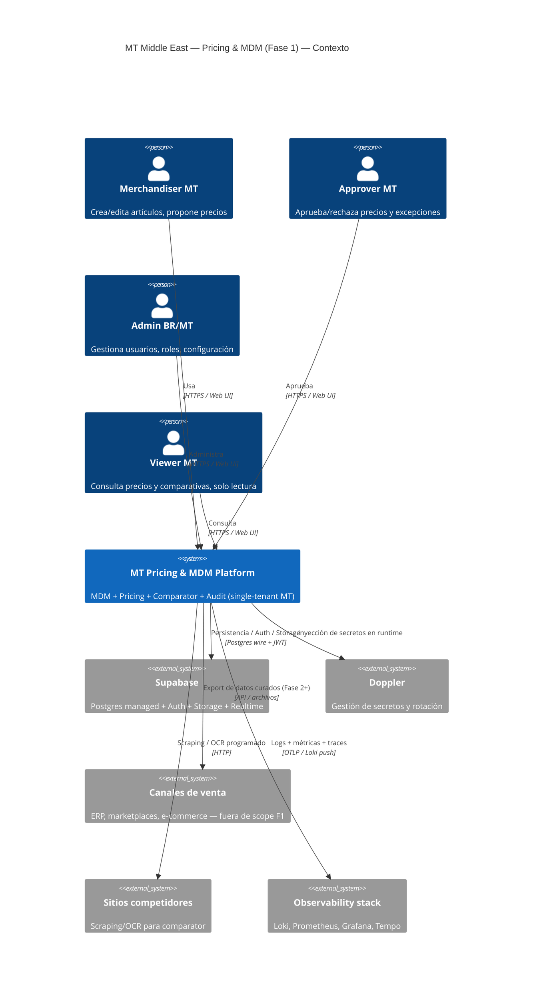

# Arquitectura — MT Pricing & MDM (Fase 1)

Documento vivo: la arquitectura completa, con todos los componentes,
secuencias y decisiones, vive en
[`_bmad-output/planning-artifacts/architecture-mt-pricing-mdm-phase1.md`](../../_bmad-output/planning-artifacts/architecture-mt-pricing-mdm-phase1.md)
(versión actual: **v1.4**).

Este README sirve de *atajo* y reproduce el diagrama C4 nivel 1 (System
Context) para que cualquiera entienda el dibujo grande sin abrir el documento
extenso.

---

## C4 nivel 1 — System Context

---

## C4 nivel 2 (Containers) — resumen

| Container | Tecnología | Responsabilidad |
|---|---|---|
| `mt-pricing-frontend` | Next.js 16 + React 19 | UI: gestión de catálogo, pricing, comparator, aprobaciones |
| `mt-pricing-backend` (API) | FastAPI + SQLAlchemy async | Endpoints REST, validación, autorización, lógica de negocio |
| `mt-pricing-backend` (worker) | Celery | Jobs async: imports, scraping, OCR, recalcs |
| `mt-pricing-backend` (beat) | Celery Beat + DatabaseScheduler | Tareas programadas |
| `redis` | Redis 7 | Broker Celery + cache + rate limiting |
| `postgres` | Supabase Postgres | DB principal con RLS |
| `caddy` | Caddy 2 | Reverse proxy + TLS automático + rate limit edge |
| `observability` | OTel + Loki + Prom + Grafana | Telemetría operacional |

Diagramas detallados (containers + componentes + secuencias críticas) en el
documento maestro de arquitectura.

---

## Patrones arquitectónicos clave

- **Monolito modular** con separación por dominios (catálogo, pricing,
  comparator, users, audit, jobs, kb).
- **Hexagonal en módulos críticos** (pricing engine, comparator) con puertos
  claros para conectores futuros.
- **Persistencia híbrida** SQLAlchemy + Supabase (ver
  [ADR-045](../../_bmad-output/planning-artifacts/adr/ADR-045-persistence-hybrid-sqlalchemy-supabase.md)).
- **Audit-grade**: cambios sensibles → `audit_events` + RLS + JWT con claims
  de rol.
- **Expand-contract** obligatorio en migraciones (ver
  [ADR-049](../../_bmad-output/planning-artifacts/adr/ADR-049-migration-discipline.md)).
- **IA-ready hooks**: puntos de extensión para LLM (resúmenes, validación
  semántica) sin acoplar lógica core (ver
  [ADR-011](../../_bmad-output/planning-artifacts/adr/ADR-011-ia-ready-hooks.md)).

---

## Más lectura

- [Índice de ADRs](../adr/README.md)
- [Roadmap RAG → GraphRAG](../../_bmad-output/planning-artifacts/adr/ADR-038-roadmap-rag-hybrid-graphrag.md)
- [Production readiness master plan](../../_bmad-output/planning-artifacts/production-readiness-master-plan.md)
- [Risk register](../../_bmad-output/planning-artifacts/risk-register-consolidado.md)
