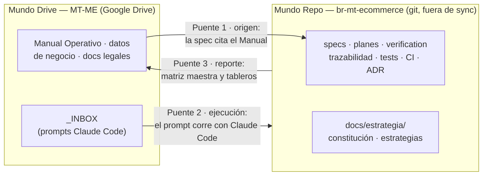
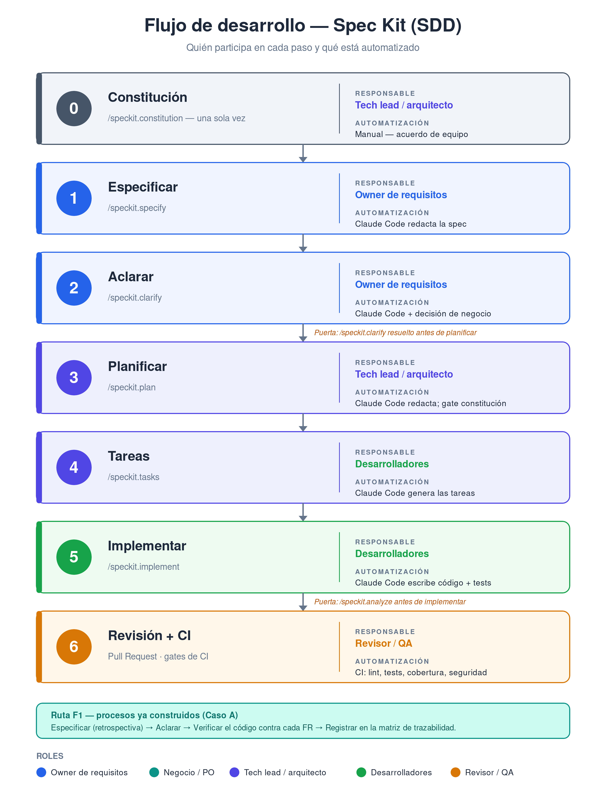

# Estrategia de Desarrollo — Guía práctica para el equipo

*Qué hacer en cada paso, con qué herramienta y quién participa*

| | |
|---|---|
| **Proyecto** | br-mt-ecommerce |
| **Metodología** | Spec-Driven Development (SDD) con GitHub Spec Kit |
| **Versión** | 1.1 (borrador) · pendiente de ratificación |
| **Fecha** | 24 de mayo de 2026 |

> **En una línea**
>
> Usamos Spec-Driven Development (SDD) con GitHub Spec Kit. La herramienta central es Claude Code, que se abre en un terminal dentro del repositorio y ejecuta comandos `/speckit.*` paso a paso. Tú lo diriges y revisas lo que produce.

---

# 1. Propósito de esta guía

Esta guía explica, de forma práctica, cómo construimos br-mt-ecommerce: qué pasos tiene el desarrollo, qué herramienta se usa en cada uno, qué tienes que hacer exactamente, quién participa y qué está automatizado.

Está pensada para usarse con el documento abierto al lado mientras se trabaja. La sección 4 explica las herramientas; la sección 5, el flujo paso a paso; y la sección 10 recorre un ejemplo real completo — el piloto F1-CAT — con el detalle suficiente para repetirlo sin dudas.

---

## Cómo se conectan el repositorio y la carpeta del proyecto

El proyecto vive en dos carpetas físicas **separadas**, y así deben seguir:

- **Repo de código** (`C:\BR-Github\…\br-mt-ecommerce`) — repositorio git, fuera de toda
  carpeta sincronizada.
- **Carpeta de proyecto** (`C:\MT-ME\MT-ME`) — bajo sincronización de Google Drive.

**Regla dura: nunca anidar el repo dentro de la carpeta sincronizada.** Git y la
sincronización en la nube se corrompen mutuamente: el sync compite con los archivos internos
de `.git` y los deja inconsistentes. No se anidan ni como subcarpeta, ni con symlink, ni
como submódulo.

No se conectan físicamente; se conectan **lógicamente**, con una regla y tres puentes.

**La regla — un único hogar por artefacto.** Si un documento puede vivir en dos sitios,
acabará desincronizado. Lo que gobierna o acompaña al código (constitución, specs, planes,
trazabilidad, estrategia, tests, CI, ADR) vive en el **repo**; el conocimiento de negocio
(Manual Operativo, datos operativos, documentos legales/fiscales) vive en **MT-ME**.

**Los tres puentes:**

1. **Origen** (negocio → código): una spec del repo *cita* el Manual Operativo de MT-ME como
   origen de cada requisito. El Manual no se copia; se referencia.
2. **Ejecución** (`_INBOX`): los prompts se redactan en `MT-ME\_INBOX` y se ejecutan contra
   el repo con Claude Code. El prompt es lo único que cruza la frontera; ejecutado, se archiva.
3. **Reporte** (código → gestión): los tableros y la matriz maestra resumen el estado del
   trabajo que vive en el repo, para revisarlo sin abrir el código.

---

# 2. Cómo trabajamos

La estrategia se apoya en tres ideas:

- **Primero la spec.** Antes de escribir o verificar código se describe qué debe hacer el proceso, con requisitos identificados (`FR-<DOM>-NNN`) y criterios comprobables.
- **La constitución manda.** Hay reglas no negociables del proyecto (stack, migraciones, rendimiento, esquema de identificadores). Todo plan se comprueba contra ella.
- **Todo requisito se verifica.** Un requisito sin prueba es una intención. El trabajo no está hecho hasta que la verificación está registrada en la matriz de trazabilidad.

## 2.1. Dos vías según el tipo de trabajo

Antes de empezar, identifica en cuál de las dos vías estás — el recorrido cambia:

| Vía | Cuándo se usa | Recorrido |
|---|---|---|
| **Caso B — funcionalidad nueva** | Se construye algo que no existía. | Los 7 pasos completos: de la spec al código. |
| **Caso A — proceso ya construido (F1)** | El código ya existe pero no se ha verificado. Es la fase viva ahora. | La spec es retrospectiva (documenta lo que el sistema YA hace). No hay paso de implementación: se verifica el código contra cada requisito y se registra en la matriz. |

> **Por qué importa**
>
> br-mt-ecommerce está en pleno desarrollo y no ha entrado en fase de pruebas. Las ~58 historias marcadas «done» son código escrito, no verificado. Por eso la fase viva es F1 (Caso A): un barrido de verificación proceso por proceso. El ejemplo de la sección 10 es exactamente eso.

---

# 3. Los roles del equipo

Cinco roles humanos intervienen en la estrategia, más el agente Claude Code que ejecuta el trabajo en el repositorio bajo la dirección de un humano.

| Rol | Qué hace en la estrategia |
|---|---|
| Owner de requisitos / estrategia | Custodia la estrategia y la cola de procesos. Coordina las specs, mantiene la matriz de trazabilidad y valida que cada proceso quede verificado. |
| Negocio / Product Owner | Aporta y prioriza los requisitos. Resuelve las dudas de negocio en el paso de aclaración y aprueba los criterios de aceptación. |
| Tech lead / arquitecto | Custodia la constitución. Aprueba el plan técnico y las decisiones de arquitectura. Es la autoridad final en lo técnico. |
| Desarrolladores | Dirigen a Claude Code para generar tareas, implementar, verificar y escribir pruebas. Abren los Pull Request. |
| Revisor / QA | Revisa los Pull Request, valida la verificación y la cobertura de pruebas, y aprueba antes de fusionar a main. |
| Claude Code (agente) | Ejecuta el trabajo en el repositorio: corre los comandos `/speckit.*`, redacta, programa y abre PR. Siempre lo dirige y revisa un rol humano. |

---

# 4. Las herramientas: qué uso y cuándo

El flujo se ejecuta con un puñado de herramientas concretas. Esta sección dice qué es cada una, dónde está y cuándo se usa. Es la sección de referencia rápida cuando no sabes «con qué hago esto».

## 4.1. Las herramientas, una por una

| Herramienta | Qué es y dónde está | Cuándo la usas |
|---|---|---|
| Claude Code | El agente de IA que ejecuta el trabajo. Se abre en un terminal situado dentro de la carpeta del repositorio (`C:\BR-Github\br-mt\br-mt-ecommerce`) escribiendo el comando `claude`. | Siempre que haya que correr un comando `/speckit.*`, ejecutar un prompt de `_INBOX` o escribir código o pruebas. |
| Comandos `/speckit.*` | Comandos que se escriben DENTRO de Claude Code (p. ej. `/speckit.specify`). Cada uno ejecuta un paso del flujo. | En el paso del flujo que les corresponde — ver la tabla 5.2. |
| Prompts de `_INBOX` | Archivos markdown ya redactados, en la carpeta `MT-ME\_INBOX`, con instrucciones completas para una tarea concreta. | Cuando una tarea tiene un prompt preparado: se copia su contenido y se pega en Claude Code (es el caso del piloto F1-CAT). |
| El repositorio y git | El código del proyecto en `C:\BR-Github\br-mt\br-mt-ecommerce`. El trabajo se hace siempre en una rama, nunca sobre main. | Para revisar en tu editor los archivos que Claude Code genera (`spec.md`, `verification.md`, matriz) y confirmar en qué rama estás. |
| GitHub (web) | El sitio donde viven las issues, los Pull Request y los resultados de la integración continua (CI). | Para revisar un PR, comprobar si los checks de CI están en verde, o lanzar una tarea escribiendo `@claude` en una issue. |
| El editor (VS Code / Cursor) | Para abrir y leer los archivos markdown y de código que Claude Code produce. | Cada vez que hay que revisar una spec, un plan, una verificación o un test. |

## 4.2. Qué herramienta para cada situación

| Situación | Herramienta | Qué haces |
|---|---|---|
| Empezar a especificar un proceso nuevo | Claude Code | Escribes `/speckit.specify` seguido de la descripción del proceso. |
| Ejecutar un trabajo con prompt preparado (p. ej. el piloto F1-CAT) | Claude Code + prompt de `_INBOX` | Abres el archivo del prompt, copias todo su contenido y lo pegas en Claude Code. |
| Revisar lo que Claude Code generó | El editor | Abres el archivo `.md` (spec, plan, verificación) y lo lees. |
| Comprobar si un cambio pasa los controles | GitHub (web) | Abres el Pull Request y miras los checks de CI bajo la conversación. |
| Lanzar una tarea pequeña desde una incidencia | GitHub | Escribes un comentario que empiece por `@claude` con la instrucción. |
| Ver las reglas no negociables del proyecto | El editor | Abres `.specify/memory/constitution.md` en el repositorio. |

---

# 5. El flujo de desarrollo, paso a paso

El desarrollo dirigido por especificación encadena siete pasos. El diagrama de abajo los resume; después se describe cada uno con un bloque «En la práctica» que dice exactamente qué hacer.

## 5.1. Diagrama del flujo

*Flujo SDD: del paso 0 al paso 6. La banda inferior es la ruta F1 para procesos ya construidos.*

## 5.2. Los siete pasos en detalle

### Paso 0 — Constitución

Las reglas no negociables del proyecto: stack obligatorio, política de migraciones, directrices de rendimiento, esquema de identificadores y la Definición de Hecho. Se escribe una sola vez; se enmienda solo por acuerdo del equipo. Todo plan se comprueba contra ella.

**Responsable:** Tech lead / arquitecto. **Herramienta:** `/speckit.constitution` (una sola vez)

> **En la práctica**
>
> Ya está hecha. Para consultarla, abre en tu editor el archivo `.specify/memory/constitution.md` dentro del repositorio.

### Paso 1 — Especificar

Se describe QUÉ debe hacer el proceso, sin decir cómo. Produce el archivo `spec.md` con requisitos `FR-<DOM>-NNN`, escenarios de aceptación Given/When/Then y criterios de éxito medibles.

**Responsable:** Owner de requisitos. **Herramienta:** `/speckit.specify`

> **En la práctica**
>
> Abre un terminal en la carpeta del repo y arranca Claude Code (comando `claude`).
>
> Dentro de Claude Code escribe `/speckit.specify` seguido de la descripción del proceso.
>
> Claude Code crea una rama y la carpeta `specs/NNN-<dom>-<slug>/` con el archivo `spec.md`. Ábrelo en tu editor y revísalo.

### Paso 2 — Aclarar

Se resuelven las ambigüedades que la spec marcó como `[NEEDS CLARIFICATION]`. Las dudas de negocio las decide el Product Owner. Es una puerta: la spec no avanza con marcadores sin resolver.

**Responsable:** Owner de requisitos. **Herramienta:** `/speckit.clarify`

> **En la práctica**
>
> Dentro de Claude Code escribe `/speckit.clarify`. Claude Code lista las preguntas pendientes.
>
> Responde cada una; las de negocio, consúltalas con el Product Owner.
>
> Verifica al final que la palabra `[NEEDS CLARIFICATION]` ya no aparezca en `spec.md`.

### Paso 3 — Planificar

Se decide CÓMO se construye: arquitectura, módulos, contratos de datos y de API. El plan se comprueba contra la constitución; las excepciones se documentan, no se asumen.

**Responsable:** Tech lead / arquitecto. **Herramienta:** `/speckit.plan`

> **En la práctica**
>
> Dentro de Claude Code escribe `/speckit.plan`. Se crea el archivo `plan.md`.
>
> El Tech lead abre `plan.md` y confirma que no contradice la constitución.

### Paso 4 — Tareas

El plan se descompone en tareas concretas, pequeñas y ordenadas, cada una entregable y comprobable por separado.

**Responsable:** Desarrolladores. **Herramienta:** `/speckit.tasks`

> **En la práctica**
>
> Dentro de Claude Code escribe `/speckit.tasks`. Se genera la lista de tareas en `tasks.md`.

### Paso 5 — Implementar

Se escribe el código y sus pruebas, tarea a tarea. La puerta previa es `/speckit.analyze`, que comprueba la coherencia entre spec, plan y tareas.

**Responsable:** Desarrolladores. **Herramienta:** `/speckit.analyze` y luego `/speckit.implement`

> **En la práctica**
>
> Primero escribe `/speckit.analyze` y revisa que no señale incoherencias.
>
> Después escribe `/speckit.implement`. Claude Code escribe el código y los tests, tarea a tarea.

### Paso 6 — Revisión + CI

Se abre un Pull Request. Los gates de integración continua corren automáticamente (lint, tipos, tests, cobertura, seguridad). Un revisor humano aprueba. Solo entonces el cambio se fusiona a main.

**Responsable:** Revisor / QA. **Herramienta:** GitHub (Pull Request + checks de CI)

> **En la práctica**
>
> Claude Code abre el Pull Request. Tú entras en **GitHub**, abres el PR y miras los checks de CI bajo la conversación.
>
> Si están en verde y la revisión es correcta, el Revisor aprueba y se fusiona.

> **Las dos puertas de control**
>
> La constitución fija dos puertas obligatorias: `/speckit.clarify` debe estar resuelto antes de planificar, y `/speckit.analyze` debe pasar antes de implementar. Saltarse una puerta es la causa más común de retrabajo.

---

# 6. Tabla RACI — quién participa en cada paso

La tabla RACI dice, para cada paso, qué hace cada rol. La convención: R — Responsable (ejecuta); A — Aprueba (da el visto bueno); C — Consultado (aporta antes de cerrar); I — Informado (se le comunica el resultado).

| Paso | Owner req. | Negocio / PO | Tech lead | Desarrol. | Revisor / QA |
|---|---|---|---|---|---|
| 0 · Constitución | C | I | A / R | C | C |
| 1 · Especificar | R | A | C | I | I |
| 2 · Aclarar | R | A | C | I | I |
| 3 · Planificar | C | I | A / R | C | I |
| 4 · Tareas | I | I | A | R | I |
| 5 · Implementar | I | I | A | R | C |
| 6 · Revisión + CI | I | I | A | C | R |
| Verificación F1 | A | I | C | R | C |

> **NOTA AL EQUIPO**
>
> Esta asignación RACI es una propuesta de trabajo. Debe revisarse y ratificarse en equipo — es una de las decisiones abiertas de la sección 14.

---

# 7. Qué está automatizado

## 7.1. Lo que ejecutan las máquinas

| Mecanismo | Qué hace |
|---|---|
| Claude Code (GitHub Action) | Mencionar `@claude` en una issue o un PR dispara el agente. Corre los comandos `/speckit.*`, redacta, programa y abre PR. Operativo en main. |
| pre-commit (backend) | En cada commit ejecuta `ruff check --fix` y `ruff format` — estilo y formato sin intervención manual. |
| CI — gates base (bloquean el merge) | `ci-backend.yml` y `ci-frontend.yml`: lint, tipos, tests con cobertura, auditoría de seguridad y build. `pr-checks.yml`: commits convencionales y plantilla de PR completa. |
| CI — suite completa | `ci-backend-full.yml` y `ci-frontend-full.yml`: tests de integración sobre Postgres/Redis y, tras un flag, los tests end-to-end de Playwright. |
| Seguridad | `codeql.yml` y `secrets-scan.yml`: análisis estático y detección de secretos filtrados. |

## 7.2. Lo que exige criterio humano

La automatización no decide. Estas tareas son siempre de una persona:

- Escribir los requisitos y decidir las prioridades.
- Resolver las dudas de negocio en el paso de aclaración.
- Aprobar el plan técnico y las decisiones de arquitectura.
- Revisar y aprobar el Pull Request antes del merge.
- Ratificar y enmendar la constitución.

---

# 8. Las cuatro capas de prueba

La estrategia tiene una capa de pruebas propia, detallada en el documento [[estrategia-pruebas]]. En resumen:

| Capa | Qué prueba | Herramienta |
|---|---|---|
| 1 · Desarrollo | Lógica de negocio: unidad e integración. | pytest, vitest, testcontainers |
| 2 · End-to-end | Recorridos completos de usuario. | Playwright |
| 3 · Proceso | Cada FR anclado a un test ejecutable (capa F1). | pytest (marcador `acceptance`) |
| 4 · Calidad del dato | El catálogo real en producción. | `GET /admin/pim/data-quality` |

Un proceso está «probado» cuando cada requisito P1/P2 tiene un test automatizado anclado a su identificador, la suite pasa en verde, la cobertura respeta el gate (≥ 70 % en backend) y la matriz de trazabilidad lo refleja.

---

# 9. Cómo usar la estrategia correctamente

## 9.1. Buenas prácticas

- **Empezar por la spec.** Ningún código sin un requisito que lo justifique.
- **Cerrar las aclaraciones.** No dejar marcadores `[NEEDS CLARIFICATION]` sin resolver.
- **Respetar la constitución.** El plan se comprueba contra ella; las excepciones se documentan, no se asumen.
- **F1 verifica, no corrige.** Las brechas que destapa la verificación se vuelven issues; no se parchean dentro del mismo PR de verificación.
- **Cada requisito termina en una prueba.** Los FR P1/P2 acaban con un test automatizado anclado a su identificador.
- **PR pequeños y con plan de prueba.** Cada Pull Request rellena su sección Test plan.
- **La matriz, siempre al día.** Es la fuente única de qué está hecho y verificado.

## 9.2. Errores a evitar

- Saltarse el paso de especificar e ir directo al código.
- Marcar una historia como «done» sin verificarla contra los requisitos.
- Mezclar verificación y corrección de errores en el mismo Pull Request.
- Trabajar sobre main directamente en lugar de una rama.
- Hardcodear horarios de tareas — van en `public.job_definitions`, no en el código.
- Saltarse una puerta de control (clarify, analyze) «para ir más rápido».

---

# 10. Ejemplo detallado — el piloto F1-CAT

Esta sección recorre el primer proceso real de principio a fin, con el detalle necesario para repetirlo sin dudas. El piloto F1 es el proceso CAT — la gestión del catálogo de productos (la ficha de producto: alta, consulta, búsqueda, edición, clasificación y baja; 14 endpoints). Es un Caso A: el código ya existe y hay que verificarlo.

> **Antes de empezar — lo que necesitas a mano**
>
> El repositorio en `C:\BR-Github\br-mt\br-mt-ecommerce`. Los prompts `Prompt_ClaudeCode_F1_CAT_Piloto_ES.md` y `Prompt_ClaudeCode_F1_CAT_Pruebas_ES.md`, en `MT-ME\_INBOX`. El control `F1-CAT_Control_Piloto.md`, en `MT-ME\F1-Control`. Un terminal y tu editor.

### Paso 1 — Confirmar el alcance del proceso

**Quién:** Owner de requisitos

**Herramienta:** Los documentos `F0_SpecKit_Arranque_y_Bloqueos_ES.md` y [[f1-cat-control-piloto]].

Antes de tocar nada, hay que estar seguro de qué entra en el proceso piloto.

**Qué haces, en concreto:**

1. Abre el documento F0 y localiza, en la cola de 24 procesos, el del dominio CAT.
2. Abre **[[f1-cat-control-piloto]]** y revisa su sección 3: el alcance es «la ficha de producto», 14 endpoints.
3. Si el F0 define el primer proceso CAT de otra forma, ajusta el alcance en el control y en el prompt antes de seguir.

**Resultado:** El alcance del proceso queda confirmado por escrito.

**Cómo sabes que está bien:** Hay una frontera clara: sabes qué endpoints entran y cuáles no.

### Paso 2 — Arrancar Claude Code con el prompt de verificación

**Quién:** Owner de requisitos o un Desarrollador

**Herramienta:** Un terminal y Claude Code, dentro de la carpeta del repositorio.

El piloto no se ejecuta a mano: se usa un prompt ya preparado.

**Qué haces, en concreto:**

1. Abre un terminal en la carpeta `C:\BR-Github\br-mt\br-mt-ecommerce`.
2. Arranca Claude Code: escribe `claude` y pulsa Enter.
3. Abre el archivo `MT-ME\_INBOX\Prompt_ClaudeCode_F1_CAT_Piloto_ES.md` y copia TODO su contenido.
4. Pégalo en Claude Code como primer mensaje y envíalo.

**Resultado:** Claude Code lee el prompt y empieza a ejecutar su plan de pasos.

**Cómo sabes que está bien:** Claude Code resume el plan (preparar git, especificar, aclarar...) y arranca por el primero.

### Paso 3 — Generar la spec retrospectiva

**Quién:** Claude Code, dirigido por el Owner de requisitos

**Herramienta:** Claude Code (ejecuta el comando `/speckit.specify`).

Claude Code documenta lo que el catálogo YA hace, como requisitos verificables.

**Qué haces, en concreto:**

1. Deja que Claude Code cree la rama `001-cat-gestion-catalogo-productos` y la carpeta del spec.
2. Cuando termine, abre `specs/001-cat-gestion-catalogo-productos/spec.md` en tu editor.
3. Comprueba que los requisitos estén numerados `FR-CAT-001, FR-CAT-002...` y que cada uno tenga un escenario Given/When/Then.

**Resultado:** La spec retrospectiva del catálogo, escrita y con identificadores FR-CAT-NNN.

**Cómo sabes que está bien:** El archivo existe, usa identificadores `FR-CAT-NNN` y no tiene secciones de plantilla vacías.

### Paso 4 — Aclarar las dudas

**Quién:** Owner de requisitos, con el Product Owner para las dudas de negocio

**Herramienta:** Claude Code (comando `/speckit.clarify`).

La spec no avanza con preguntas abiertas.

**Qué haces, en concreto:**

1. Claude Code lista las preguntas marcadas `[NEEDS CLARIFICATION]`.
2. Responde cada una; las de negocio, consúltalas con el Product Owner.
3. Una duda que el equipo no pueda cerrar ahora: pídele a Claude Code que la deje como «NOTA AL EQUIPO» dentro de la spec y continúe.

**Resultado:** Una spec sin marcadores sin resolver.

**Cómo sabes que está bien:** Al buscar `[NEEDS CLARIFICATION]` en `spec.md` no aparece ningún resultado.

### Paso 5 — Plan «as-built» y la puerta analyze

**Quién:** Claude Code lo redacta; el Tech lead lo revisa

**Herramienta:** Claude Code (comandos `/speckit.plan` y `/speckit.analyze`).

Se documenta la arquitectura tal como ya está construida y se comprueba su coherencia.

**Qué haces, en concreto:**

1. Claude Code crea `plan.md` marcado «as-built / retrospectivo» y ejecuta `/speckit.analyze`.
2. El Tech lead abre `plan.md` y confirma que describe los módulos reales del catálogo y no contradice la constitución.
3. Revisa el resultado de `/speckit.analyze`: si señala incoherencias, anótalas.

**Resultado:** El plan retrospectivo y el informe de coherencia.

**Cómo sabes que está bien:** `/speckit.analyze` termina sin incoherencias graves, o las que hay quedan anotadas.

### Paso 6 — Verificar el código contra cada requisito

**Quién:** Desarrolladores (Claude Code ejecuta, el desarrollador dirige y revisa)

**Herramienta:** Claude Code y tu editor.

Es el corazón de F1: contrastar lo implementado con lo que cada requisito exige.

**Qué haces, en concreto:**

1. Claude Code recorre cada `FR-CAT-NNN` y lo contrasta con el código real.
2. Produce `verification.md`, que clasifica cada requisito como Verificado, Parcial, No cumple o No implementado, con la evidencia (archivo:línea).
3. Abre `verification.md` y `traceability-cat.csv` y revisa que cada FR tenga estado y evidencia, y que las brechas estén bien descritas.

**Resultado:** Sabes exactamente qué del catálogo cumple sus requisitos y qué no.

**Cómo sabes que está bien:** Cada FR tiene un estado y una evidencia; ningún FR queda «sin verificar».

**Atención:** en este paso NO se corrige el código. Las brechas se documentan para abrir issues; se arreglan después, fuera del piloto.

### Paso 7 — Abrir el Pull Request de verificación

**Quién:** Claude Code lo abre; lo revisas en GitHub

**Herramienta:** Claude Code (crea el PR) y GitHub (web).

La verificación queda registrada en un cambio revisable.

**Qué haces, en concreto:**

1. Claude Code abre un PR a main titulado «F1 piloto — verificación proceso CAT».
2. Entra en **GitHub**, abre el PR y mira los checks de CI bajo la conversación: deben estar en verde.
3. Lee el «Resumen de estado» que Claude Code dejó en la descripción del PR.

**Resultado:** La verificación del catálogo, registrada en un Pull Request.

**Cómo sabes que está bien:** El PR está abierto y todos los checks de CI pasan.

### Paso 8 — Automatizar las pruebas del proceso

**Quién:** Desarrolladores (Claude Code ejecuta)

**Herramienta:** Terminal, Claude Code y el prompt `Prompt_ClaudeCode_F1_CAT_Pruebas_ES.md`.

Cada requisito pasa de «verificado a mano» a «verificado por un test que corre solo».

**Qué haces, en concreto:**

1. Igual que el paso 2, pero con el segundo prompt: abre Claude Code en el repo y pega el contenido de `Prompt_ClaudeCode_F1_CAT_Pruebas_ES.md`.
2. Claude Code escribe el archivo `test_cat_acceptance.py` con un test por cada requisito y actualiza la matriz.
3. Cuando termine, comprueba en el terminal que la suite pase: `pytest -m acceptance`.

**Resultado:** Cada requisito P1/P2 tiene una prueba automatizada anclada a su identificador.

**Cómo sabes que está bien:** La suite pasa en verde y la cobertura sigue por encima del 70 %.

### Paso 9 — Revisión humana y aprobación

**Quién:** Revisor / QA

**Herramienta:** GitHub (web).

Una persona valida el trabajo antes de que entre en main.

**Qué haces, en concreto:**

1. Abre en GitHub los dos Pull Request: el de verificación y el de pruebas.
2. Comprueba que los checks de CI estén en verde y la cobertura respetada.
3. Revisa que la verificación y las pruebas sean coherentes con la spec, y aprueba. Solo entonces se fusiona a main.

**Resultado:** El trabajo del piloto entra en main.

**Cómo sabes que está bien:** Los dos PR están aprobados, en verde y fusionados.

### Paso 10 — Validar y cerrar el piloto

**Quién:** Owner de requisitos

**Herramienta:** El documento de control [[f1-cat-control-piloto]].

Se comprueba que todo el piloto se completó y se deja la plantilla lista para escalar.

**Qué haces, en concreto:**

1. Abre **[[f1-cat-control-piloto]]** y recorre su sección 4, «criterios de validación del piloto».
2. Marca cada tarea (T0–T7) como «Verificado», comprobándola contra el repo y los PR.
3. Vuelca el estado de cada requisito a la matriz maestra y anota los aprendizajes: qué del flujo funcionó y qué ajustar.

**Resultado:** El piloto F1-CAT cerrado y validado; la plantilla lista para los ~24 procesos restantes.

**Cómo sabes que está bien:** Todos los criterios de validación del control están marcados.

---

# 11. Cómo se conectan el repositorio y la carpeta del proyecto (detalle)

El trabajo se reparte entre dos carpetas: el repositorio de código (br-mt-ecommerce) y la carpeta del proyecto (MT-ME). No se conectan metiendo una dentro de la otra; se conectan por una regla y tres puentes. Ver el diagrama al inicio de esta guía.

> **Regla dura — nunca anidar una carpeta dentro de la otra**
>
> MT-ME está bajo sincronización de Google Drive; el repositorio es un repositorio git. Git y la sincronización en la nube se corrompen mutuamente: ya ocurrió una vez (`.git` dañado, rama fantasma, miles de cambios espurios). El repo vive fuera de toda carpeta sincronizada, MT-ME se queda en Drive, y no se anidan — ni con symlink ni como submódulo.

## 11.1. La regla: un solo hogar por artefacto

Cada artefacto vive en un único sitio — una sola fuente de verdad. Si un documento puede estar en dos lugares, acabará desincronizado.

| Qué | Dónde vive | Por qué |
|---|---|---|
| Constitución, specs, planes, `verification.md`, trazabilidad, tests, CI, ADR | El repositorio br-mt-ecommerce | Cambian al ritmo del código; se versionan con él. |
| Documentación de estrategia: esta guía, la estrategia de requisitos y la de pruebas | El repositorio, en `docs/estrategia/` | Gobierna el código; y como el repo ya es un vault de Obsidian, los wiki-links funcionan. |
| Manual Operativo, mapa de macroprocesos, documentos legales/fiscales, datos operativos | La carpeta MT-ME | Es conocimiento de negocio: la fuente de los requisitos, no código. |
| Prompts de Claude Code | MT-ME, carpeta `_INBOX` | Vehículo temporal que cruza la frontera; ver el puente 2. |

## 11.2. Los tres puentes

Los dos mundos se comunican únicamente por estos tres puentes:

- **Puente de origen (negocio → código).** Una spec del repositorio cita el Manual Operativo de MT-ME como origen de cada requisito. El Manual no se copia al repo: se referencia.
- **Puente de ejecución, el `_INBOX` (proyecto → código).** Los prompts de Claude Code se redactan en la carpeta `_INBOX` de MT-ME y se ejecutan contra el repositorio. El prompt es lo único que cruza la frontera; una vez ejecutado, se archiva.
- **Puente de reporte (código → gestión).** Los tableros de control y la matriz maestra resumen el estado del trabajo que vive en el repositorio, para revisarlo sin abrir el código.

> **Qué implica para los documentos de estrategia**
>
> Los documentos de estrategia están ahora en el repositorio, en `docs/estrategia/`, donde quedan versionados y con los wiki-links de Obsidian operativos. La matriz maestra también pasará al repositorio, regenerada desde los CSV de trazabilidad de cada proceso. Esa migración se hace vía Pull Request, no copiando archivos sueltos.

---

# 12. Dónde está todo

| Artefacto | Ubicación |
|---|---|
| Constitución del proyecto | `br-mt-ecommerce\.specify\memory\constitution.md` |
| Specs de los procesos | `br-mt-ecommerce\specs\NNN-<dom>-<slug>\` |
| Matriz maestra de trazabilidad | `Matriz_Trazabilidad_Verificacion_SpecKit.xlsx` (pendiente de hogar definitivo) |
| Estrategia de requisitos | `docs/estrategia/estrategia-requisitos.md` en el repositorio |
| Estrategia de pruebas | `docs/estrategia/estrategia-pruebas.md` en el repositorio |
| Plan de pruebas F1-CAT | `docs/estrategia/f1-cat-plan-de-pruebas.md` en el repositorio |
| Control F1-CAT | `docs/estrategia/f1-cat-control-piloto.md` en el repositorio |
| Prompts de ejecución para Claude Code | `MT-ME\_INBOX\Prompt_ClaudeCode_*.md` |
| Workflows de integración continua | `br-mt-ecommerce\.github\workflows\` |
| Tests | `mt-pricing-backend\tests\` y `mt-pricing-frontend\tests\e2e\` |

---

# 13. Glosario

| Término | Significado |
|---|---|
| SDD | Spec-Driven Development — desarrollo dirigido por la especificación. |
| Spec Kit | Herramienta de GitHub que implementa el flujo SDD con comandos `/speckit.*`. |
| Claude Code | El agente de IA que ejecuta el trabajo en el repositorio. |
| Constitución | Las reglas no negociables del proyecto contra las que se comprueba todo plan. |
| Spec | Documento que define qué debe hacer un proceso: requisitos, criterios, éxito. |
| `FR-<DOM>-NNN` | Identificador de un requisito funcional; DOM es el dominio (CAT, PRC...). |
| Criterio de aceptación | Condición comprobable (Given/When/Then) que demuestra un requisito. |
| Matriz de trazabilidad | Registro que enlaza cada requisito con su implementación, test y estado. |
| F0 / F1 | Fases: F0 preparó la estrategia y la herramienta; F1 verifica proceso por proceso. |
| Caso A / Caso B | A: verificar un proceso ya construido. B: especificar funcionalidad nueva. |
| Puerta (gate) | Control obligatorio que debe pasarse antes de avanzar (clarify, analyze). |
| CI | Integración continua: los workflows que validan automáticamente cada cambio. |
| PR | Pull Request: la propuesta de cambio que se revisa antes de fusionar a main. |

---

# 14. Decisiones abiertas (NOTAS AL EQUIPO)

Estos puntos están pendientes de una decisión del equipo. No bloquean el trabajo, pero conviene cerrarlos pronto:

- Ratificar la tabla RACI de la sección 6.
- Confirmar la adopción de Spec Kit a la luz de los resultados del piloto CAT.
- Ratificar el esquema de identificadores de diez dominios.
- Decidir cuándo los tests end-to-end (Playwright) pasan a ser un gate bloqueante.
- Decidir el hogar definitivo de la matriz maestra de trazabilidad.
- Incorporar un artículo de pruebas explícito a la constitución.
- Definir los umbrales de calidad del dato por dominio.
