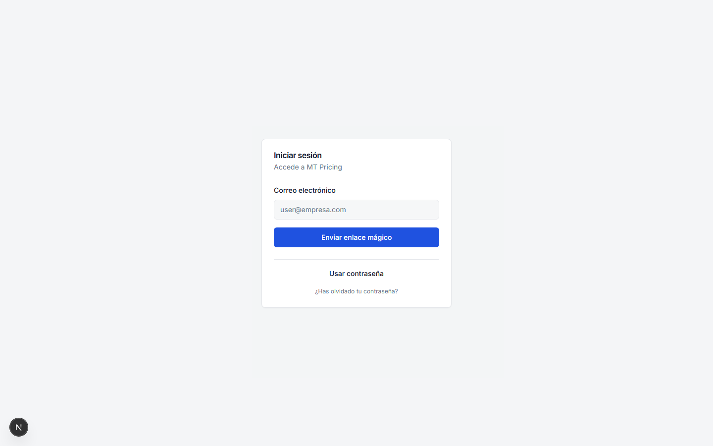
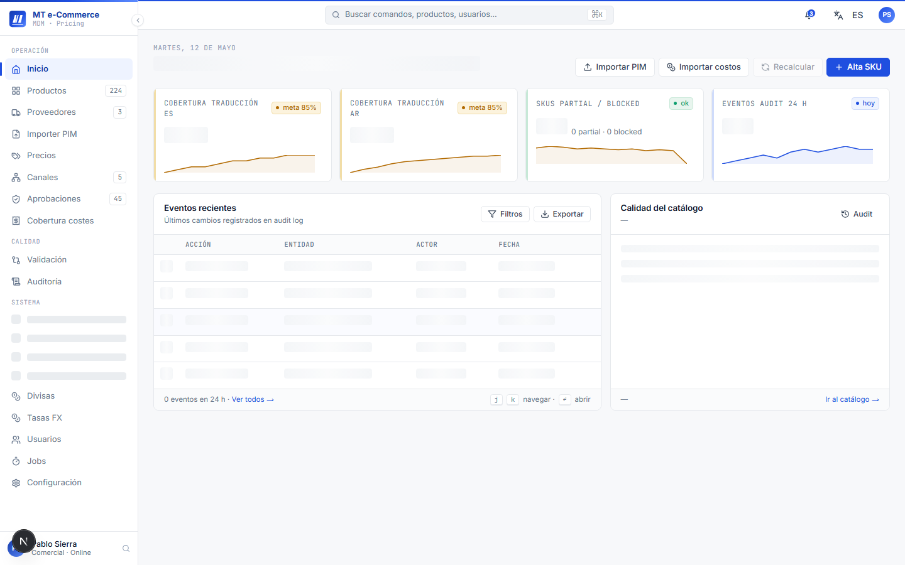
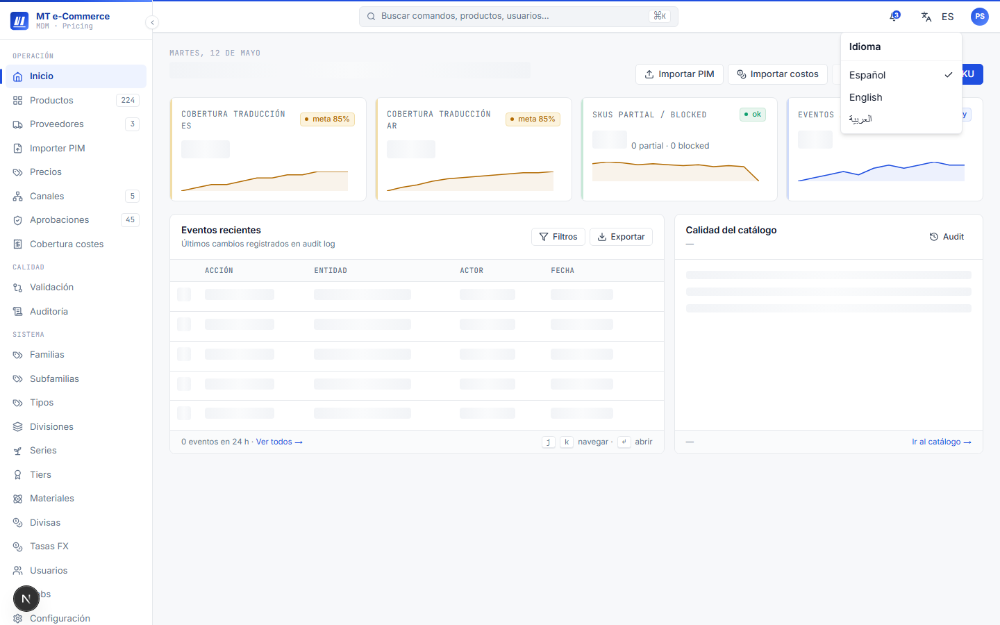
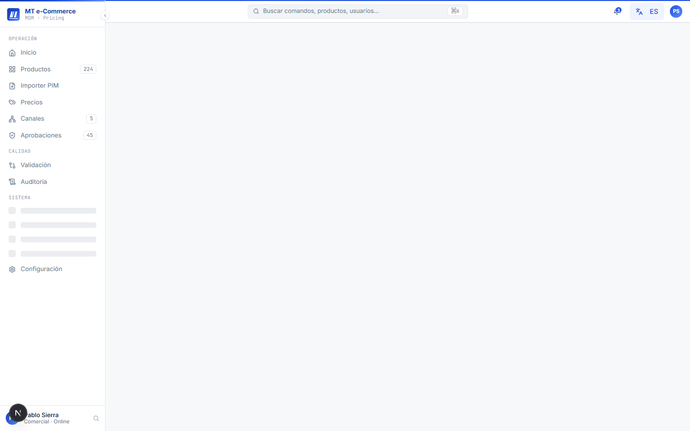

# Manual de Usuario — Acceso y Primeros Pasos

**Versión:** 1.0  
**Fecha:** 2026-05-12  
**Audiencia:** Todos los usuarios (Comercial, Gerente, TI)  
**Sistema:** MT Middle East MDM + Pricing — Fase 1

---

## Índice

1. [¿Qué es este sistema?](#1-qué-es-este-sistema)
2. [Roles de usuario](#2-roles-de-usuario)
3. [Acceder al sistema](#3-acceder-al-sistema)
4. [Navegar el Dashboard](#4-navegar-el-dashboard)
5. [Cambiar idioma](#5-cambiar-idioma)
6. [Gestionar tu cuenta](#6-gestionar-tu-cuenta)
7. [Recuperar contraseña](#7-recuperar-contraseña)
8. [Cerrar sesión](#8-cerrar-sesión)
9. [Preguntas frecuentes](#9-preguntas-frecuentes)

---

## 1. ¿Qué es este sistema?

MT Middle East MDM + Pricing es la plataforma centralizada para gestionar el catálogo de productos, costes, precios multi-canal y el proceso de aprobación de precios por excepción. Reemplaza el flujo basado en Excel.

**Módulos principales:**

| Módulo | Descripción |
|--------|-------------|
| Catálogo (PIM) | Alta y edición de artículos con fichas técnicas, imágenes y traducciones |
| Proveedores | Maestro de proveedores con condiciones contractuales |
| Costes | Costes por SKU desglosados por esquema de venta |
| Precios | Motor de pricing multi-canal con workflow de aprobación |
| Canales | Estados de publicación y simulador |
| Configuración | Usuarios, RBAC, monedas, jobs y conectores |

---

## 2. Roles de usuario

El sistema tiene 3 roles. Cada rol determina qué pantallas y acciones están disponibles.

| Rol | Nombre en sistema | Capacidades principales |
|-----|-------------------|------------------------|
| **Comercial** | `comercial` | Ver y editar catálogo, proponer precios, cargar importers |
| **Gerente** | `gerente_comercial` | Todo lo de Comercial + aprobar/rechazar precios, gestionar excepciones |
| **TI** | `ti_integracion` | Todo lo anterior + usuarios, conectores, jobs, logs |

> Tu rol te lo asigna TI. Si necesitas permisos adicionales, contacta a tu administrador TI.

---

## 3. Acceder al sistema

### 3.1 URL de acceso

Abre tu navegador y ve a:

```
http://localhost:3000
```

> En producción, la URL te la proporcionará el equipo TI de MT.

### 3.2 Iniciar sesión con email y contraseña

1. En la pantalla de login, selecciona la pestaña **Email + Password**.
2. Introduce tu **correo corporativo** (ejemplo: `usuario@mt-middleeast.com`).
3. Introduce tu **contraseña** (mínimo 12 caracteres).
4. Haz clic en **Entrar**.


> *Captura: navegar a `http://localhost:3000/login` y capturar la pantalla completa.*

**Requisitos de contraseña:**
- Mínimo 12 caracteres
- Si introduces credenciales incorrectas varias veces, la cuenta se bloquea 15 minutos automáticamente

### 3.3 Iniciar sesión con Magic Link

Si prefieres no recordar contraseña:

1. Selecciona la pestaña **Magic link**.
2. Introduce tu correo corporativo.
3. Haz clic en **Enviar enlace**.
4. Revisa tu bandeja de entrada y haz clic en el enlace recibido — te autenticará directamente.

### 3.4 Autenticación de dos factores (MFA)

Si tu cuenta tiene MFA activado:

1. Tras introducir email y contraseña, el sistema te pedirá el código TOTP.
2. Abre tu aplicación de autenticación (Google Authenticator, Authy, etc.).
3. Introduce el código de 6 dígitos y haz clic en **Verificar**.

---

## 4. Navegar el Dashboard

Tras autenticarte, accedes al **Dashboard**, que muestra información adaptada a tu rol.


> *Captura: pantalla completa del dashboard tras login exitoso.*

### Menú lateral

El menú lateral izquierdo muestra las secciones disponibles según tu rol:

```
MT Middle East
├── Dashboard
├── Catálogo
├── Proveedores          (Comercial+)
├── Costes               (Comercial+)
├── Precios              (Comercial+)
│   ├── Mi cola          (Gerente)
│   ├── Simulador
│   └── Mis propuestas
├── Canales              (Gerente+)
├── Auditoría            (Gerente+)
├── Configuración        (TI)
└── Mi cuenta
```

### Barra superior

La barra superior muestra:
- **Nombre de usuario** y rol activo (chip de color)
- **Selector de idioma** (ES / EN / AR)
- **Notificaciones** (campana) — precios escalados, tareas pendientes
- **Mi cuenta** (avatar)

---

## 5. Cambiar idioma

El sistema soporta tres idiomas: Español, Inglés y Árabe (con layout RTL).

1. Haz clic en el selector de idioma en la barra superior o en el footer del login.
2. Selecciona **ES**, **EN** o **AR**.
3. La preferencia se guarda automáticamente en tu perfil — se aplica en todas las sesiones futuras.


> *Captura: selector de idioma desplegado en la barra superior.*

> **Nota árabe (AR):** Al seleccionar árabe, el layout cambia a dirección RTL (de derecha a izquierda). Todos los textos del sistema aparecen en árabe. Los datos de producto (nombres técnicos, SKUs) siguen en su idioma original.

---

## 6. Gestionar tu cuenta

Accede a **Mi cuenta** desde el avatar en la barra superior o desde el menú lateral.

Desde esta pantalla puedes:
- Ver tu **nombre, email y rol asignado** (solo lectura — los roles los gestiona TI)
- Cambiar tu **contraseña**
- Configurar o desactivar **MFA** (autenticación de dos factores)
- Ver tu **historial de sesiones** activas


> *Captura: pantalla Mi cuenta / preferencias (`http://localhost:3000/account`).*

---

## 7. Recuperar contraseña

Si olvidaste tu contraseña:

1. En la pantalla de login, haz clic en **Olvidé mi contraseña**.
2. Introduce tu correo corporativo.
3. Recibirás un email con un enlace de restablecimiento (válido 1 hora).
4. Haz clic en el enlace, introduce tu nueva contraseña (mínimo 12 caracteres) y confirma.

> Si no recibes el email en 5 minutos, revisa la carpeta de spam o contacta a TI.

---

## 8. Cerrar sesión

Para cerrar sesión de forma segura:

1. Haz clic en tu **avatar** (barra superior derecha).
2. Selecciona **Cerrar sesión**.

> Si un administrador TI revoca tu acceso o cambia tu rol, tu sesión se cierra automáticamente en el siguiente request. Tendrás que volver a autenticarte.

---

## 9. Preguntas frecuentes

**¿Por qué no veo algunas secciones del menú?**  
Las secciones disponibles dependen de tu rol. Si necesitas acceso a un módulo, contacta a TI.

**¿Por qué no puedo iniciar sesión?**  
Verifica que estás usando tu correo corporativo y que la contraseña sea correcta. Tras varios intentos fallidos, la cuenta se bloquea 15 minutos automáticamente. Espera o contacta a TI.

**¿Puedo usar el mismo usuario en varios dispositivos a la vez?**  
Sí. Las sesiones son independientes. Al cerrar sesión en un dispositivo, el resto de sesiones permanecen activas.

**¿Qué hago si mi pantalla está en un idioma que no entiendo?**  
Busca el selector de idioma en la parte inferior del footer (en el login) o en la barra superior (una vez autenticado). Selecciona ES para Español.

**¿Con qué navegadores es compatible el sistema?**  
Chrome 120+, Firefox 122+, Edge 121+, Safari 17+. No se recomienda Internet Explorer.

---

*Para soporte técnico, contacta al equipo TI de MT.*
