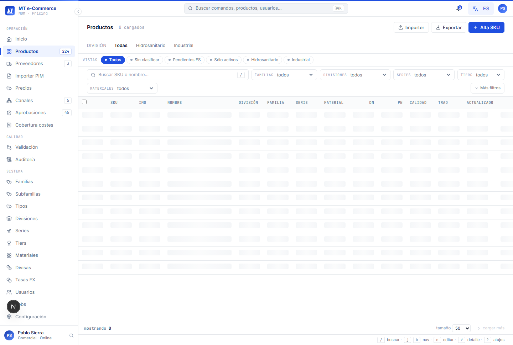
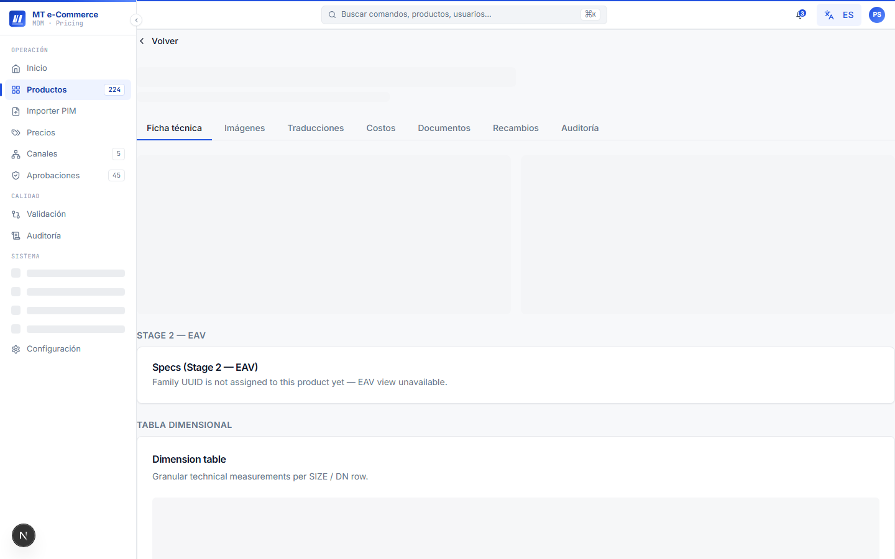
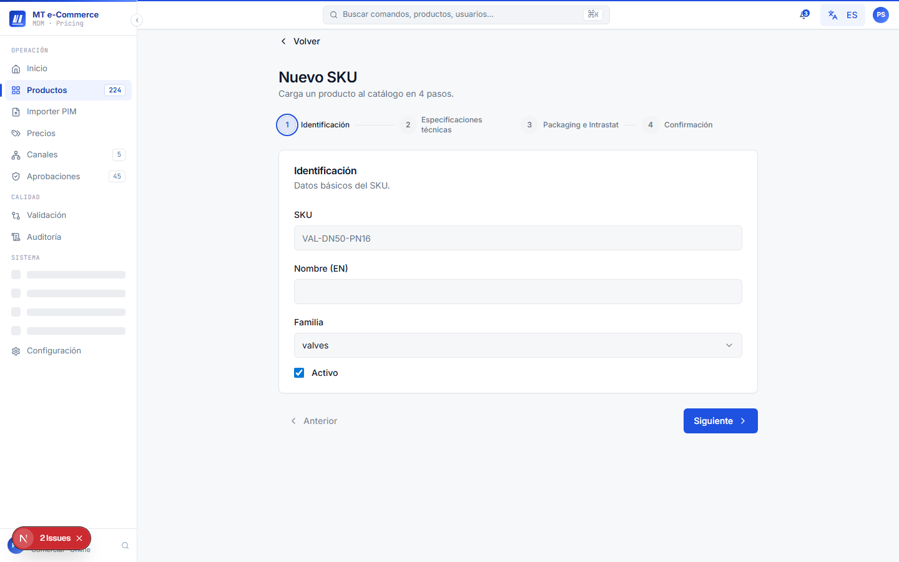
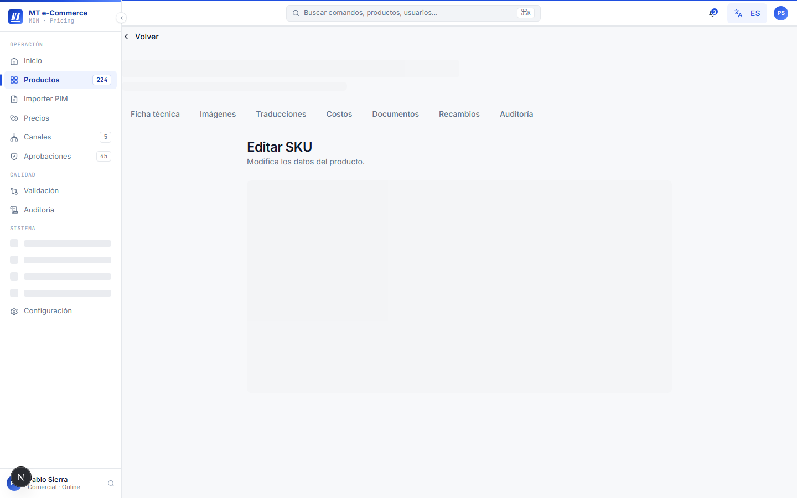
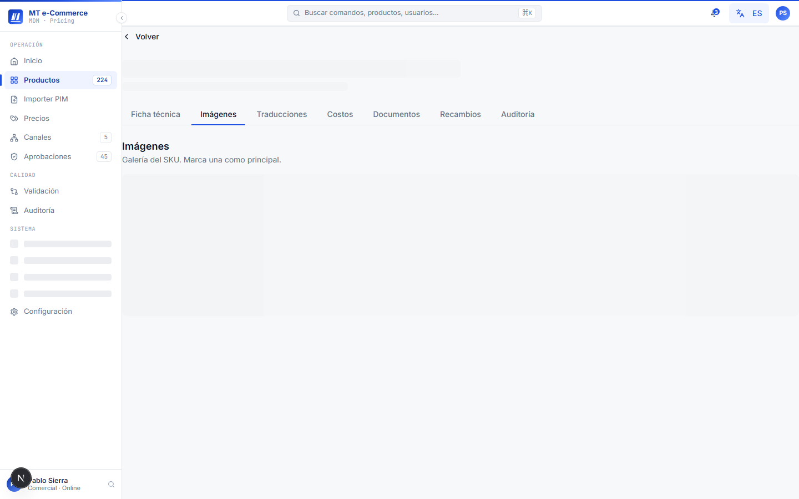
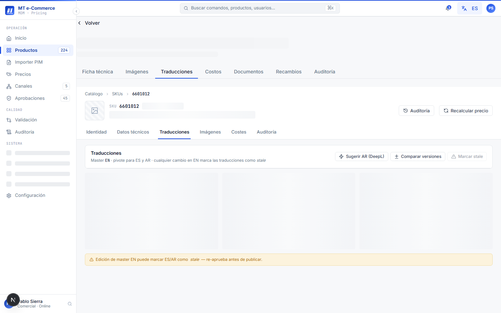
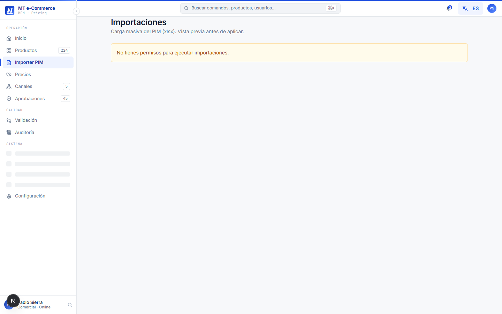
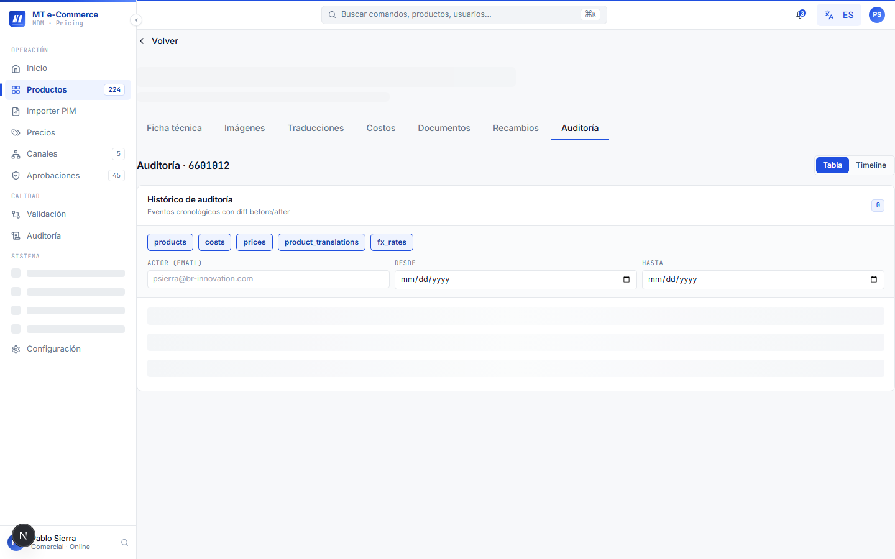

# Manual de Usuario — Gestión de Catálogo (PIM)

**Versión:** 1.0  
**Fecha:** 2026-05-12  
**Audiencia:** Comercial, Gerente  
**Sistema:** MT Middle East MDM + Pricing — Fase 1

---

## Índice

1. [Propósito del módulo](#1-propósito-del-módulo)
2. [Permisos por rol](#2-permisos-por-rol)
3. [Lista de SKUs](#3-lista-de-skus)
4. [Detalle de un SKU](#4-detalle-de-un-sku)
5. [Crear un nuevo SKU](#5-crear-un-nuevo-sku)
6. [Editar la ficha técnica](#6-editar-la-ficha-técnica)
7. [Gestionar imágenes](#7-gestionar-imágenes)
8. [Gestionar traducciones](#8-gestionar-traducciones)
9. [Flag de calidad de datos](#9-flag-de-calidad-de-datos)
10. [Importar artículos en masa](#10-importar-artículos-en-masa)
11. [Auditoría de cambios](#11-auditoría-de-cambios)
12. [Preguntas frecuentes](#12-preguntas-frecuentes)

---

## 1. Propósito del módulo

El módulo **Catálogo (PIM)** es el repositorio central de todos los artículos comercializados por MT Middle East. Permite:

- Mantener fichas técnicas completas en tres idiomas (Español, Inglés, Árabe)
- Gestionar imágenes de producto en almacenamiento centralizado
- Registrar costes por SKU y esquema de venta
- Controlar la calidad del dato antes de publicar en canales

> **Ruta:** `http://localhost:3000/products`

---

## 2. Permisos por rol

| Acción | Comercial | Gerente | TI |
|--------|:---------:|:-------:|:--:|
| Ver lista de SKUs | ✓ | ✓ | ✓ |
| Ver detalle de SKU | ✓ | ✓ | ✓ |
| Crear nuevo SKU | ✓ | ✓ | ✓ |
| Editar ficha técnica | ✓ | ✓ | ✓ |
| Subir / eliminar imágenes | ✓ | ✓ | ✓ |
| Aprobar traducción AR | — | ✓ | ✓ |
| Importar via Excel/CSV | ✓ | ✓ | ✓ |
| Eliminar SKU | — | — | ✓ |

---

## 3. Lista de SKUs

### 3.1 Acceder a la lista

Desde el menú lateral, haz clic en **Catálogo**. Verás la lista completa de SKUs cargados en el sistema.

> *Captura: pantalla completa de `http://localhost:3000/products`.*

### 3.2 Columnas de la tabla

| Columna | Descripción |
|---------|-------------|
| SKU | Código único del artículo (ej. `MT-V-038`) |
| Nombre (EN) | Nombre canónico en inglés |
| Calidad | Badge de calidad del dato (`completo` / `incompleto` / `revisión`) |
| Proveedor | Proveedor principal asignado |
| Coste base | Coste unitario en AED |
| Última modificación | Fecha y usuario del último cambio |

### 3.3 Filtrar y buscar

- **Búsqueda libre:** escribe en la barra de búsqueda superior (busca en SKU, nombre EN/ES/AR)
- **Filtros disponibles:**
  - Proveedor
  - Estado de calidad del dato
  - Cobertura de traducción (ES / AR completa / parcial)
  - Rango de coste

Para aplicar un filtro:
1. Haz clic en el botón **Filtros** (barra superior derecha de la tabla).
2. Selecciona los criterios deseados.
3. Haz clic en **Aplicar**. La tabla se actualiza.

Para limpiar filtros activos, haz clic en **Limpiar filtros**.

### 3.4 Exportar lista

1. Aplica los filtros deseados (opcional).
2. Haz clic en **Exportar** → selecciona **Excel (.xlsx)** o **CSV**.
3. El archivo se descarga automáticamente.

---

## 4. Detalle de un SKU

Haz clic en cualquier fila de la lista para abrir la pantalla de detalle del SKU.

> *Captura: pantalla de detalle de un SKU con los tabs visibles (`http://localhost:3000/products/{id}`).*

La pantalla de detalle tiene **6 tabs**:

| Tab | Contenido |
|-----|-----------|
| **Identidad** | Ficha técnica: nombre, descripción, specs, EAN, peso, dimensiones |
| **Imágenes** | Galería de imágenes del producto |
| **Traducciones** | Nombres y descripciones en ES, EN, AR con estado de aprobación |
| **Costes** | Costes por esquema de venta (FBA, FBM, Direct B2C, etc.) |
| **Precios** | Precios activos por canal con breakdown |
| **Auditoría** | Historial completo de cambios con actor, acción y diferencia |

> Los tabs cargan su contenido de forma diferida (lazy). Haz clic en el tab para cargar los datos.

---

## 5. Crear un nuevo SKU

### 5.1 Iniciar el wizard

1. En la lista de SKUs, haz clic en el botón **+ Nuevo SKU** (esquina superior derecha).
2. Se abre el wizard de alta en 4 pasos.

> *Captura: paso 1 del wizard de alta de SKU (`http://localhost:3000/products/new`).*

### 5.2 Paso 1: Identidad básica

Rellena los campos obligatorios:

| Campo | Obligatorio | Descripción |
|-------|:-----------:|-------------|
| Nombre EN | ✓ | Nombre canónico en inglés (campo maestro) |
| SKU | ✓ | Código único (formato `MT-X-000`). Si lo dejas vacío, se genera automáticamente |
| Proveedor | ✓ | Selecciona del desplegable (debe existir en el maestro de proveedores) |
| EAN / Código de barras | — | Código EAN individual del producto |

Haz clic en **Siguiente** para continuar.

### 5.3 Paso 2: Especificaciones técnicas

Rellena los atributos técnicos del producto:
- Peso (kg), dimensiones (cm)
- Categoría y subcategoría del catálogo
- Atributos EAV adicionales según la categoría seleccionada

> Los atributos disponibles cambian según la categoría. Si no ves un atributo que necesitas, contacta a TI para añadirlo al esquema de la categoría.

### 5.4 Paso 3: Imágenes

Sube al menos una imagen del producto:

1. Arrastra archivos al área de carga o haz clic en **Seleccionar archivos**.
2. Formatos aceptados: JPG, PNG, WebP. Tamaño máximo: 10 MB por imagen.
3. La primera imagen cargada se convierte en la imagen principal.
4. Reordena las imágenes arrastrando las miniaturas.

> Las imágenes se almacenan en el bucket privado `product-images` de Supabase Storage.

### 5.5 Paso 4: Revisión y guardado

Revisa el resumen de los datos introducidos. Si todo es correcto:

1. Haz clic en **Guardar SKU**.
2. El sistema crea el artículo y te redirige al detalle.
3. Aparece un toast de confirmación: *"SKU creado correctamente"*.

Si hay errores de validación, el wizard señala el campo con el problema y muestra el mensaje de error.

---

## 6. Editar la ficha técnica

### 6.1 Abrir la edición

1. Abre el detalle del SKU.
2. En el tab **Identidad**, haz clic en el botón **Editar** (esquina superior derecha del tab).
3. Los campos se vuelven editables.

> *Captura: tab Identidad en modo edición.*

### 6.2 Campos editables

- Nombre EN / ES / AR
- Descripción técnica
- Atributos EAV (peso, dimensiones, especificaciones)
- EAN / código de barras

> El campo **SKU** no es editable una vez creado.

### 6.3 Guardar cambios

1. Modifica los campos necesarios.
2. Haz clic en **Guardar**.
3. El sistema muestra un toast *"Guardado"* y actualiza el tab Auditoría automáticamente.

Para descartar los cambios sin guardar, haz clic en **Cancelar**.

---

## 7. Gestionar imágenes

### 7.1 Ver galería

En el tab **Imágenes** del detalle del SKU encontrarás:
- La imagen principal destacada
- La galería de imágenes secundarias en cuadrícula

> *Captura: tab Imágenes de un SKU con galería cargada.*

### 7.2 Subir nuevas imágenes

1. Haz clic en **+ Agregar imágenes**.
2. Selecciona uno o varios archivos (JPG, PNG, WebP, máx. 10 MB cada uno).
3. Las imágenes se suben al bucket `product-images` con el path `master/{SKU}/`.
4. Aparecen en la galería al completarse la carga.

### 7.3 Cambiar imagen principal

1. Pasa el cursor sobre la imagen que quieres definir como principal.
2. Haz clic en el icono de estrella ★ que aparece.
3. La imagen seleccionada pasa a ser la principal.

### 7.4 Eliminar una imagen

1. Pasa el cursor sobre la imagen.
2. Haz clic en el icono de papelera 🗑.
3. Confirma la eliminación en el modal.

> No se puede eliminar la imagen principal si es la única imagen del SKU.

---

## 8. Gestionar traducciones

El sistema requiere que el nombre en Inglés (EN) esté siempre completo. Las traducciones a Español (ES) y Árabe (AR) son necesarias para publicar en canales.

### 8.1 Ver estado de traducciones

En el tab **Traducciones** verás el estado por idioma:

| Estado | Descripción |
|--------|-------------|
| `pendiente` | El texto no ha sido traducido |
| `borrador` | Traducción introducida pero no aprobada |
| `aprobado` | Traducción revisada y lista para publicar |

> *Captura: tab Traducciones mostrando estado de cobertura ES/AR.*

### 8.2 Editar una traducción

1. Haz clic en el idioma que quieres editar (ES o AR).
2. Modifica el nombre y la descripción.
3. Haz clic en **Guardar borrador**.

### 8.3 Aprobar una traducción (Gerente)

Solo los usuarios con rol Gerente o TI pueden aprobar traducciones:

1. Revisa el contenido en el idioma correspondiente.
2. Haz clic en **Aprobar traducción**.
3. El estado cambia a `aprobado` y queda registrado con tu nombre y fecha.

---

## 9. Flag de calidad de datos

Cada SKU tiene un badge de calidad que indica si está listo para ser publicado:

| Badge | Criterio |
|-------|----------|
| `completo` | Nombre EN, imagen principal, coste en al menos 1 esquema: todo OK |
| `incompleto` | Falta algún campo obligatorio para publicar |
| `revisión` | Datos marcados manualmente para revisión |

Para marcar un SKU para revisión:
1. En el detalle del SKU, haz clic en el badge de calidad.
2. Selecciona **Marcar para revisión** e introduce un comentario opcional.
3. El badge cambia a `revisión` y queda registrado en auditoría.

---

## 10. Importar artículos en masa

Para cargar o actualizar múltiples SKUs a la vez:

### 10.1 Descargar plantilla

1. En la lista de SKUs, haz clic en **Importar** → **Descargar plantilla Excel**.
2. La plantilla incluye las columnas requeridas y ejemplos.

> *Captura: pantalla del importer (`http://localhost:3000/products/import`).*

### 10.2 Preparar el archivo

Completa la plantilla:
- Columna `sku`: déjala vacía para crear nuevos, o escribe el código existente para actualizar
- Columna `name_en`: obligatorio, no puede estar vacío
- Columnas `name_es` y `name_ar`: recomendadas pero no bloqueantes
- Columnas de atributos: según la categoría del producto

> Guarda el archivo en formato `.xlsx` o `.csv` (UTF-8 con BOM para caracteres árabes).

### 10.3 Cargar el archivo

1. Haz clic en **Importar** → **Cargar archivo**.
2. Selecciona el archivo preparado.
3. El sistema muestra una **previsualización** de las filas detectadas:
   - Verde: filas nuevas
   - Amarillo: actualizaciones de filas existentes
   - Rojo: errores de validación
4. Revisa los errores si los hay. Corrige el archivo y vuelve a cargarlo, o descarta las filas con error.
5. Haz clic en **Confirmar importación**.

### 10.4 Seguir el progreso

El importer corre en segundo plano. Puedes ver el progreso en **Configuración → Jobs** o desde la notificación que aparece en la campana de la barra superior.

Al finalizar recibirás un resumen: `X artículos creados, Y actualizados, Z con errores`.

---

## 11. Auditoría de cambios

Todo cambio en un SKU queda registrado automáticamente. Para ver el historial:

1. Abre el detalle del SKU.
2. Haz clic en el tab **Auditoría**.

> *Captura: tab Auditoría con historial de cambios cronológico.*

Cada entrada muestra:
- **Fecha y hora** del cambio
- **Actor** (usuario que realizó el cambio)
- **Acción** (creación, edición de campo, cambio de imagen, etc.)
- **Diferencia** (valor anterior → valor nuevo)

El historial se muestra en orden cronológico descendente (los más recientes primero). Usa el scroll para ver entradas más antiguas.

---

## 12. Preguntas frecuentes

**¿Por qué no puedo guardar el SKU si el nombre en inglés está vacío?**  
El nombre EN es el campo canónico del sistema y es obligatorio. Es el identificador único del artículo en el catálogo global. Todos los SKUs deben tener nombre EN para poder crearse.

**¿Qué formatos de imagen son aceptados?**  
JPG, PNG y WebP. Tamaño máximo 10 MB por imagen. Se recomienda resolución mínima de 800×800 px para calidad de publicación.

**¿Puedo subir imágenes desde una URL externa?**  
No directamente. El sistema requiere que todas las imágenes estén en el bucket `product-images`. Si tienes una URL externa, descarga la imagen primero y súbela desde tu equipo.

**¿Puedo recuperar un SKU eliminado?**  
No desde la UI. Los SKUs eliminados se pueden recuperar desde base de datos por TI (la eliminación es un soft-delete en el sistema).

**¿El importer sobreescribe los datos existentes?**  
Sí, para las filas con SKU existente. Revisa cuidadosamente la previsualización antes de confirmar la importación.

**¿Cuánto tarda el importer en procesar 200 SKUs?**  
Habitualmente menos de 2 minutos. El progreso es visible en el panel de Jobs.

**¿Por qué algunos atributos no aparecen en el wizard?**  
Los atributos disponibles dependen de la categoría seleccionada en el paso 2. Si necesitas atributos adicionales para una categoría, contacta a TI.

---

*Para soporte técnico, contacta al equipo TI de MT.*
