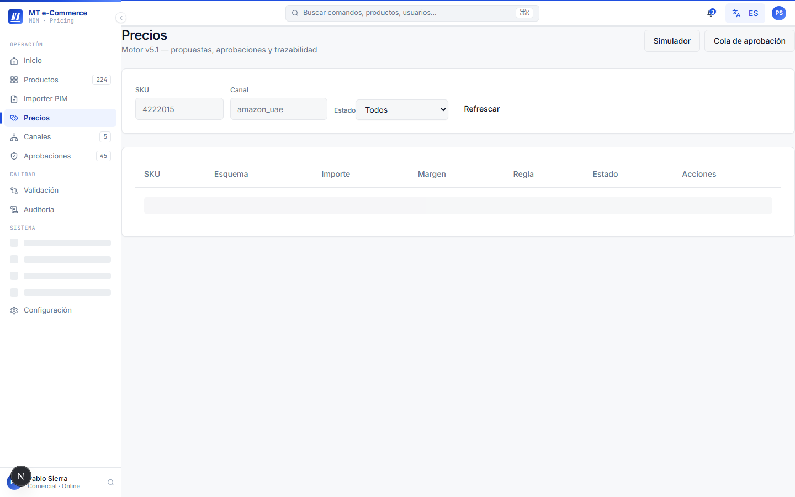
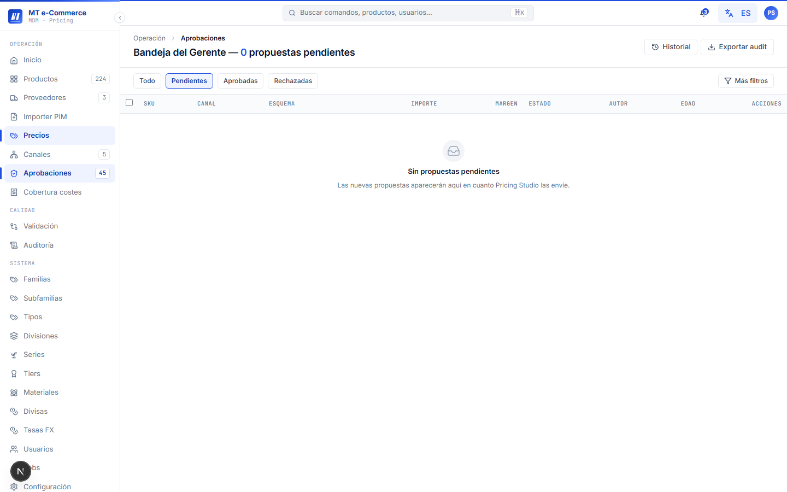

# Manual de Usuario — Workflow de Aprobación de Precios

**Versión:** 1.0  
**Fecha:** 2026-05-12  
**Audiencia:** Comercial (propone), Gerente (aprueba), TI (administra)  
**Sistema:** MT Middle East MDM + Pricing — Fase 1

---

## Índice

1. [Propósito del módulo](#1-propósito-del-módulo)
2. [Conceptos clave](#2-conceptos-clave)
3. [Permisos por rol](#3-permisos-por-rol)
4. [Flujo general del precio](#4-flujo-general-del-precio)
5. [Ver mis propuestas (Comercial)](#5-ver-mis-propuestas-comercial)
6. [Cola de aprobación del Gerente](#6-cola-de-aprobación-del-gerente)
7. [Aprobar o rechazar un precio](#7-aprobar-o-rechazar-un-precio)
8. [Aprobación en lote](#8-aprobación-en-lote)
9. [Sidebar de detalle del precio](#9-sidebar-de-detalle-del-precio)
10. [Escalación automática](#10-escalación-automática)
11. [Delegación de aprobaciones](#11-delegación-de-aprobaciones)
12. [Preguntas frecuentes](#12-preguntas-frecuentes)

---

## 1. Propósito del módulo

El módulo de **Workflow de Aprobación de Precios** gestiona el proceso de revisión y autorización de precios que salen fuera de las reglas automáticas del motor de pricing. Permite:

- Que el motor calcule precios automáticamente dentro de márgenes definidos
- Que los precios fuera de rango requieran aprobación del Gerente antes de publicarse
- Que el Gerente trabaje la cola de aprobaciones de forma eficiente (individual o en lote)
- Trazabilidad completa de quién aprobó qué precio y cuándo

> **Ruta principal:** `http://localhost:3000/prices`

---

## 2. Conceptos clave

| Concepto | Definición |
|----------|------------|
| **Precio automático** | Precio calculado por el motor que cumple todas las reglas → se publica sin revisión humana |
| **Precio por excepción** | Precio que viola al menos una regla → requiere aprobación del Gerente |
| **Esquema de venta** | Canal + modelo de negocio: `FBA`, `FBM`, `Direct B2C`, `Direct B2B`, `Marketplace` |
| **Canal** | Plataforma de venta: Amazon UAE, Noon UAE, mtme.ae, etc. |
| **Margen** | Diferencia entre precio de venta y coste total, expresado en % |
| **Precio base AED** | Precio en dirham emiratí (moneda base del sistema) |
| **FX as-of** | Tipo de cambio aplicado en el momento del cálculo, registrado para auditoría |
| **Escalación** | Precio pendiente de aprobación por más de 48 h → se marca como urgente |

---

## 3. Permisos por rol

| Acción | Comercial | Gerente | TI |
|--------|:---------:|:-------:|:--:|
| Ver precios activos por SKU | ✓ | ✓ | ✓ |
| Proponer precio por excepción | ✓ | ✓ | ✓ |
| Ver mis propuestas pendientes | ✓ | ✓ | ✓ |
| Ver cola completa de aprobación | — | ✓ | ✓ |
| Aprobar / rechazar precios | — | ✓ | ✓ |
| Aprobación en lote | — | ✓ | ✓ |
| Delegar aprobaciones | — | ✓ | ✓ |
| Ver historial de aprobaciones | ✓ | ✓ | ✓ |
| Configurar reglas de excepción | — | — | ✓ |

---

## 4. Flujo general del precio

```
Motor de pricing calcula precio
         │
         ▼
 ¿Cumple todas las reglas? ──► SÍ ──► Precio automático publicado
         │
         NO
         │
         ▼
 Precio queda en estado "pendiente"
         │
         ▼
 Gerente revisa en su cola
         │
         ├──► APRUEBA ──► Precio publicado en el canal
         │
         └──► RECHAZA ──► Precio descartado (Comercial es notificado)
```

Los precios pendientes que superan **48 horas** sin respuesta se marcan automáticamente como **escalados** y aparecen destacados en la cola del Gerente.

---

## 5. Ver mis propuestas (Comercial)

### 5.1 Acceder a mis propuestas

1. Desde el menú lateral, ve a **Precios → Mis propuestas**.
2. Verás la lista de precios que has propuesto con su estado actual.


> *Captura: pantalla Mis propuestas (`http://localhost:3000/prices/my-proposals`).*

### 5.2 Estados de una propuesta

| Estado | Descripción |
|--------|-------------|
| `pendiente` | Esperando revisión del Gerente |
| `aprobado` | Aprobado — el precio está activo en el canal |
| `rechazado` | Rechazado por el Gerente (verás el motivo en el detalle) |
| `escalado` | Pendiente más de 48 h — el Gerente ha sido notificado con urgencia |

### 5.3 Ver el motivo de rechazo

Si una propuesta fue rechazada:
1. Haz clic en la fila del precio rechazado.
2. Se abre el panel lateral con el detalle.
3. En la sección **Decisión**, verás el comentario del Gerente explicando el motivo.
4. Puedes modificar la propuesta y reenviarla si lo consideras apropiado.

---

## 6. Cola de aprobación del Gerente

### 6.1 Acceder a la cola

1. Desde el menú lateral, ve a **Precios → Mi cola**.
2. Verás el resumen de la cola en la barra superior fija.


> *Captura: pantalla completa de la cola de aprobación (`http://localhost:3000/prices/queue`).*

### 6.2 Barra de resumen (sticky)

La barra de resumen muestra siempre visible:

```
142 automáticos  |  45 pendientes  |  3 escalados
```

- **Automáticos:** procesados sin intervención en las últimas 24 h
- **Pendientes:** requieren tu decisión
- **Escalados:** pendientes más de 48 h — prioridad alta

### 6.3 Columnas de la tabla

| Columna | Descripción |
|---------|-------------|
| SKU | Código y nombre del artículo |
| Canal / Esquema | Canal de venta y modelo (ej. Amazon UAE / FBA) |
| Precio anterior | Precio vigente actualmente |
| Precio propuesto | Nuevo precio calculado o propuesto |
| Margen anterior / nuevo | Diferencia de margen en puntos porcentuales |
| Alerta | Motivo de excepción (ej. margen <5%, FX swing >3%) |
| Razón | Regla que fue violada |
| Edad | Horas que lleva el precio esperando aprobación |

### 6.4 Filtros de la cola

Puedes filtrar la cola por:
- **Hoy** — propuestas recibidas en las últimas 24 h
- **Esta semana** — propuestas de los últimos 7 días
- **Pendientes** — solo los que faltan por decidir
- **Escalados** — solo los que llevan >48 h

---

## 7. Aprobar o rechazar un precio

### 7.1 Abrir el detalle

Haz clic en cualquier fila de la cola para abrir el **sidebar de detalle** (sin abandonar la lista).


> *Captura: sidebar de detalle abierto a la derecha de la cola de aprobación.*

### 7.2 Revisar la información

Antes de decidir, revisa:
- **Breakdown de coste:** desglose de todos los costes (producto, logística, fees del canal, FX)
- **Regla aplicada:** qué regla de excepción fue violada y con qué valor
- **FX aplicado:** tipo de cambio usado (AED base + moneda del canal)
- **Historial de aprobaciones** del mismo SKU/canal

### 7.3 Aprobar el precio

1. En el sidebar, haz clic en **Aprobar**.
2. Escribe un **comentario** (opcional para aprobaciones simples).
3. Haz clic en **Confirmar**.
4. El precio queda activo en el canal y el estado cambia a `aprobado`.
5. El Comercial que propuso el precio recibe una notificación.

### 7.4 Rechazar el precio

1. En el sidebar, haz clic en **Rechazar**.
2. Escribe el **motivo del rechazo** (obligatorio).
3. Haz clic en **Confirmar rechazo**.
4. El precio queda descartado con estado `rechazado`.
5. El Comercial recibe una notificación con el motivo.

---

## 8. Aprobación en lote

Cuando hay muchos precios pendientes con el mismo tipo de excepción (ej. swing de FX generalizado), puedes aprobarlos todos de una vez.

### 8.1 Seleccionar precios

1. Activa los **checkboxes** de las filas que quieres aprobar juntas.
   - Para seleccionar todos los visibles: marca el checkbox del encabezado de la tabla.
   - Para deseleccionar: desmarca el checkbox del encabezado.


> *Captura: tabla con varios precios seleccionados (checkboxes activos) y botón "Aprobar lote" visible.*

### 8.2 Aprobar el lote

1. Con al menos un precio seleccionado, haz clic en **Aprobar lote** (barra superior de la tabla).
2. Se abre un modal de confirmación con el recuento de precios seleccionados.
3. Escribe un **comentario general** para el lote (ej. *"Aprobación masiva por swing FX semana 20"*).
4. Haz clic en **Confirmar aprobación**.

El sistema procesa todos los precios y muestra un resumen: `X aprobados, Y con error`.

> Para rechazos en lote, el proceso es idéntico usando el botón **Rechazar lote**. El motivo es obligatorio.

---

## 9. Sidebar de detalle del precio

El sidebar se abre al hacer clic en cualquier fila de la cola. Contiene información completa para tomar una decisión informada.


> *Captura: sidebar de detalle con todas las secciones desplegadas.*

### Secciones del sidebar

**Encabezado**
- SKU, nombre del artículo, canal y esquema
- Estado actual y edad del precio pendiente

**Breakdown de coste**
```
Coste producto:          45.20 AED
Logística (FBA fee):      8.50 AED
Fee plataforma (8%):     11.40 AED
─────────────────────────────────
Coste total:             65.10 AED
Precio propuesto:        68.00 AED
Margen resultante:        4.2%   ← Por debajo del mínimo 5%
```

**Motivo de excepción**
- Regla violada (ej. `margen < 5%`)
- Valor calculado vs umbral de la regla
- Versión de la regla aplicada

**FX aplicado**
- Moneda origen y moneda destino
- Tipo de cambio (ej. `1 EUR = 3.9215 AED`)
- Fecha de efectividad del tipo

**Historial de este SKU/canal**
- Últimas 5 aprobaciones con fecha, actor, precio y margen aprobados
- Permite ver tendencia y contexto histórico

**Audit trail**
- Registro cronológico de todos los eventos de este precio específico

---

## 10. Escalación automática

Si un precio lleva más de **48 horas** en estado `pendiente` sin decisión:

1. El sistema cambia automáticamente el estado a `escalado`.
2. El precio aparece destacado en rojo en la cola del Gerente.
3. El Gerente recibe una notificación push.
4. El filtro **Escalados** de la cola muestra solo estos precios.

No se requiere ninguna acción adicional para activar la escalación — ocurre automáticamente.


> *Captura: fila de precio con badge "Escalado" en la cola del Gerente.*

---

## 11. Delegación de aprobaciones

Cuando el Gerente no está disponible (vacaciones, viaje), puede delegar su cola a otro usuario con rol Gerente.

### 11.1 Activar delegación

1. Ve a **Mi cuenta → Delegación de aprobaciones**.
2. Selecciona el **Gerente delegado** (debe tener rol `gerente_comercial`).
3. Define el **período de delegación** (fecha inicio y fin).
4. Haz clic en **Activar delegación**.


> *Captura: pantalla de configuración de delegación en Mi cuenta.*

Durante el período de delegación:
- El Gerente delegado ve la cola completa del Gerente original en su propio acceso
- Las aprobaciones quedan registradas con el actor real (el delegado)
- El Gerente original también puede seguir aprobando si tiene acceso

### 11.2 Desactivar delegación

1. Ve a **Mi cuenta → Delegación de aprobaciones**.
2. Haz clic en **Desactivar delegación**.
3. La cola vuelve a ser solo del Gerente original.

---

## 12. Preguntas frecuentes

**¿Qué pasa si apruebo un precio y luego me equivoqué?**  
Una vez aprobado y publicado, no se puede revertir directamente desde la UI. Debes proponer un precio nuevo para el mismo SKU/canal, que pasará por el mismo proceso de aprobación. Contacta a TI si necesitas una reversión urgente.

**¿Por qué un precio que parece correcto está en la cola de aprobación?**  
Porque viola al menos una de las reglas configuradas (margen mínimo, swing de FX, precio mínimo de venta, etc.). Consulta el sidebar de detalle para ver exactamente qué regla fue violada y por cuánto.

**¿Puedo ver qué precios se publicaron automáticamente sin pasar por mi cola?**  
Sí. El contador de "automáticos" en la barra de resumen muestra los procesados en las últimas 24 h. Para ver el detalle, accede al tab **Historial** dentro de **Precios**.

**¿Qué sucede con los precios rechazados?**  
Quedan en estado `rechazado` con el motivo registrado. No se publican en ningún canal. El motor de pricing volverá a calcular en el siguiente ciclo — si las condiciones de mercado cambian y el nuevo precio cumple las reglas, se puede publicar automáticamente.

**¿Con qué frecuencia recalcula el motor de pricing?**  
El motor recalcula según el schedule configurado en Jobs (típicamente diario, aunque puede ser más frecuente para canales específicos). Consulta a TI el schedule exacto de tu configuración.

**¿Puedo ver el historial de aprobaciones de otro Gerente?**  
El historial de aprobaciones de cada precio es visible para todos los roles desde el sidebar de detalle. Para el historial global, accede a **Auditoría** desde el menú lateral.

**¿Qué ocurre si el Gerente delegado también está fuera?**  
El sistema no permite delegaciones en cadena. Si necesitas una solución de emergencia, TI puede asignar temporalmente el rol Gerente a otro usuario o aprobar directamente con rol TI.

---

*Para soporte técnico, contacta al equipo TI de MT.*
