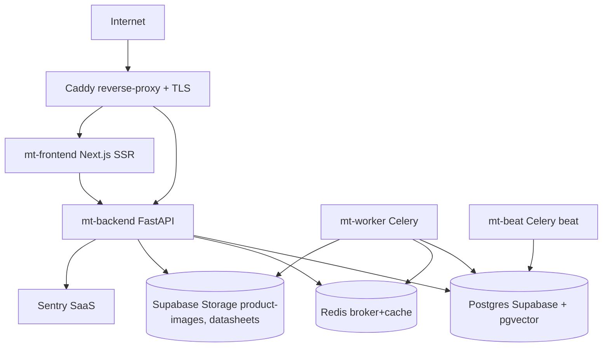

# Disaster Recovery — Runbook (US-1B-05-04)

**Ámbito**: stack `mt-pricing-mdm-phase1` deployable Hetzner + Supabase.
**Última revisión**: 2026-05-07 (Sprint 6).
**Owner técnico**: TI MT (psierra) | **Sponsor**: Champion MT.

## 1. Objetivos

| Métrica | Target Fase 1b | Notas |
|---|---|---|
| **RPO** (Recovery Point Objective) | ≤ 24h | pg_dump diario 02:00 Asia/Dubai + WAL streaming Supabase |
| **RTO** (Recovery Time Objective) | ≤ 4h | escenarios DB / Storage / Region |
| **Tiempo de detección** | ≤ 15 min | Sentry alerta + Grafana healthchecks |
| **Tiempo de notificación** | ≤ 5 min post-detección | PagerDuty/Slack on-call rotation |

## 2. Inventario de dependencias



**Single points of failure conocidos**:
- Postgres Supabase (compartido — fallback Hetzner self-hosted documentado §6).
- Redis (single node — fallback in-memory para queue NO disponible; jobs perdidos = aceptable RPO).
- Storage Supabase (replicación automática multi-AZ — verificar nightly).

## 3. Escenarios cubiertos

### 3.1 DB corruption / drop accidental

**Detección**:
- Sentry SEV1 desde backend (constraint violations, "relation does not exist").
- Healthcheck endpoint `/healthz/db` returning 5xx.
- Grafana panel "active connections" = 0.

**Procedimiento**:
1. **Detener escrituras** — pausar Caddy `caddy stop` (lectura sólo desde réplica si configurada).
2. **Confirmar último dump válido**:
   ```bash
   ls -lh /var/backups/postgres/ | tail -10
   pg_restore --list /var/backups/postgres/mt-pricing-$(date -d yesterday +%Y%m%d).dump | head -50
   ```
3. **Restore en DB de recuperación** (NO sobre prod):
   ```bash
   createdb mt-pricing-recover
   pg_restore -d mt-pricing-recover -j 4 /var/backups/postgres/mt-pricing-YYYYMMDD.dump
   psql mt-pricing-recover -c "SELECT count(*) FROM products; SELECT count(*) FROM prices WHERE status='approved';"
   ```
4. **Validación SLO** — los counts deben caer dentro del 5% de los conocidos pre-incidente.
5. **Cutover**: rename `mt-pricing → mt-pricing-broken-$(date)` y `mt-pricing-recover → mt-pricing`. Restart backend.
6. **Replay WAL** si la ventana entre dump y corruption > 1h (ver Supabase support).
7. **Audit gap**: documentar qué transacciones quedaron en el limbo en `audit_events` con `action='dr.recovery_executed'`.

**Ownership**: TI MT primario, Champion firma cutover.

### 3.2 Storage Supabase loss (bucket compromised / region down)

**Detección**: 5xx desde `/datasheets/{id}` o `/products/{sku}/image-url`. Sentry alert.

**Procedimiento**:
1. **Confirmar scope**: ¿bucket entero, prefijo, o objetos sueltos? Listar via `supabase storage ls`.
2. **Restore desde mirror**: Storage tiene replicación automática de Supabase. Si la región principal cae, los reads degradan a la réplica con latencia aumentada (transparente).
3. **Si replication también perdida**: re-importar fixtures desde el bucket de backup `mt-storage-cold` (sync nocturno via `infra/scripts/storage-cold-sync.sh`).
4. **Re-trigger** `app/workers/probe_mirror.py` para re-mirrorear imágenes canónicas desde fuentes externas (PIM ES, fuentes proveedor).
5. **Datasheets**: re-correr `app/scripts/test_datasheets_real.py` con fixtures físicas locales si los hashes no coinciden con `product_datasheets.storage_path`.

### 3.3 Region down (Hetzner falkenstein)

**Detección**: ping desde monitoring externo falla a IPs públicas. Caddy + backend down simultáneamente.

**Procedimiento DRP completo**:
1. **Activar standby** (manual S6, automatizable S7+): provisionar nuevo servidor Hetzner con `infra/terraform/hetzner.tf` apuntando a `nuremberg` location.
2. **DNS cutover**: actualizar Cloudflare A record `mt.brinnovation.es` al nuevo IP (TTL 60s permite cutover rápido).
3. **Re-deploy** stack desde Doppler secrets:
   ```bash
   cd infra/terraform && terraform apply -var hetzner_location=nuremberg
   bash infra/scripts/hetzner-deploy.sh
   ```
4. **DB**: restore desde dump más reciente (§3.1). Si dump > 24h: aceptar pérdida o pedir Supabase WAL replay.
5. **Caddy reload TLS**: certificados Let's Encrypt re-emiten automáticamente.

**RTO realista**: 2-4h dependiendo de DNS propagation + Doppler creds disponibles.

### 3.4 Compromised secrets (Doppler / .env leak)

**Detección**: Sentry alert "external API rate limit exceeded" sin tráfico esperado, o Hetzner billing spike.

**Procedimiento**:
1. **Rotar inmediatamente**:
   - Supabase service_role_key + anon_key (Supabase Dashboard).
   - JWT_SECRET + invalidar todas las sesiones (`/auth/logout-all`).
   - OPENAI_API_KEY, ANTHROPIC_API_KEY (si live network on).
   - Cloudflare API token.
2. **Re-publicar via Doppler**:
   ```bash
   doppler secrets set SUPABASE_SERVICE_ROLE_KEY=<new>
   doppler secrets set JWT_SECRET=<new-generated>
   ```
3. **Restart stack**: `docker compose restart` después de Doppler bootstrap.
4. **Audit forensic**: revisar `audit_events` últimas 72h para detectar accesos anómalos.
5. **Notificar**: Champion + Pablo + legal si datos PII expuestos.

### 3.5 Live network adapters cost runaway

**Detección**: Sentry alert "vision_judge: monthly cap reached (\$50)" o spike facturación OpenAI/Anthropic dashboard.

**Procedimiento**:
1. **Kill-switch via admin endpoint**:
   ```bash
   curl -X PATCH https://mt.brinnovation.es/api/v1/admin/feature-flags/MT_LIVE_NETWORK \
        -H "Authorization: Bearer $JWT" \
        -d '{"enabled": false, "reason": "cost runaway DR drill"}'
   ```
2. **Kill judge_dispatcher**: el `JudgeDispatcher` ya tiene circuit breaker `MT_VISION_MONTHLY_CAP_USD=50` activo S5.
3. **Audit reproducible**: `audit_events` con action='feature.flag.disabled' captura el cambio.

## 4. Backups — qué tenemos hoy

| Asset | Mecanismo | Frecuencia | Retención | Verificado |
|---|---|---|---|---|
| Postgres | `pg_dump` daily al bucket S3 cold | Diario 02:00 Asia/Dubai | 30 días | ❌ S6 |
| Postgres WAL | Supabase managed | Continuo | 7 días | ❌ S6 |
| Storage product-images | Supabase replication | Continuo | Indefinido | ❌ S6 |
| Storage datasheets | Supabase replication | Continuo | Indefinido | ❌ S6 |
| Doppler config | Doppler internal versioning | Por cambio | Indefinido | ✅ S5 |
| Code | GitHub | Por commit | Indefinido | ✅ S5 |

Sprint 6 task: `infra/scripts/dr-healthcheck.sh` automatiza la columna "Verificado".

## 5. Drill plan mensual

3 escenarios secuenciales — primer drill **2026-06-07** (mes 1 post-Hetzner deploy).

| Mes | Escenario | Owner | Participantes | Success criteria |
|---|---|---|---|---|
| 1 | DB corruption (§3.1) sobre staging | TI MT | psierra + Champion | Restore < 4h, todos los SLO checks verdes |
| 2 | Storage loss (§3.2) sobre staging | TI MT | psierra + R&D Champion | Datasheets re-mirroreados < 1h |
| 3 | Region down (§3.3) failover dry-run | TI MT | full team | DNS cutover < 30min, RTO < 4h end-to-end |

Cada drill produce un postmortem en `docs/runbooks/dr-postmortems/YYYY-MM.md` con findings + acciones.

## 6. Healthchecks automáticos

Script `infra/scripts/dr-healthcheck.sh` corre cada 15 min y verifica:
1. pg_dump más reciente < 26h (margen sobre 24h).
2. Caddy responde 200 a `/healthz`.
3. Backend responde 200 a `/api/v1/healthz/db` y `/healthz/redis`.
4. Sentry events en últimos 60 min > 0 (señal de que el ingestion funciona — ausencia es ALERT).
5. Storage replication lag < 60s (`supabase storage --replica-lag`).
6. Celery beat heartbeat más reciente < 6 min (`mt.heartbeat.beat`).

Output:
```
[OK]  pg_dump: 18h ago (mt-pricing-20260507.dump, 1.2GB)
[OK]  caddy: 200 (TTFB 89ms)
[OK]  backend.db: 200
[OK]  backend.redis: 200
[OK]  sentry: 14 events last 60m
[OK]  storage.replica: 12s lag
[OK]  beat.heartbeat: 4m ago
exit 0
```

Falla → exit ≠ 0 + Sentry SEV2.

## 7. Contactos & escalation

1. **TI MT** psierra@br-innovation.com — primario 24/5.
2. **Champion MT** — secundario, firma decisiones de cutover destructivo.
3. **Supabase support** — ticket via dashboard, plan de soporte attached.
4. **Hetzner support** — robot.hetzner.com.
5. **Cloudflare support** — vía portal.

## 8. Limitaciones conocidas — Sprint 6

- DR drill efectivo aún **no ejecutado** — depende de Hetzner provisioned + Doppler creds firmados (carry-over S7).
- Failover automático multi-region NO implementado — manual con DNS cutover ≥ 30 min.
- Backups verificados manualmente; el sweep automático llega S7.
- Tabla de `dr_drills` en BD (registro firmado) NO existe aún — se crea en S7 con migración 030.

Ver [dr-drill-plan.md](dr-drill-plan.md) para el calendario detallado.
