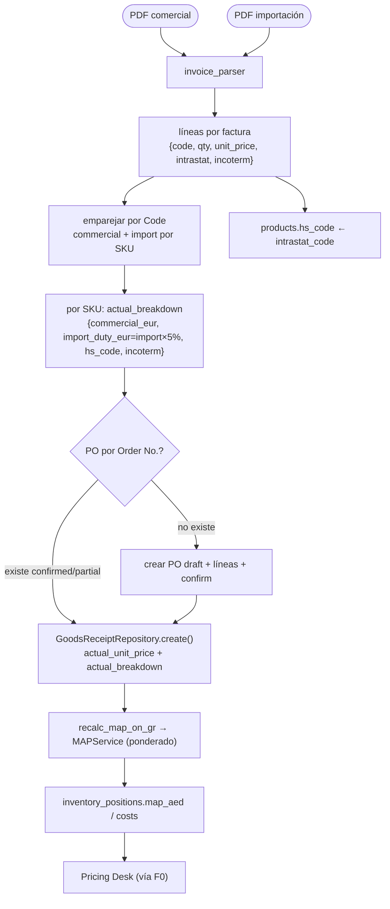

---
tags:
  - design
  - pricing-desk
  - procurement
  - invoice
  - cost
created: 2026-05-29
status: approved
audience: claude-code, backend, equipo-pricing
related:
  - "[[09-critical-build-cost-wiring]]"
  - "[[06-integration-map]]"
target_repo: br-mt-ecommerce
component: mt-pricing-backend/app/services/procurement
---

# Diseño — Ingesta de factura → goods receipt (F0.5)

## 1. Contexto y objetivo

F0 (PR #139) cableó el coste landed real (`inventory_positions.map_aed`) al Pricing Desk, pero esa pieza está
**inerte** hasta que existan recepciones reales. F0.5 las crea: ingiere las **facturas de MT** (PDF), calcula el
coste real por SKU y lo mete en el flujo **goods receipt → MAP → `costs`** que **ya existe**, para que el coste
ponderado real llegue al Desk vía F0.

**Validado contra lo existente (no se reconstruye):**
- `MAPService` (`app/services/inventory/map_service.py`) = Coste Medio Ponderado (WAC/MAP, "SAP MM Moving Average
  Price", US-INV-01-02). Pondera el coste de cada recepción con el stock existente. **F0.5 NO recalcula costeo.**
- `CostService.compute_landed_aed()` convierte un `actual_breakdown` a AED con la convención: `*_aed` (no
  convierte), `*_<moneda>` p.ej. `*_eur` (convierte por FX as-of), `*_pct` (% sobre el subtotal).
- `GoodsReceiptRepository.create()` + `recalc_map_on_gr` (Celery) ya orquestan GR → MAP → `inventory_positions`/`costs`.
- `PurchaseOrderRepository` ya crea POs (`draft` → `confirm`) con líneas.

## 2. Modelo de coste (las dos facturas)

Son **el mismo formato PDF de MT con valores distintos**:
- **Factura comercial** → `Unit price` = coste real que MT cobra a BR (por SKU, EUR).
- **Factura de importación** → valor de importación por SKU (base del arancel, EUR).

Por SKU, el coste de la recepción:

```
duty_eur          = valor_importacion × tarifa_pct/100        (tarifa_pct = 5 por defecto, editable)
actual_breakdown  = { "commercial_eur":  <unit_price comercial>,
                      "import_duty_eur":  <duty_eur>,
                      "hs_code":          <intrastat_code>,
                      "incoterm":         "DAP" }
unit_cost_aed     = CostService.compute_landed_aed(actual_breakdown, "EUR", received_at)
                  = (commercial + import_duty) × FX_as_of
map_aed           = MAPService.calculate_map(qty_exist, value_exist, qty_new, unit_cost_aed)  ← ponderado por stock
```

`hs_code`/`incoterm` viajan en el breakdown como metadatos (no numéricos → ignorados por el sumatorio); además
`hs_code` se persiste en `products.hs_code`. La **tarifa por HS** (en vez del 5% único) es **F7**, reutilizando
este mismo mecanismo.

> Decisión: se **pre-calcula** `import_duty_eur` (no se usa `_pct`, que aplicaría 5% sobre todo el subtotal,
> base equivocada). Así el duty se calcula sobre el valor de importación, no sobre el comercial.

## 3. Alcance

**Dentro de F0.5:**
- Parser PDF de factura MT (comercial e importación, mismo formato) → líneas `{code, qty, unit_price, intrastat_code, incoterm}`.
- Emparejado de las dos facturas por `Code` (SKU).
- Cálculo del `actual_breakdown` por SKU (comercial + duty).
- Resolución de PO **híbrida**: emparejar por `Order No.` (la factura lo trae) + `supplier_code='mt_spain'`; si no
  existe, crear PO + líneas + `confirm`.
- Creación de goods receipts vía `GoodsReceiptRepository.create()` → dispara MAP existente.
- Persistir `products.hs_code` desde `intrastat_code`.
- Endpoint `POST /imports/invoice` con preview → confirm; RBAC `imports:write`.

**Fuera de alcance (YAGNI / otras fases):**
- Tarifa de arancel **por HS code** (F7) — aquí es un % único editable (default 5%).
- Automatizar la conciliación a 3 bandas de `VendorInvoice` (existe el modelo; F0.5 no lo orquesta).
- Factura en **XML** (F0.5 es PDF; puerto preparado para añadir adapter XML después).
- Asignación de costes agregados (flete/seguro a nivel envío) — bajo DAP el flete va en el comercial; no aplica.
- Multi-moneda distinta de EUR en las facturas.

## 4. Arquitectura y componentes (diseño por aislamiento)

| Componente | Tipo | Responsabilidad única |
|------------|------|----------------------|
| `app/services/procurement/invoice_parser.py` | **nuevo** | `parse_invoice_pdf(pdf_bytes) -> InvoiceParseResult`. pdfplumber + `extract_words()` + bandas-x (probado en la muestra). Sin HTTP/DB. Devuelve cabecera (`invoice_number`, `order_refs`, `incoterms`, `currency`) + líneas `{code, qty, unit_price, intrastat_code}`. Errores por fila. |
| `app/services/procurement/invoice_ingest_service.py` | **nuevo** | Orquesta: empareja comercial+importación por code → calcula `actual_breakdown` por SKU → resuelve PO (híbrido) → crea goods receipts. Devuelve resumen `{created, skipped, errors}` (preview no persiste). |
| `app/services/procurement/po_resolver.py` | **nuevo (pequeño)** | `resolve_or_create_po(order_no, supplier_code, lines)`. Match por `po_number`; si falta, crea PO draft + líneas + confirm. Reusa `PurchaseOrderRepository`. |
| `app/repositories/purchase_order.py` | sin cambios | Creación de PO + líneas + confirm (ya existe). |
| `app/repositories/goods_receipt.py` | sin cambios | `create()` con `actual_unit_price` + `actual_breakdown` (ya existe; dispara MAP). |
| `app/api/routes/invoice_imports.py` | **nuevo** | `POST /imports/invoice` (multipart: PDF comercial + PDF importación + `confirm`, `tariff_pct` opcional). Preview→confirm. RBAC. |
| `app/schemas/invoice_imports.py` | **nuevo** | `InvoiceParseResult`, `InvoiceLine`, `InvoiceIngestPreview`, `InvoiceIngestResult`. |

**Aislamiento:** el parser solo conoce `bytes → estructura`. El service no conoce HTTP. `po_resolver` solo
resuelve/crea POs. El endpoint solo hace dispatch + RBAC.

## 5. Flujo de datos



## 6. Resolución de PO (híbrida)

- La factura trae `Order No.` (p.ej. `PE2602596`). Por línea de factura se agrupa por `Order No.`.
- **Match:** `SELECT po WHERE po_number = order_no AND supplier_code='mt_spain'`. Si está en `confirmed`/`partial`,
  se usa; sus líneas se emparejan por `sku` (+`scheme_code`).
- **Crear si falta:** `PurchaseOrderCreate(po_number=order_no, supplier_code='mt_spain', currency='EUR', lines=[…])`
  → `confirm`. (Cubre el caso "procesos manuales ya empezados": si la PO ya existía, se reutiliza.)
- **Línea sin PO ni datos suficientes** → fila a `errors` (tolerante; no aborta el lote).
- `scheme_code` de la línea: por defecto `DIRECT_B2C` (configurable). El coste landed es agnóstico al esquema
  (F0 resuelve por SKU), así que el scheme aquí es de procurement, no de canal.

## 7. Validación, errores e idempotencia

- **Tolerante por fila:** cada línea de factura que falle (SKU inexistente, parse, breakdown inválido) va a
  `errors`; las demás continúan (igual que el import xlsx/PIM).
- **Nivel archivo:** PDF ilegible o sin líneas de artículo → `ImporterDomainError(code="invoice_parse_failed", 422)`.
- **`actual_breakdown` debe pasar `validate_breakdown`** del `scheme_code` (claves requeridas por esquema). El
  service construye el breakdown con las claves que el validador exige (se confirma al escribir el plan).
- **Idempotencia:** clave natural `(invoice_number, code)`. Re-subir la misma factura no duplica goods receipts
  (se detecta GR existente por esa clave en `actual_breakdown`/nota, o se omite con `skipped`).
- **Preview→confirm:** `confirm=false` devuelve el resumen calculado (por SKU: comercial, duty, landed estimado,
  PO match/crear) sin tocar la BD; `confirm=true` persiste.

## 8. Pruebas

- **Unit `invoice_parser`** (sin DB) contra la muestra real `INVOICE 2026002035`: extrae code/qty/unit_price/intrastat/incoterm;
  formato numérico punto-decimal/coma-millares; líneas no-artículo ignoradas; PDF malformado → error de archivo.
- **Unit `invoice_ingest_service`** (cálculo): empareja comercial+import por code; `duty = import×5%`;
  `actual_breakdown` correcto; tarifa configurable.
- **Integración** (Postgres testcontainer / dev DB con rollback): factura → crea PO (caso "no existe") y empareja
  (caso "existe") → crea goods receipts → `recalc_map_on_gr` (síncrono en test) → `inventory_positions.map_aed`
  refleja el ponderado → (con F0) el coste real llega al loader.
- **Idempotencia:** re-ingesta no duplica GR.
- **Regresión:** el flujo de goods receipts/MAP existente sigue verde.
- **Cobertura ≥ 70%** (gate CI). Sin cambios de contrato en `app/api/routes` salvo el endpoint nuevo → regenerar OpenAPI.

## 9. Reutilización (qué existe vs nuevo)

| Existe (se reutiliza) | Nuevo (F0.5) |
|---|---|
| `MAPService` (ponderado), `CostService.compute_landed_aed`, `cost_lots`, `inventory_positions` | `invoice_parser`, `invoice_ingest_service`, `po_resolver` |
| `GoodsReceiptRepository.create()` + `recalc_map_on_gr` | endpoint `POST /imports/invoice` + schemas |
| `PurchaseOrderRepository` (create/confirm) | — |
| pdfplumber (probado), patrón `extract_words()`+bandas-x | — |

## 10. Decisiones abiertas (a confirmar en el plan)

1. **Claves requeridas de `actual_breakdown`** por `scheme_code` (de `breakdown_validator`) — ajustar el breakdown
   para pasar la validación.
2. **`tariff_pct`**: ¿parámetro del request (default 5), o leer de `trade_route_params.import_tariff_pct`
   (editable en el Desk)? Recomendado: parámetro con default 5, F7 lo hace por HS.
3. **`scheme_code` de procurement** para las líneas/GR (default `DIRECT_B2C`): confirmar con negocio.
4. **Clave de idempotencia**: dónde marcar `invoice_number` (¿en `goods_receipts.notes`, en `actual_breakdown`, o
   vía `VendorInvoice`?). Recomendado: registrar `VendorInvoice(invoice_number, po_id)` y referenciar `gr_id`.

## 11. Decisiones acordadas (brainstorming 2026-05-29)

- Flujo PO **híbrido** (match si existe, crear si no).
- Formato **PDF** (puerto preparado para XML futuro).
- Coste = **comercial + (importación × 5%)**; dos facturas mismo formato, valores distintos.
- **No** se reconstruye el costeo: el promedio ponderado por stock lo hace el `MAPService` existente.
- El arancel **por HS** y la factura **XML** son fases/iteraciones posteriores.
