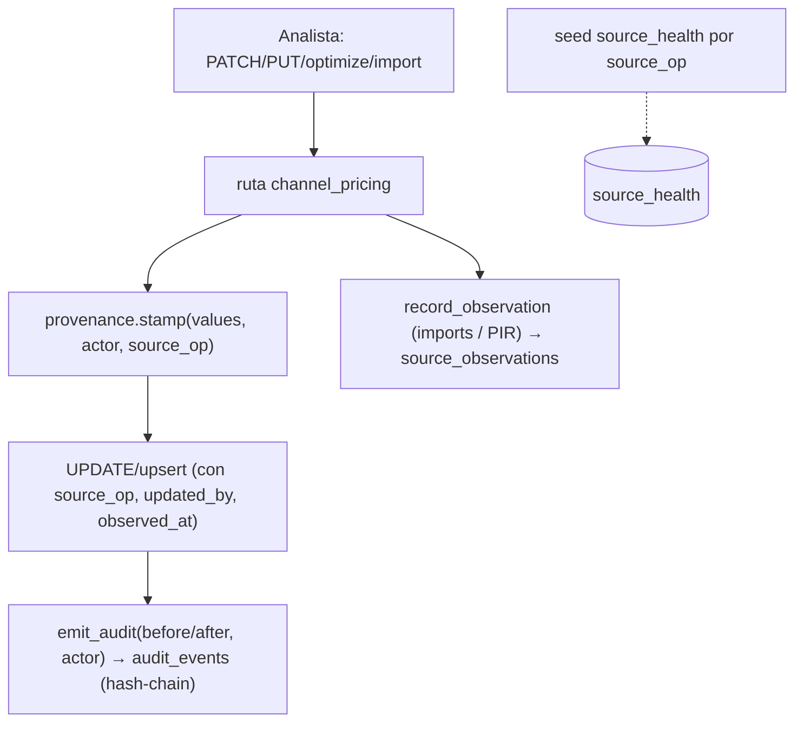

---
tags:
  - design
  - pricing-desk
  - provenance
  - audit
  - migration
created: 2026-05-30
status: approved
audience: claude-code, backend, db-migrator
related:
  - "[[03-data-model]]"
  - "[[09-critical-build-cost-wiring]]"
target_repo: br-mt-ecommerce
component: mt-pricing-backend
---

# Diseño — F1: Provenance + Audit base (Pricing Desk)

## 1. Contexto y objetivo

Las tablas de configuración del Channel Pricing Engine no registran **de dónde** viene cada valor ni **quién/cuándo** lo cambió: `updated_by` es `TEXT` y nunca se puebla, no hay `source_op`/`observed_at`, y las mutaciones no escriben en el audit log. F1 añade la **base de provenance + audit** (esquema + cableado) para habilitar frescura y lineage (F4) y para que el coste real (F0/F0.5) sea trazable.

Se hace **todo en un ciclo** (migración DDL + cableado de código), un único spec → plan → PR.

**Conexión con la lista de precios por proveedor (PIR):** la "lista de precios por proveedor" es `vendor_product_conditions` (PIR) en el dominio *procurement*. Alimenta el coste vía PIR → `purchase_order_lines (price_source='pir')` → `goods_receipts` → MAP → `costs` → Desk. F1 **conecta** esa fuente añadiendo el valor `source_op='vendor_price_list'` y referenciándola en `source_observations`. **F1 NO añade audit a `vendor_product_conditions`** — eso pertenece al módulo de proveedores (Fase 1), para no colisionar (límite acordado).

## 2. Alcance

**Dentro de F1:**
- Migración Alembic (una revisión sobre HEAD `20260603_147`, aditiva/no destructiva).
- Enums `source_op` y `snapshot_kind` (`public.*`, vía Alembic, columnas con `Enum(create_type=False)`).
- Columnas de provenance a nivel fila en **5 tablas** de config del canal.
- Tablas nuevas `source_observations` (provenance a nivel campo) y `source_health` (+ seed).
- Extensión de `pricing_scenarios` (`kind`, `retention_until`, `created_by TEXT→UUID`).
- Cableado: poblar provenance + `updated_by`/`created_by` + emitir `audit_events` + threadear `actor_id` en las rutas de mutación; escribir `source_observations` en imports y referenciar PIR.

**Fuera de F1 (otras fases):**
- Endpoints `GET /sources/health` y `/freshness`, y drawers de lineage → **F4**.
- Jobs que *pueblan* `source_health`/`source_observations` por sync automático (FX, catálogo, settlement) → **F2/F3/F6**.
- Audit/provenance de la tabla `vendor_product_conditions` → **módulo proveedores**.
- Snapshots automáticos pre-acción (`auto_pre_*`) — el enum `snapshot_kind` se crea aquí, pero la *creación* automática de snapshots es **F2**.

## 3. Migración DDL

> Base: HEAD Alembic `20260603_147`. Regla del repo: enums PG referenciados con `Enum(create_type=False)`; `public.*` vía Alembic. Reversible (`downgrade` completo).

### 3.1 Enums
```text
CREATE TYPE source_op AS ENUM (
  'compras_po','importacion_dua','tesoreria_fx','master_canal',
  'vendor_price_list','settlement_amazon','settlement_noon',
  'contabilidad_analitica','master_fiscal','marketing_budget',
  'postventa_rma','master_comercial','decision_local','manual');
CREATE TYPE snapshot_kind AS ENUM (
  'manual_a','manual_b','auto_pre_optimization','auto_pre_import',
  'auto_pre_bulk_margin_change','auto_pre_sync_param');
```

### 3.2 Columnas de provenance en 5 tablas
`trade_route_params`, `channel_fee_params`, `channel_margin_targets`, `channel_margin_overrides`, `channel_product_logistics`:
```text
source_op        source_op NOT NULL DEFAULT 'manual'
source_ref       text NULL
observed_at      timestamptz NULL
valid_until      timestamptz NULL
override_by      uuid NULL  REFERENCES users(id) ON DELETE SET NULL
override_reason  text NULL
created_by       uuid NULL  REFERENCES users(id) ON DELETE SET NULL   -- donde no exista
created_at       timestamptz NOT NULL DEFAULT now()                   -- donde no exista
-- cambio de tipo (trivial: 100% NULL hoy):
updated_by       TEXT → uuid REFERENCES users(id) ON DELETE SET NULL  -- (channel_margin_overrides/pricing_scenarios usan created_by)
CHECK (override_by IS NULL OR override_reason IS NOT NULL)             -- ck_<tabla>_override_reason
```
> `channel_margin_overrides` ya tiene `created_at`+`created_by TEXT`; se migra `created_by TEXT→uuid` y se añaden las columnas de provenance que falten. Las demás añaden `created_at`/`created_by` si no existen.

### 3.3 `source_observations` (provenance a nivel campo, append-only)
```text
TABLE source_observations
  id             uuid PK DEFAULT gen_random_uuid()
  source_op      source_op NOT NULL
  target_table   text NOT NULL
  target_id      uuid NULL
  target_field   text NOT NULL
  channel_id     uuid NULL REFERENCES channels(id)
  sku            text NULL REFERENCES products(sku)
  value_numeric  numeric(18,8) NULL
  value_text     text NULL
  source_ref     text NULL          -- p.ej. 'vendor_product_conditions:<id>@<valid_from>', 'INVOICE-####', 'ecb:YYYY-MM-DD'
  observed_at    timestamptz NOT NULL
  ingested_at    timestamptz NOT NULL DEFAULT now()
  correlation_id uuid NULL
  INDEX idx_source_obs_lookup (target_table, target_field, sku, observed_at DESC)
  INDEX idx_source_obs_channel (channel_id, source_op, observed_at DESC)
```

### 3.4 `source_health`
```text
TABLE source_health
  source_op             source_op PK
  last_sync_attempt_at  timestamptz NULL
  last_sync_success_at  timestamptz NULL
  last_error            text NULL
  freshness_sla_minutes integer NOT NULL DEFAULT 1440
  rows_last_sync        integer NULL
  updated_at            timestamptz NOT NULL DEFAULT now()
-- is_healthy NO se almacena (se deriva en la API, F4)
```
**Seed**: una fila por valor de `source_op` con su SLA (FX 1440; master_canal 1440; vendor_price_list 129600≈90d; settlement_* 86400≈60d; etc. — tabla de SLAs del doc 06).

### 3.5 `pricing_scenarios` (extensión)
```text
ADD kind snapshot_kind NOT NULL DEFAULT 'manual_a'
ADD retention_until timestamptz NULL
ALTER created_by TEXT → uuid REFERENCES users(id) ON DELETE SET NULL
backfill kind: slot 'A'→'manual_a', 'B'→'manual_b'
DROP UNIQUE (channel_id, selling_model, slot)  →  índice único parcial
  uq_pricing_scenarios_manual UNIQUE (channel_id, selling_model, slot) WHERE kind IN ('manual_a','manual_b')
INDEX idx_pricing_scenarios_retention (retention_until) WHERE retention_until IS NOT NULL
```

## 4. Cableado (código)

### 4.1 Helper de provenance/audit (DRY)
`app/services/pricing/provenance.py`:
- `stamp(values: dict, *, actor_id, source_op='manual', source_ref=None, observed_at=None) -> dict` — añade `updated_by`/`created_by`/`source_op`/`observed_at`/`source_ref` a un dict de `values` para UPDATE/insert.
- `async emit_audit(session, *, entity_type, entity_id, action, before, after, actor_id, reason=None, correlation_id=None)` — escribe en `audit_events` **reutilizando el mecanismo existente** (hash-chain). *Tarea de plan: localizar el servicio/helper de audit actual (`AuditEvent` + trigger) y reusarlo; no insertar a mano si rompe la cadena.*
- `async record_observation(session, *, source_op, target_table, target_field, value, sku=None, channel_id=None, source_ref=None, observed_at)` — inserta en `source_observations`.

### 4.2 Rutas con cableado (`app/api/routes/channel_pricing.py`)
| Ruta | provenance | audit `entity_type`/`action` |
|------|-----------|------------------------------|
| `PATCH /route-params`, `/fee-params` | `source_op='decision_local'`, `updated_by=actor`, `observed_at=now` | `pricing_param` / `update` |
| `PUT /margin-targets` | idem (+ audit del borrado de overrides de la familia con `before`) | `margin_target` / `update` |
| `PUT /margin-overrides/{sku}` | idem; si overridea valor automático → `override_by`+`override_reason` | `margin_override` / `update` |
| `POST /optimize/apply` | `source_op='decision_local'`, `updated_by=actor` | `optimization` / `optimize_apply` |
| `POST /catalog/import`, `/logistics/import` | `source_op='master_canal'`, `source_ref=<archivo>`; + `record_observation` por SKU | `catalog_import` / `import` |
| `POST /prices/propose-selected` | threadear `actor` real (hoy `proposed_by=None`) | `price_proposal` / `propose` |

- **Actor**: las rutas ya reciben `User` vía `require_permissions(...)`; se pasa su `id`. Para operaciones de sistema (futuro), `actor_role='system'`.
- **Atomicidad**: el `emit_audit` corre en la misma transacción que la mutación.

### 4.3 Conexión PIR (lista de precios por proveedor)
Cuando una observación de coste derive de un PIR (`price_source='pir'` en la línea de PO de F0.5), `record_observation(source_op='vendor_price_list', source_ref='vendor_product_conditions:<id>@<valid_from>', target_field='pe_eur', sku=…)`. F1 **no** modifica `vendor_product_conditions`.

## 5. Flujo de datos



## 6. Pruebas
- **Migración**: `alembic upgrade head` + `downgrade -1` limpio (revisado por `migration-reviewer`); columnas/tablas/enums/CHECK/seed presentes.
- **Modelos**: nuevas columnas y modelos (`SourceObservation`, `SourceHealth`, campos en las 5 tablas + `pricing_scenarios`).
- **Integración** (Postgres, rollback): `PATCH /route-params` → `updated_by`/`source_op` seteados + fila `audit_events` con `before/after` y `actor_id`; `PUT /margin-overrides` con override → `override_by/override_reason`; `propose-selected` → audit con actor real; `import` → fila(s) en `source_observations` (`source_op='master_canal'`); seed `source_health` (14 filas, una por `source_op`).
- **Regresión**: rutas existentes verdes; cobertura ≥70%; OpenAPI sin drift (no se añaden endpoints → no debería haber drift; si cambia algún schema de respuesta, regenerar).

## 7. Decisiones resueltas
1. `updated_by/created_by TEXT→uuid`: **trivial** — verificado 100% NULL en las 6 tablas, sin backfill.
2. Audit: **reusar `audit_events`** (hash-chain, ADR-076); no se crea `pricing_audit`.
3. Enum: **Alembic** (`public.*`), columnas con `Enum(create_type=False)`.
4. `source_health.is_healthy`: **derivado en API** (F4), no almacenado.
5. Lista de precios proveedor: F1 **solo conecta** (`source_op='vendor_price_list'` + ref en `source_observations`); audit de la tabla → módulo proveedores.

## 8. Reutilización vs nuevo
| Existe (reutiliza) | Nuevo (F1) |
|---|---|
| `audit_events` + hash-chain, `users`, mixins | `provenance.py` (helper) |
| Modelos `channel_pricing.py`, `pricing_scenarios` | migración + 2 modelos (`SourceObservation`, `SourceHealth`) + columnas |
| Rutas `channel_pricing.py` | cableado de provenance/audit en esas rutas |

## 9. Decisiones abiertas
- Localizar el helper/servicio de emisión de `audit_events` para reusarlo (tarea inicial del plan; si no existe, crear uno mínimo que respete el trigger de hash-chain).
- Confirmar el `actor_role`/campos requeridos de `audit_events` para inserciones de sistema (futuro).
